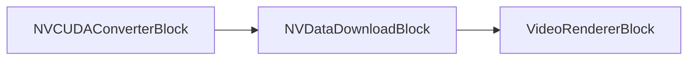
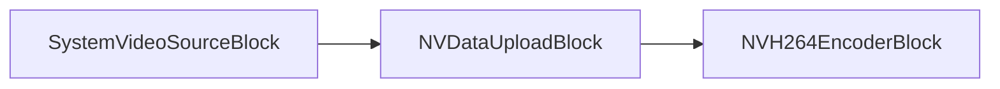
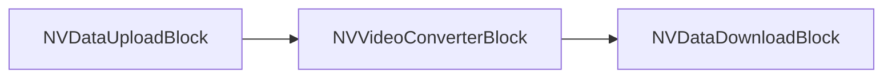
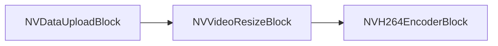
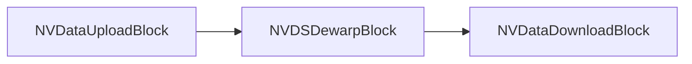

# Bloques Nvidia - VisioForge Media Blocks SDK .Net

[Media Blocks SDK .Net](https://www.visioforge.com/media-blocks-sdk-net){ .md-button .md-button--primary target="_blank" }

Los bloques Nvidia aprovechan las capacidades de GPU Nvidia para tareas de procesamiento de medios aceleradas como transferencia de datos, conversión de video y redimensionamiento.

## NVDataDownloadBlock

Bloque de descarga de datos Nvidia. Descarga datos desde GPU Nvidia a memoria del sistema.

#### Información del bloque

Nombre: NVDataDownloadBlock.

| Dirección del pin | Tipo de medio | Cantidad de pines |
| --- | :---: | :---: |
| Entrada de video | Video (memoria GPU) | 1 |
| Salida de video | Video (memoria del sistema) | 1 |

#### Pipeline de ejemplo



#### Código de ejemplo

```csharp
// crear pipeline
var pipeline = new MediaBlocksPipeline();

// crear una fuente que emita a memoria GPU (ej., un decodificador u otro bloque Nvidia)
// Por ejemplo, NVDataUploadBlock o un decodificador acelerado por NV
var upstreamNvidiaBlock = new NVDataUploadBlock(); // Conceptual: asuma que este bloque está correctamente configurado

// crear bloque de descarga de datos Nvidia
var nvDataDownload = new NVDataDownloadBlock();

// crear bloque renderizador de video
var videoRenderer = new VideoRendererBlock(pipeline, VideoView1); // Asumiendo que VideoView1 es su control de visualización

// conectar bloques
// pipeline.Connect(upstreamNvidiaBlock.Output, nvDataDownload.Input); // Conectar fuente GPU al bloque de descarga
// pipeline.Connect(nvDataDownload.Output, videoRenderer.Input); // Conectar bloque de descarga (memoria del sistema) al renderizador

// iniciar pipeline
// await pipeline.StartAsync();
```

#### Observaciones

Este bloque se usa para transferir datos de video desde la memoria de la GPU Nvidia a la memoria principal del sistema. Esto es típicamente necesario cuando un flujo de video procesado por GPU necesita ser accedido por un componente que opera en memoria del sistema, como un codificador basado en CPU o un renderizador de video estándar.
Asegúrese de que los drivers Nvidia correctos y el toolkit CUDA estén instalados para que este bloque funcione.
Use `NVDataDownloadBlock.IsAvailable()` para verificar si el bloque puede usarse.

#### Plataformas

Windows, Linux (Requiere GPU Nvidia y drivers/SDK apropiados).

## NVDataUploadBlock

Bloque de carga de datos Nvidia. Carga datos a GPU Nvidia desde memoria del sistema.

#### Información del bloque

Nombre: NVDataUploadBlock.

| Dirección del pin | Tipo de medio | Cantidad de pines |
| --- | :---: | :---: |
| Entrada de video | Video (memoria del sistema) | 1 |
| Salida de video | Video (memoria GPU) | 1 |

#### Pipeline de ejemplo



#### Código de ejemplo

```csharp
// crear pipeline
var pipeline = new MediaBlocksPipeline();

// crear una fuente de video (ej., SystemVideoSourceBlock o UniversalSourceBlock)
var videoSource = new UniversalSourceBlock(); // Conceptual: asuma que este bloque está correctamente configurado
// videoSource.Filename = "input.mp4";

// crear bloque de carga de datos Nvidia
var nvDataUpload = new NVDataUploadBlock();

// crear un codificador acelerado Nvidia (ej., NVH264EncoderBlock)
// var nvEncoder = new NVH264EncoderBlock(new NVH264EncoderSettings()); // Conceptual

// conectar bloques
// pipeline.Connect(videoSource.VideoOutput, nvDataUpload.Input); // Conectar fuente de memoria del sistema al bloque de carga
// pipeline.Connect(nvDataUpload.Output, nvEncoder.Input); // Conectar bloque de carga (memoria GPU) al codificador NV

// iniciar pipeline
// await pipeline.StartAsync();
```

#### Observaciones

Este bloque se usa para transferir datos de video desde la memoria principal del sistema a la memoria de la GPU Nvidia. Esto es típicamente un prerrequisito para usar bloques de procesamiento acelerados por Nvidia como codificadores, decodificadores o filtros que operan en memoria GPU.
Asegúrese de que los drivers Nvidia correctos y el toolkit CUDA estén instalados para que este bloque funcione.
Use `NVDataUploadBlock.IsAvailable()` para verificar si el bloque puede usarse.

#### Plataformas

Windows, Linux (Requiere GPU Nvidia y drivers/SDK apropiados).

## NVVideoConverterBlock

Bloque conversor de video Nvidia. Realiza conversiones de espacio de color y otras conversiones de formato de video usando la GPU Nvidia.

#### Información del bloque

Nombre: NVVideoConverterBlock.

| Dirección del pin | Tipo de medio | Cantidad de pines |
| --- | :---: | :---: |
| Entrada de video | Video (memoria GPU) | 1 |
| Salida de video | Video (memoria GPU, posiblemente formato diferente) | 1 |

#### Pipeline de ejemplo



#### Código de ejemplo

```csharp
// crear pipeline
var pipeline = new MediaBlocksPipeline();

// Asuma que los datos de video ya están en memoria GPU vía NVDataUploadBlock o un decodificador NV
// var nvUploadedSource = new NVDataUploadBlock(); // Conceptual
// pipeline.Connect(systemMemorySource.Output, nvUploadedSource.Input);


// crear bloque conversor de video Nvidia
var nvVideoConverter = new NVVideoConverterBlock();
// Configuraciones de conversión específicas podrían aplicarse aquí si el bloque tiene propiedades para ellas.

// Asuma que queremos descargar el video convertido de vuelta a memoria del sistema
// var nvDataDownload = new NVDataDownloadBlock(); // Conceptual

// conectar bloques
// pipeline.Connect(nvUploadedSource.Output, nvVideoConverter.Input);
// pipeline.Connect(nvVideoConverter.Output, nvDataDownload.Input);
// pipeline.Connect(nvDataDownload.Output, videoRenderer.Input); // O a otro componente de memoria del sistema

// iniciar pipeline
// await pipeline.StartAsync();
```

#### Observaciones

El `NVVideoConverterBlock` se usa para conversiones eficientes de formato de video (ej., espacio de color, formato de píxel) aprovechando la GPU Nvidia. Esto es frecuentemente más rápido que conversiones basadas en CPU, especialmente para video de alta resolución. Típicamente opera en datos de video ya presentes en memoria GPU.
Asegúrese de que los drivers Nvidia correctos y el toolkit CUDA estén instalados.
Use `NVVideoConverterBlock.IsAvailable()` para verificar si el bloque puede usarse.

#### Plataformas

Windows, Linux (Requiere GPU Nvidia y drivers/SDK apropiados).

## NVVideoResizeBlock

Bloque de redimensionamiento de video Nvidia. Redimensiona frames de video usando la GPU Nvidia.

#### Información del bloque

Nombre: NVVideoResizeBlock.

| Dirección del pin | Tipo de medio | Cantidad de pines |
| --- | :---: | :---: |
| Entrada de video | Video (memoria GPU) | 1 |
| Salida de video | Video (memoria GPU, redimensionado) | 1 |

#### Configuraciones

El `NVVideoResizeBlock` se configura usando un objeto `VisioForge.Core.Types.Size` pasado a su constructor.

- `Resolution` (`VisioForge.Core.Types.Size`): Especifica la resolución de salida objetivo (Ancho, Alto) para el video.

#### Pipeline de ejemplo



#### Código de ejemplo

```csharp
// crear pipeline
var pipeline = new MediaBlocksPipeline();

// Resolución objetivo para redimensionamiento
var targetResolution = new VisioForge.Core.Types.Size(1280, 720);

// Asuma que los datos de video ya están en memoria GPU vía NVDataUploadBlock o un decodificador NV
// var nvUploadedSource = new NVDataUploadBlock(); // Conceptual
// pipeline.Connect(systemMemorySource.Output, nvUploadedSource.Input);

// crear bloque de redimensionamiento de video Nvidia
var nvVideoResize = new NVVideoResizeBlock(targetResolution);

// Asuma que el video redimensionado será codificado por un codificador NV
// var nvEncoder = new NVH264EncoderBlock(new NVH264EncoderSettings()); // Conceptual

// conectar bloques
// pipeline.Connect(nvUploadedSource.Output, nvVideoResize.Input);
// pipeline.Connect(nvVideoResize.Output, nvEncoder.Input);

// iniciar pipeline
// await pipeline.StartAsync();
```

#### Observaciones

El `NVVideoResizeBlock` realiza operaciones de escalado de video eficientemente usando la GPU Nvidia. Esto es útil para adaptar flujos de video a diferentes resoluciones de pantalla o requisitos de codificación. Típicamente opera en datos de video ya presentes en memoria GPU.
Asegúrese de que los drivers Nvidia correctos y el toolkit CUDA estén instalados.
Use `NVVideoResizeBlock.IsAvailable()` para verificar si el bloque puede usarse.

#### Plataformas

Windows, Linux (Requiere GPU Nvidia y drivers/SDK apropiados).

## NVDSDewarpBlock

Bloque dewarp DeepStream Nvidia. Realiza transformaciones de dewarping para corrección de distorsión de cámaras ojo de pez y gran angular usando aceleración GPU.

#### Información del bloque

Nombre: NVDSDewarpBlock.

| Dirección del pin | Tipo de medio | Cantidad de pines |
| --- | :---: | :---: |
| Entrada de video | Video (memoria GPU) | 1 |
| Salida de video | Video (memoria GPU) | 1 |

#### Pipeline de ejemplo



#### Código de ejemplo

```csharp
// crear pipeline
var pipeline = new MediaBlocksPipeline();

// Cargar video a memoria GPU
var nvUpload = new NVDataUploadBlock();

// Configurar ajustes de dewarp para corrección de ojo de pez
var dewarpSettings = new NVDSDewarpSettings
{
    SourceType = DewarpSourceType.FisheyeCamera,
    ProjectionType = DewarpProjectionType.PushBroom,
    TopAngle = 180,
    BottomAngle = 180
};

// Crear bloque dewarp
var nvDewarp = new NVDSDewarpBlock(dewarpSettings);

// Descargar de GPU si es necesario
var nvDownload = new NVDataDownloadBlock();

// Conectar bloques
pipeline.Connect(nvUpload.Output, nvDewarp.Input);
pipeline.Connect(nvDewarp.Output, nvDownload.Input);

// Iniciar pipeline
await pipeline.StartAsync();
```

#### Observaciones

El `NVDSDewarpBlock` es parte del SDK DeepStream de Nvidia y proporciona dewarping acelerado por GPU para corregir distorsión de cámaras ojo de pez y gran angular. Esto es esencial para aplicaciones de vigilancia, automotrices y video de 360 grados.

Requiere SDK DeepStream de Nvidia y GPU compatible.
Use `NVDSDewarpBlock.IsAvailable()` para verificar disponibilidad.

#### Plataformas

Linux (Requiere SDK DeepStream de Nvidia, Jetson o GPU compatible).
