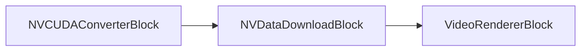
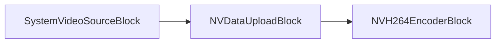
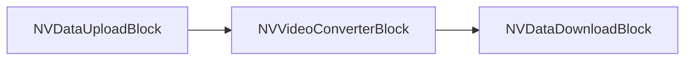
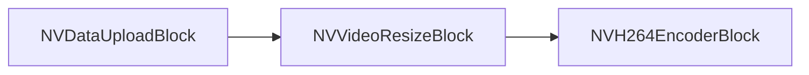
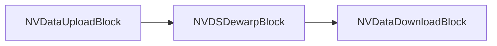

# Blocs Nvidia - VisioForge Media Blocks SDK .Net

[Media Blocks SDK .Net](https://www.visioforge.com/media-blocks-sdk-net){ .md-button .md-button--primary target="_blank" }

Les blocs Nvidia exploitent les capacités du GPU Nvidia pour accélérer les tâches de traitement multimédia telles que le transfert de données, la conversion vidéo et le redimensionnement.

## NVDataDownloadBlock

Bloc de téléchargement de données Nvidia. Récupère les données depuis le GPU Nvidia vers la mémoire système.

#### Informations sur le bloc

Nom : NVDataDownloadBlock.

| Direction du pin | Type de média | Nombre de pins |
| --- | :---: | :---: |
| Entrée vidéo | Vidéo (mémoire GPU) | 1 |
| Sortie vidéo | Vidéo (mémoire système) | 1 |

#### Pipeline d'exemple



#### Exemple de code

```csharp
// créer le pipeline
var pipeline = new MediaBlocksPipeline();

// créer une source qui émet vers la mémoire GPU (par ex. un décodeur ou un autre bloc Nvidia)
// Par exemple, NVDataUploadBlock ou un décodeur accéléré NV
var upstreamNvidiaBlock = new NVDataUploadBlock(); // Conceptuel : on suppose ce bloc correctement configuré

// créer le bloc de téléchargement de données Nvidia
var nvDataDownload = new NVDataDownloadBlock();

// créer le bloc moteur de rendu vidéo
var videoRenderer = new VideoRendererBlock(pipeline, VideoView1); // En supposant que VideoView1 est votre contrôle d'affichage

// connecter les blocs
// pipeline.Connect(upstreamNvidiaBlock.Output, nvDataDownload.Input); // Connecter la source GPU au bloc de téléchargement
// pipeline.Connect(nvDataDownload.Output, videoRenderer.Input); // Connecter le bloc de téléchargement (mémoire système) au moteur de rendu

// démarrer le pipeline
// await pipeline.StartAsync();
```

#### Remarques

Ce bloc sert à transférer les données vidéo depuis la mémoire du GPU Nvidia vers la mémoire système principale. C'est généralement nécessaire lorsqu'un flux vidéo traité sur GPU doit être consulté par un composant qui opère sur la mémoire système, comme un encodeur basé CPU ou un moteur de rendu vidéo standard.
Assurez-vous que les pilotes Nvidia et la boîte à outils CUDA appropriés sont installés pour que ce bloc fonctionne.
Utilisez `NVDataDownloadBlock.IsAvailable()` pour vérifier si le bloc peut être utilisé.

#### Plateformes

Windows, Linux (nécessite un GPU Nvidia et les pilotes/SDK appropriés).

## NVDataUploadBlock

Bloc de téléversement de données Nvidia. Téléverse les données vers le GPU Nvidia depuis la mémoire système.

#### Informations sur le bloc

Nom : NVDataUploadBlock.

| Direction du pin | Type de média | Nombre de pins |
| --- | :---: | :---: |
| Entrée vidéo | Vidéo (mémoire système) | 1 |
| Sortie vidéo | Vidéo (mémoire GPU) | 1 |

#### Pipeline d'exemple



#### Exemple de code

```csharp
// créer le pipeline
var pipeline = new MediaBlocksPipeline();

// créer une source vidéo (par ex. SystemVideoSourceBlock ou UniversalSourceBlock).
// UniversalSourceBlock requiert UniversalSourceSettings via la fabrique asynchrone :
var sourceSettings = await UniversalSourceSettings.CreateAsync(new Uri("input.mp4"));
var videoSource = new UniversalSourceBlock(sourceSettings);

// créer le bloc de téléversement de données Nvidia
var nvDataUpload = new NVDataUploadBlock();

// créer un encodeur accéléré Nvidia (par ex. NVH264EncoderBlock)
// var nvEncoder = new NVH264EncoderBlock(new NVH264EncoderSettings()); // Conceptuel

// connecter les blocs
// pipeline.Connect(videoSource.VideoOutput, nvDataUpload.Input); // Connecter la source mémoire système au bloc de téléversement
// pipeline.Connect(nvDataUpload.Output, nvEncoder.Input); // Connecter le bloc de téléversement (mémoire GPU) à l'encodeur NV

// démarrer le pipeline
// await pipeline.StartAsync();
```

#### Remarques

Ce bloc sert à transférer les données vidéo depuis la mémoire système principale vers la mémoire du GPU Nvidia. C'est généralement un préalable pour utiliser les blocs de traitement accélérés Nvidia tels que les encodeurs, décodeurs ou filtres qui opèrent sur la mémoire GPU.
Assurez-vous que les pilotes Nvidia et la boîte à outils CUDA appropriés sont installés pour que ce bloc fonctionne.
Utilisez `NVDataUploadBlock.IsAvailable()` pour vérifier si le bloc peut être utilisé.

#### Plateformes

Windows, Linux (nécessite un GPU Nvidia et les pilotes/SDK appropriés).

## NVVideoConverterBlock

Bloc convertisseur vidéo Nvidia. Effectue les conversions d'espace colorimétrique et autres conversions de format vidéo via le GPU Nvidia.

#### Informations sur le bloc

Nom : NVVideoConverterBlock.

| Direction du pin | Type de média | Nombre de pins |
| --- | :---: | :---: |
| Entrée vidéo | Vidéo (mémoire GPU) | 1 |
| Sortie vidéo | Vidéo (mémoire GPU, éventuellement dans un format différent) | 1 |

#### Pipeline d'exemple



#### Exemple de code

```csharp
// créer le pipeline
var pipeline = new MediaBlocksPipeline();

// On suppose que les données vidéo sont déjà en mémoire GPU via NVDataUploadBlock ou un décodeur NV
// var nvUploadedSource = new NVDataUploadBlock(); // Conceptuel
// pipeline.Connect(systemMemorySource.Output, nvUploadedSource.Input);


// créer le bloc convertisseur vidéo Nvidia
var nvVideoConverter = new NVVideoConverterBlock();
// Des paramètres de conversion spécifiques peuvent être appliqués ici si le bloc dispose de propriétés correspondantes.

// On suppose que l'on souhaite récupérer la vidéo convertie en mémoire système
// var nvDataDownload = new NVDataDownloadBlock(); // Conceptuel

// connecter les blocs
// pipeline.Connect(nvUploadedSource.Output, nvVideoConverter.Input);
// pipeline.Connect(nvVideoConverter.Output, nvDataDownload.Input);
// pipeline.Connect(nvDataDownload.Output, videoRenderer.Input); // Ou vers un autre composant en mémoire système

// démarrer le pipeline
// await pipeline.StartAsync();
```

#### Remarques

Le `NVVideoConverterBlock` est utilisé pour des conversions de format vidéo efficaces (par ex. espace colorimétrique, format de pixel) tirant parti du GPU Nvidia. C'est souvent plus rapide que les conversions basées CPU, surtout pour la vidéo haute résolution. Il opère généralement sur des données vidéo déjà présentes en mémoire GPU.
Assurez-vous que les pilotes Nvidia et la boîte à outils CUDA appropriés sont installés.
Utilisez `NVVideoConverterBlock.IsAvailable()` pour vérifier si le bloc peut être utilisé.

#### Plateformes

Windows, Linux (nécessite un GPU Nvidia et les pilotes/SDK appropriés).

## NVVideoResizeBlock

Bloc de redimensionnement vidéo Nvidia. Redimensionne les images vidéo à l'aide du GPU Nvidia.

#### Informations sur le bloc

Nom : NVVideoResizeBlock.

| Direction du pin | Type de média | Nombre de pins |
| --- | :---: | :---: |
| Entrée vidéo | Vidéo (mémoire GPU) | 1 |
| Sortie vidéo | Vidéo (mémoire GPU, redimensionnée) | 1 |

#### Paramètres

Le `NVVideoResizeBlock` est configuré au moyen d'un objet `VisioForge.Core.Types.Size` transmis à son constructeur.

- `Resolution` (`VisioForge.Core.Types.Size`) : spécifie la résolution de sortie cible (Width, Height) pour la vidéo.

#### Pipeline d'exemple



#### Exemple de code

```csharp
// créer le pipeline
var pipeline = new MediaBlocksPipeline();

// Résolution cible pour le redimensionnement
var targetResolution = new VisioForge.Core.Types.Size(1280, 720);

// On suppose que les données vidéo sont déjà en mémoire GPU via NVDataUploadBlock ou un décodeur NV
// var nvUploadedSource = new NVDataUploadBlock(); // Conceptuel
// pipeline.Connect(systemMemorySource.Output, nvUploadedSource.Input);

// créer le bloc de redimensionnement vidéo Nvidia
var nvVideoResize = new NVVideoResizeBlock(targetResolution);

// On suppose que la vidéo redimensionnée sera encodée par un encodeur NV
// var nvEncoder = new NVH264EncoderBlock(new NVH264EncoderSettings()); // Conceptuel

// connecter les blocs
// pipeline.Connect(nvUploadedSource.Output, nvVideoResize.Input);
// pipeline.Connect(nvVideoResize.Output, nvEncoder.Input);

// démarrer le pipeline
// await pipeline.StartAsync();
```

#### Remarques

Le `NVVideoResizeBlock` effectue efficacement les opérations de mise à l'échelle vidéo à l'aide du GPU Nvidia. C'est utile pour adapter les flux vidéo à différentes résolutions d'affichage ou exigences d'encodage. Il opère généralement sur des données vidéo déjà présentes en mémoire GPU.
Assurez-vous que les pilotes Nvidia et la boîte à outils CUDA appropriés sont installés.
Utilisez `NVVideoResizeBlock.IsAvailable()` pour vérifier si le bloc peut être utilisé.

#### Plateformes

Windows, Linux (nécessite un GPU Nvidia et les pilotes/SDK appropriés).

## NVDSDewarpBlock

Bloc de dewarp Nvidia DeepStream. Effectue les transformations de dewarp pour la correction des distorsions de caméras fisheye et grand angle à l'aide de l'accélération GPU.

#### Informations sur le bloc

Nom : NVDSDewarpBlock.

| Direction du pin | Type de média | Nombre de pins |
| --- | :---: | :---: |
| Entrée vidéo | Vidéo (mémoire GPU) | 1 |
| Sortie vidéo | Vidéo (mémoire GPU) | 1 |

#### Pipeline d'exemple



#### Exemple de code

```csharp
// créer le pipeline
var pipeline = new MediaBlocksPipeline();

// Téléverser la vidéo en mémoire GPU
var nvUpload = new NVDataUploadBlock();

// Configurer les paramètres de dewarp pour la correction fisheye. Les paramètres de calibration
// et de projection de la caméra sont dans le ConfigFile au format DeepStream ; l'objet de
// paramètres .NET ne contient que les réglages de haut niveau (id GPU, type de mémoire, id source, chemin du fichier de configuration).
var dewarpSettings = new NVDSDewarpSettings
{
    Enabled = true,
    NumSourcePlanes = 1,
    ConfigFile = "config_dewarper.txt",
    GpuId = 0,
    SourceId = 0
};

// Créer le bloc dewarp
var nvDewarp = new NVDSDewarpBlock(dewarpSettings);

// Récupérer depuis le GPU si nécessaire
var nvDownload = new NVDataDownloadBlock();

// Connecter les blocs
pipeline.Connect(nvUpload.Output, nvDewarp.Input);
pipeline.Connect(nvDewarp.Output, nvDownload.Input);

// Démarrer le pipeline
await pipeline.StartAsync();
```

#### Remarques

Le `NVDSDewarpBlock` fait partie du SDK DeepStream de Nvidia et fournit un dewarp accéléré par GPU pour corriger les distorsions des caméras fisheye et grand angle. Indispensable pour les applications de vidéosurveillance, automobiles et de vidéo 360 degrés.

Requiert le SDK Nvidia DeepStream et un GPU compatible.
Utilisez `NVDSDewarpBlock.IsAvailable()` pour vérifier la disponibilité.

#### Plateformes

Linux (nécessite le SDK Nvidia DeepStream, un GPU Jetson ou compatible).
