---
title: Guía de Bloques OpenCV para Media .Net
description: Ejecuta tareas de visión por computadora con bloques OpenCV: detección de objetos, seguimiento, manipulación de imágenes y procesamiento de video.
---

# Bloques OpenCV - VisioForge Media Blocks SDK .Net

[Media Blocks SDK .Net](https://www.visioforge.com/media-blocks-sdk-net){ .md-button .md-button--primary target="_blank" }

Los bloques OpenCV (Open Source Computer Vision Library) proporcionan potentes capacidades de procesamiento de video dentro del VisioForge Media Blocks SDK .Net. Estos bloques permiten una amplia gama de tareas de visión por computadora, desde manipulación básica de imágenes hasta detección y seguimiento de objetos complejos.

Para usar los bloques OpenCV, asegúrese de que el paquete NuGet VisioForge.CrossPlatform.OpenCV.Windows.x64 (o el paquete correspondiente para su plataforma) esté incluido en su proyecto.

La mayoría de los bloques OpenCV típicamente requieren un elemento `videoconvert` antes de ellos para asegurar que el flujo de video de entrada esté en un formato compatible. El SDK maneja esto internamente cuando inicializa el bloque.

## Bloque CV Dewarp

El bloque CV Dewarp aplica efectos de corrección de distorsión a un flujo de video, lo que puede corregir distorsiones de lentes gran angular, por ejemplo.

### Información del bloque

Nombre: `CVDewarpBlock` (elemento GStreamer: `dewarp`).

| Dirección del pin | Tipo de medio | Cantidad de pines |
|-------------------|:-------------:|:-----------------:|
| Entrada video | Video sin comprimir | 1 |
| Salida video | Video sin comprimir | 1 |

### Configuración

El `CVDewarpBlock` se configura usando `CVDewarpSettings`. Propiedades clave:

- `DisplayMode` (enum `CVDewarpDisplayMode`): Especifica el modo de visualización para la corrección de distorsión (ej., `SinglePanorama`, `DoublePanorama`). El valor predeterminado es `CVDewarpDisplayMode.SinglePanorama`.
- `InnerRadius` (double): Radio interior para la corrección de distorsión.
- `InterpolationMethod` (enum `CVDewarpInterpolationMode`): Método de interpolación utilizado (ej., `Bilinear`, `Bicubic`). El valor predeterminado es `CVDewarpInterpolationMode.Bilinear`.
- `OuterRadius` (double): Radio exterior para la corrección de distorsión.
- `XCenter` (double): Coordenada X del centro para la corrección de distorsión.
- `XRemapCorrection` (double): Factor de corrección de remapeo de coordenada X.
- `YCenter` (double): Coordenada Y del centro para la corrección de distorsión.
- `YRemapCorrection` (double): Factor de corrección de remapeo de coordenada Y.

### Pipeline de ejemplo

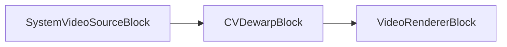

### Código de ejemplo

```csharp
var pipeline = new MediaBlocksPipeline();

// Asumiendo que SystemVideoSourceBlock ya está creado y configurado como 'videoSource'

// Crear configuración de Dewarp
var dewarpSettings = new CVDewarpSettings
{
    DisplayMode = CVDewarpDisplayMode.SinglePanorama, // Modo de ejemplo, el predeterminado es SinglePanorama
    InnerRadius = 0.2, // Valor de ejemplo
    OuterRadius = 0.8, // Valor de ejemplo
    XCenter = 0.5,     // Valor de ejemplo, el predeterminado es 0.5
    YCenter = 0.5,     // Valor de ejemplo, el predeterminado es 0.5
    // InterpolationMethod = CVDewarpInterpolationMode.Bilinear, // Este es el predeterminado
};

var dewarpBlock = new CVDewarpBlock(dewarpSettings);

var videoRenderer = new VideoRendererBlock(pipeline, VideoView1); // Asumiendo VideoView1

// Conectar bloques
pipeline.Connect(videoSource.Output, dewarpBlock.Input0);
pipeline.Connect(dewarpBlock.Output, videoRenderer.Input);

// Iniciar pipeline
await pipeline.StartAsync();
```

### Plataformas

Windows, macOS, Linux.

### Observaciones

Asegúrese de que el paquete NuGet VisioForge OpenCV esté referenciado en su proyecto.

## Bloque CV Dilate

El bloque CV Dilate realiza una operación de dilatación en el flujo de video. La dilatación es una operación morfológica que típicamente expande las regiones brillantes y reduce las regiones oscuras.

### Información del bloque

Nombre: `CVDilateBlock` (elemento GStreamer: `cvdilate`).

| Dirección del pin | Tipo de medio | Cantidad de pines |
|-------------------|:-------------:|:-----------------:|
| Entrada video | Video sin comprimir | 1 |
| Salida video | Video sin comprimir | 1 |

### Configuración

Este bloque no tiene configuraciones específicas más allá del comportamiento predeterminado. La dilatación se realiza con un elemento estructurante predeterminado.

### Pipeline de ejemplo

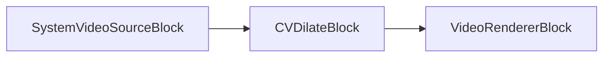

### Código de ejemplo

```csharp
var pipeline = new MediaBlocksPipeline();

// Asumiendo que SystemVideoSourceBlock ya está creado y configurado como 'videoSource'

var dilateBlock = new CVDilateBlock();

var videoRenderer = new VideoRendererBlock(pipeline, VideoView1); // Asumiendo VideoView1

// Conectar bloques
pipeline.Connect(videoSource.Output, dilateBlock.Input0);
pipeline.Connect(dilateBlock.Output, videoRenderer.Input);

// Iniciar pipeline
await pipeline.StartAsync();
```

### Plataformas

Windows, macOS, Linux.

### Observaciones

Asegúrese de que el paquete NuGet VisioForge OpenCV esté referenciado en su proyecto.

## Bloque CV Edge Detect

El bloque CV Edge Detect utiliza el algoritmo detector de bordes Canny para encontrar bordes en el flujo de video.

### Información del bloque

Nombre: `CVEdgeDetectBlock` (elemento GStreamer: `edgedetect`).

| Dirección del pin | Tipo de medio | Cantidad de pines |
|-------------------|:-------------:|:-----------------:|
| Entrada video | Video sin comprimir | 1 |
| Salida video | Video sin comprimir | 1 |

### Configuración

El `CVEdgeDetectBlock` se configura usando `CVEdgeDetectSettings`. Propiedades clave:

- `ApertureSize` (int): Tamaño de apertura para el operador Sobel (ej., 3, 5, o 7). El valor predeterminado es 3.
- `Threshold1` (int): Primer umbral para el procedimiento de histéresis. El valor predeterminado es 50.
- `Threshold2` (int): Segundo umbral para el procedimiento de histéresis. El valor predeterminado es 150.
- `Mask` (bool): Si es verdadero, la salida es una máscara; de lo contrario, es la imagen original con los bordes resaltados. El valor predeterminado es `false`.

### Pipeline de ejemplo

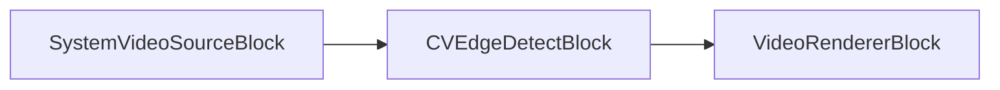

### Código de ejemplo

```csharp
var pipeline = new MediaBlocksPipeline();

// Asumiendo que SystemVideoSourceBlock ya está creado y configurado como 'videoSource'

var edgeDetectSettings = new CVEdgeDetectSettings
{
    ApertureSize = 3, // Valor de ejemplo, el predeterminado es 3
    Threshold1 = 2000, // Valor de ejemplo, el tipo C# es int, el predeterminado es 50
    Threshold2 = 4000, // Valor de ejemplo, el tipo C# es int, el predeterminado es 150
    Mask = true       // Valor de ejemplo, el predeterminado es false
};

var edgeDetectBlock = new CVEdgeDetectBlock(edgeDetectSettings);

var videoRenderer = new VideoRendererBlock(pipeline, VideoView1); // Asumiendo VideoView1

// Conectar bloques
pipeline.Connect(videoSource.Output, edgeDetectBlock.Input0);
pipeline.Connect(edgeDetectBlock.Output, videoRenderer.Input);

// Iniciar pipeline
await pipeline.StartAsync();
```

### Plataformas

Windows, macOS, Linux.

### Observaciones

Asegúrese de que el paquete NuGet VisioForge OpenCV esté referenciado en su proyecto.

## Bloque CV Equalize Histogram

El bloque CV Equalize Histogram ecualiza el histograma de un fotograma de video usando la función `cvEqualizeHist`. Esto típicamente mejora el contraste de la imagen.

### Información del bloque

Nombre: `CVEqualizeHistogramBlock` (elemento GStreamer: `cvequalizehist`).

| Dirección del pin | Tipo de medio | Cantidad de pines |
|-------------------|:-------------:|:-----------------:|
| Entrada video | Video sin comprimir | 1 |
| Salida video | Video sin comprimir | 1 |

### Configuración

Este bloque no tiene configuraciones específicas más allá del comportamiento predeterminado.

### Pipeline de ejemplo

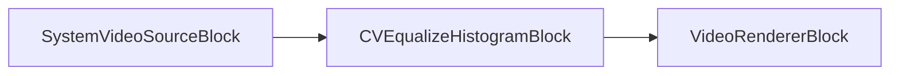

### Código de ejemplo

```csharp
var pipeline = new MediaBlocksPipeline();

// Asumiendo que SystemVideoSourceBlock ya está creado y configurado como 'videoSource'

var equalizeHistBlock = new CVEqualizeHistogramBlock();

var videoRenderer = new VideoRendererBlock(pipeline, VideoView1); // Asumiendo VideoView1

// Conectar bloques
pipeline.Connect(videoSource.Output, equalizeHistBlock.Input0);
pipeline.Connect(equalizeHistBlock.Output, videoRenderer.Input);

// Iniciar pipeline
await pipeline.StartAsync();
```

### Plataformas

Windows, macOS, Linux.

### Observaciones

Asegúrese de que el paquete NuGet VisioForge OpenCV esté referenciado en su proyecto.

## Bloque CV Erode

El bloque CV Erode realiza una operación de erosión en el flujo de video. La erosión es una operación morfológica que típicamente reduce las regiones brillantes y expande las regiones oscuras.

### Información del bloque

Nombre: `CVErodeBlock` (elemento GStreamer: `cverode`).

| Dirección del pin | Tipo de medio | Cantidad de pines |
|-------------------|:-------------:|:-----------------:|
| Entrada video | Video sin comprimir | 1 |
| Salida video | Video sin comprimir | 1 |

### Configuración

Este bloque no tiene configuraciones específicas más allá del comportamiento predeterminado. La erosión se realiza con un elemento estructurante predeterminado.

### Pipeline de ejemplo

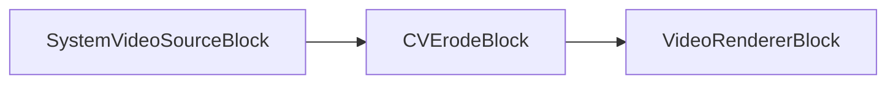

### Código de ejemplo

```csharp
var pipeline = new MediaBlocksPipeline();

// Asumiendo que SystemVideoSourceBlock ya está creado y configurado como 'videoSource'

var erodeBlock = new CVErodeBlock();

var videoRenderer = new VideoRendererBlock(pipeline, VideoView1); // Asumiendo VideoView1

// Conectar bloques
pipeline.Connect(videoSource.Output, erodeBlock.Input0);
pipeline.Connect(erodeBlock.Output, videoRenderer.Input);

// Iniciar pipeline
await pipeline.StartAsync();
```

### Plataformas

Windows, macOS, Linux.

### Observaciones

Asegúrese de que el paquete NuGet VisioForge OpenCV esté referenciado en su proyecto.

## Bloque CV Face Blur

El bloque CV Face Blur detecta rostros en el flujo de video y aplica un efecto de desenfoque a ellos.

### Información del bloque

Nombre: `CVFaceBlurBlock` (elemento GStreamer: `faceblur`).

| Dirección del pin | Tipo de medio | Cantidad de pines |
|-------------------|:-------------:|:-----------------:|
| Entrada video | Video sin comprimir | 1 |
| Salida video | Video sin comprimir | 1 |

### Configuración

El `CVFaceBlurBlock` se configura usando `CVFaceBlurSettings`. Propiedades clave:

- `MainCascadeFile` (string): Ruta al archivo XML para el clasificador en cascada Haar primario usado para detección de rostros (ej., `haarcascade_frontalface_default.xml`). El valor predeterminado es `"haarcascade_frontalface_default.xml"`.
- `MinNeighbors` (int): Número mínimo de vecinos que cada rectángulo candidato debe tener para retenerlo. El valor predeterminado es 3.
- `MinSize` (`Size`): Tamaño mínimo posible del objeto. Los objetos más pequeños que esto son ignorados. Valor predeterminado `new Size(30, 30)`.
- `ScaleFactor` (double): Cuánto se reduce el tamaño de la imagen en cada escala de imagen. El valor predeterminado es 1.25.

Nota: Se debe llamar a `ProcessPaths(Context)` en el objeto de configuración para asegurar la resolución correcta de rutas para archivos cascade.

### Pipeline de ejemplo

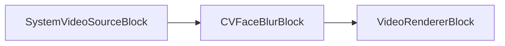

### Código de ejemplo

```csharp
var pipeline = new MediaBlocksPipeline();

// Asumiendo que SystemVideoSourceBlock ya está creado y configurado como 'videoSource'

var faceBlurSettings = new CVFaceBlurSettings
{
    MainCascadeFile = "haarcascade_frontalface_default.xml", // Ajustar ruta según sea necesario, este es el predeterminado
    MinNeighbors = 5, // Valor de ejemplo, el predeterminado es 3
    ScaleFactor = 1.2, // Valor de ejemplo, el predeterminado es 1.25
    // MinSize = new VisioForge.Core.Types.Size(30, 30) // Este es el predeterminado
};
// Es importante llamar a ProcessPaths si no está proporcionando una ruta absoluta
// y confía en los mecanismos internos del SDK para localizar el archivo, especialmente cuando se despliega.
// faceBlurSettings.ProcessPaths(pipeline.Context); // o pasar el contexto apropiado

var faceBlurBlock = new CVFaceBlurBlock(faceBlurSettings);

var videoRenderer = new VideoRendererBlock(pipeline, VideoView1); // Asumiendo VideoView1

// Conectar bloques
pipeline.Connect(videoSource.Output, faceBlurBlock.Input0);
pipeline.Connect(faceBlurBlock.Output, videoRenderer.Input);

// Iniciar pipeline
await pipeline.StartAsync();
```

### Plataformas

Windows, macOS, Linux.

### Observaciones

Este bloque requiere archivos XML de cascada Haar para detección de rostros. Estos archivos típicamente se incluyen con las distribuciones de OpenCV. Asegúrese de que la ruta a `MainCascadeFile` esté correctamente especificada. El método `ProcessPaths` en el objeto de configuración puede ayudar a resolver rutas si los archivos están colocados en ubicaciones estándar conocidas por el SDK.

## Bloque CV Face Detect

El bloque CV Face Detect detecta rostros, y opcionalmente ojos, narices y bocas, en el flujo de video usando clasificadores en cascada Haar.

### Información del bloque

Nombre: `CVFaceDetectBlock` (elemento GStreamer: `facedetect`).

| Dirección del pin | Tipo de medio | Cantidad de pines |
|-------------------|:-------------:|:-----------------:|
| Entrada video | Video sin comprimir | 1 |
| Salida video | Video sin comprimir | 1 |

### Configuración

El `CVFaceDetectBlock` se configura usando `CVFaceDetectSettings`. Propiedades clave:

- `Display` (bool): Si es `true`, dibuja rectángulos alrededor de las características detectadas en el video de salida. El valor predeterminado es `true`.
- `MainCascadeFile` (string): Ruta al XML para la cascada Haar primaria. El valor predeterminado es `"haarcascade_frontalface_default.xml"`.
- `EyesCascadeFile` (string): Ruta al XML para detección de ojos. El valor predeterminado es `"haarcascade_mcs_eyepair_small.xml"`. Opcional.
- `NoseCascadeFile` (string): Ruta al XML para detección de nariz. El valor predeterminado es `"haarcascade_mcs_nose.xml"`. Opcional.
- `MouthCascadeFile` (string): Ruta al XML para detección de boca. El valor predeterminado es `"haarcascade_mcs_mouth.xml"`. Opcional.
- `MinNeighbors` (int): Vecinos mínimos para retención de candidatos. Predeterminado 3.
- `MinSize` (`Size`): Tamaño mínimo del objeto. Predeterminado `new Size(30, 30)`.
- `MinDeviation` (int): Desviación estándar mínima. Predeterminado 0.
- `ScaleFactor` (double): Factor de reducción del tamaño de imagen en cada escala. Predeterminado 1.25.
- `UpdatesMode` (enum `CVFaceDetectUpdates`): Controla cómo se publican las actualizaciones/eventos (`EveryFrame`, `OnChange`, `OnFace`, `None`). Predeterminado `CVFaceDetectUpdates.EveryFrame`.

Nota: Se debe llamar a `ProcessPaths(Context)` en el objeto de configuración para archivos cascade.

### Eventos

- `FaceDetected`: Ocurre cuando se detectan rostros (y otras características habilitadas). Proporciona `CVFaceDetectedEventArgs` con un array de objetos `CVFace` y una marca de tiempo.
  - `CVFace` contiene `Rect` para `Position`, `Nose`, `Mouth`, y una lista de `Rect` para `Eyes`.

### Pipeline de ejemplo

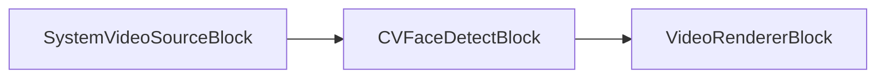

### Código de ejemplo

```csharp
var pipeline = new MediaBlocksPipeline();

// Asumiendo que SystemVideoSourceBlock ya está creado y configurado como 'videoSource'

var faceDetectSettings = new CVFaceDetectSettings
{
    MainCascadeFile = "haarcascade_frontalface_default.xml", // Ajustar ruta, predeterminado
    EyesCascadeFile = "haarcascade_mcs_eyepair_small.xml", // Ajustar ruta, predeterminado, opcional
    // NoseCascadeFile = "haarcascade_mcs_nose.xml", // Opcional, predeterminado
    // MouthCascadeFile = "haarcascade_mcs_mouth.xml", // Opcional, predeterminado
    Display = true, // Predeterminado
    UpdatesMode = CVFaceDetectUpdates.EveryFrame, // Predeterminado, valores posibles: EveryFrame, OnChange, OnFace, None
    MinNeighbors = 5, // Valor de ejemplo, el predeterminado es 3
    ScaleFactor = 1.2, // Valor de ejemplo, el predeterminado es 1.25
    // MinSize = new VisioForge.Core.Types.Size(30,30) // Predeterminado
};
// faceDetectSettings.ProcessPaths(pipeline.Context); // o contexto apropiado

var faceDetectBlock = new CVFaceDetectBlock(faceDetectSettings);

faceDetectBlock.FaceDetected += (s, e) => 
{
    Console.WriteLine($"Marca de tiempo: {e.Timestamp}, Rostros encontrados: {e.Faces.Length}");
    foreach (var face in e.Faces)
    {
        Console.WriteLine($"  Rostro en [{face.Position.Left},{face.Position.Top},{face.Position.Width},{face.Position.Height}]");
        if (face.Eyes.Any())
        {
            Console.WriteLine($"    Ojos en [{face.Eyes[0].Left},{face.Eyes[0].Top},{face.Eyes[0].Width},{face.Eyes[0].Height}]");
        }
    }
};

var videoRenderer = new VideoRendererBlock(pipeline, VideoView1); // Asumiendo VideoView1

// Conectar bloques
pipeline.Connect(videoSource.Output, faceDetectBlock.Input0);
pipeline.Connect(faceDetectBlock.Output, videoRenderer.Input);

// Iniciar pipeline
await pipeline.StartAsync();
```

### Plataformas

Windows, macOS, Linux.

### Observaciones

Requiere archivos XML de cascada Haar. El método `ProcessBusMessage` en la clase C# maneja el análisis de mensajes del elemento GStreamer para disparar el evento `FaceDetected`.

## Bloque CV Hand Detect

El bloque CV Hand Detect detecta gestos de mano (puño o palma) en el flujo de video usando clasificadores en cascada Haar. Internamente redimensiona el video de entrada a 320x240 para el procesamiento.

### Información del bloque

Nombre: `CVHandDetectBlock` (elemento GStreamer: `handdetect`).

| Dirección del pin | Tipo de medio | Cantidad de pines |
|-------------------|:-------------:|:-----------------:|
| Entrada video | Video sin comprimir | 1 |
| Salida video | Video sin comprimir | 1 |

### Configuración

El `CVHandDetectBlock` se configura usando `CVHandDetectSettings`. Propiedades clave:

- `Display` (bool): Si es `true`, dibuja rectángulos alrededor de las manos detectadas en el video de salida. El valor predeterminado es `true`.
- `FistCascadeFile` (string): Ruta al XML para detección de puño. El valor predeterminado es `"fist.xml"`.
- `PalmCascadeFile` (string): Ruta al XML para detección de palma. El valor predeterminado es `"palm.xml"`.
- `ROI` (`Rect`): Región de Interés para la detección. Las coordenadas son relativas a la imagen procesada de 320x240. Predeterminado (0,0,0,0) - fotograma completo (corresponde a `new Rect()`).

Nota: Se debe llamar a `ProcessPaths(Context)` en el objeto de configuración para archivos cascade.

### Eventos

- `HandDetected`: Ocurre cuando se detectan manos. Proporciona `CVHandDetectedEventArgs` con un array de objetos `CVHand`.
  - `CVHand` contiene `Rect` para `Position` y `CVHandGesture` para `Gesture` (Fist o Palm).

### Pipeline de ejemplo

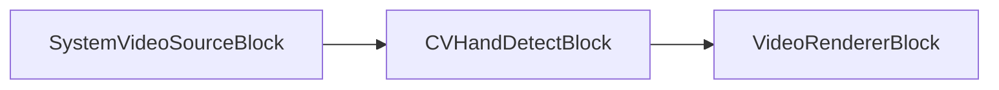

Nota: El `CVHandDetectBlock` internamente incluye un elemento `videoscale` para redimensionar la entrada a 320x240 antes del elemento GStreamer `handdetect`.

### Código de ejemplo

```csharp
var pipeline = new MediaBlocksPipeline();

// Asumiendo que SystemVideoSourceBlock ya está creado y configurado como 'videoSource'

var handDetectSettings = new CVHandDetectSettings
{
    FistCascadeFile = "fist.xml", // Ajustar ruta, predeterminado
    PalmCascadeFile = "palm.xml", // Ajustar ruta, predeterminado
    Display = true, // Predeterminado
    ROI = new VisioForge.Core.Types.Rect(0, 0, 320, 240) // Ejemplo: fotograma completo de imagen escalada, predeterminado es new Rect()
};
// handDetectSettings.ProcessPaths(pipeline.Context); // o contexto apropiado

var handDetectBlock = new CVHandDetectBlock(handDetectSettings);

handDetectBlock.HandDetected += (s, e) => 
{
    Console.WriteLine($"Manos encontradas: {e.Hands.Length}");
    foreach (var hand in e.Hands)
    {
        Console.WriteLine($"  Mano en [{hand.Position.Left},{hand.Position.Top},{hand.Position.Width},{hand.Position.Height}], Gesto: {hand.Gesture}");
    }
};

var videoRenderer = new VideoRendererBlock(pipeline, VideoView1); // Asumiendo VideoView1

// Conectar bloques
pipeline.Connect(videoSource.Output, handDetectBlock.Input0);
pipeline.Connect(handDetectBlock.Output, videoRenderer.Input);

// Iniciar pipeline
await pipeline.StartAsync();
```

### Plataformas

Windows, macOS, Linux.

### Observaciones

Requiere archivos XML de cascada Haar para detección de puño y palma. El video de entrada es escalado internamente a 320x240 para el procesamiento por el elemento `handdetect`. El método `ProcessBusMessage` maneja los mensajes de GStreamer para disparar `HandDetected`.

## Bloque CV Laplace

El bloque CV Laplace aplica un operador de Laplace al flujo de video, que resalta regiones de cambio rápido de intensidad, frecuentemente usado para detección de bordes.

### Información del bloque

Nombre: `CVLaplaceBlock` (elemento GStreamer: `cvlaplace`).

| Dirección del pin | Tipo de medio | Cantidad de pines |
|-------------------|:-------------:|:-----------------:|
| Entrada video | Video sin comprimir | 1 |
| Salida video | Video sin comprimir | 1 |

### Configuración

El `CVLaplaceBlock` se configura usando `CVLaplaceSettings`. Propiedades clave:

- `ApertureSize` (int): Tamaño de apertura para el operador Sobel usado internamente (ej., 1, 3, 5, o 7). Predeterminado 3.
- `Scale` (double): Factor de escala opcional para los valores Laplacianos calculados. Predeterminado 1.
- `Shift` (double): Valor delta opcional que se añade a los resultados antes de almacenarlos. Predeterminado 0.
- `Mask` (bool): Si es verdadero, la salida es una máscara; de lo contrario, es la imagen original con el efecto aplicado. El valor predeterminado es true.

### Pipeline de ejemplo

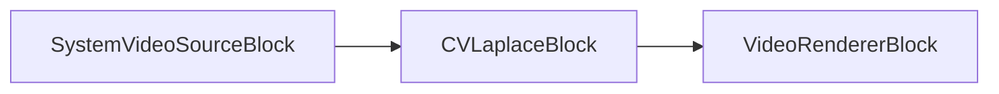

### Código de ejemplo

```csharp
var pipeline = new MediaBlocksPipeline();

// Asumiendo que SystemVideoSourceBlock ya está creado y configurado como 'videoSource'

var laplaceSettings = new CVLaplaceSettings
{
    ApertureSize = 3, // Valor de ejemplo
    Scale = 1.0,      // Valor de ejemplo
    Shift = 0.0,      // Valor de ejemplo
    Mask = true
};

var laplaceBlock = new CVLaplaceBlock(laplaceSettings);

var videoRenderer = new VideoRendererBlock(pipeline, VideoView1); // Asumiendo VideoView1

// Conectar bloques
pipeline.Connect(videoSource.Output, laplaceBlock.Input0);
pipeline.Connect(laplaceBlock.Output, videoRenderer.Input);

// Iniciar pipeline
await pipeline.StartAsync();
```

### Plataformas

Windows, macOS, Linux.

### Observaciones

Asegúrese de que el paquete NuGet VisioForge OpenCV esté referenciado en su proyecto.

## Bloque CV Motion Cells

El bloque CV Motion Cells detecta movimiento en un flujo de video dividiendo el fotograma en una cuadrícula de celdas y analizando cambios dentro de estas celdas.

### Información del bloque

Nombre: `CVMotionCellsBlock` (elemento GStreamer: `motioncells`).

| Dirección del pin | Tipo de medio | Cantidad de pines |
|-------------------|:-------------:|:-----------------:|
| Entrada video | Video sin comprimir | 1 |
| Salida video | Video sin comprimir | 1 |

### Configuración

El `CVMotionCellsBlock` se configura usando `CVMotionCellsSettings`. Propiedades clave:

- `CalculateMotion` (bool): Habilitar o deshabilitar el cálculo de movimiento. Predeterminado `true`.
- `CellsColor` (`SKColor`): Color para dibujar las celdas de movimiento si `Display` es true. Predeterminado `SKColors.Red`.
- `DataFile` (string): Ruta a un archivo de datos para cargar/guardar configuración de celdas. La extensión se maneja por separado con `DataFileExtension`.
- `DataFileExtension` (string): Extensión para el archivo de datos (ej., "dat").
- `Display` (bool): Si es `true`, dibuja la cuadrícula e indicación de movimiento en el video de salida. Predeterminado `true`.
- `Gap` (`TimeSpan`): Intervalo después del cual el movimiento se considera terminado y se publica un mensaje de bus "movimiento terminado". Predeterminado `TimeSpan.FromSeconds(5)`. (Nota: Esto es diferente de un espacio de píxeles entre celdas).
- `GridSize` (`Size`): Número de celdas en la cuadrícula (Ancho x Alto). Predeterminado `new Size(10, 10)`.
- `MinimumMotionFrames` (int): Número mínimo de fotogramas en que el movimiento debe detectarse en una celda para activar. Predeterminado 1.
- `MotionCellsIdx` (string): Cadena separada por comas de índices de celdas (ej., "0:0,1:1") para monitorear movimiento.
- `MotionCellBorderThickness` (int): Grosor del borde para celdas con movimiento detectado. Predeterminado 1.
- `MotionMaskCellsPos` (string): Cadena que define posiciones de celdas para una máscara de movimiento.
- `MotionMaskCoords` (string): Cadena que define coordenadas para una máscara de movimiento.
- `PostAllMotion` (bool): Publicar todos los eventos de movimiento. Predeterminado `false`.
- `PostNoMotion` (`TimeSpan`): Tiempo después del cual se publica un evento "sin movimiento" si no se detecta movimiento. Predeterminado `TimeSpan.Zero` (deshabilitado).
- `Sensitivity` (double): Sensibilidad al movimiento. El rango esperado puede ser 0.0 a 1.0. Predeterminado `0.5`.
- `Threshold` (double): Umbral para detección de movimiento, representando la fracción de celdas que necesitan haberse movido. Predeterminado `0.01`.
- `UseAlpha` (bool): Usar canal alfa para dibujar. Predeterminado `true`.

### Eventos

- `MotionDetected`: Ocurre cuando se detecta movimiento o cambia de estado. Proporciona `CVMotionCellsEventArgs`:
  - `Cells`: Cadena indicando qué celdas tienen movimiento (ej., "0:0,1:2").
  - `StartedTime`: Marca de tiempo cuando el movimiento comenzó en el alcance del evento actual.
  - `FinishedTime`: Marca de tiempo cuando el movimiento terminó (si aplica al evento).
  - `CurrentTime`: Marca de tiempo del fotograma actual relacionado con el evento.
  - `IsMotion`: Booleano indicando si el evento significa movimiento (`true`) o sin movimiento (`false`).

### Pipeline de ejemplo

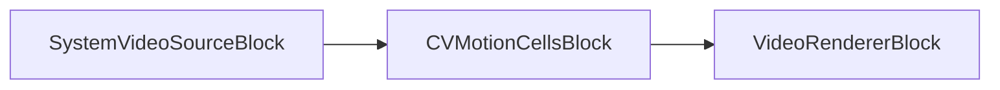

### Código de ejemplo

```csharp
var pipeline = new MediaBlocksPipeline();

// Asumiendo que SystemVideoSourceBlock ya está creado y configurado como 'videoSource'

var motionCellsSettings = new CVMotionCellsSettings
{
    GridSize = new VisioForge.Core.Types.Size(8, 6), // Ejemplo: cuadrícula 8x6, predeterminado es new Size(10,10)
    Sensitivity = 0.75, // Valor de ejemplo, el predeterminado de C# es 0.5. Representa sensibilidad.
    Threshold = 0.05,   // Valor de ejemplo, el predeterminado de C# es 0.01. Representa fracción de celdas movidas.
    Display = true,     // Predeterminado es true
    CellsColor = SKColors.Aqua, // Color de ejemplo, predeterminado es SKColors.Red
    PostNoMotion = TimeSpan.FromSeconds(5) // Publicar no_motion después de 5s de inactividad, predeterminado es TimeSpan.Zero
};

var motionCellsBlock = new CVMotionCellsBlock(motionCellsSettings);

motionCellsBlock.MotionDetected += (s, e) => 
{
    if (e.IsMotion)
    {
        Console.WriteLine($"Movimiento DETECTADO en {e.CurrentTime}. Celdas: {e.Cells}. Iniciado: {e.StartedTime}");
    }
    else
    {
        Console.WriteLine($"Movimiento TERMINADO o SIN MOVIMIENTO en {e.CurrentTime}. Terminado: {e.FinishedTime}");
    }
};

var videoRenderer = new VideoRendererBlock(pipeline, VideoView1); // Asumiendo VideoView1

// Conectar bloques
pipeline.Connect(videoSource.Output, motionCellsBlock.Input0);
pipeline.Connect(motionCellsBlock.Output, videoRenderer.Input);

// Iniciar pipeline
await pipeline.StartAsync();
```

### Plataformas

Windows, macOS, Linux.

### Observaciones

El método `ProcessBusMessage` maneja los mensajes de GStreamer para disparar `MotionDetected`. La estructura del evento proporciona marcas de tiempo para inicio de movimiento, finalización y tiempo del evento actual.

## Bloque CV Smooth

El bloque CV Smooth aplica varios filtros de suavizado (desenfoque) al flujo de video.

### Información del bloque

Nombre: `CVSmoothBlock` (elemento GStreamer: `cvsmooth`).

| Dirección del pin | Tipo de medio | Cantidad de pines |
|-------------------|:-------------:|:-----------------:|
| Entrada video | Video sin comprimir | 1 |
| Salida video | Video sin comprimir | 1 |

### Configuración

El `CVSmoothBlock` se configura usando `CVSmoothSettings`. Propiedades clave:

- `Type` (enum `CVSmoothType`): Tipo de filtro de suavizado a aplicar (`Blur`, `Gaussian`, `Median`, `Bilateral`). Predeterminado `CVSmoothType.Gaussian`.
- `KernelWidth` (int): Ancho del kernel para filtros `Blur`, `Gaussian`, `Median`. Predeterminado 3.
- `KernelHeight` (int): Alto del kernel para filtros `Blur`, `Gaussian`, `Median`. Predeterminado 3.
- `Width` (int): Ancho del área a desenfocar. Predeterminado `int.MaxValue` (fotograma completo).
- `Height` (int): Alto del área a desenfocar. Predeterminado `int.MaxValue` (fotograma completo).
- `PositionX` (int): Posición X para el área de desenfoque. Predeterminado 0.
- `PositionY` (int): Posición Y para el área de desenfoque. Predeterminado 0.
- `Color` (double): Sigma para espacio de color (para filtro Bilateral) o desviación estándar (para Gaussian si `SpatialSigma` es 0). Predeterminado 0.
- `SpatialSigma` (double): Sigma para espacio de coordenadas (para filtros Bilateral y Gaussian). Para Gaussian, si es 0, se calcula desde `KernelWidth`/`KernelHeight`. Predeterminado 0.

### Pipeline de ejemplo

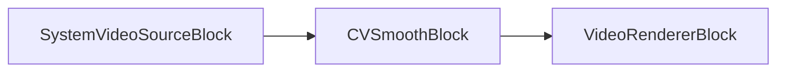

### Código de ejemplo

```csharp
var pipeline = new MediaBlocksPipeline();

// Asumiendo que SystemVideoSourceBlock ya está creado y configurado como 'videoSource'

var smoothSettings = new CVSmoothSettings
{
    Type = CVSmoothType.Gaussian, // Ejemplo: desenfoque Gaussian, también el predeterminado
    KernelWidth = 5,  // Ancho del kernel, predeterminado es 3
    KernelHeight = 5, // Alto del kernel, predeterminado es 3
    SpatialSigma = 1.5 // Sigma para Gaussian. Si es 0 (predeterminado), se calcula del tamaño del kernel.
};

var smoothBlock = new CVSmoothBlock(smoothSettings);

var videoRenderer = new VideoRendererBlock(pipeline, VideoView1); // Asumiendo VideoView1

// Conectar bloques
pipeline.Connect(videoSource.Output, smoothBlock.Input0);
pipeline.Connect(smoothBlock.Output, videoRenderer.Input);

// Iniciar pipeline
await pipeline.StartAsync();
```

### Plataformas

Windows, macOS, Linux.

### Observaciones

Asegúrese de que el paquete NuGet VisioForge OpenCV esté referenciado en su proyecto. Los parámetros específicos usados por el elemento GStreamer (`color`, `spatial`, `kernel-width`, `kernel-height`) dependen del `Type` elegido. Para dimensiones del kernel, use `KernelWidth` y `KernelHeight`. `Width` y `Height` definen el área para aplicar el desenfoque si no es el fotograma completo.

## Bloque CV Sobel

El bloque CV Sobel aplica un operador Sobel al flujo de video, que se usa para calcular la derivada de una función de intensidad de imagen, típicamente para detección de bordes.

### Información del bloque

Nombre: `CVSobelBlock` (elemento GStreamer: `cvsobel`).

| Dirección del pin | Tipo de medio | Cantidad de pines |
|-------------------|:-------------:|:-----------------:|
| Entrada video | Video sin comprimir | 1 |
| Salida video | Video sin comprimir | 1 |

### Configuración

El `CVSobelBlock` se configura usando `CVSobelSettings`. Propiedades clave:

- `XOrder` (int): Orden de la derivada x. Predeterminado 1.
- `YOrder` (int): Orden de la derivada y. Predeterminado 1.
- `ApertureSize` (int): Tamaño del kernel Sobel extendido (1, 3, 5, o 7). Predeterminado 3.
- `Mask` (bool): Si es verdadero, la salida es una máscara; de lo contrario, es la imagen original con el efecto aplicado. El valor predeterminado es true.

### Pipeline de ejemplo

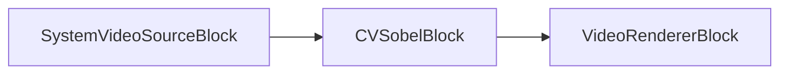

### Código de ejemplo

```csharp
var pipeline = new MediaBlocksPipeline();

// Asumiendo que SystemVideoSourceBlock ya está creado y configurado como 'videoSource'

var sobelSettings = new CVSobelSettings
{
    XOrder = 1,       // Predeterminado es 1. Usado para orden de la derivada X.
    YOrder = 0,       // Ejemplo: Usar 0 para orden Y para detectar principalmente bordes verticales. El predeterminado de la clase C# es 1.
    ApertureSize = 3, // Predeterminado es 3. Tamaño del kernel Sobel extendido.
    Mask = true       // Predeterminado es true. Salida como máscara.
};

var sobelBlock = new CVSobelBlock(sobelSettings);

var videoRenderer = new VideoRendererBlock(pipeline, VideoView1); // Asumiendo VideoView1

// Conectar bloques
pipeline.Connect(videoSource.Output, sobelBlock.Input0);
pipeline.Connect(sobelBlock.Output, videoRenderer.Input);

// Iniciar pipeline
await pipeline.StartAsync();
```

### Plataformas

Windows, macOS, Linux.

### Observaciones

Asegúrese de que el paquete NuGet VisioForge OpenCV esté referenciado en su proyecto.

## Bloque CV Template Match

El bloque CV Template Match busca ocurrencias de una imagen plantilla dentro del flujo de video.

### Información del bloque

Nombre: `CVTemplateMatchBlock` (elemento GStreamer: `templatematch`).

| Dirección del pin | Tipo de medio | Cantidad de pines |
|-------------------|:-------------:|:-----------------:|
| Entrada video | Video sin comprimir | 1 |
| Salida video | Video sin comprimir | 1 |

### Configuración

El `CVTemplateMatchBlock` se configura usando `CVTemplateMatchSettings`. Propiedades clave:

- `TemplateImage` (string): Ruta al archivo de imagen plantilla (ej., PNG, JPG) a buscar.
- `Method` (enum `CVTemplateMatchMethod`): El método de comparación a usar (ej., `Sqdiff`, `CcorrNormed`, `CcoeffNormed`). Predeterminado `CVTemplateMatchMethod.Correlation`.
- `Display` (bool): Si es `true`, dibuja un rectángulo alrededor de la mejor coincidencia en el video de salida. Predeterminado `true`.

### Eventos

- `TemplateMatch`: Ocurre cuando se encuentra una coincidencia de plantilla. Proporciona `CVTemplateMatchEventArgs`:
  - `Rect`: Un objeto `Types.Rect` representando la ubicación (x, y, ancho, alto) de la mejor coincidencia.
  - `Result`: Un valor double representando la calidad o resultado de la coincidencia, dependiendo del método usado.

### Pipeline de ejemplo

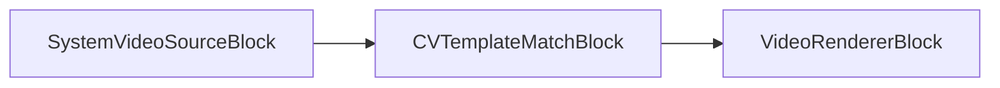

### Código de ejemplo

```csharp
var pipeline = new MediaBlocksPipeline();

// Asumiendo que SystemVideoSourceBlock ya está creado y configurado como 'videoSource'
// Asegúrese de que "template.png" existe y es accesible.
var templateMatchSettings = new CVTemplateMatchSettings("ruta/a/su/template.png") // Ajustar ruta según sea necesario
{
    // Method: Especifica el método de comparación.
    // Ejemplo: CVTemplateMatchMethod.CcoeffNormed es frecuentemente una buena elección.
    // El predeterminado de la clase C# es CVTemplateMatchMethod.Correlation.
    Method = CVTemplateMatchMethod.CcoeffNormed, 
    
    // Display: Si es true, dibuja un rectángulo alrededor de la mejor coincidencia.
    // El predeterminado de la clase C# es true.
    Display = true 
};

var templateMatchBlock = new CVTemplateMatchBlock(templateMatchSettings);

templateMatchBlock.TemplateMatch += (s, e) => 
{
    Console.WriteLine($"Plantilla coincidente en [{e.Rect.Left},{e.Rect.Top},{e.Rect.Width},{e.Rect.Height}] con resultado: {e.Result}");
};

var videoRenderer = new VideoRendererBlock(pipeline, VideoView1); // Asumiendo VideoView1

// Conectar bloques
pipeline.Connect(videoSource.Output, templateMatchBlock.Input0);
pipeline.Connect(templateMatchBlock.Output, videoRenderer.Input);

// Iniciar pipeline
await pipeline.StartAsync();
```

### Plataformas

Windows, macOS, Linux.

### Observaciones

Asegúrese de que el paquete NuGet VisioForge OpenCV y un archivo de imagen plantilla válido estén disponibles. El método `ProcessBusMessage` maneja los mensajes de GStreamer para disparar el evento `TemplateMatch`.

## Bloque CV Text Overlay

El bloque CV Text Overlay renderiza texto sobre el flujo de video usando funciones de dibujo de OpenCV.

### Información del bloque

Nombre: `CVTextOverlayBlock` (elemento GStreamer: `opencvtextoverlay`).

| Dirección del pin | Tipo de medio | Cantidad de pines |
|-------------------|:-------------:|:-----------------:|
| Entrada video | Video sin comprimir | 1 |
| Salida video | Video sin comprimir | 1 |

### Configuración

El `CVTextOverlayBlock` se configura usando `CVTextOverlaySettings`. Propiedades clave:

- `Text` (string): La cadena de texto a superponer. Predeterminado: `"Default text"`.
- `X` (int): Coordenada X de la esquina inferior izquierda de la cadena de texto. Predeterminado: `50`.
- `Y` (int): Coordenada Y de la esquina inferior izquierda de la cadena de texto (desde arriba, el origen de OpenCV es arriba-izquierda, el textoverlay de GStreamer podría ser abajo-izquierda). Predeterminado: `50`.
- `FontWidth` (double): Factor de escala de fuente que se multiplica por el tamaño base específico de la fuente. Predeterminado: `1.0`.
- `FontHeight` (double): Factor de escala de fuente (similar a FontWidth, aunque el elemento GStreamer usualmente tiene un `font-scale` o depende del tamaño en puntos). Predeterminado: `1.0`.
- `FontThickness` (int): Grosor de las líneas usadas para dibujar texto. Predeterminado: `1`.
- `Color` (`SKColor`): Color del texto. Predeterminado: `SKColors.Black`.

### Pipeline de ejemplo

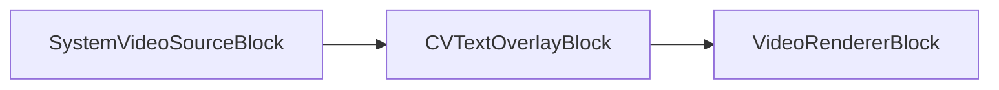

### Código de ejemplo

```csharp
var pipeline = new MediaBlocksPipeline();

// Asumiendo que SystemVideoSourceBlock ya está creado y configurado como 'videoSource'

var textOverlaySettings = new CVTextOverlaySettings
{
    Text = "¡VisioForge MediaBlocks.Net ES GENIAL!", // Predeterminado: "Default text"
    X = 20, // Posición X del inicio del texto. Predeterminado: 50
    Y = 40, // Posición Y de la línea base del texto (desde arriba). Predeterminado: 50
    FontWidth = 1.2, // Escala de fuente. Predeterminado: 1.0
    FontHeight = 1.2, // Escala de fuente (usualmente FontWidth es suficiente para opencvtextoverlay). Predeterminado: 1.0
    FontThickness = 2, // Predeterminado: 1
    Color = SKColors.Blue // Predeterminado: SKColors.Black
};

var textOverlayBlock = new CVTextOverlayBlock(textOverlaySettings);

var videoRenderer = new VideoRendererBlock(pipeline, VideoView1); // Asumiendo VideoView1

// Conectar bloques
pipeline.Connect(videoSource.Output, textOverlayBlock.Input0);
pipeline.Connect(textOverlayBlock.Output, videoRenderer.Input);

// Iniciar pipeline
await pipeline.StartAsync();
```

### Plataformas

Windows, macOS, Linux.

### Observaciones

Asegúrese de que el paquete NuGet VisioForge OpenCV esté referenciado. Las propiedades de GStreamer `colorR`, `colorG`, `colorB` se establecen basándose en la propiedad `Color`.

## Bloque CV Tracker

El bloque CV Tracker implementa varios algoritmos de seguimiento de objetos para seguir un objeto definido por un cuadro delimitador inicial en un flujo de video.

### Información del bloque

Nombre: `CVTrackerBlock` (elemento GStreamer: `cvtracker`).

| Dirección del pin | Tipo de medio | Cantidad de pines |
|-------------------|:-------------:|:-----------------:|
| Entrada video | Video sin comprimir | 1 |
| Salida video | Video sin comprimir | 1 |

### Configuración

El `CVTrackerBlock` se configura usando `CVTrackerSettings`. Propiedades clave:

- `Algorithm` (enum `CVTrackerAlgorithm`): Especifica el algoritmo de seguimiento (`Boosting`, `CSRT`, `KCF`, `MedianFlow`, `MIL`, `MOSSE`, `TLD`). Predeterminado: `CVTrackerAlgorithm.MedianFlow`.
- `InitialRect` (`Rect`): El cuadro delimitador inicial (Left, Top, Width, Height) del objeto a seguir. Predeterminado: `new Rect(50, 50, 100, 100)`.
- `DrawRect` (bool): Si es `true`, dibuja un rectángulo alrededor del objeto seguido en el video de salida. Predeterminado: `true`.

### Pipeline de ejemplo

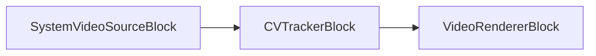

### Código de ejemplo

```csharp
var pipeline = new MediaBlocksPipeline();

// Asumiendo que SystemVideoSourceBlock ya está creado y configurado como 'videoSource'

var trackerSettings = new CVTrackerSettings
{
    Algorithm = CVTrackerAlgorithm.CSRT, // CSRT es frecuentemente un buen rastreador de propósito general. Predeterminado: CVTrackerAlgorithm.MedianFlow
    InitialRect = new VisioForge.Core.Types.Rect(150, 120, 80, 80), // Defina su ROI inicial del objeto. Predeterminado: new Rect(50, 50, 100, 100)
    DrawRect = true // Predeterminado: true
};

var trackerBlock = new CVTrackerBlock(trackerSettings);

// Nota: El rastreador se inicializa con InitialRect. 
// Para reinicializar el seguimiento en un nuevo objeto/ubicación en tiempo de ejecución:
// 1. Pausar o Detener el pipeline.
// 2. Actualizar trackerBlock.Settings.InitialRect (o crear nuevo CVTrackerSettings).
//    Generalmente es más seguro actualizar configuraciones en un pipeline detenido/pausado, 
//    o si el bloque/elemento soporta cambios de propiedades dinámicos, esa podría ser una opción.
//    Modificar directamente `trackerBlock.Settings.InitialRect` podría no reinicializar el elemento GStreamer subyacente.
//    Puede que necesite remover y re-añadir el bloque, o consultar la documentación del SDK para capacidades de actualización en vivo.
// 3. Reanudar/Iniciar el pipeline.

var videoRenderer = new VideoRendererBlock(pipeline, VideoView1); // Asumiendo VideoView1

// Conectar bloques
pipeline.Connect(videoSource.Output, trackerBlock.Input0);
pipeline.Connect(trackerBlock.Output, videoRenderer.Input);

// Iniciar pipeline
await pipeline.StartAsync();
```

### Plataformas

Windows, macOS, Linux.

### Observaciones

Asegúrese de que el paquete NuGet VisioForge OpenCV esté referenciado. La elección del algoritmo de seguimiento puede impactar significativamente el rendimiento y la precisión. Algunos algoritmos (como CSRT, KCF) son generalmente más robustos que los más antiguos (como Boosting, MedianFlow). Algunos rastreadores podrían requerir que los módulos contrib de OpenCV estén disponibles en su compilación/distribución de OpenCV.
