# Blocs OpenCV - VisioForge Media Blocks SDK .Net

[Media Blocks SDK .Net](https://www.visioforge.com/media-blocks-sdk-net){ .md-button .md-button--primary target="_blank" }

Les blocs OpenCV (Open Source Computer Vision Library) offrent de puissantes capacités de traitement vidéo dans le VisioForge Media Blocks SDK .Net. Ces blocs permettent un large éventail de tâches de vision par ordinateur, de la manipulation d'image basique à la détection et au suivi d'objets complexes.

Pour utiliser les blocs OpenCV, assurez-vous que le paquet NuGet VisioForge.CrossPlatform.OpenCV.Windows.x64 (ou le paquet correspondant à votre plateforme) est inclus dans votre projet.

La plupart des blocs OpenCV nécessitent généralement un élément `videoconvert` en amont pour garantir que le flux vidéo d'entrée est dans un format compatible. Le SDK gère cela en interne lors de l'initialisation du bloc.

## Bloc CV Dewarp

Le bloc CV Dewarp applique des effets de dewarping à un flux vidéo, ce qui peut corriger les distorsions d'objectifs grand angle, par exemple.

### Informations sur le bloc

Nom : `CVDewarpBlock` (élément GStreamer : `dewarp`).

| Direction du pin | Type de média         | Nombre de pins |
|---------------|:--------------------:|:----------:|
| Entrée vidéo   | Vidéo non compressée | 1          |
| Sortie vidéo  | Vidéo non compressée | 1          |

### Paramètres

Le `CVDewarpBlock` est configuré via `CVDewarpSettings`. Propriétés clés :

- `DisplayMode` (énumération `CVDewarpDisplayMode`) : spécifie le mode d'affichage du dewarping (par ex. `SinglePanorama`, `DoublePanorama`). Par défaut `CVDewarpDisplayMode.SinglePanorama`.
- `InnerRadius` (double) : rayon intérieur pour le dewarping.
- `InterpolationMethod` (énumération `CVDewarpInterpolationMode`) : méthode d'interpolation utilisée (par ex. `Bilinear`, `Bicubic`). Par défaut `CVDewarpInterpolationMode.Bilinear`.
- `OuterRadius` (double) : rayon extérieur pour le dewarping.
- `XCenter` (double) : coordonnée X du centre pour le dewarping.
- `XRemapCorrection` (double) : facteur de correction de remappage en X.
- `YCenter` (double) : coordonnée Y du centre pour le dewarping.
- `YRemapCorrection` (double) : facteur de correction de remappage en Y.

### Pipeline d'exemple

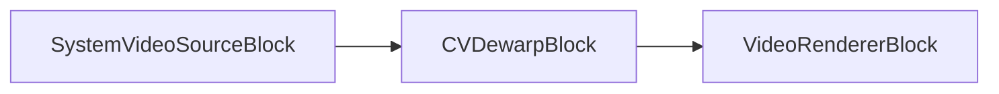

### Exemple de code

```csharp
var pipeline = new MediaBlocksPipeline();

// On suppose que SystemVideoSourceBlock est déjà créé et configuré sous le nom « videoSource »

// Créer les paramètres Dewarp
var dewarpSettings = new CVDewarpSettings
{
    DisplayMode = CVDewarpDisplayMode.SinglePanorama, // Exemple de mode, par défaut SinglePanorama
    InnerRadius = 0.2, // Valeur d'exemple
    OuterRadius = 0.8, // Valeur d'exemple
    XCenter = 0.5,     // Valeur d'exemple, par défaut 0.5
    YCenter = 0.5,     // Valeur d'exemple, par défaut 0.5
    // InterpolationMethod = CVDewarpInterpolationMode.Bilinear, // Valeur par défaut
};

var dewarpBlock = new CVDewarpBlock(dewarpSettings);

var videoRenderer = new VideoRendererBlock(pipeline, VideoView1); // En supposant VideoView1

// Connecter les blocs
pipeline.Connect(videoSource.Output, dewarpBlock.Input);
pipeline.Connect(dewarpBlock.Output, videoRenderer.Input);

// Démarrer le pipeline
await pipeline.StartAsync();
```

### Plateformes

Windows, macOS, Linux.

### Remarques

Assurez-vous que le paquet NuGet VisioForge OpenCV est référencé dans votre projet.

## Bloc CV Dilate

Le bloc CV Dilate effectue une opération de dilatation sur le flux vidéo. La dilatation est une opération morphologique qui dilate généralement les régions claires et rétrécit les régions sombres.

### Informations sur le bloc

Nom : `CVDilateBlock` (élément GStreamer : `cvdilate`).

| Direction du pin | Type de média         | Nombre de pins |
|---------------|:--------------------:|:----------:|
| Entrée vidéo   | Vidéo non compressée | 1          |
| Sortie vidéo  | Vidéo non compressée | 1          |

### Paramètres

Ce bloc ne dispose pas de paramètres spécifiques au-delà du comportement par défaut. La dilatation est effectuée avec un élément structurant par défaut.

### Pipeline d'exemple

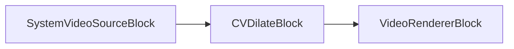

### Exemple de code

```csharp
var pipeline = new MediaBlocksPipeline();

// On suppose que SystemVideoSourceBlock est déjà créé et configuré sous le nom « videoSource »

var dilateBlock = new CVDilateBlock();

var videoRenderer = new VideoRendererBlock(pipeline, VideoView1); // En supposant VideoView1

// Connecter les blocs
pipeline.Connect(videoSource.Output, dilateBlock.Input);
pipeline.Connect(dilateBlock.Output, videoRenderer.Input);

// Démarrer le pipeline
await pipeline.StartAsync();
```

### Plateformes

Windows, macOS, Linux.

### Remarques

Assurez-vous que le paquet NuGet VisioForge OpenCV est référencé dans votre projet.

## Bloc CV Edge Detect

Le bloc CV Edge Detect utilise l'algorithme de détecteur d'arêtes Canny pour trouver des arêtes dans le flux vidéo.

### Informations sur le bloc

Nom : `CVEdgeDetectBlock` (élément GStreamer : `edgedetect`).

| Direction du pin | Type de média         | Nombre de pins |
|---------------|:--------------------:|:----------:|
| Entrée vidéo   | Vidéo non compressée | 1          |
| Sortie vidéo  | Vidéo non compressée | 1          |

### Paramètres

Le `CVEdgeDetectBlock` est configuré via `CVEdgeDetectSettings`. Propriétés clés :

- `ApertureSize` (int) : taille d'ouverture pour l'opérateur de Sobel (par ex. 3, 5 ou 7). Par défaut 3.
- `Threshold1` (int) : premier seuil pour la procédure d'hystérésis. Par défaut 50.
- `Threshold2` (int) : second seuil pour la procédure d'hystérésis. Par défaut 150.
- `Mask` (bool) : si true, la sortie est un masque ; sinon, c'est l'image originale avec les arêtes mises en évidence. Par défaut `false`.

### Pipeline d'exemple

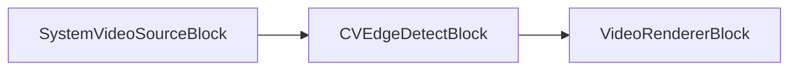

### Exemple de code

```csharp
var pipeline = new MediaBlocksPipeline();

// On suppose que SystemVideoSourceBlock est déjà créé et configuré sous le nom « videoSource »

var edgeDetectSettings = new CVEdgeDetectSettings
{
    ApertureSize = 3, // Valeur d'exemple, par défaut 3
    Threshold1 = 2000, // Valeur d'exemple, type C# réel int, par défaut 50
    Threshold2 = 4000, // Valeur d'exemple, type C# réel int, par défaut 150
    Mask = true       // Valeur d'exemple, par défaut false
};

var edgeDetectBlock = new CVEdgeDetectBlock(edgeDetectSettings);

var videoRenderer = new VideoRendererBlock(pipeline, VideoView1); // En supposant VideoView1

// Connecter les blocs
pipeline.Connect(videoSource.Output, edgeDetectBlock.Input);
pipeline.Connect(edgeDetectBlock.Output, videoRenderer.Input);

// Démarrer le pipeline
await pipeline.StartAsync();
```

### Plateformes

Windows, macOS, Linux.

### Remarques

Assurez-vous que le paquet NuGet VisioForge OpenCV est référencé dans votre projet.

## Bloc CV Equalize Histogram

Le bloc CV Equalize Histogram égalise l'histogramme d'une image vidéo à l'aide de la fonction `cvEqualizeHist`. Cela améliore généralement le contraste de l'image.

### Informations sur le bloc

Nom : `CVEqualizeHistogramBlock` (élément GStreamer : `cvequalizehist`).

| Direction du pin | Type de média         | Nombre de pins |
|---------------|:--------------------:|:----------:|
| Entrée vidéo   | Vidéo non compressée | 1          |
| Sortie vidéo  | Vidéo non compressée | 1          |

### Paramètres

Ce bloc ne dispose pas de paramètres spécifiques au-delà du comportement par défaut.

### Pipeline d'exemple


### Exemple de code

```csharp
var pipeline = new MediaBlocksPipeline();

// On suppose que SystemVideoSourceBlock est déjà créé et configuré sous le nom « videoSource »

var equalizeHistBlock = new CVEqualizeHistogramBlock();

var videoRenderer = new VideoRendererBlock(pipeline, VideoView1); // En supposant VideoView1

// Connecter les blocs
pipeline.Connect(videoSource.Output, equalizeHistBlock.Input);
pipeline.Connect(equalizeHistBlock.Output, videoRenderer.Input);

// Démarrer le pipeline
await pipeline.StartAsync();
```

### Plateformes

Windows, macOS, Linux.

### Remarques

Assurez-vous que le paquet NuGet VisioForge OpenCV est référencé dans votre projet.

## Bloc CV Erode

Le bloc CV Erode effectue une opération d'érosion sur le flux vidéo. L'érosion est une opération morphologique qui rétrécit généralement les régions claires et dilate les régions sombres.

### Informations sur le bloc

Nom : `CVErodeBlock` (élément GStreamer : `cverode`).

| Direction du pin | Type de média         | Nombre de pins |
|---------------|:--------------------:|:----------:|
| Entrée vidéo   | Vidéo non compressée | 1          |
| Sortie vidéo  | Vidéo non compressée | 1          |

### Paramètres

Ce bloc ne dispose pas de paramètres spécifiques au-delà du comportement par défaut. L'érosion est effectuée avec un élément structurant par défaut.

### Pipeline d'exemple

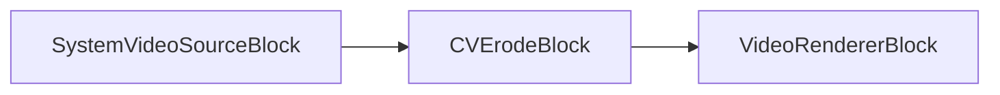

### Exemple de code

```csharp
var pipeline = new MediaBlocksPipeline();

// On suppose que SystemVideoSourceBlock est déjà créé et configuré sous le nom « videoSource »

var erodeBlock = new CVErodeBlock();

var videoRenderer = new VideoRendererBlock(pipeline, VideoView1); // En supposant VideoView1

// Connecter les blocs
pipeline.Connect(videoSource.Output, erodeBlock.Input);
pipeline.Connect(erodeBlock.Output, videoRenderer.Input);

// Démarrer le pipeline
await pipeline.StartAsync();
```

### Plateformes

Windows, macOS, Linux.

### Remarques

Assurez-vous que le paquet NuGet VisioForge OpenCV est référencé dans votre projet.

## Bloc CV Face Blur

Le bloc CV Face Blur détecte les visages dans le flux vidéo et leur applique un effet de flou.

### Informations sur le bloc

Nom : `CVFaceBlurBlock` (élément GStreamer : `faceblur`).

| Direction du pin | Type de média         | Nombre de pins |
|---------------|:--------------------:|:----------:|
| Entrée vidéo   | Vidéo non compressée | 1          |
| Sortie vidéo  | Vidéo non compressée | 1          |

### Paramètres

Le `CVFaceBlurBlock` est configuré via `CVFaceBlurSettings`. Propriétés clés :

- `MainCascadeFile` (string) : chemin du fichier XML pour le classifieur en cascade de Haar principal utilisé pour la détection des visages (par ex. `haarcascade_frontalface_default.xml`). Par défaut `"haarcascade_frontalface_default.xml"`.
- `MinNeighbors` (int) : nombre minimal de voisins que chaque rectangle candidat doit avoir pour être conservé. Par défaut 3.
- `MinSize` (`Size`) : taille minimale possible de l'objet. Les objets plus petits sont ignorés. Par défaut `new Size(30, 30)`.
- `ScaleFactor` (double) : facteur de réduction de la taille d'image à chaque échelle. Par défaut 1.25.

Remarque : `ProcessPaths(Context)` doit être appelée sur l'objet de paramètres pour garantir une résolution correcte des chemins des fichiers en cascade.

### Pipeline d'exemple

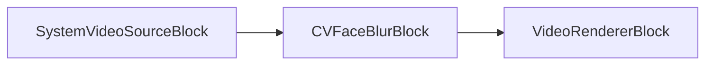

### Exemple de code

```csharp
var pipeline = new MediaBlocksPipeline();

// On suppose que SystemVideoSourceBlock est déjà créé et configuré sous le nom « videoSource »

var faceBlurSettings = new CVFaceBlurSettings
{
    MainCascadeFile = "haarcascade_frontalface_default.xml", // Ajustez le chemin si nécessaire, c'est la valeur par défaut
    MinNeighbors = 5, // Valeur d'exemple, par défaut 3
    ScaleFactor = 1.2, // Valeur d'exemple, par défaut 1.25
    // MinSize = new VisioForge.Core.Types.Size(30, 30) // Valeur par défaut
};
// Il est important d'appeler ProcessPaths si vous ne fournissez pas un chemin absolu
// et que vous comptez sur les mécanismes internes du SDK pour localiser le fichier, surtout en déploiement.
// faceBlurSettings.ProcessPaths(pipeline.GetContext()); // ou passez le contexte approprié

var faceBlurBlock = new CVFaceBlurBlock(faceBlurSettings);

var videoRenderer = new VideoRendererBlock(pipeline, VideoView1); // En supposant VideoView1

// Connecter les blocs
pipeline.Connect(videoSource.Output, faceBlurBlock.Input);
pipeline.Connect(faceBlurBlock.Output, videoRenderer.Input);

// Démarrer le pipeline
await pipeline.StartAsync();
```

### Plateformes

Windows, macOS, Linux.

### Remarques

Ce bloc nécessite des fichiers XML de cascade de Haar pour la détection des visages. Ces fichiers sont généralement fournis avec les distributions OpenCV. Assurez-vous que le chemin de `MainCascadeFile` est correctement spécifié. La méthode `ProcessPaths` sur l'objet de paramètres peut aider à résoudre les chemins lorsque les fichiers sont placés à des emplacements standard connus du SDK.

## Bloc CV Face Detect

Le bloc CV Face Detect détecte les visages, et facultativement les yeux, le nez et la bouche, dans le flux vidéo à l'aide de classifieurs en cascade de Haar.

### Informations sur le bloc

Nom : `CVFaceDetectBlock` (élément GStreamer : `facedetect`).

| Direction du pin | Type de média         | Nombre de pins |
|---------------|:--------------------:|:----------:|
| Entrée vidéo   | Vidéo non compressée | 1          |
| Sortie vidéo  | Vidéo non compressée | 1          |

### Paramètres

Le `CVFaceDetectBlock` est configuré via `CVFaceDetectSettings`. Propriétés clés :

- `Display` (bool) : si `true`, dessine des rectangles autour des éléments détectés sur la vidéo de sortie. Par défaut `true`.
- `MainCascadeFile` (string) : chemin du XML pour la cascade de Haar principale. Par défaut `"haarcascade_frontalface_default.xml"`.
- `EyesCascadeFile` (string) : chemin du XML pour la détection des yeux. Par défaut `"haarcascade_mcs_eyepair_small.xml"`. Facultatif.
- `NoseCascadeFile` (string) : chemin du XML pour la détection du nez. Par défaut `"haarcascade_mcs_nose.xml"`. Facultatif.
- `MouthCascadeFile` (string) : chemin du XML pour la détection de la bouche. Par défaut `"haarcascade_mcs_mouth.xml"`. Facultatif.
- `MinNeighbors` (int) : nombre minimal de voisins pour la conservation des candidats. Par défaut 3.
- `MinSize` (`Size`) : taille minimale d'objet. Par défaut `new Size(30, 30)`.
- `MinDeviation` (int) : écart-type minimum. Par défaut 0.
- `ScaleFactor` (double) : facteur de réduction de la taille d'image à chaque échelle. Par défaut 1.25.
- `UpdatesMode` (énumération `CVFaceDetectUpdates`) : contrôle la manière dont les mises à jour/événements sont publiés (`EveryFrame`, `OnChange`, `OnFace`, `None`). Par défaut `CVFaceDetectUpdates.EveryFrame`.

Remarque : `ProcessPaths(Context)` doit être appelée sur l'objet de paramètres pour les fichiers en cascade.

### Événements

- `FaceDetected` : se produit lorsque des visages (et autres éléments activés) sont détectés. Fournit un `CVFaceDetectedEventArgs` avec un tableau d'objets `CVFace` et un horodatage.
  - `CVFace` contient un `Rect` pour `Position`, `Nose`, `Mouth`, et une liste de `Rect` pour `Eyes`.

### Pipeline d'exemple

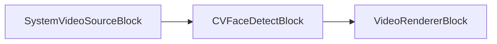

### Exemple de code

```csharp
var pipeline = new MediaBlocksPipeline();

// On suppose que SystemVideoSourceBlock est déjà créé et configuré sous le nom « videoSource »

var faceDetectSettings = new CVFaceDetectSettings
{
    MainCascadeFile = "haarcascade_frontalface_default.xml", // Ajustez le chemin, valeur par défaut
    EyesCascadeFile = "haarcascade_mcs_eyepair_small.xml", // Ajustez le chemin, valeur par défaut, facultatif
    // NoseCascadeFile = "haarcascade_mcs_nose.xml", // Facultatif, valeur par défaut
    // MouthCascadeFile = "haarcascade_mcs_mouth.xml", // Facultatif, valeur par défaut
    Display = true, // Valeur par défaut
    UpdatesMode = CVFaceDetectUpdates.EveryFrame, // Valeur par défaut, valeurs possibles : EveryFrame, OnChange, OnFace, None
    MinNeighbors = 5, // Valeur d'exemple, par défaut 3
    ScaleFactor = 1.2, // Valeur d'exemple, par défaut 1.25
    // MinSize = new VisioForge.Core.Types.Size(30,30) // Valeur par défaut
};
// faceDetectSettings.ProcessPaths(pipeline.GetContext()); // ou contexte approprié

var faceDetectBlock = new CVFaceDetectBlock(faceDetectSettings);

faceDetectBlock.FaceDetected += (s, e) => 
{
    Console.WriteLine($"Timestamp: {e.Timestamp}, Faces found: {e.Faces.Length}");
    foreach (var face in e.Faces)
    {
        Console.WriteLine($"  Face at [{face.Position.Left},{face.Position.Top},{face.Position.Width},{face.Position.Height}]");
        if (face.Eyes.Any())
        {
            Console.WriteLine($"    Eyes at [{face.Eyes[0].Left},{face.Eyes[0].Top},{face.Eyes[0].Width},{face.Eyes[0].Height}]");
        }
    }
};

var videoRenderer = new VideoRendererBlock(pipeline, VideoView1); // En supposant VideoView1

// Connecter les blocs
pipeline.Connect(videoSource.Output, faceDetectBlock.Input);
pipeline.Connect(faceDetectBlock.Output, videoRenderer.Input);

// Démarrer le pipeline
await pipeline.StartAsync();
```

### Plateformes

Windows, macOS, Linux.

### Remarques

Nécessite des fichiers XML de cascade de Haar. La méthode `ProcessBusMessage` dans la classe C# gère l'analyse des messages provenant de l'élément GStreamer pour déclencher l'événement `FaceDetected`.

## Bloc CV Hand Detect

Le bloc CV Hand Detect détecte les gestes de la main (poing ou paume) dans le flux vidéo à l'aide de classifieurs en cascade de Haar. Il redimensionne en interne la vidéo d'entrée à 320x240 pour le traitement.

### Informations sur le bloc

Nom : `CVHandDetectBlock` (élément GStreamer : `handdetect`).

| Direction du pin | Type de média         | Nombre de pins |
|---------------|:--------------------:|:----------:|
| Entrée vidéo   | Vidéo non compressée | 1          |
| Sortie vidéo  | Vidéo non compressée | 1          |

### Paramètres

Le `CVHandDetectBlock` est configuré via `CVHandDetectSettings`. Propriétés clés :

- `Display` (bool) : si `true`, dessine des rectangles autour des mains détectées sur la vidéo de sortie. Par défaut `true`.
- `FistCascadeFile` (string) : chemin du XML pour la détection du poing. Par défaut `"fist.xml"`.
- `PalmCascadeFile` (string) : chemin du XML pour la détection de la paume. Par défaut `"palm.xml"`.
- `ROI` (`Rect`) : région d'intérêt pour la détection. Les coordonnées sont relatives à l'image traitée 320x240. Par défaut (0,0,0,0) - image entière (correspond à `new Rect()`).

Remarque : `ProcessPaths(Context)` doit être appelée sur l'objet de paramètres pour les fichiers en cascade.

### Événements

- `HandDetected` : se produit lorsque des mains sont détectées. Fournit un `CVHandDetectedEventArgs` avec un tableau d'objets `CVHand`.
  - `CVHand` contient un `Rect` pour `Position` et un `CVHandGesture` pour `Gesture` (Fist ou Palm).

### Pipeline d'exemple

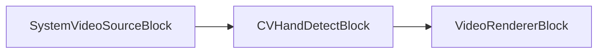

Remarque : le `CVHandDetectBlock` inclut en interne un élément `videoscale` pour redimensionner l'entrée à 320x240 avant l'élément GStreamer `handdetect`.

### Exemple de code

```csharp
var pipeline = new MediaBlocksPipeline();

// On suppose que SystemVideoSourceBlock est déjà créé et configuré sous le nom « videoSource »

var handDetectSettings = new CVHandDetectSettings
{
    FistCascadeFile = "fist.xml", // Ajustez le chemin, valeur par défaut
    PalmCascadeFile = "palm.xml", // Ajustez le chemin, valeur par défaut
    Display = true, // Valeur par défaut
    ROI = new VisioForge.Core.Types.Rect(0, 0, 320, 240) // Exemple : image entière mise à l'échelle, par défaut new Rect()
};
// handDetectSettings.ProcessPaths(pipeline.GetContext()); // ou contexte approprié

var handDetectBlock = new CVHandDetectBlock(handDetectSettings);

handDetectBlock.HandDetected += (s, e) => 
{
    Console.WriteLine($"Hands found: {e.Hands.Length}");
    foreach (var hand in e.Hands)
    {
        Console.WriteLine($"  Hand at [{hand.Position.Left},{hand.Position.Top},{hand.Position.Width},{hand.Position.Height}], Gesture: {hand.Gesture}");
    }
};

var videoRenderer = new VideoRendererBlock(pipeline, VideoView1); // En supposant VideoView1

// Connecter les blocs
pipeline.Connect(videoSource.Output, handDetectBlock.Input);
pipeline.Connect(handDetectBlock.Output, videoRenderer.Input);

// Démarrer le pipeline
await pipeline.StartAsync();
```

### Plateformes

Windows, macOS, Linux.

### Remarques

Nécessite des fichiers XML de cascade de Haar pour la détection du poing et de la paume. La vidéo d'entrée est mise à l'échelle en interne à 320x240 pour traitement par l'élément `handdetect`. La méthode `ProcessBusMessage` gère les messages GStreamer pour déclencher `HandDetected`.

## Bloc CV Laplace

Le bloc CV Laplace applique un opérateur de Laplace au flux vidéo, mettant en évidence les régions à variation rapide d'intensité, souvent utilisé pour la détection d'arêtes.

### Informations sur le bloc

Nom : `CVLaplaceBlock` (élément GStreamer : `cvlaplace`).

| Direction du pin | Type de média         | Nombre de pins |
|---------------|:--------------------:|:----------:|
| Entrée vidéo   | Vidéo non compressée | 1          |
| Sortie vidéo  | Vidéo non compressée | 1          |

### Paramètres

Le `CVLaplaceBlock` est configuré via `CVLaplaceSettings`. Propriétés clés :

- `ApertureSize` (int) : taille d'ouverture pour l'opérateur de Sobel utilisé en interne (par ex. 1, 3, 5 ou 7). Par défaut 3.
- `Scale` (double) : facteur d'échelle facultatif pour les valeurs laplaciennes calculées. Par défaut 1.
- `Shift` (double) : valeur delta facultative ajoutée aux résultats avant stockage. Par défaut 0.
- `Mask` (bool) : si true, la sortie est un masque ; sinon, c'est l'image originale avec l'effet appliqué. Par défaut true.

### Pipeline d'exemple

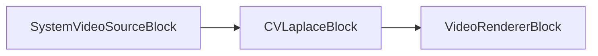

### Exemple de code

```csharp
var pipeline = new MediaBlocksPipeline();

// On suppose que SystemVideoSourceBlock est déjà créé et configuré sous le nom « videoSource »

var laplaceSettings = new CVLaplaceSettings
{
    ApertureSize = 3, // Valeur d'exemple
    Scale = 1.0,      // Valeur d'exemple
    Shift = 0.0,      // Valeur d'exemple
    Mask = true
};

var laplaceBlock = new CVLaplaceBlock(laplaceSettings);

var videoRenderer = new VideoRendererBlock(pipeline, VideoView1); // En supposant VideoView1

// Connecter les blocs
pipeline.Connect(videoSource.Output, laplaceBlock.Input);
pipeline.Connect(laplaceBlock.Output, videoRenderer.Input);

// Démarrer le pipeline
await pipeline.StartAsync();
```

### Plateformes

Windows, macOS, Linux.

### Remarques

Assurez-vous que le paquet NuGet VisioForge OpenCV est référencé dans votre projet.

## Bloc CV Motion Cells

Le bloc CV Motion Cells détecte le mouvement dans un flux vidéo en divisant l'image en une grille de cellules et en analysant les changements dans ces cellules.

### Informations sur le bloc

Nom : `CVMotionCellsBlock` (élément GStreamer : `motioncells`).

| Direction du pin | Type de média         | Nombre de pins |
|---------------|:--------------------:|:----------:|
| Entrée vidéo   | Vidéo non compressée | 1          |
| Sortie vidéo  | Vidéo non compressée | 1          |

### Paramètres

Le `CVMotionCellsBlock` est configuré via `CVMotionCellsSettings`. Propriétés clés :

- `CalculateMotion` (bool) : active ou désactive le calcul du mouvement. Par défaut `true`.
- `CellsColor` (`SKColor`) : couleur pour dessiner les cellules de mouvement si `Display` vaut true. Par défaut `SKColors.Red`.
- `DataFile` (string) : chemin d'un fichier de données pour le chargement/sauvegarde de la configuration des cellules. L'extension est gérée séparément par `DataFileExtension`.
- `DataFileExtension` (string) : extension du fichier de données (par ex. "dat").
- `Display` (bool) : si `true`, dessine la grille et l'indication de mouvement sur la vidéo de sortie. Par défaut `true`.
- `Gap` (`TimeSpan`) : intervalle après lequel le mouvement est considéré comme terminé et un message bus « motion finished » est publié. Par défaut `TimeSpan.FromSeconds(5)`. (Remarque : il ne s'agit pas d'un écart en pixels entre les cellules).
- `GridSize` (`Size`) : nombre de cellules dans la grille (largeur x hauteur). Par défaut `new Size(10, 10)`.
- `MinimumMotionFrames` (int) : nombre minimal d'images sur lesquelles le mouvement doit être détecté dans une cellule pour déclencher. Par défaut 1.
- `MotionCellsIdx` (string) : chaîne séparée par des virgules d'indices de cellules (par ex. "0:0,1:1") à surveiller pour le mouvement.
- `MotionCellBorderThickness` (int) : épaisseur de la bordure pour les cellules à mouvement détecté. Par défaut 1.
- `MotionMaskCellsPos` (string) : chaîne définissant les positions de cellules pour un masque de mouvement.
- `MotionMaskCoords` (string) : chaîne définissant les coordonnées d'un masque de mouvement.
- `PostAllMotion` (bool) : publier tous les événements de mouvement. Par défaut `false`.
- `PostNoMotion` (`TimeSpan`) : durée après laquelle un événement « no motion » est publié si aucun mouvement n'est détecté. Par défaut `TimeSpan.Zero` (désactivé).
- `Sensitivity` (double) : sensibilité du mouvement. Plage attendue généralement entre 0.0 et 1.0. Par défaut `0.5`.
- `Threshold` (double) : seuil de détection de mouvement, représentant la fraction de cellules qui doivent avoir bougé. Par défaut `0.01`.
- `UseAlpha` (bool) : utiliser le canal alpha pour le dessin. Par défaut `true`.

### Événements

- `MotionDetected` : se produit lorsqu'un mouvement est détecté ou change d'état. Fournit un `CVMotionCellsEventArgs` :
  - `Cells` : chaîne indiquant les cellules en mouvement (par ex. "0:0,1:2").
  - `StartedTime` : horodatage de début du mouvement dans la portée actuelle de l'événement.
  - `FinishedTime` : horodatage de fin du mouvement (le cas échéant).
  - `CurrentTime` : horodatage de l'image courante liée à l'événement.
  - `IsMotion` : booléen indiquant si l'événement signale un mouvement (`true`) ou pas (`false`).

### Pipeline d'exemple

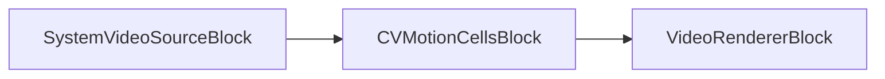

### Exemple de code

```csharp
var pipeline = new MediaBlocksPipeline();

// On suppose que SystemVideoSourceBlock est déjà créé et configuré sous le nom « videoSource »

var motionCellsSettings = new CVMotionCellsSettings
{
    GridSize = new VisioForge.Core.Types.Size(8, 6), // Exemple : grille 8x6, par défaut new Size(10,10)
    Sensitivity = 0.75, // Valeur d'exemple, valeur par défaut C# 0.5. Représente la sensibilité.
    Threshold = 0.05,   // Valeur d'exemple, valeur par défaut C# 0.01. Représente la fraction de cellules ayant bougé.
    Display = true,     // Par défaut true
    CellsColor = SKColors.Aqua, // Couleur d'exemple, par défaut SKColors.Red
    PostNoMotion = TimeSpan.FromSeconds(5) // Publier no_motion après 5 s d'inactivité, par défaut TimeSpan.Zero
};

var motionCellsBlock = new CVMotionCellsBlock(motionCellsSettings);

motionCellsBlock.MotionDetected += (s, e) => 
{
    if (e.IsMotion)
    {
        Console.WriteLine($"Motion DETECTED at {e.CurrentTime}. Cells: {e.Cells}. Started: {e.StartedTime}");
    }
    else
    {
        Console.WriteLine($"Motion FINISHED or NO MOTION at {e.CurrentTime}. Finished: {e.FinishedTime}");
    }
};

var videoRenderer = new VideoRendererBlock(pipeline, VideoView1); // En supposant VideoView1

// Connecter les blocs
pipeline.Connect(videoSource.Output, motionCellsBlock.Input);
pipeline.Connect(motionCellsBlock.Output, videoRenderer.Input);

// Démarrer le pipeline
await pipeline.StartAsync();
```

### Plateformes

Windows, macOS, Linux.

### Remarques

La méthode `ProcessBusMessage` gère les messages GStreamer pour déclencher `MotionDetected`. La structure de l'événement fournit des horodatages pour le début, la fin et le temps courant de l'événement.

## Bloc CV Smooth

Le bloc CV Smooth applique divers filtres de lissage (flou) au flux vidéo.

### Informations sur le bloc

Nom : `CVSmoothBlock` (élément GStreamer : `cvsmooth`).

| Direction du pin | Type de média         | Nombre de pins |
|---------------|:--------------------:|:----------:|
| Entrée vidéo   | Vidéo non compressée | 1          |
| Sortie vidéo  | Vidéo non compressée | 1          |

### Paramètres

Le `CVSmoothBlock` est configuré via `CVSmoothSettings`. Propriétés clés :

- `Type` (énumération `CVSmoothType`) : type de filtre de lissage à appliquer (`Blur`, `Gaussian`, `Median`, `Bilateral`). Par défaut `CVSmoothType.Gaussian`.
- `KernelWidth` (int) : largeur du noyau pour les filtres `Blur`, `Gaussian`, `Median`. Par défaut 3.
- `KernelHeight` (int) : hauteur du noyau pour les filtres `Blur`, `Gaussian`, `Median`. Par défaut 3.
- `Width` (int) : largeur de la zone à flouter. Par défaut `int.MaxValue` (image entière).
- `Height` (int) : hauteur de la zone à flouter. Par défaut `int.MaxValue` (image entière).
- `PositionX` (int) : position X de la zone de flou. Par défaut 0.
- `PositionY` (int) : position Y de la zone de flou. Par défaut 0.
- `Color` (double) : sigma pour l'espace colorimétrique (filtre Bilateral) ou écart-type (Gaussian si `SpatialSigma` vaut 0). Par défaut 0.
- `SpatialSigma` (double) : sigma pour l'espace de coordonnées (filtres Bilateral et Gaussian). Pour Gaussian, si 0, calculé à partir de `KernelWidth`/`KernelHeight`. Par défaut 0.

### Pipeline d'exemple

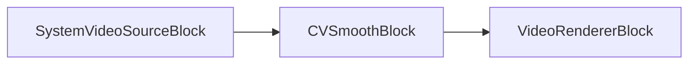

### Exemple de code

```csharp
var pipeline = new MediaBlocksPipeline();

// On suppose que SystemVideoSourceBlock est déjà créé et configuré sous le nom « videoSource »

var smoothSettings = new CVSmoothSettings
{
    Type = CVSmoothType.Gaussian, // Exemple : flou Gaussien, également la valeur par défaut
    KernelWidth = 5,  // Largeur du noyau, par défaut 3
    KernelHeight = 5, // Hauteur du noyau, par défaut 3
    SpatialSigma = 1.5 // Sigma pour Gaussian. Si 0 (par défaut), calculé à partir de la taille du noyau.
};

var smoothBlock = new CVSmoothBlock(smoothSettings);

var videoRenderer = new VideoRendererBlock(pipeline, VideoView1); // En supposant VideoView1

// Connecter les blocs
pipeline.Connect(videoSource.Output, smoothBlock.Input);
pipeline.Connect(smoothBlock.Output, videoRenderer.Input);

// Démarrer le pipeline
await pipeline.StartAsync();
```

### Plateformes

Windows, macOS, Linux.

### Remarques

Assurez-vous que le paquet NuGet VisioForge OpenCV est référencé dans votre projet. Les paramètres spécifiques utilisés par l'élément GStreamer (`color`, `spatial`, `kernel-width`, `kernel-height`) dépendent du `Type` choisi. Pour les dimensions du noyau, utilisez `KernelWidth` et `KernelHeight`. `Width` et `Height` définissent la zone d'application du flou si elle ne couvre pas l'image entière.

## Bloc CV Sobel

Le bloc CV Sobel applique un opérateur de Sobel au flux vidéo, utilisé pour calculer la dérivée d'une fonction d'intensité d'image, typiquement pour la détection d'arêtes.

### Informations sur le bloc

Nom : `CVSobelBlock` (élément GStreamer : `cvsobel`).

| Direction du pin | Type de média         | Nombre de pins |
|---------------|:--------------------:|:----------:|
| Entrée vidéo   | Vidéo non compressée | 1          |
| Sortie vidéo  | Vidéo non compressée | 1          |

### Paramètres

Le `CVSobelBlock` est configuré via `CVSobelSettings`. Propriétés clés :

- `XOrder` (int) : ordre de la dérivée en x. Par défaut 1.
- `YOrder` (int) : ordre de la dérivée en y. Par défaut 1.
- `ApertureSize` (int) : taille du noyau de Sobel étendu (1, 3, 5 ou 7). Par défaut 3.
- `Mask` (bool) : si true, la sortie est un masque ; sinon, c'est l'image originale avec l'effet appliqué. Par défaut true.

### Pipeline d'exemple

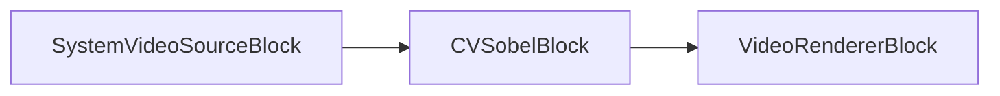

### Exemple de code

```csharp
var pipeline = new MediaBlocksPipeline();

// On suppose que SystemVideoSourceBlock est déjà créé et configuré sous le nom « videoSource »

var sobelSettings = new CVSobelSettings
{
    XOrder = 1,       // Par défaut 1. Ordre de la dérivée X.
    YOrder = 0,       // Exemple : utiliser 0 pour Y afin de détecter principalement les arêtes verticales. Valeur par défaut C# 1.
    ApertureSize = 3, // Par défaut 3. Taille du noyau de Sobel étendu.
    Mask = true       // Par défaut true. Sortie en masque.
};

var sobelBlock = new CVSobelBlock(sobelSettings);

var videoRenderer = new VideoRendererBlock(pipeline, VideoView1); // En supposant VideoView1

// Connecter les blocs
pipeline.Connect(videoSource.Output, sobelBlock.Input);
pipeline.Connect(sobelBlock.Output, videoRenderer.Input);

// Démarrer le pipeline
await pipeline.StartAsync();
```

### Plateformes

Windows, macOS, Linux.

### Remarques

Assurez-vous que le paquet NuGet VisioForge OpenCV est référencé dans votre projet.

## Bloc CV Template Match

Le bloc CV Template Match recherche les occurrences d'une image modèle dans le flux vidéo.

### Informations sur le bloc

Nom : `CVTemplateMatchBlock` (élément GStreamer : `templatematch`).

| Direction du pin | Type de média         | Nombre de pins |
|---------------|:--------------------:|:----------:|
| Entrée vidéo   | Vidéo non compressée | 1          |
| Sortie vidéo  | Vidéo non compressée | 1          |

### Paramètres

Le `CVTemplateMatchBlock` est configuré via `CVTemplateMatchSettings`. Propriétés clés :

- `TemplateImage` (string) : chemin du fichier image modèle (par ex. PNG, JPG) à rechercher.
- `Method` (énumération `CVTemplateMatchMethod`) : méthode de comparaison à utiliser (par ex. `Sqdiff`, `CcorrNormed`, `CcoeffNormed`). Par défaut `CVTemplateMatchMethod.Correlation`.
- `Display` (bool) : si `true`, dessine un rectangle autour de la meilleure correspondance sur la vidéo de sortie. Par défaut `true`.

### Événements

- `TemplateMatch` : se produit lorsqu'une correspondance de modèle est trouvée. Fournit un `CVTemplateMatchEventArgs` :
  - `Rect` : objet `Types.Rect` représentant l'emplacement (`Left`, `Top`, `Right`, `Bottom`) de la meilleure correspondance. `Width` et `Height` sont des propriétés calculées (`Right - Left`, `Bottom - Top`).
  - `Result` : valeur double représentant la qualité ou le résultat de la correspondance, en fonction de la méthode utilisée.

### Pipeline d'exemple

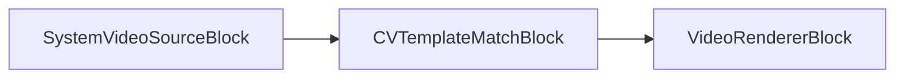

### Exemple de code

```csharp
var pipeline = new MediaBlocksPipeline();

// On suppose que SystemVideoSourceBlock est déjà créé et configuré sous le nom « videoSource »
// Assurez-vous que « template.png » existe et est accessible.
var templateMatchSettings = new CVTemplateMatchSettings("path/to/your/template.png") // Ajustez le chemin si nécessaire
{
    // Method : spécifie la méthode de comparaison.
    // Exemple : CVTemplateMatchMethod.CcoeffNormed est souvent un bon choix.
    // Valeur par défaut C# CVTemplateMatchMethod.Correlation.
    Method = CVTemplateMatchMethod.CcoeffNormed, 
    
    // Display : si true, dessine un rectangle autour de la meilleure correspondance.
    // Valeur par défaut C# true.
    Display = true 
};

var templateMatchBlock = new CVTemplateMatchBlock(templateMatchSettings);

templateMatchBlock.TemplateMatch += (s, e) => 
{
    Console.WriteLine($"Template matched at [{e.Rect.Left},{e.Rect.Top},{e.Rect.Width},{e.Rect.Height}] with result: {e.Result}");
};

var videoRenderer = new VideoRendererBlock(pipeline, VideoView1); // En supposant VideoView1

// Connecter les blocs
pipeline.Connect(videoSource.Output, templateMatchBlock.Input);
pipeline.Connect(templateMatchBlock.Output, videoRenderer.Input);

// Démarrer le pipeline
await pipeline.StartAsync();
```

### Plateformes

Windows, macOS, Linux.

### Remarques

Assurez-vous que le paquet NuGet VisioForge OpenCV et un fichier image modèle valide sont disponibles. La méthode `ProcessBusMessage` gère les messages GStreamer pour déclencher l'événement `TemplateMatch`.

## Bloc CV Text Overlay

Le bloc CV Text Overlay rend du texte sur le flux vidéo à l'aide des fonctions de dessin d'OpenCV.

### Informations sur le bloc

Nom : `CVTextOverlayBlock` (élément GStreamer : `opencvtextoverlay`).

| Direction du pin | Type de média         | Nombre de pins |
|---------------|:--------------------:|:----------:|
| Entrée vidéo   | Vidéo non compressée | 1          |
| Sortie vidéo  | Vidéo non compressée | 1          |

### Paramètres

Le `CVTextOverlayBlock` est configuré via `CVTextOverlaySettings`. Propriétés clés :

- `Text` (string) : chaîne de texte à superposer. Par défaut : `"Default text"`.
- `X` (int) : coordonnée X du coin inférieur gauche de la chaîne de texte. Par défaut : `50`.
- `Y` (int) : coordonnée Y du coin inférieur gauche de la chaîne de texte (depuis le haut, l'origine OpenCV est en haut à gauche, l'élément GStreamer textoverlay peut être en bas à gauche). Par défaut : `50`.
- `FontWidth` (double) : facteur d'échelle de police multiplié par la taille de base propre à la police. Par défaut : `1.0`.
- `FontHeight` (double) : facteur d'échelle de police (similaire à FontWidth, bien que l'élément GStreamer ait généralement un `font-scale` unique ou s'appuie sur la taille en points). Par défaut : `1.0`.
- `FontThickness` (int) : épaisseur des lignes utilisées pour tracer le texte. Par défaut : `1`.
- `Color` (`SKColor`) : couleur du texte. Par défaut : `SKColors.Black`.

### Pipeline d'exemple

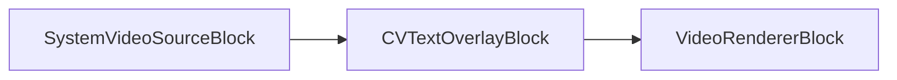

### Exemple de code

```csharp
var pipeline = new MediaBlocksPipeline();

// On suppose que SystemVideoSourceBlock est déjà créé et configuré sous le nom « videoSource »

var textOverlaySettings = new CVTextOverlaySettings
{
    Text = "VisioForge MediaBlocks.Net ROCKS!", // Par défaut : "Default text"
    X = 20, // Position X de début du texte. Par défaut : 50
    Y = 40, // Position Y de la ligne de base du texte (depuis le haut). Par défaut : 50
    FontWidth = 1.2, // Échelle de police. Par défaut : 1.0
    FontHeight = 1.2, // Échelle de police (FontWidth suffit généralement pour opencvtextoverlay). Par défaut : 1.0
    FontThickness = 2, // Par défaut : 1
    Color = SKColors.Blue // Par défaut : SKColors.Black
};

var textOverlayBlock = new CVTextOverlayBlock(textOverlaySettings);

var videoRenderer = new VideoRendererBlock(pipeline, VideoView1); // En supposant VideoView1

// Connecter les blocs
pipeline.Connect(videoSource.Output, textOverlayBlock.Input);
pipeline.Connect(textOverlayBlock.Output, videoRenderer.Input);

// Démarrer le pipeline
await pipeline.StartAsync();
```

### Plateformes

Windows, macOS, Linux.

### Remarques

Assurez-vous que le paquet NuGet VisioForge OpenCV est référencé. Les propriétés GStreamer `colorR`, `colorG`, `colorB` sont définies à partir de la propriété `Color`.

## Bloc CV Tracker

Le bloc CV Tracker implémente divers algorithmes de suivi d'objets pour suivre un objet défini par une boîte englobante initiale dans un flux vidéo.

### Informations sur le bloc

Nom : `CVTrackerBlock` (élément GStreamer : `cvtracker`).

| Direction du pin | Type de média         | Nombre de pins |
|---------------|:--------------------:|:----------:|
| Entrée vidéo   | Vidéo non compressée | 1          |
| Sortie vidéo  | Vidéo non compressée | 1          |

### Paramètres

Le `CVTrackerBlock` est configuré via `CVTrackerSettings`. Propriétés clés :

- `Algorithm` (énumération `CVTrackerAlgorithm`) : spécifie l'algorithme de suivi (`Boosting`, `CSRT`, `KCF`, `MedianFlow`, `MIL`, `MOSSE`, `TLD`). Par défaut : `CVTrackerAlgorithm.MedianFlow`.
- `InitialRect` (`Rect`) : boîte englobante initiale de l'objet à suivre. Le constructeur de `Rect` est `(left, top, right, bottom)` — par ex. `new Rect(50, 50, 150, 150)` est une boîte 100×100 à (50, 50). Par défaut : `new Rect()` (taille zéro).
- `DrawRect` (bool) : si `true`, dessine un rectangle autour de l'objet suivi sur la vidéo de sortie. Par défaut : `true`.

### Pipeline d'exemple

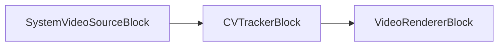

### Exemple de code

```csharp
var pipeline = new MediaBlocksPipeline();

// On suppose que SystemVideoSourceBlock est déjà créé et configuré sous le nom « videoSource »

var trackerSettings = new CVTrackerSettings
{
    Algorithm = CVTrackerAlgorithm.CSRT, // CSRT est souvent un bon tracker polyvalent. Par défaut : CVTrackerAlgorithm.MedianFlow
    InitialRect = new VisioForge.Core.Types.Rect(150, 120, 230, 200), // (left, top, right, bottom) — boîte 80x80 à (150,120). Par défaut : new Rect()
    DrawRect = true // Par défaut : true
};

var trackerBlock = new CVTrackerBlock(trackerSettings);

// Remarque : le tracker s'initialise avec InitialRect. 
// Pour réinitialiser le suivi sur un nouvel objet/emplacement à l'exécution :
// 1. Mettre en pause ou arrêter le pipeline.
// 2. Mettre à jour trackerBlock.Settings.InitialRect (ou créer de nouveaux CVTrackerSettings).
//    Il est généralement plus sûr de mettre à jour les paramètres sur un pipeline arrêté/en pause, 
//    ou si le bloc/élément prend en charge les changements de propriétés dynamiques, cela peut être une option.
//    Modifier directement « trackerBlock.Settings.InitialRect » peut ne pas réinitialiser l'élément GStreamer sous-jacent.
//    Il peut être nécessaire de retirer et de réajouter le bloc, ou de vérifier la documentation du SDK pour les capacités de mise à jour en direct.
// 3. Reprendre/démarrer le pipeline.

var videoRenderer = new VideoRendererBlock(pipeline, VideoView1); // En supposant VideoView1

// Connecter les blocs
pipeline.Connect(videoSource.Output, trackerBlock.Input);
pipeline.Connect(trackerBlock.Output, videoRenderer.Input);

// Démarrer le pipeline
await pipeline.StartAsync();
```

### Plateformes

Windows, macOS, Linux.

### Remarques

Assurez-vous que le paquet NuGet VisioForge OpenCV est référencé. Le choix de l'algorithme de suivi peut considérablement affecter les performances et la précision. Certains algorithmes (comme CSRT, KCF) sont généralement plus robustes que d'autres plus anciens (comme Boosting, MedianFlow). Certains trackers peuvent nécessiter la disponibilité des modules OpenCV contrib dans votre build/distribution OpenCV.

