# Bloques de Salida - VisioForge Media Blocks SDK .Net

[Media Blocks SDK .Net](https://www.visioforge.com/media-blocks-sdk-net){ .md-button .md-button--primary target="_blank" }

Los bloques de salida, también conocidos como sumideros, son responsables de escribir datos de medios a archivos, flujos de red u otros destinos. Generalmente son los últimos bloques en cualquier cadena de procesamiento de medios. VisioForge Media Blocks SDK .Net proporciona una colección completa de bloques de salida para varios formatos y protocolos.

Esta guía cubre bloques de salida de archivos como MP4, AVI, WebM, MKV, y bloques de streaming de red para protocolos como RTMP (usado por YouTube y Facebook Live).

## Bloque de Salida AVI

El `AVIOutputBlock` se usa para crear archivos AVI. Combina codificadores de video y audio con un sumidero de archivo para producir archivos `.avi`.

### Información del bloque

Nombre: `AVIOutputBlock`.

| Dirección del pin | Tipo de medio | Codificadores esperados |
| --- | :---: | :---: |
| Entrada Video | varios | H264 (predeterminado), otros codificadores compatibles `IVideoEncoder` |
| Entrada Audio | varios | AAC (predeterminado), MP3, otros codificadores compatibles `IAudioEncoder` |

### Configuraciones

El `AVIOutputBlock` se configura usando `AVISinkSettings` junto con configuraciones para los codificadores de video y audio elegidos (ej. `IH264EncoderSettings` y `IAACEncoderSettings` o `MP3EncoderSettings`).

Propiedades clave de `AVISinkSettings`:

- `Filename` (string): La ruta al archivo AVI de salida.

Constructores:

- `AVIOutputBlock(string filename)`: Usa codificadores predeterminados H264 video y AAC audio.
- `AVIOutputBlock(AVISinkSettings sinkSettings, IH264EncoderSettings h264settings, IAACEncoderSettings aacSettings)`: Usa codificadores H264 video y AAC especificados.
- `AVIOutputBlock(AVISinkSettings sinkSettings, IH264EncoderSettings h264settings, MP3EncoderSettings mp3Settings)`: Usa codificadores H264 video y MP3 especificados.

### El pipeline de muestra

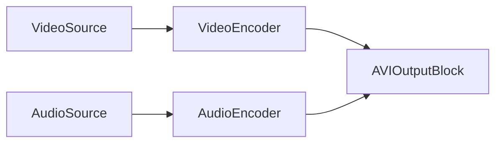

O, si usando una fuente que proporciona datos codificados, o si el `AVIOutputBlock` maneja codificadores internos basados en configuraciones:

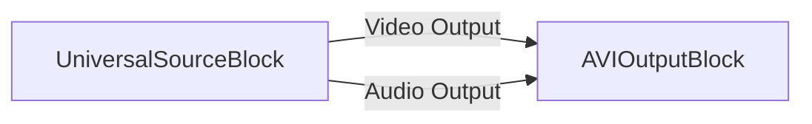

### Código de muestra

```csharp
// crear pipeline
var pipeline = new MediaBlocksPipeline();

// crear fuente de video (ejemplo: fuente virtual)
var videoSource = new VirtualVideoSourceBlock(new VirtualVideoSourceSettings());

// crear fuente de audio (ejemplo: fuente virtual)
var audioSource = new VirtualAudioSourceBlock(new VirtualAudioSourceSettings());

// crear bloque de salida AVI
// Este constructor usa codificadores internos predeterminados H264 video y AAC audio.
var aviOutput = new AVIOutputBlock("output.avi");

// Crear entradas para el bloque de salida AVI
var videoInputPad = aviOutput.CreateNewInput(MediaBlockPadMediaType.Video);
var audioInputPad = aviOutput.CreateNewInput(MediaBlockPadMediaType.Audio);

// conectar ruta de video
pipeline.Connect(videoSource.Output, videoInputPad);

// conectar ruta de audio
pipeline.Connect(audioSource.Output, audioInputPad);

// iniciar pipeline
await pipeline.StartAsync();

// ... más tarde, para detener ...
// await pipeline.StopAsync();
```

### Comentarios

El `AVIOutputBlock` maneja internamente instancias de codificador (como `H264Encoder` y `AACEncoder` o `MP3Encoder`) basadas en las configuraciones proporcionadas. Asegúrese de que los plugins GStreamer necesarios y componentes SDK para estos codificadores y el muxer AVI estén disponibles.

Para verificar disponibilidad:
`AVIOutputBlock.IsAvailable(IH264EncoderSettings h264settings, IAACEncoderSettings aacSettings)`

### Plataformas

Primariamente Windows. La disponibilidad en otras plataformas depende del soporte de plugins GStreamer para muxing AVI y los codificadores elegidos.

## Bloque de Salida Facebook Live

El `FacebookLiveOutputBlock` está diseñado para transmitir video y audio a Facebook Live usando RTMP. Usa internamente codificadores H.264 video y AAC audio.

### Información del bloque

Nombre: `FacebookLiveOutputBlock`.

| Dirección del pin | Tipo de medio | Codificadores esperados |
| --- | :---: | :---: |
| Entrada Video | varios | H.264 (interno) |
| Entrada Audio | varios | AAC (interno) |

### Configuraciones

El `FacebookLiveOutputBlock` se configura usando `FacebookLiveSinkSettings`, `IH264EncoderSettings`, y `IAACEncoderSettings`.

Propiedades clave de `FacebookLiveSinkSettings`:

- `Url` (string): La URL RTMP proporcionada por Facebook Live para transmisión.

Constructor:

- `FacebookLiveOutputBlock(FacebookLiveSinkSettings sinkSettings, IH264EncoderSettings h264settings, IAACEncoderSettings aacSettings)`

### El pipeline de muestra

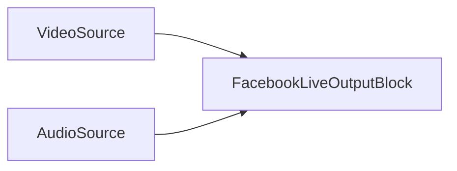

### Código de muestra

```csharp
// crear pipeline
var pipeline = new MediaBlocksPipeline();

// crear fuente de video (ej. SystemVideoSourceBlock)
var videoSource = new SystemVideoSourceBlock(videoSourceSettings); // Asumiendo videoSourceSettings configurados

// crear fuente de audio (ej. SystemAudioSourceBlock)
var audioSource = new SystemAudioSourceBlock(audioSourceSettings); // Asumiendo audioSourceSettings configurados

// configurar configuraciones de sumidero Facebook Live
var fbSinkSettings = new FacebookLiveSinkSettings("rtmp://your-facebook-live-url/your-stream-key");

// configurar configuraciones de codificador H.264 (usar predeterminados o personalizar)
var h264Settings = H264EncoderBlock.GetDefaultSettings();
h264Settings.Bitrate = 4000000; // Ejemplo: 4 Mbps

// configurar configuraciones de codificador AAC (usar predeterminados o personalizar)
var aacSettings = AACEncoderBlock.GetDefaultSettings();
aacSettings.Bitrate = 128000; // Ejemplo: 128 Kbps

// crear bloque de salida Facebook Live
var facebookOutput = new FacebookLiveOutputBlock(fbSinkSettings, h264Settings, aacSettings);

// Crear entradas para el bloque de salida Facebook Live
var videoInputPad = facebookOutput.CreateNewInput(MediaBlockPadMediaType.Video);
var audioInputPad = facebookOutput.CreateNewInput(MediaBlockPadMediaType.Audio);

// conectar ruta de video
pipeline.Connect(videoSource.Output, videoInputPad);

// conectar ruta de audio
pipeline.Connect(audioSource.Output, audioInputPad);

// iniciar pipeline
await pipeline.StartAsync();

// ... más tarde, para detener ...
// await pipeline.StopAsync();
```

### Comentarios

Este bloque encapsula los codificadores H.264 y AAC necesarios y el sumidero RTMP (`FacebookLiveSink`).
Asegúrese de que `FacebookLiveSink`, `H264Encoder`, y `AACEncoder` estén disponibles. `FacebookLiveOutputBlock.IsAvailable()` puede usarse para verificar esto (aunque el código mostrado muestra `FacebookLiveSink.IsAvailable()`).

### Plataformas

Windows, macOS, Linux, iOS, Android (La disponibilidad de plataforma depende del soporte RTMP GStreamer y disponibilidad de codificadores).

## Bloque de Salida FLAC

El `FLACOutputBlock` se usa para crear archivos de audio FLAC (Free Lossless Audio Codec). Toma datos de audio sin comprimir, los codifica usando un codificador FLAC, y los guarda en un archivo `.flac`.

### Información del bloque

Nombre: `FLACOutputBlock`.

| Dirección del pin | Tipo de medio | Codificadores esperados |
| --- | :---: | :---: |
| Entrada Audio | audio sin comprimir | FLAC (interno) |

### Configuraciones

El `FLACOutputBlock` se configura con un nombre de archivo y `FLACEncoderSettings`.

Propiedades clave de `FLACEncoderSettings` (consulte documentación `FLACEncoderSettings` para detalles completos):

- Nivel de calidad, nivel de compresión, etc.

Constructor:

- `FLACOutputBlock(string filename, FLACEncoderSettings settings)`

### El pipeline de muestra

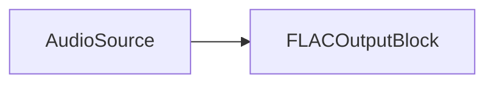

### Código de muestra

```csharp
// crear pipeline
var pipeline = new MediaBlocksPipeline();

// crear fuente de audio (ejemplo: fuente de audio virtual)
var audioSource = new VirtualAudioSourceBlock(new VirtualAudioSourceSettings());

// configurar configuraciones de codificador FLAC
var flacSettings = new FLACEncoderSettings();
// flacSettings.Quality = 8; // Ejemplo: Establecer nivel de calidad (0-8, predeterminado es 5)

// crear bloque de salida FLAC
var flacOutput = new FLACOutputBlock("output.flac", flacSettings);

// conectar ruta de audio
pipeline.Connect(audioSource.Output, flacOutput.Input);

// iniciar pipeline
await pipeline.StartAsync();

// ... más tarde, para detener ...
// await pipeline.StopAsync();
```

### Comentarios

Este bloque combina un `FLACEncoder` y un `FileSink` internamente.
Para verificar si el bloque y sus dependencias están disponibles:
`FLACOutputBlock.IsAvailable()` (Esto verifica disponibilidad de `FLACEncoder` y `FileSink`).

### Plataformas

Windows, macOS, Linux, iOS, Android (La disponibilidad de plataforma depende del soporte de codificador FLAC GStreamer y sumidero de archivo).

## Bloque de Salida M4A

El `M4AOutputBlock` crea archivos M4A (MPEG-4 Audio), comúnmente usados para audio AAC codificado. Usa un codificador de audio AAC y un sumidero MP4 para producir archivos `.m4a`.

### Información del bloque

Nombre: `M4AOutputBlock`.

| Dirección del pin | Tipo de medio | Codificadores esperados |
| --- | :---: | :---: |
| Entrada Audio | varios | AAC (interno) |

### Configuraciones

El `M4AOutputBlock` se configura usando `MP4SinkSettings` y `IAACEncoderSettings`.

Propiedades clave de `MP4SinkSettings`:

- `Filename` (string): La ruta al archivo M4A de salida.

Propiedades clave de `IAACEncoderSettings` (consulte `AACEncoderSettings` para detalles):

- Bitrate, perfil, etc.

Constructores:

- `M4AOutputBlock(string filename)`: Usa configuraciones predeterminadas de codificador AAC.
- `M4AOutputBlock(MP4SinkSettings sinkSettings, IAACEncoderSettings aacSettings)`: Usa configuraciones de codificador AAC especificadas.

### El pipeline de muestra

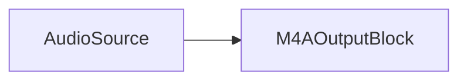

### Código de muestra

```csharp
// crear pipeline
var pipeline = new MediaBlocksPipeline();

// crear fuente de audio (ejemplo: fuente de audio virtual)
var audioSource = new VirtualAudioSourceBlock(new VirtualAudioSourceSettings());

// configurar bloque de salida M4A con configuraciones AAC predeterminadas
var m4aOutput = new M4AOutputBlock("output.m4a");

// O, con configuraciones AAC personalizadas:
// var sinkSettings = new MP4SinkSettings("output.m4a");
// var aacSettings = AACEncoderBlock.GetDefaultSettings();
// aacSettings.Bitrate = 192000; // Ejemplo: 192 Kbps
// var m4aOutput = new M4AOutputBlock(sinkSettings, aacSettings);

// Crear entrada para el bloque de salida M4A
var audioInputPad = m4aOutput.CreateNewInput(MediaBlockPadMediaType.Audio);

// conectar ruta de audio
pipeline.Connect(audioSource.Output, audioInputPad);

// iniciar pipeline
await pipeline.StartAsync();

// ... más tarde, para detener ...
// await pipeline.StopAsync();
```

### Comentarios

El `M4AOutputBlock` maneja internamente un `AACEncoder` y un `MP4Sink`.
Para verificar disponibilidad:
`M4AOutputBlock.IsAvailable(IAACEncoderSettings aacSettings)`

### Plataformas

Windows, macOS, Linux, iOS, Android (La disponibilidad de plataforma depende del soporte de muxer MP4 GStreamer y codificador AAC).

## Bloque de Salida MKV

El `MKVOutputBlock` se usa para crear archivos Matroska (MKV). MKV es un formato de contenedor flexible que puede contener varios flujos de video, audio y subtítulos. Este bloque combina codificadores de video y audio especificados con un sumidero MKV.

### Información del bloque

Nombre: `MKVOutputBlock`.

| Dirección del pin | Tipo de medio | Codificadores esperados |
| --- | :---: | :---: |
| Entrada Video | varios | `IVideoEncoder` (ej. H.264, HEVC, VPX, AV1) |
| Entrada Audio | varios | `IAudioEncoder` (ej. AAC, MP3, Vorbis, Opus, Speex) |

### Configuraciones

El `MKVOutputBlock` se configura usando `MKVSinkSettings`, junto con configuraciones para los codificadores de video (`IVideoEncoder`) y audio (`IAudioEncoder`) elegidos.

Propiedades clave de `MKVSinkSettings`:

- `Filename` (string): La ruta al archivo MKV de salida.

Constructor:

- `MKVOutputBlock(MKVSinkSettings sinkSettings, IVideoEncoder videoSettings, IAudioEncoder audioSettings)`

### El pipeline de muestra

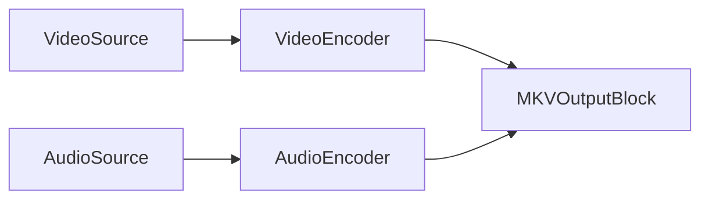

Más directamente, si `MKVOutputBlock` maneja instanciación de codificador internamente:

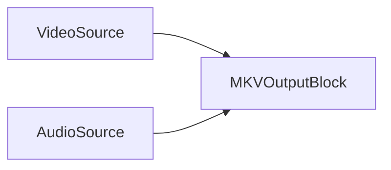

### Código de muestra

```csharp
// crear pipeline
var pipeline = new MediaBlocksPipeline();

// crear fuente de video (ejemplo: fuente virtual)
var videoSource = new VirtualVideoSourceBlock(new VirtualVideoSourceSettings());

// crear fuente de audio (ejemplo: fuente virtual)
var audioSource = new VirtualAudioSourceBlock(new VirtualAudioSourceSettings());

// configurar configuraciones de sumidero MKV
var mkvSinkSettings = new MKVSinkSettings("output.mkv");

// configurar codificador de video (ejemplo: H.264)
var h264Settings = H264EncoderBlock.GetDefaultSettings();
// h264Settings.Bitrate = 5000000; // Ejemplo

// configurar codificador de audio (ejemplo: AAC)
var aacSettings = AACEncoderBlock.GetDefaultSettings();
// aacSettings.Bitrate = 128000; // Ejemplo

// crear bloque de salida MKV
var mkvOutput = new MKVOutputBlock(mkvSinkSettings, h264Settings, aacSettings);

// Crear entradas para el bloque de salida MKV
var videoInputPad = mkvOutput.CreateNewInput(MediaBlockPadMediaType.Video);
var audioInputPad = mkvOutput.CreateNewInput(MediaBlockPadMediaType.Audio);

// conectar ruta de video
pipeline.Connect(videoSource.Output, videoInputPad);

// conectar ruta de audio
pipeline.Connect(audioSource.Output, audioInputPad);

// iniciar pipeline
await pipeline.StartAsync();

// ... más tarde, para detener ...
// await pipeline.StopAsync();
```

### Comentarios

El `MKVOutputBlock` maneja internamente las instancias de codificador de video y audio especificadas (ej. `H264Encoder`, `HEVCEncoder`, `AACEncoder`, `VorbisEncoder`, etc.) y un `MKVSink`.
Codificadores de video soportados incluyen H.264, HEVC, VPX (VP8/VP9), AV1.
Codificadores de audio soportados incluyen AAC, MP3, Vorbis, Opus, Speex.

Para verificar disponibilidad (ejemplo con H.264 y AAC):
`MKVOutputBlock.IsAvailable(IH264EncoderSettings h264settings, IAACEncoderSettings aacSettings)`

### Plataformas

Windows, macOS, Linux, iOS, Android (La disponibilidad de plataforma depende del soporte de muxer MKV GStreamer y codificadores elegidos).

## Bloque de Salida MP3

El `MP3OutputBlock` se usa para crear archivos de audio MP3. Codifica datos de audio sin comprimir usando un codificador MP3 y los guarda en un archivo `.mp3`.

### Información del bloque

Nombre: `MP3OutputBlock`.

| Dirección del pin | Tipo de medio | Codificadores esperados |
| --- | :---: | :---: |
| Entrada Audio | audio sin comprimir | MP3 (interno) |

### Configuraciones

El `MP3OutputBlock` se configura con un nombre de archivo y `MP3EncoderSettings`.

Propiedades clave de `MP3EncoderSettings` (consulte documentación `MP3EncoderSettings` para detalles completos):

- Bitrate, calidad, modo de canal, etc.

Constructor:

- `MP3OutputBlock(string filename, MP3EncoderSettings mp3Settings)`

### El pipeline de muestra

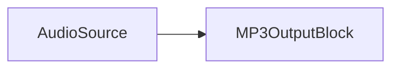

### Código de muestra

```csharp
// crear pipeline
var pipeline = new MediaBlocksPipeline();

// crear fuente de audio (ejemplo: fuente de audio virtual)
var audioSource = new VirtualAudioSourceBlock(new VirtualAudioSourceSettings());

// configurar configuraciones de codificador MP3
var mp3Settings = new MP3EncoderSettings();
// mp3Settings.Bitrate = 192; // Ejemplo: Establecer bitrate a 192 kbps
// mp3Settings.Quality = MP3Quality.Best; // Ejemplo: Establecer calidad

// crear bloque de salida MP3
var mp3Output = new MP3OutputBlock("output.mp3", mp3Settings);

// conectar ruta de audio
pipeline.Connect(audioSource.Output, mp3Output.Input);

// iniciar pipeline
await pipeline.StartAsync();

// ... más tarde, para detener ...
// await pipeline.StopAsync();
```

### Comentarios

Este bloque combina un `MP3Encoder` y un `FileSink` internamente.
Para verificar si el bloque y sus dependencias están disponibles:
`MP3OutputBlock.IsAvailable()` (Esto verifica disponibilidad de `MP3Encoder` y `FileSink`).

### Plataformas

Windows, macOS, Linux, iOS, Android (La disponibilidad de plataforma depende del soporte de codificador MP3 GStreamer (ej. LAME) y sumidero de archivo).

## Bloque de Salida MP4

El `MP4OutputBlock` se usa para crear archivos MP4. Puede combinar varios codificadores de video y audio con un sumidero MP4 para producir archivos `.mp4`.

### Información del bloque

Nombre: `MP4OutputBlock`.

| Dirección del pin | Tipo de medio | Codificadores esperados |
| --- | :---: | :---: |
| Entrada Video | varios | `IVideoEncoder` (ej. H.264, HEVC) |
| Entrada Audio | varios | `IAudioEncoder` (ej. AAC, MP3) |

### Configuraciones

El `MP4OutputBlock` se configura usando `MP4SinkSettings`, junto con configuraciones para los codificadores de video (`IVideoEncoder`, típicamente `IH264EncoderSettings` o `IHEVCEncoderSettings`) y audio (`IAudioEncoder`, típicamente `IAACEncoderSettings` o `MP3EncoderSettings`) elegidos.

Propiedades clave de `MP4SinkSettings`:

- `Filename` (string): La ruta al archivo MP4 de salida.
- También puede ser `MP4SplitSinkSettings` para grabar en segmentos.

Constructores:

- `MP4OutputBlock(string filename)`: Usa codificadores predeterminados H.264 video y AAC audio.
- `MP4OutputBlock(MP4SinkSettings sinkSettings, IH264EncoderSettings h264settings, IAACEncoderSettings aacSettings)`
- `MP4OutputBlock(MP4SinkSettings sinkSettings, IH264EncoderSettings h264settings, MP3EncoderSettings mp3Settings)`
- `MP4OutputBlock(MP4SinkSettings sinkSettings, IHEVCEncoderSettings hevcSettings, IAACEncoderSettings aacSettings)`
- `MP4OutputBlock(MP4SinkSettings sinkSettings, IHEVCEncoderSettings hevcSettings, MP3EncoderSettings mp3Settings)`

### El pipeline de muestra

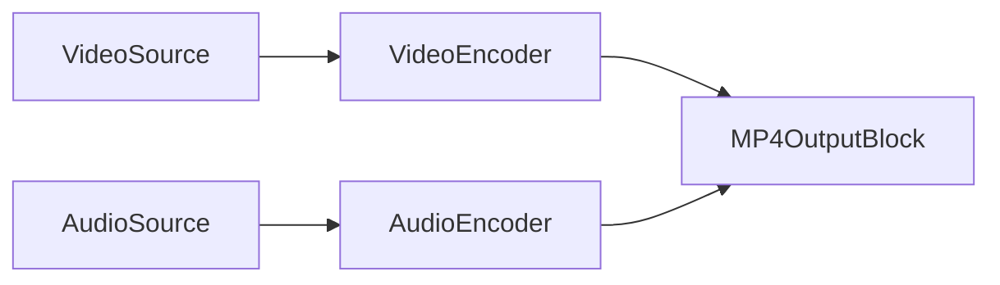

Si `MP4OutputBlock` usa sus codificadores internos predeterminados:

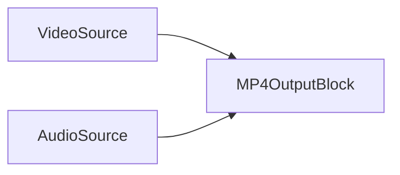

### Código de muestra

```csharp
// crear pipeline
var pipeline = new MediaBlocksPipeline();

// crear fuente de video (ejemplo: fuente virtual)
var videoSource = new VirtualVideoSourceBlock(new VirtualVideoSourceSettings());

// crear fuente de audio (ejemplo: fuente virtual)
var audioSource = new VirtualAudioSourceBlock(new VirtualAudioSourceSettings());

// crear bloque de salida MP4 con codificadores predeterminados H.264 video y AAC audio
var mp4Output = new MP4OutputBlock("output.mp4");

// O, con configuraciones H.264 y AAC personalizadas:
// var sinkSettings = new MP4SinkSettings("output.mp4");
// var h264Settings = H264EncoderBlock.GetDefaultSettings();
// h264Settings.Bitrate = 8000000; // Ejemplo: 8 Mbps
// var aacSettings = AACEncoderBlock.GetDefaultSettings();
// aacSettings.Bitrate = 192000; // Ejemplo: 192 Kbps
// var mp4Output = new MP4OutputBlock(sinkSettings, h264Settings, aacSettings);

// Crear entradas para el bloque de salida MP4
var videoInputPad = mp4Output.CreateNewInput(MediaBlockPadMediaType.Video);
var audioInputPad = mp4Output.CreateNewInput(MediaBlockPadMediaType.Audio);

// conectar ruta de video
pipeline.Connect(videoSource.Output, videoInputPad);

// conectar ruta de audio
pipeline.Connect(audioSource.Output, audioInputPad);

// iniciar pipeline
await pipeline.StartAsync();

// ... más tarde, para detener ...
// await pipeline.StopAsync();
```

### Comentarios

El `MP4OutputBlock` maneja internamente instancias de codificador de video (ej. `H264Encoder`, `HEVCEncoder`) y audio (ej. `AACEncoder`, `MP3Encoder`) junto con un `MP4Sink`.
Para verificar disponibilidad (ejemplo con H.264 y AAC):
`MP4OutputBlock.IsAvailable(IH264EncoderSettings h264settings, IAACEncoderSettings aacSettings)`

### Plataformas

Windows, macOS, Linux, iOS, Android (La disponibilidad de plataforma depende del soporte de muxer MP4 GStreamer y codificadores elegidos).

## Bloque de Salida OGG Opus

El `OGGOpusOutputBlock` se usa para crear archivos de audio Ogg Opus. Codifica datos de audio sin comprimir usando un codificador Opus y los multiplexa en un contenedor Ogg, guardando en un archivo `.opus` o `.ogg`.

### Información del bloque

Nombre: `OGGOpusOutputBlock`.

| Dirección del pin | Tipo de medio | Codificadores esperados |
| --- | :---: | :---: |
| Entrada Audio | audio sin comprimir | Opus (interno) |

### Configuraciones

El `OGGOpusOutputBlock` se configura con un nombre de archivo y `OPUSEncoderSettings`.

Propiedades clave de `OPUSEncoderSettings` (consulte documentación `OPUSEncoderSettings` para detalles completos):

- Bitrate, complejidad, duración de frame, tipo de audio (voz/música), etc.

Constructor:

- `OGGOpusOutputBlock(string filename, OPUSEncoderSettings settings)`

### El pipeline de muestra

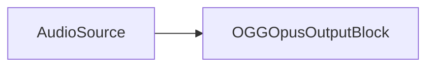

### Código de muestra

```csharp
// crear pipeline
var pipeline = new MediaBlocksPipeline();

// crear fuente de audio (ejemplo: fuente de audio virtual)
var audioSource = new VirtualAudioSourceBlock(new VirtualAudioSourceSettings());

// configurar configuraciones de codificador Opus
var opusSettings = new OPUSEncoderSettings();
// opusSettings.Bitrate = 64000; // Ejemplo: Establecer bitrate a 64 kbps
// opusSettings.AudioType = OpusEncoderAudioType.Music; // Ejemplo

// crear bloque de salida OGG Opus
var oggOpusOutput = new OGGOpusOutputBlock("output.opus", opusSettings);

// conectar ruta de audio
pipeline.Connect(audioSource.Output, oggOpusOutput.Input);

// iniciar pipeline
await pipeline.StartAsync();

// ... más tarde, para detener ...
// await pipeline.StopAsync();
```

### Comentarios

Este bloque combina un `OPUSEncoder` y un `OGGSink` internamente.
Para verificar si el bloque y sus dependencias están disponibles:
`OGGOpusOutputBlock.IsAvailable()` (Esto verifica `OGGSink`, `OPUSEncoder`, y `FileSink` - `FileSink` podría ser implícito a la lógica `OGGSink` para salida de archivo).

### Plataformas

Windows, macOS, Linux, iOS, Android (La disponibilidad de plataforma depende del soporte de muxer Ogg GStreamer y codificador Opus).

## Bloque de Salida OGG Speex

El `OGGSpeexOutputBlock` se usa para crear archivos de audio Ogg Speex, típicamente para voz. Codifica datos de audio sin comprimir usando un codificador Speex, los multiplexa en un contenedor Ogg, y guarda en un archivo `.spx` o `.ogg`.

### Información del bloque

Nombre: `OGGSpeexOutputBlock`.

| Dirección del pin | Tipo de medio | Codificadores esperados |
| --- | :---: | :---: |
| Entrada Audio | audio sin comprimir | Speex (interno) |

### Configuraciones

El `OGGSpeexOutputBlock` se configura con un nombre de archivo y `SpeexEncoderSettings`.

Propiedades clave de `SpeexEncoderSettings` (consulte documentación `SpeexEncoderSettings` para detalles completos):

- Calidad, complejidad, modo de codificación (VBR/ABR/CBR), etc.

Constructor:

- `OGGSpeexOutputBlock(string filename, SpeexEncoderSettings settings)`

### El pipeline de muestra

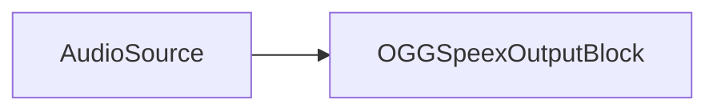

### Código de muestra

```csharp
// crear pipeline
var pipeline = new MediaBlocksPipeline();

// crear fuente de audio (ejemplo: fuente de audio virtual)
var audioSource = new VirtualAudioSourceBlock(new VirtualAudioSourceSettings());

// configurar configuraciones de codificador Speex
var speexSettings = new SpeexEncoderSettings();
// speexSettings.Quality = 8; // Ejemplo: Establecer calidad (0-10)
// speexSettings.Mode = SpeexEncoderMode.VBR; // Ejemplo: Usar Variable Bitrate

// crear bloque de salida OGG Speex
var oggSpeexOutput = new OGGSpeexOutputBlock("output.spx", speexSettings);

// conectar ruta de audio
pipeline.Connect(audioSource.Output, oggSpeexOutput.Input);

// iniciar pipeline
await pipeline.StartAsync();

// ... más tarde, para detener ...
// await pipeline.StopAsync();
```

### Comentarios

Este bloque combina un `SpeexEncoder` y un `OGGSink` internamente.
Para verificar si el bloque y sus dependencias están disponibles:
`OGGSpeexOutputBlock.IsAvailable()` (Esto verifica `OGGSink`, `SpeexEncoder`, y `FileSink` - `FileSink` podría ser implícito a `OGGSink` para salida de archivo).

### Plataformas

Windows, macOS, Linux, iOS, Android (La disponibilidad de plataforma depende del soporte de muxer Ogg GStreamer y codificador Speex).

## Bloque de Salida OGG Vorbis

El `OGGVorbisOutputBlock` se usa para crear archivos de audio Ogg Vorbis. Codifica datos de audio sin comprimir usando un codificador Vorbis, los multiplexa en un contenedor Ogg, y guarda en un archivo `.ogg`.

### Información del bloque

Nombre: `OGGVorbisOutputBlock`.

| Dirección del pin | Tipo de medio | Codificadores esperados |
| --- | :---: | :---: |
| Entrada Audio | audio sin comprimir | Vorbis (interno) |

### Configuraciones

El `OGGVorbisOutputBlock` se configura con un nombre de archivo y `VorbisEncoderSettings`.

Propiedades clave de `VorbisEncoderSettings` (consulte documentación `VorbisEncoderSettings` para detalles completos):

- Calidad, bitrate, configuraciones de bitrate administrado/no administrado, etc.

Constructor:

- `OGGVorbisOutputBlock(string filename, VorbisEncoderSettings settings)`

### El pipeline de muestra

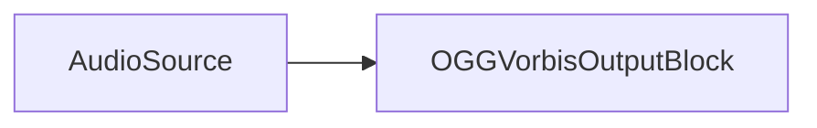

### Código de muestra

```csharp
// crear pipeline
var pipeline = new MediaBlocksPipeline();

// crear fuente de audio (ejemplo: fuente de audio virtual)
var audioSource = new VirtualAudioSourceBlock(new VirtualAudioSourceSettings());

// configurar configuraciones de codificador Vorbis
var vorbisSettings = new VorbisEncoderSettings();
// vorbisSettings.Quality = 0.8f; // Ejemplo: Establecer calidad (0.0 a 1.0)
// vorbisSettings.Bitrate = 128000; // Ejemplo si no usando codificación basada en calidad

// crear bloque de salida OGG Vorbis
var oggVorbisOutput = new OGGVorbisOutputBlock("output.ogg", vorbisSettings);

// conectar ruta de audio
pipeline.Connect(audioSource.Output, oggVorbisOutput.Input);

// iniciar pipeline
await pipeline.StartAsync();

// ... más tarde, para detener ...
// await pipeline.StopAsync();
```

### Comentarios

Este bloque combina un `VorbisEncoder` y un `OGGSink` internamente.
Para verificar si el bloque y sus dependencias están disponibles:
`OGGVorbisOutputBlock.IsAvailable()` (Esto verifica `OGGSink`, `VorbisEncoder`, y `FileSink` - `FileSink` podría ser implícito a `OGGSink` para salida de archivo).

### Plataformas

Windows, macOS, Linux, iOS, Android (La disponibilidad de plataforma depende del soporte de muxer Ogg GStreamer y codificador Vorbis).

## Bloque de Salida WebM

El `WebMOutputBlock` se usa para crear archivos WebM, típicamente conteniendo video VP8 o VP9 y audio Vorbis. Combina un codificador de video VPX y un codificador de audio Vorbis con un sumidero WebM.

### Información del bloque

Nombre: `WebMOutputBlock`.

| Dirección del pin | Tipo de medio | Codificadores esperados |
| --- | :---: | :---: |
| Entrada Video | varios | VPX (VP8/VP9 - interno) |
| Entrada Audio | varios | Vorbis (interno) |

### Configuraciones

El `WebMOutputBlock` se configura usando `WebMSinkSettings`, `IVPXEncoderSettings` (para VP8 o VP9), y `VorbisEncoderSettings`.

Propiedades clave de `WebMSinkSettings`:

- `Filename` (string): La ruta al archivo WebM de salida.

Propiedades clave de `IVPXEncoderSettings` (consulte `VPXEncoderSettings` para detalles):

- Bitrate, calidad, velocidad, hilos, etc.

Propiedades clave de `VorbisEncoderSettings`:

- Calidad, bitrate, etc.

Constructor:

- `WebMOutputBlock(WebMSinkSettings sinkSettings, IVPXEncoderSettings videoEncoderSettings, VorbisEncoderSettings vorbisSettings)`

### El pipeline de muestra

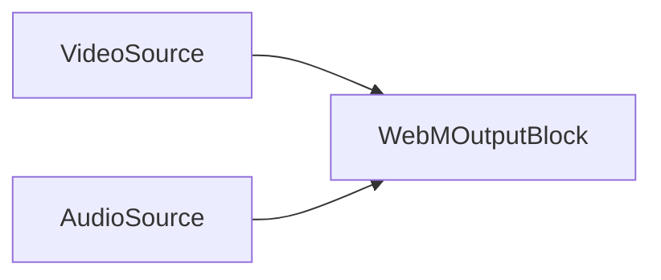

### Código de muestra

```csharp
// crear pipeline
var pipeline = new MediaBlocksPipeline();

// crear fuente de video (ejemplo: fuente virtual)
var videoSource = new VirtualVideoSourceBlock(new VirtualVideoSourceSettings());

// crear fuente de audio (ejemplo: fuente virtual)
var audioSource = new VirtualAudioSourceBlock(new VirtualAudioSourceSettings());

// configurar configuraciones de sumidero WebM
var webmSinkSettings = new WebMSinkSettings("output.webm");

// configurar configuraciones de codificador VPX (ejemplo: VP9)
var vp9Settings = new VPXEncoderSettings(VPXEncoderMode.VP9);
// vp9Settings.Bitrate = 2000000; // Ejemplo: 2 Mbps
// vp9Settings.Speed = VP9Speed.Fast; // Ejemplo

// configurar configuraciones de codificador Vorbis
var vorbisSettings = new VorbisEncoderSettings();
// vorbisSettings.Quality = 0.7f; // Ejemplo: Establecer calidad

// crear bloque de salida WebM
var webmOutput = new WebMOutputBlock(webmSinkSettings, vp9Settings, vorbisSettings);

// Crear entradas para el bloque de salida WebM
var videoInputPad = webmOutput.CreateNewInput(MediaBlockPadMediaType.Video);
var audioInputPad = webmOutput.CreateNewInput(MediaBlockPadMediaType.Audio);

// conectar ruta de video
pipeline.Connect(videoSource.Output, videoInputPad);

// conectar ruta de audio
pipeline.Connect(audioSource.Output, audioInputPad);

// iniciar pipeline
await pipeline.StartAsync();

// ... más tarde, para detener ...
// await pipeline.StopAsync();
```

### Comentarios

El `WebMOutputBlock` maneja internamente un `VPXEncoder` (para VP8/VP9), un `VorbisEncoder`, y un `WebMSink`.
Para verificar disponibilidad:
`WebMOutputBlock.IsAvailable(IVPXEncoderSettings videoEncoderSettings)`

### Plataformas

Windows, macOS, Linux, iOS, Android (La disponibilidad de plataforma depende del soporte de muxer WebM GStreamer, codificador VPX, y codificador Vorbis).

## Bloque de Salida Separado

El `SeparateOutputBlock` proporciona una forma flexible de configurar pipelines de salida personalizados, permitiendo especificar codificadores de video y audio distintos, procesadores, y un escritor/sumidero final. Usa fuentes puente (`BridgeVideoSourceBlock`, `BridgeAudioSourceBlock`) para derivar del pipeline principal, habilitando grabación independientemente de vista previa u otro procesamiento.

### Información del bloque

Nombre: `SeparateOutputBlock`.

Este bloque en sí mismo no tiene pads de entrada directos en el sentido tradicional; orquesta un sub-pipeline.

### Configuraciones

El `SeparateOutputBlock` se configura usando el objeto de configuraciones `SeparateOutput`.

Propiedades clave de `SeparateOutput`:

- `Sink` (`MediaBlock`): El sumidero/muxer final para la salida (ej. `MP4OutputBlock`, `FileSink`). Debe implementar `IMediaBlockDynamicInputs` si se usan codificadores separados, o `IMediaBlockSinkAllInOne` si maneja codificación internamente.
- `VideoEncoder` (`MediaBlock`): Un codificador de video opcional.
- `AudioEncoder` (`MediaBlock`): Un codificador de audio opcional.
- `VideoProcessor` (`MediaBlock`): Un bloque de procesamiento de video opcional para insertar antes del codificador de video.
- `AudioProcessor` (`MediaBlock`): Un bloque de procesamiento de audio opcional para insertar antes del codificador de audio.
- `Writer` (`MediaBlock`): Un bloque de escritura opcional que toma la salida del `Sink` (ej. para lógica de escritura de archivo personalizada o streaming de red si el `Sink` es solo un muxer).
- `GetFilename()`: Método para recuperar el nombre de archivo de salida configurado si aplica.

Constructor:

- `SeparateOutputBlock(MediaBlocksPipeline pipeline, SeparateOutput settings, BridgeVideoSourceSettings bridgeVideoSourceSettings, BridgeAudioSourceSettings bridgeAudioSourceSettings)`

### El pipeline conceptual

Este bloque crea una rama de procesamiento independiente. Para video:

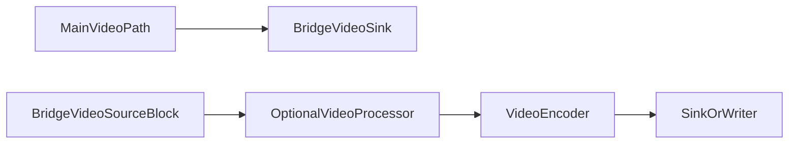

Para audio:

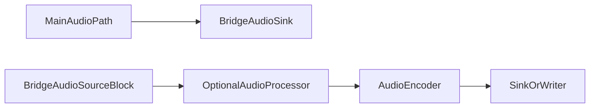

### Código de muestra

```csharp
// Asumiendo 'pipeline' es tu MediaBlocksPipeline principal
// Asumiendo 'mainVideoSourceOutputPad' y 'mainAudioSourceOutputPad' son salidas de tus fuentes principales

// 1. Configurar Sumideros Puente en tu pipeline principal
var bridgeVideoSinkSettings = new BridgeVideoSinkSettings("sep_video_bridge");
var bridgeVideoSink = new BridgeVideoSinkBlock(bridgeVideoSinkSettings);
pipeline.Connect(mainVideoSourceOutputPad, bridgeVideoSink.Input);

var bridgeAudioSinkSettings = new BridgeAudioSinkSettings("sep_audio_bridge");
var bridgeAudioSink = new BridgeAudioSinkBlock(bridgeAudioSinkSettings);
pipeline.Connect(mainAudioSourceOutputPad, bridgeAudioSink.Input);

// 2. Configurar Fuentes Puente para el sub-pipeline del SeparateOutputBlock
var bridgeVideoSourceSettings = new BridgeVideoSourceSettings("sep_video_bridge");
var bridgeAudioSourceSettings = new BridgeAudioSourceSettings("sep_audio_bridge");

// 3. Configurar codificadores y sumidero para la Salida Separada
var h264Settings = H264EncoderBlock.GetDefaultSettings();
var videoEncoder = new H264EncoderBlock(h264Settings);

var aacSettings = AACEncoderBlock.GetDefaultSettings();
var audioEncoder = new AACEncoderBlock(aacSettings);

var mp4SinkSettings = new MP4SinkSettings("separate_output.mp4");
var mp4Sink = new MP4OutputBlock(mp4SinkSettings, h264Settings, aacSettings); // Usando MP4OutputBlock que maneja muxing.
// Alternativamente, usar un MP4Sink sin procesar y conectar codificadores a él.

// 4. Configurar configuraciones de Salida Separada
var separateOutputSettings = new SeparateOutput(
    sink: mp4Sink, // mp4Sink actuará como el escritor final aquí
    videoEncoder: videoEncoder, // Esto es algo redundante si mp4Sink es MP4OutputBlock con codificadores
    audioEncoder: audioEncoder  // Lo mismo arriba. Mejor usar un sumidero sin procesar si proporcionando codificadores por separado
);

// Una configuración más típica si mp4Sink es solo un muxer (ej. new MP4Sink(mp4SinkRawSettings)):
// var separateOutputSettings = new SeparateOutput(
//     sink: rawMp4Muxer, 
//     videoEncoder: videoEncoder, 
//     audioEncoder: audioEncoder 
// );

// 5. Crear el SeparateOutputBlock (esto conectará internamente sus componentes)
var separateOutput = new SeparateOutputBlock(pipeline, separateOutputSettings, bridgeVideoSourceSettings, bridgeAudioSourceSettings);

// 6. Construir las fuentes, codificadores, y sumidero usados por SeparateOutputBlock
// Nota: Construir estos podría ser manejado por el pipeline si están agregados a él, 
// o podría necesitar hacerse explícitamente si son parte de un sub-gráfico no directamente en la lista de bloques del pipeline principal.
// El método Build() del SeparateOutputBlock intentará construir sus fuentes internas (_videoSource, _audioSource)
// y los codificadores/sumidero proporcionados si no han sido construidos.

// pipeline.Add(bridgeVideoSink);
// pipeline.Add(bridgeAudioSink);
// pipeline.Add(separateOutput); // Agregar el bloque orquestador

// Iniciar pipeline principal
// await pipeline.StartAsync(); // Esto también iniciará el procesamiento de salida separado vía puentes

// Para cambiar nombre de archivo más tarde:
// separateOutput.SetFilenameOrURL("new_separate_output.mp4");
```

### Comentarios

El `SeparateOutputBlock` es más un orquestador para un sub-pipeline que es alimentado por sumideros/fuentes puente del pipeline principal. Permite configuraciones de grabación o streaming complejas que pueden iniciarse/detenerse o modificarse hasta cierto punto independientemente.

Los componentes `VideoEncoder`, `AudioEncoder`, `Sink`, y `Writer` deben construirse correctamente. El método `SeparateOutputBlock.Build()` intenta construir estos componentes.

### Plataformas

Depende de los componentes usados dentro de la configuración `SeparateOutput`. Generalmente multiplataforma si los elementos GStreamer están disponibles.

## Bloque de Salida WMV

El `WMVOutputBlock` se usa para crear archivos Windows Media Video (WMV). Usa codificadores WMV video (`WMVEncoder`) y WMA audio (`WMAEncoder`) con un sumidero ASF (Advanced Systems Format) para producir archivos `.wmv`.

### Información del bloque

Nombre: `WMVOutputBlock`.

| Dirección del pin | Tipo de medio | Codificadores esperados |
| --- | :---: | :---: |
| Entrada Video | varios | WMV (interno) |
| Entrada Audio | varios | WMA (interno) |

### Configuraciones

El `WMVOutputBlock` se configura usando `ASFSinkSettings`, `WMVEncoderSettings`, y `WMAEncoderSettings`.

Propiedades clave de `ASFSinkSettings`:

- `Filename` (string): La ruta al archivo WMV de salida.

Propiedades clave de `WMVEncoderSettings` (consulte documentación `WMVEncoderSettings`):

- Bitrate, tamaño GOP, calidad, etc.

Propiedades clave de `WMAEncoderSettings` (consulte documentación `WMAEncoderSettings`):

- Bitrate, versión WMA, etc.

Constructores:

- `WMVOutputBlock(string filename)`: Usa configuraciones predeterminadas de codificador WMV video y WMA audio.
- `WMVOutputBlock(ASFSinkSettings sinkSettings, WMVEncoderSettings videoSettings, WMAEncoderSettings audioSettings)`: Usa configuraciones de codificador especificadas.

### El pipeline de muestra

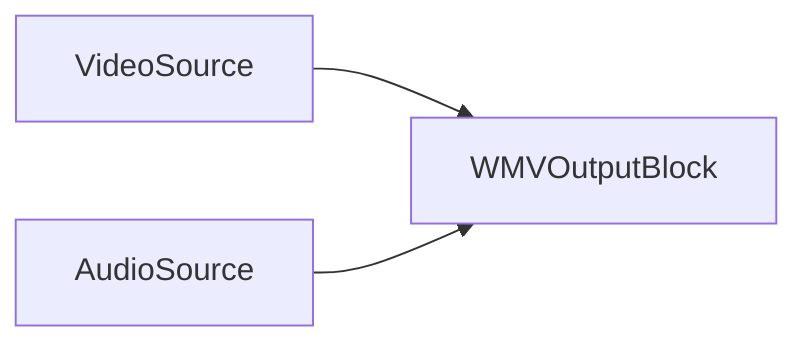

### Código de muestra

```csharp
// crear pipeline
var pipeline = new MediaBlocksPipeline();

// crear fuente de video (ejemplo: fuente virtual)
var videoSource = new VirtualVideoSourceBlock(new VirtualVideoSourceSettings());

// crear fuente de audio (ejemplo: fuente virtual)
var audioSource = new VirtualAudioSourceBlock(new VirtualAudioSourceSettings());

// crear bloque de salida WMV con configuraciones predeterminadas
var wmvOutput = new WMVOutputBlock("output.wmv");

// O, con configuraciones personalizadas:
// var asfSinkSettings = new ASFSinkSettings("output.wmv");
// var wmvEncSettings = WMVEncoderBlock.GetDefaultSettings();
// wmvEncSettings.Bitrate = 3000000; // Ejemplo: 3 Mbps
// var wmaEncSettings = WMAEncoderBlock.GetDefaultSettings();
// wmaEncSettings.Bitrate = 160000; // Ejemplo: 160 Kbps
// var wmvOutput = new WMVOutputBlock(asfSinkSettings, wmvEncSettings, wmaEncSettings);

// Crear entradas para el bloque de salida WMV
var videoInputPad = wmvOutput.CreateNewInput(MediaBlockPadMediaType.Video);
var audioInputPad = wmvOutput.CreateNewInput(MediaBlockPadMediaType.Audio);

// conectar ruta de video
pipeline.Connect(videoSource.Output, videoInputPad);

// conectar ruta de audio
pipeline.Connect(audioSource.Output, audioInputPad);

// iniciar pipeline
await pipeline.StartAsync();

// ... más tarde, para detener ...
// await pipeline.StopAsync();
```

### Comentarios

El `WMVOutputBlock` maneja internamente `WMVEncoder`, `WMAEncoder`, y `ASFSink`.
Para verificar disponibilidad:
`WMVOutputBlock.IsAvailable()`

### Plataformas

Primariamente Windows. La disponibilidad en otras plataformas depende del soporte de plugins GStreamer para muxing ASF, WMV, y WMA encoders (que pueden ser limitados fuera de Windows).

## Bloque de Salida YouTube

El `YouTubeOutputBlock` está diseñado para transmitir video y audio a YouTube Live usando RTMP. Utiliza internamente codificadores H.264 video y AAC audio.

### Información del bloque

Nombre: `YouTubeOutputBlock`.

| Dirección del pin | Tipo de medio | Codificadores esperados |
| --- | :---: | :---: |
| Entrada Video | varios | H.264 (interno) |
| Entrada Audio | varios | AAC (interno) |

### Configuraciones

El `YouTubeOutputBlock` se configura usando `YouTubeSinkSettings`, `IH264EncoderSettings`, y `IAACEncoderSettings`.

Propiedades clave de `YouTubeSinkSettings`:

- `Url` (string): La URL RTMP proporcionada por YouTube Live para transmisión (ej. "rtmp://a.rtmp.youtube.com/live2/YOUR-STREAM-KEY").

Constructor:

- `YouTubeOutputBlock(YouTubeSinkSettings sinkSettings, IH264EncoderSettings h264settings, IAACEncoderSettings aacSettings)`

### El pipeline de muestra

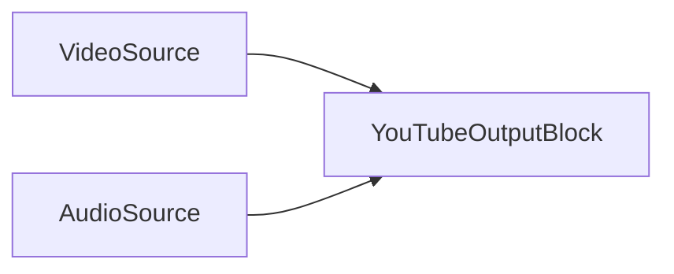

### Código de muestra

```csharp
// crear pipeline
var pipeline = new MediaBlocksPipeline();

// crear fuente de video (ej. SystemVideoSourceBlock)
var videoSource = new SystemVideoSourceBlock(videoSourceSettings); // Asumiendo videoSourceSettings configurados

// crear fuente de audio (ej. SystemAudioSourceBlock)
var audioSource = new SystemAudioSourceBlock(audioSourceSettings); // Asumiendo audioSourceSettings configurados

// configurar configuraciones de sumidero YouTube
var ytSinkSettings = new YouTubeSinkSettings("rtmp://a.rtmp.youtube.com/live2/YOUR-STREAM-KEY");

// configurar configuraciones de codificador H.264 (usar predeterminados o personalizar según recomendaciones YouTube)
var h264Settings = H264EncoderBlock.GetDefaultSettings();
// h264Settings.Bitrate = 6000000; // Ejemplo: 6 Mbps para 1080p
// h264Settings.UsagePreset = H264UsagePreset.None; // Ajustar basado en necesidades de rendimiento/calidad

// configurar configuraciones de codificador AAC (usar predeterminados o personalizar según recomendaciones YouTube)
var aacSettings = AACEncoderBlock.GetDefaultSettings();
// aacSettings.Bitrate = 128000; // Ejemplo: 128 Kbps estéreo

// crear bloque de salida YouTube
var youTubeOutput = new YouTubeOutputBlock(ytSinkSettings, h264Settings, aacSettings);

// Crear entradas para el bloque de salida YouTube
var videoInputPad = youTubeOutput.CreateNewInput(MediaBlockPadMediaType.Video);
var audioInputPad = youTubeOutput.CreateNewInput(MediaBlockPadMediaType.Audio);

// conectar ruta de video
pipeline.Connect(videoSource.Output, videoInputPad);

// conectar ruta de audio
pipeline.Connect(audioSource.Output, audioInputPad);

// iniciar pipeline
await pipeline.StartAsync();

// ... más tarde, para detener ...
// await pipeline.StopAsync();
```

### Comentarios

Este bloque encapsula los codificadores H.264 y AAC y el sumidero RTMP (`YouTubeSink`).
Asegúrese de que `YouTubeSink`, `H264Encoder`, y `AACEncoder` estén disponibles. `YouTubeOutputBlock.IsAvailable(IH264EncoderSettings h264settings, IAACEncoderSettings aacSettings)` puede usarse para verificar.
Es crucial configurar configuraciones de codificador (bitrate, resolución, frame rate) según configuraciones recomendadas de YouTube para live streaming para asegurar calidad óptima y compatibilidad.

### Plataformas

Windows, macOS, Linux, iOS, Android (La disponibilidad de plataforma depende del soporte RTMP GStreamer y disponibilidad de codificadores H.264/AAC).