# Blocs de sortie — VisioForge Media Blocks SDK .Net

[Media Blocks SDK .Net](https://www.visioforge.com/media-blocks-sdk-net){ .md-button .md-button--primary target="_blank" }

Les blocs de sortie, également appelés puits, sont responsables de l'écriture des données multimédias vers des fichiers, des flux réseau ou d'autres destinations. Ce sont généralement les derniers blocs d'une chaîne de traitement multimédia. VisioForge Media Blocks SDK .Net fournit une collection complète de blocs de sortie pour divers formats et protocoles.

Ce guide couvre les blocs de sortie fichier comme MP4, AVI, WebM, MKV, ainsi que les blocs de streaming réseau pour des protocoles comme RTMP (utilisé par YouTube et Facebook Live).

## Bloc de sortie AVI

L'`AVIOutputBlock` est utilisé pour créer des fichiers AVI. Il combine des encodeurs vidéo et audio avec un puits fichier pour produire des fichiers `.avi`.

### Informations sur le bloc

Nom : `AVIOutputBlock`.

| Direction du pin | Type de média | Encodeurs attendus |
| --- | :---: | :---: |
| Vidéo en entrée | divers | H264 (par défaut), autres encodeurs compatibles `IVideoEncoder` |
| Audio en entrée | divers | AAC (par défaut), MP3, autres encodeurs compatibles `IAudioEncoder` |

### Paramètres

L'`AVIOutputBlock` est configuré à l'aide d'`AVISinkSettings` ainsi que des paramètres des encodeurs vidéo et audio choisis (par ex. `IH264EncoderSettings` et `IAACEncoderSettings` ou `MP3EncoderSettings`).

Propriétés clés d'`AVISinkSettings` :

- `Filename` (string) : chemin du fichier AVI de sortie.

Constructeurs :

- `AVIOutputBlock(string filename)` : utilise les encodeurs vidéo H264 et audio AAC par défaut.
- `AVIOutputBlock(AVISinkSettings sinkSettings, IH264EncoderSettings h264settings, IAACEncoderSettings aacSettings)` : utilise les encodeurs vidéo H264 et audio AAC spécifiés.
- `AVIOutputBlock(AVISinkSettings sinkSettings, IH264EncoderSettings h264settings, MP3EncoderSettings mp3Settings)` : utilise les encodeurs vidéo H264 et audio MP3 spécifiés.

### Exemple de pipeline

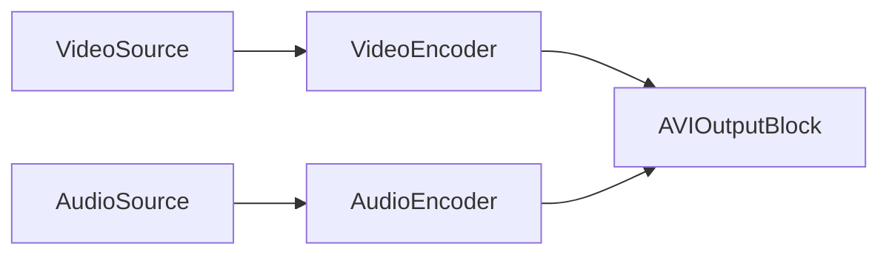

Ou, en utilisant une source qui fournit des données encodées, ou si l'`AVIOutputBlock` gère des encodeurs internes en fonction des paramètres :


### Exemple de code

```csharp
// créer le pipeline
var pipeline = new MediaBlocksPipeline();

// créer une source vidéo (exemple : source virtuelle)
var videoSource = new VirtualVideoSourceBlock(new VirtualVideoSourceSettings());

// créer une source audio (exemple : source virtuelle)
var audioSource = new VirtualAudioSourceBlock(new VirtualAudioSourceSettings());

// créer le bloc de sortie AVI
// Ce constructeur utilise en interne les encodeurs vidéo H264 et audio AAC par défaut.
var aviOutput = new AVIOutputBlock("output.avi");

// Créer les entrées pour le bloc de sortie AVI
var videoInputPad = aviOutput.CreateNewInput(MediaBlockPadMediaType.Video);
var audioInputPad = aviOutput.CreateNewInput(MediaBlockPadMediaType.Audio);

// connecter le chemin vidéo
pipeline.Connect(videoSource.Output, videoInputPad);

// connecter le chemin audio
pipeline.Connect(audioSource.Output, audioInputPad);

// démarrer le pipeline
await pipeline.StartAsync();

// ... plus tard, pour arrêter ...
// await pipeline.StopAsync();
```

### Remarques

L'`AVIOutputBlock` gère en interne les instances d'encodeurs (comme `H264Encoder` et `AACEncoder` ou `MP3Encoder`) en fonction des paramètres fournis. Assurez-vous que les plugins GStreamer et composants SDK nécessaires pour ces encodeurs et le multiplexeur AVI sont disponibles.

Pour vérifier la disponibilité :
`AVIOutputBlock.IsAvailable(IH264EncoderSettings h264settings, IAACEncoderSettings aacSettings)`

### Plateformes

Principalement Windows. La disponibilité sur les autres plateformes dépend de la prise en charge des plugins GStreamer pour le multiplexage AVI et des encodeurs choisis.

## Bloc de sortie Facebook Live

Le `FacebookLiveOutputBlock` est conçu pour diffuser de la vidéo et de l'audio vers Facebook Live via RTMP. Il utilise en interne des encodeurs vidéo H.264 et audio AAC.

### Informations sur le bloc

Nom : `FacebookLiveOutputBlock`.

| Direction du pin | Type de média | Encodeurs attendus |
| --- | :---: | :---: |
| Vidéo en entrée | divers | H.264 (interne) |
| Audio en entrée | divers | AAC (interne) |

### Paramètres

Le `FacebookLiveOutputBlock` est configuré à l'aide de `FacebookLiveSinkSettings`, `IH264EncoderSettings` et `IAACEncoderSettings`.

Propriétés clés de `FacebookLiveSinkSettings` :

- `Url` (string) : l'URL RTMP fournie par Facebook Live pour le streaming.

Constructeur :

- `FacebookLiveOutputBlock(FacebookLiveSinkSettings sinkSettings, IH264EncoderSettings h264settings, IAACEncoderSettings aacSettings)`

### Exemple de pipeline

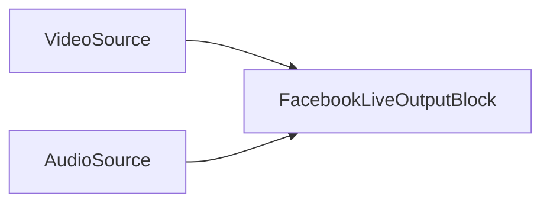

### Exemple de code

```csharp
// créer le pipeline
var pipeline = new MediaBlocksPipeline();

// créer une source vidéo (par ex. SystemVideoSourceBlock)
var videoSource = new SystemVideoSourceBlock(videoSourceSettings); // En supposant que videoSourceSettings est configuré

// créer une source audio (par ex. SystemAudioSourceBlock)
var audioSource = new SystemAudioSourceBlock(audioSourceSettings); // En supposant que audioSourceSettings est configuré

// configurer les paramètres du puits Facebook Live (le ctor prend uniquement la clé de flux — le SDK construit l'URL RTMP)
var fbSinkSettings = new FacebookLiveSinkSettings("your-facebook-stream-key");

// configurer les paramètres de l'encodeur H.264 (utiliser les valeurs par défaut ou personnaliser)
var h264Settings = H264EncoderBlock.GetDefaultSettings();
h264Settings.Bitrate = 4000000; // Exemple : 4 Mbps

// configurer les paramètres de l'encodeur AAC (utiliser les valeurs par défaut ou personnaliser)
var aacSettings = AACEncoderBlock.GetDefaultSettings();
aacSettings.Bitrate = 128000; // Exemple : 128 Kbps

// créer le bloc de sortie Facebook Live
var facebookOutput = new FacebookLiveOutputBlock(fbSinkSettings, h264Settings, aacSettings);

// Créer les entrées pour le bloc de sortie Facebook Live
var videoInputPad = facebookOutput.CreateNewInput(MediaBlockPadMediaType.Video);
var audioInputPad = facebookOutput.CreateNewInput(MediaBlockPadMediaType.Audio);

// connecter le chemin vidéo
pipeline.Connect(videoSource.Output, videoInputPad);

// connecter le chemin audio
pipeline.Connect(audioSource.Output, audioInputPad);

// démarrer le pipeline
await pipeline.StartAsync();

// ... plus tard, pour arrêter ...
// await pipeline.StopAsync();
```

### Remarques

Ce bloc encapsule les encodeurs H.264 et AAC nécessaires ainsi que le puits RTMP (`FacebookLiveSink`).
Assurez-vous que `FacebookLiveSink`, `H264Encoder` et `AACEncoder` sont disponibles. `FacebookLiveOutputBlock.IsAvailable()` peut être utilisé pour le vérifier (bien que le code source fourni indique `FacebookLiveSink.IsAvailable()`).

### Plateformes

Windows, macOS, Linux, iOS, Android (la disponibilité par plateforme dépend de la prise en charge RTMP de GStreamer et de la disponibilité des encodeurs).

## Bloc de sortie FLAC

Le `FLACOutputBlock` est utilisé pour créer des fichiers audio FLAC (Free Lossless Audio Codec). Il prend des données audio non compressées, les encode avec un encodeur FLAC et les sauvegarde dans un fichier `.flac`.

### Informations sur le bloc

Nom : `FLACOutputBlock`.

| Direction du pin | Type de média | Encodeurs attendus |
| --- | :---: | :---: |
| Audio en entrée | audio non compressé | FLAC (interne) |

### Paramètres

Le `FLACOutputBlock` est configuré avec un nom de fichier et `FLACEncoderSettings`.

Propriétés clés de `FLACEncoderSettings` (consultez la documentation de `FLACEncoderSettings` pour tous les détails) :

- Niveau de qualité, niveau de compression, etc.

Constructeur :

- `FLACOutputBlock(string filename, FLACEncoderSettings settings)`

### Exemple de pipeline

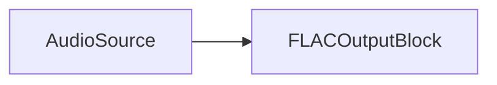

### Exemple de code

```csharp
// créer le pipeline
var pipeline = new MediaBlocksPipeline();

// créer une source audio (exemple : source audio virtuelle)
var audioSource = new VirtualAudioSourceBlock(new VirtualAudioSourceSettings());

// configurer les paramètres de l'encodeur FLAC
var flacSettings = new FLACEncoderSettings();
// flacSettings.Quality = 8; // Exemple : définir le niveau de qualité (0-8, par défaut 5)

// créer le bloc de sortie FLAC
var flacOutput = new FLACOutputBlock("output.flac", flacSettings);

// connecter le chemin audio
pipeline.Connect(audioSource.Output, flacOutput.Input);

// démarrer le pipeline
await pipeline.StartAsync();

// ... plus tard, pour arrêter ...
// await pipeline.StopAsync();
```

### Remarques

Ce bloc combine un `FLACEncoder` et un `FileSink` en interne.
Pour vérifier si le bloc et ses dépendances sont disponibles :
`FLACOutputBlock.IsAvailable()` (Cela vérifie la disponibilité de `FLACEncoder` et `FileSink`).

### Plateformes

Windows, macOS, Linux, iOS, Android (la disponibilité par plateforme dépend de la prise en charge de l'encodeur FLAC et du puits fichier par GStreamer).

## Bloc de sortie M4A

Le `M4AOutputBlock` crée des fichiers M4A (MPEG-4 Audio), couramment utilisés pour l'audio encodé en AAC. Il utilise un encodeur audio AAC et un puits MP4 pour produire des fichiers `.m4a`.

### Informations sur le bloc

Nom : `M4AOutputBlock`.

| Direction du pin | Type de média | Encodeurs attendus |
| --- | :---: | :---: |
| Audio en entrée | divers | AAC (interne) |

### Paramètres

Le `M4AOutputBlock` est configuré à l'aide de `MP4SinkSettings` et `IAACEncoderSettings`.

Propriétés clés de `MP4SinkSettings` :

- `Filename` (string) : chemin du fichier M4A de sortie.

Propriétés clés d'`IAACEncoderSettings` (consultez `AACEncoderSettings` pour plus de détails) :

- Débit binaire, profil, etc.

Constructeurs :

- `M4AOutputBlock(string filename)` : utilise les paramètres d'encodeur AAC par défaut.
- `M4AOutputBlock(MP4SinkSettings sinkSettings, IAACEncoderSettings aacSettings)` : utilise les paramètres d'encodeur AAC spécifiés.

### Exemple de pipeline


### Exemple de code

```csharp
// créer le pipeline
var pipeline = new MediaBlocksPipeline();

// créer une source audio (exemple : source audio virtuelle)
var audioSource = new VirtualAudioSourceBlock(new VirtualAudioSourceSettings());

// configurer le bloc de sortie M4A avec les paramètres AAC par défaut
var m4aOutput = new M4AOutputBlock("output.m4a");

// Ou, avec des paramètres AAC personnalisés :
// var sinkSettings = new MP4SinkSettings("output.m4a");
// var aacSettings = AACEncoderBlock.GetDefaultSettings();
// aacSettings.Bitrate = 192000; // Exemple : 192 Kbps
// var m4aOutput = new M4AOutputBlock(sinkSettings, aacSettings);

// Créer l'entrée pour le bloc de sortie M4A
var audioInputPad = m4aOutput.CreateNewInput(MediaBlockPadMediaType.Audio);

// connecter le chemin audio
pipeline.Connect(audioSource.Output, audioInputPad);

// démarrer le pipeline
await pipeline.StartAsync();

// ... plus tard, pour arrêter ...
// await pipeline.StopAsync();
```

### Remarques

Le `M4AOutputBlock` gère en interne un `AACEncoder` et un `MP4Sink`.
Pour vérifier la disponibilité :
`M4AOutputBlock.IsAvailable(IAACEncoderSettings aacSettings)`

### Plateformes

Windows, macOS, Linux, iOS, Android (la disponibilité par plateforme dépend de la prise en charge du multiplexeur MP4 et de l'encodeur AAC par GStreamer).

## Bloc de sortie MKV

Le `MKVOutputBlock` est utilisé pour créer des fichiers Matroska (MKV). MKV est un format de conteneur flexible qui peut contenir divers flux vidéo, audio et de sous-titres. Ce bloc combine les encodeurs vidéo et audio spécifiés avec un puits MKV.

### Informations sur le bloc

Nom : `MKVOutputBlock`.

| Direction du pin | Type de média | Encodeurs attendus |
| --- | :---: | :---: |
| Vidéo en entrée | divers | `IVideoEncoder` (par ex. H.264, HEVC, VPX, AV1) |
| Audio en entrée | divers | `IAudioEncoder` (par ex. AAC, MP3, Vorbis, Opus, Speex) |

### Paramètres

Le `MKVOutputBlock` est configuré à l'aide de `MKVSinkSettings`, ainsi que des paramètres des encodeurs vidéo (`IVideoEncoder`) et audio (`IAudioEncoder`) choisis.

Propriétés clés de `MKVSinkSettings` :

- `Filename` (string) : chemin du fichier MKV de sortie.

Constructeurs :

- `MKVOutputBlock(MKVSinkSettings sinkSettings, IVideoEncoder videoSettings, IAudioEncoder audioSettings)`

### Exemple de pipeline

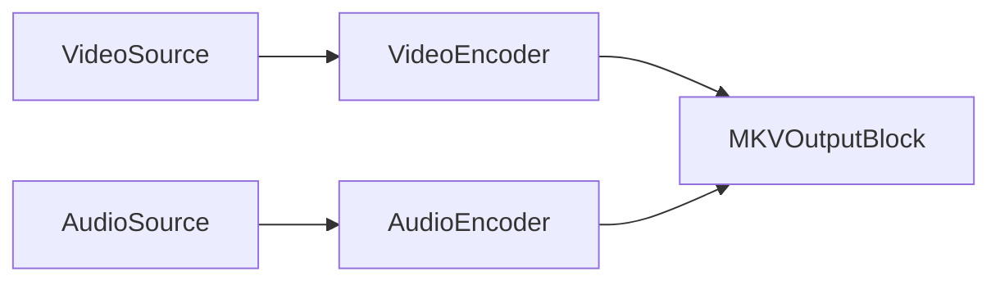

Plus directement, si `MKVOutputBlock` gère l'instanciation d'encodeurs en interne :

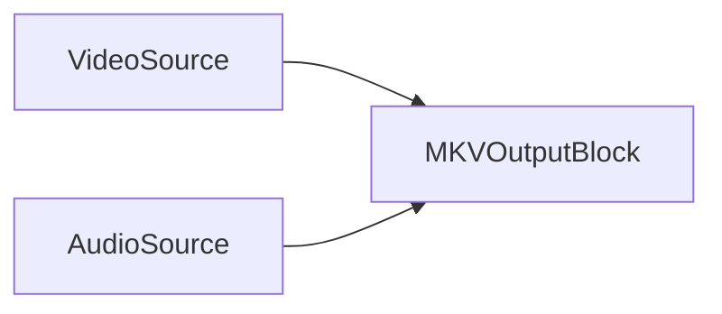

### Exemple de code

```csharp
// créer le pipeline
var pipeline = new MediaBlocksPipeline();

// créer une source vidéo (exemple : source virtuelle)
var videoSource = new VirtualVideoSourceBlock(new VirtualVideoSourceSettings());

// créer une source audio (exemple : source virtuelle)
var audioSource = new VirtualAudioSourceBlock(new VirtualAudioSourceSettings());

// configurer les paramètres du puits MKV
var mkvSinkSettings = new MKVSinkSettings("output.mkv");

// configurer l'encodeur vidéo (exemple : H.264)
var h264Settings = H264EncoderBlock.GetDefaultSettings();
// h264Settings.Bitrate = 5000000; // Exemple

// configurer l'encodeur audio (exemple : AAC)
var aacSettings = AACEncoderBlock.GetDefaultSettings();
// aacSettings.Bitrate = 128000; // Exemple

// créer le bloc de sortie MKV
var mkvOutput = new MKVOutputBlock(mkvSinkSettings, h264Settings, aacSettings);

// Créer les entrées pour le bloc de sortie MKV
var videoInputPad = mkvOutput.CreateNewInput(MediaBlockPadMediaType.Video);
var audioInputPad = mkvOutput.CreateNewInput(MediaBlockPadMediaType.Audio);

// connecter le chemin vidéo
pipeline.Connect(videoSource.Output, videoInputPad);

// connecter le chemin audio
pipeline.Connect(audioSource.Output, audioInputPad);

// démarrer le pipeline
await pipeline.StartAsync();

// ... plus tard, pour arrêter ...
// await pipeline.StopAsync();
```

### Remarques

Le `MKVOutputBlock` gère en interne les instances d'encodeur vidéo et audio spécifiées (par ex. `H264Encoder`, `HEVCEncoder`, `AACEncoder`, `VorbisEncoder`, etc.) et un `MKVSink`.
Les encodeurs vidéo pris en charge incluent H.264, HEVC, VPX (VP8/VP9), AV1.
Les encodeurs audio pris en charge incluent AAC, MP3, Vorbis, Opus, Speex.

Pour vérifier la disponibilité (exemple avec H.264 et AAC) :
`MKVOutputBlock.IsAvailable(IH264EncoderSettings h264settings, IAACEncoderSettings aacSettings)`

### Plateformes

Windows, macOS, Linux, iOS, Android (la disponibilité par plateforme dépend de la prise en charge du multiplexeur MKV et des encodeurs choisis par GStreamer).

## Bloc de sortie MP3

Le `MP3OutputBlock` est utilisé pour créer des fichiers audio MP3. Il encode des données audio non compressées avec un encodeur MP3 et les sauvegarde dans un fichier `.mp3`.

### Informations sur le bloc

Nom : `MP3OutputBlock`.

| Direction du pin | Type de média | Encodeurs attendus |
| --- | :---: | :---: |
| Audio en entrée | audio non compressé | MP3 (interne) |

### Paramètres

Le `MP3OutputBlock` est configuré avec un nom de fichier et `MP3EncoderSettings`.

Propriétés clés de `MP3EncoderSettings` (consultez la documentation de `MP3EncoderSettings` pour tous les détails) :

- Débit binaire, qualité, mode des canaux, etc.

Constructeur :

- `MP3OutputBlock(string filename, MP3EncoderSettings mp3Settings)`

### Exemple de pipeline


### Exemple de code

```csharp
// créer le pipeline
var pipeline = new MediaBlocksPipeline();

// créer une source audio (exemple : source audio virtuelle)
var audioSource = new VirtualAudioSourceBlock(new VirtualAudioSourceSettings());

// configurer les paramètres de l'encodeur MP3
var mp3Settings = new MP3EncoderSettings();
// mp3Settings.Bitrate = 192;                               // débit binaire en kbps
// mp3Settings.Quality = 2.0f;                              // 0.0 (meilleur) … 10.0 (pire)
// mp3Settings.EncodingEngineQuality = MP3EncodingQuality.High; // Fast / Standard / High
// mp3Settings.RateControl = MP3EncoderRateControl.CBR;     // CBR / VBR / ABR

// créer le bloc de sortie MP3
var mp3Output = new MP3OutputBlock("output.mp3", mp3Settings);

// connecter le chemin audio
pipeline.Connect(audioSource.Output, mp3Output.Input);

// démarrer le pipeline
await pipeline.StartAsync();

// ... plus tard, pour arrêter ...
// await pipeline.StopAsync();
```

### Remarques

Ce bloc combine un `MP3Encoder` et un `FileSink` en interne.
Pour vérifier si le bloc et ses dépendances sont disponibles :
`MP3OutputBlock.IsAvailable()` (Cela vérifie la disponibilité de `MP3Encoder` et `FileSink`).

### Plateformes

Windows, macOS, Linux, iOS, Android (la disponibilité par plateforme dépend de la prise en charge de l'encodeur MP3 (par ex. LAME) et du puits fichier par GStreamer).

## Bloc de sortie MP4

Le `MP4OutputBlock` est utilisé pour créer des fichiers MP4. Il peut combiner divers encodeurs vidéo et audio avec un puits MP4 pour produire des fichiers `.mp4`.

### Informations sur le bloc

Nom : `MP4OutputBlock`.

| Direction du pin | Type de média | Encodeurs attendus |
| --- | :---: | :---: |
| Vidéo en entrée | divers | `IVideoEncoder` (par ex. H.264, HEVC) |
| Audio en entrée | divers | `IAudioEncoder` (par ex. AAC, MP3) |

### Paramètres

Le `MP4OutputBlock` est configuré à l'aide de `MP4SinkSettings`, ainsi que des paramètres des encodeurs vidéo (`IVideoEncoder`, typiquement `IH264EncoderSettings` ou `IHEVCEncoderSettings`) et audio (`IAudioEncoder`, typiquement `IAACEncoderSettings` ou `MP3EncoderSettings`) choisis.

Propriétés clés de `MP4SinkSettings` :

- `Filename` (string) : chemin du fichier MP4 de sortie.
- Peut également être `MP4SplitSinkSettings` pour l'enregistrement par segments.

Constructeurs :

- `MP4OutputBlock(string filename)` : utilise les encodeurs vidéo H.264 et audio AAC par défaut.
- `MP4OutputBlock(MP4SinkSettings sinkSettings, IH264EncoderSettings h264settings, IAACEncoderSettings aacSettings)`
- `MP4OutputBlock(MP4SinkSettings sinkSettings, IH264EncoderSettings h264settings, MP3EncoderSettings mp3Settings)`
- `MP4OutputBlock(MP4SinkSettings sinkSettings, IHEVCEncoderSettings hevcSettings, IAACEncoderSettings aacSettings)`
- `MP4OutputBlock(MP4SinkSettings sinkSettings, IHEVCEncoderSettings hevcSettings, MP3EncoderSettings mp3Settings)`

### Événements de segment

Lorsque `MP4OutputBlock` est configuré avec `MP4SplitSinkSettings`, il déclenche des événements de cycle de vie des segments : `OnSegmentCreated` et `OnSegmentClosed` (qui signalent l'ouverture et la fin/fermeture d'un fichier de segment), et `OnSegmentFileNameRequested` (pour fournir un nom de fichier personnalisé par segment). Les mêmes événements sont disponibles sur `MP4SinkBlock` et `MPEGTSSinkBlock`. Consultez [sortie MP4](../../general/output-formats/mp4.md) pour plus de détails et un exemple de nommage personnalisé et de renommage à la fermeture.

### Exemple de pipeline

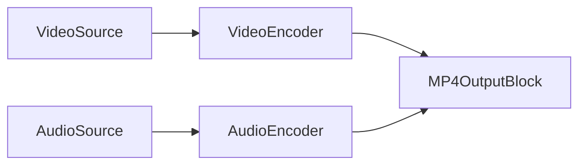

Si `MP4OutputBlock` utilise ses encodeurs internes par défaut :

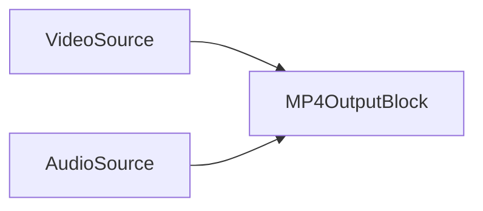

### Exemple de code

```csharp
// créer le pipeline
var pipeline = new MediaBlocksPipeline();

// créer une source vidéo (exemple : source virtuelle)
var videoSource = new VirtualVideoSourceBlock(new VirtualVideoSourceSettings());

// créer une source audio (exemple : source virtuelle)
var audioSource = new VirtualAudioSourceBlock(new VirtualAudioSourceSettings());

// créer un bloc de sortie MP4 avec les encodeurs vidéo H.264 et audio AAC par défaut
var mp4Output = new MP4OutputBlock("output.mp4");

// Ou, avec des paramètres H.264 et AAC personnalisés :
// var sinkSettings = new MP4SinkSettings("output.mp4");
// var h264Settings = H264EncoderBlock.GetDefaultSettings();
// h264Settings.Bitrate = 8000000; // Exemple : 8 Mbps
// var aacSettings = AACEncoderBlock.GetDefaultSettings();
// aacSettings.Bitrate = 192000; // Exemple : 192 Kbps
// var mp4Output = new MP4OutputBlock(sinkSettings, h264Settings, aacSettings);

// Créer les entrées pour le bloc de sortie MP4
var videoInputPad = mp4Output.CreateNewInput(MediaBlockPadMediaType.Video);
var audioInputPad = mp4Output.CreateNewInput(MediaBlockPadMediaType.Audio);

// connecter le chemin vidéo
pipeline.Connect(videoSource.Output, videoInputPad);

// connecter le chemin audio
pipeline.Connect(audioSource.Output, audioInputPad);

// démarrer le pipeline
await pipeline.StartAsync();

// ... plus tard, pour arrêter ...
// await pipeline.StopAsync();
```

### Remarques

Le `MP4OutputBlock` gère en interne les instances d'encodeur vidéo (par ex. `H264Encoder`, `HEVCEncoder`) et audio (par ex. `AACEncoder`, `MP3Encoder`) ainsi qu'un `MP4Sink`.
Pour vérifier la disponibilité (exemple avec H.264 et AAC) :
`MP4OutputBlock.IsAvailable(IH264EncoderSettings h264settings, IAACEncoderSettings aacSettings)`

### Plateformes

Windows, macOS, Linux, iOS, Android (la disponibilité par plateforme dépend de la prise en charge du multiplexeur MP4 et des encodeurs choisis par GStreamer).

## Bloc de sortie OGG Opus

L'`OGGOpusOutputBlock` est utilisé pour créer des fichiers audio Ogg Opus. Il encode des données audio non compressées avec un encodeur Opus et les multiplexe dans un conteneur Ogg, sauvegardant dans un fichier `.opus` ou `.ogg`.

### Informations sur le bloc

Nom : `OGGOpusOutputBlock`.

| Direction du pin | Type de média | Encodeurs attendus |
| --- | :---: | :---: |
| Audio en entrée | audio non compressé | Opus (interne) |

### Paramètres

L'`OGGOpusOutputBlock` est configuré avec un nom de fichier et `OPUSEncoderSettings`.

Propriétés clés d'`OPUSEncoderSettings` (consultez la documentation d'`OPUSEncoderSettings` pour tous les détails) :

- Débit binaire, complexité, durée de trame, type audio (voix/musique), etc.

Constructeur :

- `OGGOpusOutputBlock(string filename, OPUSEncoderSettings settings)`

### Exemple de pipeline

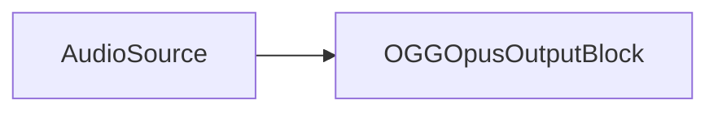

### Exemple de code

```csharp
// créer le pipeline
var pipeline = new MediaBlocksPipeline();

// créer une source audio (exemple : source audio virtuelle)
var audioSource = new VirtualAudioSourceBlock(new VirtualAudioSourceSettings());

// configurer les paramètres de l'encodeur Opus
var opusSettings = new OPUSEncoderSettings();
// opusSettings.Bitrate = 64000; // Exemple : définir le débit binaire à 64 kbps
// opusSettings.AudioType = OpusEncoderAudioType.Music; // Exemple

// créer le bloc de sortie OGG Opus
var oggOpusOutput = new OGGOpusOutputBlock("output.opus", opusSettings);

// connecter le chemin audio
pipeline.Connect(audioSource.Output, oggOpusOutput.Input);

// démarrer le pipeline
await pipeline.StartAsync();

// ... plus tard, pour arrêter ...
// await pipeline.StopAsync();
```

### Remarques

Ce bloc combine un `OPUSEncoder` et un `OGGSink` en interne.
Pour vérifier si le bloc et ses dépendances sont disponibles :
`OGGOpusOutputBlock.IsAvailable()` (Cela vérifie la disponibilité de `OGGSink`, `OPUSEncoder` et `FileSink` — bien que `FileSink` puisse faire implicitement partie de la logique de `OGGSink` pour la sortie fichier).

### Plateformes

Windows, macOS, Linux, iOS, Android (la disponibilité par plateforme dépend de la prise en charge du multiplexeur Ogg et de l'encodeur Opus par GStreamer).

## Bloc de sortie OGG Speex

L'`OGGSpeexOutputBlock` est utilisé pour créer des fichiers audio Ogg Speex, généralement pour la voix. Il encode des données audio non compressées avec un encodeur Speex, les multiplexe dans un conteneur Ogg et les sauvegarde dans un fichier `.spx` ou `.ogg`.

### Informations sur le bloc

Nom : `OGGSpeexOutputBlock`.

| Direction du pin | Type de média | Encodeurs attendus |
| --- | :---: | :---: |
| Audio en entrée | audio non compressé | Speex (interne) |

### Paramètres

L'`OGGSpeexOutputBlock` est configuré avec un nom de fichier et `SpeexEncoderSettings`.

Propriétés clés de `SpeexEncoderSettings` (consultez la documentation de `SpeexEncoderSettings` pour tous les détails) :

- Qualité, complexité, mode d'encodage (VBR/ABR/CBR), etc.

Constructeur :

- `OGGSpeexOutputBlock(string filename, SpeexEncoderSettings settings)`

### Exemple de pipeline

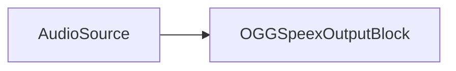

### Exemple de code

```csharp
// créer le pipeline
var pipeline = new MediaBlocksPipeline();

// créer une source audio (exemple : source audio virtuelle)
var audioSource = new VirtualAudioSourceBlock(new VirtualAudioSourceSettings());

// configurer les paramètres de l'encodeur Speex
var speexSettings = new SpeexEncoderSettings();
// speexSettings.Quality = 8; // Exemple : définir la qualité (0-10)
// speexSettings.Mode = SpeexEncoderMode.VBR; // Exemple : utiliser un débit variable

// créer le bloc de sortie OGG Speex
var oggSpeexOutput = new OGGSpeexOutputBlock("output.spx", speexSettings);

// connecter le chemin audio
pipeline.Connect(audioSource.Output, oggSpeexOutput.Input);

// démarrer le pipeline
await pipeline.StartAsync();

// ... plus tard, pour arrêter ...
// await pipeline.StopAsync();
```

### Remarques

Ce bloc combine un `SpeexEncoder` et un `OGGSink` en interne.
Pour vérifier si le bloc et ses dépendances sont disponibles :
`OGGSpeexOutputBlock.IsAvailable()` (Cela vérifie la disponibilité de `OGGSink`, `SpeexEncoder` et `FileSink` — `FileSink` peut être implicite à `OGGSink` pour la sortie fichier).

### Plateformes

Windows, macOS, Linux, iOS, Android (la disponibilité par plateforme dépend de la prise en charge du multiplexeur Ogg et de l'encodeur Speex par GStreamer).

## Bloc de sortie OGG Vorbis

L'`OGGVorbisOutputBlock` est utilisé pour créer des fichiers audio Ogg Vorbis. Il encode des données audio non compressées avec un encodeur Vorbis, les multiplexe dans un conteneur Ogg et les sauvegarde dans un fichier `.ogg`.

### Informations sur le bloc

Nom : `OGGVorbisOutputBlock`.

| Direction du pin | Type de média | Encodeurs attendus |
| --- | :---: | :---: |
| Audio en entrée | audio non compressé | Vorbis (interne) |

### Paramètres

L'`OGGVorbisOutputBlock` est configuré avec un nom de fichier et `VorbisEncoderSettings`.

Propriétés clés de `VorbisEncoderSettings` (consultez la documentation de `VorbisEncoderSettings` pour tous les détails) :

- Qualité, débit binaire, paramètres de débit géré/non géré, etc.

Constructeur :

- `OGGVorbisOutputBlock(string filename, VorbisEncoderSettings settings)`

### Exemple de pipeline

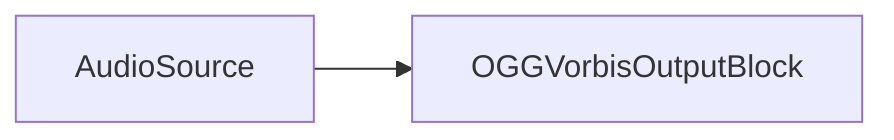

### Exemple de code

```csharp
// créer le pipeline
var pipeline = new MediaBlocksPipeline();

// créer une source audio (exemple : source audio virtuelle)
var audioSource = new VirtualAudioSourceBlock(new VirtualAudioSourceSettings());

// configurer les paramètres de l'encodeur Vorbis
var vorbisSettings = new VorbisEncoderSettings();
// vorbisSettings.Quality = 0.8f; // Exemple : définir la qualité (0.0 à 1.0)
// vorbisSettings.Bitrate = 128000; // Exemple si l'encodage par qualité n'est pas utilisé

// créer le bloc de sortie OGG Vorbis
var oggVorbisOutput = new OGGVorbisOutputBlock("output.ogg", vorbisSettings);

// connecter le chemin audio
pipeline.Connect(audioSource.Output, oggVorbisOutput.Input);

// démarrer le pipeline
await pipeline.StartAsync();

// ... plus tard, pour arrêter ...
// await pipeline.StopAsync();
```

### Remarques

Ce bloc combine un `VorbisEncoder` et un `OGGSink` en interne.
Pour vérifier si le bloc et ses dépendances sont disponibles :
`OGGVorbisOutputBlock.IsAvailable()` (Cela vérifie la disponibilité de `OGGSink`, `VorbisEncoder` et `FileSink` — `FileSink` peut être implicite à `OGGSink` pour la sortie fichier).

### Plateformes

Windows, macOS, Linux, iOS, Android (la disponibilité par plateforme dépend de la prise en charge du multiplexeur Ogg et de l'encodeur Vorbis par GStreamer).

## Bloc de sortie WebM

Le `WebMOutputBlock` est utilisé pour créer des fichiers WebM, contenant généralement de la vidéo VP8 ou VP9 et de l'audio Vorbis. Il combine un encodeur vidéo VPX et un encodeur audio Vorbis avec un puits WebM.

### Informations sur le bloc

Nom : `WebMOutputBlock`.

| Direction du pin | Type de média | Encodeurs attendus |
| --- | :---: | :---: |
| Vidéo en entrée | divers | VPX (VP8/VP9 — interne) |
| Audio en entrée | divers | Vorbis (interne) |

### Paramètres

Le `WebMOutputBlock` est configuré à l'aide de `WebMSinkSettings`, `IVPXEncoderSettings` (pour VP8 ou VP9) et `VorbisEncoderSettings`.

Propriétés clés de `WebMSinkSettings` :

- `Filename` (string) : chemin du fichier WebM de sortie.

Propriétés clés d'`IVPXEncoderSettings` (consultez `VPXEncoderSettings` pour plus de détails) :

- Débit binaire, qualité, vitesse, threads, etc.

Propriétés clés de `VorbisEncoderSettings` :

- Qualité, débit binaire, etc.

Constructeur :

- `WebMOutputBlock(WebMSinkSettings sinkSettings, IVPXEncoderSettings videoEncoderSettings, VorbisEncoderSettings vorbisSettings)`

### Exemple de pipeline

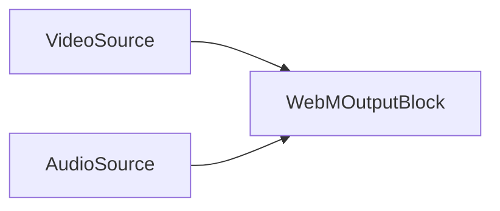

### Exemple de code

```csharp
// créer le pipeline
var pipeline = new MediaBlocksPipeline();

// créer une source vidéo (exemple : source virtuelle)
var videoSource = new VirtualVideoSourceBlock(new VirtualVideoSourceSettings());

// créer une source audio (exemple : source virtuelle)
var audioSource = new VirtualAudioSourceBlock(new VirtualAudioSourceSettings());

// configurer les paramètres du puits WebM
var webmSinkSettings = new WebMSinkSettings("output.webm");

// configurer les paramètres de l'encodeur VP9. VPXEncoderSettings est une base abstraite — instanciez
// la classe concrète VP9EncoderSettings (ou VP8EncoderSettings). Le type d'encodeur est implicite par sous-classe.
var vp9Settings = new VP9EncoderSettings
{
    RateControl = VPXRateControl.CBR,      // CBR / VBR / CQ / ...
    TargetBitrate = 2000,                  // kbit/s
    Deadline = 1,                          // 1 = temps réel ; valeurs plus élevées = plus lent/meilleure qualité
};

// configurer les paramètres de l'encodeur Vorbis
var vorbisSettings = new VorbisEncoderSettings();
// vorbisSettings.Quality = 0.7f; // Exemple : définir la qualité

// créer le bloc de sortie WebM
var webmOutput = new WebMOutputBlock(webmSinkSettings, vp9Settings, vorbisSettings);

// Créer les entrées pour le bloc de sortie WebM
var videoInputPad = webmOutput.CreateNewInput(MediaBlockPadMediaType.Video);
var audioInputPad = webmOutput.CreateNewInput(MediaBlockPadMediaType.Audio);

// connecter le chemin vidéo
pipeline.Connect(videoSource.Output, videoInputPad);

// connecter le chemin audio
pipeline.Connect(audioSource.Output, audioInputPad);

// démarrer le pipeline
await pipeline.StartAsync();

// ... plus tard, pour arrêter ...
// await pipeline.StopAsync();
```

### Remarques

Le `WebMOutputBlock` gère en interne un `VPXEncoder` (pour VP8/VP9), un `VorbisEncoder` et un `WebMSink`.
Pour vérifier la disponibilité :
`WebMOutputBlock.IsAvailable(IVPXEncoderSettings videoEncoderSettings)`

### Plateformes

Windows, macOS, Linux, iOS, Android (la disponibilité par plateforme dépend de la prise en charge du multiplexeur WebM, de l'encodeur VPX et de l'encodeur Vorbis par GStreamer).

## Bloc de sortie séparé

Le `SeparateOutputBlock` fournit un moyen flexible de configurer des pipelines de sortie personnalisés, vous permettant de spécifier des encodeurs vidéo et audio distincts, des processeurs et un writer/puits final. Il utilise des sources de pont (`BridgeVideoSourceBlock`, `BridgeAudioSourceBlock`) pour se brancher sur le pipeline principal, permettant l'enregistrement indépendamment de l'aperçu ou d'autres chaînes de traitement.

### Informations sur le bloc

Nom : `SeparateOutputBlock`.

Ce bloc lui-même n'a pas de pads d'entrée directs au sens traditionnel ; il orchestre un sous-pipeline.

### Paramètres

Le `SeparateOutputBlock` est configuré à l'aide de l'objet de paramètres `SeparateOutput`.

Propriétés clés de `SeparateOutput` :

- `Sink` (`MediaBlock`) : le puits/multiplexeur final pour la sortie (par ex. `MP4OutputBlock`, `FileSink`). Doit implémenter `IMediaBlockDynamicInputs` si des encodeurs séparés sont utilisés, ou `IMediaBlockSinkAllInOne` s'il gère l'encodage en interne.
- `VideoEncoder` (`MediaBlock`) : un bloc encodeur vidéo optionnel.
- `AudioEncoder` (`MediaBlock`) : un bloc encodeur audio optionnel.
- `VideoProcessor` (`MediaBlock`) : un bloc de traitement vidéo optionnel à insérer avant l'encodeur vidéo.
- `AudioProcessor` (`MediaBlock`) : un bloc de traitement audio optionnel à insérer avant l'encodeur audio.
- `Writer` (`MediaBlock`) : un bloc writer optionnel qui prend la sortie du `Sink` (par ex. pour une écriture de fichier personnalisée ou une logique de streaming réseau si le `Sink` est juste un multiplexeur).
- `GetFilename()` : méthode pour récupérer le nom de fichier de sortie configuré le cas échéant.

Constructeur :

- `SeparateOutputBlock(MediaBlocksPipeline pipeline, SeparateOutput settings, BridgeVideoSourceSettings bridgeVideoSourceSettings, BridgeAudioSourceSettings bridgeAudioSourceSettings)`

### Pipeline conceptuel

Ce bloc crée une branche de traitement indépendante. Pour la vidéo :

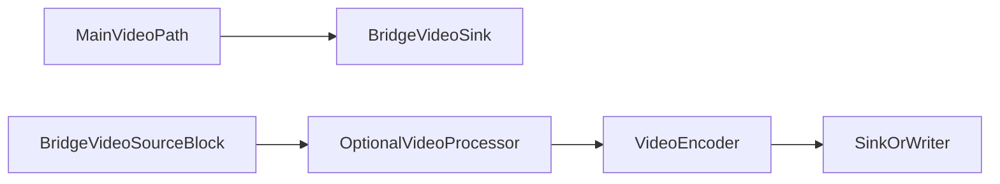

Pour l'audio :

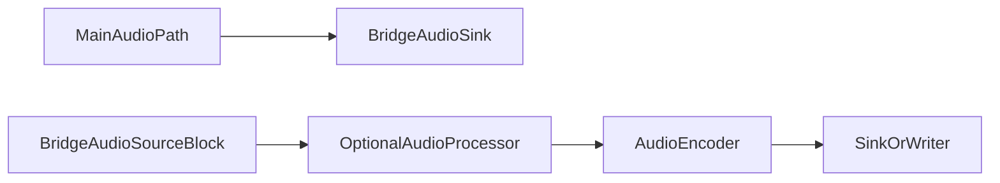

### Exemple de code

```csharp
// En supposant que 'pipeline' est votre MediaBlocksPipeline principal
// En supposant que 'mainVideoSourceOutputPad' et 'mainAudioSourceOutputPad' sont les sorties de vos sources principales

// 1. Configurer les puits de pont dans votre pipeline principal
// BridgeVideoSinkSettings/BridgeAudioSinkSettings nécessitent un nom de canal + des infos de format (VideoFrameInfoX / AudioInfoX).
var videoInfo = new VideoFrameInfoX(1920, 1080, new VideoFrameRate(30));
var audioInfo = new AudioInfoX(AudioFormatX.S16LE, 48000, 2);

var bridgeVideoSinkSettings = new BridgeVideoSinkSettings("sep_video_bridge", videoInfo);
var bridgeVideoSink = new BridgeVideoSinkBlock(bridgeVideoSinkSettings);
pipeline.Connect(mainVideoSourceOutputPad, bridgeVideoSink.Input);

var bridgeAudioSinkSettings = new BridgeAudioSinkSettings("sep_audio_bridge", audioInfo);
var bridgeAudioSink = new BridgeAudioSinkBlock(bridgeAudioSinkSettings);
pipeline.Connect(mainAudioSourceOutputPad, bridgeAudioSink.Input);

// 2. Configurer les sources de pont pour le sous-pipeline du SeparateOutputBlock (doivent utiliser le même nom de canal + infos de format correspondantes que le puits)
var bridgeVideoSourceSettings = new BridgeVideoSourceSettings("sep_video_bridge", videoInfo);
var bridgeAudioSourceSettings = new BridgeAudioSourceSettings("sep_audio_bridge", audioInfo);

// 3. Configurer les encodeurs et le puits pour le SeparateOutput
var h264Settings = H264EncoderBlock.GetDefaultSettings();
var videoEncoder = new H264EncoderBlock(h264Settings);

var aacSettings = AACEncoderBlock.GetDefaultSettings();
var audioEncoder = new AACEncoderBlock(aacSettings);

var mp4SinkSettings = new MP4SinkSettings("separate_output.mp4");
var mp4Sink = new MP4OutputBlock(mp4SinkSettings, h264Settings, aacSettings); // Utilisation de MP4OutputBlock qui gère le multiplexage.
                                                                            // Alternativement, utilisez un MP4Sink brut et connectez-y les encodeurs.

// 4. Configurer les paramètres SeparateOutput. SeparateOutput a un ctor sans paramètres — remplissez
// les propriétés Sink / VideoEncoder / AudioEncoder plutôt que de les passer au constructeur.
var separateOutputSettings = new SeparateOutput
{
    Sink = mp4Sink,
    VideoEncoder = videoEncoder,
    AudioEncoder = audioEncoder,
};

// 5. Créer le SeparateOutputBlock (cela connectera en interne ses composants)
var separateOutput = new SeparateOutputBlock(pipeline, separateOutputSettings, bridgeVideoSourceSettings, bridgeAudioSourceSettings);

// 6. Construire les sources, encodeurs et puits utilisés par SeparateOutputBlock
// Note : la construction de ceux-ci peut être gérée par le pipeline s'ils y sont ajoutés, 
// ou peut nécessiter d'être faite explicitement s'ils font partie d'un sous-graphe qui n'est pas directement dans la liste de blocs du pipeline principal.
// La méthode Build() du SeparateOutputBlock gère la construction de ses sources internes (_videoSource, _audioSource)
// ainsi que des encodeurs/puits fournis s'ils n'ont pas été construits.

// pipeline.Add(bridgeVideoSink);
// pipeline.Add(bridgeAudioSink);
// pipeline.Add(separateOutput); // Ajouter le bloc orchestrateur

// Démarrer le pipeline principal
// await pipeline.StartAsync(); // Cela démarrera également le traitement de la sortie séparée via les ponts

// Pour changer le nom de fichier plus tard :
// separateOutput.SetFilenameOrURL("new_separate_output.mp4");
```

### Remarques

Le `SeparateOutputBlock` lui-même est davantage un orchestrateur pour un sous-pipeline alimenté par des puits/sources de pont depuis le pipeline principal. Il permet des configurations d'enregistrement ou de streaming complexes qui peuvent être démarrées/arrêtées ou modifiées indépendamment dans une certaine mesure.

Les composants `VideoEncoder`, `AudioEncoder`, `Sink` et `Writer` doivent être construits correctement. La méthode `SeparateOutputBlock.Build()` tente de construire ces composants.

### Plateformes

Dépend des composants utilisés dans la configuration `SeparateOutput` (encodeurs, puits, processeurs). Généralement multiplateforme si les éléments GStreamer sont disponibles.

## Bloc de sortie WMV

Le `WMVOutputBlock` est utilisé pour créer des fichiers Windows Media Video (WMV). Il utilise des encodeurs vidéo WMV (`WMVEncoder`) et audio WMA (`WMAEncoder`) avec un puits ASF (Advanced Systems Format) pour produire des fichiers `.wmv`.

### Informations sur le bloc

Nom : `WMVOutputBlock`.

| Direction du pin | Type de média | Encodeurs attendus |
| --- | :---: | :---: |
| Vidéo en entrée | divers | WMV (interne) |
| Audio en entrée | divers | WMA (interne) |

### Paramètres

Le `WMVOutputBlock` est configuré à l'aide de `ASFSinkSettings`, `WMVEncoderSettings` et `WMAEncoderSettings`.

Propriétés clés d'`ASFSinkSettings` :

- `Filename` (string) : chemin du fichier WMV de sortie.

Propriétés clés de `WMVEncoderSettings` (consultez la documentation de `WMVEncoderSettings`) :

- Débit binaire, taille de GOP, qualité, etc.

Propriétés clés de `WMAEncoderSettings` (consultez la documentation de `WMAEncoderSettings`) :

- Débit binaire, version WMA, etc.

Constructeurs :

- `WMVOutputBlock(string filename)` : utilise les paramètres d'encodeurs vidéo WMV et audio WMA par défaut.
- `WMVOutputBlock(ASFSinkSettings sinkSettings, WMVEncoderSettings videoSettings, WMAEncoderSettings audioSettings)` : utilise les paramètres d'encodeur spécifiés.

### Exemple de pipeline

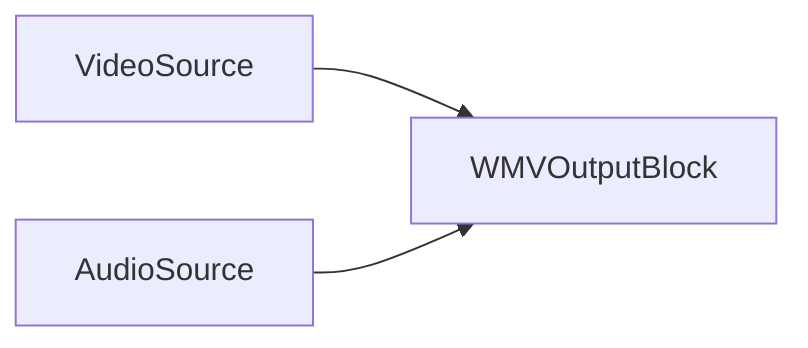

### Exemple de code

```csharp
// créer le pipeline
var pipeline = new MediaBlocksPipeline();

// créer une source vidéo (exemple : source virtuelle)
var videoSource = new VirtualVideoSourceBlock(new VirtualVideoSourceSettings());

// créer une source audio (exemple : source virtuelle)
var audioSource = new VirtualAudioSourceBlock(new VirtualAudioSourceSettings());

// créer le bloc de sortie WMV avec les paramètres par défaut
var wmvOutput = new WMVOutputBlock("output.wmv");

// Ou, avec des paramètres personnalisés :
// var asfSinkSettings = new ASFSinkSettings("output.wmv");
// var wmvEncSettings = WMVEncoderBlock.GetDefaultSettings();
// wmvEncSettings.Bitrate = 3000000; // Exemple : 3 Mbps
// var wmaEncSettings = WMAEncoderBlock.GetDefaultSettings();
// wmaEncSettings.Bitrate = 160000; // Exemple : 160 Kbps
// var wmvOutput = new WMVOutputBlock(asfSinkSettings, wmvEncSettings, wmaEncSettings);

// Créer les entrées pour le bloc de sortie WMV
var videoInputPad = wmvOutput.CreateNewInput(MediaBlockPadMediaType.Video);
var audioInputPad = wmvOutput.CreateNewInput(MediaBlockPadMediaType.Audio);

// connecter le chemin vidéo
pipeline.Connect(videoSource.Output, videoInputPad);

// connecter le chemin audio
pipeline.Connect(audioSource.Output, audioInputPad);

// démarrer le pipeline
await pipeline.StartAsync();

// ... plus tard, pour arrêter ...
// await pipeline.StopAsync();
```

### Remarques

Le `WMVOutputBlock` gère en interne `WMVEncoder`, `WMAEncoder` et `ASFSink`.
Pour vérifier la disponibilité :
`WMVOutputBlock.IsAvailable()`

### Plateformes

Principalement Windows. La disponibilité sur les autres plateformes dépend de la prise en charge des plugins GStreamer pour le multiplexage ASF, ainsi que des encodeurs WMV et WMA (qui peut être limitée en dehors de Windows).

## Bloc de sortie YouTube

Le `YouTubeOutputBlock` est conçu pour diffuser de la vidéo et de l'audio vers YouTube Live via RTMP. Il utilise en interne des encodeurs vidéo H.264 et audio AAC.

### Informations sur le bloc

Nom : `YouTubeOutputBlock`.

| Direction du pin | Type de média | Encodeurs attendus |
| --- | :---: | :---: |
| Vidéo en entrée | divers | H.264 (interne) |
| Audio en entrée | divers | AAC (interne) |

### Paramètres

Le `YouTubeOutputBlock` est configuré à l'aide de `YouTubeSinkSettings`, `IH264EncoderSettings` et `IAACEncoderSettings`.

Propriétés clés de `YouTubeSinkSettings` :

- `Url` (string) : l'URL RTMP fournie par YouTube Live pour le streaming (par ex. « rtmp://a.rtmp.youtube.com/live2/YOUR-STREAM-KEY »).

Constructeur :

- `YouTubeOutputBlock(YouTubeSinkSettings sinkSettings, IH264EncoderSettings h264settings, IAACEncoderSettings aacSettings)`

### Exemple de pipeline

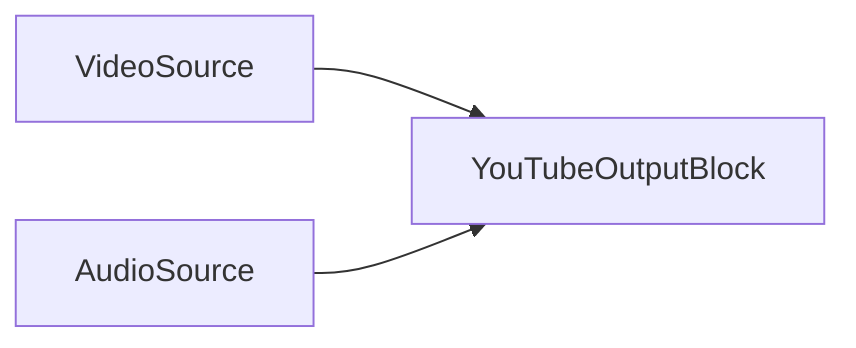

### Exemple de code

```csharp
// créer le pipeline
var pipeline = new MediaBlocksPipeline();

// créer une source vidéo (par ex. SystemVideoSourceBlock)
var videoSource = new SystemVideoSourceBlock(videoSourceSettings); // En supposant que videoSourceSettings est configuré

// créer une source audio (par ex. SystemAudioSourceBlock)
var audioSource = new SystemAudioSourceBlock(audioSourceSettings); // En supposant que audioSourceSettings est configuré

// configurer les paramètres du puits YouTube (le ctor prend uniquement la clé de flux — le SDK construit l'URL RTMP)
var ytSinkSettings = new YouTubeSinkSettings("YOUR-STREAM-KEY");

// configurer les paramètres de l'encodeur H.264 (utiliser les valeurs par défaut ou personnaliser selon les recommandations YouTube)
var h264Settings = H264EncoderBlock.GetDefaultSettings();
// h264Settings.Bitrate = 6000000; // Exemple : 6 Mbps pour 1080p
// h264Settings.UsagePreset = H264UsagePreset.None; // Ajuster selon les besoins de performance/qualité

// configurer les paramètres de l'encodeur AAC (utiliser les valeurs par défaut ou personnaliser selon les recommandations YouTube)
var aacSettings = AACEncoderBlock.GetDefaultSettings();
// aacSettings.Bitrate = 128000; // Exemple : 128 Kbps stéréo

// créer le bloc de sortie YouTube
var youTubeOutput = new YouTubeOutputBlock(ytSinkSettings, h264Settings, aacSettings);

// Créer les entrées pour le bloc de sortie YouTube
var videoInputPad = youTubeOutput.CreateNewInput(MediaBlockPadMediaType.Video);
var audioInputPad = youTubeOutput.CreateNewInput(MediaBlockPadMediaType.Audio);

// connecter le chemin vidéo
pipeline.Connect(videoSource.Output, videoInputPad);

// connecter le chemin audio
pipeline.Connect(audioSource.Output, audioInputPad);

// démarrer le pipeline
await pipeline.StartAsync();

// ... plus tard, pour arrêter ...
// await pipeline.StopAsync();
```

### Remarques

Ce bloc encapsule les encodeurs H.264 et AAC ainsi que le puits RTMP (`YouTubeSink`).
Assurez-vous que `YouTubeSink`, `H264Encoder` et `AACEncoder` sont disponibles. `YouTubeOutputBlock.IsAvailable(IH264EncoderSettings h264settings, IAACEncoderSettings aacSettings)` peut être utilisé pour le vérifier.
Il est crucial de configurer les paramètres d'encodeur (débit binaire, résolution, fréquence d'images) selon les paramètres recommandés par YouTube pour le streaming en direct afin d'assurer une qualité et une compatibilité optimales.

### Plateformes

Windows, macOS, Linux, iOS, Android (la disponibilité par plateforme dépend de la prise en charge RTMP de GStreamer et de la disponibilité des encodeurs H.264/AAC).

## Bloc d'enregistrement pré-événement

Le `PreEventRecordingBlock` implémente l'enregistrement à tampon circulaire (pré-événement). Il met en tampon en continu en mémoire les vidéo et audio encodés et écrit les clips d'événement sur le disque sur déclencheur, incluant les images antérieures à l'événement.

Pour la documentation complète, les paramètres, la machine à états et les exemples de code, consultez la page dédiée [Bloc d'enregistrement pré-événement](pre-event-recording.md).

## Voir aussi

- [Prise en main de Media Blocks](../GettingStarted/index.md) — bases du pipeline, installation et premier projet
- [Architecture du pipeline](../GettingStarted/pipeline.md) — cycle de vie de MediaBlocksPipeline, connexion des blocs et gestion des erreurs
- [Encodeurs vidéo](../VideoEncoders/index.md) — blocs encodeurs H.264, HEVC, VP8/VP9, AV1 et accélérés GPU
- [Sources multimédias](../Sources/index.md) — blocs source caméra, écran, fichier et réseau
- [Media Blocks SDK .Net](https://www.visioforge.com/media-blocks-sdk-net) — page produit et téléchargements
