# Output Blocks - VisioForge Media Blocks SDK .Net

[!badge size="xl" target="blank" variant="info" text="Media Blocks SDK .Net"](https://www.visioforge.com/media-blocks-sdk-net)

Output blocks, also known as sinks, are responsible for writing media data to files, network streams, or other destinations. They are typically the last blocks in any media processing chain. VisioForge Media Blocks SDK .Net provides a comprehensive collection of output blocks for various formats and protocols.

This guide covers file output blocks like MP4, AVI, WebM, MKV, and network streaming blocks for protocols such as RTMP (used by YouTube and Facebook Live).

## AVI Output Block

The `AVIOutputBlock` is used to create AVI files. It combines video and audio encoders with a file sink to produce `.avi` files.

### Block info

Name: `AVIOutputBlock`.

| Pin direction | Media type | Expected Encoders |
| --- | :---: | :---: |
| Input Video | various | H264 (default), other `IVideoEncoder` compatible encoders |
| Input Audio | various | AAC (default), MP3, other `IAudioEncoder` compatible encoders |

### Settings

The `AVIOutputBlock` is configured using `AVISinkSettings` along with settings for the chosen video and audio encoders (e.g., `IH264EncoderSettings` and `IAACEncoderSettings` or `MP3EncoderSettings`).

Key `AVISinkSettings` properties:

- `Filename` (string): The path to the output AVI file.

Constructors:

- `AVIOutputBlock(string filename)`: Uses default H264 video and AAC audio encoders.
- `AVIOutputBlock(AVISinkSettings sinkSettings, IH264EncoderSettings h264settings, IAACEncoderSettings aacSettings)`: Uses specified H264 video and AAC audio encoders.
- `AVIOutputBlock(AVISinkSettings sinkSettings, IH264EncoderSettings h264settings, MP3EncoderSettings mp3Settings)`: Uses specified H264 video and MP3 audio encoders.

### The sample pipeline

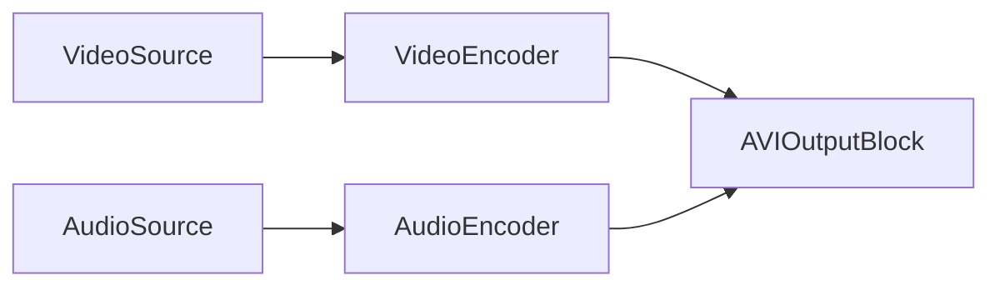

Or, if using a source that provides encoded data, or if the `AVIOutputBlock` handles internal encoders based on settings:


### Sample code

```csharp
// create pipeline
var pipeline = new MediaBlocksPipeline();

// create video source (example: virtual source)
var videoSource = new VirtualVideoSourceBlock(new VirtualVideoSourceSettings());

// create audio source (example: virtual source)
var audioSource = new VirtualAudioSourceBlock(new VirtualAudioSourceSettings());

// create AVI output block
// This constructor uses default H264 video and AAC audio encoders internally.
var aviOutput = new AVIOutputBlock("output.avi");

// Create inputs for the AVI output block
var videoInputPad = aviOutput.CreateNewInput(MediaBlockPadMediaType.Video);
var audioInputPad = aviOutput.CreateNewInput(MediaBlockPadMediaType.Audio);

// connect video path
pipeline.Connect(videoSource.Output, videoInputPad);

// connect audio path
pipeline.Connect(audioSource.Output, audioInputPad);

// start pipeline
await pipeline.StartAsync();

// ... later, to stop ...
// await pipeline.StopAsync();
```

### Remarks

The `AVIOutputBlock` internally manages encoder instances (like `H264Encoder` and `AACEncoder` or `MP3Encoder`) based on the provided settings. Ensure the necessary GStreamer plugins and SDK components for these encoders and the AVI muxer are available.

To check availability:
`AVIOutputBlock.IsAvailable(IH264EncoderSettings h264settings, IAACEncoderSettings aacSettings)`

### Platforms

Primarily Windows. Availability on other platforms depends on GStreamer plugin support for AVI muxing and the chosen encoders.

## Facebook Live Output Block

The `FacebookLiveOutputBlock` is designed to stream video and audio to Facebook Live using RTMP. It internally uses H.264 video and AAC audio encoders.

### Block info

Name: `FacebookLiveOutputBlock`.

| Pin direction | Media type | Expected Encoders |
| --- | :---: | :---: |
| Input Video | various | H.264 (internal) |
| Input Audio | various | AAC (internal) |

### Settings

The `FacebookLiveOutputBlock` is configured using `FacebookLiveSinkSettings`, `IH264EncoderSettings`, and `IAACEncoderSettings`.

Key `FacebookLiveSinkSettings` properties:

- `Url` (string): The RTMP URL provided by Facebook Live for streaming.

Constructor:

- `FacebookLiveOutputBlock(FacebookLiveSinkSettings sinkSettings, IH264EncoderSettings h264settings, IAACEncoderSettings aacSettings)`

### The sample pipeline

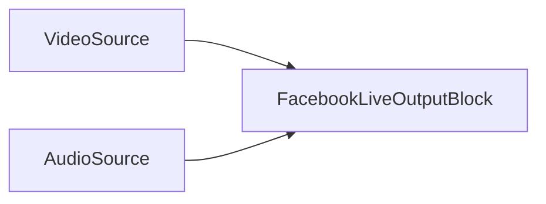

### Sample code

```csharp
// create pipeline
var pipeline = new MediaBlocksPipeline();

// create video source (e.g., SystemVideoSourceBlock)
var videoSource = new SystemVideoSourceBlock(videoSourceSettings); // Assuming videoSourceSettings are configured

// create audio source (e.g., SystemAudioSourceBlock)
var audioSource = new SystemAudioSourceBlock(audioSourceSettings); // Assuming audioSourceSettings are configured

// configure Facebook Live sink settings
var fbSinkSettings = new FacebookLiveSinkSettings("rtmp://your-facebook-live-url/your-stream-key");

// configure H.264 encoder settings (use defaults or customize)
var h264Settings = H264EncoderBlock.GetDefaultSettings();
h264Settings.Bitrate = 4000000; // Example: 4 Mbps

// configure AAC encoder settings (use defaults or customize)
var aacSettings = AACEncoderBlock.GetDefaultSettings();
aacSettings.Bitrate = 128000; // Example: 128 Kbps

// create Facebook Live output block
var facebookOutput = new FacebookLiveOutputBlock(fbSinkSettings, h264Settings, aacSettings);

// Create inputs for the Facebook Live output block
var videoInputPad = facebookOutput.CreateNewInput(MediaBlockPadMediaType.Video);
var audioInputPad = facebookOutput.CreateNewInput(MediaBlockPadMediaType.Audio);

// connect video path
pipeline.Connect(videoSource.Output, videoInputPad);

// connect audio path
pipeline.Connect(audioSource.Output, audioInputPad);

// start pipeline
await pipeline.StartAsync();

// ... later, to stop ...
// await pipeline.StopAsync();
```

### Remarks

This block encapsulates the necessary H.264 and AAC encoders and the RTMP sink (`FacebookLiveSink`).
Ensure that the `FacebookLiveSink`, `H264Encoder`, and `AACEncoder` are available. `FacebookLiveOutputBlock.IsAvailable()` can be used to check this (though the provided source shows `FacebookLiveSink.IsAvailable()`).

### Platforms

Windows, macOS, Linux, iOS, Android (Platform availability depends on GStreamer RTMP support and encoder availability).

## FLAC Output Block

The `FLACOutputBlock` is used for creating FLAC (Free Lossless Audio Codec) audio files. It takes uncompressed audio data, encodes it using a FLAC encoder, and saves it to a `.flac` file.

### Block info

Name: `FLACOutputBlock`.

| Pin direction | Media type | Expected Encoders |
| --- | :---: | :---: |
| Input Audio | uncompressed audio | FLAC (internal) |

### Settings

The `FLACOutputBlock` is configured with a filename and `FLACEncoderSettings`.

Key `FLACEncoderSettings` properties (refer to `FLACEncoderSettings` documentation for full details):

- Quality level, compression level, etc.

Constructor:

- `FLACOutputBlock(string filename, FLACEncoderSettings settings)`

### The sample pipeline


### Sample code

```csharp
// create pipeline
var pipeline = new MediaBlocksPipeline();

// create audio source (example: virtual audio source)
var audioSource = new VirtualAudioSourceBlock(new VirtualAudioSourceSettings());

// configure FLAC encoder settings
var flacSettings = new FLACEncoderSettings();
// flacSettings.Quality = 8; // Example: Set quality level (0-8, default is 5)

// create FLAC output block
var flacOutput = new FLACOutputBlock("output.flac", flacSettings);

// connect audio path
pipeline.Connect(audioSource.Output, flacOutput.Input);

// start pipeline
await pipeline.StartAsync();

// ... later, to stop ...
// await pipeline.StopAsync();
```

### Remarks

This block combines a `FLACEncoder` and a `FileSink` internally.
To check if the block and its dependencies are available:
`FLACOutputBlock.IsAvailable()` (This checks for `FLACEncoder` and `FileSink` availability).

### Platforms

Windows, macOS, Linux, iOS, Android (Platform availability depends on GStreamer FLAC encoder and file sink support).

## M4A Output Block

The `M4AOutputBlock` creates M4A (MPEG-4 Audio) files, commonly used for AAC encoded audio. It uses an AAC audio encoder and an MP4 sink to produce `.m4a` files.

### Block info

Name: `M4AOutputBlock`.

| Pin direction | Media type | Expected Encoders |
| --- | :---: | :---: |
| Input Audio | various | AAC (internal) |

### Settings

The `M4AOutputBlock` is configured using `MP4SinkSettings` and `IAACEncoderSettings`.

Key `MP4SinkSettings` properties:

- `Filename` (string): The path to the output M4A file.

Key `IAACEncoderSettings` properties (refer to `AACEncoderSettings` for details):

- Bitrate, profile, etc.

Constructors:

- `M4AOutputBlock(string filename)`: Uses default AAC encoder settings.
- `M4AOutputBlock(MP4SinkSettings sinkSettings, IAACEncoderSettings aacSettings)`: Uses specified AAC encoder settings.

### The sample pipeline


### Sample code

```csharp
// create pipeline
var pipeline = new MediaBlocksPipeline();

// create audio source (example: virtual audio source)
var audioSource = new VirtualAudioSourceBlock(new VirtualAudioSourceSettings());

// configure M4A output block with default AAC settings
var m4aOutput = new M4AOutputBlock("output.m4a");

// Or, with custom AAC settings:
// var sinkSettings = new MP4SinkSettings("output.m4a");
// var aacSettings = AACEncoderBlock.GetDefaultSettings();
// aacSettings.Bitrate = 192000; // Example: 192 Kbps
// var m4aOutput = new M4AOutputBlock(sinkSettings, aacSettings);

// Create input for the M4A output block
var audioInputPad = m4aOutput.CreateNewInput(MediaBlockPadMediaType.Audio);

// connect audio path
pipeline.Connect(audioSource.Output, audioInputPad);

// start pipeline
await pipeline.StartAsync();

// ... later, to stop ...
// await pipeline.StopAsync();
```

### Remarks

The `M4AOutputBlock` internally manages an `AACEncoder` and an `MP4Sink`.
To check availability:
`M4AOutputBlock.IsAvailable(IAACEncoderSettings aacSettings)`

### Platforms

Windows, macOS, Linux, iOS, Android (Platform availability depends on GStreamer MP4 muxer and AAC encoder support).

## MKV Output Block

The `MKVOutputBlock` is used to create Matroska (MKV) files. MKV is a flexible container format that can hold various video, audio, and subtitle streams. This block combines specified video and audio encoders with an MKV sink.

### Block info

Name: `MKVOutputBlock`.

| Pin direction | Media type | Expected Encoders |
| --- | :---: | :---: |
| Input Video | various | `IVideoEncoder` (e.g., H.264, HEVC, VPX, AV1) |
| Input Audio | various | `IAudioEncoder` (e.g., AAC, MP3, Vorbis, Opus, Speex) |

### Settings

The `MKVOutputBlock` is configured using `MKVSinkSettings`, along with settings for the chosen video (`IVideoEncoder`) and audio (`IAudioEncoder`) encoders.

Key `MKVSinkSettings` properties:

- `Filename` (string): The path to the output MKV file.

Constructors:

- `MKVOutputBlock(MKVSinkSettings sinkSettings, IVideoEncoder videoSettings, IAudioEncoder audioSettings)`

### The sample pipeline

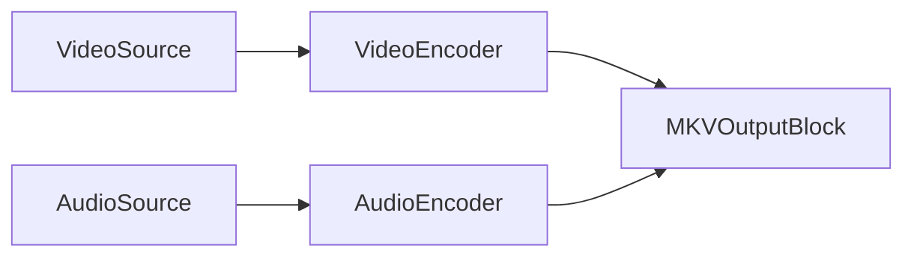

More directly, if `MKVOutputBlock` handles encoder instantiation internally:

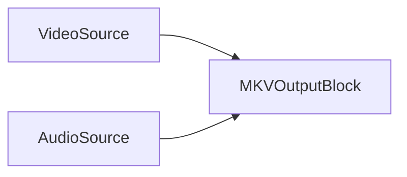

### Sample code

```csharp
// create pipeline
var pipeline = new MediaBlocksPipeline();

// create video source (example: virtual source)
var videoSource = new VirtualVideoSourceBlock(new VirtualVideoSourceSettings());

// create audio source (example: virtual source)
var audioSource = new VirtualAudioSourceBlock(new VirtualAudioSourceSettings());

// configure MKV sink settings
var mkvSinkSettings = new MKVSinkSettings("output.mkv");

// configure video encoder (example: H.264)
var h264Settings = H264EncoderBlock.GetDefaultSettings();
// h264Settings.Bitrate = 5000000; // Example

// configure audio encoder (example: AAC)
var aacSettings = AACEncoderBlock.GetDefaultSettings();
// aacSettings.Bitrate = 128000; // Example

// create MKV output block
var mkvOutput = new MKVOutputBlock(mkvSinkSettings, h264Settings, aacSettings);

// Create inputs for the MKV output block
var videoInputPad = mkvOutput.CreateNewInput(MediaBlockPadMediaType.Video);
var audioInputPad = mkvOutput.CreateNewInput(MediaBlockPadMediaType.Audio);

// connect video path
pipeline.Connect(videoSource.Output, videoInputPad);

// connect audio path
pipeline.Connect(audioSource.Output, audioInputPad);

// start pipeline
await pipeline.StartAsync();

// ... later, to stop ...
// await pipeline.StopAsync();
```

### Remarks

The `MKVOutputBlock` internally manages the specified video and audio encoder instances (e.g., `H264Encoder`, `HEVCEncoder`, `AACEncoder`, `VorbisEncoder`, etc.) and an `MKVSink`.
Supported video encoders include H.264, HEVC, VPX (VP8/VP9), AV1.
Supported audio encoders include AAC, MP3, Vorbis, Opus, Speex.

To check availability (example with H.264 and AAC):
`MKVOutputBlock.IsAvailable(IH264EncoderSettings h264settings, IAACEncoderSettings aacSettings)`

### Platforms

Windows, macOS, Linux, iOS, Android (Platform availability depends on GStreamer MKV muxer and chosen encoder support).

## MP3 Output Block

The `MP3OutputBlock` is used for creating MP3 audio files. It encodes uncompressed audio data using an MP3 encoder and saves it to an `.mp3` file.

### Block info

Name: `MP3OutputBlock`.

| Pin direction | Media type | Expected Encoders |
| --- | :---: | :---: |
| Input Audio | uncompressed audio | MP3 (internal) |

### Settings

The `MP3OutputBlock` is configured with a filename and `MP3EncoderSettings`.

Key `MP3EncoderSettings` properties (refer to `MP3EncoderSettings` documentation for full details):

- Bitrate, quality, channel mode, etc.

Constructor:

- `MP3OutputBlock(string filename, MP3EncoderSettings mp3Settings)`

### The sample pipeline


### Sample code

```csharp
// create pipeline
var pipeline = new MediaBlocksPipeline();

// create audio source (example: virtual audio source)
var audioSource = new VirtualAudioSourceBlock(new VirtualAudioSourceSettings());

// configure MP3 encoder settings
var mp3Settings = new MP3EncoderSettings();
// mp3Settings.Bitrate = 192; // Example: Set bitrate to 192 kbps
// mp3Settings.Quality = MP3Quality.Best; // Example: Set quality

// create MP3 output block
var mp3Output = new MP3OutputBlock("output.mp3", mp3Settings);

// connect audio path
pipeline.Connect(audioSource.Output, mp3Output.Input);

// start pipeline
await pipeline.StartAsync();

// ... later, to stop ...
// await pipeline.StopAsync();
```

### Remarks

This block combines an `MP3Encoder` and a `FileSink` internally.
To check if the block and its dependencies are available:
`MP3OutputBlock.IsAvailable()` (This checks for `MP3Encoder` and `FileSink` availability).

### Platforms

Windows, macOS, Linux, iOS, Android (Platform availability depends on GStreamer MP3 encoder (e.g., LAME) and file sink support).

## MP4 Output Block

The `MP4OutputBlock` is used for creating MP4 files. It can combine various video and audio encoders with an MP4 sink to produce `.mp4` files.

### Block info

Name: `MP4OutputBlock`.

| Pin direction | Media type | Expected Encoders |
| --- | :---: | :---: |
| Input Video | various | `IVideoEncoder` (e.g., H.264, HEVC) |
| Input Audio | various | `IAudioEncoder` (e.g., AAC, MP3) |

### Settings

The `MP4OutputBlock` is configured using `MP4SinkSettings`, along with settings for the chosen video (`IVideoEncoder`, typically `IH264EncoderSettings` or `IHEVCEncoderSettings`) and audio (`IAudioEncoder`, typically `IAACEncoderSettings` or `MP3EncoderSettings`) encoders.

Key `MP4SinkSettings` properties:

- `Filename` (string): The path to the output MP4 file.
- Can also be `MP4SplitSinkSettings` for recording in segments.

Constructors:

- `MP4OutputBlock(string filename)`: Uses default H.264 video and AAC audio encoders.
- `MP4OutputBlock(MP4SinkSettings sinkSettings, IH264EncoderSettings h264settings, IAACEncoderSettings aacSettings)`
- `MP4OutputBlock(MP4SinkSettings sinkSettings, IH264EncoderSettings h264settings, MP3EncoderSettings mp3Settings)`
- `MP4OutputBlock(MP4SinkSettings sinkSettings, IHEVCEncoderSettings hevcSettings, IAACEncoderSettings aacSettings)`
- `MP4OutputBlock(MP4SinkSettings sinkSettings, IHEVCEncoderSettings hevcSettings, MP3EncoderSettings mp3Settings)`

### The sample pipeline

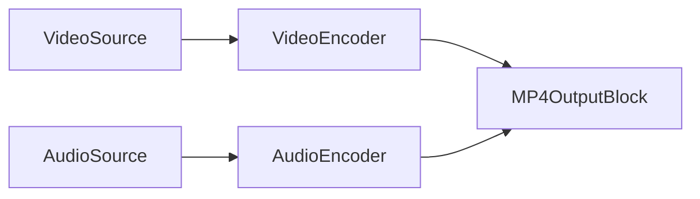

If `MP4OutputBlock` uses its default internal encoders:

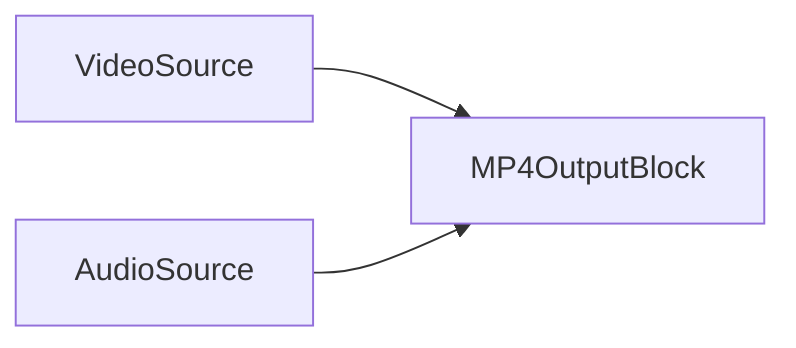

### Sample code

```csharp
// create pipeline
var pipeline = new MediaBlocksPipeline();

// create video source (example: virtual source)
var videoSource = new VirtualVideoSourceBlock(new VirtualVideoSourceSettings());

// create audio source (example: virtual source)
var audioSource = new VirtualAudioSourceBlock(new VirtualAudioSourceSettings());

// create MP4 output block with default H.264 video and AAC audio encoders
var mp4Output = new MP4OutputBlock("output.mp4");

// Or, with custom H.264 and AAC settings:
// var sinkSettings = new MP4SinkSettings("output.mp4");
// var h264Settings = H264EncoderBlock.GetDefaultSettings();
// h264Settings.Bitrate = 8000000; // Example: 8 Mbps
// var aacSettings = AACEncoderBlock.GetDefaultSettings();
// aacSettings.Bitrate = 192000; // Example: 192 Kbps
// var mp4Output = new MP4OutputBlock(sinkSettings, h264Settings, aacSettings);

// Create inputs for the MP4 output block
var videoInputPad = mp4Output.CreateNewInput(MediaBlockPadMediaType.Video);
var audioInputPad = mp4Output.CreateNewInput(MediaBlockPadMediaType.Audio);

// connect video path
pipeline.Connect(videoSource.Output, videoInputPad);

// connect audio path
pipeline.Connect(audioSource.Output, audioInputPad);

// start pipeline
await pipeline.StartAsync();

// ... later, to stop ...
// await pipeline.StopAsync();
```

### Remarks

The `MP4OutputBlock` internally manages video (e.g., `H264Encoder`, `HEVCEncoder`) and audio (e.g., `AACEncoder`, `MP3Encoder`) encoder instances along with an `MP4Sink`.
To check availability (example with H.264 and AAC):
`MP4OutputBlock.IsAvailable(IH264EncoderSettings h264settings, IAACEncoderSettings aacSettings)`

### Platforms

Windows, macOS, Linux, iOS, Android (Platform availability depends on GStreamer MP4 muxer and chosen encoder support).

## OGG Opus Output Block

The `OGGOpusOutputBlock` is used for creating Ogg Opus audio files. It encodes uncompressed audio data using an Opus encoder and multiplexes it into an Ogg container, saving to an `.opus` or `.ogg` file.

### Block info

Name: `OGGOpusOutputBlock`.

| Pin direction | Media type | Expected Encoders |
| --- | :---: | :---: |
| Input Audio | uncompressed audio | Opus (internal) |

### Settings

The `OGGOpusOutputBlock` is configured with a filename and `OPUSEncoderSettings`.

Key `OPUSEncoderSettings` properties (refer to `OPUSEncoderSettings` documentation for full details):

- Bitrate, complexity, frame duration, audio type (voice/music), etc.

Constructor:

- `OGGOpusOutputBlock(string filename, OPUSEncoderSettings settings)`

### The sample pipeline


### Sample code

```csharp
// create pipeline
var pipeline = new MediaBlocksPipeline();

// create audio source (example: virtual audio source)
var audioSource = new VirtualAudioSourceBlock(new VirtualAudioSourceSettings());

// configure Opus encoder settings
var opusSettings = new OPUSEncoderSettings();
// opusSettings.Bitrate = 64000; // Example: Set bitrate to 64 kbps
// opusSettings.AudioType = OpusEncoderAudioType.Music; // Example

// create OGG Opus output block
var oggOpusOutput = new OGGOpusOutputBlock("output.opus", opusSettings);

// connect audio path
pipeline.Connect(audioSource.Output, oggOpusOutput.Input);

// start pipeline
await pipeline.StartAsync();

// ... later, to stop ...
// await pipeline.StopAsync();
```

### Remarks

This block combines an `OPUSEncoder` and an `OGGSink` internally.
To check if the block and its dependencies are available:
`OGGOpusOutputBlock.IsAvailable()` (This checks for `OGGSink`, `OPUSEncoder`, and `FileSink` - though `FileSink` might be implicitly part of `OGGSink` logic for file output).

### Platforms

Windows, macOS, Linux, iOS, Android (Platform availability depends on GStreamer Ogg muxer and Opus encoder support).

## OGG Speex Output Block

The `OGGSpeexOutputBlock` is used for creating Ogg Speex audio files, typically for voice. It encodes uncompressed audio data using a Speex encoder, multiplexes it into an Ogg container, and saves to an `.spx` or `.ogg` file.

### Block info

Name: `OGGSpeexOutputBlock`.

| Pin direction | Media type | Expected Encoders |
| --- | :---: | :---: |
| Input Audio | uncompressed audio | Speex (internal) |

### Settings

The `OGGSpeexOutputBlock` is configured with a filename and `SpeexEncoderSettings`.

Key `SpeexEncoderSettings` properties (refer to `SpeexEncoderSettings` documentation for full details):

- Quality, complexity, encoding mode (VBR/ABR/CBR), etc.

Constructor:

- `OGGSpeexOutputBlock(string filename, SpeexEncoderSettings settings)`

### The sample pipeline


### Sample code

```csharp
// create pipeline
var pipeline = new MediaBlocksPipeline();

// create audio source (example: virtual audio source)
var audioSource = new VirtualAudioSourceBlock(new VirtualAudioSourceSettings());

// configure Speex encoder settings
var speexSettings = new SpeexEncoderSettings();
// speexSettings.Quality = 8; // Example: Set quality (0-10)
// speexSettings.Mode = SpeexEncoderMode.VBR; // Example: Use Variable Bitrate

// create OGG Speex output block
var oggSpeexOutput = new OGGSpeexOutputBlock("output.spx", speexSettings);

// connect audio path
pipeline.Connect(audioSource.Output, oggSpeexOutput.Input);

// start pipeline
await pipeline.StartAsync();

// ... later, to stop ...
// await pipeline.StopAsync();
```

### Remarks

This block combines a `SpeexEncoder` and an `OGGSink` internally.
To check if the block and its dependencies are available:
`OGGSpeexOutputBlock.IsAvailable()` (This checks for `OGGSink`, `SpeexEncoder`, and `FileSink` - `FileSink` might be implicit to `OGGSink` for file output).

### Platforms

Windows, macOS, Linux, iOS, Android (Platform availability depends on GStreamer Ogg muxer and Speex encoder support).

## OGG Vorbis Output Block

The `OGGVorbisOutputBlock` is used for creating Ogg Vorbis audio files. It encodes uncompressed audio data using a Vorbis encoder, multiplexes it into an Ogg container, and saves to an `.ogg` file.

### Block info

Name: `OGGVorbisOutputBlock`.

| Pin direction | Media type | Expected Encoders |
| --- | :---: | :---: |
| Input Audio | uncompressed audio | Vorbis (internal) |

### Settings

The `OGGVorbisOutputBlock` is configured with a filename and `VorbisEncoderSettings`.

Key `VorbisEncoderSettings` properties (refer to `VorbisEncoderSettings` documentation for full details):

- Quality, bitrate, managed/unmanaged bitrate settings, etc.

Constructor:

- `OGGVorbisOutputBlock(string filename, VorbisEncoderSettings settings)`

### The sample pipeline


### Sample code

```csharp
// create pipeline
var pipeline = new MediaBlocksPipeline();

// create audio source (example: virtual audio source)
var audioSource = new VirtualAudioSourceBlock(new VirtualAudioSourceSettings());

// configure Vorbis encoder settings
var vorbisSettings = new VorbisEncoderSettings();
// vorbisSettings.Quality = 0.8f; // Example: Set quality (0.0 to 1.0)
// vorbisSettings.Bitrate = 128000; // Example if not using quality based encoding

// create OGG Vorbis output block
var oggVorbisOutput = new OGGVorbisOutputBlock("output.ogg", vorbisSettings);

// connect audio path
pipeline.Connect(audioSource.Output, oggVorbisOutput.Input);

// start pipeline
await pipeline.StartAsync();

// ... later, to stop ...
// await pipeline.StopAsync();
```

### Remarks

This block combines a `VorbisEncoder` and an `OGGSink` internally.
To check if the block and its dependencies are available:
`OGGVorbisOutputBlock.IsAvailable()` (This checks for `OGGSink`, `VorbisEncoder`, and `FileSink` - `FileSink` might be implicit to `OGGSink` for file output).

### Platforms

Windows, macOS, Linux, iOS, Android (Platform availability depends on GStreamer Ogg muxer and Vorbis encoder support).

## WebM Output Block

The `WebMOutputBlock` is used for creating WebM files, typically containing VP8 or VP9 video and Vorbis audio. It combines a VPX video encoder and a Vorbis audio encoder with a WebM sink.

### Block info

Name: `WebMOutputBlock`.

| Pin direction | Media type | Expected Encoders |
| --- | :---: | :---: |
| Input Video | various | VPX (VP8/VP9 - internal) |
| Input Audio | various | Vorbis (internal) |

### Settings

The `WebMOutputBlock` is configured using `WebMSinkSettings`, `IVPXEncoderSettings` (for VP8 or VP9), and `VorbisEncoderSettings`.

Key `WebMSinkSettings` properties:

- `Filename` (string): The path to the output WebM file.

Key `IVPXEncoderSettings` properties (refer to `VPXEncoderSettings` for details):

- Bitrate, quality, speed, threads, etc.

Key `VorbisEncoderSettings` properties:

- Quality, bitrate, etc.

Constructor:

- `WebMOutputBlock(WebMSinkSettings sinkSettings, IVPXEncoderSettings videoEncoderSettings, VorbisEncoderSettings vorbisSettings)`

### The sample pipeline

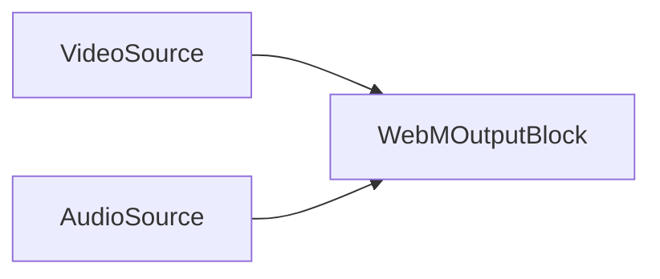

### Sample code

```csharp
// create pipeline
var pipeline = new MediaBlocksPipeline();

// create video source (example: virtual source)
var videoSource = new VirtualVideoSourceBlock(new VirtualVideoSourceSettings());

// create audio source (example: virtual source)
var audioSource = new VirtualAudioSourceBlock(new VirtualAudioSourceSettings());

// configure WebM sink settings
var webmSinkSettings = new WebMSinkSettings("output.webm");

// configure VPX encoder settings (example: VP9)
var vp9Settings = new VPXEncoderSettings(VPXEncoderMode.VP9);
// vp9Settings.Bitrate = 2000000; // Example: 2 Mbps
// vp9Settings.Speed = VP9Speed.Fast; // Example

// configure Vorbis encoder settings
var vorbisSettings = new VorbisEncoderSettings();
// vorbisSettings.Quality = 0.7f; // Example: Set quality

// create WebM output block
var webmOutput = new WebMOutputBlock(webmSinkSettings, vp9Settings, vorbisSettings);

// Create inputs for the WebM output block
var videoInputPad = webmOutput.CreateNewInput(MediaBlockPadMediaType.Video);
var audioInputPad = webmOutput.CreateNewInput(MediaBlockPadMediaType.Audio);

// connect video path
pipeline.Connect(videoSource.Output, videoInputPad);

// connect audio path
pipeline.Connect(audioSource.Output, audioInputPad);

// start pipeline
await pipeline.StartAsync();

// ... later, to stop ...
// await pipeline.StopAsync();
```

### Remarks

The `WebMOutputBlock` internally manages a `VPXEncoder` (for VP8/VP9), a `VorbisEncoder`, and a `WebMSink`.
To check availability:
`WebMOutputBlock.IsAvailable(IVPXEncoderSettings videoEncoderSettings)`

### Platforms

Windows, macOS, Linux, iOS, Android (Platform availability depends on GStreamer WebM muxer, VPX encoder, and Vorbis encoder support).

## Separate Output Block

The `SeparateOutputBlock` provides a flexible way to configure custom output pipelines, allowing you to specify distinct video and audio encoders, processors, and a final writer/sink. It uses bridge sources (`BridgeVideoSourceBlock`, `BridgeAudioSourceBlock`) to tap into the main pipeline, enabling recording independently from preview or other processing chains.

### Block info

Name: `SeparateOutputBlock`.

This block itself doesn't have direct input pads in the traditional sense; it orchestrates a sub-pipeline.

### Settings

The `SeparateOutputBlock` is configured using the `SeparateOutput` settings object.

Key `SeparateOutput` properties:

- `Sink` (`MediaBlock`): The final sink/muxer for the output (e.g., `MP4OutputBlock`, `FileSink`). Must implement `IMediaBlockDynamicInputs` if separate encoders are used, or `IMediaBlockSinkAllInOne` if it handles encoding internally.
- `VideoEncoder` (`MediaBlock`): An optional video encoder block.
- `AudioEncoder` (`MediaBlock`): An optional audio encoder block.
- `VideoProcessor` (`MediaBlock`): An optional video processing block to insert before the video encoder.
- `AudioProcessor` (`MediaBlock`): An optional audio processing block to insert before the audio encoder.
- `Writer` (`MediaBlock`): An optional writer block that takes the output of the `Sink` (e.g., for custom file writing or network streaming logic if the `Sink` is just a muxer).
- `GetFilename()`: Method to retrieve the configured output filename if applicable.

Constructor:

- `SeparateOutputBlock(MediaBlocksPipeline pipeline, SeparateOutput settings, BridgeVideoSourceSettings bridgeVideoSourceSettings, BridgeAudioSourceSettings bridgeAudioSourceSettings)`

### The conceptual pipeline

This block creates an independent processing branch. For video:

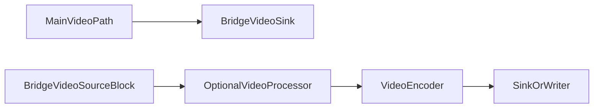

For audio:

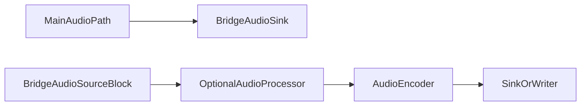

### Sample code

```csharp
// Assuming 'pipeline' is your main MediaBlocksPipeline
// Assuming 'mainVideoSourceOutputPad' and 'mainAudioSourceOutputPad' are outputs from your main sources

// 1. Configure Bridge Sinks in your main pipeline
var bridgeVideoSinkSettings = new BridgeVideoSinkSettings("sep_video_bridge");
var bridgeVideoSink = new BridgeVideoSinkBlock(bridgeVideoSinkSettings);
pipeline.Connect(mainVideoSourceOutputPad, bridgeVideoSink.Input);

var bridgeAudioSinkSettings = new BridgeAudioSinkSettings("sep_audio_bridge");
var bridgeAudioSink = new BridgeAudioSinkBlock(bridgeAudioSinkSettings);
pipeline.Connect(mainAudioSourceOutputPad, bridgeAudioSink.Input);

// 2. Configure Bridge Sources for the SeparateOutputBlock's sub-pipeline
var bridgeVideoSourceSettings = new BridgeVideoSourceSettings("sep_video_bridge");
var bridgeAudioSourceSettings = new BridgeAudioSourceSettings("sep_audio_bridge");

// 3. Configure encoders and sink for the SeparateOutput
var h264Settings = H264EncoderBlock.GetDefaultSettings();
var videoEncoder = new H264EncoderBlock(h264Settings);

var aacSettings = AACEncoderBlock.GetDefaultSettings();
var audioEncoder = new AACEncoderBlock(aacSettings);

var mp4SinkSettings = new MP4SinkSettings("separate_output.mp4");
var mp4Sink = new MP4OutputBlock(mp4SinkSettings, h264Settings, aacSettings); // Using MP4OutputBlock which handles muxing.
                                                                            // Alternatively, use a raw MP4Sink and connect encoders to it.

// 4. Configure SeparateOutput settings
var separateOutputSettings = new SeparateOutput(
    sink: mp4Sink, // mp4Sink will act as the final writer here
    videoEncoder: videoEncoder, // This is somewhat redundant if mp4Sink is MP4OutputBlock with encoders
    audioEncoder: audioEncoder  // Same as above. Better to use a raw sink if providing encoders separately
);

// A more typical setup if mp4Sink is just a muxer (e.g., new MP4Sink(mp4SinkRawSettings)):
// var separateOutputSettings = new SeparateOutput(
//     sink: rawMp4Muxer, 
//     videoEncoder: videoEncoder, 
//     audioEncoder: audioEncoder 
// );

// 5. Create the SeparateOutputBlock (this will internally connect its components)
var separateOutput = new SeparateOutputBlock(pipeline, separateOutputSettings, bridgeVideoSourceSettings, bridgeAudioSourceSettings);

// 6. Build the sources, encoders, and sink used by SeparateOutputBlock
// Note: Building these might be handled by the pipeline if they are added to it, 
// or might need to be done explicitly if they are part of a sub-graph not directly in the main pipeline's block list.
// The SeparateOutputBlock's Build() method will handle building its internal sources (_videoSource, _audioSource)
// and the provided encoders/sink if they haven't been built.

// pipeline.Add(bridgeVideoSink);
// pipeline.Add(bridgeAudioSink);
// pipeline.Add(separateOutput); // Add the orchestrator block

// Start main pipeline
// await pipeline.StartAsync(); // This will also start the separate output processing via bridges

// To change filename later:
// separateOutput.SetFilenameOrURL("new_separate_output.mp4");
```

### Remarks

The `SeparateOutputBlock` itself is more of an orchestrator for a sub-pipeline that's fed by bridge sinks/sources from the main pipeline. It allows for complex recording or streaming configurations that can be started/stopped or modified independently to some extent.

The `VideoEncoder`, `AudioEncoder`, `Sink`, and `Writer` components must be built correctly. The `SeparateOutputBlock.Build()` method attempts to build these components.

### Platforms

Depends on the components used within the `SeparateOutput` configuration (encoders, sinks, processors). Generally cross-platform if GStreamer elements are available.

## WMV Output Block

The `WMVOutputBlock` is used for creating Windows Media Video (WMV) files. It uses WMV video (`WMVEncoder`) and WMA audio (`WMAEncoder`) encoders with an ASF (Advanced Systems Format) sink to produce `.wmv` files.

### Block info

Name: `WMVOutputBlock`.

| Pin direction | Media type | Expected Encoders |
| --- | :---: | :---: |
| Input Video | various | WMV (internal) |
| Input Audio | various | WMA (internal) |

### Settings

The `WMVOutputBlock` is configured using `ASFSinkSettings`, `WMVEncoderSettings`, and `WMAEncoderSettings`.

Key `ASFSinkSettings` properties:

- `Filename` (string): The path to the output WMV file.

Key `WMVEncoderSettings` properties (refer to `WMVEncoderSettings` documentation):

- Bitrate, GOP size, quality, etc.

Key `WMAEncoderSettings` properties (refer to `WMAEncoderSettings` documentation):

- Bitrate, WMA version, etc.

Constructors:

- `WMVOutputBlock(string filename)`: Uses default WMV video and WMA audio encoder settings.
- `WMVOutputBlock(ASFSinkSettings sinkSettings, WMVEncoderSettings videoSettings, WMAEncoderSettings audioSettings)`: Uses specified encoder settings.

### The sample pipeline

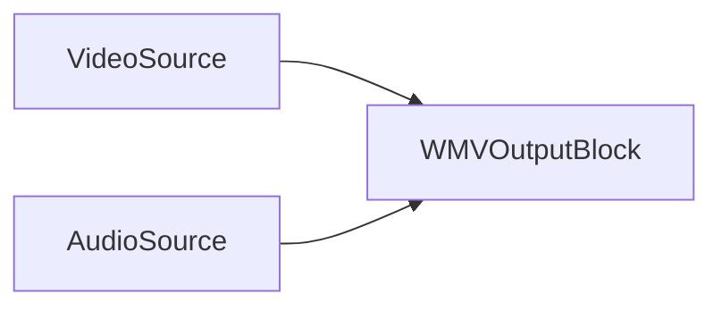

### Sample code

```csharp
// create pipeline
var pipeline = new MediaBlocksPipeline();

// create video source (example: virtual source)
var videoSource = new VirtualVideoSourceBlock(new VirtualVideoSourceSettings());

// create audio source (example: virtual source)
var audioSource = new VirtualAudioSourceBlock(new VirtualAudioSourceSettings());

// create WMV output block with default settings
var wmvOutput = new WMVOutputBlock("output.wmv");

// Or, with custom settings:
// var asfSinkSettings = new ASFSinkSettings("output.wmv");
// var wmvEncSettings = WMVEncoderBlock.GetDefaultSettings();
// wmvEncSettings.Bitrate = 3000000; // Example: 3 Mbps
// var wmaEncSettings = WMAEncoderBlock.GetDefaultSettings();
// wmaEncSettings.Bitrate = 160000; // Example: 160 Kbps
// var wmvOutput = new WMVOutputBlock(asfSinkSettings, wmvEncSettings, wmaEncSettings);

// Create inputs for the WMV output block
var videoInputPad = wmvOutput.CreateNewInput(MediaBlockPadMediaType.Video);
var audioInputPad = wmvOutput.CreateNewInput(MediaBlockPadMediaType.Audio);

// connect video path
pipeline.Connect(videoSource.Output, videoInputPad);

// connect audio path
pipeline.Connect(audioSource.Output, audioInputPad);

// start pipeline
await pipeline.StartAsync();

// ... later, to stop ...
// await pipeline.StopAsync();
```

### Remarks

The `WMVOutputBlock` internally manages `WMVEncoder`, `WMAEncoder`, and `ASFSink`.
To check availability:
`WMVOutputBlock.IsAvailable()`

### Platforms

Primarily Windows. Availability on other platforms depends on GStreamer plugin support for ASF muxing, WMV, and WMA encoders (which may be limited outside of Windows).

## YouTube Output Block

The `YouTubeOutputBlock` is designed for streaming video and audio to YouTube Live using RTMP. It internally utilizes H.264 video and AAC audio encoders.

### Block info

Name: `YouTubeOutputBlock`.

| Pin direction | Media type | Expected Encoders |
| --- | :---: | :---: |
| Input Video | various | H.264 (internal) |
| Input Audio | various | AAC (internal) |

### Settings

The `YouTubeOutputBlock` is configured using `YouTubeSinkSettings`, `IH264EncoderSettings`, and `IAACEncoderSettings`.

Key `YouTubeSinkSettings` properties:

- `Url` (string): The RTMP URL provided by YouTube Live for streaming (e.g., "rtmp://a.rtmp.youtube.com/live2/YOUR-STREAM-KEY").

Constructor:

- `YouTubeOutputBlock(YouTubeSinkSettings sinkSettings, IH264EncoderSettings h264settings, IAACEncoderSettings aacSettings)`

### The sample pipeline

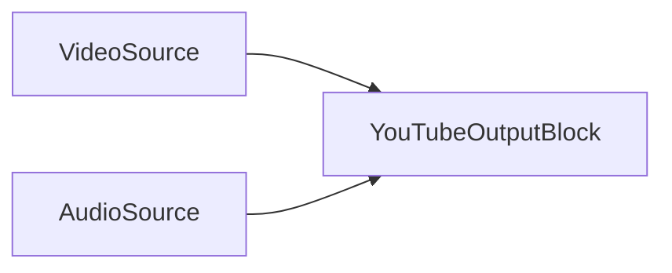

### Sample code

```csharp
// create pipeline
var pipeline = new MediaBlocksPipeline();

// create video source (e.g., SystemVideoSourceBlock)
var videoSource = new SystemVideoSourceBlock(videoSourceSettings); // Assuming videoSourceSettings are configured

// create audio source (e.g., SystemAudioSourceBlock)
var audioSource = new SystemAudioSourceBlock(audioSourceSettings); // Assuming audioSourceSettings are configured

// configure YouTube sink settings
var ytSinkSettings = new YouTubeSinkSettings("rtmp://a.rtmp.youtube.com/live2/YOUR-STREAM-KEY");

// configure H.264 encoder settings (use defaults or customize per YouTube recommendations)
var h264Settings = H264EncoderBlock.GetDefaultSettings();
// h264Settings.Bitrate = 6000000; // Example: 6 Mbps for 1080p
// h264Settings.UsagePreset = H264UsagePreset.None; // Adjust based on performance/quality needs

// configure AAC encoder settings (use defaults or customize per YouTube recommendations)
var aacSettings = AACEncoderBlock.GetDefaultSettings();
// aacSettings.Bitrate = 128000; // Example: 128 Kbps stereo

// create YouTube output block
var youTubeOutput = new YouTubeOutputBlock(ytSinkSettings, h264Settings, aacSettings);

// Create inputs for the YouTube output block
var videoInputPad = youTubeOutput.CreateNewInput(MediaBlockPadMediaType.Video);
var audioInputPad = youTubeOutput.CreateNewInput(MediaBlockPadMediaType.Audio);

// connect video path
pipeline.Connect(videoSource.Output, videoInputPad);

// connect audio path
pipeline.Connect(audioSource.Output, audioInputPad);

// start pipeline
await pipeline.StartAsync();

// ... later, to stop ...
// await pipeline.StopAsync();
```

### Remarks

This block encapsulates the H.264 and AAC encoders and the RTMP sink (`YouTubeSink`).
Ensure that the `YouTubeSink`, `H264Encoder`, and `AACEncoder` are available. `YouTubeOutputBlock.IsAvailable(IH264EncoderSettings h264settings, IAACEncoderSettings aacSettings)` can be used to check this.
It's crucial to configure encoder settings (bitrate, resolution, frame rate) according to YouTube's recommended settings for live streaming to ensure optimal quality and compatibility.

### Platforms

Windows, macOS, Linux, iOS, Android (Platform availability depends on GStreamer RTMP support and H.264/AAC encoder availability).
