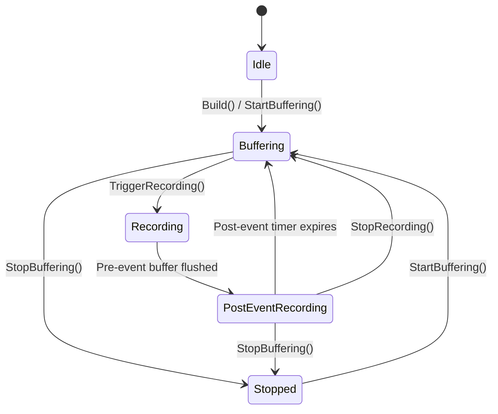
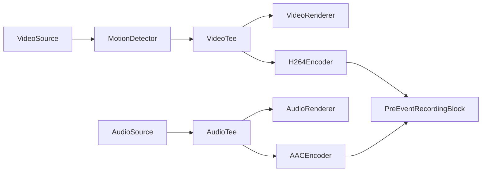
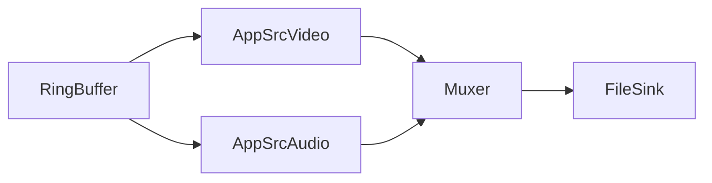

# Bloque de Grabación Pre-Evento - VisioForge Media Blocks SDK .Net

[SDK de Media Blocks .Net](https://www.visioforge.com/media-blocks-sdk-net){ .md-button .md-button--primary target="_blank" }

El `PreEventRecordingBlock` almacena continuamente fotogramas de video y audio codificados en un buffer circular (anillo) basado en memoria. Cuando se activa un evento (detección de movimiento, alarma, llamada API), vacía el metraje pre-evento almacenado a un archivo y continúa grabando fotogramas en vivo durante una duración post-evento configurable. Esto crea clips de eventos completos que incluyen metraje de antes de que ocurriera el disparador.

Este bloque se usa comúnmente en aplicaciones de vigilancia y seguridad donde necesita capturar lo que sucedió antes y después de un evento, sin escribir continuamente en disco.

## Información del bloque

Nombre: `PreEventRecordingBlock`.

| Dirección del pin | Tipo de medio | Descripción |
| --- | :---: | :---: |
| Entrada video | video codificado (H.264, H.265) | Stream de video codificado desde un codificador o fuente passthrough |
| Entrada audio | audio codificado (AAC, MP3, etc.) | Stream de audio codificado (opcional, puede deshabilitarse) |

Este es un bloque sumidero — no tiene pads de salida. Los archivos grabados se escriben directamente en disco cuando se activa una grabación.

## Configuración

El `PreEventRecordingBlock` se configura usando `PreEventRecordingSettings`.

| Propiedad | Tipo | Predeterminado | Descripción |
| --- | :---: | :---: | --- |
| `PreEventDuration` | TimeSpan | 30 segundos | Duración de video/audio a mantener en buffer en memoria. Cuando ocurre un disparador, esta cantidad de metraje se vacía al archivo de salida. |
| `PostEventDuration` | TimeSpan | 10 segundos | Duración para continuar grabando después del disparador. Después de que este tiempo transcurra, la grabación se detiene automáticamente y el bloque vuelve al modo de almacenamiento en buffer. |
| `MaxBufferBytes` | long | 0 (ilimitado) | Memoria máxima del buffer en bytes. Cuando se excede, los fotogramas más antiguos se eliminan independientemente de la duración basada en tiempo. Establezca en 0 para eliminación basada solo en tiempo. |

### Constructor

```csharp
public PreEventRecordingBlock(PreEventRecordingSettings settings, string muxFactoryName = "mp4mux")
```

**Parámetros:**

- `settings` — Configuración de grabación pre-evento. Usa valores predeterminados si es null.
- `muxFactoryName` — Nombre de fábrica del elemento muxer de GStreamer. Predeterminado: `"mp4mux"`. Otras opciones: `"matroskamux"` (MKV), `"mpegtsmux"` (MPEG-TS).

### Propiedades del bloque

| Propiedad | Tipo | Descripción |
| --- | :---: | --- |
| `AudioEnabled` | bool | Habilitar/deshabilitar captura de audio. Establecer antes de iniciar el pipeline. Predeterminado: `true`. |
| `State` | PreEventRecordingState | Estado actual del bloque (solo lectura, thread-safe). |
| `CurrentFilename` | string | Nombre de archivo de grabación actual. Null cuando no está grabando. |
| `BufferTotalBytes` | long | Total de bytes almacenados actualmente en el buffer circular. |
| `BufferedDuration` | TimeSpan | Duración actual de los medios almacenados en buffer. |
| `DebugLogPath` | string | Ruta al archivo de registro de depuración. Cuando no es null, escribe depuración detallada de marcas de tiempo de fotogramas. |

## Máquina de estados

El bloque sigue una máquina de estados bien definida:



| Estado | Descripción |
| --- | --- |
| `Idle` | No inicializado o no iniciado. |
| `Buffering` | Almacenando activamente fotogramas en el buffer circular, sin grabar a archivo. |
| `Recording` | Vaciando buffer pre-evento a archivo y capturando fotogramas en vivo. |
| `PostEventRecording` | Fase post-evento — grabando fotogramas en vivo hasta que el temporizador expire. |
| `Stopped` | Detenido e inactivo. |

## Eventos

```csharp
public event EventHandler<PreEventRecordingEventArgs> OnRecordingStarted;
public event EventHandler<PreEventRecordingEventArgs> OnRecordingStopped;
public event EventHandler<PreEventRecordingEventArgs> OnStateChanged;
```

Propiedades de `PreEventRecordingEventArgs`:

| Propiedad | Tipo | Descripción |
| --- | :---: | --- |
| `State` | PreEventRecordingState | Estado actual en el momento del evento. |
| `Filename` | string | Nombre de archivo de salida para la grabación. |
| `PreEventDuration` | TimeSpan | Duración pre-evento real incluida en el archivo (puede ser menor que la configurada si no hay suficientes datos almacenados o si la alineación de keyframes ajustó el inicio). |

## Métodos

| Método | Descripción |
| --- | --- |
| `TriggerRecording(string filename)` | Vaciar el buffer circular al archivo especificado e iniciar la grabación de fotogramas en vivo. Si ya está grabando, extiende la grabación actual (reinicia el temporizador post-evento). |
| `ExtendRecording()` | Reiniciar el temporizador post-evento. Llame a esto cuando la condición del disparador sigue activa (ej. el movimiento continúa). |
| `StopRecording()` | Detener manualmente la grabación actual y volver al modo de almacenamiento en buffer. |
| `StartBuffering()` | Iniciar o reanudar el almacenamiento en buffer después de estar detenido. |
| `StopBuffering()` | Detener todo incluyendo el almacenamiento en buffer y limpiar el buffer. |

## El pipeline de muestra

Con una fuente de cámara local, detección de movimiento, vista previa de video y grabación pre-evento:



Cuando se llama a `TriggerRecording()`, el bloque crea internamente un pipeline de salida dinámico:



## Código de muestra

El siguiente fragmento muestra cómo crear y conectar el bloque. Para una aplicación completa funcional con detección de movimiento, vista previa de video, soporte de cámara RTSP y UI WPF completa, vea la [Guía de Grabación Pre-Evento](../Guides/pre-event-recording.md).

```csharp
// Configure pre-event settings
var preEventSettings = new PreEventRecordingSettings
{
    PreEventDuration = TimeSpan.FromSeconds(10),
    PostEventDuration = TimeSpan.FromSeconds(5)
};

// Create the block (MP4 output)
var preEventBlock = new PreEventRecordingBlock(preEventSettings, "mp4mux");
preEventBlock.AudioEnabled = true;

// Subscribe to events
preEventBlock.OnRecordingStarted += (s, args) =>
    Debug.WriteLine($"Recording started: {args.Filename}");
preEventBlock.OnRecordingStopped += (s, args) =>
    Debug.WriteLine($"Recording stopped: {args.Filename}");

// Connect encoded video and audio to the block
pipeline.Connect(h264Encoder.Output, preEventBlock.VideoInput);
pipeline.Connect(aacEncoder.Output, preEventBlock.AudioInput);

// Start pipeline — buffering begins immediately
await pipeline.StartAsync();

// Later: trigger recording on event
preEventBlock.TriggerRecording("/recordings/event_001.mp4");

// Extend if trigger condition persists
preEventBlock.ExtendRecording();

// Or stop manually
preEventBlock.StopRecording();
```

## Opciones de formato de contenedor

| Formato | Nombre de Fábrica Muxer | Ventajas | Desventajas |
| --- | :---: | --- | --- |
| **MP4** | `mp4mux` | Más compatible, ampliamente soportado | Requiere finalización (moov atom); el archivo puede corromperse si el proceso se cae durante la grabación |
| **MPEG-TS** | `mpegtsmux` | Seguro ante fallos — no requiere paso de finalización; el archivo siempre es reproducible | Tamaño de archivo ligeramente mayor; menos soporte universal en algunos reproductores |
| **MKV** | `matroskamux` | Contenedor flexible; soporta muchos códecs | Menos compatible con algunos reproductores móviles |

!!!warning "Seguridad ante Fallos"
    Para aplicaciones de vigilancia donde los fallos del proceso son una preocupación, use **MPEG-TS** (`mpegtsmux`). Los archivos MP4 que no se finalizan correctamente (ej. debido a un fallo o corte de energía durante la grabación) pueden ser irreproducibles.

## Plataformas

Windows, macOS, Linux, Android, iOS (la disponibilidad de plataforma depende del soporte de muxer y codificador de GStreamer).
