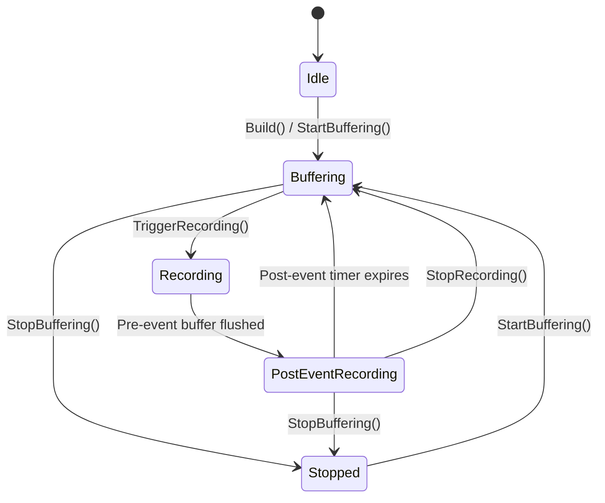
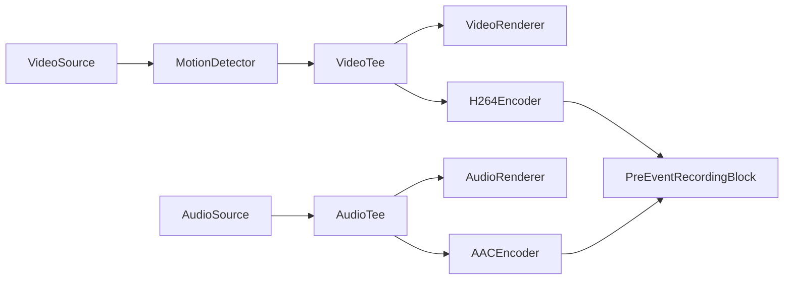
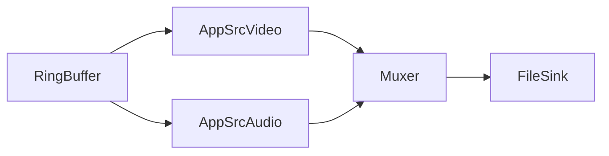

# Bloc d'enregistrement pré-événement — VisioForge Media Blocks SDK .Net

[Media Blocks SDK .Net](https://www.visioforge.com/media-blocks-sdk-net){ .md-button .md-button--primary target="_blank" }

Le `PreEventRecordingBlock` met en tampon en continu les images vidéo et audio encodées dans un tampon circulaire en mémoire (ring buffer). Lorsqu'un événement se déclenche (détection de mouvement, alarme, appel d'API), il vide les images pré-événement mises en tampon vers un fichier et continue d'enregistrer les images en direct pendant une durée post-événement configurable. Cela crée des clips d'événement complets qui incluent les images antérieures au déclenchement.

Ce bloc est couramment utilisé dans les applications de surveillance et de sécurité où vous devez capturer ce qui s'est passé avant et après un événement, sans écrire en continu sur le disque.

## Informations sur le bloc

Nom : `PreEventRecordingBlock`.

| Direction du pin | Type de média | Description |
| --- | :---: | :---: |
| Vidéo en entrée | vidéo encodée (H.264, H.265) | Flux vidéo encodé depuis un encodeur ou une source passthrough |
| Audio en entrée | audio encodé (AAC, MP3, etc.) | Flux audio encodé (optionnel, peut être désactivé) |

Ceci est un bloc puits — il n'a pas de pads de sortie. Les fichiers enregistrés sont écrits directement sur le disque lorsqu'un enregistrement est déclenché.

## Paramètres

Le `PreEventRecordingBlock` est configuré à l'aide de `PreEventRecordingSettings`.

| Propriété | Type | Par défaut | Description |
| --- | :---: | :---: | --- |
| `PreEventDuration` | TimeSpan | 30 secondes | Durée de vidéo/audio à conserver en tampon en mémoire. Lorsqu'un déclencheur se produit, cette quantité d'images est vidée vers le fichier de sortie. |
| `PostEventDuration` | TimeSpan | 10 secondes | Durée pendant laquelle continuer l'enregistrement après le déclencheur. Une fois ce délai écoulé, l'enregistrement s'arrête automatiquement et le bloc revient au mode de mise en tampon. |
| `MaxBufferBytes` | long | 0 (illimité) | Mémoire tampon maximale en octets. Lorsqu'elle est dépassée, les images les plus anciennes sont évincées indépendamment de la durée basée sur le temps. Définir à 0 pour une éviction basée uniquement sur le temps. |

### Constructeur

```csharp
public PreEventRecordingBlock(PreEventRecordingSettings settings, string muxFactoryName = "mp4mux")
```

**Paramètres :**

- `settings` — Configuration de l'enregistrement pré-événement. Utilise les valeurs par défaut si null.
- `muxFactoryName` — Nom de fabrique d'élément de multiplexeur GStreamer. Par défaut : `"mp4mux"`. Autres options : `"matroskamux"` (MKV), `"mpegtsmux"` (MPEG-TS).

### Propriétés du bloc

| Propriété | Type | Description |
| --- | :---: | --- |
| `AudioEnabled` | bool | Active/désactive la capture audio. À définir avant le démarrage du pipeline. Par défaut : `true`. |
| `State` | PreEventRecordingState | État actuel du bloc (lecture seule, thread-safe). |
| `CurrentFilename` | string | Nom de fichier d'enregistrement actuel. Null lorsqu'aucun enregistrement n'est en cours. |
| `BufferTotalBytes` | long | Total d'octets actuellement stockés dans le ring buffer. |
| `BufferedDuration` | TimeSpan | Durée actuelle du média mis en tampon. |
| `DebugLogPath` | string | Chemin vers le fichier journal de débogage. Lorsque non null, écrit un débogage détaillé des horodatages d'image. |

## Machine à états

Le bloc suit une machine à états bien définie :



| État | Description |
| --- | --- |
| `Idle` | Non initialisé ou non démarré. |
| `Buffering` | Met activement en tampon les images dans le ring buffer, sans enregistrer dans un fichier. |
| `Recording` | Vide le tampon pré-événement vers le fichier et capture les images en direct. |
| `PostEventRecording` | Phase post-événement — enregistre les images en direct jusqu'à l'expiration du minuteur. |
| `Stopped` | Arrêté et inactif. |

## Événements

```csharp
public event EventHandler<PreEventRecordingEventArgs> OnRecordingStarted;
public event EventHandler<PreEventRecordingEventArgs> OnRecordingStopped;
public event EventHandler<PreEventRecordingEventArgs> OnStateChanged;
```

Propriétés de `PreEventRecordingEventArgs` :

| Propriété | Type | Description |
| --- | :---: | --- |
| `State` | PreEventRecordingState | État actuel au moment de l'événement. |
| `Filename` | string | Nom du fichier de sortie pour l'enregistrement. |
| `PreEventDuration` | TimeSpan | Durée pré-événement réelle incluse dans le fichier (peut être inférieure à celle configurée si les données mises en tampon sont insuffisantes ou si l'alignement sur une image clé a ajusté le démarrage). |

## Méthodes

| Méthode | Description |
| --- | --- |
| `TriggerRecording(string filename)` | Vide le ring buffer dans le fichier spécifié et démarre l'enregistrement des images en direct. Si un enregistrement est déjà en cours, étend l'enregistrement courant (réinitialise le minuteur post-événement). |
| `ExtendRecording()` | Réinitialise le minuteur post-événement. Appelez ceci lorsque la condition de déclenchement est toujours active (par ex. le mouvement persiste). |
| `StopRecording()` | Arrête manuellement l'enregistrement courant et revient au mode de mise en tampon. |
| `StartBuffering()` | Démarre ou reprend la mise en tampon après un arrêt. |
| `StopBuffering()` | Arrête tout, y compris la mise en tampon, et vide le tampon. |

## Exemple de pipeline

Avec une source caméra locale, la détection de mouvement, l'aperçu vidéo et l'enregistrement pré-événement :



Lorsque `TriggerRecording()` est appelé, le bloc crée en interne un pipeline de sortie dynamique :



## Exemple de code

L'extrait suivant montre comment créer et connecter le bloc. Pour une application fonctionnelle complète avec détection de mouvement, aperçu vidéo, prise en charge de caméra RTSP et interface WPF complète, consultez le [Guide d'enregistrement pré-événement](../Guides/pre-event-recording.md).

```csharp
// Configurer les paramètres pré-événement
var preEventSettings = new PreEventRecordingSettings
{
    PreEventDuration = TimeSpan.FromSeconds(10),
    PostEventDuration = TimeSpan.FromSeconds(5)
};

// Créer le bloc (sortie MP4)
var preEventBlock = new PreEventRecordingBlock(preEventSettings, "mp4mux");
preEventBlock.AudioEnabled = true;

// S'abonner aux événements
preEventBlock.OnRecordingStarted += (s, args) =>
    Debug.WriteLine($"Enregistrement démarré : {args.Filename}");
preEventBlock.OnRecordingStopped += (s, args) =>
    Debug.WriteLine($"Enregistrement arrêté : {args.Filename}");

// Connecter la vidéo et l'audio encodés au bloc
pipeline.Connect(h264Encoder.Output, preEventBlock.VideoInput);
pipeline.Connect(aacEncoder.Output, preEventBlock.AudioInput);

// Démarrer le pipeline — la mise en tampon commence immédiatement
await pipeline.StartAsync();

// Plus tard : déclencher l'enregistrement sur événement
preEventBlock.TriggerRecording("/recordings/event_001.mp4");

// Étendre si la condition de déclenchement persiste
preEventBlock.ExtendRecording();

// Ou arrêter manuellement
preEventBlock.StopRecording();
```

## Options de format de conteneur

| Format | Nom de fabrique du multiplexeur | Avantages | Inconvénients |
| --- | :---: | --- | --- |
| **MP4** | `mp4mux` | Le plus compatible, largement pris en charge | Nécessite une finalisation (atome moov) ; le fichier peut être corrompu si le processus plante pendant l'enregistrement |
| **MPEG-TS** | `mpegtsmux` | Résistant aux plantages — aucune étape de finalisation nécessaire ; le fichier est toujours lisible | Taille de fichier légèrement plus grande ; prise en charge moins universelle dans certains lecteurs |
| **MKV** | `matroskamux` | Conteneur flexible ; prend en charge de nombreux codecs | Moins compatible avec certains lecteurs mobiles |

!!!warning "Résistance aux plantages"
    Pour les applications de surveillance où les plantages de processus sont une préoccupation, utilisez **MPEG-TS** (`mpegtsmux`). Les fichiers MP4 qui ne sont pas correctement finalisés (par ex. à cause d'un plantage ou d'une coupure d'alimentation pendant l'enregistrement) peuvent être illisibles.

## Plateformes

Windows, macOS, Linux, Android, iOS (la disponibilité par plateforme dépend de la prise en charge des multiplexeurs et encodeurs GStreamer).
