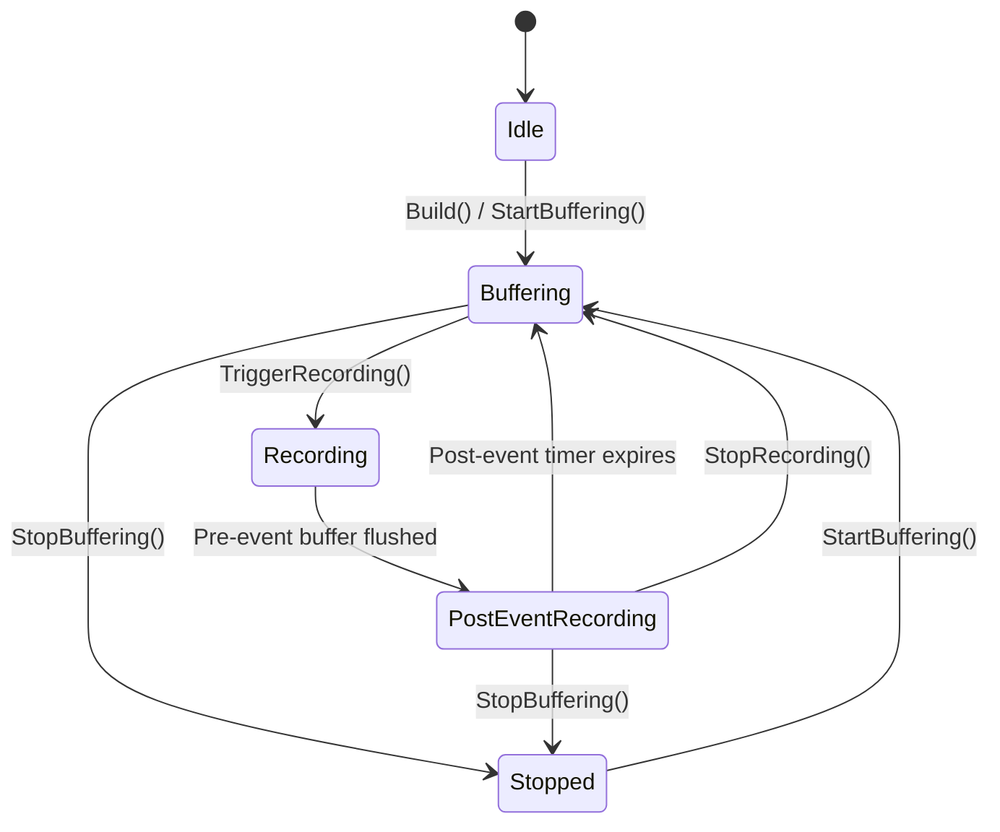
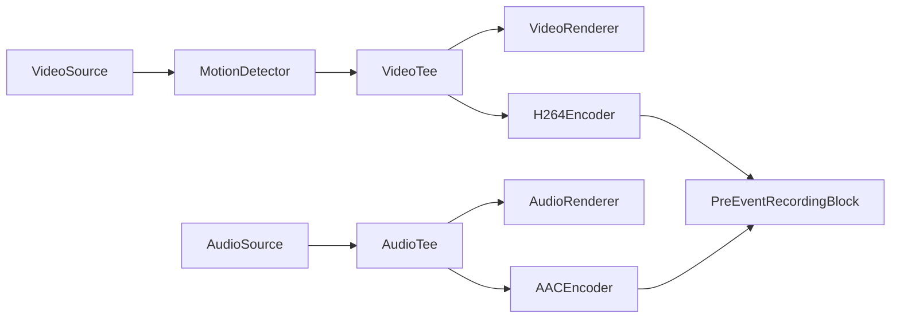
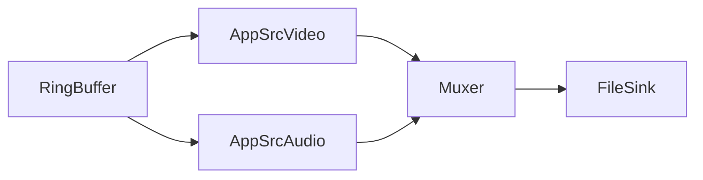

# Pre-Event Recording Block - VisioForge Media Blocks SDK .Net

[Media Blocks SDK .Net](https://www.visioforge.com/media-blocks-sdk-net){ .md-button .md-button--primary target="_blank" }

The `PreEventRecordingBlock` continuously buffers encoded video and audio frames in a memory-based circular (ring) buffer. When an event triggers (motion detection, alarm, API call), it flushes the buffered pre-event footage to a file and continues recording live frames for a configurable post-event duration. This creates complete event clips that include footage from before the trigger occurred.

This block is commonly used in surveillance and security applications where you need to capture what happened before and after an event, without continuously writing to disk.

## Block info

Name: `PreEventRecordingBlock`.

| Pin direction | Media type | Description |
| --- | :---: | :---: |
| Input video | encoded video (H.264, H.265) | Encoded video stream from an encoder or passthrough source |
| Input audio | encoded audio (AAC, MP3, etc.) | Encoded audio stream (optional, can be disabled) |

This is a sink block — it has no output pads. Recorded files are written directly to disk when a recording is triggered.

## Settings

The `PreEventRecordingBlock` is configured using `PreEventRecordingSettings`.

| Property | Type | Default | Description |
| --- | :---: | :---: | --- |
| `PreEventDuration` | TimeSpan | 30 seconds | Duration of video/audio to keep buffered in memory. When a trigger occurs, this amount of footage is flushed to the output file. |
| `PostEventDuration` | TimeSpan | 10 seconds | Duration to continue recording after trigger. After this time elapses, recording stops automatically and the block returns to buffering mode. |
| `MaxBufferBytes` | long | 0 (unlimited) | Maximum buffer memory in bytes. When exceeded, oldest frames are evicted regardless of time-based duration. Set to 0 for time-based eviction only. |

### Constructor

```csharp
public PreEventRecordingBlock(PreEventRecordingSettings settings, string muxFactoryName = "mp4mux")
```

**Parameters:**

- `settings` — Pre-event recording configuration. Uses defaults if null.
- `muxFactoryName` — GStreamer muxer element factory name. Default: `"mp4mux"`. Other options: `"matroskamux"` (MKV), `"mpegtsmux"` (MPEG-TS).

### Block properties

| Property | Type | Description |
| --- | :---: | --- |
| `AudioEnabled` | bool | Enable/disable audio capture. Set before pipeline start. Default: `true`. |
| `State` | PreEventRecordingState | Current block state (read-only, thread-safe). |
| `CurrentFilename` | string | Current recording filename. Null when not recording. |
| `BufferTotalBytes` | long | Total bytes currently stored in the ring buffer. |
| `BufferedDuration` | TimeSpan | Current duration of buffered media. |
| `DebugLogPath` | string | Path to debug log file. When non-null, writes detailed frame timestamp debugging. |

## State machine

The block follows a well-defined state machine:



| State | Description |
| --- | --- |
| `Idle` | Not initialized or not started. |
| `Buffering` | Actively buffering frames in the ring buffer, not recording to file. |
| `Recording` | Flushing pre-event buffer to file and capturing live frames. |
| `PostEventRecording` | Post-event phase — recording live frames until the timer expires. |
| `Stopped` | Stopped and idle. |

## Events

```csharp
public event EventHandler<PreEventRecordingEventArgs> OnRecordingStarted;
public event EventHandler<PreEventRecordingEventArgs> OnRecordingStopped;
public event EventHandler<PreEventRecordingEventArgs> OnStateChanged;
```

`PreEventRecordingEventArgs` properties:

| Property | Type | Description |
| --- | :---: | --- |
| `State` | PreEventRecordingState | Current state at the time of the event. |
| `Filename` | string | Output filename for the recording. |
| `PreEventDuration` | TimeSpan | Actual pre-event duration included in the file (may be less than configured if insufficient buffered data or keyframe alignment adjusted the start). |

## Methods

| Method | Description |
| --- | --- |
| `TriggerRecording(string filename)` | Flush the ring buffer to the specified file and start recording live frames. If already recording, extends the current recording (resets post-event timer). |
| `ExtendRecording()` | Reset the post-event timer. Call this when the trigger condition is still active (e.g., motion continues). |
| `StopRecording()` | Manually stop the current recording and return to buffering mode. |
| `StartBuffering()` | Start or resume buffering after being stopped. |
| `StopBuffering()` | Stop everything including buffering and clear the buffer. |

## The sample pipeline

With a local camera source, motion detection, video preview, and pre-event recording:



When `TriggerRecording()` is called, the block internally creates a dynamic output pipeline:



## Sample code

The following snippet shows how to create and connect the block. For a complete working application with motion detection, video preview, RTSP camera support, and full WPF UI, see the [Pre-Event Recording Guide](../Guides/pre-event-recording.md).

```csharp
// Configure pre-event settings
var preEventSettings = new PreEventRecordingSettings
{
    PreEventDuration = TimeSpan.FromSeconds(10),
    PostEventDuration = TimeSpan.FromSeconds(5)
};

// Create the block (MP4 output)
var preEventBlock = new PreEventRecordingBlock(preEventSettings, "mp4mux");
preEventBlock.AudioEnabled = true;

// Subscribe to events
preEventBlock.OnRecordingStarted += (s, args) =>
    Debug.WriteLine($"Recording started: {args.Filename}");
preEventBlock.OnRecordingStopped += (s, args) =>
    Debug.WriteLine($"Recording stopped: {args.Filename}");

// Connect encoded video and audio to the block
pipeline.Connect(h264Encoder.Output, preEventBlock.VideoInput);
pipeline.Connect(aacEncoder.Output, preEventBlock.AudioInput);

// Start pipeline — buffering begins immediately
await pipeline.StartAsync();

// Later: trigger recording on event
preEventBlock.TriggerRecording("/recordings/event_001.mp4");

// Extend if trigger condition persists
preEventBlock.ExtendRecording();

// Or stop manually
preEventBlock.StopRecording();
```

## Container format options

| Format | Muxer Factory Name | Pros | Cons |
| --- | :---: | --- | --- |
| **MP4** | `mp4mux` | Most compatible, widely supported | Requires finalization (moov atom); file may be corrupt if process crashes during recording |
| **MPEG-TS** | `mpegtsmux` | Crash-safe — no finalization step needed; file is always playable | Slightly larger file size; less universal support in some players |
| **MKV** | `matroskamux` | Flexible container; supports many codecs | Less compatible with some mobile players |

!!!warning "Crash Safety"
    For surveillance applications where process crashes are a concern, use **MPEG-TS** (`mpegtsmux`). MP4 files that are not properly finalized (e.g., due to a crash or power loss during recording) may be unplayable.

## Platforms

Windows, macOS, Linux, Android, iOS (platform availability depends on GStreamer muxer and encoder support).
