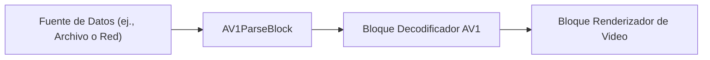

# Bloques Parser - VisioForge Media Blocks SDK .Net

[Media Blocks SDK .Net](https://www.visioforge.com/media-blocks-sdk-net){ .md-button .md-button--primary target="_blank" }

Los bloques parser son componentes esenciales en pipelines de procesamiento de medios. Se usan para analizar flujos elementales, que pueden ser crudos o parcialmente procesados, para extraer metadatos y preparar los flujos para procesamiento adicional como decodificación o multiplexación. VisioForge Media Blocks SDK .Net ofrece una variedad de bloques parser para codecs de video y audio comunes.

## Bloques Parser de Video

### Bloque Parser AV1

El `AV1ParseBlock` se usa para analizar flujos elementales de video AV1. Ayuda a identificar límites de frames y extraer información específica del codec.

#### Información del bloque

Nombre: `AV1ParseBlock`.

| Dirección del pin | Tipo de medio | Cantidad de pines |
| --- | :---: | :---: |
| Entrada de video | video AV1 | 1 |
| Salida de video | video AV1 | 1 |

#### Pipeline de ejemplo



#### Plataformas

Windows, macOS, Linux, iOS, Android.

---

### Bloque Parser H.263

El `H263ParseBlock` está diseñado para analizar flujos elementales de video H.263. Esto es útil para aplicaciones de videoconferencia y video móvil más antiguas.

#### Información del bloque

Nombre: `H263ParseBlock`.

| Dirección del pin | Tipo de medio | Cantidad de pines |
| --- | :---: | :---: |
| Entrada de video | video H.263 | 1 |
| Salida de video | video H.263 | 1 |

#### Pipeline de ejemplo


#### Plataformas

Windows, macOS, Linux, iOS, Android.

---

### Bloque Parser H.264

El `H264ParseBlock` analiza flujos elementales de video H.264 (AVC). Este es uno de los codecs de video más utilizados. El parser ayuda a identificar unidades NAL y otras propiedades del flujo.

#### Información del bloque

Nombre: `H264ParseBlock`.

| Dirección del pin | Tipo de medio | Cantidad de pines |
| --- | :---: | :---: |
| Entrada de video | video H.264 | 1 |
| Salida de video | video H.264 | 1 |

#### Pipeline de ejemplo


#### Plataformas

Windows, macOS, Linux, iOS, Android.

---

### Bloque Parser H.265

El `H265ParseBlock` analiza flujos elementales de video H.265 (HEVC). H.265 ofrece mejor compresión que H.264. El parser ayuda a identificar unidades NAL y otras propiedades del flujo.

#### Información del bloque

Nombre: `H265ParseBlock`.

| Dirección del pin | Tipo de medio | Cantidad de pines |
| --- | :---: | :---: |
| Entrada de video | video H.265 | 1 |
| Salida de video | video H.265 | 1 |

#### Pipeline de ejemplo


#### Plataformas

Windows, macOS, Linux, iOS, Android.

---

### Bloque Parser JPEG 2000

El `JPEG2000ParseBlock` se usa para analizar flujos de video JPEG 2000. JPEG 2000 es un estándar de compresión basado en wavelets que puede usarse para imágenes fijas y video.

#### Información del bloque

Nombre: `JPEG2000ParseBlock`.

| Dirección del pin | Tipo de medio | Cantidad de pines |
| --- | :---: | :---: |
| Entrada de video | video JPEG 2000 | 1 |
| Salida de video | video JPEG 2000 | 1 |

#### Pipeline de ejemplo


#### Plataformas

Windows, macOS, Linux, iOS, Android.

---

### Bloque Parser Video MPEG-1/2

El `MPEG12VideoParseBlock` analiza flujos elementales de video MPEG-1 y MPEG-2. Estos son codecs de video más antiguos pero aún relevantes, especialmente MPEG-2 para DVDs y transmisión.

#### Información del bloque

Nombre: `MPEG12VideoParseBlock`.

| Dirección del pin | Tipo de medio | Cantidad de pines |
| --- | :---: | :---: |
| Entrada de video | video MPEG-1/2 | 1 |
| Salida de video | video MPEG-1/2 | 1 |

#### Pipeline de ejemplo


#### Plataformas

Windows, macOS, Linux, iOS, Android.

---

### Bloque Parser Video MPEG-4

El `MPEG4ParseBlock` analiza flujos elementales de video MPEG-4 Parte 2 (frecuentemente referido como DivX/Xvid en sus formas tempranas).

#### Información del bloque

Nombre: `MPEG4ParseBlock`.

| Dirección del pin | Tipo de medio | Cantidad de pines |
| --- | :---: | :---: |
| Entrada de video | video MPEG-4 | 1 |
| Salida de video | video MPEG-4 | 1 |

#### Pipeline de ejemplo


#### Plataformas

Windows, macOS, Linux, iOS, Android.

---

### Bloque Parser PNG

El `PNGParseBlock` se usa para analizar datos de imagen PNG. Mientras PNG es principalmente un formato de imagen, este parser puede ser útil en escenarios donde las imágenes PNG son parte de un flujo o necesitan ser procesadas dentro del pipeline de Media Blocks.

#### Información del bloque

Nombre: `PNGParseBlock`.

| Dirección del pin | Tipo de medio | Cantidad de pines |
| --- | :---: | :---: |
| Entrada de video | datos de imagen PNG | 1 |
| Salida de video | datos de imagen PNG | 1 |

#### Pipeline de ejemplo


#### Plataformas

Windows, macOS, Linux, iOS, Android.

---

### Bloque Parser VC-1

El `VC1ParseBlock` analiza flujos elementales de video VC-1. VC-1 fue desarrollado por Microsoft y se usó en Discos Blu-ray y Windows Media Video.

#### Información del bloque

Nombre: `VC1ParseBlock`.

| Dirección del pin | Tipo de medio | Cantidad de pines |
| --- | :---: | :---: |
| Entrada de video | video VC-1 | 1 |
| Salida de video | video VC-1 | 1 |

#### Pipeline de ejemplo


#### Plataformas

Windows, macOS, Linux, iOS, Android.

---

### Bloque Parser VP9

El `VP9ParseBlock` analiza flujos elementales de video VP9. VP9 es un formato de codificación de video abierto y libre de regalías desarrollado por Google, frecuentemente usado para video web.

#### Información del bloque

Nombre: `VP9ParseBlock`.

| Dirección del pin | Tipo de medio | Cantidad de pines |
| --- | :---: | :---: |
| Entrada de video | video VP9 | 1 |
| Salida de video | video VP9 | 1 |

#### Pipeline de ejemplo


#### Plataformas

Windows, macOS, Linux, iOS, Android.

---

## Bloques Parser de Audio

### Bloque Parser Audio MPEG

El `MPEGAudioParseBlock` analiza flujos elementales de audio MPEG, que incluye audio MP1, MP2 y MP3.

#### Información del bloque

Nombre: `MPEGAudioParseBlock`.

| Dirección del pin | Tipo de medio | Cantidad de pines |
| --- | :---: | :---: |
| Entrada de audio | audio MPEG | 1 |
| Salida de audio | audio MPEG | 1 |

#### Pipeline de ejemplo


#### Plataformas

Windows, macOS, Linux, iOS, Android.

## Bloques Parser Individuales

### AV1 Parse

Analiza flujos de video AV1 para extraer límites de frames y metadatos.

#### Información del bloque

Nombre: AV1ParseBlock.

| Dirección del pin | Tipo de medio | Cantidad de pines |
| --- | :---: | :---: |
| Entrada | AV1 comprimido | 1 |
| Salida | AV1 analizado | 1 |

#### Código de ejemplo

```csharp
var pipeline = new MediaBlocksPipeline();
var av1Parse = new AV1ParseBlock();
// Conectar a fuente de flujo AV1 y decodificador
await pipeline.StartAsync();
```

### H263 Parse

Analiza flujos de video H.263 para detección de límites de frames.

#### Información del bloque

Nombre: H263ParseBlock.

| Dirección del pin | Tipo de medio | Cantidad de pines |
| --- | :---: | :---: |
| Entrada | H.263 comprimido | 1 |
| Salida | H.263 analizado | 1 |

### H264 Parse

Analiza flujos de video H.264/AVC para extraer unidades NAL e información de frames.

#### Información del bloque

Nombre: H264ParseBlock.

| Dirección del pin | Tipo de medio | Cantidad de pines |
| --- | :---: | :---: |
| Entrada | H.264 comprimido | 1 |
| Salida | H.264 analizado | 1 |

### H265 Parse

Analiza flujos de video H.265/HEVC para extraer unidades NAL e información de codificación.

#### Información del bloque

Nombre: H265ParseBlock.

| Dirección del pin | Tipo de medio | Cantidad de pines |
| --- | :---: | :---: |
| Entrada | H.265 comprimido | 1 |
| Salida | H.265 analizado | 1 |

### JPEG2000 Parse

Analiza flujos de video JPEG2000.

#### Información del bloque

Nombre: JPEG2000ParseBlock.

| Dirección del pin | Tipo de medio | Cantidad de pines |
| --- | :---: | :---: |
| Entrada | JPEG2000 comprimido | 1 |
| Salida | JPEG2000 analizado | 1 |

### MPEG-1/2 Video Parse

Analiza flujos de video MPEG-1 y MPEG-2.

#### Información del bloque

Nombre: MPEG12VideoParseBlock.

| Dirección del pin | Tipo de medio | Cantidad de pines |
| --- | :---: | :---: |
| Entrada | MPEG-1/2 comprimido | 1 |
| Salida | MPEG-1/2 analizado | 1 |

### MPEG-4 Parse

Analiza flujos de video MPEG-4.

#### Información del bloque

Nombre: MPEG4ParseBlock.

| Dirección del pin | Tipo de medio | Cantidad de pines |
| --- | :---: | :---: |
| Entrada | MPEG-4 comprimido | 1 |
| Salida | MPEG-4 analizado | 1 |

### MPEG Audio Parse

Analiza flujos de audio MPEG (MP1, MP2, MP3).

#### Información del bloque

Nombre: MPEGAudioParseBlock.

| Dirección del pin | Tipo de medio | Cantidad de pines |
| --- | :---: | :---: |
| Entrada | audio MPEG comprimido | 1 |
| Salida | audio MPEG analizado | 1 |

### PNG Parse

Analiza flujos de imagen PNG.

#### Información del bloque

Nombre: PNGParseBlock.

| Dirección del pin | Tipo de medio | Cantidad de pines |
| --- | :---: | :---: |
| Entrada | PNG comprimido | 1 |
| Salida | PNG analizado | 1 |

### VC-1 Parse

Analiza flujos de video VC-1 (Windows Media Video 9).

#### Información del bloque

Nombre: VC1ParseBlock.

| Dirección del pin | Tipo de medio | Cantidad de pines |
| --- | :---: | :---: |
| Entrada | VC-1 comprimido | 1 |
| Salida | VC-1 analizado | 1 |

### VP9 Parse

Analiza flujos de video VP9.

#### Información del bloque

Nombre: VP9ParseBlock.

| Dirección del pin | Tipo de medio | Cantidad de pines |
| --- | :---: | :---: |
| Entrada | VP9 comprimido | 1 |
| Salida | VP9 analizado | 1 |

## Plataformas

Windows, macOS, Linux, iOS, Android.
