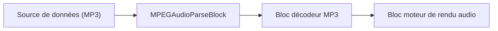

# Blocs analyseurs — VisioForge Media Blocks SDK .Net

[Media Blocks SDK .Net](https://www.visioforge.com/media-blocks-sdk-net){ .md-button .md-button--primary target="_blank" }

Les blocs analyseurs sont des composants essentiels dans les pipelines de traitement multimédia. Ils sont utilisés pour analyser les flux élémentaires, qui peuvent être bruts ou partiellement traités, pour en extraire des métadonnées et pour préparer les flux à un traitement ultérieur comme le décodage ou le multiplexage. VisioForge Media Blocks SDK .Net offre une variété de blocs analyseurs pour les codecs vidéo et audio courants.

## Blocs analyseurs vidéo

### Bloc analyseur AV1

L'`AV1ParseBlock` est utilisé pour analyser les flux élémentaires vidéo AV1. Il aide à identifier les frontières d'image et à extraire les informations spécifiques au codec.

#### Informations sur le bloc

Nom : `AV1ParseBlock`.

| Direction du pin | Type de média | Nombre de pins |
| --- | :---: | :---: |
| Vidéo en entrée | vidéo AV1 | 1 |
| Vidéo en sortie | vidéo AV1 | 1 |

#### Exemple de pipeline


#### Plateformes

Windows, macOS, Linux, iOS, Android.

---

### Bloc analyseur H.263

Le `H263ParseBlock` est conçu pour analyser les flux élémentaires vidéo H.263. Cela est utile pour les applications plus anciennes de visioconférence et de vidéo mobile.

#### Informations sur le bloc

Nom : `H263ParseBlock`.

| Direction du pin | Type de média | Nombre de pins |
| --- | :---: | :---: |
| Vidéo en entrée | vidéo H.263 | 1 |
| Vidéo en sortie | vidéo H.263 | 1 |

#### Exemple de pipeline


#### Plateformes

Windows, macOS, Linux, iOS, Android.

---

### Bloc analyseur H.264

Le `H264ParseBlock` analyse les flux élémentaires vidéo H.264 (AVC). C'est l'un des codecs vidéo les plus utilisés. L'analyseur aide à identifier les unités NAL et autres propriétés du flux.

#### Informations sur le bloc

Nom : `H264ParseBlock`.

| Direction du pin | Type de média | Nombre de pins |
| --- | :---: | :---: |
| Vidéo en entrée | vidéo H.264 | 1 |
| Vidéo en sortie | vidéo H.264 | 1 |

#### Exemple de pipeline


#### Plateformes

Windows, macOS, Linux, iOS, Android.

---

### Bloc analyseur H.265

Le `H265ParseBlock` analyse les flux élémentaires vidéo H.265 (HEVC). H.265 offre une meilleure compression que H.264. L'analyseur aide à identifier les unités NAL et autres propriétés du flux.

#### Informations sur le bloc

Nom : `H265ParseBlock`.

| Direction du pin | Type de média | Nombre de pins |
| --- | :---: | :---: |
| Vidéo en entrée | vidéo H.265 | 1 |
| Vidéo en sortie | vidéo H.265 | 1 |

#### Exemple de pipeline


#### Plateformes

Windows, macOS, Linux, iOS, Android.

---

### Bloc analyseur JPEG 2000

Le `JPEG2000ParseBlock` est utilisé pour analyser les flux vidéo JPEG 2000. JPEG 2000 est une norme de compression basée sur les ondelettes qui peut être utilisée pour les images fixes et la vidéo.

#### Informations sur le bloc

Nom : `JPEG2000ParseBlock`.

| Direction du pin | Type de média | Nombre de pins |
| --- | :---: | :---: |
| Vidéo en entrée | vidéo JPEG 2000 | 1 |
| Vidéo en sortie | vidéo JPEG 2000 | 1 |

#### Exemple de pipeline


#### Plateformes

Windows, macOS, Linux, iOS, Android.

---

### Bloc analyseur vidéo MPEG-1/2

Le `MPEG12VideoParseBlock` analyse les flux élémentaires vidéo MPEG-1 et MPEG-2. Ce sont des codecs vidéo plus anciens mais toujours pertinents, en particulier MPEG-2 pour les DVD et la diffusion.

#### Informations sur le bloc

Nom : `MPEG12VideoParseBlock`.

| Direction du pin | Type de média | Nombre de pins |
| --- | :---: | :---: |
| Vidéo en entrée | vidéo MPEG-1/2 | 1 |
| Vidéo en sortie | vidéo MPEG-1/2 | 1 |

#### Exemple de pipeline


#### Plateformes

Windows, macOS, Linux, iOS, Android.

---

### Bloc analyseur vidéo MPEG-4

Le `MPEG4ParseBlock` analyse les flux élémentaires vidéo MPEG-4 Part 2 (souvent appelés DivX/Xvid dans leurs premières formes).

#### Informations sur le bloc

Nom : `MPEG4ParseBlock`.

| Direction du pin | Type de média | Nombre de pins |
| --- | :---: | :---: |
| Vidéo en entrée | vidéo MPEG-4 | 1 |
| Vidéo en sortie | vidéo MPEG-4 | 1 |

#### Exemple de pipeline


#### Plateformes

Windows, macOS, Linux, iOS, Android.

---

### Bloc analyseur PNG

Le `PNGParseBlock` est utilisé pour analyser les données d'image PNG. Bien que PNG soit principalement un format d'image, cet analyseur peut être utile dans les scénarios où les images PNG font partie d'un flux ou doivent être traitées au sein du pipeline Media Blocks.

#### Informations sur le bloc

Nom : `PNGParseBlock`.

| Direction du pin | Type de média | Nombre de pins |
| --- | :---: | :---: |
| Vidéo en entrée | données image PNG | 1 |
| Vidéo en sortie | données image PNG | 1 |

#### Exemple de pipeline


#### Plateformes

Windows, macOS, Linux, iOS, Android.

---

### Bloc analyseur VC-1

Le `VC1ParseBlock` analyse les flux élémentaires vidéo VC-1. VC-1 a été développé par Microsoft et a été utilisé dans les Blu-ray et Windows Media Video.

#### Informations sur le bloc

Nom : `VC1ParseBlock`.

| Direction du pin | Type de média | Nombre de pins |
| --- | :---: | :---: |
| Vidéo en entrée | vidéo VC-1 | 1 |
| Vidéo en sortie | vidéo VC-1 | 1 |

#### Exemple de pipeline


#### Plateformes

Windows, macOS, Linux, iOS, Android.

---

### Bloc analyseur VP9

Le `VP9ParseBlock` analyse les flux élémentaires vidéo VP9. VP9 est un format de codage vidéo ouvert et libre de redevances développé par Google, souvent utilisé pour la vidéo web.

#### Informations sur le bloc

Nom : `VP9ParseBlock`.

| Direction du pin | Type de média | Nombre de pins |
| --- | :---: | :---: |
| Vidéo en entrée | vidéo VP9 | 1 |
| Vidéo en sortie | vidéo VP9 | 1 |

#### Exemple de pipeline


#### Plateformes

Windows, macOS, Linux, iOS, Android.

---

## Blocs analyseurs audio

### Bloc analyseur audio MPEG

Le `MPEGAudioParseBlock` analyse les flux élémentaires audio MPEG, ce qui inclut les audios MP1, MP2 et MP3.

#### Informations sur le bloc

Nom : `MPEGAudioParseBlock`.

| Direction du pin | Type de média | Nombre de pins |
| --- | :---: | :---: |
| Audio en entrée | audio MPEG | 1 |
| Audio en sortie | audio MPEG | 1 |

#### Exemple de pipeline



#### Plateformes

Windows, macOS, Linux, iOS, Android.

## Blocs analyseurs individuels

### AV1 Parse

Analyse les flux vidéo AV1 pour extraire les frontières d'image et les métadonnées.

#### Informations sur le bloc

Nom : AV1ParseBlock.

| Direction du pin | Type de média | Nombre de pins |
| --- | :---: | :---: |
| Entrée | AV1 compressé | 1 |
| Sortie | AV1 analysé | 1 |

#### Exemple de code

```csharp
var pipeline = new MediaBlocksPipeline();
var av1Parse = new AV1ParseBlock();
// Connecter à la source de flux AV1 et au décodeur
await pipeline.StartAsync();
```

### H263 Parse

Analyse les flux vidéo H.263 pour la détection des frontières d'image.

#### Informations sur le bloc

Nom : H263ParseBlock.

| Direction du pin | Type de média | Nombre de pins |
| --- | :---: | :---: |
| Entrée | H.263 compressé | 1 |
| Sortie | H.263 analysé | 1 |

### H264 Parse

Analyse les flux vidéo H.264/AVC pour extraire les unités NAL et les informations d'image.

#### Informations sur le bloc

Nom : H264ParseBlock.

| Direction du pin | Type de média | Nombre de pins |
| --- | :---: | :---: |
| Entrée | H.264 compressé | 1 |
| Sortie | H.264 analysé | 1 |

### H265 Parse

Analyse les flux vidéo H.265/HEVC pour extraire les unités NAL et les informations de codage.

#### Informations sur le bloc

Nom : H265ParseBlock.

| Direction du pin | Type de média | Nombre de pins |
| --- | :---: | :---: |
| Entrée | H.265 compressé | 1 |
| Sortie | H.265 analysé | 1 |

### JPEG2000 Parse

Analyse les flux vidéo JPEG2000.

#### Informations sur le bloc

Nom : JPEG2000ParseBlock.

| Direction du pin | Type de média | Nombre de pins |
| --- | :---: | :---: |
| Entrée | JPEG2000 compressé | 1 |
| Sortie | JPEG2000 analysé | 1 |

### MPEG-1/2 Video Parse

Analyse les flux vidéo MPEG-1 et MPEG-2.

#### Informations sur le bloc

Nom : MPEG12VideoParseBlock.

| Direction du pin | Type de média | Nombre de pins |
| --- | :---: | :---: |
| Entrée | MPEG-1/2 compressé | 1 |
| Sortie | MPEG-1/2 analysé | 1 |

### MPEG-4 Parse

Analyse les flux vidéo MPEG-4.

#### Informations sur le bloc

Nom : MPEG4ParseBlock.

| Direction du pin | Type de média | Nombre de pins |
| --- | :---: | :---: |
| Entrée | MPEG-4 compressé | 1 |
| Sortie | MPEG-4 analysé | 1 |

### MPEG Audio Parse

Analyse les flux audio MPEG (MP1, MP2, MP3).

#### Informations sur le bloc

Nom : MPEGAudioParseBlock.

| Direction du pin | Type de média | Nombre de pins |
| --- | :---: | :---: |
| Entrée | MPEG audio compressé | 1 |
| Sortie | MPEG audio analysé | 1 |

### PNG Parse

Analyse les flux d'image PNG.

#### Informations sur le bloc

Nom : PNGParseBlock.

| Direction du pin | Type de média | Nombre de pins |
| --- | :---: | :---: |
| Entrée | PNG compressé | 1 |
| Sortie | PNG analysé | 1 |

### VC-1 Parse

Analyse les flux vidéo VC-1 (Windows Media Video 9).

#### Informations sur le bloc

Nom : VC1ParseBlock.

| Direction du pin | Type de média | Nombre de pins |
| --- | :---: | :---: |
| Entrée | VC-1 compressé | 1 |
| Sortie | VC-1 analysé | 1 |

### VP9 Parse

Analyse les flux vidéo VP9.

#### Informations sur le bloc

Nom : VP9ParseBlock.

| Direction du pin | Type de média | Nombre de pins |
| --- | :---: | :---: |
| Entrée | VP9 compressé | 1 |
| Sortie | VP9 analysé | 1 |

## Plateformes

Windows, macOS, Linux, iOS, Android.
