# Parser Blocks - VisioForge Media Blocks SDK .Net

[!badge size="xl" target="blank" variant="info" text="Media Blocks SDK .Net"](https://www.visioforge.com/media-blocks-sdk-net)

Parser blocks are essential components in media processing pipelines. They are used to parse elementary streams, which might be raw or partially processed, to extract metadata, and to prepare the streams for further processing like decoding or multiplexing. VisioForge Media Blocks SDK .Net offers a variety of parser blocks for common video and audio codecs.

## Video Parser Blocks

### AV1 Parser Block

The `AV1ParseBlock` is used to parse AV1 video elementary streams. It helps in identifying frame boundaries and extracting codec-specific information.

#### Block info

Name: `AV1ParseBlock`.

| Pin direction | Media type | Pins count |
| --- | :---: | :---: |
| Input video | AV1 video | 1 |
| Output video | AV1 video | 1 |

#### The sample pipeline

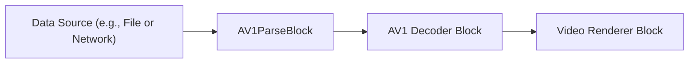

#### Platforms

Windows, macOS, Linux, iOS, Android.

---

### H.263 Parser Block

The `H263ParseBlock` is designed to parse H.263 video elementary streams. This is useful for older video conferencing and mobile video applications.

#### Block info

Name: `H263ParseBlock`.

| Pin direction | Media type | Pins count |
| --- | :---: | :---: |
| Input video | H.263 video | 1 |
| Output video | H.263 video | 1 |

#### The sample pipeline

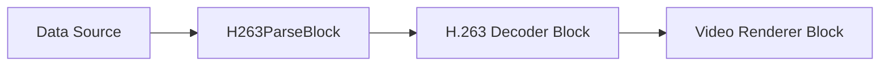

#### Platforms

Windows, macOS, Linux, iOS, Android.

---

### H.264 Parser Block

The `H264ParseBlock` parses H.264 (AVC) video elementary streams. This is one of the most widely used video codecs. The parser helps in identifying NAL units and other stream properties.

#### Block info

Name: `H264ParseBlock`.

| Pin direction | Media type | Pins count |
| --- | :---: | :---: |
| Input video | H.264 video | 1 |
| Output video | H.264 video | 1 |

#### The sample pipeline

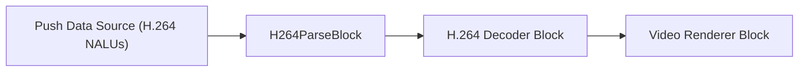

#### Platforms

Windows, macOS, Linux, iOS, Android.

---

### H.265 Parser Block

The `H265ParseBlock` parses H.265 (HEVC) video elementary streams. H.265 offers better compression than H.264. The parser helps in identifying NAL units and other stream properties.

#### Block info

Name: `H265ParseBlock`.

| Pin direction | Media type | Pins count |
| --- | :---: | :---: |
| Input video | H.265 video | 1 |
| Output video | H.265 video | 1 |

#### The sample pipeline

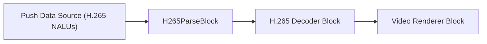

#### Platforms

Windows, macOS, Linux, iOS, Android.

---

### JPEG 2000 Parser Block

The `JPEG2000ParseBlock` is used to parse JPEG 2000 video streams. JPEG 2000 is a wavelet-based compression standard that can be used for still images and video.

#### Block info

Name: `JPEG2000ParseBlock`.

| Pin direction | Media type | Pins count |
| --- | :---: | :---: |
| Input video | JPEG 2000 video | 1 |
| Output video | JPEG 2000 video | 1 |

#### The sample pipeline

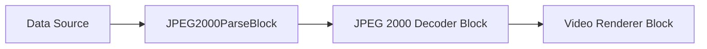

#### Platforms

Windows, macOS, Linux, iOS, Android.

---

### MPEG-1/2 Video Parser Block

The `MPEG12VideoParseBlock` parses MPEG-1 and MPEG-2 video elementary streams. These are older but still relevant video codecs, especially MPEG-2 for DVDs and broadcast.

#### Block info

Name: `MPEG12VideoParseBlock`.

| Pin direction | Media type | Pins count |
| --- | :---: | :---: |
| Input video | MPEG-1/2 video | 1 |
| Output video | MPEG-1/2 video | 1 |

#### The sample pipeline

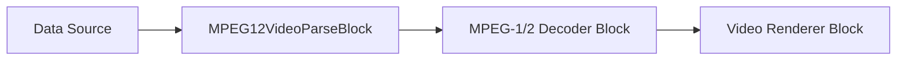

#### Platforms

Windows, macOS, Linux, iOS, Android.

---

### MPEG-4 Video Parser Block

The `MPEG4ParseBlock` parses MPEG-4 Part 2 video elementary streams (often referred to as DivX/Xvid in its early forms).

#### Block info

Name: `MPEG4ParseBlock`.

| Pin direction | Media type | Pins count |
| --- | :---: | :---: |
| Input video | MPEG-4 video | 1 |
| Output video | MPEG-4 video | 1 |

#### The sample pipeline

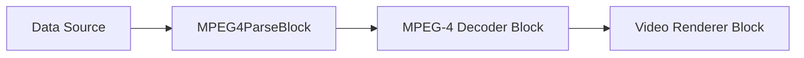

#### Platforms

Windows, macOS, Linux, iOS, Android.

---

### PNG Parser Block

The `PNGParseBlock` is used to parse PNG image data. While PNG is primarily an image format, this parser can be useful in scenarios where PNG images are part of a stream or need to be processed within the Media Blocks pipeline.

#### Block info

Name: `PNGParseBlock`.

| Pin direction | Media type | Pins count |
| --- | :---: | :---: |
| Input video | PNG image data | 1 |
| Output video | PNG image data | 1 |

#### The sample pipeline

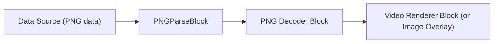

#### Platforms

Windows, macOS, Linux, iOS, Android.

---

### VC-1 Parser Block

The `VC1ParseBlock` parses VC-1 video elementary streams. VC-1 was developed by Microsoft and was used in Blu-ray Discs and Windows Media Video.

#### Block info

Name: `VC1ParseBlock`.

| Pin direction | Media type | Pins count |
| --- | :---: | :---: |
| Input video | VC-1 video | 1 |
| Output video | VC-1 video | 1 |

#### The sample pipeline

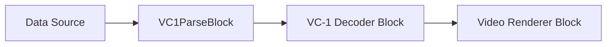

#### Platforms

Windows, macOS, Linux, iOS, Android.

---

### VP9 Parser Block

The `VP9ParseBlock` parses VP9 video elementary streams. VP9 is an open and royalty-free video coding format developed by Google, often used for web video.

#### Block info

Name: `VP9ParseBlock`.

| Pin direction | Media type | Pins count |
| --- | :---: | :---: |
| Input video | VP9 video | 1 |
| Output video | VP9 video | 1 |

#### The sample pipeline

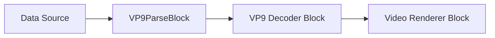

#### Platforms

Windows, macOS, Linux, iOS, Android.

---

## Audio Parser Blocks

### MPEG Audio Parser Block

The `MPEGAudioParseBlock` parses MPEG audio elementary streams, which includes MP1, MP2, and MP3 audio.

#### Block info

Name: `MPEGAudioParseBlock`.

| Pin direction | Media type | Pins count |
| --- | :---: | :---: |
| Input audio | MPEG audio | 1 |
| Output audio | MPEG audio | 1 |

#### The sample pipeline

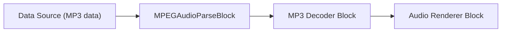

#### Platforms

Windows, macOS, Linux, iOS, Android.
