# Sinks

[Media Blocks SDK .Net](https://www.visioforge.com/media-blocks-sdk-net){ .md-button .md-button--primary target="_blank" }

Los sinks son bloques que guardan o transmiten datos. Son los últimos bloques en el pipeline.
Opcionalmente, algunos sinks pueden tener pines de salida para pasar datos al siguiente bloque en el pipeline.

El SDK proporciona muchos sinks diferentes para diferentes propósitos.

**Sinks de archivo**

Los siguientes sinks de archivo están disponibles:

- [ASF](#asf)
- [AVI](#avi)
- [Archivo](#archivo-raw)
- [MKV](#mkv)
- [MOV](#mov)
- [MP4](#mp4)
- [MPEG-PS](#mpeg-ps)
- [MPEG-TS](#mpeg-ts)
- [MXF](#mxf)
- [OGG](#ogg)
- [WAV](#wav)
- [WebM](#webm)

**Transmisión en red**

Los siguientes sinks de transmisión en red están disponibles:

- [Facebook Live](#facebook-live)
- [HLS](#hls)
- [MJPEG sobre HTTP](#mjpeg-sobre-http)
- [NDI](#ndi)
- [SRT](#srt)
- [SRT MPEG-TS](#srt-mpeg-ts)
- [RTMP](#rtmp)
- [Shoutcast](#shoutcast)
- [YouTube Live](#youtube-live)

## Sinks de Archivo

### ASF

`ASF (Advanced Systems Format)`: Un formato contenedor digital de Microsoft usado para almacenar datos multimedia, diseñado para ser independiente de la plataforma y soportar tipos de medios escalables como audio y video.

Use la clase `ASFSinkSettings` para establecer los parámetros.

#### Información del bloque

Nombre: AVISinkBlock.

| Dirección del pin | Tipo de medio | Cantidad de pines |
| --- | :---: | :---: |
| Entrada audio | audio/x-raw | uno o más |
| | audio/mpeg | |
| | audio/x-ac3 | |
| | audio/x-alaw | |
| | audio/x-mulaw | |
| | audio/x-wma | |
| Entrada video | video/x-raw | uno o más |
| | image/jpeg | |
| | video/x-divx | |
| | video/x-msmpeg | |
| | video/mpeg | |
| | video/x-h263 | |
| | video/x-h264 | |
| | video/x-dv | |
| | video/x-huffyuv | |
| | video/x-wmv | |
| | video/x-jpc | |
| | video/x-vp8 | |
| | image/png | |

#### Pipeline de ejemplo

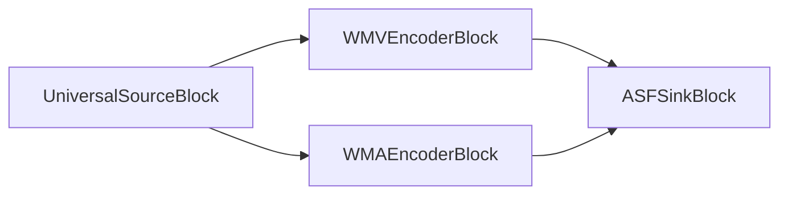

#### Código de ejemplo

```csharp
var pipeline = new MediaBlocksPipeline();

var filename = "test.mp4";
var fileSource = new UniversalSourceBlock(await UniversalSourceSettings.CreateAsync(new Uri(filename)));

// Bloque codificador de audio
var audioEncoderBlock = new WMAEncoderBlock(new WMAEncoderSettings());
pipeline.Connect(fileSource.AudioOutput, audioEncoderBlock.Input);

// Bloque codificador de video
var videoEncoderBlock = new WMVEncoderBlock(new WMVEncoderSettings());
pipeline.Connect(fileSource.VideoOutput, videoEncoderBlock.Input);

// Bloque sink para archivo ASF
var sinkBlock = new ASFSinkBlock(new ASFSinkSettings(@"output.wmv"));
pipeline.Connect(audioEncoderBlock.Output, sinkBlock.CreateNewInput(MediaBlockPadMediaType.Audio));
pipeline.Connect(videoEncoderBlock.Output, sinkBlock.CreateNewInput(MediaBlockPadMediaType.Video));

await pipeline.StartAsync();
```

#### Plataformas

Windows, macOS, Linux, iOS, Android.

### AVI

AVI (Audio Video Interleave) es un formato contenedor multimedia introducido por Microsoft. Permite la reproducción simultánea de audio con video alternando segmentos de datos de audio y video.

Use la clase `AVISinkSettings` para establecer los parámetros.

#### Información del bloque

Nombre: AVISinkBlock.

| Dirección del pin | Tipo de medio | Cantidad de pines |
| --- | :---: | :---: |
| Entrada audio | audio/x-raw | uno o más |
| | audio/mpeg | |
| | audio/x-ac3 | |
| | audio/x-alaw | |
| | audio/x-mulaw | |
| Entrada video | video/x-raw | uno o más |
| | image/jpeg | |
| | video/x-divx | |
| | video/x-msmpeg | |
| | video/mpeg | |
| | video/x-h263 | |
| | video/x-h264 | |
| | video/x-dv | |
| | video/x-huffyuv | |
| | image/png | |

#### Pipeline de ejemplo

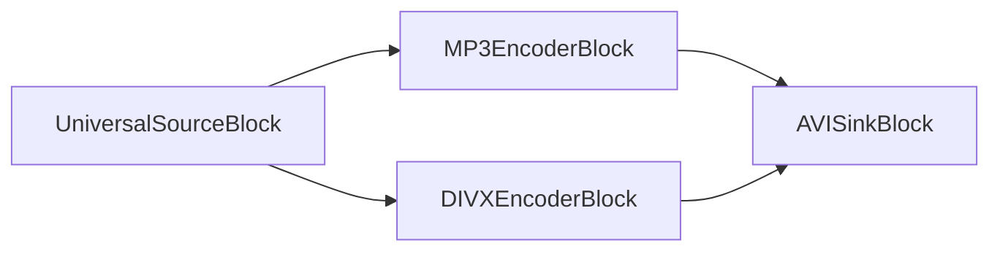

#### Código de ejemplo

```csharp
var pipeline = new MediaBlocksPipeline();

var filename = "test.mp4";
var fileSource = new UniversalSourceBlock(await UniversalSourceSettings.CreateAsync(new Uri(filename)));

// Configurar codificador de audio MP3
var audioEncoderBlock = new MP3EncoderBlock(new MP3EncoderSettings() { Bitrate = 192 });
pipeline.Connect(fileSource.AudioOutput, audioEncoderBlock.Input);

// Configurar codificador de video DIVX
var videoEncoderBlock = new DIVXEncoderBlock(new DIVXEncoderSettings());
pipeline.Connect(fileSource.VideoOutput, videoEncoderBlock.Input);

// Crear sink AVI y conectar las entradas
var sinkBlock = new AVISinkBlock(new AVISinkSettings(@"output.avi"));
pipeline.Connect(audioEncoderBlock.Output, sinkBlock.CreateNewInput(MediaBlockPadMediaType.Audio));
pipeline.Connect(videoEncoderBlock.Output, sinkBlock.CreateNewInput(MediaBlockPadMediaType.Video));

await pipeline.StartAsync();
```

#### Plataformas

Windows, macOS, Linux, iOS, Android.

### Archivo RAW

Salida universal a un archivo. Este sink se usa dentro de todos los otros sinks de nivel superior, ej. MP4Sink. Puede usarse para escribir video o audio RAW a un archivo.

#### Información del bloque

Nombre: FileSinkBlock.

| Dirección del pin | Tipo de medio | Cantidad de pines |
| --- | :---: | :---: |
| Entrada | Cualquier formato de flujo | 1 |

#### Pipeline de ejemplo


#### Código de ejemplo

```csharp
var pipeline = new MediaBlocksPipeline();

var filename = "test.mp3";
var fileSource = new UniversalSourceBlock(await UniversalSourceSettings.CreateAsync(new Uri(filename)));

// Codificar audio a MP3
var mp3EncoderBlock = new MP3EncoderBlock(new MP3EncoderSettings() { Bitrate = 192 });
pipeline.Connect(fileSource.AudioOutput, mp3EncoderBlock.Input);

// Guardar a archivo
var fileSinkBlock = new FileSinkBlock(@"output.mp3");
pipeline.Connect(mp3EncoderBlock.Output, fileSinkBlock.Input);

await pipeline.StartAsync();
```

#### Plataformas

Windows, macOS, Linux, iOS, Android.

### MKV

MKV (Matroska) es un formato contenedor de estándar abierto y gratuito, similar a MP4 y AVI pero con más flexibilidad y características avanzadas.

Use la clase `MKVSinkSettings` para establecer los parámetros.

#### Información del bloque

Nombre: MKVSinkBlock.

| Dirección del pin | Tipo de medio | Cantidad de pines |
| --- | :---: | :---: |
| Entrada audio | audio/x-raw | uno o más |
| | audio/mpeg | |
| | audio/x-ac3 | |
| | audio/x-alaw | |
| | audio/x-mulaw | |
| | audio/x-wma | |
| | audio/x-vorbis | |
| | audio/x-opus | |
| | audio/x-flac | |
| Entrada video | video/x-raw | uno o más |
| | image/jpeg | |
| | video/x-divx | |
| | video/x-msmpeg | |
| | video/mpeg | |
| | video/x-h263 | |
| | video/x-h264 | |
| | video/x-h265 | |
| | video/x-dv | |
| | video/x-huffyuv | |
| | video/x-wmv | |
| | video/x-jpc | |
| | video/x-vp8 | |
| | video/x-vp9 | |
| | video/x-theora | |
| | image/png | |

#### Pipeline de ejemplo

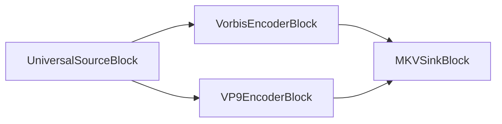

#### Código de ejemplo

```csharp
var pipeline = new MediaBlocksPipeline();

var filename = "test.mp4";
var fileSource = new UniversalSourceBlock(await UniversalSourceSettings.CreateAsync(new Uri(filename)));

// Codificador de audio Vorbis
var audioEncoderBlock = new VorbisEncoderBlock(new VorbisEncoderSettings() { Bitrate = 192 });
pipeline.Connect(fileSource.AudioOutput, audioEncoderBlock.Input);

// Codificador de video VP9
var videoEncoderBlock = new VP9EncoderBlock(new VP9EncoderSettings() { Bitrate = 2000 });
pipeline.Connect(fileSource.VideoOutput, videoEncoderBlock.Input);

// Sink MKV
var sinkBlock = new MKVSinkBlock(new MKVSinkSettings(@"output.mkv"));
pipeline.Connect(audioEncoderBlock.Output, sinkBlock.CreateNewInput(MediaBlockPadMediaType.Audio));
pipeline.Connect(videoEncoderBlock.Output, sinkBlock.CreateNewInput(MediaBlockPadMediaType.Video));

await pipeline.StartAsync();
```

#### Plataformas

Windows, macOS, Linux, iOS, Android.

### MOV

MOV (QuickTime File Format) es un formato contenedor multimedia desarrollado por Apple para almacenar video, audio y otros medios basados en tiempo. Soporta varios códecs y es ampliamente usado para contenido multimedia en plataformas Apple, y también en edición de video profesional.

Use la clase `MOVSinkSettings` para establecer los parámetros.

#### Información del bloque

Nombre: MOVSinkBlock.

| Dirección del pin | Tipo de medio | Cantidad de pines |
| --- | :---: | :---: |
| Entrada audio | audio/x-raw | uno o más |
| | audio/mpeg | |
| | audio/x-ac3 | |
| | audio/x-alaw | |
| | audio/x-mulaw | |
| | audio/AAC | |
| Entrada video | video/x-raw | uno o más |
| | image/jpeg | |
| | video/x-divx | |
| | video/x-msmpeg | |
| | video/mpeg | |
| | video/x-h263 | |
| | video/x-h264 | |
| | video/x-h265 | |
| | video/x-dv | |
| | video/x-huffyuv | |
| | image/png | |

#### Pipeline de ejemplo

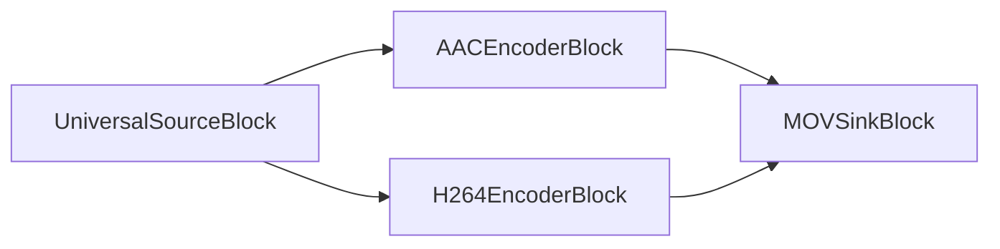

#### Código de ejemplo

```csharp
var pipeline = new MediaBlocksPipeline();

var filename = "test.mp4";
var fileSource = new UniversalSourceBlock(await UniversalSourceSettings.CreateAsync(new Uri(filename)));

// Codificador de audio AAC
var audioEncoderBlock = new AACEncoderBlock(new AACEncoderSettings() { Bitrate = 192 });
pipeline.Connect(fileSource.AudioOutput, audioEncoderBlock.Input);

// Codificador de video H.264
var videoEncoderBlock = new H264EncoderBlock(new OpenH264EncoderSettings());
pipeline.Connect(fileSource.VideoOutput, videoEncoderBlock.Input);

// Sink MOV
var sinkBlock = new MOVSinkBlock(new MOVSinkSettings(@"output.mov"));
pipeline.Connect(audioEncoderBlock.Output, sinkBlock.CreateNewInput(MediaBlockPadMediaType.Audio));
pipeline.Connect(videoEncoderBlock.Output, sinkBlock.CreateNewInput(MediaBlockPadMediaType.Video));

await pipeline.StartAsync();
```

#### Plataformas

Windows, macOS, Linux, iOS, Android.

### MP4

MP4 (MPEG-4 Parte 14) es un formato contenedor multimedia digital usado para almacenar video, audio y otros datos como subtítulos e imágenes. Es ampliamente usado para compartir contenido de video en línea y es compatible con una amplia gama de dispositivos y plataformas.

Use la clase `MP4SinkSettings` para establecer los parámetros.

#### Información del bloque

Nombre: MP4SinkBlock.

| Dirección del pin | Tipo de medio | Cantidad de pines |
| --- | :---: | :---: |
| Entrada audio | audio/x-raw | uno o más |
| | audio/mpeg | |
| | audio/x-ac3 | |
| | audio/x-alaw | |
| | audio/x-mulaw | |
| | audio/AAC | |
| Entrada video | video/x-raw | uno o más |
| | image/jpeg | |
| | video/x-divx | |
| | video/x-msmpeg | |
| | video/mpeg | |
| | video/x-h263 | |
| | video/x-h264 | |
| | video/x-h265 | |
| | video/x-dv | |
| | video/x-huffyuv | |
| | image/png | |

#### Pipeline de ejemplo

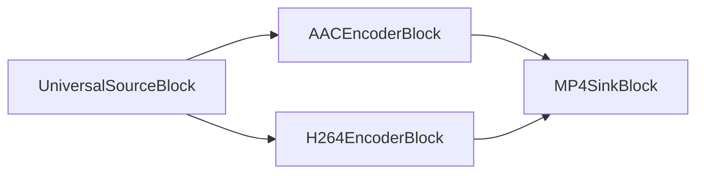

#### Código de ejemplo

```csharp
var pipeline = new MediaBlocksPipeline();

var filename = "test.mp4";
var fileSource = new UniversalSourceBlock(await UniversalSourceSettings.CreateAsync(new Uri(filename)));

// Codificador de audio AAC
var audioEncoderBlock = new AACEncoderBlock(new AACEncoderSettings() { Bitrate = 192 });
pipeline.Connect(fileSource.AudioOutput, audioEncoderBlock.Input);

// Codificador de video H.264
var videoEncoderBlock = new H264EncoderBlock(new OpenH264EncoderSettings());
pipeline.Connect(fileSource.VideoOutput, videoEncoderBlock.Input);

// Sink MP4
var sinkBlock = new MP4SinkBlock(new MP4SinkSettings(@"output.mp4"));
pipeline.Connect(audioEncoderBlock.Output, sinkBlock.CreateNewInput(MediaBlockPadMediaType.Audio));
pipeline.Connect(videoEncoderBlock.Output, sinkBlock.CreateNewInput(MediaBlockPadMediaType.Video));

await pipeline.StartAsync();
```

#### Plataformas

Windows, macOS, Linux, iOS, Android.

### MPEG-PS

MPEG-PS (MPEG Program Stream) es un formato contenedor para multiplexar audio, video y otros datos digitales. Está diseñado para medios razonablemente confiables, como DVDs, CD-ROMs y otros medios de disco.

Use la clase `MPEGPSSinkSettings` para establecer los parámetros.

#### Información del bloque

Nombre: MPEGPSSinkBlock.

| Dirección del pin | Tipo de medio | Cantidad de pines |
| --- | :---: | :---: |
| Entrada audio | audio/x-raw | uno o más |
| | audio/mpeg | |
| | audio/x-ac3 | |
| | audio/x-alaw | |
| | audio/x-mulaw | |
| Entrada video | video/x-raw | uno o más |
| | image/jpeg | |
| | video/x-msmpeg | |
| | video/mpeg | |
| | video/x-h263 | |
| | video/x-h264 | |

#### Pipeline de ejemplo

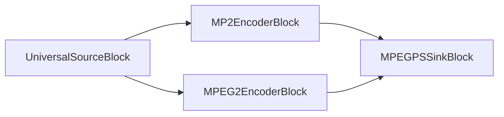

#### Código de ejemplo

```csharp
var pipeline = new MediaBlocksPipeline();

var filename = "test.mp4";
var fileSource = new UniversalSourceBlock(await UniversalSourceSettings.CreateAsync(new Uri(filename)));

// Codificador de audio MP2
var audioEncoderBlock = new MP2EncoderBlock(new MP2EncoderSettings() { Bitrate = 192 });
pipeline.Connect(fileSource.AudioOutput, audioEncoderBlock.Input);

// Codificador de video MPEG-2
var videoEncoderBlock = new MPEG2EncoderBlock(new MPEG2EncoderSettings());
pipeline.Connect(fileSource.VideoOutput, videoEncoderBlock.Input);

// Sink MPEG-PS
var sinkBlock = new MPEGPSSinkBlock(new MPEGPSSinkSettings(@"output.mpg"));
pipeline.Connect(audioEncoderBlock.Output, sinkBlock.CreateNewInput(MediaBlockPadMediaType.Audio));
pipeline.Connect(videoEncoderBlock.Output, sinkBlock.CreateNewInput(MediaBlockPadMediaType.Video));

await pipeline.StartAsync();
```

#### Plataformas

Windows, macOS, Linux, iOS, Android.

### MPEG-TS

MPEG-TS (MPEG Transport Stream) es un formato contenedor digital estándar para transmisión y almacenamiento de audio, video y datos del Protocolo de Información de Programa y Sistema (PSIP). Se usa en sistemas de transmisión como DVB, ATSC e IPTV.

Use la clase `MPEGTSSinkSettings` para establecer los parámetros.

#### Información del bloque

Nombre: MPEGTSSinkBlock.

| Dirección del pin | Tipo de medio | Cantidad de pines |
| --- | :---: | :---: |
| Entrada audio | audio/x-raw | uno o más |
| | audio/mpeg | |
| | audio/x-ac3 | |
| | audio/x-alaw | |
| | audio/x-mulaw | |
| | audio/AAC | |
| Entrada video | video/x-raw | uno o más |
| | image/jpeg | |
| | video/x-msmpeg | |
| | video/mpeg | |
| | video/x-h263 | |
| | video/x-h264 | |
| | video/x-h265 | |

#### Pipeline de ejemplo

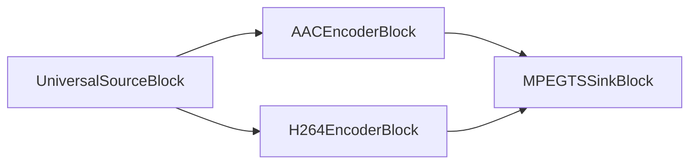

#### Código de ejemplo

```csharp
var pipeline = new MediaBlocksPipeline();

var filename = "test.mp4";
var fileSource = new UniversalSourceBlock(await UniversalSourceSettings.CreateAsync(new Uri(filename)));

// Codificador de audio AAC
var audioEncoderBlock = new AACEncoderBlock(new AACEncoderSettings() { Bitrate = 192 });
pipeline.Connect(fileSource.AudioOutput, audioEncoderBlock.Input);

// Codificador de video H.264
var videoEncoderBlock = new H264EncoderBlock(new OpenH264EncoderSettings());
pipeline.Connect(fileSource.VideoOutput, videoEncoderBlock.Input);

// Sink MPEG-TS
var sinkBlock = new MPEGTSSinkBlock(new MPEGTSSinkSettings(@"output.ts"));
pipeline.Connect(audioEncoderBlock.Output, sinkBlock.CreateNewInput(MediaBlockPadMediaType.Audio));
pipeline.Connect(videoEncoderBlock.Output, sinkBlock.CreateNewInput(MediaBlockPadMediaType.Video));

await pipeline.StartAsync();
```

#### Plataformas

Windows, macOS, Linux, iOS, Android.

### MXF

MXF (Material Exchange Format) es un formato contenedor para video y audio digital profesional, desarrollado para abordar problemas como intercambio de archivos, interoperabilidad y para mejorar el flujo de trabajo entre casas de producción y proveedores de contenido/equipos.

Use la clase `MXFSinkSettings` para establecer los parámetros.

#### Información del bloque

Nombre: MXFSinkBlock.

| Dirección del pin | Tipo de medio | Cantidad de pines |
| --- | :---: | :---: |
| Entrada audio | audio/x-raw | uno o más |
| | audio/mpeg | |
| | audio/x-ac3 | |
| | audio/x-alaw | |
| | audio/x-mulaw | |
| | audio/AAC | |
| Entrada video | video/x-raw | uno o más |
| | image/jpeg | |
| | video/x-divx | |
| | video/x-msmpeg | |
| | video/mpeg | |
| | video/x-h263 | |
| | video/x-h264 | |
| | video/x-h265 | |
| | video/x-dv | |
| | image/png | |

#### Pipeline de ejemplo

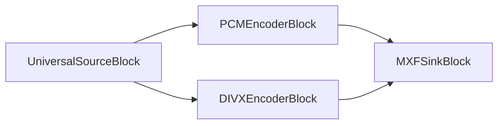

#### Código de ejemplo

```csharp
var pipeline = new MediaBlocksPipeline();

var filename = "test.mp4";
var fileSource = new UniversalSourceBlock(await UniversalSourceSettings.CreateAsync(new Uri(filename)));

// Bloque de audio PCM
var audioBlock = new PCMEncoderBlock(new PCMEncoderSettings());
pipeline.Connect(fileSource.AudioOutput, audioBlock.Input);

// Codificador de video DIVX
var videoEncoderBlock = new DIVXEncoderBlock(new DIVXEncoderSettings());
pipeline.Connect(fileSource.VideoOutput, videoEncoderBlock.Input);

// Sink MXF
var sinkBlock = new MXFSinkBlock(new MXFSinkSettings(@"output.mxf"));
pipeline.Connect(audioBlock.Output, sinkBlock.CreateNewInput(MediaBlockPadMediaType.Audio));
pipeline.Connect(videoEncoderBlock.Output, sinkBlock.CreateNewInput(MediaBlockPadMediaType.Video));

await pipeline.StartAsync();
```

#### Plataformas

Windows, macOS, Linux, iOS, Android.

### OGG

OGG es un formato contenedor gratuito y abierto diseñado para transmisión eficiente y manipulación de multimedia digital de alta calidad. Es desarrollado por la Fundación Xiph.Org y soporta códecs de audio como Vorbis, Opus y FLAC, y códecs de video como Theora.

Use la clase `OGGSinkSettings` para establecer los parámetros.

#### Información del bloque

Nombre: OGGSinkBlock.

| Dirección del pin | Tipo de medio | Cantidad de pines |
| --- | :---: | :---: |
| Entrada audio | audio/x-raw | uno o más |
| | audio/x-vorbis | |
| | audio/x-flac | |
| | audio/x-speex | |
| | audio/x-celt | |
| | audio/x-opus | |
| Entrada video | video/x-raw | uno o más |
| | video/x-theora | |
| | video/x-dirac | |

#### Pipeline de ejemplo

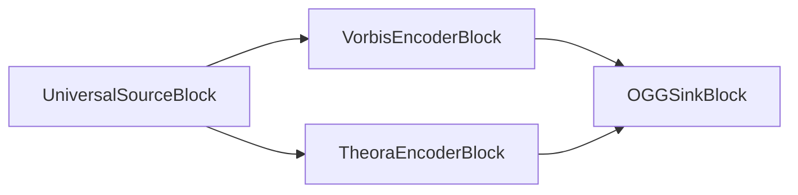

#### Código de ejemplo

```csharp
var pipeline = new MediaBlocksPipeline();

var filename = "test.mp4";
var fileSource = new UniversalSourceBlock(await UniversalSourceSettings.CreateAsync(new Uri(filename)));

// Codificador de audio Vorbis
var audioEncoderBlock = new VorbisEncoderBlock(new VorbisEncoderSettings() { Bitrate = 192 });
pipeline.Connect(fileSource.AudioOutput, audioEncoderBlock.Input);

// Codificador de video Theora
var videoEncoderBlock = new TheoraEncoderBlock(new TheoraEncoderSettings());
pipeline.Connect(fileSource.VideoOutput, videoEncoderBlock.Input);

// Sink OGG
var sinkBlock = new OGGSinkBlock(new OGGSinkSettings(@"output.ogg"));
pipeline.Connect(audioEncoderBlock.Output, sinkBlock.CreateNewInput(MediaBlockPadMediaType.Audio));
pipeline.Connect(videoEncoderBlock.Output, sinkBlock.CreateNewInput(MediaBlockPadMediaType.Video));

await pipeline.StartAsync();
```

#### Plataformas

Windows, macOS, Linux, iOS, Android.

### WAV

WAV (Waveform Audio File Format) es un estándar de formato de archivo de audio desarrollado por IBM y Microsoft para almacenar flujos de bits de audio en PCs. Es el formato principal usado en sistemas Windows para audio crudo y típicamente sin comprimir.

Use la clase `WAVSinkSettings` para establecer los parámetros.

#### Información del bloque

Nombre: WAVSinkBlock.

| Dirección del pin | Tipo de medio | Cantidad de pines |
| --- | :---: | :---: |
| Entrada audio | audio/x-raw | uno |
| | audio/x-alaw | |
| | audio/x-mulaw | |

#### Pipeline de ejemplo


### Código de ejemplo

```csharp
var pipeline = new MediaBlocksPipeline();

var filename = "test.mp3";
var fileSource = new UniversalSourceBlock(await UniversalSourceSettings.CreateAsync(new Uri(filename)));

// Bloque de audio PCM
var audioBlock = new PCMEncoderBlock(new PCMEncoderSettings());
pipeline.Connect(fileSource.AudioOutput, audioBlock.Input);

// Sink WAV
var sinkBlock = new WAVSinkBlock(new WAVSinkSettings(@"output.wav"));
pipeline.Connect(audioBlock.Output, sinkBlock.Input);

await pipeline.StartAsync();
```

#### Plataformas

Windows, macOS, Linux, iOS, Android.

### WebM

WebM es un formato de archivo de medios abierto, libre de regalías, diseñado para la web. WebM define la estructura del contenedor de archivo, formatos de video y audio. Los archivos WebM consisten en flujos de video comprimidos con los códecs de video VP8 o VP9 y flujos de audio comprimidos con los códecs de audio Vorbis u Opus.

Use la clase `WebMSinkSettings` para establecer los parámetros.

#### Información del bloque

Nombre: WebMSinkBlock.

| Dirección del pin | Tipo de medio | Cantidad de pines |
| --- | :---: | :---: |
| Entrada audio | audio/x-raw | uno o más |
| | audio/x-vorbis | |
| | audio/x-opus | |
| Entrada video | video/x-raw | uno o más |
| | video/x-vp8 | |
| | video/x-vp9 | |

#### Pipeline de ejemplo

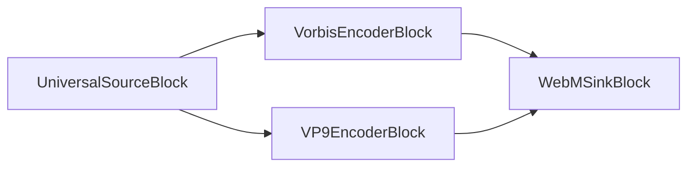

#### Código de ejemplo

```csharp
var pipeline = new MediaBlocksPipeline();

var filename = "test.mp4";
var fileSource = new UniversalSourceBlock(await UniversalSourceSettings.CreateAsync(new Uri(filename)));

// Codificador de audio Vorbis
var audioEncoderBlock = new VorbisEncoderBlock(new VorbisEncoderSettings() { Bitrate = 192 });
pipeline.Connect(fileSource.AudioOutput, audioEncoderBlock.Input);

// Codificador de video VP9
var videoEncoderBlock = new VP9EncoderBlock(new VP9EncoderSettings());
pipeline.Connect(fileSource.VideoOutput, videoEncoderBlock.Input);

// Sink WebM
var sinkBlock = new WebMSinkBlock(new WebMSinkSettings(@"output.webm"));
pipeline.Connect(audioEncoderBlock.Output, sinkBlock.CreateNewInput(MediaBlockPadMediaType.Audio));
pipeline.Connect(videoEncoderBlock.Output, sinkBlock.CreateNewInput(MediaBlockPadMediaType.Video));

await pipeline.StartAsync();
```

#### Plataformas

Windows, macOS, Linux, iOS, Android.

## Sinks de Transmisión en Red

### RTMP

`RTMP (Real-Time Messaging Protocol)`: Desarrollado por Adobe, RTMP es un protocolo usado para transmitir audio, video y datos a través de Internet, optimizado para transmisión de alto rendimiento. Permite comunicación eficiente y de baja latencia, comúnmente usado en transmisiones en vivo como eventos deportivos y conciertos.

Use la clase `RTMPSinkSettings` para establecer los parámetros.

#### Información del bloque

Nombre: RTMPSinkBlock.

| Dirección del pin | Tipo de medio | Cantidad de pines |
| --- |:------------:|:-----------:|
| Entrada audio | audio/mpeg [1,2,4] | uno |
| | audio/x-adpcm | |
| | PCM [U8, S16LE] | |
| | audio/x-speex | |
| | audio/x-mulaw | |
| | audio/x-alaw | |
| | audio/x-nellymoser | |
| Entrada video | video/x-h264 | uno |

#### Pipeline de ejemplo

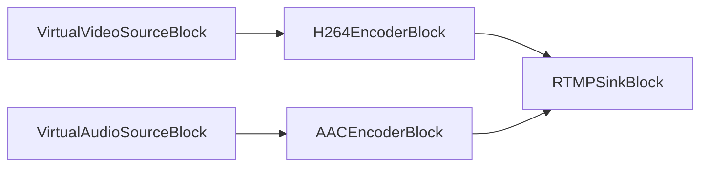

#### Código de ejemplo

```csharp
// Pipeline
var pipeline = new MediaBlocksPipeline();

// Fuentes de video y audio
var virtualVideoSource = new VirtualVideoSourceSettings
{
    Width = 1280,
    Height = 720,
    FrameRate = VideoFrameRate.FPS_25,
};

var videoSource = new VirtualVideoSourceBlock(virtualVideoSource);

var virtualAudioSource = new VirtualAudioSourceSettings
{
     Channels = 2,
     SampleRate = 44100,
};

var audioSource = new VirtualAudioSourceBlock(virtualAudioSource);

// Codificadores H264/AAC
var h264Encoder = new H264EncoderBlock(new OpenH264EncoderSettings());
var aacEncoder = new AACEncoderBlock();

pipeline.Connect(videoSource.Output, h264Encoder.Input);
pipeline.Connect(audioSource.Output, aacEncoder.Input);

// Sink RTMP
var sink = new RTMPSinkBlock(new RTMPSinkSettings());
pipeline.Connect(h264Encoder.Output, sink.CreateNewInput(MediaBlockPadMediaType.Video));
pipeline.Connect(aacEncoder.Output, sink.CreateNewInput(MediaBlockPadMediaType.Audio));

// Iniciar
await pipeline.StartAsync();
```

#### Plataformas

Windows, macOS, Linux, iOS, Android.

### Facebook Live

Facebook Live es una función que permite transmisión en vivo de video en Facebook. La transmisión en vivo puede publicarse en perfiles personales, páginas o grupos.

Use la clase `FacebookLiveSinkSettings` para establecer los parámetros.

#### Información del bloque

Nombre: FacebookLiveSinkBlock.

| Dirección del pin | Tipo de medio | Cantidad de pines |
| --- |:------------:|:-----------:|
| Entrada audio | audio/mpeg [1,2,4] | uno |
| | audio/x-adpcm | |
| | PCM [U8, S16LE] | |
| | audio/x-speex | |
| | audio/x-mulaw | |
| | audio/x-alaw | |
| | audio/x-nellymoser | |
| Entrada video | video/x-h264 | uno |

#### Pipeline de ejemplo

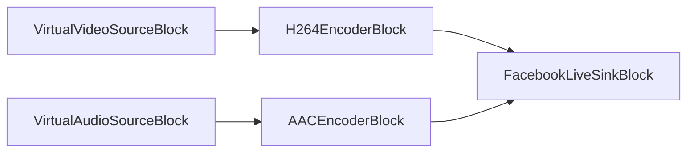

#### Código de ejemplo

```csharp
// Pipeline
var pipeline = new MediaBlocksPipeline();

// Fuentes de video y audio
var virtualVideoSource = new VirtualVideoSourceSettings
{
    Width = 1280,
    Height = 720,
    FrameRate = VideoFrameRate.FPS_25,
};

var videoSource = new VirtualVideoSourceBlock(virtualVideoSource);

var virtualAudioSource = new VirtualAudioSourceSettings
{
     Channels = 2,
     SampleRate = 44100,
};

var audioSource = new VirtualAudioSourceBlock(virtualAudioSource);

// Codificadores H264/AAC
var h264Encoder = new H264EncoderBlock(new OpenH264EncoderSettings());
var aacEncoder = new AACEncoderBlock();

pipeline.Connect(videoSource.Output, h264Encoder.Input);
pipeline.Connect(audioSource.Output, aacEncoder.Input);

// Sink de Facebook Live
var sink = new FacebookLiveSinkBlock(new FacebookLiveSinkSettings(
    "https://facebook.com/rtmp/...",
    "tu_clave_de_stream"));
pipeline.Connect(h264Encoder.Output, sink.CreateNewInput(MediaBlockPadMediaType.Video));
pipeline.Connect(aacEncoder.Output, sink.CreateNewInput(MediaBlockPadMediaType.Audio));

// Iniciar
await pipeline.StartAsync();
```

#### Plataformas

Windows, macOS, Linux, iOS, Android.

### HLS

HLS (HTTP Live Streaming) es un protocolo de comunicaciones de transmisión adaptativa basado en HTTP desarrollado por Apple. Permite transmisión de tasa de bits adaptativa dividiendo el flujo en una secuencia de pequeños segmentos de archivo basados en HTTP.

El sink HLS soporta múltiples implementaciones:
- **hlssink3** (recomendado): Última implementación con segmentos MPEG-TS y características avanzadas
- **hlsmultivariantsink**: Transmisión adaptativa multi-bitrate con generación automática de lista de reproducción maestra
- **hlscmafsink**: Segmentos CMAF/fMP4 para mejor compatibilidad con reproductores modernos
- **hlssink2** (legacy): Implementación original con segmentos MPEG-TS

Use la clase `HLSSinkSettings` para configurar los parámetros. El sink selecciona automáticamente la mejor implementación disponible por defecto.

#### Información del bloque

Nombre: HLSSinkBlock.

| Dirección del pin | Tipo de medio | Cantidad de pines |
| --- | :---: | :---: |
| Entrada audio | audio/mpeg | uno o más |
| | audio/x-ac3 | |
| | audio/x-alaw | |
| | audio/x-mulaw | |
| | audio/AAC | |
| Entrada video | video/x-raw | uno o más |
| | image/jpeg | |
| | video/x-msmpeg | |
| | video/mpeg | |
| | video/x-h263 | |
| | video/x-h264 | |
| | video/x-h265 | |

#### Pipeline de ejemplo

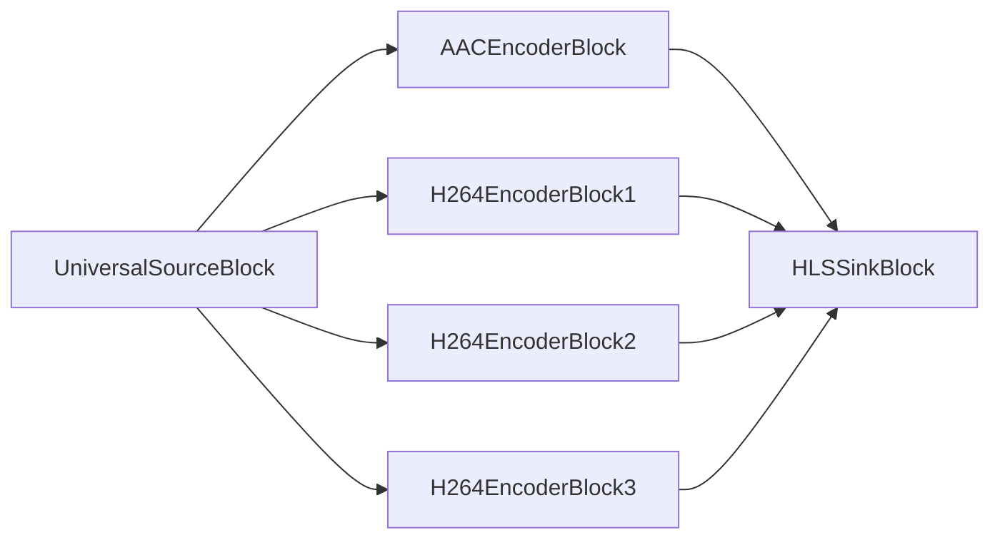

#### Código de ejemplo

##### Transmisión HLS Básica (modo Auto)

```csharp
var pipeline = new MediaBlocksPipeline();

var filename = "test.mp4";
var fileSource = new UniversalSourceBlock(await UniversalSourceSettings.CreateAsync(new Uri(filename)));

var audioEncoderBlock = new AACEncoderBlock(new AACEncoderSettings() { Bitrate = 192 });
pipeline.Connect(fileSource.AudioOutput, audioEncoderBlock.Input);

// 3 codificadores de video con diferentes bitrates para transmisión adaptativa
var videoEncoderBlock1 = new H264EncoderBlock(new OpenH264EncoderSettings { Bitrate = 3000, Width = 1920, Height = 1080 });
var videoEncoderBlock2 = new H264EncoderBlock(new OpenH264EncoderSettings { Bitrate = 1500, Width = 1280, Height = 720 });
var videoEncoderBlock3 = new H264EncoderBlock(new OpenH264EncoderSettings { Bitrate = 800, Width = 854, Height = 480 });

pipeline.Connect(fileSource.VideoOutput, videoEncoderBlock1.Input);
pipeline.Connect(fileSource.VideoOutput, videoEncoderBlock2.Input);
pipeline.Connect(fileSource.VideoOutput, videoEncoderBlock3.Input);

// Configurar sink HLS con selección automática (prefiere hlssink3)
var hlsSettings = new HLSSinkSettings()
{
    Location = @"c:\inetpub\wwwroot\hls\segment_%05d.ts",
    PlaylistLocation = @"c:\inetpub\wwwroot\hls\playlist.m3u8",
    PlaylistRoot = "http://localhost/hls/",
    TargetDuration = TimeSpan.FromSeconds(6),
    PlaylistLength = 5,
    MaxFiles = 10,
    PlaylistType = HLSPlaylistType.Event,
    Custom_HTTP_Server_Enabled = true,
    Custom_HTTP_Server_Port = 8080
};

var sinkBlock = new HLSSinkBlock(hlsSettings);

// Conectar audio
pipeline.Connect(audioEncoderBlock.Output, sinkBlock.CreateNewInput(MediaBlockPadMediaType.Audio));

// Conectar variantes de video
pipeline.Connect(videoEncoderBlock1.Output, sinkBlock.CreateNewInput(MediaBlockPadMediaType.Video));
pipeline.Connect(videoEncoderBlock2.Output, sinkBlock.CreateNewInput(MediaBlockPadMediaType.Video));
pipeline.Connect(videoEncoderBlock3.Output, sinkBlock.CreateNewInput(MediaBlockPadMediaType.Video));

await pipeline.StartAsync();
```

#### Plataformas

Windows, macOS, Linux, iOS, Android.

### MJPEG sobre HTTP

HTTP MJPEG (Motion JPEG) Live es un formato de transmisión de video donde cada fotograma de video se comprime por separado como una imagen JPEG y se transmite sobre HTTP. Es ampliamente usado en cámaras IP y webcams debido a su simplicidad, aunque es menos eficiente que los códecs modernos.

Use la clase `HTTPMJPEGLiveSinkSettings` para establecer los parámetros.

#### Información del bloque

Nombre: HTTPMJPEGLiveSinkBlock.

| Dirección del pin | Tipo de medio | Cantidad de pines |
| --- | :---: | :---: |
| Entrada video | video/x-raw | uno |
| | image/jpeg | |

#### Pipeline de ejemplo


#### Código de ejemplo

```csharp
var pipeline = new MediaBlocksPipeline();

// Crear fuente de video virtual
var virtualVideoSource = new VirtualVideoSourceSettings
{
    Width = 1280,
    Height = 720,
    FrameRate = VideoFrameRate.FPS_30,
};

var videoSource = new VirtualVideoSourceBlock(virtualVideoSource);

// Codificador MJPEG
var mjpegEncoder = new MJPEGEncoderBlock(new MJPEGEncoderSettings { Quality = 80 });
pipeline.Connect(videoSource.Output, mjpegEncoder.Input);

// Servidor HTTP MJPEG
var sink = new HTTPMJPEGLiveSinkBlock(new HTTPMJPEGLiveSinkSettings
{
    Port = 8080,
    Path = "/stream"
});
pipeline.Connect(mjpegEncoder.Output, sink.Input);

// Iniciar
await pipeline.StartAsync();

Console.WriteLine("Flujo MJPEG disponible en http://localhost:8080/stream");
Console.WriteLine("Presione cualquier tecla para detener...");
Console.ReadKey();
```

### Plataformas

Windows, macOS, Linux, iOS, Android.

### NDI

NDI (Network Device Interface) es un estándar de transporte de video libre de regalías desarrollado por NewTek que permite que productos compatibles con video se comuniquen, entreguen y reciban video de calidad de transmisión de manera de alta calidad y baja latencia a través de redes Ethernet estándar.

Use la clase `NDISinkSettings` para establecer los parámetros.

#### Información del bloque

Nombre: NDISinkBlock.

| Dirección del pin | Tipo de medio | Cantidad de pines |
| --- | :---: | :---: |
| Entrada audio | audio/x-raw | uno |
| Entrada video | video/x-raw | uno |

#### Pipeline de ejemplo


#### Código de ejemplo

```csharp
var pipeline = new MediaBlocksPipeline();

var filename = "test.mp4";
var fileSource = new UniversalSourceBlock(await UniversalSourceSettings.CreateAsync(new Uri(filename)));

var sinkBlock = new NDISinkBlock(new NDISinkSettings("Mi Flujo NDI"));
pipeline.Connect(fileSource.AudioOutput, sinkBlock.AudioInput);
pipeline.Connect(fileSource.VideoOutput, sinkBlock.VideoInput);

await pipeline.StartAsync();
```

#### Plataformas

Windows, macOS, Linux.

### SRT

SRT (Secure Reliable Transport) es un protocolo de transporte de video de código abierto que permite la entrega de video de alta calidad, seguro y de baja latencia a través de redes impredecibles como el internet público. Fue desarrollado por Haivision.

Use la clase `SRTSinkSettings` para establecer los parámetros.

#### Información del bloque

Nombre: SRTSinkBlock.

| Dirección del pin | Tipo de medio | Cantidad de pines |
| --- | :---: | :---: |
| Entrada | Cualquier formato de flujo | 1 |

#### Pipeline de ejemplo


#### Código de ejemplo

```csharp
var pipeline = new MediaBlocksPipeline();

var filename = "test.mp4";
var fileSource = new UniversalSourceBlock(await UniversalSourceSettings.CreateAsync(new Uri(filename)));

// Crear un bloque multiplexor para combinar audio y video
var muxer = new MP4MuxerBlock();
pipeline.Connect(fileSource.AudioOutput, muxer.CreateNewInput(MediaBlockPadMediaType.Audio));
pipeline.Connect(fileSource.VideoOutput, muxer.CreateNewInput(MediaBlockPadMediaType.Video));

// Crear sink SRT en modo caller (conectándose a un listener)
var srtSettings = new SRTSinkSettings
{
    Host = "servidor-srt.ejemplo.com",
    Port = 1234,
    Mode = SRTMode.Caller,
    Latency = 200, // milisegundos
    Passphrase = "frase-de-cifrado-opcional"
};

var srtSink = new SRTSinkBlock(srtSettings);
pipeline.Connect(muxer.Output, srtSink.Input);

await pipeline.StartAsync();
```

#### Plataformas

Windows, macOS, Linux, iOS, Android.

### SRT MPEG-TS

SRT MPEG-TS es una combinación del protocolo de transporte SRT con el formato contenedor MPEG-TS. Esto permite transporte seguro y confiable de flujos MPEG-TS sobre redes públicas, lo cual es útil para transmisión y flujos de trabajo de video profesional.

Use la clase `SRTMPEGTSSinkSettings` para establecer los parámetros.

#### Información del bloque

Nombre: SRTMPEGTSSinkBlock.

| Dirección del pin | Tipo de medio | Cantidad de pines |
| --- | :---: | :---: |
| Entrada audio | audio/x-raw | uno o más |
| | audio/mpeg | |
| | audio/x-ac3 | |
| | audio/x-alaw | |
| | audio/x-mulaw | |
| | audio/AAC | |
| Entrada video | video/x-raw | uno o más |
| | image/jpeg | |
| | video/x-msmpeg | |
| | video/mpeg | |
| | video/x-h263 | |
| | video/x-h264 | |
| | video/x-h265 | |

#### Pipeline de ejemplo

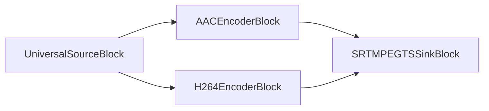

#### Código de ejemplo

```csharp
var pipeline = new MediaBlocksPipeline();

var filename = "test.mp4";
var fileSource = new UniversalSourceBlock(await UniversalSourceSettings.CreateAsync(new Uri(filename)));

var audioEncoderBlock = new AACEncoderBlock(new AACEncoderSettings() { Bitrate = 192 });
pipeline.Connect(fileSource.AudioOutput, audioEncoderBlock.Input);

var videoEncoderBlock = new H264EncoderBlock(new OpenH264EncoderSettings());
pipeline.Connect(fileSource.VideoOutput, videoEncoderBlock.Input);

// Configurar sink SRT MPEG-TS
var srtMpegtsSinkSettings = new SRTMPEGTSSinkSettings
{
    Host = "servidor-srt.ejemplo.com",
    Port = 1234,
    Mode = SRTMode.Caller,
    Latency = 200,
    Passphrase = "frase-de-cifrado-opcional"
};

var sinkBlock = new SRTMPEGTSSinkBlock(srtMpegtsSinkSettings);
pipeline.Connect(audioEncoderBlock.Output, sinkBlock.CreateNewInput(MediaBlockPadMediaType.Audio));
pipeline.Connect(videoEncoderBlock.Output, sinkBlock.CreateNewInput(MediaBlockPadMediaType.Video));

await pipeline.StartAsync();
```

#### Plataformas

Windows, macOS, Linux, iOS, Android.

### YouTube Live

YouTube Live es un servicio de transmisión en vivo proporcionado por YouTube. Permite a los creadores transmitir videos en vivo a su audiencia a través de la plataforma de YouTube.

Use la clase `YouTubeSinkSettings` para establecer los parámetros.

#### Información del bloque

Nombre: YouTubeSinkBlock.

| Dirección del pin | Tipo de medio | Cantidad de pines |
| --- |:------------:|:-----------:|
| Entrada audio | audio/mpeg [1,2,4] | uno |
| | audio/x-adpcm | |
| | PCM [U8, S16LE] | |
| | audio/x-speex | |
| | audio/x-mulaw | |
| | audio/x-alaw | |
| | audio/x-nellymoser | |
| Entrada video | video/x-h264 | uno |

#### Pipeline de ejemplo

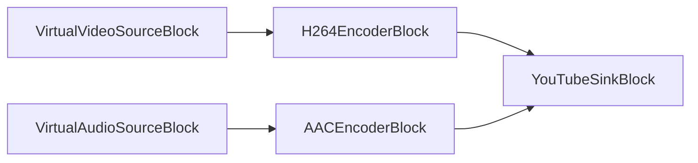

#### Código de ejemplo

```csharp
// Pipeline
var pipeline = new MediaBlocksPipeline();

// Fuentes de video y audio
var virtualVideoSource = new VirtualVideoSourceSettings
{
    Width = 1920,
    Height = 1080,
    FrameRate = VideoFrameRate.FPS_30,
};

var videoSource = new VirtualVideoSourceBlock(virtualVideoSource);

var virtualAudioSource = new VirtualAudioSourceSettings
{
     Channels = 2,
     SampleRate = 48000,
};

var audioSource = new VirtualAudioSourceBlock(virtualAudioSource);

// Codificadores H264/AAC
var h264Settings = new OpenH264EncoderSettings
{
    Bitrate = 4000, // 4 Mbps para 1080p
    KeyframeInterval = 2 // Keyframe cada 2 segundos
};
var h264Encoder = new H264EncoderBlock(h264Settings);

var aacSettings = new AACEncoderSettings
{
    Bitrate = 192 // 192 kbps para audio
};
var aacEncoder = new AACEncoderBlock(aacSettings);

pipeline.Connect(videoSource.Output, h264Encoder.Input);
pipeline.Connect(audioSource.Output, aacEncoder.Input);

// Sink de YouTube Live
var sink = new YouTubeSinkBlock(new YouTubeSinkSettings(
    "rtmp://a.rtmp.youtube.com/live2/",
    "tu_clave_de_stream_youtube"));
pipeline.Connect(h264Encoder.Output, sink.CreateNewInput(MediaBlockPadMediaType.Video));
pipeline.Connect(aacEncoder.Output, sink.CreateNewInput(MediaBlockPadMediaType.Audio));

// Iniciar
await pipeline.StartAsync();
```

#### Plataformas

Windows, macOS, Linux, iOS, Android.

### Shoutcast

`Shoutcast` es un servicio para transmitir medios sobre internet a reproductores de medios, usando su propio software propietario multiplataforma. Permite que contenido de audio digital, principalmente en formato MP3 o High-Efficiency Advanced Audio Coding (HE-AAC), sea transmitido. El uso más común de Shoutcast es para crear o escuchar transmisiones de audio de Internet.

Use la clase `ShoutcastSinkSettings` para establecer los parámetros.

#### Información del bloque

Nombre: ShoutcastSinkBlock.

| Dirección del pin | Tipo de medio | Cantidad de pines |
| ------------- | :----------------: | :--------: |
| Entrada audio | audio/mpeg | uno |
| | audio/aac | |
| | audio/x-aac | |

#### Pipeline de ejemplo

```mermaid
graph LR;
    subgraph PipelinePrincipal
        direction LR
        A[Fuente de Audio ej. UniversalSourceBlock o VirtualAudioSourceBlock] --> B{Codificador de Audio Opcional ej. MP3EncoderBlock};
        B --> C[ShoutcastSinkBlock];
    end
    subgraph AlternativaSiFuenteCodificada
         A2[Fuente de Audio Codificado] --> C2[ShoutcastSinkBlock];
    end
```

#### Código de ejemplo

```csharp
// Pipeline
var pipeline = new MediaBlocksPipeline();

// Fuente de audio (ej., de un archivo con MP3/AAC o audio crudo)
var universalSource = new UniversalSourceBlock(await UniversalSourceSettings.CreateAsync(new Uri("input.mp3")));
// O usar VirtualAudioSourceBlock para entrada de audio crudo en vivo:
// var audioSource = new VirtualAudioSourceBlock(new VirtualAudioSourceSettings { Channels = 2, SampleRate = 44100 });

// Opcional: Codificador de Audio (si la fuente es audio crudo o necesita re-codificación para Shoutcast)
// Ejemplo: MP3EncoderBlock si el servidor Shoutcast espera MP3
var mp3Encoder = new MP3EncoderBlock(new MP3EncoderSettings() { Bitrate = 128000 }); // Bitrate en bps
pipeline.Connect(universalSource.AudioOutput, mp3Encoder.Input);
// Si usa VirtualAudioSourceBlock: pipeline.Connect(audioSource.Output, mp3Encoder.Input);

// Sink Shoutcast
// Configurar los detalles de conexión al servidor Shoutcast/Icecast
var shoutcastSettings = new ShoutcastSinkSettings
{
    IP = "ip-servidor-shoutcast", // Nombre de host del servidor o dirección IP
    Port = 8000,                   // Puerto del servidor
    Mount = "/mountpoint",         // Punto de montaje (ej., "/stream", "/live.mp3")
    Password = "tu-contraseña",    // Contraseña de fuente para el servidor
    Protocol = ShoutProtocol.ICY,  // ShoutProtocol.ICY para Shoutcast v1/v2 (ej., icy://)
                                   // ShoutProtocol.HTTP para Icecast 2.x (ej., http://)
                                   // ShoutProtocol.XAudiocast para Shoutcast/XAudioCast más antiguos

    // Metadatos para el flujo
    StreamName = "Mi Radio Stream",
    Genre = "Varios",
    Description = "Mi increíble estación de radio por internet",
    URL = "https://mi-sitio-radio.com", // URL de página principal para tu flujo (aparece en metadatos del directorio)
    Public = true,                       // Establecer a true para listar en directorios públicos (si el servidor soporta)
    Username = "source"                  // Nombre de usuario para autenticación (frecuentemente "source"; verificar configuración del servidor)
    // Otros parámetros del flujo como bitrate de audio, samplerate, canales son típicamente determinados
    // por las propiedades del flujo de audio codificado de entrada alimentado al ShoutcastSinkBlock.
};
var shoutcastSink = new ShoutcastSinkBlock(shoutcastSettings);

// Conectar salida del codificador (o salida de audio de fuente si ya está codificada y es compatible) al sink Shoutcast
pipeline.Connect(mp3Encoder.Output, shoutcastSink.Input);
// Si la fuente ya está codificada y es compatible (ej. archivo MP3 a Shoutcast MP3): 
// pipeline.Connect(universalSource.AudioOutput, shoutcastSink.Input);

// Iniciar el pipeline
await pipeline.StartAsync();

// Para propósitos de visualización, puede construir una cadena representando la conexión:
string protocolScheme = shoutcastSettings.Protocol switch
{
    ShoutProtocol.ICY => "icy",
    ShoutProtocol.HTTP => "http",
    ShoutProtocol.XAudiocast => "xaudiocast", // Nota: el esquema real podría ser http para XAudiocast
    _ => "desconocido"
};
Console.WriteLine($"Transmitiendo al servidor Shoutcast: {protocolScheme}://{shoutcastSettings.IP}:{shoutcastSettings.Port}{shoutcastSettings.Mount}");
Console.WriteLine($"URL de metadatos del flujo (para directorios): {shoutcastSettings.URL}");
Console.WriteLine("Presione cualquier tecla para detener el flujo...");
Console.ReadKey();

// Detener el pipeline (importante para desconexión elegante y limpieza de recursos)
await pipeline.StopAsync();
```

#### Plataformas

Windows, macOS, Linux, iOS, Android.
