# Puits

[Media Blocks SDK .Net](https://www.visioforge.com/media-blocks-sdk-net){ .md-button .md-button--primary target="_blank" }

Les puits sont des blocs qui enregistrent ou diffusent les données. Ce sont les derniers blocs du pipeline.
Optionnellement, certains puits peuvent avoir des pins de sortie pour transmettre les données au bloc suivant dans le pipeline.

Le SDK fournit de nombreux puits différents pour différents usages.

**Puits fichier**

Les puits fichier suivants sont disponibles :

- [ASF](#asf)
- [AVI](#avi)
- [File](#raw-file)
- [MKV](#mkv)
- [MOV](#mov)
- [MP4](#mp4)
- [MPEG-PS](#mpeg-ps)
- [MPEG-TS](#mpeg-ts)
- [MXF](#mxf)
- [OGG](#ogg)
- [WAV](#wav)
- [WebM](#webm)

**Streaming réseau**

Les puits de streaming réseau suivants sont disponibles :

- [DASH](#dash)
- [Facebook Live](#facebook-live)
- [HLS](#hls)
- [MJPEG over HTTP](#mjpeg-over-http)
- [NDI](#ndi)
- [SRT](#srt)
- [SRT MPEG-TS](#srt-mpeg-ts)
- [RTMP](#rtmp)
- [Shoutcast](#shoutcast)
- [WHIP](#whip)
- [YouTube Live](#youtube-live)
- [RIST MPEG-TS](#rist-mpeg-ts)

**Puits utilitaires**

Les puits utilitaires suivants sont disponibles :

- [Stream Sink](#stream-sink)
- [File Descriptor Sink](#file-descriptor-sink)
- [KLV File Sink](#klv-file-sink)
- [Buffer Sink](#buffer-sink)
- [Virtual Camera Sink](#virtual-camera-sink)

## Puits fichier

### ASF

`ASF (Advanced Systems Format)` : un format de conteneur numérique de Microsoft utilisé pour stocker des données multimédias, conçu pour être indépendant de la plateforme et prendre en charge des types de médias évolutifs tels que l'audio et la vidéo.

Utilisez la classe `ASFSinkSettings` pour définir les paramètres.

#### Informations sur le bloc

Nom : ASFSinkBlock.

| Direction du pin | Type de média | Nombre de pins |
| --- | :---: | :---: |
| Audio en entrée | audio/x-raw | un ou plusieurs |
| | audio/mpeg | |
| | audio/x-ac3 | |
| | audio/x-alaw | |
| | audio/x-mulaw | |
| | audio/x-wma | |
| Vidéo en entrée | video/x-raw | un ou plusieurs |
| | image/jpeg | |
| | video/x-divx | |
| | video/x-msmpeg | |
| | video/mpeg | |
| | video/x-h263 | |
| | video/x-h264 | |
| | video/x-dv | |
| | video/x-huffyuv | |
| | video/x-wmv | |
| | video/x-jpc | |
| | video/x-vp8 | |
| | image/png | |

#### Exemple de pipeline

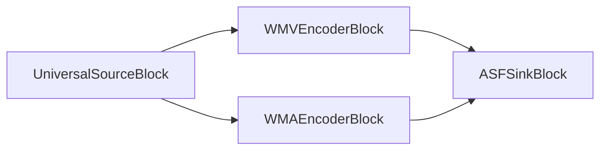

#### Exemple de code

```csharp
var pipeline = new MediaBlocksPipeline();

var filename = "test.mp4";
var fileSource = new UniversalSourceBlock(await UniversalSourceSettings.CreateAsync(filename));

var audioEncoderBlock = new WMAEncoderBlock(new WMAEncoderSettings());
pipeline.Connect(fileSource.AudioOutput, audioEncoderBlock.Input);

var videoEncoderBlock = new WMVEncoderBlock(new WMVEncoderSettings());
pipeline.Connect(fileSource.VideoOutput, videoEncoderBlock.Input);

var sinkBlock = new ASFSinkBlock(new ASFSinkSettings(@"output.wmv"));
pipeline.Connect(audioEncoderBlock.Output, sinkBlock.CreateNewInput(MediaBlockPadMediaType.Audio));
pipeline.Connect(videoEncoderBlock.Output, sinkBlock.CreateNewInput(MediaBlockPadMediaType.Video));

await pipeline.StartAsync();
```

#### Plateformes

Windows, macOS, Linux, iOS, Android.

### AVI

AVI (Audio Video Interleave) est un format de conteneur multimédia introduit par Microsoft. Il permet la lecture simultanée de l'audio et de la vidéo en alternant des segments de données audio et vidéo.

Utilisez la classe `AVISinkSettings` pour définir les paramètres.

#### Informations sur le bloc

Nom : AVISinkBlock.

| Direction du pin | Type de média | Nombre de pins |
| --- | :---: | :---: |
| Audio en entrée | audio/x-raw | un ou plusieurs |
| | audio/mpeg | |
| | audio/x-ac3 | |
| | audio/x-alaw | |
| | audio/x-mulaw | |
| Vidéo en entrée | video/x-raw | un ou plusieurs |
| | image/jpeg | |
| | video/x-divx | |
| | video/x-msmpeg | |
| | video/mpeg | |
| | video/x-h263 | |
| | video/x-h264 | |
| | video/x-dv | |
| | video/x-huffyuv | |
| | image/png | |

#### Exemple de pipeline

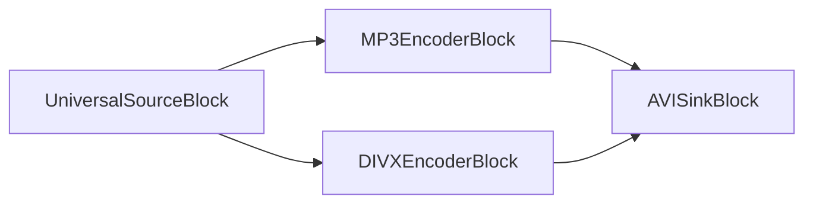

#### Exemple de code

```csharp
var pipeline = new MediaBlocksPipeline();

var filename = "test.mp4";
var fileSource = new UniversalSourceBlock(await UniversalSourceSettings.CreateAsync(filename));

var audioEncoderBlock = new MP3EncoderBlock(new MP3EncoderSettings() { Bitrate = 192 });
pipeline.Connect(fileSource.AudioOutput, audioEncoderBlock.Input);

var videoEncoderBlock = new DIVXEncoderBlock(new DIVXEncoderSettings());
pipeline.Connect(fileSource.VideoOutput, videoEncoderBlock.Input);

var sinkBlock = new AVISinkBlock(new AVISinkSettings(@"output.avi"));
pipeline.Connect(audioEncoderBlock.Output, sinkBlock.CreateNewInput(MediaBlockPadMediaType.Audio));
pipeline.Connect(videoEncoderBlock.Output, sinkBlock.CreateNewInput(MediaBlockPadMediaType.Video));

await pipeline.StartAsync();
```

#### Plateformes

Windows, macOS, Linux, iOS, Android.

### Fichier RAW { #raw-file }

Sortie universelle vers un fichier. Ce puits est utilisé à l'intérieur de tous les autres puits de plus haut niveau, par ex. MP4Sink. Il peut être utilisé pour écrire de la vidéo ou de l'audio RAW dans un fichier.

#### Informations sur le bloc

Nom : FileSinkBlock.

| Direction du pin | Type de média | Nombre de pins |
| --- | :---: | :---: |
| Entrée | Tout format de flux | 1 |

#### Exemple de pipeline


#### Exemple de code

```csharp
var pipeline = new MediaBlocksPipeline();

var filename = "test.mp3";
var fileSource = new UniversalSourceBlock(await UniversalSourceSettings.CreateAsync(filename));

var mp3EncoderBlock = new MP3EncoderBlock(new MP3EncoderSettings() { Bitrate = 192 });
pipeline.Connect(fileSource.AudioOutput, mp3EncoderBlock.Input);

var fileSinkBlock = new FileSinkBlock(@"output.mp3");
pipeline.Connect(mp3EncoderBlock.Output, fileSinkBlock.Input);

await pipeline.StartAsync();
```

#### Plateformes

Windows, macOS, Linux, iOS, Android.

### MKV

MKV (Matroska) est un format de conteneur libre et standard ouvert, similaire à MP4 et AVI mais offrant davantage de flexibilité et de fonctionnalités avancées.

Utilisez la classe `MKVSinkSettings` pour définir les paramètres.

#### Informations sur le bloc

Nom : MKVSinkBlock.

| Direction du pin | Type de média | Nombre de pins |
| --- | :---: | :---: |
| Audio en entrée | audio/x-raw | un ou plusieurs |
| | audio/mpeg | |
| | audio/x-ac3 | |
| | audio/x-alaw | |
| | audio/x-mulaw | |
| | audio/x-wma | |
| | audio/x-vorbis | |
| | audio/x-opus | |
| | audio/x-flac | |
| Vidéo en entrée | video/x-raw | un ou plusieurs |
| | image/jpeg | |
| | video/x-divx | |
| | video/x-msmpeg | |
| | video/mpeg | |
| | video/x-h263 | |
| | video/x-h264 | |
| | video/x-h265 | |
| | video/x-dv | |
| | video/x-huffyuv | |
| | video/x-wmv | |
| | video/x-jpc | |
| | video/x-vp8 | |
| | video/x-vp9 | |
| | video/x-theora | |
| | image/png | |

#### Exemple de pipeline

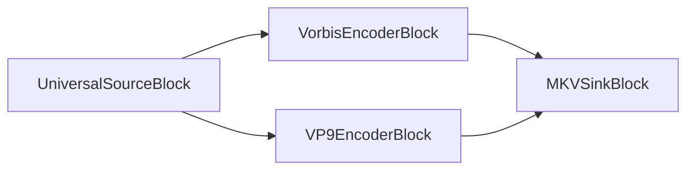

#### Exemple de code

```csharp
var pipeline = new MediaBlocksPipeline();

var filename = "test.mp4";
var fileSource = new UniversalSourceBlock(await UniversalSourceSettings.CreateAsync(filename));

var audioEncoderBlock = new VorbisEncoderBlock(new VorbisEncoderSettings() { Bitrate = 192 });
pipeline.Connect(fileSource.AudioOutput, audioEncoderBlock.Input);

var videoEncoderBlock = new VP9EncoderBlock(new VP9EncoderSettings() { Bitrate = 2000 });
pipeline.Connect(fileSource.VideoOutput, videoEncoderBlock.Input);

var sinkBlock = new MKVSinkBlock(new MKVSinkSettings(@"output.mkv"));
pipeline.Connect(audioEncoderBlock.Output, sinkBlock.CreateNewInput(MediaBlockPadMediaType.Audio));
pipeline.Connect(videoEncoderBlock.Output, sinkBlock.CreateNewInput(MediaBlockPadMediaType.Video));

await pipeline.StartAsync();
```

#### Plateformes

Windows, macOS, Linux, iOS, Android.

### MOV

MOV (QuickTime File Format) est un format de conteneur multimédia développé par Apple pour stocker de la vidéo, de l'audio et d'autres médias temporels. Il prend en charge divers codecs et est largement utilisé pour le contenu multimédia sur les plateformes Apple, ainsi qu'en édition vidéo professionnelle.

Utilisez la classe `MOVSinkSettings` pour définir les paramètres.

#### Informations sur le bloc

Nom : MOVSinkBlock.

| Direction du pin | Type de média | Nombre de pins |
| --- | :---: | :---: |
| Audio en entrée | audio/x-raw | un ou plusieurs |
| | audio/mpeg | |
| | audio/x-ac3 | |
| | audio/x-alaw | |
| | audio/x-mulaw | |
| | audio/AAC | |
| Vidéo en entrée | video/x-raw | un ou plusieurs |
| | image/jpeg | |
| | video/x-divx | |
| | video/x-msmpeg | |
| | video/mpeg | |
| | video/x-h263 | |
| | video/x-h264 | |
| | video/x-h265 | |
| | video/x-dv | |
| | video/x-huffyuv | |
| | image/png | |

#### Exemple de pipeline

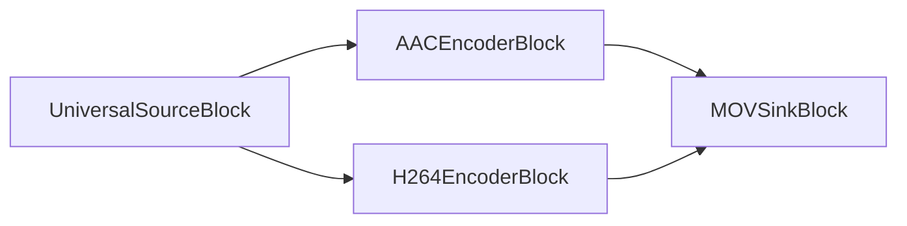

#### Exemple de code

```csharp
var pipeline = new MediaBlocksPipeline();

var filename = "test.mp4";
var fileSource = new UniversalSourceBlock(await UniversalSourceSettings.CreateAsync(filename));

var audioEncoderBlock = new AACEncoderBlock(new AACEncoderSettings() { Bitrate = 192 });
pipeline.Connect(fileSource.AudioOutput, audioEncoderBlock.Input);

var videoEncoderBlock = new H264EncoderBlock(new OpenH264EncoderSettings());
pipeline.Connect(fileSource.VideoOutput, videoEncoderBlock.Input);

var sinkBlock = new MOVSinkBlock(new MOVSinkSettings(@"output.mov"));
pipeline.Connect(audioEncoderBlock.Output, sinkBlock.CreateNewInput(MediaBlockPadMediaType.Audio));
pipeline.Connect(videoEncoderBlock.Output, sinkBlock.CreateNewInput(MediaBlockPadMediaType.Video));

await pipeline.StartAsync();
```

#### Plateformes

Windows, macOS, Linux, iOS, Android.

### MP4

MP4 (MPEG-4 Part 14) est un format de conteneur multimédia numérique utilisé pour stocker de la vidéo, de l'audio et d'autres données telles que des sous-titres et des images. Il est largement utilisé pour le partage de contenu vidéo en ligne et est compatible avec une large gamme d'appareils et de plateformes.

Utilisez la classe `MP4SinkSettings` pour définir les paramètres.

#### Informations sur le bloc

Nom : MP4SinkBlock.

| Direction du pin | Type de média | Nombre de pins |
| --- | :---: | :---: |
| Audio en entrée | audio/x-raw | un ou plusieurs |
| | audio/mpeg | |
| | audio/x-ac3 | |
| | audio/x-alaw | |
| | audio/x-mulaw | |
| | audio/AAC | |
| Vidéo en entrée | video/x-raw | un ou plusieurs |
| | image/jpeg | |
| | video/x-divx | |
| | video/x-msmpeg | |
| | video/mpeg | |
| | video/x-h263 | |
| | video/x-h264 | |
| | video/x-h265 | |
| | video/x-dv | |
| | video/x-huffyuv | |
| | image/png | |

#### Exemple de pipeline

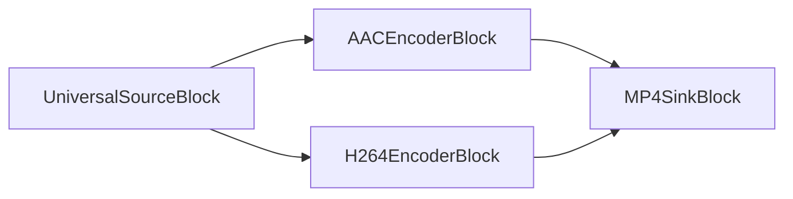

#### Exemple de code

```csharp
var pipeline = new MediaBlocksPipeline();

var filename = "test.mp4";
var fileSource = new UniversalSourceBlock(await UniversalSourceSettings.CreateAsync(filename));

var audioEncoderBlock = new AACEncoderBlock(new AACEncoderSettings() { Bitrate = 192 });
pipeline.Connect(fileSource.AudioOutput, audioEncoderBlock.Input);

var videoEncoderBlock = new H264EncoderBlock(new OpenH264EncoderSettings());
pipeline.Connect(fileSource.VideoOutput, videoEncoderBlock.Input);

var sinkBlock = new MP4SinkBlock(new MP4SinkSettings(@"output.mp4"));
pipeline.Connect(audioEncoderBlock.Output, sinkBlock.CreateNewInput(MediaBlockPadMediaType.Audio));
pipeline.Connect(videoEncoderBlock.Output, sinkBlock.CreateNewInput(MediaBlockPadMediaType.Video));

await pipeline.StartAsync();
```

#### Plateformes

Windows, macOS, Linux, iOS, Android.

### MPEG-PS

MPEG-PS (MPEG Program Stream) est un format de conteneur permettant le multiplexage d'audio, de vidéo et d'autres données numériques. Il est conçu pour des supports raisonnablement fiables, tels que les DVD, CD-ROM et autres supports disques.

Construisez via `new MPEGPSSinkBlock(string filename)` — le bloc est livré avec un seul constructeur n'acceptant qu'un nom de fichier ; il n'y a pas de classe de paramètres séparée.

#### Informations sur le bloc

Nom : MPEGPSSinkBlock.

| Direction du pin | Type de média | Nombre de pins |
| --- | :---: | :---: |
| Audio en entrée | audio/x-raw | un ou plusieurs |
| | audio/mpeg | |
| | audio/x-ac3 | |
| | audio/x-alaw | |
| | audio/x-mulaw | |
| Vidéo en entrée | video/x-raw | un ou plusieurs |
| | image/jpeg | |
| | video/x-msmpeg | |
| | video/mpeg | |
| | video/x-h263 | |
| | video/x-h264 | |

#### Exemple de pipeline

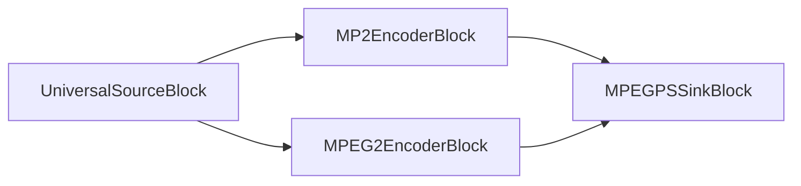

#### Exemple de code

```csharp
var pipeline = new MediaBlocksPipeline();

var filename = "test.mp4";
var fileSource = new UniversalSourceBlock(await UniversalSourceSettings.CreateAsync(filename));

var audioEncoderBlock = new MP2EncoderBlock(new MP2EncoderSettings() { Bitrate = 192 });
pipeline.Connect(fileSource.AudioOutput, audioEncoderBlock.Input);

var videoEncoderBlock = new MPEG2EncoderBlock(new MPEG2VideoEncoderSettings());
pipeline.Connect(fileSource.VideoOutput, videoEncoderBlock.Input);

var sinkBlock = new MPEGPSSinkBlock(@"output.mpg");
pipeline.Connect(audioEncoderBlock.Output, sinkBlock.CreateNewInput(MediaBlockPadMediaType.Audio));
pipeline.Connect(videoEncoderBlock.Output, sinkBlock.CreateNewInput(MediaBlockPadMediaType.Video));

await pipeline.StartAsync();
```

#### Plateformes

Windows, macOS, Linux, iOS, Android.

### MPEG-TS

MPEG-TS (MPEG Transport Stream) est un format de conteneur numérique standard pour la transmission et le stockage de données audio, vidéo et PSIP (Program and System Information Protocol). Il est utilisé dans les systèmes de diffusion tels que DVB, ATSC et IPTV.

Utilisez la classe `MPEGTSSinkSettings` pour définir les paramètres.

#### Informations sur le bloc

Nom : MPEGTSSinkBlock.

| Direction du pin | Type de média | Nombre de pins |
| --- | :---: | :---: |
| Audio en entrée | audio/x-raw | un ou plusieurs |
| | audio/mpeg | |
| | audio/x-ac3 | |
| | audio/x-alaw | |
| | audio/x-mulaw | |
| | audio/AAC | |
| Vidéo en entrée | video/x-raw | un ou plusieurs |
| | image/jpeg | |
| | video/x-msmpeg | |
| | video/mpeg | |
| | video/x-h263 | |
| | video/x-h264 | |
| | video/x-h265 | |

#### Exemple de pipeline

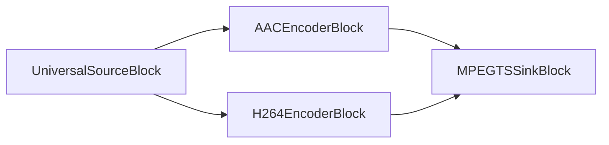

#### Exemple de code

```csharp
var pipeline = new MediaBlocksPipeline();

var filename = "test.mp4";
var fileSource = new UniversalSourceBlock(await UniversalSourceSettings.CreateAsync(filename));

var audioEncoderBlock = new AACEncoderBlock(new AACEncoderSettings() { Bitrate = 192 });
pipeline.Connect(fileSource.AudioOutput, audioEncoderBlock.Input);

var videoEncoderBlock = new H264EncoderBlock(new OpenH264EncoderSettings());
pipeline.Connect(fileSource.VideoOutput, videoEncoderBlock.Input);

var sinkBlock = new MPEGTSSinkBlock(new MPEGTSSinkSettings(@"output.ts"));
pipeline.Connect(audioEncoderBlock.Output, sinkBlock.CreateNewInput(MediaBlockPadMediaType.Audio));
pipeline.Connect(videoEncoderBlock.Output, sinkBlock.CreateNewInput(MediaBlockPadMediaType.Video));

await pipeline.StartAsync();
```

#### Plateformes

Windows, macOS, Linux, iOS, Android.

### MXF

MXF (Material Exchange Format) est un format de conteneur pour les médias vidéo et audio numériques professionnels, développé pour résoudre des problèmes tels que l'échange de fichiers et l'interopérabilité, et pour améliorer les flux de production entre maisons de production et fournisseurs de contenu/équipement.

Utilisez la classe `MXFSinkSettings` pour définir les paramètres.

#### Informations sur le bloc

Nom : MXFSinkBlock.

| Direction du pin | Type de média | Nombre de pins |
| --- | :---: | :---: |
| Audio en entrée | audio/x-raw | un ou plusieurs |
| | audio/mpeg | |
| | audio/x-ac3 | |
| | audio/x-alaw | |
| | audio/x-mulaw | |
| | audio/AAC | |
| Vidéo en entrée | video/x-raw | un ou plusieurs |
| | image/jpeg | |
| | video/x-divx | |
| | video/x-msmpeg | |
| | video/mpeg | |
| | video/x-h263 | |
| | video/x-h264 | |
| | video/x-h265 | |
| | video/x-dv | |
| | image/png | |

#### Exemple de pipeline

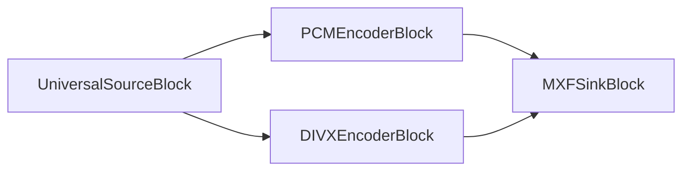

#### Exemple de code

```csharp
var pipeline = new MediaBlocksPipeline();

var filename = "test.mp4";
var fileSource = new UniversalSourceBlock(await UniversalSourceSettings.CreateAsync(filename));

var audioBlock = new PCMEncoderBlock(new PCMEncoderSettings());
pipeline.Connect(fileSource.AudioOutput, audioBlock.Input);

var videoEncoderBlock = new DIVXEncoderBlock(new DIVXEncoderSettings());
pipeline.Connect(fileSource.VideoOutput, videoEncoderBlock.Input);

var sinkBlock = new MXFSinkBlock(new MXFSinkSettings(@"output.mxf"));
pipeline.Connect(audioBlock.Output, sinkBlock.CreateNewInput(MediaBlockPadMediaType.Audio));
pipeline.Connect(videoEncoderBlock.Output, sinkBlock.CreateNewInput(MediaBlockPadMediaType.Video));

await pipeline.StartAsync();
```

#### Plateformes

Windows, macOS, Linux, iOS, Android.

### OGG

OGG est un format de conteneur libre et ouvert conçu pour le streaming et la manipulation efficaces de contenu multimédia numérique de haute qualité. Il est développé par la Xiph.Org Foundation et prend en charge des codecs audio comme Vorbis, Opus et FLAC, ainsi que des codecs vidéo comme Theora.

Utilisez la classe `OGGSinkSettings` pour définir les paramètres.

#### Informations sur le bloc

Nom : OGGSinkBlock.

| Direction du pin | Type de média | Nombre de pins |
| --- | :---: | :---: |
| Audio en entrée | audio/x-raw | un ou plusieurs |
| | audio/x-vorbis | |
| | audio/x-flac | |
| | audio/x-speex | |
| | audio/x-celt | |
| | audio/x-opus | |
| Vidéo en entrée | video/x-raw | un ou plusieurs |
| | video/x-theora | |
| | video/x-dirac | |

#### Exemple de pipeline

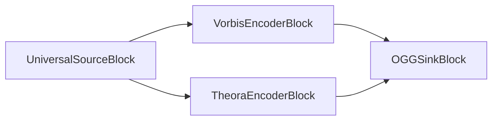

#### Exemple de code

```csharp
var pipeline = new MediaBlocksPipeline();

var filename = "test.mp4";
var fileSource = new UniversalSourceBlock(await UniversalSourceSettings.CreateAsync(filename));

var audioEncoderBlock = new VorbisEncoderBlock(new VorbisEncoderSettings() { Bitrate = 192 });
pipeline.Connect(fileSource.AudioOutput, audioEncoderBlock.Input);

var videoEncoderBlock = new TheoraEncoderBlock(new TheoraEncoderSettings());
pipeline.Connect(fileSource.VideoOutput, videoEncoderBlock.Input);

var sinkBlock = new OGGSinkBlock(new OGGSinkSettings(@"output.ogg"));
pipeline.Connect(audioEncoderBlock.Output, sinkBlock.CreateNewInput(MediaBlockPadMediaType.Audio));
pipeline.Connect(videoEncoderBlock.Output, sinkBlock.CreateNewInput(MediaBlockPadMediaType.Video));

await pipeline.StartAsync();
```

#### Plateformes

Windows, macOS, Linux, iOS, Android.

### WAV

WAV (Waveform Audio File Format) est un standard de format de fichier audio développé par IBM et Microsoft pour stocker des flux audio sur PC. C'est le format principal utilisé sur les systèmes Windows pour l'audio brut et typiquement non compressé.

Le puits est configuré via son argument de nom de fichier — il n'y a pas de classe `WAVSinkSettings` séparée ; le format des échantillons provient des paramètres du `PCMEncoderBlock` en amont.

#### Informations sur le bloc

Nom : WAVSinkBlock.

| Direction du pin | Type de média | Nombre de pins |
| --- | :---: | :---: |
| Audio en entrée | audio/x-raw | un |
| | audio/x-alaw | |
| | audio/x-mulaw | |

#### Exemple de pipeline


### Exemple de code

```csharp
var pipeline = new MediaBlocksPipeline();

var filename = "test.mp3";
var fileSource = new UniversalSourceBlock(await UniversalSourceSettings.CreateAsync(filename));

var audioBlock = new PCMEncoderBlock(new PCMEncoderSettings());
pipeline.Connect(fileSource.AudioOutput, audioBlock.Input);

var sinkBlock = new WAVSinkBlock(@"output.wav");
pipeline.Connect(audioBlock.Output, sinkBlock.Input);

await pipeline.StartAsync();
```

#### Plateformes

Windows, macOS, Linux, iOS, Android.

### WebM

WebM est un format de fichier multimédia ouvert, libre de droits, conçu pour le web. WebM définit la structure du conteneur ainsi que les formats vidéo et audio. Les fichiers WebM se composent de flux vidéo compressés avec les codecs vidéo VP8 ou VP9 et de flux audio compressés avec les codecs audio Vorbis ou Opus.

Utilisez la classe `WebMSinkSettings` pour définir les paramètres.

#### Informations sur le bloc

Nom : WebMSinkBlock.

| Direction du pin | Type de média | Nombre de pins |
| --- | :---: | :---: |
| Audio en entrée | audio/x-raw | un ou plusieurs |
| | audio/x-vorbis | |
| | audio/x-opus | |
| Vidéo en entrée | video/x-raw | un ou plusieurs |
| | video/x-vp8 | |
| | video/x-vp9 | |

#### Exemple de pipeline

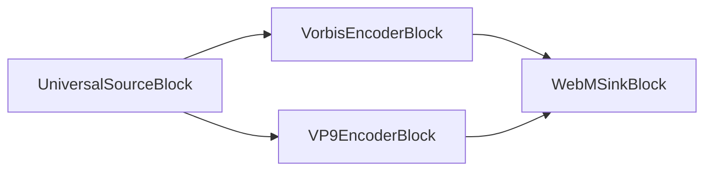

#### Exemple de code

```csharp
var pipeline = new MediaBlocksPipeline();

var filename = "test.mp4";
var fileSource = new UniversalSourceBlock(await UniversalSourceSettings.CreateAsync(filename));

var audioEncoderBlock = new VorbisEncoderBlock(new VorbisEncoderSettings() { Bitrate = 192 });
pipeline.Connect(fileSource.AudioOutput, audioEncoderBlock.Input);

var videoEncoderBlock = new VP9EncoderBlock(new VP9EncoderSettings());
pipeline.Connect(fileSource.VideoOutput, videoEncoderBlock.Input);

var sinkBlock = new WebMSinkBlock(new WebMSinkSettings(@"output.webm"));
pipeline.Connect(audioEncoderBlock.Output, sinkBlock.CreateNewInput(MediaBlockPadMediaType.Audio));
pipeline.Connect(videoEncoderBlock.Output, sinkBlock.CreateNewInput(MediaBlockPadMediaType.Video));

await pipeline.StartAsync();
```

#### Plateformes

Windows, macOS, Linux, iOS, Android.

## Puits de streaming réseau

### RTMP

`RTMP (Real-Time Messaging Protocol)` : développé par Adobe, RTMP est un protocole utilisé pour diffuser de l'audio, de la vidéo et des données sur Internet, optimisé pour une transmission à hautes performances. Il permet une communication efficace à faible latence, couramment utilisée en diffusion en direct comme les événements sportifs et les concerts.

Utilisez la classe `RTMPSinkSettings` pour définir les paramètres.

#### Informations sur le bloc

Nom : RTMPSinkBlock.

| Direction du pin |  Type de média  | Nombre de pins  |
| --- |:------------:|:-----------:|
| Audio en entrée | audio/mpeg [1,2,4]   |     un     |
| | audio/x-adpcm  |
| | PCM [U8, S16LE] |        |
| | audio/x-speex  |        |
| | audio/x-mulaw  |        |
| | audio/x-alaw  |        |
| | audio/x-nellymoser  |        |
| Vidéo en entrée | video/x-h264   |     un     |

#### Exemple de pipeline

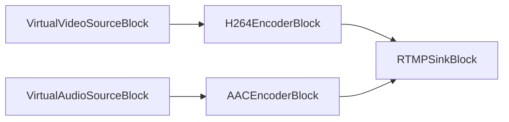

#### Exemple de code

```csharp
// Pipeline
var pipeline = new MediaBlocksPipeline();

// sources vidéo et audio
var virtualVideoSource = new VirtualVideoSourceSettings
{
    Width = 1280,
    Height = 720,
    FrameRate = VideoFrameRate.FPS_25,
};

var videoSource = new VirtualVideoSourceBlock(virtualVideoSource);

var virtualAudioSource = new VirtualAudioSourceSettings
{
     Channels = 2,
     SampleRate = 44100,
};

var audioSource = new VirtualAudioSourceBlock(virtualAudioSource);

// encodeurs H264/AAC
var h264Encoder = new H264EncoderBlock(new OpenH264EncoderSettings());
var aacEncoder = new AACEncoderBlock();

pipeline.Connect(videoSource.Output, h264Encoder.Input);
pipeline.Connect(audioSource.Output, aacEncoder.Input);

// puits RTMP
var sink = new RTMPSinkBlock(new RTMPSinkSettings());
pipeline.Connect(h264Encoder.Output, sink.CreateNewInput(MediaBlockPadMediaType.Video));
pipeline.Connect(aacEncoder.Output, sink.CreateNewInput(MediaBlockPadMediaType.Audio));

// Démarrer
await pipeline.StartAsync();
```

#### Plateformes

Windows, macOS, Linux, iOS, Android.

### Facebook Live

Facebook Live est une fonctionnalité qui permet la diffusion vidéo en direct sur Facebook. Le direct peut être publié sur des profils personnels, des pages ou des groupes.

Utilisez la classe `FacebookLiveSinkSettings` pour définir les paramètres.

#### Informations sur le bloc

Nom : FacebookLiveSinkBlock.

| Direction du pin |  Type de média  | Nombre de pins  |
| --- |:------------:|:-----------:|
| Audio en entrée | audio/mpeg [1,2,4]   |     un     |
| | audio/x-adpcm  |
| | PCM [U8, S16LE] |        |
| | audio/x-speex  |        |
| | audio/x-mulaw  |        |
| | audio/x-alaw  |        |
| | audio/x-nellymoser  |        |
| Vidéo en entrée | video/x-h264   |     un     |

#### Exemple de pipeline

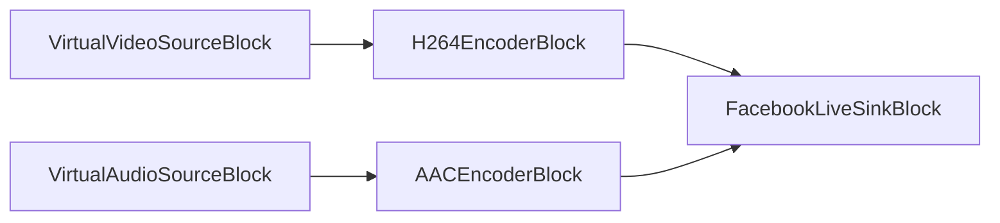

#### Exemple de code

```csharp
// Pipeline
var pipeline = new MediaBlocksPipeline();

// sources vidéo et audio
var virtualVideoSource = new VirtualVideoSourceSettings
{
    Width = 1280,
    Height = 720,
    FrameRate = VideoFrameRate.FPS_25,
};

var videoSource = new VirtualVideoSourceBlock(virtualVideoSource);

var virtualAudioSource = new VirtualAudioSourceSettings
{
     Channels = 2,
     SampleRate = 44100,
};

var audioSource = new VirtualAudioSourceBlock(virtualAudioSource);

// encodeurs H264/AAC
var h264Encoder = new H264EncoderBlock(new OpenH264EncoderSettings());
var aacEncoder = new AACEncoderBlock();

pipeline.Connect(videoSource.Output, h264Encoder.Input);
pipeline.Connect(audioSource.Output, aacEncoder.Input);

// puits Facebook Live — FacebookLiveSinkSettings n'accepte que la CLÉ de flux.
var sink = new FacebookLiveSinkBlock(new FacebookLiveSinkSettings("your_stream_key"));
pipeline.Connect(h264Encoder.Output, sink.CreateNewInput(MediaBlockPadMediaType.Video));
pipeline.Connect(aacEncoder.Output, sink.CreateNewInput(MediaBlockPadMediaType.Audio));

// Démarrer
await pipeline.StartAsync();
```

#### Plateformes

Windows, macOS, Linux, iOS, Android.

### HLS

HLS (HTTP Live Streaming) est un protocole de communication de streaming adaptatif basé sur HTTP développé par Apple. Il permet le streaming à débit adaptatif en découpant le flux en une séquence de petits segments de fichiers basés sur HTTP.

Le puits HLS prend en charge plusieurs implémentations :
- **hlssink3** (recommandé) : implémentation la plus récente avec des segments MPEG-TS et des fonctionnalités avancées
- **hlsmultivariantsink** : streaming adaptatif multi-débit avec génération automatique de la playlist principale
- **hlscmafsink** : segments CMAF/fMP4 pour une meilleure compatibilité avec les lecteurs modernes
- **hlssink2** (hérité) : implémentation d'origine avec des segments MPEG-TS

Utilisez la classe `HLSSinkSettings` pour configurer les paramètres. Par défaut, le puits sélectionne automatiquement la meilleure implémentation disponible.

#### Informations sur le bloc

Nom : HLSSinkBlock.

| Direction du pin | Type de média | Nombre de pins |
| --- | :---: | :---: |
| Audio en entrée | audio/mpeg | un ou plusieurs |
| | audio/x-ac3 | |
| | audio/x-alaw | |
| | audio/x-mulaw | |
| | audio/AAC | |
| Vidéo en entrée | video/x-raw | un ou plusieurs |
| | image/jpeg | |
| | video/x-msmpeg | |
| | video/mpeg | |
| | video/x-h263 | |
| | video/x-h264 | |
| | video/x-h265 | |

#### Exemple de pipeline

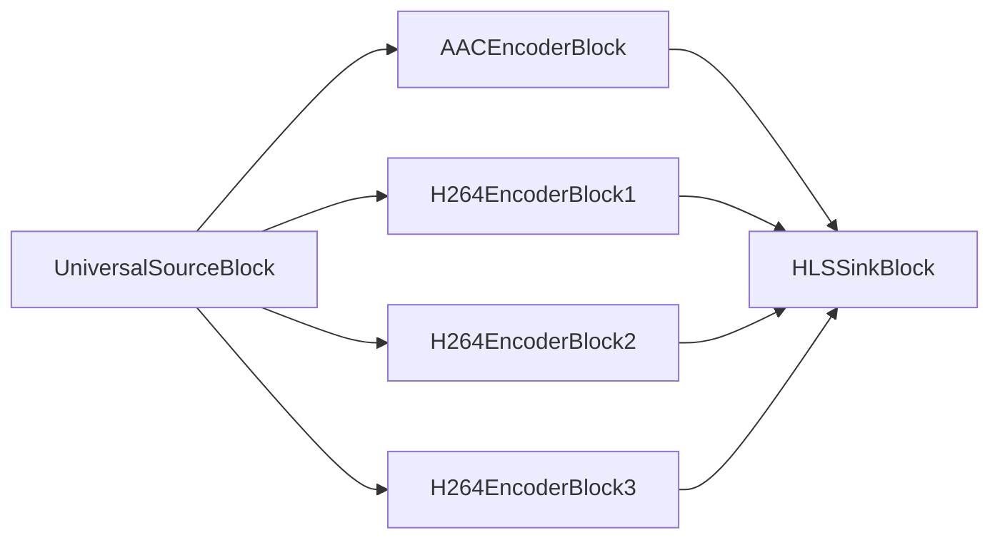

#### Exemple de code

##### Streaming HLS de base (mode Auto)

```csharp
var pipeline = new MediaBlocksPipeline();

var filename = "test.mp4";
var fileSource = new UniversalSourceBlock(await UniversalSourceSettings.CreateAsync(filename));

var audioEncoderBlock = new AACEncoderBlock(new AACEncoderSettings() { Bitrate = 192 });
pipeline.Connect(fileSource.AudioOutput, audioEncoderBlock.Input);

// 3 encodeurs vidéo avec des débits différents pour le streaming adaptatif
var videoEncoderBlock1 = new H264EncoderBlock(new OpenH264EncoderSettings { Bitrate = 3000, Width = 1920, Height = 1080 });
var videoEncoderBlock2 = new H264EncoderBlock(new OpenH264EncoderSettings { Bitrate = 1500, Width = 1280, Height = 720 });
var videoEncoderBlock3 = new H264EncoderBlock(new OpenH264EncoderSettings { Bitrate = 800, Width = 854, Height = 480 });

pipeline.Connect(fileSource.VideoOutput, videoEncoderBlock1.Input);
pipeline.Connect(fileSource.VideoOutput, videoEncoderBlock2.Input);
pipeline.Connect(fileSource.VideoOutput, videoEncoderBlock3.Input);

// Configurer le puits HLS avec sélection automatique (préfère hlssink3)
var hlsSettings = new HLSSinkSettings()
{
    Location = @"c:\inetpub\wwwroot\hls\segment_%05d.ts",
    PlaylistLocation = @"c:\inetpub\wwwroot\hls\playlist.m3u8",
    PlaylistRoot = "http://localhost/hls/",
    TargetDuration = TimeSpan.FromSeconds(6),
    PlaylistLength = 5,
    MaxFiles = 10,
    PlaylistType = HLSPlaylistType.Event,
    Custom_HTTP_Server_Enabled = true,
    Custom_HTTP_Server_Port = 8080
};

var sinkBlock = new HLSSinkBlock(hlsSettings);

// Connecter l'audio
pipeline.Connect(audioEncoderBlock.Output, sinkBlock.CreateNewInput(MediaBlockPadMediaType.Audio));

// Connecter les variantes vidéo
pipeline.Connect(videoEncoderBlock1.Output, sinkBlock.CreateNewInput(MediaBlockPadMediaType.Video));
pipeline.Connect(videoEncoderBlock2.Output, sinkBlock.CreateNewInput(MediaBlockPadMediaType.Video));
pipeline.Connect(videoEncoderBlock3.Output, sinkBlock.CreateNewInput(MediaBlockPadMediaType.Video));

await pipeline.StartAsync();
```

##### Streaming CMAF/fMP4 (pour une meilleure compatibilité)

```csharp
// Configurer le puits HLS avec des segments CMAF/fMP4
var hlsSettings = new HLSSinkSettings()
{
    SinkType = HLSSinkType.HlsCmafSink,
    Location = @"c:\inetpub\wwwroot\hls\segment_%05d.m4s",
    InitLocation = @"c:\inetpub\wwwroot\hls\init_%03d.mp4",
    PlaylistLocation = @"c:\inetpub\wwwroot\hls\playlist.m3u8",
    TargetDuration = TimeSpan.FromSeconds(6),
    PlaylistType = HLSPlaylistType.Event,
    EnableProgramDateTime = true,
    Sync = true  // Requis pour le streaming en direct avec CMAF
};

var sinkBlock = new HLSSinkBlock(hlsSettings);
// Connecter les flux comme dans l'exemple de base
```

##### Streaming VOD (vidéo à la demande)

```csharp
// Configurer le puits HLS pour la VOD
var hlsSettings = new HLSSinkSettings()
{
    SinkType = HLSSinkType.HlsSink3,
    Location = @"c:\videos\hls\segment_%05d.ts",
    PlaylistLocation = @"c:\videos\hls\playlist.m3u8",
    TargetDuration = TimeSpan.FromSeconds(10),
    PlaylistType = HLSPlaylistType.Vod,  // mode VOD
    EnableEndlist = true,  // Ajoute la balise #EXT-X-ENDLIST
    PlaylistLength = 0  // Conserver tous les segments pour la VOD
};

var sinkBlock = new HLSSinkBlock(hlsSettings);
// Connecter les flux comme dans l'exemple de base
```

##### Streaming adaptatif multi-variantes (playlist principale)

```csharp
// Configurer le puits HLS avec la prise en charge multi-variantes pour un véritable streaming à débit adaptatif
var hlsSettings = new HLSSinkSettings()
{
    SinkType = HLSSinkType.HlsMultivariantSink,
    PlaylistLocation = @"c:\inetpub\wwwroot\hls\master.m3u8",
    TargetDuration = TimeSpan.FromSeconds(6)
};

var sinkBlock = new HLSSinkBlock(hlsSettings);

// Connecter plusieurs variantes vidéo de qualités différentes
// hlsmultivariantsink crée automatiquement les playlists de variantes et la playlist principale
pipeline.Connect(videoEncoderBlock1.Output, sinkBlock.CreateNewInput(MediaBlockPadMediaType.Video));
pipeline.Connect(videoEncoderBlock2.Output, sinkBlock.CreateNewInput(MediaBlockPadMediaType.Video));
pipeline.Connect(videoEncoderBlock3.Output, sinkBlock.CreateNewInput(MediaBlockPadMediaType.Video));
pipeline.Connect(audioEncoderBlock.Output, sinkBlock.CreateNewInput(MediaBlockPadMediaType.Audio));
```

#### Fonctionnalités du puits HLS

##### Types de puits

- **Auto** (par défaut) : sélectionne automatiquement la meilleure implémentation disponible (préfère hlssink3 → hlsmultivariantsink → hlscmafsink → hlssink2)
- **HlsSink3** : implémentation la plus récente avec des segments MPEG-TS, prend en charge les types de playlist, la date et heure du programme, et des fonctionnalités améliorées
- **HlsMultivariantSink** : streaming adaptatif multi-débit avec génération automatique de la playlist principale pour plusieurs variantes de qualité
- **HlsCmafSink** : segments CMAF/fMP4 pour une meilleure compatibilité avec les navigateurs et lecteurs modernes
- **HlsSink2** : implémentation héritée pour la rétrocompatibilité

##### Types de playlist

- **Unspecified** : streaming en direct sans balise de type de playlist explicite
- **Event** : playlist de type événement où les segments ne sont pas supprimés. #EXT-X-ENDLIST est ajoutée à la fin
- **Vod** : playlist vidéo à la demande. Se comporte comme Event mais définit #EXT-X-PLAYLIST-TYPE:VOD à la fin

##### Paramètres clés

| Propriété | Description | Puits pris en charge |
|----------|-------------|--------------|
| `SinkType` | Choisir l'implémentation du puits (Auto, HlsSink2, HlsSink3, HlsCmafSink, HlsMultivariantSink) | Tous |
| `Location` | Modèle de fichier de segment (par ex., segment_%05d.ts ou .m4s) | Tous sauf HlsMultivariantSink |
| `InitLocation` | Modèle de segment d'initialisation pour CMAF (par ex., init_%03d.mp4) | HlsCmafSink |
| `PlaylistLocation` | Chemin du fichier de playlist en sortie (.m3u8, master.m3u8 pour multivariant) | Tous |
| `PlaylistRoot` | URL de base pour les segments dans la playlist | Tous sauf HlsMultivariantSink |
| `TargetDuration` | Durée cible d'un segment (TimeSpan) | Tous |
| `PlaylistLength` | Nombre de segments dans la playlist (0 = illimité) | Tous sauf HlsMultivariantSink |
| `MaxFiles` | Nombre maximum de fichiers à conserver sur le disque | Tous sauf HlsMultivariantSink |
| `PlaylistType` | Type de playlist (Unspecified, Event, Vod) | HlsSink3, HlsCmafSink |
| `EnableProgramDateTime` | Ajouter les balises #EXT-X-PROGRAM-DATE-TIME | HlsSink3, HlsCmafSink |
| `EnableEndlist` | Ajouter #EXT-X-ENDLIST à la fin | HlsSink3, HlsCmafSink |
| `IFramesOnly` | Créer une playlist composée uniquement d'images I | HlsSink3 |
| `Sync` | Synchroniser avec l'horloge (requis pour le CMAF en direct) | HlsCmafSink |
| `Latency` | Latence (TimeSpan) | HlsCmafSink |
| `SendKeyframeRequests` | Demander des images clés à l'encodeur | HlsSink2, HlsSink3 |

#### Plateformes

Windows, macOS, Linux, iOS, Android.

### MJPEG over HTTP

HTTP MJPEG (Motion JPEG) Live est un format de streaming vidéo où chaque image vidéo est compressée séparément sous forme d'image JPEG et transmise sur HTTP. Il est largement utilisé dans les caméras IP et les webcams en raison de sa simplicité, bien qu'il soit moins efficace que les codecs modernes.

Construisez via `new HTTPMJPEGLiveSinkBlock(int port)` — le bloc est livré avec un constructeur n'acceptant qu'un port ; le chemin de l'URL est fixe (`http://<host>:<port>/`). Il n'y a pas de classe de paramètres séparée.

#### Informations sur le bloc

Nom : HTTPMJPEGLiveSinkBlock.

| Direction du pin | Type de média | Nombre de pins |
| --- | :---: | :---: |
| Vidéo en entrée | video/x-raw | un |
| | image/jpeg | |

#### Exemple de pipeline


#### Exemple de code

```csharp
var pipeline = new MediaBlocksPipeline();

// Créer une source vidéo virtuelle
var virtualVideoSource = new VirtualVideoSourceSettings
{
    Width = 1280,
    Height = 720,
    FrameRate = VideoFrameRate.FPS_30,
};

var videoSource = new VirtualVideoSourceBlock(virtualVideoSource);

// Encodeur MJPEG
var mjpegEncoder = new MJPEGEncoderBlock(new MJPEGEncoderSettings { Quality = 80 });
pipeline.Connect(videoSource.Output, mjpegEncoder.Input);

// Serveur HTTP MJPEG (port uniquement — écoute sur http://<host>:8080/)
var sink = new HTTPMJPEGLiveSinkBlock(8080);
pipeline.Connect(mjpegEncoder.Output, sink.Input);

// Démarrer
await pipeline.StartAsync();

Console.WriteLine("MJPEG stream available at http://localhost:8080/stream");
Console.WriteLine("Press any key to stop...");
Console.ReadKey();
```

### Plateformes

Windows, macOS, Linux, iOS, Android.

### NDI

NDI (Network Device Interface) est un standard de transport vidéo libre de droits développé par NewTek qui permet aux produits compatibles vidéo de communiquer, fournir et recevoir de la vidéo de qualité broadcast avec une haute qualité et une faible latence sur des réseaux Ethernet standard.

Utilisez la classe `NDISinkSettings` pour définir les paramètres.

#### Informations sur le bloc

Nom : NDISinkBlock.

| Direction du pin | Type de média | Nombre de pins |
| --- | :---: | :---: |
| Audio en entrée | audio/x-raw | un |
| Vidéo en entrée | video/x-raw | un |

#### Exemple de pipeline


#### Exemple de code

```csharp
var pipeline = new MediaBlocksPipeline();

var filename = "test.mp4";
var fileSource = new UniversalSourceBlock(await UniversalSourceSettings.CreateAsync(filename));

var sinkBlock = new NDISinkBlock(new NDISinkSettings("My NDI Stream"));
// NDISinkBlock expose des pads dynamiques via CreateNewInput — pas de propriétés AudioInput/VideoInput fixes.
pipeline.Connect(fileSource.AudioOutput, sinkBlock.CreateNewInput(MediaBlockPadMediaType.Audio));
pipeline.Connect(fileSource.VideoOutput, sinkBlock.CreateNewInput(MediaBlockPadMediaType.Video));

await pipeline.StartAsync();
```

#### Plateformes

Windows, macOS, Linux.

### SRT

SRT (Secure Reliable Transport) est un protocole de transport vidéo open source qui permet la livraison de vidéo sécurisée, à faible latence et de haute qualité sur des réseaux imprévisibles comme l'Internet public. Il a été développé par Haivision.

Utilisez la classe `SRTSinkSettings` pour définir les paramètres.

#### Informations sur le bloc

Nom : SRTSinkBlock.

| Direction du pin | Type de média | Nombre de pins |
| --- | :---: | :---: |
| Entrée | Tout format de flux | 1 |

#### Exemple de pipeline


#### Exemple de code

```csharp
var pipeline = new MediaBlocksPipeline();

var filename = "test.mp4";
var fileSource = new UniversalSourceBlock(await UniversalSourceSettings.CreateAsync(filename));

// Créer le puits SRT en mode appelant (se connecte à un listener).
// SRTSinkBlock transporte du MPEG-TS en interne — connectez directement des flux élémentaires encodés.
var srtSettings = new SRTSinkSettings
{
    Host = "srt-server.example.com",
    Port = 1234,
    Mode = SRTMode.Caller,
    Latency = 200, // millisecondes
    Passphrase = "optional-encryption-passphrase"
};

var srtSink = new SRTSinkBlock(srtSettings);
pipeline.Connect(fileSource.AudioOutput, srtSink.CreateNewInput(MediaBlockPadMediaType.Audio));
pipeline.Connect(fileSource.VideoOutput, srtSink.CreateNewInput(MediaBlockPadMediaType.Video));

await pipeline.StartAsync();
```

#### Plateformes

Windows, macOS, Linux, iOS, Android.

### SRT MPEG-TS

SRT MPEG-TS est la combinaison du protocole de transport SRT avec le format de conteneur MPEG-TS. Cela permet le transport sécurisé et fiable de flux MPEG-TS sur des réseaux publics, ce qui est utile pour la diffusion et les flux de production vidéo professionnels.

Utilisez la classe `SRTMPEGTSSinkSettings` pour définir les paramètres.

#### Informations sur le bloc

Nom : SRTMPEGTSSinkBlock.

| Direction du pin | Type de média | Nombre de pins |
| --- | :---: | :---: |
| Audio en entrée | audio/x-raw | un ou plusieurs |
| | audio/mpeg | |
| | audio/x-ac3 | |
| | audio/x-alaw | |
| | audio/x-mulaw | |
| | audio/AAC | |
| Vidéo en entrée | video/x-raw | un ou plusieurs |
| | image/jpeg | |
| | video/x-msmpeg | |
| | video/mpeg | |
| | video/x-h263 | |
| | video/x-h264 | |
| | video/x-h265 | |

#### Exemple de pipeline

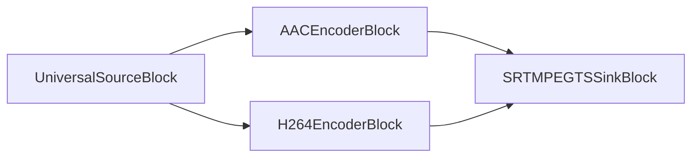

#### Exemple de code

```csharp
var pipeline = new MediaBlocksPipeline();

var filename = "test.mp4";
var fileSource = new UniversalSourceBlock(await UniversalSourceSettings.CreateAsync(filename));

var audioEncoderBlock = new AACEncoderBlock(new AACEncoderSettings() { Bitrate = 192 });
pipeline.Connect(fileSource.AudioOutput, audioEncoderBlock.Input);

var videoEncoderBlock = new H264EncoderBlock(new OpenH264EncoderSettings());
pipeline.Connect(fileSource.VideoOutput, videoEncoderBlock.Input);

// Configurer le puits SRT MPEG-TS
var srtMpegtsSinkSettings = new SRTMPEGTSSinkSettings
{
    Host = "srt-server.example.com",
    Port = 1234,
    Mode = SRTMode.Caller,
    Latency = 200,
    Passphrase = "optional-encryption-passphrase"
};

var sinkBlock = new SRTMPEGTSSinkBlock(srtMpegtsSinkSettings);
pipeline.Connect(audioEncoderBlock.Output, sinkBlock.CreateNewInput(MediaBlockPadMediaType.Audio));
pipeline.Connect(videoEncoderBlock.Output, sinkBlock.CreateNewInput(MediaBlockPadMediaType.Video));

await pipeline.StartAsync();
```

#### Plateformes

Windows, macOS, Linux, iOS, Android.

### YouTube Live

YouTube Live est un service de streaming en direct fourni par YouTube. Il permet aux créateurs de diffuser des vidéos en direct à leur audience via la plateforme YouTube.

Utilisez la classe `YouTubeSinkSettings` pour définir les paramètres.

#### Informations sur le bloc

Nom : YouTubeSinkBlock.

| Direction du pin |  Type de média  | Nombre de pins  |
| --- |:------------:|:-----------:|
| Audio en entrée | audio/mpeg [1,2,4]   |     un     |
| | audio/x-adpcm  |
| | PCM [U8, S16LE] |        |
| | audio/x-speex  |        |
| | audio/x-mulaw  |        |
| | audio/x-alaw  |        |
| | audio/x-nellymoser  |        |
| Vidéo en entrée | video/x-h264   |     un     |

#### Exemple de pipeline

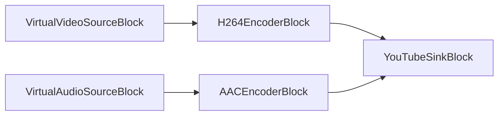

#### Exemple de code

```csharp
// Pipeline
var pipeline = new MediaBlocksPipeline();

// sources vidéo et audio
var virtualVideoSource = new VirtualVideoSourceSettings
{
    Width = 1920,
    Height = 1080,
    FrameRate = VideoFrameRate.FPS_30,
};

var videoSource = new VirtualVideoSourceBlock(virtualVideoSource);

var virtualAudioSource = new VirtualAudioSourceSettings
{
     Channels = 2,
     SampleRate = 48000,
};

var audioSource = new VirtualAudioSourceBlock(virtualAudioSource);

// encodeurs H264/AAC
var h264Settings = new OpenH264EncoderSettings
{
    Bitrate = 4000, // 4 Mbps pour 1080p
    KeyframeInterval = 2 // Image clé toutes les 2 secondes
};
var h264Encoder = new H264EncoderBlock(h264Settings);

var aacSettings = new AACEncoderSettings
{
    Bitrate = 192 // 192 kbps pour l'audio
};
var aacEncoder = new AACEncoderBlock(aacSettings);

pipeline.Connect(videoSource.Output, h264Encoder.Input);
pipeline.Connect(audioSource.Output, aacEncoder.Input);

// puits YouTube Live — YouTubeSinkSettings n'accepte que la CLÉ de flux.
var sink = new YouTubeSinkBlock(new YouTubeSinkSettings("your_youtube_stream_key"));
pipeline.Connect(h264Encoder.Output, sink.CreateNewInput(MediaBlockPadMediaType.Video));
pipeline.Connect(aacEncoder.Output, sink.CreateNewInput(MediaBlockPadMediaType.Audio));

// Démarrer
await pipeline.StartAsync();
```

#### Plateformes

Windows, macOS, Linux, iOS, Android.

### Shoutcast

`Shoutcast` est un service permettant de diffuser des médias sur Internet vers des lecteurs multimédias, à l'aide de son propre logiciel propriétaire multiplateforme. Il permet de diffuser du contenu audio numérique, principalement aux formats MP3 ou HE-AAC (High-Efficiency Advanced Audio Coding). L'usage le plus courant de Shoutcast consiste à créer ou écouter des diffusions audio sur Internet.

Utilisez la classe `ShoutcastSinkSettings` pour définir les paramètres.

#### Informations sur le bloc

Nom : ShoutcastSinkBlock.

| Direction du pin | Type de média      | Nombre de pins |
| ------------- | :----------------: | :--------: |
| Audio en entrée   | audio/mpeg         | un        |
|               | audio/aac          |            |
|               | audio/x-aac        |            |


#### Exemple de pipeline

```mermaid
graph LR;
    subgraph MainPipeline
        direction LR
        A[Source audio par ex. UniversalSourceBlock ou VirtualAudioSourceBlock] --> B{Encodeur audio optionnel par ex. MP3EncoderBlock};
        B --> C[ShoutcastSinkBlock];
    end
    subgraph AlternativeIfSourceEncoded
         A2[Source audio encodée] --> C2[ShoutcastSinkBlock];
    end
```

#### Exemple de code

```csharp
// Pipeline
var pipeline = new MediaBlocksPipeline();

// Source audio (par ex. depuis un fichier MP3/AAC ou audio brut)
var universalSource = new UniversalSourceBlock(await UniversalSourceSettings.CreateAsync("input.mp3"));
// Ou utilisez VirtualAudioSourceBlock pour une entrée audio brute en direct :
// var audioSource = new VirtualAudioSourceBlock(new VirtualAudioSourceSettings { Channels = 2, SampleRate = 44100 });

// Optionnel : encodeur audio (si la source est audio brut ou nécessite un ré-encodage pour Shoutcast)
// Exemple : MP3EncoderBlock si le serveur Shoutcast attend du MP3
var mp3Encoder = new MP3EncoderBlock(new MP3EncoderSettings() { Bitrate = 128000 }); // Débit en bps
pipeline.Connect(universalSource.AudioOutput, mp3Encoder.Input);
// Si vous utilisez VirtualAudioSourceBlock : pipeline.Connect(audioSource.Output, mp3Encoder.Input);

// Puits Shoutcast
// Configurer les détails de connexion au serveur Shoutcast/Icecast
var shoutcastSettings = new ShoutcastSinkSettings
{
    IP = "your-shoutcast-server-ip", // Nom d'hôte ou adresse IP du serveur
    Port = 8000,                      // Port du serveur
    Mount = "/mountpoint",            // Point de montage (par ex., "/stream", "/live.mp3")
    Password = "your-password",         // Mot de passe source pour le serveur
    Protocol = ShoutProtocol.ICY,     // ShoutProtocol.ICY pour Shoutcast v1/v2 (par ex., icy://)
                                      // ShoutProtocol.HTTP pour Icecast 2.x (par ex., http://)
                                      // ShoutProtocol.XAudiocast pour les anciens Shoutcast/XAudioCast

    // Métadonnées du flux
    StreamName = "My Radio Stream",
    Genre = "Various",
    Description = "My awesome internet radio station",
    URL = "https://my-radio-website.com", // URL de la page d'accueil de votre flux (apparaît dans les métadonnées d'annuaire)
    Public = true,                       // Mettre à true pour figurer dans les annuaires publics (si le serveur le prend en charge)
    Username = "source"                  // Nom d'utilisateur pour l'authentification (souvent "source" ; vérifiez la config du serveur)
    // Les autres paramètres du flux comme le débit audio, la fréquence d'échantillonnage et les canaux sont généralement déterminés
    // par les propriétés du flux audio d'entrée encodé fourni au ShoutcastSinkBlock.
};
var shoutcastSink = new ShoutcastSinkBlock(shoutcastSettings);

// Connecter la sortie de l'encodeur (ou la sortie audio de la source si déjà encodée et compatible) au puits Shoutcast
pipeline.Connect(mp3Encoder.Output, shoutcastSink.Input);
// Si la source est déjà encodée et compatible (par ex. fichier MP3 vers Shoutcast MP3) :
// pipeline.Connect(universalSource.AudioOutput, shoutcastSink.Input);

// Démarrer le pipeline
await pipeline.StartAsync();

// À des fins d'affichage, vous pouvez construire une chaîne représentant la connexion :
string protocolScheme = shoutcastSettings.Protocol switch
{
    ShoutProtocol.ICY => "icy",
    ShoutProtocol.HTTP => "http",
    ShoutProtocol.XAudiocast => "xaudiocast", // Remarque : le schéma réel peut être http pour XAudiocast
    _ => "unknown"
};
Console.WriteLine($"Streaming to Shoutcast server: {protocolScheme}://{shoutcastSettings.IP}:{shoutcastSettings.Port}{shoutcastSettings.Mount}");
Console.WriteLine($"Stream metadata URL (for directories): {shoutcastSettings.URL}");
Console.WriteLine("Press any key to stop the stream...");
Console.ReadKey();

// Arrêter le pipeline (important pour une déconnexion propre et la libération des ressources)
await pipeline.StopAsync();
```

#### Plateformes

Windows, macOS, Linux, iOS, Android.

---

### DASH

Le `DASHSinkBlock` produit une sortie MPEG-DASH (Dynamic Adaptive Streaming over HTTP) — un manifeste MPD et des segments multimédias — compatible avec tout lecteur capable de lire le DASH. Il prend en charge à la fois les modes VOD (statique) et direct (dynamique). Plusieurs flux vidéo et audio peuvent être connectés simultanément pour créer des manifestes à débit adaptatif.

#### Informations sur le bloc

Nom : DASHSinkBlock.

| Direction du pin | Type de média | Nombre de pins |
| --- | :---: | :---: |
| Vidéo en entrée | video/x-h264 | un ou plusieurs |
| | video/x-h265 | |
| | video/x-vp9 | |
| | video/x-av1 | |
| Audio en entrée | audio/mpeg | un ou plusieurs |
| | audio/x-aac | |
| | audio/x-opus | |

#### Paramètres

Utilisez `DASHSinkSettings` pour configurer la sortie DASH :

| Propriété | Type | Par défaut | Description |
| --- | --- | --- | --- |
| `MPDFilename` | `string` | `c:\inetpub\wwwroot\dash\manifest.mpd` | Chemin complet du fichier manifeste MPD |
| `MPDBaseURL` | `string` | `""` | URL de base ajoutée en préfixe aux noms de segments dans le manifeste |
| `TargetDuration` | `TimeSpan` | 5 s | Durée cible par segment multimédia |
| `MinBufferTime` | `TimeSpan` | 2 s | Temps minimum de tampon annoncé dans le manifeste |
| `Dynamic` | `bool` | `false` | `false` = VOD/statique ; `true` = flux en direct |
| `PresentationDelay` | `TimeSpan` | 0 | Délai de présentation (direct uniquement) |
| `MinimumUpdatePeriod` | `TimeSpan` | 0 | Intervalle de rafraîchissement du MPD (direct uniquement) |
| `TimeShiftBufferDepth` | `TimeSpan` | 0 | Profondeur de la fenêtre DVR (direct uniquement) |
| `SendKeyframeRequests` | `bool` | `true` | Demander des images clés aux limites de segments |
| `Custom_HTTP_Server_Enabled` | `bool` | `false` | Activer le serveur HTTP intégré pour servir les segments |
| `Custom_HTTP_Server_Port` | `int` | 80 | Port du serveur HTTP intégré |

Appelez `settings.CheckAndCreateFolders()` avant de démarrer le pipeline pour vous assurer que le répertoire de sortie existe.

Les pads d'entrée sont créés dynamiquement : appelez `dashSink.CreateNewInput(MediaBlockPadMediaType.Video)` ou `dashSink.CreateNewInput(MediaBlockPadMediaType.Audio)` pour obtenir un pad, puis connectez-y la sortie de votre encodeur.

#### Exemple de pipeline

```mermaid
graph LR;
    UniversalSourceBlock -- Vidéo brute --> H264EncoderBlock;
    UniversalSourceBlock -- Audio brut --> AACEncoderBlock;
    H264EncoderBlock -- Vidéo H.264 --> DASHSinkBlock;
    AACEncoderBlock -- Audio AAC --> DASHSinkBlock;
```

#### Exemple de code

```csharp
var pipeline = new MediaBlocksPipeline();

var dashSettings = new DASHSinkSettings
{
    MPDFilename = @"c:\output\dash\manifest.mpd",
    MPDBaseURL = "http://localhost/dash/",
    TargetDuration = TimeSpan.FromSeconds(5),
    Dynamic = false // mode VOD/statique ; mettre à true pour le streaming en direct
};
dashSettings.CheckAndCreateFolders();
var dashSink = new DASHSinkBlock(dashSettings);

var universalSource = new UniversalSourceBlock(await UniversalSourceSettings.CreateAsync("input.mp4"));
var h264Encoder = new H264EncoderBlock(new OpenH264EncoderSettings());
var aacEncoder = new AACEncoderBlock();

pipeline.Connect(universalSource.VideoOutput, h264Encoder.Input);
pipeline.Connect(universalSource.AudioOutput, aacEncoder.Input);
pipeline.Connect(h264Encoder.Output, dashSink.CreateNewInput(MediaBlockPadMediaType.Video));
pipeline.Connect(aacEncoder.Output, dashSink.CreateNewInput(MediaBlockPadMediaType.Audio));

await pipeline.StartAsync();
```

#### Disponibilité

Vérifiez la disponibilité avec `DASHSinkBlock.IsAvailable()`. Nécessite le plugin GStreamer `dash` et le paquet de redistribution VisioForge SDK approprié.

#### Plateformes

Windows, macOS, Linux.

---

### WHIP

Le `WHIPSinkBlock` diffuse des médias vers des serveurs WebRTC en utilisant WHIP (WebRTC-HTTP Ingestion Protocol), permettant un streaming en direct à faible latence vers des services tels que MediaMTX, Janus, Cloudflare Stream et d'autres points de terminaison compatibles WHIP. La vidéo doit être encodée en H.264 et l'audio en Opus — l'encapsulation RTP est gérée en interne par le bloc.

#### Informations sur le bloc

Nom : WHIPSinkBlock.

| Direction du pin | Type de média | Nombre de pins |
| --- | :---: | :---: |
| Vidéo en entrée | video/x-h264 | 1 |
| Audio en entrée | audio/x-opus | 1 |

#### Paramètres

Utilisez `WHIPSinkSettings` pour configurer le point de terminaison WHIP :

| Propriété | Type | Par défaut | Description |
| --- | --- | --- | --- |
| `Location` | `string` | `http://localhost:8889/stream/whip` | URL du point de terminaison WHIP |
| `AuthToken` | `string` | `null` | Jeton Bearer envoyé dans l'en-tête HTTP `Authorization` |
| `StunServer` | `string` | `null` | URL du serveur STUN (format : `stun://hostname:port`) |
| `TurnServer` | `string` | `null` | URL du serveur TURN (format : `turn(s)://username:password@host:port`) |
| `UseLinkHeaders` | `bool` | `true` | Configurer automatiquement les serveurs ICE à partir des en-têtes `Link` de la réponse du serveur WHIP |
| `Timeout` | `TimeSpan` | 15 s | Délai d'expiration des requêtes HTTP WHIP |
| `IceTransportPolicy` | `WHIPIceTransportPolicy` | `All` | `All` = utiliser STUN et TURN ; `Relay` = relais TURN uniquement |

Les pads d'entrée sont créés dynamiquement : appelez `whipSink.CreateNewInput(MediaBlockPadMediaType.Video)` et `whipSink.CreateNewInput(MediaBlockPadMediaType.Audio)` pour obtenir les pads, puis connectez vos encodeurs.

#### Exemple de pipeline

```mermaid
graph LR;
    UniversalSourceBlock -- Vidéo brute --> H264EncoderBlock;
    UniversalSourceBlock -- Audio brut --> OPUSEncoderBlock;
    H264EncoderBlock -- Vidéo H.264 --> WHIPSinkBlock;
    OPUSEncoderBlock -- Audio Opus --> WHIPSinkBlock;
```

#### Exemple de code

```csharp
var pipeline = new MediaBlocksPipeline();

var whipSettings = new WHIPSinkSettings
{
    Location = "http://localhost:8889/live/whip",
    AuthToken = "your-bearer-token", // optionnel
    StunServer = "stun://stun.l.google.com:19302"
};
var whipSink = new WHIPSinkBlock(whipSettings);

var universalSource = new UniversalSourceBlock(await UniversalSourceSettings.CreateAsync("input.mp4"));
var h264Encoder = new H264EncoderBlock(new OpenH264EncoderSettings());
var opusEncoder = new OPUSEncoderBlock();

pipeline.Connect(universalSource.VideoOutput, h264Encoder.Input);
pipeline.Connect(universalSource.AudioOutput, opusEncoder.Input);
pipeline.Connect(h264Encoder.Output, whipSink.CreateNewInput(MediaBlockPadMediaType.Video));
pipeline.Connect(opusEncoder.Output, whipSink.CreateNewInput(MediaBlockPadMediaType.Audio));

await pipeline.StartAsync();
```

#### Disponibilité

Vérifiez la disponibilité avec `WHIPSinkBlock.IsAvailable()`. Nécessite le plugin GStreamer `webrtc` et le paquet de redistribution VisioForge SDK approprié.

#### Plateformes

Windows, macOS, Linux.

### RIST MPEG-TS

Le `RISTMPEGTSSinkBlock` multiplexe les flux audio et vidéo en MPEG-TS, encapsule le transport dans RTP et l'envoie via RIST (Reliable Internet Stream Transport). RIST ajoute une retransmission basée sur ARQ sur UDP, offrant une livraison de médias fiable à faible latence sans la surcharge de TCP.

Plusieurs pads d'entrée audio et vidéo sont pris en charge. Appelez `CreateNewInput(MediaBlockPadMediaType.Video)` et `CreateNewInput(MediaBlockPadMediaType.Audio)` pour obtenir des pads avant de connecter les encodeurs.

#### Informations sur le bloc

Nom : RISTMPEGTSSinkBlock.

| Direction du pin | Type de média | Nombre de pins |
| --- | :---: | :---: |
| Vidéo en entrée | Vidéo encodée | Dynamique |
| Audio en entrée | Audio encodé | Dynamique |

#### Paramètres

Utilisez `RISTSinkSettings` pour configurer la destination :

| Propriété | Type | Par défaut | Description |
| --- | --- | --- | --- |
| `Address` | `string` | `"localhost"` | Adresse IPv4 ou IPv6 de destination |
| `Port` | `uint` | `5004` | Port RTP de destination (doit être pair ; RTCP utilise Port + 1) |
| `SenderBuffer` | `TimeSpan` | 1200 ms | Taille de la file d'attente de retransmission |
| `BondingAddresses` | `string` | `null` | Paires `address:port` séparées par des virgules pour le bonding ; remplace Address/Port |
| `BondingMethod` | `RISTBondingMethod` | `Broadcast` | `Broadcast` = envoyer à toutes les destinations ; `RoundRobin` = alterner |
| `MulticastInterface` | `string` | `null` | Interface réseau pour le multicast |
| `MulticastTTL` | `int` | `1` | Time-to-live multicast |
| `DropNullTSPackets` | `bool` | `false` | Supprimer les paquets de bourrage MPEG-TS nuls |
| `SequenceNumberExtension` | `bool` | `false` | Ajouter l'extension de numéro de séquence RTP |
| `MinRTCPInterval` | `uint` | `100` | Intervalle minimal entre paquets RTCP (ms) |

#### Exemple de pipeline

```mermaid
graph LR;
    UniversalSourceBlock -- Vidéo brute --> H264EncoderBlock;
    UniversalSourceBlock -- Audio brut --> AACEncoderBlock;
    H264EncoderBlock --> RISTMPEGTSSinkBlock;
    AACEncoderBlock --> RISTMPEGTSSinkBlock;
```

#### Exemple de code

```csharp
var pipeline = new MediaBlocksPipeline();

var source = new UniversalSourceBlock(await UniversalSourceSettings.CreateAsync("input.mp4"));

var h264Encoder = new H264EncoderBlock(new OpenH264EncoderSettings());
var aacEncoder = new AACEncoderBlock();

pipeline.Connect(source.VideoOutput, h264Encoder.Input);
pipeline.Connect(source.AudioOutput, aacEncoder.Input);

var ristSettings = new RISTSinkSettings
{
    Address = "192.168.1.100",
    Port = 5004,
    SenderBuffer = TimeSpan.FromMilliseconds(1200)
};

var ristSink = new RISTMPEGTSSinkBlock(ristSettings);
pipeline.Connect(h264Encoder.Output, ristSink.CreateNewInput(MediaBlockPadMediaType.Video));
pipeline.Connect(aacEncoder.Output, ristSink.CreateNewInput(MediaBlockPadMediaType.Audio));

await pipeline.StartAsync();
```

#### Disponibilité

`RISTMPEGTSSinkBlock.IsAvailable()` renvoie `true` si le plugin GStreamer `rist` est présent.

#### Plateformes

Windows, macOS, Linux.

### UDP

UDP (User Datagram Protocol) est un protocole de transport léger et sans connexion qui offre un streaming à faible latence avec une surcharge minimale. Contrairement aux protocoles basés sur TCP, UDP ne garantit pas la livraison des paquets, ce qui le rend idéal pour les applications temps réel où la rapidité est cruciale.

Utilisez la classe `UDPSinkSettings` pour définir les paramètres.

#### Informations sur le bloc

Nom : UDPSinkBlock.

| Direction du pin | Type de média | Nombre de pins |
| --- | :---: | :---: |
| Entrée | Tout format de flux | 1 |

#### Exemple de pipeline

```mermaid
graph LR;
    UniversalSourceBlock-->UDPMPEGTSSinkBlock;
```

#### Exemple de code

```csharp
var pipeline = new MediaBlocksPipeline();

var filename = "test.mp4";
var fileSource = new UniversalSourceBlock(await UniversalSourceSettings.CreateAsync(filename));

// UDPMPEGTSSinkBlock encapsule le multiplexeur MPEG-TS en interne —
// connectez directement les flux élémentaires encodés via CreateNewInput.
var udpSettings = new UDPSinkSettings
{
    Host = "192.168.1.100",
    Port = 5004
};
var udpSink = new UDPMPEGTSSinkBlock(udpSettings);
pipeline.Connect(fileSource.AudioOutput, udpSink.CreateNewInput(MediaBlockPadMediaType.Audio));
pipeline.Connect(fileSource.VideoOutput, udpSink.CreateNewInput(MediaBlockPadMediaType.Video));

await pipeline.StartAsync();
```

#### Plateformes

Windows, macOS, Linux, iOS, Android.

### UDP MPEG-TS

UDP MPEG-TS combine le multiplexage MPEG-TS avec le transport UDP. Cela permet la livraison à faible latence de flux audio et vidéo multiplexés sur UDP, ce qui est largement utilisé dans les flux de production de diffusion, IPTV et vidéosurveillance.

Utilisez la classe `UDPSinkSettings` pour définir les paramètres.

#### Informations sur le bloc

Nom : UDPMPEGTSSinkBlock.

| Direction du pin | Type de média | Nombre de pins |
| --- | :---: | :---: |
| Audio en entrée | audio/x-raw | un ou plusieurs |
| | audio/mpeg | |
| | audio/x-ac3 | |
| | audio/x-alaw | |
| | audio/x-mulaw | |
| | audio/AAC | |
| Vidéo en entrée | video/x-raw | un ou plusieurs |
| | image/jpeg | |
| | video/x-msmpeg | |
| | video/mpeg | |
| | video/x-h263 | |
| | video/x-h264 | |
| | video/x-h265 | |

#### Paramètres

| Propriété | Type | Par défaut | Description |
| --- | --- | --- | --- |
| `Host` | `string` | `"localhost"` | Hôte/IP/groupe multicast de destination |
| `Port` | `int` | `5004` | Port de destination |
| `TTL` | `int` | `64` | Time-to-live unicast |
| `MulticastTTL` | `int` | `1` | Time-to-live multicast |
| `AutoMulticast` | `bool` | `true` | Rejoindre/quitter automatiquement les groupes multicast |
| `MulticastInterface` | `string` | `null` | Interface réseau pour le multicast |
| `Loop` | `bool` | `true` | Bouclage multicast |
| `BufferSize` | `int` | `0` | Taille du tampon d'envoi du noyau (0 = valeur par défaut) |
| `QosDscp` | `int` | `-1` | Valeur DSCP (-1 = valeur par défaut) |
| `BindAddress` | `string` | `null` | Adresse locale à lier |
| `BindPort` | `int` | `0` | Port local à lier (0 = auto) |
| `MuxerLatency` | `TimeSpan` | 1000 ms | Latence de l'agrégateur du multiplexeur MPEG-TS |

#### Exemple de pipeline

```mermaid
graph LR;
    UniversalSourceBlock-->AACEncoderBlock;
    UniversalSourceBlock-->H264EncoderBlock;
    AACEncoderBlock-->UDPMPEGTSSinkBlock;
    H264EncoderBlock-->UDPMPEGTSSinkBlock;
```

#### Exemple de code

```csharp
var pipeline = new MediaBlocksPipeline();

var filename = "test.mp4";
var fileSource = new UniversalSourceBlock(await UniversalSourceSettings.CreateAsync(filename));

var audioEncoderBlock = new AACEncoderBlock(new AACEncoderSettings() { Bitrate = 192 });
pipeline.Connect(fileSource.AudioOutput, audioEncoderBlock.Input);

var videoEncoderBlock = new H264EncoderBlock(new OpenH264EncoderSettings());
pipeline.Connect(fileSource.VideoOutput, videoEncoderBlock.Input);

// Configurer le puits UDP MPEG-TS
var udpSettings = new UDPSinkSettings
{
    Host = "192.168.1.100",
    Port = 5004,
    TTL = 64
};

var sinkBlock = new UDPMPEGTSSinkBlock(udpSettings);
pipeline.Connect(audioEncoderBlock.Output, sinkBlock.CreateNewInput(MediaBlockPadMediaType.Audio));
pipeline.Connect(videoEncoderBlock.Output, sinkBlock.CreateNewInput(MediaBlockPadMediaType.Video));

await pipeline.StartAsync();
```

#### Disponibilité

`UDPMPEGTSSinkBlock.IsAvailable()` renvoie `true` si le plugin GStreamer `udp` est présent.

#### Plateformes

Windows, macOS, Linux, iOS, Android.

### UDP multi-destinations

Le `MultiUDPSinkBlock` envoie des données brutes via UDP à un ou plusieurs destinataires simultanément. Les destinations sont spécifiées sous forme de paires host:port séparées par des virgules et peuvent être gérées à l'aide de méthodes d'aide sur la classe de paramètres.

Utilisez la classe `MultiUDPSinkSettings` pour définir les paramètres.

#### Informations sur le bloc

Nom : MultiUDPSinkBlock.

| Direction du pin | Type de média | Nombre de pins |
| --- | :---: | :---: |
| Entrée | Tout format de flux | 1 |

#### Exemple de pipeline

```mermaid
graph LR;
    UniversalSourceBlock-->MultiUDPMPEGTSSinkBlock;
```

#### Exemple de code

```csharp
var pipeline = new MediaBlocksPipeline();

var filename = "test.mp4";
var fileSource = new UniversalSourceBlock(await UniversalSourceSettings.CreateAsync(filename));

// MultiUDPMPEGTSSinkBlock encapsule le multiplexeur MPEG-TS en interne —
// enregistrez les destinations via AddClient, connectez les flux élémentaires via CreateNewInput.
var multiUdpSettings = new MultiUDPSinkSettings();
multiUdpSettings.AddClient("192.168.1.100", 5004);
multiUdpSettings.AddClient("192.168.1.101", 5004);

var multiUdpSink = new MultiUDPMPEGTSSinkBlock(multiUdpSettings);
pipeline.Connect(fileSource.AudioOutput, multiUdpSink.CreateNewInput(MediaBlockPadMediaType.Audio));
pipeline.Connect(fileSource.VideoOutput, multiUdpSink.CreateNewInput(MediaBlockPadMediaType.Video));

await pipeline.StartAsync();
```

#### Plateformes

Windows, macOS, Linux, iOS, Android.

### UDP MPEG-TS multi-destinations

Le `MultiUDPMPEGTSSinkBlock` multiplexe les flux audio et vidéo en MPEG-TS et envoie le résultat sur UDP à une ou plusieurs destinations simultanément. C'est utile pour diffuser le même flux à plusieurs récepteurs, serveurs d'enregistrement ou points de terminaison redondants.

Plusieurs pads d'entrée audio et vidéo sont pris en charge. Appelez `CreateNewInput(MediaBlockPadMediaType.Video)` et `CreateNewInput(MediaBlockPadMediaType.Audio)` pour obtenir les pads avant de connecter les encodeurs.

#### Informations sur le bloc

Nom : MultiUDPMPEGTSSinkBlock.

| Direction du pin | Type de média | Nombre de pins |
| --- | :---: | :---: |
| Audio en entrée | audio/x-raw | un ou plusieurs |
| | audio/mpeg | |
| | audio/x-ac3 | |
| | audio/x-alaw | |
| | audio/x-mulaw | |
| | audio/AAC | |
| Vidéo en entrée | video/x-raw | un ou plusieurs |
| | image/jpeg | |
| | video/x-msmpeg | |
| | video/mpeg | |
| | video/x-h263 | |
| | video/x-h264 | |
| | video/x-h265 | |

#### Paramètres

Utilisez `MultiUDPSinkSettings` pour configurer les destinations :

| Propriété | Type | Par défaut | Description |
| --- | --- | --- | --- |
| `Clients` | `string` | `""` | Paires `host:port` séparées par des virgules |
| `SendDuplicates` | `bool` | `true` | Envoyer des doublons lorsque la même destination est ajoutée plusieurs fois |
| `TTL` | `int` | `64` | Time-to-live unicast |
| `MulticastTTL` | `int` | `1` | Time-to-live multicast |
| `AutoMulticast` | `bool` | `true` | Rejoindre/quitter automatiquement les groupes multicast |
| `MulticastInterface` | `string` | `null` | Interface réseau pour le multicast |
| `Loop` | `bool` | `true` | Bouclage multicast |
| `BufferSize` | `int` | `0` | Taille du tampon d'envoi du noyau (0 = valeur par défaut) |
| `QosDscp` | `int` | `-1` | Valeur DSCP (-1 = valeur par défaut) |
| `BindAddress` | `string` | `null` | Adresse locale à lier |
| `BindPort` | `int` | `0` | Port local à lier (0 = auto) |
| `MuxerLatency` | `TimeSpan` | 1000 ms | Latence de l'agrégateur du multiplexeur MPEG-TS |

#### Exemple de pipeline

```mermaid
graph LR;
    UniversalSourceBlock -- Vidéo brute --> H264EncoderBlock;
    UniversalSourceBlock -- Audio brut --> AACEncoderBlock;
    H264EncoderBlock --> MultiUDPMPEGTSSinkBlock;
    AACEncoderBlock --> MultiUDPMPEGTSSinkBlock;
```

#### Exemple de code

```csharp
var pipeline = new MediaBlocksPipeline();

var source = new UniversalSourceBlock(await UniversalSourceSettings.CreateAsync("input.mp4"));

var h264Encoder = new H264EncoderBlock(new OpenH264EncoderSettings());
var aacEncoder = new AACEncoderBlock();

pipeline.Connect(source.VideoOutput, h264Encoder.Input);
pipeline.Connect(source.AudioOutput, aacEncoder.Input);

var multiUdpSettings = new MultiUDPSinkSettings();
multiUdpSettings.AddClient("192.168.1.100", 5004);
multiUdpSettings.AddClient("192.168.1.101", 5004);

var multiUdpSink = new MultiUDPMPEGTSSinkBlock(multiUdpSettings);
pipeline.Connect(h264Encoder.Output, multiUdpSink.CreateNewInput(MediaBlockPadMediaType.Video));
pipeline.Connect(aacEncoder.Output, multiUdpSink.CreateNewInput(MediaBlockPadMediaType.Audio));

await pipeline.StartAsync();
```

#### Disponibilité

`MultiUDPMPEGTSSinkBlock.IsAvailable()` renvoie `true` si le plugin GStreamer `udp` est présent.

#### Plateformes

Windows, macOS, Linux, iOS, Android.

## Puits utilitaires

### Puits flux { #stream-sink }

Le `StreamSinkBlock` écrit des données multimédias vers n'importe quel objet `Stream` .NET, ce qui permet une sortie flexible vers des tampons mémoire, des fichiers, des connexions réseau, des couches de chiffrement, ou tout autre flux accessible en écriture.

Le flux doit rester ouvert et accessible en écriture pendant toute la durée de vie du pipeline. Le bloc ne libère pas le flux lorsque le pipeline s'arrête.

#### Informations sur le bloc

Nom : StreamSinkBlock.

| Direction du pin | Type de média | Nombre de pins |
| --- | :---: | :---: |
| Entrée | Tout | 1 |

#### Exemple de code

```csharp
var pipeline = new MediaBlocksPipeline();

var filename = "test.mp4";
var fileSource = new UniversalSourceBlock(await UniversalSourceSettings.CreateAsync(filename));

using var outputStream = new FileStream("output.raw", FileMode.Create, FileAccess.Write);
var streamSink = new StreamSinkBlock(outputStream);
pipeline.Connect(fileSource.VideoOutput, streamSink.Input);

await pipeline.StartAsync();
```

#### Disponibilité

`StreamSinkBlock.IsAvailable()` renvoie `true` si l'élément GStreamer `appsink` est disponible.

#### Plateformes

Windows, macOS, Linux, iOS, Android.

### Puits descripteur de fichier { #file-descriptor-sink }

Le `FDSinkBlock` écrit des données multimédias vers un descripteur de fichier Unix (un handle entier). C'est utile pour produire une sortie vers des pipes, des sockets ou l'entrée standard d'un processus enfant.

Passez `addQueue: true` (par défaut) pour ajouter une file d'attente de mise en tampon qui empêche le pipeline de bloquer sur des écritures lentes du descripteur.

Le descripteur doit être ouvert et accessible en écriture avant le démarrage du pipeline. Le bloc ne le ferme pas lorsque le pipeline s'arrête.

#### Informations sur le bloc

Nom : FDSinkBlock.

| Direction du pin | Type de média | Nombre de pins |
| --- | :---: | :---: |
| Entrée | Tout | 1 |

#### Exemple de code

```csharp
var pipeline = new MediaBlocksPipeline();

var filename = "test.mp4";
var fileSource = new UniversalSourceBlock(await UniversalSourceSettings.CreateAsync(filename));

// Écrire vers stdout (fd 1)
var fdSink = new FDSinkBlock(descriptor: 1);
pipeline.Connect(fileSource.VideoOutput, fdSink.Input);

await pipeline.StartAsync();
```

#### Disponibilité

`FDSinkBlock.IsAvailable()` renvoie `true` si l'élément GStreamer `fdsink` est disponible.

#### Plateformes

Linux, macOS. Prise en charge limitée sur Windows.

### Puits fichier KLV { #klv-file-sink }

Le `KLVFileSinkBlock` écrit des flux de métadonnées KLV (Key-Length-Value) dans un fichier. KLV est utilisé dans les applications conformes à MISB/STANAG 4609 — y compris la vidéo de drones, la surveillance et l'aérospatiale — pour intégrer des métadonnées géospatiales avec la vidéo.

Le bloc accepte des données `meta/x-klv` sur son entrée et les écrit directement dans le fichier spécifié via l'élément GStreamer `filesink`.

#### Informations sur le bloc

Nom : KLVFileSinkBlock.

| Direction du pin | Type de média | Nombre de pins |
| --- | :---: | :---: |
| Entrée | meta/x-klv | 1 |

#### Exemple de code

```csharp
// Le SDK ne fournit pas de bloc source KLV dédié — les flux KLV sont produits
// par des sources MPEG-TS / compatibles MISB en amont ou par l'application elle-même, puis acheminés
// vers KLVFileSinkBlock pour le stockage sur fichier.
var pipeline = new MediaBlocksPipeline();

var klvFileSink = new KLVFileSinkBlock("output_metadata.klv");
pipeline.Connect(klvProducer.Output, klvFileSink.Input); // klvProducer = votre bloc émettant du KLV

await pipeline.StartAsync();
```

#### Plateformes

Windows, macOS, Linux.

### Puits tampon { #buffer-sink }

Le `BufferSinkBlock` capture les données multimédias en mémoire et les délivre image par image via des rappels d'événements, au lieu de les écrire dans un fichier ou sur le réseau. Il prend en charge les flux vidéo, audio et de données arbitraires.

Trois constructeurs couvrent les scénarios courants :

- `BufferSinkBlock(VideoFormatX, bool allowFrameDrop)` — capture vidéo avec conversion de format optionnelle
- `BufferSinkBlock(AudioFormatX, bool allowFrameDrop)` — capture audio avec rééchantillonnage optionnel
- `BufferSinkBlock()` — détecte automatiquement le type de média à partir de l'élément amont connecté

Événements clés :

- `OnVideoFrameBuffer` — déclenché pour chaque image vidéo décodée
- `OnAudioFrameBuffer` — déclenché pour chaque trame audio décodée
- `OnDataFrameBuffer` — déclenché pour les flux de données non audio/vidéo
- `OnSample` — accès bas niveau aux samples GStreamer ; lorsqu'il est abonné, il supprime les trois événements ci-dessus. **Libérez toujours le sample après utilisation** pour éviter les fuites mémoire.

Définissez `IsSync = false` pour les flux de transcodage ou d'analyse où la cadence en temps réel n'est pas requise.

#### Informations sur le bloc

Nom : BufferSinkBlock.

| Direction du pin | Type de média | Nombre de pins |
| --- | :---: | :---: |
| Entrée | Tout | 1 |

#### Paramètres

| Propriété | Type | Par défaut | Description |
| --- | --- | --- | --- |
| `AllowFrameDrop` | `bool` | `false` | Abandonner des images lorsque les rappels ne peuvent pas suivre la cadence du média |
| `IsSync` | `bool` | `true` | `true` = caler la cadence sur le temps réel ; `false` = traiter aussi vite que possible |

#### Exemple de pipeline

```mermaid
graph LR;
    UniversalSourceBlock-->BufferSinkBlock;
```

#### Exemple de code

```csharp
var pipeline = new MediaBlocksPipeline();

var source = new UniversalSourceBlock(await UniversalSourceSettings.CreateAsync("input.mp4"));

// VideoFormatX est un enum (l'une des valeurs BGRA / RGBA / NV12 / I420 / ...). La taille d'image et
// la fréquence sont héritées des caps amont ; passez allowFrameDrop=true si votre rappel
// risque de prendre du retard sur la source.
var bufferSink = new BufferSinkBlock(VideoFormatX.BGRA, allowFrameDrop: false);
bufferSink.OnVideoFrameBuffer += (sender, e) =>
{
    // e.Frame contient les données de pixels, les dimensions et l'horodatage
    Console.WriteLine($"Frame at {e.Frame.Timestamp}: {e.Frame.Width}x{e.Frame.Height}");
};

pipeline.Connect(source.VideoOutput, bufferSink.Input);

await pipeline.StartAsync();
```

#### Disponibilité

`BufferSinkBlock.IsAvailable()` renvoie `true` si l'élément GStreamer `appsink` est disponible.

#### Plateformes

Windows, macOS, Linux, iOS, Android.

### Puits caméra virtuelle { #virtual-camera-sink }

Le `VirtualCameraSinkBlock` expose la sortie du pipeline en tant que caméra virtuelle système (et microphone virtuel), de sorte que n'importe quelle autre application Windows — Zoom, Teams, OBS, un navigateur — peut récupérer votre vidéo et votre audio traités comme s'il s'agissait d'un véritable périphérique de capture. Les images sont délivrées aux filtres source DirectShow Virtual Camera et Virtual Audio Card de VisioForge via la mémoire partagée.

Les deux entrées sont optionnelles : créez une entrée vidéo, une entrée audio, ou les deux. Utilisez `CreateNewInput(MediaBlockPadMediaType.Video)` et `CreateNewInput(MediaBlockPadMediaType.Audio)` pour ajouter les pins dont vous avez besoin.

Ce bloc est **réservé à Windows**. Les filtres source Virtual Camera et Virtual Audio Card doivent être enregistrés via COM sur la machine avant que les périphériques virtuels n'apparaissent. Utilisez `VirtualCameraSinkBlock.IsCOMRegistered()` pour vérifier, et `VirtualCameraSinkBlock.COMRegisterAsAdmin()` pour les enregistrer avec une élévation (invite UAC).

Configurez la sortie avec `VirtualCameraSinkSettings`.

#### Informations sur le bloc

Nom : VirtualCameraSinkBlock.

| Direction du pin | Type de média | Nombre de pins |
| --- | :---: | :---: |
| Vidéo en entrée | video/x-raw | zéro ou un |
| Audio en entrée | audio/x-raw | zéro ou un |

#### Paramètres

| Propriété | Type | Par défaut | Description |
| --- | --- | --- | --- |
| `Width` | `int` | `1280` | Largeur de l'image vidéo en pixels (doit être paire) |
| `Height` | `int` | `720` | Hauteur de l'image vidéo en pixels |
| `FrameRate` | `double` | `30.0` | Cadence cible |
| `VideoStreamName` | `string` | `"VideoStream1"` | Nom du flux en mémoire partagée ; doit correspondre au filtre source de la caméra virtuelle |
| `AudioSampleRate` | `int` | `48000` | Fréquence d'échantillonnage audio en Hz |
| `AudioChannels` | `int` | `2` | Nombre de canaux audio (1 = mono, 2 = stéréo) |
| `AudioBitsPerSample` | `int` | `16` | Bits par échantillon audio |
| `AudioStreamName` | `string` | `"AudioStream1"` | Nom du flux en mémoire partagée ; doit correspondre au filtre source de la carte audio virtuelle |
| `CustomVideoProcessor` | `MediaBlock` | `null` | Bloc de traitement vidéo personnalisé optionnel |
| `CustomAudioProcessor` | `MediaBlock` | `null` | Bloc de traitement audio personnalisé optionnel |

#### Exemple de pipeline

```mermaid
graph LR;
    UniversalSourceBlock-->VirtualCameraSinkBlock;
```

#### Exemple de code

```csharp
var pipeline = new MediaBlocksPipeline();

var source = new UniversalSourceBlock(await UniversalSourceSettings.CreateAsync("input.mp4"));

var settings = new VirtualCameraSinkSettings
{
    Width = 1280,
    Height = 720,
    FrameRate = 30.0
};

var virtualCameraSink = new VirtualCameraSinkBlock(settings);

// connecter la vidéo et l'audio (les deux entrées sont optionnelles)
pipeline.Connect(source.VideoOutput, virtualCameraSink.CreateNewInput(MediaBlockPadMediaType.Video));
pipeline.Connect(source.AudioOutput, virtualCameraSink.CreateNewInput(MediaBlockPadMediaType.Audio));

await pipeline.StartAsync();
```

#### Disponibilité

`VirtualCameraSinkBlock.IsAvailable()` renvoie `true` si le puits caméra virtuelle sous-jacent est disponible sur ce système. `VirtualCameraSinkBlock.IsCOMRegistered()` renvoie `true` lorsque les deux filtres source Virtual Camera et Virtual Audio Card sont enregistrés.

#### Plateformes

Windows.
