# Sinks

[Media Blocks SDK .Net](https://www.visioforge.com/media-blocks-sdk-net){ .md-button .md-button--primary target="_blank" }

Sinks are blocks that save or stream data. They are the last blocks in the pipeline.
Optionally, some sinks can have output pins to pass data to the next block in the pipeline.

SDK provides a lot of different sinks for different purposes.

**File sinks**

The following file sinks are available:

- [ASF](#asf)
- [AVI](#avi)
- [File](#raw-file)
- [MKV](#mkv)
- [MOV](#mov)
- [MP4](#mp4)
- [MPEG-PS](#mpeg-ps)
- [MPEG-TS](#mpeg-ts)
- [MXF](#mxf)
- [OGG](#ogg)
- [WAV](#wav)
- [WebM](#webm)

**Network streaming**

The following network streaming sinks are available:

- [DASH](#dash)
- [Facebook Live](#facebook-live)
- [HLS](#hls)
- [MJPEG over HTTP](#mjpeg-over-http)
- [NDI](#ndi)
- [SRT](#srt)
- [SRT MPEG-TS](#srt-mpeg-ts)
- [RTMP](#rtmp)
- [Shoutcast](#shoutcast)
- [WHIP](#whip)
- [YouTube Live](#youtube-live)
- [RIST MPEG-TS](#rist-mpeg-ts)

**Utility sinks**

The following utility sinks are available:

- [Stream Sink](#stream-sink)
- [File Descriptor Sink](#file-descriptor-sink)
- [KLV File Sink](#klv-file-sink)
- [Buffer Sink](#buffer-sink)

## File Sinks

### ASF

`ASF (Advanced Systems Format)`: A Microsoft digital container format used to store multimedia data, designed to be platform-independent and to support scalable media types like audio and video.

Use the `ASFSinkSettings` class to set the parameters.

#### Block info

Name: AVISinkBlock.

| Pin direction | Media type | Pins count |
| --- | :---: | :---: |
| Input audio | audio/x-raw | one or more |
| | audio/mpeg | |
| | audio/x-ac3 | |
| | audio/x-alaw | |
| | audio/x-mulaw | |
| | audio/x-wma | |
| Input video | video/x-raw | one or more |
| | image/jpeg | |
| | video/x-divx | |
| | video/x-msmpeg | |
| | video/mpeg | |
| | video/x-h263 | |
| | video/x-h264 | |
| | video/x-dv | |
| | video/x-huffyuv | |
| | video/x-wmv | |
| | video/x-jpc | |
| | video/x-vp8 | |
| | image/png | |

#### The sample pipeline

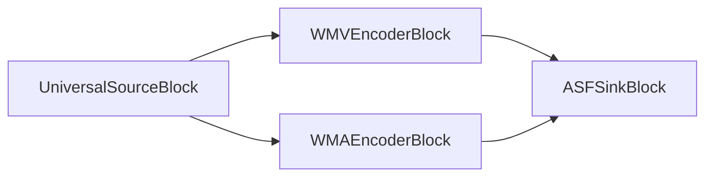
```mermaid
graph LR;
    UniversalSourceBlock-->WMVEncoderBlock;
    UniversalSourceBlock-->WMAEncoderBlock;
    WMVEncoderBlock-->ASFSinkBlock;
    WMAEncoderBlock-->ASFSinkBlock;
```

#### Sample code

```csharp
var pipeline = new MediaBlocksPipeline();

var filename = "test.mp4";
var fileSource = new UniversalSourceBlock(await UniversalSourceSettings.CreateAsync(new Uri(filename)));

var audioEncoderBlock = new WMAEncoderBlock(new WMAEncoderSettings());
pipeline.Connect(fileSource.AudioOutput, audioEncoderBlock.Input);

var videoEncoderBlock = new WMVEncoderBlock(new WMVEncoderSettings());
pipeline.Connect(fileSource.VideoOutput, videoEncoderBlock.Input);

var sinkBlock = new ASFSinkBlock(new ASFSinkSettings(@"output.wmv"));
pipeline.Connect(audioEncoderBlock.Output, sinkBlock.CreateNewInput(MediaBlockPadMediaType.Audio));
pipeline.Connect(videoEncoderBlock.Output, sinkBlock.CreateNewInput(MediaBlockPadMediaType.Video));

await pipeline.StartAsync();
```

#### Platforms

Windows, macOS, Linux, iOS, Android.

### AVI

AVI (Audio Video Interleave) is a multimedia container format introduced by Microsoft. It enables simultaneous audio-with-video playback by alternating segments of audio and video data.

Use the `AVISinkSettings` class to set the parameters.

#### Block info

Name: AVISinkBlock.

| Pin direction | Media type | Pins count |
| --- | :---: | :---: |
| Input audio | audio/x-raw | one or more |
| | audio/mpeg | |
| | audio/x-ac3 | |
| | audio/x-alaw | |
| | audio/x-mulaw | |
| Input video | video/x-raw | one or more |
| | image/jpeg | |
| | video/x-divx | |
| | video/x-msmpeg | |
| | video/mpeg | |
| | video/x-h263 | |
| | video/x-h264 | |
| | video/x-dv | |
| | video/x-huffyuv | |
| | image/png | |

#### The sample pipeline

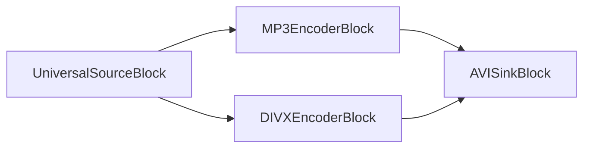
```mermaid
graph LR;
    UniversalSourceBlock-->MP3EncoderBlock;
    UniversalSourceBlock-->DIVXEncoderBlock;
    MP3EncoderBlock-->AVISinkBlock;
    DIVXEncoderBlock-->AVISinkBlock;
```

#### Sample code

```csharp
var pipeline = new MediaBlocksPipeline();

var filename = "test.mp4";
var fileSource = new UniversalSourceBlock(await UniversalSourceSettings.CreateAsync(new Uri(filename)));

var audioEncoderBlock = new MP3EncoderBlock(new MP3EncoderSettings() { Bitrate = 192 });
pipeline.Connect(fileSource.AudioOutput, audioEncoderBlock.Input);

var videoEncoderBlock = new DIVXEncoderBlock(new DIVXEncoderSettings());
pipeline.Connect(fileSource.VideoOutput, videoEncoderBlock.Input);

var sinkBlock = new AVISinkBlock(new AVISinkSettings(@"output.avi"));
pipeline.Connect(audioEncoderBlock.Output, sinkBlock.CreateNewInput(MediaBlockPadMediaType.Audio));
pipeline.Connect(videoEncoderBlock.Output, sinkBlock.CreateNewInput(MediaBlockPadMediaType.Video));

await pipeline.StartAsync();
```

#### Platforms

Windows, macOS, Linux, iOS, Android.

### RAW File

Universal output to a file. This sink is used inside all other higher-level sinks, e.g. MP4Sink. It can be used to write RAW video or audio to a file.

#### Block info

Name: FileSinkBlock.

| Pin direction | Media type | Pins count |
| --- | :---: | :---: |
| Input | Any stream format | 1 |

#### The sample pipeline


```mermaid
graph LR;
    UniversalSourceBlock-->MP3EncoderBlock;
    MP3EncoderBlock-->AVISinkBlock;
```

#### Sample code

```csharp
var pipeline = new MediaBlocksPipeline();

var filename = "test.mp3";
var fileSource = new UniversalSourceBlock(await UniversalSourceSettings.CreateAsync(new Uri(filename)));

var mp3EncoderBlock = new MP3EncoderBlock(new MP3EncoderSettings() { Bitrate = 192 });
pipeline.Connect(fileSource.AudioOutput, mp3EncoderBlock.Input);

var fileSinkBlock = new FileSinkBlock(@"output.mp3");
pipeline.Connect(mp3EncoderBlock.Output, fileSinkBlock.Input);

await pipeline.StartAsync();
```

#### Platforms

Windows, macOS, Linux, iOS, Android.

### MKV

MKV (Matroska) is an open standard free container format, similar to MP4 and AVI but with more flexibility and advanced features.

Use the `MKVSinkSettings` class to set the parameters.

#### Block info

Name: MKVSinkBlock.

| Pin direction | Media type | Pins count |
| --- | :---: | :---: |
| Input audio | audio/x-raw | one or more |
| | audio/mpeg | |
| | audio/x-ac3 | |
| | audio/x-alaw | |
| | audio/x-mulaw | |
| | audio/x-wma | |
| | audio/x-vorbis | |
| | audio/x-opus | |
| | audio/x-flac | |
| Input video | video/x-raw | one or more |
| | image/jpeg | |
| | video/x-divx | |
| | video/x-msmpeg | |
| | video/mpeg | |
| | video/x-h263 | |
| | video/x-h264 | |
| | video/x-h265 | |
| | video/x-dv | |
| | video/x-huffyuv | |
| | video/x-wmv | |
| | video/x-jpc | |
| | video/x-vp8 | |
| | video/x-vp9 | |
| | video/x-theora | |
| | image/png | |

#### The sample pipeline

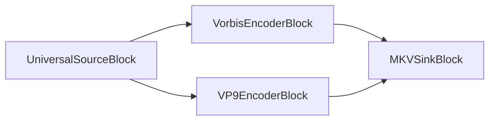
```mermaid
graph LR;
    UniversalSourceBlock-->VorbisEncoderBlock;
    UniversalSourceBlock-->VP9EncoderBlock;
    VorbisEncoderBlock-->MKVSinkBlock;
    VP9EncoderBlock-->MKVSinkBlock;
```

#### Sample code

```csharp
var pipeline = new MediaBlocksPipeline();

var filename = "test.mp4";
var fileSource = new UniversalSourceBlock(await UniversalSourceSettings.CreateAsync(new Uri(filename)));

var audioEncoderBlock = new VorbisEncoderBlock(new VorbisEncoderSettings() { Bitrate = 192 });
pipeline.Connect(fileSource.AudioOutput, audioEncoderBlock.Input);

var videoEncoderBlock = new VP9EncoderBlock(new VP9EncoderSettings() { Bitrate = 2000 });
pipeline.Connect(fileSource.VideoOutput, videoEncoderBlock.Input);

var sinkBlock = new MKVSinkBlock(new MKVSinkSettings(@"output.mkv"));
pipeline.Connect(audioEncoderBlock.Output, sinkBlock.CreateNewInput(MediaBlockPadMediaType.Audio));
pipeline.Connect(videoEncoderBlock.Output, sinkBlock.CreateNewInput(MediaBlockPadMediaType.Video));

await pipeline.StartAsync();
```

#### Platforms

Windows, macOS, Linux, iOS, Android.

### MOV

MOV (QuickTime File Format) is a multimedia container format developed by Apple for storing video, audio, and other time-based media. It supports various codecs and is widely used for multimedia content on Apple platforms, and also in professional video editing.

Use the `MOVSinkSettings` class to set the parameters.

#### Block info

Name: MOVSinkBlock.

| Pin direction | Media type | Pins count |
| --- | :---: | :---: |
| Input audio | audio/x-raw | one or more |
| | audio/mpeg | |
| | audio/x-ac3 | |
| | audio/x-alaw | |
| | audio/x-mulaw | |
| | audio/AAC | |
| Input video | video/x-raw | one or more |
| | image/jpeg | |
| | video/x-divx | |
| | video/x-msmpeg | |
| | video/mpeg | |
| | video/x-h263 | |
| | video/x-h264 | |
| | video/x-h265 | |
| | video/x-dv | |
| | video/x-huffyuv | |
| | image/png | |

#### The sample pipeline

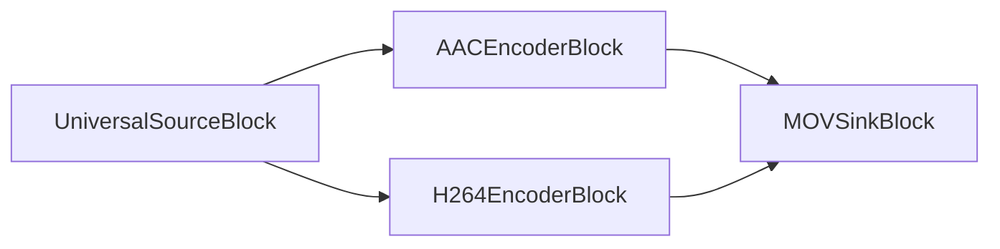
```mermaid
graph LR;
    UniversalSourceBlock-->AACEncoderBlock;
    UniversalSourceBlock-->H264EncoderBlock;
    AACEncoderBlock-->MOVSinkBlock;
    H264EncoderBlock-->MOVSinkBlock;
```

#### Sample code

```csharp
var pipeline = new MediaBlocksPipeline();

var filename = "test.mp4";
var fileSource = new UniversalSourceBlock(await UniversalSourceSettings.CreateAsync(new Uri(filename)));

var audioEncoderBlock = new AACEncoderBlock(new AACEncoderSettings() { Bitrate = 192 });
pipeline.Connect(fileSource.AudioOutput, audioEncoderBlock.Input);

var videoEncoderBlock = new H264EncoderBlock(new OpenH264EncoderSettings());
pipeline.Connect(fileSource.VideoOutput, videoEncoderBlock.Input);

var sinkBlock = new MOVSinkBlock(new MOVSinkSettings(@"output.mov"));
pipeline.Connect(audioEncoderBlock.Output, sinkBlock.CreateNewInput(MediaBlockPadMediaType.Audio));
pipeline.Connect(videoEncoderBlock.Output, sinkBlock.CreateNewInput(MediaBlockPadMediaType.Video));

await pipeline.StartAsync();
```

#### Platforms

Windows, macOS, Linux, iOS, Android.

### MP4

MP4 (MPEG-4 Part 14) is a digital multimedia container format used to store video, audio, and other data such as subtitles and images. It's widely used for sharing video content online and is compatible with a wide range of devices and platforms.

Use the `MP4SinkSettings` class to set the parameters.

#### Block info

Name: MP4SinkBlock.

| Pin direction | Media type | Pins count |
| --- | :---: | :---: |
| Input audio | audio/x-raw | one or more |
| | audio/mpeg | |
| | audio/x-ac3 | |
| | audio/x-alaw | |
| | audio/x-mulaw | |
| | audio/AAC | |
| Input video | video/x-raw | one or more |
| | image/jpeg | |
| | video/x-divx | |
| | video/x-msmpeg | |
| | video/mpeg | |
| | video/x-h263 | |
| | video/x-h264 | |
| | video/x-h265 | |
| | video/x-dv | |
| | video/x-huffyuv | |
| | image/png | |

#### The sample pipeline

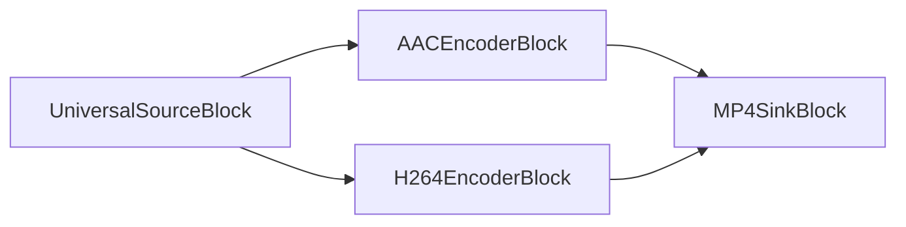
```mermaid
graph LR;
    UniversalSourceBlock-->AACEncoderBlock;
    UniversalSourceBlock-->H264EncoderBlock;
    AACEncoderBlock-->MP4SinkBlock;
    H264EncoderBlock-->MP4SinkBlock;
```

#### Sample code

```csharp
var pipeline = new MediaBlocksPipeline();

var filename = "test.mp4";
var fileSource = new UniversalSourceBlock(await UniversalSourceSettings.CreateAsync(new Uri(filename)));

var audioEncoderBlock = new AACEncoderBlock(new AACEncoderSettings() { Bitrate = 192 });
pipeline.Connect(fileSource.AudioOutput, audioEncoderBlock.Input);

var videoEncoderBlock = new H264EncoderBlock(new OpenH264EncoderSettings());
pipeline.Connect(fileSource.VideoOutput, videoEncoderBlock.Input);

var sinkBlock = new MP4SinkBlock(new MP4SinkSettings(@"output.mp4"));
pipeline.Connect(audioEncoderBlock.Output, sinkBlock.CreateNewInput(MediaBlockPadMediaType.Audio));
pipeline.Connect(videoEncoderBlock.Output, sinkBlock.CreateNewInput(MediaBlockPadMediaType.Video));

await pipeline.StartAsync();
```

#### Platforms

Windows, macOS, Linux, iOS, Android.

### MPEG-PS

MPEG-PS (MPEG Program Stream) is a container format for multiplexing digital audio, video, and other data. It is designed for reasonably reliable media, such as DVDs, CD-ROMs, and other disc media.

Use the `MPEGPSSinkSettings` class to set the parameters.

#### Block info

Name: MPEGPSSinkBlock.

| Pin direction | Media type | Pins count |
| --- | :---: | :---: |
| Input audio | audio/x-raw | one or more |
| | audio/mpeg | |
| | audio/x-ac3 | |
| | audio/x-alaw | |
| | audio/x-mulaw | |
| Input video | video/x-raw | one or more |
| | image/jpeg | |
| | video/x-msmpeg | |
| | video/mpeg | |
| | video/x-h263 | |
| | video/x-h264 | |

#### The sample pipeline

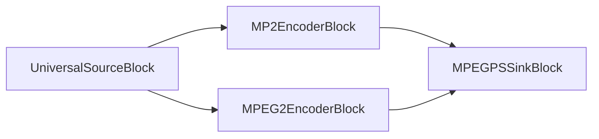
```mermaid
graph LR;
    UniversalSourceBlock-->MP2EncoderBlock;
    UniversalSourceBlock-->MPEG2EncoderBlock;
    MP2EncoderBlock-->MPEGPSSinkBlock;
    MPEG2EncoderBlock-->MPEGPSSinkBlock;
```

#### Sample code

```csharp
var pipeline = new MediaBlocksPipeline();

var filename = "test.mp4";
var fileSource = new UniversalSourceBlock(await UniversalSourceSettings.CreateAsync(new Uri(filename)));

var audioEncoderBlock = new MP2EncoderBlock(new MP2EncoderSettings() { Bitrate = 192 });
pipeline.Connect(fileSource.AudioOutput, audioEncoderBlock.Input);

var videoEncoderBlock = new MPEG2EncoderBlock(new MPEG2EncoderSettings());
pipeline.Connect(fileSource.VideoOutput, videoEncoderBlock.Input);

var sinkBlock = new MPEGPSSinkBlock(new MPEGPSSinkSettings(@"output.mpg"));
pipeline.Connect(audioEncoderBlock.Output, sinkBlock.CreateNewInput(MediaBlockPadMediaType.Audio));
pipeline.Connect(videoEncoderBlock.Output, sinkBlock.CreateNewInput(MediaBlockPadMediaType.Video));

await pipeline.StartAsync();
```

#### Platforms

Windows, macOS, Linux, iOS, Android.

### MPEG-TS

MPEG-TS (MPEG Transport Stream) is a standard digital container format for transmission and storage of audio, video, and Program and System Information Protocol (PSIP) data. It is used in broadcast systems such as DVB, ATSC and IPTV.

Use the `MPEGTSSinkSettings` class to set the parameters.

#### Block info

Name: MPEGTSSinkBlock.

| Pin direction | Media type | Pins count |
| --- | :---: | :---: |
| Input audio | audio/x-raw | one or more |
| | audio/mpeg | |
| | audio/x-ac3 | |
| | audio/x-alaw | |
| | audio/x-mulaw | |
| | audio/AAC | |
| Input video | video/x-raw | one or more |
| | image/jpeg | |
| | video/x-msmpeg | |
| | video/mpeg | |
| | video/x-h263 | |
| | video/x-h264 | |
| | video/x-h265 | |

#### The sample pipeline

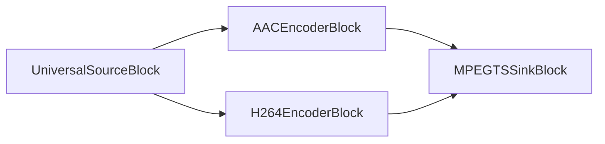
```mermaid
graph LR;
    UniversalSourceBlock-->AACEncoderBlock;
    UniversalSourceBlock-->H264EncoderBlock;
    AACEncoderBlock-->MPEGTSSinkBlock;
    H264EncoderBlock-->MPEGTSSinkBlock;
```

#### Sample code

```csharp
var pipeline = new MediaBlocksPipeline();

var filename = "test.mp4";
var fileSource = new UniversalSourceBlock(await UniversalSourceSettings.CreateAsync(new Uri(filename)));

var audioEncoderBlock = new AACEncoderBlock(new AACEncoderSettings() { Bitrate = 192 });
pipeline.Connect(fileSource.AudioOutput, audioEncoderBlock.Input);

var videoEncoderBlock = new H264EncoderBlock(new OpenH264EncoderSettings());
pipeline.Connect(fileSource.VideoOutput, videoEncoderBlock.Input);

var sinkBlock = new MPEGTSSinkBlock(new MPEGTSSinkSettings(@"output.ts"));
pipeline.Connect(audioEncoderBlock.Output, sinkBlock.CreateNewInput(MediaBlockPadMediaType.Audio));
pipeline.Connect(videoEncoderBlock.Output, sinkBlock.CreateNewInput(MediaBlockPadMediaType.Video));

await pipeline.StartAsync();
```

#### Platforms

Windows, macOS, Linux, iOS, Android.

### MXF

MXF (Material Exchange Format) is a container format for professional digital video and audio media, developed to address issues such as file exchange, interoperability, and to improve project workflow between production houses and content/equipment providers.

Use the `MXFSinkSettings` class to set the parameters.

#### Block info

Name: MXFSinkBlock.

| Pin direction | Media type | Pins count |
| --- | :---: | :---: |
| Input audio | audio/x-raw | one or more |
| | audio/mpeg | |
| | audio/x-ac3 | |
| | audio/x-alaw | |
| | audio/x-mulaw | |
| | audio/AAC | |
| Input video | video/x-raw | one or more |
| | image/jpeg | |
| | video/x-divx | |
| | video/x-msmpeg | |
| | video/mpeg | |
| | video/x-h263 | |
| | video/x-h264 | |
| | video/x-h265 | |
| | video/x-dv | |
| | image/png | |

#### The sample pipeline

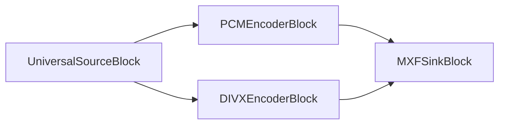
```mermaid
graph LR;
    UniversalSourceBlock-->PCMEncoderBlock;
    UniversalSourceBlock-->DIVXEncoderBlock;
    PCMEncoderBlock-->MXFSinkBlock;
    DIVXEncoderBlock-->MXFSinkBlock;
```

#### Sample code

```csharp
var pipeline = new MediaBlocksPipeline();

var filename = "test.mp4";
var fileSource = new UniversalSourceBlock(await UniversalSourceSettings.CreateAsync(new Uri(filename)));

var audioBlock = new PCMEncoderBlock(new PCMEncoderSettings());
pipeline.Connect(fileSource.AudioOutput, audioBlock.Input);

var videoEncoderBlock = new DIVXEncoderBlock(new DIVXEncoderSettings());
pipeline.Connect(fileSource.VideoOutput, videoEncoderBlock.Input);

var sinkBlock = new MXFSinkBlock(new MXFSinkSettings(@"output.mxf"));
pipeline.Connect(audioBlock.Output, sinkBlock.CreateNewInput(MediaBlockPadMediaType.Audio));
pipeline.Connect(videoEncoderBlock.Output, sinkBlock.CreateNewInput(MediaBlockPadMediaType.Video));

await pipeline.StartAsync();
```

#### Platforms

Windows, macOS, Linux, iOS, Android.

### OGG

OGG is a free, open container format designed for efficient streaming and manipulation of high quality digital multimedia. It is developed by the Xiph.Org Foundation and supports audio codecs like Vorbis, Opus, and FLAC, and video codecs like Theora.

Use the `OGGSinkSettings` class to set the parameters.

#### Block info

Name: OGGSinkBlock.

| Pin direction | Media type | Pins count |
| --- | :---: | :---: |
| Input audio | audio/x-raw | one or more |
| | audio/x-vorbis | |
| | audio/x-flac | |
| | audio/x-speex | |
| | audio/x-celt | |
| | audio/x-opus | |
| Input video | video/x-raw | one or more |
| | video/x-theora | |
| | video/x-dirac | |

#### The sample pipeline

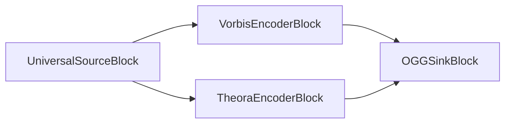
```mermaid
graph LR;
    UniversalSourceBlock-->VorbisEncoderBlock;
    UniversalSourceBlock-->TheoraEncoderBlock;
    VorbisEncoderBlock-->OGGSinkBlock;
    TheoraEncoderBlock-->OGGSinkBlock;
```

#### Sample code

```csharp
var pipeline = new MediaBlocksPipeline();

var filename = "test.mp4";
var fileSource = new UniversalSourceBlock(await UniversalSourceSettings.CreateAsync(new Uri(filename)));

var audioEncoderBlock = new VorbisEncoderBlock(new VorbisEncoderSettings() { Bitrate = 192 });
pipeline.Connect(fileSource.AudioOutput, audioEncoderBlock.Input);

var videoEncoderBlock = new TheoraEncoderBlock(new TheoraEncoderSettings());
pipeline.Connect(fileSource.VideoOutput, videoEncoderBlock.Input);

var sinkBlock = new OGGSinkBlock(new OGGSinkSettings(@"output.ogg"));
pipeline.Connect(audioEncoderBlock.Output, sinkBlock.CreateNewInput(MediaBlockPadMediaType.Audio));
pipeline.Connect(videoEncoderBlock.Output, sinkBlock.CreateNewInput(MediaBlockPadMediaType.Video));

await pipeline.StartAsync();
```

#### Platforms

Windows, macOS, Linux, iOS, Android.

### WAV

WAV (Waveform Audio File Format) is an audio file format standard developed by IBM and Microsoft for storing audio bitstreams on PCs. It is the main format used on Windows systems for raw and typically uncompressed audio.

Use the `WAVSinkSettings` class to set the parameters.

#### Block info

Name: WAVSinkBlock.

| Pin direction | Media type | Pins count |
| --- | :---: | :---: |
| Input audio | audio/x-raw | one |
| | audio/x-alaw | |
| | audio/x-mulaw | |

#### The sample pipeline


```mermaid
graph LR;
    UniversalSourceBlock-->PCMEncoderBlock;
    PCMEncoderBlock-->WAVSinkBlock;
```

### Sample code

```csharp
var pipeline = new MediaBlocksPipeline();

var filename = "test.mp3";
var fileSource = new UniversalSourceBlock(await UniversalSourceSettings.CreateAsync(new Uri(filename)));

var audioBlock = new PCMEncoderBlock(new PCMEncoderSettings());
pipeline.Connect(fileSource.AudioOutput, audioBlock.Input);

var sinkBlock = new WAVSinkBlock(new WAVSinkSettings(@"output.wav"));
pipeline.Connect(audioBlock.Output, sinkBlock.Input);

await pipeline.StartAsync();
```

#### Platforms

Windows, macOS, Linux, iOS, Android.

### WebM

WebM is an open, royalty-free, media file format designed for the web. WebM defines the file container structure, video and audio formats. WebM files consist of video streams compressed with the VP8 or VP9 video codecs and audio streams compressed with the Vorbis or Opus audio codecs.

Use the `WebMSinkSettings` class to set the parameters.

#### Block info

Name: WebMSinkBlock.

| Pin direction | Media type | Pins count |
| --- | :---: | :---: |
| Input audio | audio/x-raw | one or more |
| | audio/x-vorbis | |
| | audio/x-opus | |
| Input video | video/x-raw | one or more |
| | video/x-vp8 | |
| | video/x-vp9 | |

#### The sample pipeline

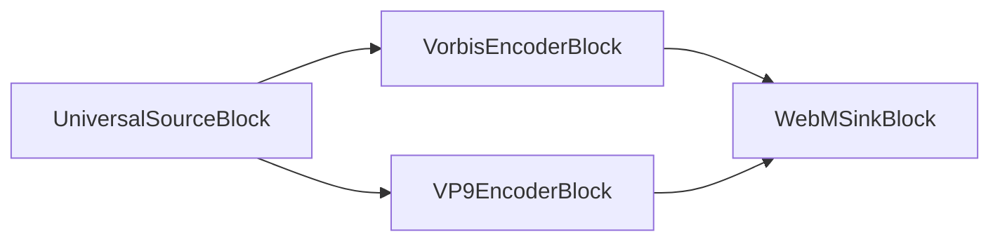
```mermaid
graph LR;
    UniversalSourceBlock-->VorbisEncoderBlock;
    UniversalSourceBlock-->VP9EncoderBlock;
    VorbisEncoderBlock-->WebMSinkBlock;
    VP9EncoderBlock-->WebMSinkBlock;
```

#### Sample code

```csharp
var pipeline = new MediaBlocksPipeline();

var filename = "test.mp4";
var fileSource = new UniversalSourceBlock(await UniversalSourceSettings.CreateAsync(new Uri(filename)));

var audioEncoderBlock = new VorbisEncoderBlock(new VorbisEncoderSettings() { Bitrate = 192 });
pipeline.Connect(fileSource.AudioOutput, audioEncoderBlock.Input);

var videoEncoderBlock = new VP9EncoderBlock(new VP9EncoderSettings());
pipeline.Connect(fileSource.VideoOutput, videoEncoderBlock.Input);

var sinkBlock = new WebMSinkBlock(new WebMSinkSettings(@"output.webm"));
pipeline.Connect(audioEncoderBlock.Output, sinkBlock.CreateNewInput(MediaBlockPadMediaType.Audio));
pipeline.Connect(videoEncoderBlock.Output, sinkBlock.CreateNewInput(MediaBlockPadMediaType.Video));

await pipeline.StartAsync();
```

#### Platforms

Windows, macOS, Linux, iOS, Android.

## Network Streaming Sinks

### RTMP

`RTMP (Real-Time Messaging Protocol)`: Developed by Adobe, RTMP is a protocol used for streaming audio, video, and data over the Internet, optimized for high-performance transmission. It enables efficient, low-latency communication, commonly used in live broadcasting like sports events and concerts.

Use the `RTMPSinkSettings` class to set the parameters.

#### Block info

Name: RTMPSinkBlock.

| Pin direction |  Media type  | Pins count  |
| --- |:------------:|:-----------:|
| Input audio | audio/mpeg [1,2,4]   |     one     |
| | audio/x-adpcm  |
| | PCM [U8, S16LE] |        |
| | audio/x-speex  |        |
| | audio/x-mulaw  |        |
| | audio/x-alaw  |        |
| | audio/x-nellymoser  |        |
| Input video | video/x-h264   |     one     |

#### The sample pipeline

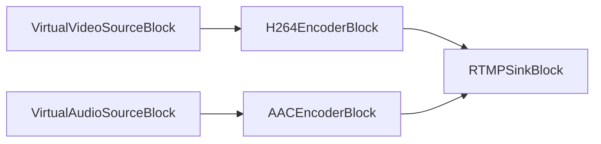
```mermaid
graph LR;
    VirtualVideoSourceBlock-->H264EncoderBlock;
    VirtualAudioSourceBlock-->AACEncoderBlock;
    H264EncoderBlock-->RTMPSinkBlock;
    AACEncoderBlock-->RTMPSinkBlock;
```

#### Sample code

```csharp
// Pipeline
var pipeline = new MediaBlocksPipeline();

// video and audio sources
var virtualVideoSource = new VirtualVideoSourceSettings
{
    Width = 1280,
    Height = 720,
    FrameRate = VideoFrameRate.FPS_25,
};

var videoSource = new VirtualVideoSourceBlock(virtualVideoSource);

var virtualAudioSource = new VirtualAudioSourceSettings
{
     Channels = 2,
     SampleRate = 44100,
};

var audioSource = new VirtualAudioSourceBlock(virtualAudioSource);

// H264/AAC encoders
var h264Encoder = new H264EncoderBlock(new OpenH264EncoderSettings());
var aacEncoder = new AACEncoderBlock();

pipeline.Connect(videoSource.Output, h264Encoder.Input);
pipeline.Connect(audioSource.Output, aacEncoder.Input);

// RTMP sink
var sink = new RTMPSinkBlock(new RTMPSinkSettings());
pipeline.Connect(h264Encoder.Output, sink.CreateNewInput(MediaBlockPadMediaType.Video));
pipeline.Connect(aacEncoder.Output, sink.CreateNewInput(MediaBlockPadMediaType.Audio));

// Start
await pipeline.StartAsync();
```

#### Platforms

Windows, macOS, Linux, iOS, Android.

### Facebook Live

Facebook Live is a feature that allows live streaming of video on Facebook. The livestream can be published to personal profiles, pages, or groups.

Use the `FacebookLiveSinkSettings` class to set the parameters.

#### Block info

Name: FacebookLiveSinkBlock.

| Pin direction |  Media type  | Pins count  |
| --- |:------------:|:-----------:|
| Input audio | audio/mpeg [1,2,4]   |     one     |
| | audio/x-adpcm  |
| | PCM [U8, S16LE] |        |
| | audio/x-speex  |        |
| | audio/x-mulaw  |        |
| | audio/x-alaw  |        |
| | audio/x-nellymoser  |        |
| Input video | video/x-h264   |     one     |

#### The sample pipeline

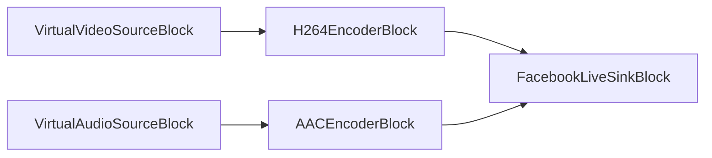
```mermaid
graph LR;
    VirtualVideoSourceBlock-->H264EncoderBlock;
    VirtualAudioSourceBlock-->AACEncoderBlock;
    H264EncoderBlock-->FacebookLiveSinkBlock;
    AACEncoderBlock-->FacebookLiveSinkBlock;
```

#### Sample code

```csharp
// Pipeline
var pipeline = new MediaBlocksPipeline();

// video and audio sources
var virtualVideoSource = new VirtualVideoSourceSettings
{
    Width = 1280,
    Height = 720,
    FrameRate = VideoFrameRate.FPS_25,
};

var videoSource = new VirtualVideoSourceBlock(virtualVideoSource);

var virtualAudioSource = new VirtualAudioSourceSettings
{
     Channels = 2,
     SampleRate = 44100,
};

var audioSource = new VirtualAudioSourceBlock(virtualAudioSource);

// H264/AAC encoders
var h264Encoder = new H264EncoderBlock(new OpenH264EncoderSettings());
var aacEncoder = new AACEncoderBlock();

pipeline.Connect(videoSource.Output, h264Encoder.Input);
pipeline.Connect(audioSource.Output, aacEncoder.Input);

// Facebook Live sink
var sink = new FacebookLiveSinkBlock(new FacebookLiveSinkSettings(
    "https://facebook.com/rtmp/...",
    "your_stream_key"));
pipeline.Connect(h264Encoder.Output, sink.CreateNewInput(MediaBlockPadMediaType.Video));
pipeline.Connect(aacEncoder.Output, sink.CreateNewInput(MediaBlockPadMediaType.Audio));

// Start
await pipeline.StartAsync();
```

#### Platforms

Windows, macOS, Linux, iOS, Android.

### HLS

HLS (HTTP Live Streaming) is an HTTP-based adaptive streaming communications protocol developed by Apple. It enables adaptive bitrate streaming by breaking the stream into a sequence of small HTTP-based file segments.

The HLS sink supports multiple implementations:
- **hlssink3** (recommended): Latest implementation with MPEG-TS segments and advanced features
- **hlsmultivariantsink**: Multi-bitrate adaptive streaming with automatic master playlist generation
- **hlscmafsink**: CMAF/fMP4 segments for better compatibility with modern players
- **hlssink2** (legacy): Original implementation with MPEG-TS segments

Use the `HLSSinkSettings` class to configure parameters. The sink automatically selects the best available implementation by default.

#### Block info

Name: HLSSinkBlock.

| Pin direction | Media type | Pins count |
| --- | :---: | :---: |
| Input audio | audio/mpeg | one or more |
| | audio/x-ac3 | |
| | audio/x-alaw | |
| | audio/x-mulaw | |
| | audio/AAC | |
| Input video | video/x-raw | one or more |
| | image/jpeg | |
| | video/x-msmpeg | |
| | video/mpeg | |
| | video/x-h263 | |
| | video/x-h264 | |
| | video/x-h265 | |

#### The sample pipeline

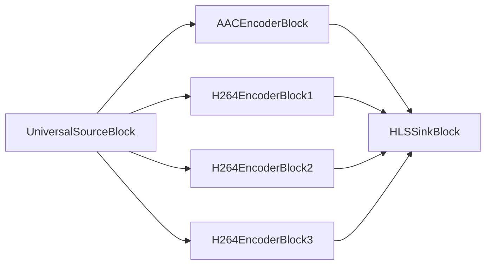
```mermaid
graph LR;
    UniversalSourceBlock-->AACEncoderBlock;
    UniversalSourceBlock-->H264EncoderBlock1;
    UniversalSourceBlock-->H264EncoderBlock2;
    UniversalSourceBlock-->H264EncoderBlock3;
    AACEncoderBlock-->HLSSinkBlock;
    H264EncoderBlock1-->HLSSinkBlock;
    H264EncoderBlock2-->HLSSinkBlock;
    H264EncoderBlock3-->HLSSinkBlock;
```

#### Sample code

##### Basic HLS Streaming (Auto mode)

```csharp
var pipeline = new MediaBlocksPipeline();

var filename = "test.mp4";
var fileSource = new UniversalSourceBlock(await UniversalSourceSettings.CreateAsync(new Uri(filename)));

var audioEncoderBlock = new AACEncoderBlock(new AACEncoderSettings() { Bitrate = 192 });
pipeline.Connect(fileSource.AudioOutput, audioEncoderBlock.Input);

// 3 video encoders with different bitrates for adaptive streaming
var videoEncoderBlock1 = new H264EncoderBlock(new OpenH264EncoderSettings { Bitrate = 3000, Width = 1920, Height = 1080 });
var videoEncoderBlock2 = new H264EncoderBlock(new OpenH264EncoderSettings { Bitrate = 1500, Width = 1280, Height = 720 });
var videoEncoderBlock3 = new H264EncoderBlock(new OpenH264EncoderSettings { Bitrate = 800, Width = 854, Height = 480 });

pipeline.Connect(fileSource.VideoOutput, videoEncoderBlock1.Input);
pipeline.Connect(fileSource.VideoOutput, videoEncoderBlock2.Input);
pipeline.Connect(fileSource.VideoOutput, videoEncoderBlock3.Input);

// Configure HLS sink with automatic selection (prefers hlssink3)
var hlsSettings = new HLSSinkSettings()
{
    Location = @"c:\inetpub\wwwroot\hls\segment_%05d.ts",
    PlaylistLocation = @"c:\inetpub\wwwroot\hls\playlist.m3u8",
    PlaylistRoot = "http://localhost/hls/",
    TargetDuration = TimeSpan.FromSeconds(6),
    PlaylistLength = 5,
    MaxFiles = 10,
    PlaylistType = HLSPlaylistType.Event,
    Custom_HTTP_Server_Enabled = true,
    Custom_HTTP_Server_Port = 8080
};

var sinkBlock = new HLSSinkBlock(hlsSettings);

// Connect audio
pipeline.Connect(audioEncoderBlock.Output, sinkBlock.CreateNewInput(MediaBlockPadMediaType.Audio));

// Connect video variants
pipeline.Connect(videoEncoderBlock1.Output, sinkBlock.CreateNewInput(MediaBlockPadMediaType.Video));
pipeline.Connect(videoEncoderBlock2.Output, sinkBlock.CreateNewInput(MediaBlockPadMediaType.Video));
pipeline.Connect(videoEncoderBlock3.Output, sinkBlock.CreateNewInput(MediaBlockPadMediaType.Video));

await pipeline.StartAsync();
```

##### CMAF/fMP4 Streaming (for better compatibility)

```csharp
// Configure HLS sink with CMAF/fMP4 segments
var hlsSettings = new HLSSinkSettings()
{
    SinkType = HLSSinkType.HlsCmafSink,
    Location = @"c:\inetpub\wwwroot\hls\segment_%05d.m4s",
    InitLocation = @"c:\inetpub\wwwroot\hls\init_%03d.mp4",
    PlaylistLocation = @"c:\inetpub\wwwroot\hls\playlist.m3u8",
    TargetDuration = TimeSpan.FromSeconds(6),
    PlaylistType = HLSPlaylistType.Event,
    EnableProgramDateTime = true,
    Sync = true  // Required for live streaming with CMAF
};

var sinkBlock = new HLSSinkBlock(hlsSettings);
// Connect streams as in the basic example
```

##### VOD (Video on Demand) Streaming

```csharp
// Configure HLS sink for VOD
var hlsSettings = new HLSSinkSettings()
{
    SinkType = HLSSinkType.HlsSink3,
    Location = @"c:\videos\hls\segment_%05d.ts",
    PlaylistLocation = @"c:\videos\hls\playlist.m3u8",
    TargetDuration = TimeSpan.FromSeconds(10),
    PlaylistType = HLSPlaylistType.Vod,  // VOD mode
    EnableEndlist = true,  // Adds #EXT-X-ENDLIST tag
    PlaylistLength = 0  // Keep all segments for VOD
};

var sinkBlock = new HLSSinkBlock(hlsSettings);
// Connect streams as in the basic example
```

##### Multi-Variant Adaptive Streaming (Master Playlist)

```csharp
// Configure HLS sink with multivariant support for true adaptive bitrate streaming
var hlsSettings = new HLSSinkSettings()
{
    SinkType = HLSSinkType.HlsMultivariantSink,
    PlaylistLocation = @"c:\inetpub\wwwroot\hls\master.m3u8",
    TargetDuration = TimeSpan.FromSeconds(6)
};

var sinkBlock = new HLSSinkBlock(hlsSettings);

// Connect multiple video variants with different qualities
// hlsmultivariantsink automatically creates variant playlists and master playlist
pipeline.Connect(videoEncoderBlock1.Output, sinkBlock.CreateNewInput(MediaBlockPadMediaType.Video));
pipeline.Connect(videoEncoderBlock2.Output, sinkBlock.CreateNewInput(MediaBlockPadMediaType.Video));
pipeline.Connect(videoEncoderBlock3.Output, sinkBlock.CreateNewInput(MediaBlockPadMediaType.Video));
pipeline.Connect(audioEncoderBlock.Output, sinkBlock.CreateNewInput(MediaBlockPadMediaType.Audio));
```

#### HLS Sink Features

##### Sink Types

- **Auto** (default): Automatically selects the best available implementation (prefers hlssink3 → hlsmultivariantsink → hlscmafsink → hlssink2)
- **HlsSink3**: Latest implementation with MPEG-TS segments, supports playlist types, program date time, and improved features
- **HlsMultivariantSink**: Multi-bitrate adaptive streaming with automatic master playlist generation for multiple quality variants
- **HlsCmafSink**: CMAF/fMP4 segments for better compatibility with modern browsers and players
- **HlsSink2**: Legacy implementation for backward compatibility

##### Playlist Types

- **Unspecified**: Live streaming without explicit playlist type tag
- **Event**: Event-style playlist where segments are not removed. #EXT-X-ENDLIST is added at the end
- **Vod**: Video on Demand playlist. Behaves like Event but sets #EXT-X-PLAYLIST-TYPE:VOD at completion

##### Key Settings

| Property | Description | Sink Support |
|----------|-------------|--------------|
| `SinkType` | Choose sink implementation (Auto, HlsSink2, HlsSink3, HlsCmafSink, HlsMultivariantSink) | All |
| `Location` | Segment file pattern (e.g., segment_%05d.ts or .m4s) | All except HlsMultivariantSink |
| `InitLocation` | Init segment pattern for CMAF (e.g., init_%03d.mp4) | HlsCmafSink |
| `PlaylistLocation` | Output playlist file path (.m3u8, master.m3u8 for multivariant) | All |
| `PlaylistRoot` | Base URL for segments in playlist | All except HlsMultivariantSink |
| `TargetDuration` | Target segment duration (TimeSpan) | All |
| `PlaylistLength` | Number of segments in playlist (0=unlimited) | All except HlsMultivariantSink |
| `MaxFiles` | Maximum files to keep on disk | All except HlsMultivariantSink |
| `PlaylistType` | Playlist type (Unspecified, Event, Vod) | HlsSink3, HlsCmafSink |
| `EnableProgramDateTime` | Add #EXT-X-PROGRAM-DATE-TIME tags | HlsSink3, HlsCmafSink |
| `EnableEndlist` | Add #EXT-X-ENDLIST at end | HlsSink3, HlsCmafSink |
| `IFramesOnly` | Create I-frames only playlist | HlsSink3 |
| `Sync` | Sync with clock (required for live CMAF) | HlsCmafSink |
| `Latency` | Latency (TimeSpan) | HlsCmafSink |
| `SendKeyframeRequests` | Request keyframes from encoder | HlsSink2, HlsSink3 |

#### Platforms

Windows, macOS, Linux, iOS, Android.

### MJPEG over HTTP

HTTP MJPEG (Motion JPEG) Live is a video streaming format where each video frame is compressed separately as a JPEG image and transmitted over HTTP. It is widely used in IP cameras and webcams due to its simplicity, although it is less efficient than modern codecs.

Use the `HTTPMJPEGLiveSinkSettings` class to set the parameters.

#### Block info

Name: HTTPMJPEGLiveSinkBlock.

| Pin direction | Media type | Pins count |
| --- | :---: | :---: |
| Input video | video/x-raw | one |
| | image/jpeg | |

#### The sample pipeline


```mermaid
graph LR;
    VirtualVideoSourceBlock-->MJPEGEncoderBlock;
    MJPEGEncoderBlock-->HTTPMJPEGLiveSinkBlock;
```

#### Sample code

```csharp
var pipeline = new MediaBlocksPipeline();

// Create virtual video source
var virtualVideoSource = new VirtualVideoSourceSettings
{
    Width = 1280,
    Height = 720,
    FrameRate = VideoFrameRate.FPS_30,
};

var videoSource = new VirtualVideoSourceBlock(virtualVideoSource);

// MJPEG encoder
var mjpegEncoder = new MJPEGEncoderBlock(new MJPEGEncoderSettings { Quality = 80 });
pipeline.Connect(videoSource.Output, mjpegEncoder.Input);

// HTTP MJPEG server
var sink = new HTTPMJPEGLiveSinkBlock(new HTTPMJPEGLiveSinkSettings
{
    Port = 8080,
    Path = "/stream"
});
pipeline.Connect(mjpegEncoder.Output, sink.Input);

// Start
await pipeline.StartAsync();

Console.WriteLine("MJPEG stream available at http://localhost:8080/stream");
Console.WriteLine("Press any key to stop...");
Console.ReadKey();
```

### Platforms

Windows, macOS, Linux, iOS, Android.

### NDI

NDI (Network Device Interface) is a royalty-free video transport standard developed by NewTek that enables video-compatible products to communicate, deliver, and receive broadcast-quality video in a high-quality, low-latency manner over standard Ethernet networks.

Use the `NDISinkSettings` class to set the parameters.

#### Block info

Name: NDISinkBlock.

| Pin direction | Media type | Pins count |
| --- | :---: | :---: |
| Input audio | audio/x-raw | one |
| Input video | video/x-raw | one |

#### The sample pipeline


```mermaid
graph LR;
    UniversalSourceBlock-->NDISinkBlock;
```

#### Sample code

```csharp
var pipeline = new MediaBlocksPipeline();

var filename = "test.mp4";
var fileSource = new UniversalSourceBlock(await UniversalSourceSettings.CreateAsync(new Uri(filename)));

var sinkBlock = new NDISinkBlock(new NDISinkSettings("My NDI Stream"));
pipeline.Connect(fileSource.AudioOutput, sinkBlock.AudioInput);
pipeline.Connect(fileSource.VideoOutput, sinkBlock.VideoInput);

await pipeline.StartAsync();
```

#### Platforms

Windows, macOS, Linux.

### SRT

SRT (Secure Reliable Transport) is an open source video transport protocol that enables the delivery of high-quality, secure, low-latency video across unpredictable networks like the public internet. It was developed by Haivision.

Use the `SRTSinkSettings` class to set the parameters.

#### Block info

Name: SRTSinkBlock.

| Pin direction | Media type | Pins count |
| --- | :---: | :---: |
| Input | Any stream format | 1 |

#### The sample pipeline


```mermaid
graph LR;
    UniversalSourceBlock-->MP4MuxerBlock;
    MP4MuxerBlock-->SRTSinkBlock;
```

#### Sample code

```csharp
var pipeline = new MediaBlocksPipeline();

var filename = "test.mp4";
var fileSource = new UniversalSourceBlock(await UniversalSourceSettings.CreateAsync(new Uri(filename)));

// Create a multiplexer block to combine audio and video
var muxer = new MP4MuxerBlock();
pipeline.Connect(fileSource.AudioOutput, muxer.CreateNewInput(MediaBlockPadMediaType.Audio));
pipeline.Connect(fileSource.VideoOutput, muxer.CreateNewInput(MediaBlockPadMediaType.Video));

// Create SRT sink in caller mode (connecting to a listener)
var srtSettings = new SRTSinkSettings
{
    Host = "srt-server.example.com",
    Port = 1234,
    Mode = SRTMode.Caller,
    Latency = 200, // milliseconds
    Passphrase = "optional-encryption-passphrase"
};

var srtSink = new SRTSinkBlock(srtSettings);
pipeline.Connect(muxer.Output, srtSink.Input);

await pipeline.StartAsync();
```

#### Platforms

Windows, macOS, Linux, iOS, Android.

### SRT MPEG-TS

SRT MPEG-TS is a combination of the SRT transport protocol with MPEG-TS container format. This allows secure, reliable transport of MPEG-TS streams over public networks, which is useful for broadcast and professional video workflows.

Use the `SRTMPEGTSSinkSettings` class to set the parameters.

#### Block info

Name: SRTMPEGTSSinkBlock.

| Pin direction | Media type | Pins count |
| --- | :---: | :---: |
| Input audio | audio/x-raw | one or more |
| | audio/mpeg | |
| | audio/x-ac3 | |
| | audio/x-alaw | |
| | audio/x-mulaw | |
| | audio/AAC | |
| Input video | video/x-raw | one or more |
| | image/jpeg | |
| | video/x-msmpeg | |
| | video/mpeg | |
| | video/x-h263 | |
| | video/x-h264 | |
| | video/x-h265 | |

#### The sample pipeline

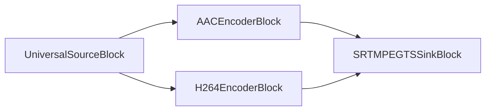
```mermaid
graph LR;
    UniversalSourceBlock-->AACEncoderBlock;
    UniversalSourceBlock-->H264EncoderBlock;
    AACEncoderBlock-->SRTMPEGTSSinkBlock;
    H264EncoderBlock-->SRTMPEGTSSinkBlock;
```

#### Sample code

```csharp
var pipeline = new MediaBlocksPipeline();

var filename = "test.mp4";
var fileSource = new UniversalSourceBlock(await UniversalSourceSettings.CreateAsync(new Uri(filename)));

var audioEncoderBlock = new AACEncoderBlock(new AACEncoderSettings() { Bitrate = 192 });
pipeline.Connect(fileSource.AudioOutput, audioEncoderBlock.Input);

var videoEncoderBlock = new H264EncoderBlock(new OpenH264EncoderSettings());
pipeline.Connect(fileSource.VideoOutput, videoEncoderBlock.Input);

// Configure SRT MPEG-TS sink
var srtMpegtsSinkSettings = new SRTMPEGTSSinkSettings
{
    Host = "srt-server.example.com",
    Port = 1234,
    Mode = SRTMode.Caller,
    Latency = 200,
    Passphrase = "optional-encryption-passphrase"
};

var sinkBlock = new SRTMPEGTSSinkBlock(srtMpegtsSinkSettings);
pipeline.Connect(audioEncoderBlock.Output, sinkBlock.CreateNewInput(MediaBlockPadMediaType.Audio));
pipeline.Connect(videoEncoderBlock.Output, sinkBlock.CreateNewInput(MediaBlockPadMediaType.Video));

await pipeline.StartAsync();
```

#### Platforms

Windows, macOS, Linux, iOS, Android.

### YouTube Live

YouTube Live is a live streaming service provided by YouTube. It allows creators to broadcast live videos to their audience through the YouTube platform.

Use the `YouTubeSinkSettings` class to set the parameters.

#### Block info

Name: YouTubeSinkBlock.

| Pin direction |  Media type  | Pins count  |
| --- |:------------:|:-----------:|
| Input audio | audio/mpeg [1,2,4]   |     one     |
| | audio/x-adpcm  |
| | PCM [U8, S16LE] |        |
| | audio/x-speex  |        |
| | audio/x-mulaw  |        |
| | audio/x-alaw  |        |
| | audio/x-nellymoser  |        |
| Input video | video/x-h264   |     one     |

#### The sample pipeline

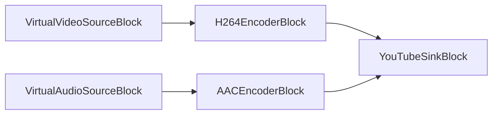
```mermaid
graph LR;
    VirtualVideoSourceBlock-->H264EncoderBlock;
    VirtualAudioSourceBlock-->AACEncoderBlock;
    H264EncoderBlock-->YouTubeSinkBlock;
    AACEncoderBlock-->YouTubeSinkBlock;
```

#### Sample code

```csharp
// Pipeline
var pipeline = new MediaBlocksPipeline();

// video and audio sources
var virtualVideoSource = new VirtualVideoSourceSettings
{
    Width = 1920,
    Height = 1080,
    FrameRate = VideoFrameRate.FPS_30,
};

var videoSource = new VirtualVideoSourceBlock(virtualVideoSource);

var virtualAudioSource = new VirtualAudioSourceSettings
{
     Channels = 2,
     SampleRate = 48000,
};

var audioSource = new VirtualAudioSourceBlock(virtualAudioSource);

// H264/AAC encoders
var h264Settings = new OpenH264EncoderSettings
{
    Bitrate = 4000, // 4 Mbps for 1080p
    KeyframeInterval = 2 // Keyframe every 2 seconds
};
var h264Encoder = new H264EncoderBlock(h264Settings);

var aacSettings = new AACEncoderSettings
{
    Bitrate = 192 // 192 kbps for audio
};
var aacEncoder = new AACEncoderBlock(aacSettings);

pipeline.Connect(videoSource.Output, h264Encoder.Input);
pipeline.Connect(audioSource.Output, aacEncoder.Input);

// YouTube Live sink
var sink = new YouTubeSinkBlock(new YouTubeSinkSettings(
    "rtmp://a.rtmp.youtube.com/live2/",
    "your_youtube_stream_key"));
pipeline.Connect(h264Encoder.Output, sink.CreateNewInput(MediaBlockPadMediaType.Video));
pipeline.Connect(aacEncoder.Output, sink.CreateNewInput(MediaBlockPadMediaType.Audio));

// Start
await pipeline.StartAsync();
```

#### Platforms

Windows, macOS, Linux, iOS, Android.

### Shoutcast

`Shoutcast` is a service for streaming media over the internet to media players, using its own cross-platform proprietary software. It allows digital audio content, primarily in MP3 or High-Efficiency Advanced Audio Coding (HE-AAC) format, to be broadcast. The most common use of Shoutcast is for creating or listening to Internet audio broadcasts.

Use the `ShoutcastSinkSettings` class to set the parameters.

#### Block info

Name: ShoutcastSinkBlock.

| Pin direction | Media type         | Pins count |
| ------------- | :----------------: | :--------: |
| Input audio   | audio/mpeg         | one        |
|               | audio/aac          |            |
|               | audio/x-aac        |            |


#### The sample pipeline

```mermaid
graph LR;
    subgraph MainPipeline
        direction LR
        A[Audio Source e.g. UniversalSourceBlock or VirtualAudioSourceBlock] --> B{Optional Audio Encoder e.g. MP3EncoderBlock};
        B --> C[ShoutcastSinkBlock];
    end
    subgraph AlternativeIfSourceEncoded
         A2[Encoded Audio Source] --> C2[ShoutcastSinkBlock];
    end
```

#### Sample code

```csharp
// Pipeline
var pipeline = new MediaBlocksPipeline();

// Audio source (e.g., from a file with MP3/AAC or raw audio)
var universalSource = new UniversalSourceBlock(await UniversalSourceSettings.CreateAsync(new Uri("input.mp3")));
// Or use VirtualAudioSourceBlock for live raw audio input:
// var audioSource = new VirtualAudioSourceBlock(new VirtualAudioSourceSettings { Channels = 2, SampleRate = 44100 });

// Optional: Audio Encoder (if source is raw audio or needs re-encoding for Shoutcast)
// Example: MP3EncoderBlock if Shoutcast server expects MP3
var mp3Encoder = new MP3EncoderBlock(new MP3EncoderSettings() { Bitrate = 128000 }); // Bitrate in bps
pipeline.Connect(universalSource.AudioOutput, mp3Encoder.Input);
// If using VirtualAudioSourceBlock: pipeline.Connect(audioSource.Output, mp3Encoder.Input);

// Shoutcast sink
// Configure the Shoutcast/Icecast server connection details
var shoutcastSettings = new ShoutcastSinkSettings
{
    IP = "your-shoutcast-server-ip", // Server hostname or IP address
    Port = 8000,                      // Server port
    Mount = "/mountpoint",            // Mount point (e.g., "/stream", "/live.mp3")
    Password = "your-password",         // Source password for the server
    Protocol = ShoutProtocol.ICY,     // ShoutProtocol.ICY for Shoutcast v1/v2 (e.g., icy://)
                                      // ShoutProtocol.HTTP for Icecast 2.x (e.g., http://)
                                      // ShoutProtocol.XAudiocast for older Shoutcast/XAudioCast

    // Metadata for the stream
    StreamName = "My Radio Stream",
    Genre = "Various",
    Description = "My awesome internet radio station",
    URL = "https://my-radio-website.com", // Homepage URL for your stream (shows up in directory metadata)
    Public = true,                       // Set to true to list on public directories (if server supports)
    Username = "source"                  // Username for authentication (often "source"; check server config)
    // Other stream parameters like audio bitrate, samplerate, channels are typically determined
    // by the properties of the encoded input audio stream fed to the ShoutcastSinkBlock.
};
var shoutcastSink = new ShoutcastSinkBlock(shoutcastSettings);

// Connect encoder's output (or source's audio output if already encoded and compatible) to Shoutcast sink
pipeline.Connect(mp3Encoder.Output, shoutcastSink.Input);
// If source is already encoded and compatible (e.g. MP3 file to MP3 Shoutcast): 
// pipeline.Connect(universalSource.AudioOutput, shoutcastSink.Input);

// Start the pipeline
await pipeline.StartAsync();

// For display purposes, you can construct a string representing the connection:
string protocolScheme = shoutcastSettings.Protocol switch
{
    ShoutProtocol.ICY => "icy",
    ShoutProtocol.HTTP => "http",
    ShoutProtocol.XAudiocast => "xaudiocast", // Note: actual scheme might be http for XAudiocast
    _ => "unknown"
};
Console.WriteLine($"Streaming to Shoutcast server: {protocolScheme}://{shoutcastSettings.IP}:{shoutcastSettings.Port}{shoutcastSettings.Mount}");
Console.WriteLine($"Stream metadata URL (for directories): {shoutcastSettings.URL}");
Console.WriteLine("Press any key to stop the stream...");
Console.ReadKey();

// Stop the pipeline (important for graceful disconnection and resource cleanup)
await pipeline.StopAsync();
```

#### Platforms

Windows, macOS, Linux, iOS, Android.

---

### DASH

The `DASHSinkBlock` creates MPEG-DASH (Dynamic Adaptive Streaming over HTTP) output — an MPD manifest and media segments — compatible with any DASH-capable player. It supports both VOD (static) and live (dynamic) streaming modes. Multiple video and audio streams can be connected simultaneously to create adaptive bitrate manifests.

#### Block info

Name: DASHSinkBlock.

| Pin direction | Media type | Pins count |
| --- | :---: | :---: |
| Input video | video/x-h264 | one or more |
| | video/x-h265 | |
| | video/x-vp9 | |
| | video/x-av1 | |
| Input audio | audio/mpeg | one or more |
| | audio/x-aac | |
| | audio/x-opus | |

#### Settings

Use `DASHSinkSettings` to configure the DASH output:

| Property | Type | Default | Description |
| --- | --- | --- | --- |
| `MPDFilename` | `string` | `c:\inetpub\wwwroot\dash\manifest.mpd` | Full path for the MPD manifest file |
| `MPDBaseURL` | `string` | `""` | Base URL prepended to segment filenames in the manifest |
| `TargetDuration` | `TimeSpan` | 5 s | Target duration per media segment |
| `MinBufferTime` | `TimeSpan` | 2 s | Minimum buffer time advertised in the manifest |
| `Dynamic` | `bool` | `false` | `false` = VOD/static; `true` = live stream |
| `PresentationDelay` | `TimeSpan` | 0 | Presentation delay (live only) |
| `MinimumUpdatePeriod` | `TimeSpan` | 0 | MPD refresh interval (live only) |
| `TimeShiftBufferDepth` | `TimeSpan` | 0 | DVR window depth (live only) |
| `SendKeyframeRequests` | `bool` | `true` | Request keyframes at segment boundaries |
| `Custom_HTTP_Server_Enabled` | `bool` | `false` | Enable built-in HTTP server for serving segments |
| `Custom_HTTP_Server_Port` | `int` | 80 | Port for the built-in HTTP server |

Call `settings.CheckAndCreateFolders()` before starting the pipeline to ensure the output directory exists.

Input pads are created dynamically: call `dashSink.CreateNewInput(MediaBlockPadMediaType.Video)` or `dashSink.CreateNewInput(MediaBlockPadMediaType.Audio)` to obtain a pad, then connect your encoder output to it.

#### The sample pipeline

```mermaid
graph LR;
    UniversalSourceBlock -- Raw Video --> H264EncoderBlock;
    UniversalSourceBlock -- Raw Audio --> AACEncoderBlock;
    H264EncoderBlock -- H.264 Video --> DASHSinkBlock;
    AACEncoderBlock -- AAC Audio --> DASHSinkBlock;
```

#### Sample code

```csharp
var pipeline = new MediaBlocksPipeline();

var dashSettings = new DASHSinkSettings
{
    MPDFilename = @"c:\output\dash\manifest.mpd",
    MPDBaseURL = "http://localhost/dash/",
    TargetDuration = TimeSpan.FromSeconds(5),
    Dynamic = false // VOD/static mode; set true for live streaming
};
dashSettings.CheckAndCreateFolders();
var dashSink = new DASHSinkBlock(dashSettings);

var universalSource = new UniversalSourceBlock(await UniversalSourceSettings.CreateAsync(new Uri("input.mp4")));
var h264Encoder = new H264EncoderBlock(new OpenH264EncoderSettings());
var aacEncoder = new AACEncoderBlock();

pipeline.Connect(universalSource.VideoOutput, h264Encoder.Input);
pipeline.Connect(universalSource.AudioOutput, aacEncoder.Input);
pipeline.Connect(h264Encoder.Output, dashSink.CreateNewInput(MediaBlockPadMediaType.Video));
pipeline.Connect(aacEncoder.Output, dashSink.CreateNewInput(MediaBlockPadMediaType.Audio));

await pipeline.StartAsync();
```

#### Availability

Check availability using `DASHSinkBlock.IsAvailable()`. Requires the GStreamer `dash` plugin and the correct VisioForge SDK redistribution package.

#### Platforms

Windows, macOS, Linux.

---

### WHIP

The `WHIPSinkBlock` streams media to WebRTC servers using the WHIP (WebRTC-HTTP Ingestion Protocol), enabling low-latency live streaming to services such as MediaMTX, Janus, Cloudflare Stream, and other WHIP-compatible endpoints. Video must be H.264 encoded and audio must be Opus encoded — RTP payloading is handled internally by the block.

#### Block info

Name: WHIPSinkBlock.

| Pin direction | Media type | Pins count |
| --- | :---: | :---: |
| Input video | video/x-h264 | 1 |
| Input audio | audio/x-opus | 1 |

#### Settings

Use `WHIPSinkSettings` to configure the WHIP endpoint:

| Property | Type | Default | Description |
| --- | --- | --- | --- |
| `Location` | `string` | `http://localhost:8889/stream/whip` | WHIP endpoint URL |
| `AuthToken` | `string` | `null` | Bearer token sent in the `Authorization` HTTP header |
| `StunServer` | `string` | `null` | STUN server URL (format: `stun://hostname:port`) |
| `TurnServer` | `string` | `null` | TURN server URL (format: `turn(s)://username:password@host:port`) |
| `UseLinkHeaders` | `bool` | `true` | Auto-configure ICE servers from WHIP server response `Link` headers |
| `Timeout` | `TimeSpan` | 15 s | Timeout for WHIP HTTP requests |
| `IceTransportPolicy` | `WHIPIceTransportPolicy` | `All` | `All` = use STUN and TURN; `Relay` = TURN relay only |

Input pads are created dynamically: call `whipSink.CreateNewInput(MediaBlockPadMediaType.Video)` and `whipSink.CreateNewInput(MediaBlockPadMediaType.Audio)` to obtain pads, then connect your encoders.

#### The sample pipeline

```mermaid
graph LR;
    UniversalSourceBlock -- Raw Video --> H264EncoderBlock;
    UniversalSourceBlock -- Raw Audio --> OpusEncoderBlock;
    H264EncoderBlock -- H.264 Video --> WHIPSinkBlock;
    OpusEncoderBlock -- Opus Audio --> WHIPSinkBlock;
```

#### Sample code

```csharp
var pipeline = new MediaBlocksPipeline();

var whipSettings = new WHIPSinkSettings
{
    Location = "http://localhost:8889/live/whip",
    AuthToken = "your-bearer-token", // optional
    StunServer = "stun://stun.l.google.com:19302"
};
var whipSink = new WHIPSinkBlock(whipSettings);

var universalSource = new UniversalSourceBlock(await UniversalSourceSettings.CreateAsync(new Uri("input.mp4")));
var h264Encoder = new H264EncoderBlock(new OpenH264EncoderSettings());
var opusEncoder = new OpusEncoderBlock();

pipeline.Connect(universalSource.VideoOutput, h264Encoder.Input);
pipeline.Connect(universalSource.AudioOutput, opusEncoder.Input);
pipeline.Connect(h264Encoder.Output, whipSink.CreateNewInput(MediaBlockPadMediaType.Video));
pipeline.Connect(opusEncoder.Output, whipSink.CreateNewInput(MediaBlockPadMediaType.Audio));

await pipeline.StartAsync();
```

#### Availability

Check availability using `WHIPSinkBlock.IsAvailable()`. Requires the GStreamer `webrtc` plugin and the correct VisioForge SDK redistribution package.

#### Platforms

Windows, macOS, Linux.

### RIST MPEG-TS

The `RISTMPEGTSSinkBlock` multiplexes audio and video streams into MPEG-TS, wraps the transport in RTP, and sends it over RIST (Reliable Internet Stream Transport). RIST adds ARQ-based retransmission over UDP, providing reliable low-latency media delivery without the overhead of TCP.

Multiple audio and video input pads are supported. Call `CreateNewInput(MediaBlockPadMediaType.Video)` and `CreateNewInput(MediaBlockPadMediaType.Audio)` to obtain pads before connecting encoders.

#### Block info

Name: RISTMPEGTSSinkBlock.

| Pin direction | Media type | Pins count |
| --- | :---: | :---: |
| Input video | Encoded video | Dynamic |
| Input audio | Encoded audio | Dynamic |

#### Settings

Use `RISTSinkSettings` to configure the destination:

| Property | Type | Default | Description |
| --- | --- | --- | --- |
| `Address` | `string` | `"localhost"` | Destination IPv4 or IPv6 address |
| `Port` | `uint` | `5004` | Destination RTP port (must be even; RTCP uses Port + 1) |
| `SenderBuffer` | `TimeSpan` | 1200 ms | Retransmission queue size |
| `BondingAddresses` | `string` | `null` | Comma-separated `address:port` pairs for bonding; overrides Address/Port |
| `BondingMethod` | `RISTBondingMethod` | `Broadcast` | `Broadcast` = send to all destinations; `RoundRobin` = alternate |
| `MulticastInterface` | `string` | `null` | Network interface for multicast |
| `MulticastTTL` | `int` | `1` | Multicast time-to-live |
| `DropNullTSPackets` | `bool` | `false` | Remove null MPEG-TS padding packets |
| `SequenceNumberExtension` | `bool` | `false` | Add RTP sequence number extension |
| `MinRTCPInterval` | `uint` | `100` | Minimum RTCP packet interval (ms) |

#### The sample pipeline

```mermaid
graph LR;
    UniversalSourceBlock -- Raw Video --> H264EncoderBlock;
    UniversalSourceBlock -- Raw Audio --> AACEncoderBlock;
    H264EncoderBlock --> RISTMPEGTSSinkBlock;
    AACEncoderBlock --> RISTMPEGTSSinkBlock;
```

#### Sample code

```csharp
var pipeline = new MediaBlocksPipeline();

var source = new UniversalSourceBlock(await UniversalSourceSettings.CreateAsync(new Uri("input.mp4")));

var h264Encoder = new H264EncoderBlock(new OpenH264EncoderSettings());
var aacEncoder = new AACEncoderBlock();

pipeline.Connect(source.VideoOutput, h264Encoder.Input);
pipeline.Connect(source.AudioOutput, aacEncoder.Input);

var ristSettings = new RISTSinkSettings
{
    Address = "192.168.1.100",
    Port = 5004,
    SenderBuffer = TimeSpan.FromMilliseconds(1200)
};

var ristSink = new RISTMPEGTSSinkBlock(ristSettings);
pipeline.Connect(h264Encoder.Output, ristSink.CreateNewInput(MediaBlockPadMediaType.Video));
pipeline.Connect(aacEncoder.Output, ristSink.CreateNewInput(MediaBlockPadMediaType.Audio));

await pipeline.StartAsync();
```

#### Availability

`RISTMPEGTSSinkBlock.IsAvailable()` returns `true` if the GStreamer `rist` plugin is present.

#### Platforms

Windows, macOS, Linux.

### UDP

UDP (User Datagram Protocol) is a lightweight, connectionless transport protocol that provides low-latency streaming with minimal overhead. Unlike TCP-based protocols, UDP doesn't guarantee packet delivery, making it ideal for real-time applications where speed is crucial.

Use the `UDPSinkSettings` class to set the parameters.

#### Block info

Name: UDPSinkBlock.

| Pin direction | Media type | Pins count |
| --- | :---: | :---: |
| Input | Any stream format | 1 |

#### The sample pipeline

```mermaid
graph LR;
    UniversalSourceBlock-->MPEGTSMuxerBlock;
    MPEGTSMuxerBlock-->UDPSinkBlock;
```

#### Sample code

```csharp
var pipeline = new MediaBlocksPipeline();

var filename = "test.mp4";
var fileSource = new UniversalSourceBlock(await UniversalSourceSettings.CreateAsync(new Uri(filename)));

// Create an MPEG-TS muxer to combine audio and video
var muxer = new MPEGTSMuxerBlock();
pipeline.Connect(fileSource.AudioOutput, muxer.CreateNewInput(MediaBlockPadMediaType.Audio));
pipeline.Connect(fileSource.VideoOutput, muxer.CreateNewInput(MediaBlockPadMediaType.Video));

// Create UDP sink
var udpSettings = new UDPSinkSettings
{
    Host = "192.168.1.100",
    Port = 5004
};

var udpSink = new UDPSinkBlock(udpSettings);
pipeline.Connect(muxer.Output, udpSink.Input);

await pipeline.StartAsync();
```

#### Platforms

Windows, macOS, Linux, iOS, Android.

### UDP MPEG-TS

UDP MPEG-TS combines MPEG-TS multiplexing with UDP transport. This allows low-latency delivery of multiplexed audio and video streams over UDP, which is widely used in broadcast, IPTV, and video surveillance workflows.

Use the `UDPSinkSettings` class to set the parameters.

#### Block info

Name: UDPMPEGTSSinkBlock.

| Pin direction | Media type | Pins count |
| --- | :---: | :---: |
| Input audio | audio/x-raw | one or more |
| | audio/mpeg | |
| | audio/x-ac3 | |
| | audio/x-alaw | |
| | audio/x-mulaw | |
| | audio/AAC | |
| Input video | video/x-raw | one or more |
| | image/jpeg | |
| | video/x-msmpeg | |
| | video/mpeg | |
| | video/x-h263 | |
| | video/x-h264 | |
| | video/x-h265 | |

#### Settings

| Property | Type | Default | Description |
| --- | --- | --- | --- |
| `Host` | `string` | `"localhost"` | Destination host/IP/multicast group |
| `Port` | `int` | `5004` | Destination port |
| `TTL` | `int` | `64` | Unicast time-to-live |
| `MulticastTTL` | `int` | `1` | Multicast time-to-live |
| `AutoMulticast` | `bool` | `true` | Auto join/leave multicast groups |
| `MulticastInterface` | `string` | `null` | Network interface for multicast |
| `Loop` | `bool` | `true` | Multicast loopback |
| `BufferSize` | `int` | `0` | Kernel send buffer size (0 = default) |
| `QosDscp` | `int` | `-1` | DSCP value (-1 = default) |
| `BindAddress` | `string` | `null` | Local address to bind |
| `BindPort` | `int` | `0` | Local port to bind (0 = auto) |
| `MuxerLatency` | `TimeSpan` | 1000 ms | MPEG-TS muxer aggregator latency |

#### The sample pipeline

```mermaid
graph LR;
    UniversalSourceBlock-->AACEncoderBlock;
    UniversalSourceBlock-->H264EncoderBlock;
    AACEncoderBlock-->UDPMPEGTSSinkBlock;
    H264EncoderBlock-->UDPMPEGTSSinkBlock;
```

#### Sample code

```csharp
var pipeline = new MediaBlocksPipeline();

var filename = "test.mp4";
var fileSource = new UniversalSourceBlock(await UniversalSourceSettings.CreateAsync(new Uri(filename)));

var audioEncoderBlock = new AACEncoderBlock(new AACEncoderSettings() { Bitrate = 192 });
pipeline.Connect(fileSource.AudioOutput, audioEncoderBlock.Input);

var videoEncoderBlock = new H264EncoderBlock(new OpenH264EncoderSettings());
pipeline.Connect(fileSource.VideoOutput, videoEncoderBlock.Input);

// Configure UDP MPEG-TS sink
var udpSettings = new UDPSinkSettings
{
    Host = "192.168.1.100",
    Port = 5004,
    TTL = 64
};

var sinkBlock = new UDPMPEGTSSinkBlock(udpSettings);
pipeline.Connect(audioEncoderBlock.Output, sinkBlock.CreateNewInput(MediaBlockPadMediaType.Audio));
pipeline.Connect(videoEncoderBlock.Output, sinkBlock.CreateNewInput(MediaBlockPadMediaType.Video));

await pipeline.StartAsync();
```

#### Availability

`UDPMPEGTSSinkBlock.IsAvailable()` returns `true` if the GStreamer `udp` plugin is present.

#### Platforms

Windows, macOS, Linux, iOS, Android.

### Multi-destination UDP

The `MultiUDPSinkBlock` sends raw data over UDP to one or multiple recipients simultaneously. Destinations are specified as comma-separated host:port pairs and can be managed using helper methods on the settings class.

Use the `MultiUDPSinkSettings` class to set the parameters.

#### Block info

Name: MultiUDPSinkBlock.

| Pin direction | Media type | Pins count |
| --- | :---: | :---: |
| Input | Any stream format | 1 |

#### The sample pipeline

```mermaid
graph LR;
    UniversalSourceBlock-->MPEGTSMuxerBlock;
    MPEGTSMuxerBlock-->MultiUDPSinkBlock;
```

#### Sample code

```csharp
var pipeline = new MediaBlocksPipeline();

var filename = "test.mp4";
var fileSource = new UniversalSourceBlock(await UniversalSourceSettings.CreateAsync(new Uri(filename)));

// Create an MPEG-TS muxer to combine audio and video
var muxer = new MPEGTSMuxerBlock();
pipeline.Connect(fileSource.AudioOutput, muxer.CreateNewInput(MediaBlockPadMediaType.Audio));
pipeline.Connect(fileSource.VideoOutput, muxer.CreateNewInput(MediaBlockPadMediaType.Video));

// Create multi-destination UDP sink
var multiUdpSettings = new MultiUDPSinkSettings();
multiUdpSettings.AddClient("192.168.1.100", 5004);
multiUdpSettings.AddClient("192.168.1.101", 5004);

var multiUdpSink = new MultiUDPSinkBlock(multiUdpSettings);
pipeline.Connect(muxer.Output, multiUdpSink.Input);

await pipeline.StartAsync();
```

#### Platforms

Windows, macOS, Linux, iOS, Android.

### Multi-destination UDP MPEG-TS

The `MultiUDPMPEGTSSinkBlock` multiplexes audio and video streams into MPEG-TS and sends the result over UDP to one or more destinations simultaneously. This is useful for broadcasting the same stream to multiple receivers, recording servers, or redundant endpoints.

Multiple audio and video input pads are supported. Call `CreateNewInput(MediaBlockPadMediaType.Video)` and `CreateNewInput(MediaBlockPadMediaType.Audio)` to obtain pads before connecting encoders.

#### Block info

Name: MultiUDPMPEGTSSinkBlock.

| Pin direction | Media type | Pins count |
| --- | :---: | :---: |
| Input audio | audio/x-raw | one or more |
| | audio/mpeg | |
| | audio/x-ac3 | |
| | audio/x-alaw | |
| | audio/x-mulaw | |
| | audio/AAC | |
| Input video | video/x-raw | one or more |
| | image/jpeg | |
| | video/x-msmpeg | |
| | video/mpeg | |
| | video/x-h263 | |
| | video/x-h264 | |
| | video/x-h265 | |

#### Settings

Use `MultiUDPSinkSettings` to configure the destinations:

| Property | Type | Default | Description |
| --- | --- | --- | --- |
| `Clients` | `string` | `""` | Comma-separated `host:port` pairs |
| `SendDuplicates` | `bool` | `true` | Send duplicates when same destination is added multiple times |
| `TTL` | `int` | `64` | Unicast time-to-live |
| `MulticastTTL` | `int` | `1` | Multicast time-to-live |
| `AutoMulticast` | `bool` | `true` | Auto join/leave multicast groups |
| `MulticastInterface` | `string` | `null` | Network interface for multicast |
| `Loop` | `bool` | `true` | Multicast loopback |
| `BufferSize` | `int` | `0` | Kernel send buffer size (0 = default) |
| `QosDscp` | `int` | `-1` | DSCP value (-1 = default) |
| `BindAddress` | `string` | `null` | Local address to bind |
| `BindPort` | `int` | `0` | Local port to bind (0 = auto) |
| `MuxerLatency` | `TimeSpan` | 1000 ms | MPEG-TS muxer aggregator latency |

#### The sample pipeline

```mermaid
graph LR;
    UniversalSourceBlock -- Raw Video --> H264EncoderBlock;
    UniversalSourceBlock -- Raw Audio --> AACEncoderBlock;
    H264EncoderBlock --> MultiUDPMPEGTSSinkBlock;
    AACEncoderBlock --> MultiUDPMPEGTSSinkBlock;
```

#### Sample code

```csharp
var pipeline = new MediaBlocksPipeline();

var source = new UniversalSourceBlock(await UniversalSourceSettings.CreateAsync(new Uri("input.mp4")));

var h264Encoder = new H264EncoderBlock(new OpenH264EncoderSettings());
var aacEncoder = new AACEncoderBlock();

pipeline.Connect(source.VideoOutput, h264Encoder.Input);
pipeline.Connect(source.AudioOutput, aacEncoder.Input);

var multiUdpSettings = new MultiUDPSinkSettings();
multiUdpSettings.AddClient("192.168.1.100", 5004);
multiUdpSettings.AddClient("192.168.1.101", 5004);

var multiUdpSink = new MultiUDPMPEGTSSinkBlock(multiUdpSettings);
pipeline.Connect(h264Encoder.Output, multiUdpSink.CreateNewInput(MediaBlockPadMediaType.Video));
pipeline.Connect(aacEncoder.Output, multiUdpSink.CreateNewInput(MediaBlockPadMediaType.Audio));

await pipeline.StartAsync();
```

#### Availability

`MultiUDPMPEGTSSinkBlock.IsAvailable()` returns `true` if the GStreamer `udp` plugin is present.

#### Platforms

Windows, macOS, Linux, iOS, Android.

## Utility Sinks

### Stream Sink

The `StreamSinkBlock` writes media data to any .NET `Stream` object, enabling flexible output to memory buffers, files, network connections, encryption layers, or any writable stream.

The stream must remain open and writable for the lifetime of the pipeline. The block does not dispose the stream when the pipeline stops.

#### Block info

Name: StreamSinkBlock.

| Pin direction | Media type | Pins count |
| --- | :---: | :---: |
| Input | Any | 1 |

#### Sample code

```csharp
var pipeline = new MediaBlocksPipeline();

var filename = "test.mp4";
var fileSource = new UniversalSourceBlock(await UniversalSourceSettings.CreateAsync(new Uri(filename)));

using var outputStream = new FileStream("output.raw", FileMode.Create, FileAccess.Write);
var streamSink = new StreamSinkBlock(outputStream);
pipeline.Connect(fileSource.VideoOutput, streamSink.Input);

await pipeline.StartAsync();
```

#### Availability

`StreamSinkBlock.IsAvailable()` returns `true` if the GStreamer `appsink` element is available.

#### Platforms

Windows, macOS, Linux, iOS, Android.

### File Descriptor Sink

The `FDSinkBlock` writes media data to a Unix file descriptor (an integer handle). This is useful for outputting to pipes, sockets, or stdin of a child process.

Pass `addQueue: true` (default) to add a buffering queue that prevents the pipeline from blocking on slow descriptor writes.

The descriptor must be open and writable before the pipeline starts. The block does not close it when the pipeline stops.

#### Block info

Name: FDSinkBlock.

| Pin direction | Media type | Pins count |
| --- | :---: | :---: |
| Input | Any | 1 |

#### Sample code

```csharp
var pipeline = new MediaBlocksPipeline();

var filename = "test.mp4";
var fileSource = new UniversalSourceBlock(await UniversalSourceSettings.CreateAsync(new Uri(filename)));

// Write to stdout (fd 1)
var fdSink = new FDSinkBlock(descriptor: 1);
pipeline.Connect(fileSource.VideoOutput, fdSink.Input);

await pipeline.StartAsync();
```

#### Availability

`FDSinkBlock.IsAvailable()` returns `true` if the GStreamer `fdsink` element is available.

#### Platforms

Linux, macOS. Limited support on Windows.

### KLV File Sink

The `KLVFileSinkBlock` writes KLV (Key-Length-Value) metadata streams to a file. KLV is used in MISB/STANAG 4609 compliant applications — including UAV video, surveillance, and aerospace — to embed geospatial metadata alongside video.

The block accepts `meta/x-klv` data on its input and writes it directly to the specified file via the GStreamer `filesink` element.

#### Block info

Name: KLVFileSinkBlock.

| Pin direction | Media type | Pins count |
| --- | :---: | :---: |
| Input | meta/x-klv | 1 |

#### Sample code

```csharp
var pipeline = new MediaBlocksPipeline();

var klvSource = new KLVSourceBlock(/* ... */);

var klvFileSink = new KLVFileSinkBlock("output_metadata.klv");
pipeline.Connect(klvSource.Output, klvFileSink.Input);

await pipeline.StartAsync();
```

#### Platforms

Windows, macOS, Linux.

### Buffer Sink

The `BufferSinkBlock` captures media data into memory and delivers it frame-by-frame via event callbacks, instead of writing to a file or network. It supports video, audio, and arbitrary data streams.

Three constructors cover the common scenarios:

- `BufferSinkBlock(VideoFormatX, bool allowFrameDrop)` — video capture with optional format conversion
- `BufferSinkBlock(AudioFormatX, bool allowFrameDrop)` — audio capture with optional resampling
- `BufferSinkBlock()` — auto-detects the media type from the connected upstream element

Key events:

- `OnVideoFrameBuffer` — raised for each decoded video frame
- `OnAudioFrameBuffer` — raised for each decoded audio frame
- `OnDataFrameBuffer` — raised for non-AV data streams
- `OnSample` — low-level GStreamer sample access; when subscribed it suppresses the three events above. **Always dispose the sample after use** to prevent memory leaks.

Set `IsSync = false` for transcoding or analysis workflows where real-time pacing is not required.

#### Block info

Name: BufferSinkBlock.

| Pin direction | Media type | Pins count |
| --- | :---: | :---: |
| Input | Any | 1 |

#### Settings

| Property | Type | Default | Description |
| --- | --- | --- | --- |
| `AllowFrameDrop` | `bool` | `false` | Drop frames when callbacks cannot keep up with the media rate |
| `IsSync` | `bool` | `true` | `true` = pace to real time; `false` = process as fast as possible |

#### The sample pipeline

```mermaid
graph LR;
    UniversalSourceBlock-->BufferSinkBlock;
```

#### Sample code

```csharp
var pipeline = new MediaBlocksPipeline();

var source = new UniversalSourceBlock(await UniversalSourceSettings.CreateAsync(new Uri("input.mp4")));

var bufferSink = new BufferSinkBlock(new VideoFormatX(VideoFormatXName.BGR, 1920, 1080));
bufferSink.OnVideoFrameBuffer += (sender, e) =>
{
    // e.Frame contains BGR pixel data, dimensions, and timestamp
    Console.WriteLine($"Frame at {e.Frame.Timestamp}: {e.Frame.Width}x{e.Frame.Height}");
};

pipeline.Connect(source.VideoOutput, bufferSink.Input);

await pipeline.StartAsync();
```

#### Availability

`BufferSinkBlock.IsAvailable()` returns `true` if the GStreamer `appsink` element is available.

#### Platforms

Windows, macOS, Linux, iOS, Android.
