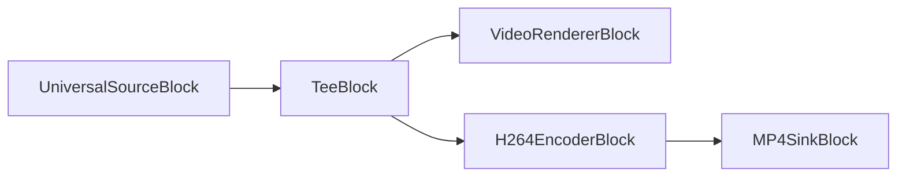
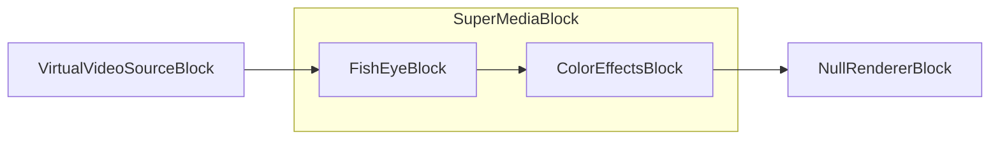

---
title: Bloques Especiales en Media Blocks SDK
description: Use bloques especiales como Null Renderer, Tee, y Super MediaBlock para pipelines personalizados con encriptación y integración avanzada GStreamer.
sidebar_label: Bloques Especiales
---

# Bloques especiales

[SDK de Media Blocks .Net](https://www.visioforge.com/media-blocks-sdk-net){ .md-button .md-button--primary target="_blank" }

## Introducción

Los bloques especiales son bloques que no encajan en ninguna otra categoría.

## Null Renderer

El bloque null renderer envía los datos a null. Este bloque puede ser requerido si su bloque tiene salidas que no quiere usar.

### Información del bloque

Nombre: NullRendererBlock.

Dirección del pin | Tipo de medio | Conteo de pines
--- | :---: | :---:
Entrada | Cualquiera | 1

### El pipeline de muestra

El pipeline de muestra se muestra abajo. Lee un archivo y envía los datos de video al grabber de muestras de video, donde puede grabar cada frame de video después de decodificación. El bloque Null renderer se usa para terminar el pipeline.


### Código de muestra

```csharp
private void Start()
{
  // crear el pipeline
  var pipeline = new MediaBlocksPipeline();

  // crear bloque fuente universal
  var filename = "test.mp4";
  var fileSource = new UniversalSourceBlock(await UniversalSourceSettings.CreateAsync(new Uri(filename)));

  // crear bloque grabber de muestras de video y agregar el manejador de eventos
  var sampleGrabber = new VideoSampleGrabberBlock();
  sampleGrabber.OnVideoFrameBuffer += sampleGrabber_OnVideoFrameBuffer;

  // crear bloque null renderer
  var nullRenderer = new NullRendererBlock();

  // conectar bloques
  pipeline.Connect(fileSource.VideoOutput, sampleGrabber.Input);        
  pipeline.Connect(sampleGrabber.Output, nullRenderer.Input);   

  // iniciar el pipeline
  await pipeline.StartAsync();
}

private void sampleGrabber_OnVideoFrameBuffer(object sender, VideoFrameXBufferEventArgs e)
{
    // recibido nuevo frame de video
}
```

### Plataformas

Windows, macOS, Linux, iOS, Android.

## Tee

El bloque tee divide el stream de datos de video o audio en múltiples streams que copian completamente el stream original.

### Información del bloque

Nombre: TeeBlock.

Dirección del pin | Tipo de medio | Conteo de pines
--- | :---: | :---:
Entrada | Cualquiera | 1
Salida | Igual a entrada | 2 o más

### El pipeline de muestra



### Constructor

```csharp
TeeBlock(int numOfOutputs, MediaBlockPadMediaType mediaType, TeeQueueSettings queueSettings = null)
```

Parámetros:

- `numOfOutputs` - El número inicial de pads de salida a crear (debe ser al menos 1).
- `mediaType` - El tipo de medio que manejará este tee (Video, Audio, o Auto).
- `queueSettings` - Ajustes opcionales de cola para controlar el comportamiento de buffering. Si es null, usa valores predeterminados de baja latencia.

### Ajustes de cola

La clase `TeeQueueSettings` (namespace `VisioForge.Core.Types.X.Special`) controla el comportamiento de buffering para cada salida del tee. Por defecto, TeeBlock usa ajustes de baja latencia (1 buffer por cola) en lugar de los valores predeterminados de GStreamer (200 buffers).

#### Propiedades de TeeQueueSettings

| Propiedad | Tipo | Predeterminado | Descripción |
| --- | :---: | :---: | --- |
| MaxSizeBuffers | uint | 1 | Número máximo de buffers en la cola. Establecer a 0 para deshabilitar. Predeterminado GStreamer es 200. |
| MaxSizeBytes | uint | 0 | Máximo de bytes en cola. Establecer a 0 para deshabilitar. Predeterminado GStreamer es 10485760 (10 MB). |
| MaxSizeTime | ulong | 0 | Tiempo máximo en nanosegundos. Establecer a 0 para deshabilitar. Predeterminado GStreamer es 1000000000 (1 segundo). |
| MinThresholdBuffers | uint | 0 | Conteo mínimo de buffers antes de permitir lectura. |
| MinThresholdBytes | uint | 0 | Mínimo de bytes antes de permitir lectura. |
| MinThresholdTime | ulong | 0 | Tiempo mínimo en nanosegundos antes de permitir lectura. |
| Leaky | TeeQueueLeaky | No | Dónde la cola pierde datos cuando está llena (No, Upstream, o Downstream). |
| FlushOnEos | bool | false | Descartar todos los datos cuando se recibe EOS. |
| Silent | bool | true | Suprimir señales de cola para mejor rendimiento. |

#### Enum TeeQueueLeaky

| Valor | Descripción |
| --- | --- |
| No | Sin pérdida - la cola se bloquea cuando está llena. |
| Upstream | Pérdida en lado upstream (descarta buffers entrantes cuando está llena). |
| Downstream | Pérdida en lado downstream (descarta buffers antiguos cuando está llena). |

#### Métodos de fábrica

- `TeeQueueSettings.LowLatency()` - Crea ajustes optimizados para latencia mínima (1 buffer, sin límites de bytes/tiempo). Este es el comportamiento predeterminado.
- `TeeQueueSettings.GStreamerDefaults()` - Crea ajustes que coinciden con los predeterminados de GStreamer (200 buffers, 10 MB, 1 segundo).

### Código de muestra

```csharp
var pipeline = new MediaBlocksPipeline();

var filename = "test.mp4";
var fileSource = new UniversalSourceBlock(await UniversalSourceSettings.CreateAsync(new Uri(filename)));

var videoTee = new TeeBlock(2, MediaBlockPadMediaType.Video);
var h264Encoder = new H264EncoderBlock(new OpenH264EncoderSettings());
var mp4Muxer = new MP4SinkBlock(new MP4SinkSettings(@"output.mp4"));
var videoRenderer = new VideoRendererBlock(pipeline, VideoView1);

pipeline.Connect(fileSource.VideoOutput, videoTee.Input);
pipeline.Connect(videoTee.Outputs[0], videoRenderer.Input);
pipeline.Connect(videoTee.Outputs[1], h264Encoder.Input);
pipeline.Connect(h264Encoder.Output, mp4Muxer.CreateNewInput(MediaBlockPadMediaType.Video));

await pipeline.StartAsync();
```

### Usando ajustes de cola personalizados

```csharp
// Usar buffering predeterminado de GStreamer (mayor latencia, más buffering)
var gstreamerSettings = TeeQueueSettings.GStreamerDefaults();
var videoTee = new TeeBlock(2, MediaBlockPadMediaType.Video, gstreamerSettings);

// O crear ajustes personalizados
var customSettings = new TeeQueueSettings
{
    MaxSizeBuffers = 50,
    MaxSizeBytes = 5242880, // 5 MB
    MaxSizeTime = 500000000, // 0.5 segundos
    Leaky = TeeQueueLeaky.Downstream // Descartar buffers antiguos cuando está llena
};
var audioTee = new TeeBlock(3, MediaBlockPadMediaType.Audio, customSettings);
```

#### Aplicaciones de muestra

- [Demo de Captura Simple](https://github.com/visioforge/.Net-SDK-s-samples/tree/master/Media%20Blocks%20SDK/WPF/CSharp/Simple%20Capture%20Demo)

### Plataformas

Windows, macOS, Linux, iOS, Android.

## Super MediaBlock

El Super MediaBlock permite combinar múltiples bloques en un solo bloque.

### Información del bloque

Nombre: SuperMediaBlock.

Dirección del pin | Tipo de medio | Conteo de pines
--- | :---: | :---:
Entrada | Cualquiera | 1
Salida | Cualquiera | 1

### El pipeline de muestra


Dentro del SuperMediaBlock:


Pipeline final:



### Código de muestra

```csharp
var pipeline = new MediaBlocksPipeline();

var videoViewBlock = new VideoRendererBlock(pipeline, VideoView1);

var videoSource = new VirtualVideoSourceBlock(new VirtualVideoSourceSettings());

var colorEffectsBlock = new ColorEffectsBlock(VisioForge.Core.Types.X.VideoEffects.ColorEffectsPreset.Sepia);
var fishEyeBlock = new FishEyeBlock();

var superBlock = new SuperMediaBlock();
superBlock.Blocks.Add(fishEyeBlock);
superBlock.Blocks.Add(colorEffectsBlock);
superBlock.Configure(pipeline);

pipeline.Connect(videoSource.Output, superBlock.Input);
pipeline.Connect(superBlock.Output, videoViewBlock.Input);

await pipeline.StartAsync();
```

### Plataformas

Windows, macOS, Linux, iOS, Android.

## AESCipher

El enum `AESCipher` define los tipos de cifrados AES que pueden usarse. (Fuente: `VisioForge.Core/Types/X/Special/AESCipher.cs`)

### Valores del Enum

- `AES_128`: Clave de cifrado AES 128-bit usando método CBC.
- `AES_256`: Clave de cifrado AES 256-bit usando método CBC.

### Plataformas

Windows, macOS, Linux, iOS, Android.

## EncryptorDecryptorSettings

La clase `EncryptorDecryptorSettings` contiene ajustes para operaciones de encriptación y desencriptación. (Fuente: `VisioForge.Core/Types/X/Special/EncryptorDecryptorSettings.cs`)

### Propiedades

- `Cipher` (`AESCipher`): Obtiene o establece el tipo de cifrado AES. Predeterminado `AES_128`.
- `Key` (`string`): Obtiene o establece la clave de encriptación.
- `IV` (`string`): Obtiene o establece el vector de inicialización (16 bytes como hex).
- `SerializeIV` (`bool`): Obtiene o establece un valor indicando si serializar el IV.

### Constructor

- `EncryptorDecryptorSettings(string key, string iv)`: Inicializa una nueva instancia con la clave y vector de inicialización dados.

### Plataformas

Windows, macOS, Linux, iOS, Android.

## CustomMediaBlockPad

La clase `CustomMediaBlockPad` define información para un pad dentro de un `CustomMediaBlock`. (Fuente: `VisioForge.Core/Types/X/Special/CustomMediaBlockPad.cs`)

### Propiedades

- `Direction` (`MediaBlockPadDirection`): Obtiene o establece la dirección del pad (entrada/salida).
- `MediaType` (`MediaBlockPadMediaType`): Obtiene o establece el tipo de medio del pad (ej. Audio, Video).
- `CustomCaps` (`Gst.Caps`): Obtiene o establece capacidades GStreamer personalizadas para un pad de salida.

### Constructor

- `CustomMediaBlockPad(MediaBlockPadDirection direction, MediaBlockPadMediaType mediaType)`: Inicializa una nueva instancia con la dirección y tipo de medio especificados.

### Plataformas

Windows, macOS, Linux, iOS, Android.

## CustomMediaBlockSettings

La clase `CustomMediaBlockSettings` proporciona ajustes para configurar un bloque de medios personalizado, potencialmente envolviendo elementos GStreamer. (Fuente: `VisioForge.Core/Types/X/Special/CustomMediaBlockSettings.cs`)

### Propiedades

- `ElementName` (`string`): Obtiene el nombre del elemento GStreamer o elemento SDK Media Blocks. Para crear un Bin GStreamer personalizado, incluir corchetes, ej. `"[ videotestsrc ! videoconvert ]"`.
- `UsePadAddedEvent` (`bool`): Obtiene o establece un valor indicando si usar el evento `pad-added` para pads GStreamer creados dinámicamente.
- `ElementParams` (`Dictionary<string, object>`): Obtiene los parámetros para el elemento.
- `Pads` (`List<CustomMediaBlockPad>`): Obtiene la lista de definiciones `CustomMediaBlockPad` para el bloque.
- `ListProperties` (`bool`): Obtiene o establece un valor indicando si listar propiedades del elemento a la ventana Debug después de creación. Predeterminado `false`.

### Constructor

- `CustomMediaBlockSettings(string elementName)`: Inicializa una nueva instancia con el nombre de elemento especificado.

### Plataformas

Windows, macOS, Linux, iOS, Android.

## InputSelectorSyncMode

El enum `InputSelectorSyncMode` define cómo un selector de entrada (usado por `SourceSwitchSettings`) sincroniza buffers cuando está en modo `sync-streams`. (Fuente: `VisioForge.Core/Types/X/Special/SourceSwitchSettings.cs`)

### Valores del Enum

- `ActiveSegment` (0): Sincronizar usando el segmento activo actual.
- `Clock` (1): Sincronizar usando el reloj.

### Plataformas

Windows, macOS, Linux, iOS, Android.

## SourceSwitchSettings

La clase `SourceSwitchSettings` configura un bloque que puede cambiar entre múltiples fuentes de entrada. (Fuente: `VisioForge.Core/Types/X/Special/SourceSwitchSettings.cs`)

El resumen "Representa el pad sink activo actualmente" del código podría ser ligeramente engañoso o incompleto para el nombre de clase `SourceSwitchSettings`. Las propiedades sugieren que es para configurar un conmutador de fuente.

### Propiedades

- `PadsCount` (`int`): Obtiene o establece el número de pads de entrada. Predeterminado `2`.
- `DefaultActivePad` (`int`): Obtiene o establece el pad sink inicialmente activo.
- `CacheBuffers` (`bool`): Obtiene o establece si el pad activo almacena en caché buffers para evitar perder frames cuando se reactiva. Predeterminado `false`.
- `DropBackwards` (`bool`): Obtiene o establece si descartar buffers que van hacia atrás relativo al último buffer de salida pre-conmutación. Predeterminado `false`.
- `SyncMode` (`InputSelectorSyncMode`): Obtiene o establece cómo el selector de entrada sincroniza buffers en modo `sync-streams`. Predeterminado `InputSelectorSyncMode.ActiveSegment`.
- `SyncStreams` (`bool`): Obtiene o establece si todos los streams inactivos serán sincronizados al tiempo de ejecución del stream activo o al reloj actual. Predeterminado `true`.
- `CustomName` (`string`): Obtiene o establece un nombre personalizado para logging. Predeterminado `"SourceSwitch"`.

### Constructor

- `SourceSwitchSettings(int padsCount = 2)`: Inicializa una nueva instancia, opcionalmente especificando el número de pads.

### Plataformas

Windows, macOS, Linux, iOS, Android.

## Bloque Queue

El bloque Queue proporciona buffering entre elementos del pipeline para suavizar variaciones de procesamiento y habilitar flujo de datos asíncrono.

### Información del bloque

Nombre: QueueBlock.

| Dirección del pin | Tipo de medio | Conteo de pines |
| --- | :---: | :---: |
| Entrada | cualquiera | 1 |
| Salida | cualquiera | 1 |

### Código de muestra

```csharp
var pipeline = new MediaBlocksPipeline();

var fileSource = new UniversalSourceBlock(await UniversalSourceSettings.CreateAsync(new Uri("test.mp4")));

var queue = new QueueBlock();
pipeline.Connect(fileSource.VideoOutput, queue.Input);

var videoRenderer = new VideoRendererBlock(pipeline, VideoView1);
pipeline.Connect(queue.Output, videoRenderer.Input);

await pipeline.StartAsync();
```

### Plataformas

Windows, macOS, Linux, iOS, Android.

## Bloque MultiQueue

El bloque MultiQueue proporciona buffering sincronizado para múltiples streams, esencial para mantener sincronía A/V en pipelines complejos.

### Información del bloque

Nombre: MultiQueueBlock.

| Dirección del pin | Tipo de medio | Conteo de pines |
| --- | :---: | :---: |
| Entrada | cualquiera | múltiple |
| Salida | cualquiera | múltiple |

### Código de muestra

```csharp
var pipeline = new MediaBlocksPipeline();

var fileSource = new UniversalSourceBlock(await UniversalSourceSettings.CreateAsync(new Uri("test.mp4")));

var multiqueue = new MultiQueueBlock();
var videoInput = multiqueue.CreateNewInput(MediaBlockPadMediaType.Video);
var audioInput = multiqueue.CreateNewInput(MediaBlockPadMediaType.Audio);

pipeline.Connect(fileSource.VideoOutput, videoInput);
pipeline.Connect(fileSource.AudioOutput, audioInput);

// Conectar salidas a codificadores/renderizadores
await pipeline.StartAsync();
```

### Plataformas

Windows, macOS, Linux, iOS, Android.

## Source Switch

El bloque SourceSwitch permite cambio dinámico entre múltiples fuentes de entrada sin interrumpir el pipeline.

### Información del bloque

Nombre: SourceSwitchBlock.

| Dirección del pin | Tipo de medio | Conteo de pines |
| --- | :---: | :---: |
| Entrada | cualquiera | múltiple |
| Salida | cualquiera | 1 |

### Código de muestra

```csharp
var pipeline = new MediaBlocksPipeline();

var source1 = new UniversalSourceBlock(await UniversalSourceSettings.CreateAsync(new Uri("video1.mp4")));
var source2 = new UniversalSourceBlock(await UniversalSourceSettings.CreateAsync(new Uri("video2.mp4")));

var switchSettings = new SourceSwitchSettings(2) { DefaultActivePad = 0 };
var sourceSwitch = new SourceSwitchBlock(switchSettings);

pipeline.Connect(source1.VideoOutput, sourceSwitch.Input);
pipeline.Connect(source2.VideoOutput, sourceSwitch.CreateNewInput(MediaBlockPadMediaType.Video));

var videoRenderer = new VideoRendererBlock(pipeline, VideoView1);
pipeline.Connect(sourceSwitch.Output, videoRenderer.Input);

await pipeline.StartAsync();

// Cambiar a segunda fuente
sourceSwitch.SetActivePad(1);
```

### Plataformas

Windows, macOS, Linux, iOS, Android.

## Universal Decoder

El bloque UniversalDecoder detecta y decodifica automáticamente diversos formatos de audio y video comprimidos.

### Información del bloque

Nombre: UniversalDecoderBlock.

| Dirección del pin | Tipo de medio | Conteo de pines |
| --- | :---: | :---: |
| Entrada | medio comprimido | 1 |
| Salida | medio sin comprimir | múltiple |

### Código de muestra

```csharp
var pipeline = new MediaBlocksPipeline();

var fileSource = new UniversalSourceBlock(await UniversalSourceSettings.CreateAsync(new Uri("test.mp4")));

var decoder = new UniversalDecoderBlock();
pipeline.Connect(fileSource.VideoOutput, decoder.Input);

var videoRenderer = new VideoRendererBlock(pipeline, VideoView1);
pipeline.Connect(decoder.VideoOutput, videoRenderer.Input);

await pipeline.StartAsync();
```

### Plataformas

Windows, macOS, Linux, iOS, Android.

## Universal Demux Decoder

El bloque UniversalDemuxDecoder combina demuxing y decodificación en un solo bloque para construcción simplificada de pipeline.

### Información del bloque

Nombre: UniversalDemuxDecoderBlock.

| Dirección del pin | Tipo de medio | Conteo de pines |
| --- | :---: | :---: |
| Entrada | formato contenedor | 1 |
| Salida de video | video sin comprimir | 1 |
| Salida de audio | audio sin comprimir | 1 |

### Código de muestra

```csharp
var pipeline = new MediaBlocksPipeline();

var demuxDecoder = new UniversalDemuxDecoderBlock("test.mp4");

var videoRenderer = new VideoRendererBlock(pipeline, VideoView1);
pipeline.Connect(demuxDecoder.VideoOutput, videoRenderer.Input);

var audioRenderer = new AudioRendererBlock();
pipeline.Connect(demuxDecoder.AudioOutput, audioRenderer.Input);

await pipeline.StartAsync();
```

### Plataformas

Windows, macOS, Linux, iOS, Android.

## Barcode Detector

El bloque BarcodeDetector detecta y decodifica diversos formatos de códigos de barras en streams de video.

### Información del bloque

Nombre: BarcodeDetectorBlock.

| Dirección del pin | Tipo de medio | Conteo de pines |
| --- | :---: | :---: |
| Entrada | video sin comprimir | 1 |
| Salida | video sin comprimir | 1 |

### Código de muestra

```csharp
var pipeline = new MediaBlocksPipeline();

var videoSource = new SystemVideoSourceBlock(videoSettings);

var barcodeDetector = new BarcodeDetectorBlock();
barcodeDetector.OnBarcodeDetected += (sender, args) =>
{
    Console.WriteLine($"Código de barras detectado: {args.Type} - {args.Data}");
};
pipeline.Connect(videoSource.Output, barcodeDetector.Input);

var videoRenderer = new VideoRendererBlock(pipeline, VideoView1);
pipeline.Connect(barcodeDetector.Output, videoRenderer.Input);

await pipeline.StartAsync();
```

### Plataformas

Windows, macOS, Linux, iOS, Android.

## DataMatrix Decoder

El bloque DataMatrixDecoder detecta y decodifica códigos de barras 2D DataMatrix en streams de video.

### Información del bloque

Nombre: DataMatrixDecoderBlock.

| Dirección del pin | Tipo de medio | Conteo de pines |
| --- | :---: | :---: |
| Entrada | video sin comprimir | 1 |
| Salida | video sin comprimir | 1 |

### Código de muestra

```csharp
var pipeline = new MediaBlocksPipeline();

var videoSource = new SystemVideoSourceBlock(videoSettings);

var dataMatrixDecoder = new DataMatrixDecoderBlock();
dataMatrixDecoder.OnDataMatrixDetected += (sender, args) =>
{
    Console.WriteLine($"DataMatrix detectado: {args.Data}");
};
pipeline.Connect(videoSource.Output, dataMatrixDecoder.Input);

var videoRenderer = new VideoRendererBlock(pipeline, VideoView1);
pipeline.Connect(dataMatrixDecoder.Output, videoRenderer.Input);

await pipeline.StartAsync();
```

### Plataformas

Windows, macOS, Linux, iOS, Android.

## Frame Doubler

El bloque FrameDoubler duplica frames de video para aumentar la tasa de frames efectiva.

### Información del bloque

Nombre: FrameDoublerBlock.

| Dirección del pin | Tipo de medio | Conteo de pines |
| --- | :---: | :---: |
| Entrada | video sin comprimir | 1 |
| Salida | video sin comprimir | 1 |

### Código de muestra

```csharp
var pipeline = new MediaBlocksPipeline();

var fileSource = new UniversalSourceBlock(await UniversalSourceSettings.CreateAsync(new Uri("test.mp4")));

var frameDoubler = new FrameDoublerBlock();
pipeline.Connect(fileSource.VideoOutput, frameDoubler.Input);

var videoRenderer = new VideoRendererBlock(pipeline, VideoView1);
pipeline.Connect(frameDoubler.Output, videoRenderer.Input);

await pipeline.StartAsync();
```

### Plataformas

Windows, macOS, Linux, iOS, Android.

## Video Enhancement

El bloque VideoEnhancement aplica mejora y upscaling de video basado en IA.

### Información del bloque

Nombre: VideoEnhancementBlock.

| Dirección del pin | Tipo de medio | Conteo de pines |
| --- | :---: | :---: |
| Entrada | video sin comprimir | 1 |
| Salida | video sin comprimir | 1 |

### Código de muestra

```csharp
var pipeline = new MediaBlocksPipeline();

var fileSource = new UniversalSourceBlock(await UniversalSourceSettings.CreateAsync(new Uri("test.mp4")));

var enhancementSettings = new VideoEnhancementSettings
{
    UpscaleFactor = 2,
    DenoiseStrength = 0.5
};
var enhancement = new VideoEnhancementBlock(enhancementSettings);
pipeline.Connect(fileSource.VideoOutput, enhancement.Input);

var videoRenderer = new VideoRendererBlock(pipeline, VideoView1);
pipeline.Connect(enhancement.Output, videoRenderer.Input);

await pipeline.StartAsync();
```

### Plataformas

Windows, macOS, Linux (requiere modelos IA apropiados).

## Decode Bin

El bloque DecodeBin selecciona y gestiona automáticamente decodificadores apropiados para streams de medios.

### Información del bloque

Nombre: DecodeBinBlock.

| Dirección del pin | Tipo de medio | Conteo de pines |
| --- | :---: | :---: |
| Entrada | medio comprimido | 1 |
| Salida | medio sin comprimir | dinámico |

### Código de muestra

```csharp
var pipeline = new MediaBlocksPipeline();

var fileSource = new UniversalSourceBlock(await UniversalSourceSettings.CreateAsync(new Uri("test.mp4")));

var decodeBin = new DecodeBinBlock();
pipeline.Connect(fileSource.VideoOutput, decodeBin.Input);

// DecodeBin creará pads de salida dinámicamente a medida que se descubran streams
await pipeline.StartAsync();
```

### Plataformas

Windows, macOS, Linux, iOS, Android.

## Parse Bin

El bloque ParseBin analiza automáticamente streams de medios y expone streams elementales.

### Información del bloque

Nombre: ParseBinBlock.

| Dirección del pin | Tipo de medio | Conteo de pines |
| --- | :---: | :---: |
| Entrada | medio comprimido | 1 |
| Salida | streams analizados | dinámico |

### Código de muestra

```csharp
var pipeline = new MediaBlocksPipeline();

var fileSource = new UniversalSourceBlock(await UniversalSourceSettings.CreateAsync(new Uri("test.mp4")));

var parseBin = new ParseBinBlock();
pipeline.Connect(fileSource.VideoOutput, parseBin.Input);

// ParseBin creará pads de salida para cada stream descubierto
await pipeline.StartAsync();
```

### Plataformas

Windows, macOS, Linux, iOS, Android.

## Custom Transform

El bloque CustomTransform permite integración de lógica de transformación personalizada en el pipeline.

### Información del bloque

Nombre: CustomTransformBlock.

| Dirección del pin | Tipo de medio | Conteo de pines |
| --- | :---: | :---: |
| Entrada | cualquiera | 1 |
| Salida | cualquiera | 1 |

### Código de muestra

```csharp
var pipeline = new MediaBlocksPipeline();

var fileSource = new UniversalSourceBlock(await UniversalSourceSettings.CreateAsync(new Uri("test.mp4")));

var customSettings = new CustomTransformSettings
{
    ElementName = "videoscale", // Nombre de elemento GStreamer
    Properties = new Dictionary<string, object>
    {
        { "method", 0 }
    }
};
var customTransform = new CustomTransformBlock(customSettings);
pipeline.Connect(fileSource.VideoOutput, customTransform.Input);

var videoRenderer = new VideoRendererBlock(pipeline, VideoView1);
pipeline.Connect(customTransform.Output, videoRenderer.Input);

await pipeline.StartAsync();
```

### Plataformas

Windows, macOS, Linux, iOS, Android.

## Data Sample Grabber

El bloque DataSampleGrabber intercepta y proporciona acceso a buffers de datos fluyendo a través del pipeline.

### Información del bloque

Nombre: DataSampleGrabberBlock.

| Dirección del pin | Tipo de medio | Conteo de pines |
| --- | :---: | :---: |
| Entrada | cualquiera | 1 |
| Salida | cualquiera | 1 |

### Código de muestra

```csharp
var pipeline = new MediaBlocksPipeline();

var fileSource = new UniversalSourceBlock(await UniversalSourceSettings.CreateAsync(new Uri("test.mp4")));

var dataSG = new DataSampleGrabberBlock();
dataSG.OnDataBuffer += (sender, args) =>
{
    // Procesar datos del buffer
    var bufferSize = args.BufferSize;
    var bufferData = args.BufferData;
};
pipeline.Connect(fileSource.VideoOutput, dataSG.Input);

var videoRenderer = new VideoRendererBlock(pipeline, VideoView1);
pipeline.Connect(dataSG.Output, videoRenderer.Input);

await pipeline.StartAsync();
```

### Plataformas

Windows, macOS, Linux, iOS, Android.

## Debug Timestamp

El bloque DebugTimestamp registra información detallada de timestamp para depuración de problemas de sincronización.

### Información del bloque

Nombre: DebugTimestampBlock.

| Dirección del pin | Tipo de medio | Conteo de pines |
| --- | :---: | :---: |
| Entrada | cualquiera | 1 |
| Salida | cualquiera | 1 |

### Código de muestra

```csharp
var pipeline = new MediaBlocksPipeline();

var fileSource = new UniversalSourceBlock(await UniversalSourceSettings.CreateAsync(new Uri("test.mp4")));

var debugTimestamp = new DebugTimestampBlock();
pipeline.Connect(fileSource.VideoOutput, debugTimestamp.Input);

var videoRenderer = new VideoRendererBlock(pipeline, VideoView1);
pipeline.Connect(debugTimestamp.Output, videoRenderer.Input);

await pipeline.StartAsync();
```

### Plataformas

Windows, macOS, Linux, iOS, Android.

## Data Processor

El bloque DataProcessor proporciona capacidades de procesamiento de datos personalizadas para formatos de datos no estándar.

### Información del bloque

Nombre: DataProcessorBlock.

| Dirección del pin | Tipo de medio | Conteo de pines |
| --- | :---: | :---: |
| Entrada | cualquiera | 1 |
| Salida | cualquiera | 1 |

### Código de muestra

```csharp
var pipeline = new MediaBlocksPipeline();

var dataSource = new CustomDataSource();

var dataProcessor = new DataProcessorBlock();
pipeline.Connect(dataSource.Output, dataProcessor.Input);

// Procesar y reenviar datos
await pipeline.StartAsync();
```

### Plataformas

Windows, macOS, Linux, iOS, Android.