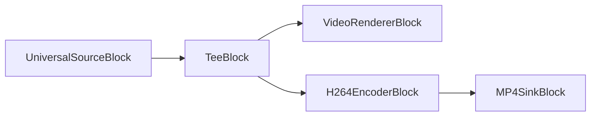
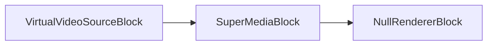
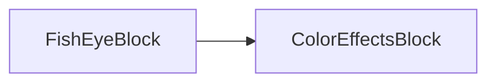
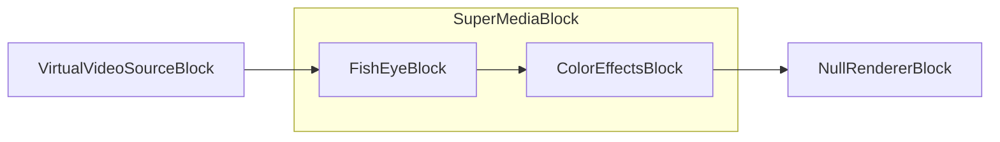
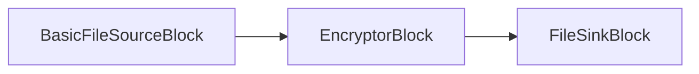
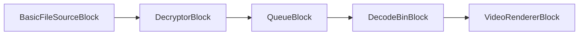
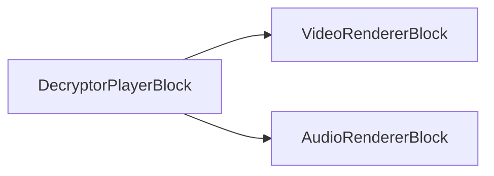
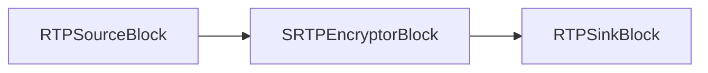
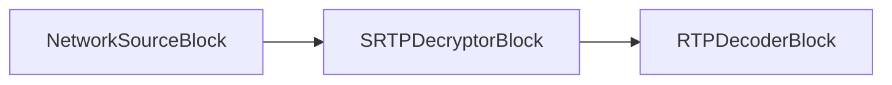
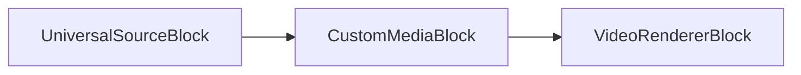

---
title: Bloques Especiales en C# .NET — Tee, Null, Custom
description: Use divisores Tee, renderizadores Null y Super MediaBlock personalizados para enrutamiento avanzado en VisioForge Media Blocks SDK para .NET.
sidebar_label: Bloques Especiales
---

# Bloques especiales

[SDK de Media Blocks .Net](https://www.visioforge.com/media-blocks-sdk-net){ .md-button .md-button--primary target="_blank" }

## Introducción

Los bloques especiales son bloques que no encajan en ninguna otra categoría.

## Null Renderer

El bloque null renderer envía los datos a null. Este bloque puede ser requerido si su bloque tiene salidas que no quiere usar.

### Información del bloque

Nombre: NullRendererBlock.

Dirección del pin | Tipo de medio | Conteo de pines
--- | :---: | :---:
Entrada | Cualquiera | 1

### El pipeline de muestra

El pipeline de muestra se muestra abajo. Lee un archivo y envía los datos de video al grabber de muestras de video, donde puede grabar cada frame de video después de decodificación. El bloque Null renderer se usa para terminar el pipeline.


```mermaid
graph LR;
    UniversalSourceBlock-->VideoSampleGrabberBlock;
    VideoSampleGrabberBlock-->NullRendererBlock;
```

### Código de muestra

```csharp
private void Start()
{
  // crear el pipeline
  var pipeline = new MediaBlocksPipeline();

  // crear bloque fuente universal
  var filename = "test.mp4";
  var fileSource = new UniversalSourceBlock(await UniversalSourceSettings.CreateAsync(new Uri(filename)));

  // crear bloque grabber de muestras de video y agregar el manejador de eventos
  var sampleGrabber = new VideoSampleGrabberBlock();
  sampleGrabber.OnVideoFrameBuffer += sampleGrabber_OnVideoFrameBuffer;

  // crear bloque null renderer
  var nullRenderer = new NullRendererBlock();

  // conectar bloques
  pipeline.Connect(fileSource.VideoOutput, sampleGrabber.Input);        
  pipeline.Connect(sampleGrabber.Output, nullRenderer.Input);   

  // iniciar el pipeline
  await pipeline.StartAsync();
}

private void sampleGrabber_OnVideoFrameBuffer(object sender, VideoFrameXBufferEventArgs e)
{
    // recibido nuevo frame de video
}
```

### Plataformas

Windows, macOS, Linux, iOS, Android.

## Tee

El bloque tee divide el stream de datos de video o audio en múltiples streams que copian completamente el stream original.

### Información del bloque

Nombre: TeeBlock.

Dirección del pin | Tipo de medio | Conteo de pines
--- | :---: | :---:
Entrada | Cualquiera | 1
Salida | Igual a entrada | 2 o más

### El pipeline de muestra


```mermaid
graph LR;
    UniversalSourceBlock-->TeeBlock;
    TeeBlock-->VideoRendererBlock;
    TeeBlock-->H264EncoderBlock;
    H264EncoderBlock-->MP4SinkBlock;
```

### Constructor

```csharp
TeeBlock(int numOfOutputs, MediaBlockPadMediaType mediaType, TeeQueueSettings queueSettings = null)
```

Parámetros:

- `numOfOutputs` - El número inicial de pads de salida a crear (debe ser al menos 1).
- `mediaType` - El tipo de medio que manejará este tee (Video, Audio, o Auto).
- `queueSettings` - Ajustes opcionales de cola para controlar el comportamiento de buffering. Si es null, usa valores predeterminados de baja latencia.

### Ajustes de cola

La clase `TeeQueueSettings` (namespace `VisioForge.Core.Types.X.Special`) controla el comportamiento de buffering para cada salida del tee. Por defecto, TeeBlock usa ajustes de baja latencia (1 buffer por cola) en lugar de los valores predeterminados de GStreamer (200 buffers).

#### Propiedades de TeeQueueSettings

| Propiedad | Tipo | Predeterminado | Descripción |
| --- | :---: | :---: | --- |
| MaxSizeBuffers | uint | 1 | Número máximo de buffers en la cola. Establecer a 0 para deshabilitar. Predeterminado GStreamer es 200. |
| MaxSizeBytes | uint | 0 | Máximo de bytes en cola. Establecer a 0 para deshabilitar. Predeterminado GStreamer es 10485760 (10 MB). |
| MaxSizeTime | ulong | 0 | Tiempo máximo en nanosegundos. Establecer a 0 para deshabilitar. Predeterminado GStreamer es 1000000000 (1 segundo). |
| MinThresholdBuffers | uint | 0 | Conteo mínimo de buffers antes de permitir lectura. |
| MinThresholdBytes | uint | 0 | Mínimo de bytes antes de permitir lectura. |
| MinThresholdTime | ulong | 0 | Tiempo mínimo en nanosegundos antes de permitir lectura. |
| Leaky | TeeQueueLeaky | No | Dónde la cola pierde datos cuando está llena (No, Upstream, o Downstream). |
| FlushOnEos | bool | false | Descartar todos los datos cuando se recibe EOS. |
| Silent | bool | true | Suprimir señales de cola para mejor rendimiento. |

#### Enum TeeQueueLeaky

| Valor | Descripción |
| --- | --- |
| No | Sin pérdida - la cola se bloquea cuando está llena. |
| Upstream | Pérdida en lado upstream (descarta buffers entrantes cuando está llena). |
| Downstream | Pérdida en lado downstream (descarta buffers antiguos cuando está llena). |

#### Métodos de fábrica

- `TeeQueueSettings.LowLatency()` - Crea ajustes optimizados para latencia mínima (1 buffer, sin límites de bytes/tiempo). Este es el comportamiento predeterminado.
- `TeeQueueSettings.GStreamerDefaults()` - Crea ajustes que coinciden con los predeterminados de GStreamer (200 buffers, 10 MB, 1 segundo).

### Código de muestra

```csharp
var pipeline = new MediaBlocksPipeline();

var filename = "test.mp4";
var fileSource = new UniversalSourceBlock(await UniversalSourceSettings.CreateAsync(new Uri(filename)));

var videoTee = new TeeBlock(2, MediaBlockPadMediaType.Video);
var h264Encoder = new H264EncoderBlock(new OpenH264EncoderSettings());
var mp4Muxer = new MP4SinkBlock(new MP4SinkSettings(@"output.mp4"));
var videoRenderer = new VideoRendererBlock(pipeline, VideoView1);

pipeline.Connect(fileSource.VideoOutput, videoTee.Input);
pipeline.Connect(videoTee.Outputs[0], videoRenderer.Input);
pipeline.Connect(videoTee.Outputs[1], h264Encoder.Input);
pipeline.Connect(h264Encoder.Output, mp4Muxer.CreateNewInput(MediaBlockPadMediaType.Video));

await pipeline.StartAsync();
```

### Usando ajustes de cola personalizados

```csharp
// Usar buffering predeterminado de GStreamer (mayor latencia, más buffering)
var gstreamerSettings = TeeQueueSettings.GStreamerDefaults();
var videoTee = new TeeBlock(2, MediaBlockPadMediaType.Video, gstreamerSettings);

// O crear ajustes personalizados
var customSettings = new TeeQueueSettings
{
    MaxSizeBuffers = 50,
    MaxSizeBytes = 5242880, // 5 MB
    MaxSizeTime = 500000000, // 0.5 segundos
    Leaky = TeeQueueLeaky.Downstream // Descartar buffers antiguos cuando está llena
};
var audioTee = new TeeBlock(3, MediaBlockPadMediaType.Audio, customSettings);
```

#### Aplicaciones de muestra

- [Demo de Captura Simple](https://github.com/visioforge/.Net-SDK-s-samples/tree/master/Media%20Blocks%20SDK/WPF/CSharp/Simple%20Capture%20Demo)

### Plataformas

Windows, macOS, Linux, iOS, Android.

## Super MediaBlock

El Super MediaBlock permite combinar múltiples bloques en un solo bloque.

### Información del bloque

Nombre: SuperMediaBlock.

Dirección del pin | Tipo de medio | Conteo de pines
--- | :---: | :---:
Entrada | Cualquiera | 1
Salida | Cualquiera | 1

### El pipeline de muestra


```mermaid
graph LR;
    VirtualVideoSourceBlock-->SuperMediaBlock;
    SuperMediaBlock-->NullRendererBlock;
```

Dentro del SuperMediaBlock:


```mermaid
graph LR;
    FishEyeBlock-->ColorEffectsBlock;
```

Pipeline final:


```mermaid
graph LR;
    VirtualVideoSourceBlock-->FishEyeBlock;
    subgraph SuperMediaBlock
    FishEyeBlock-->ColorEffectsBlock;
    end
    ColorEffectsBlock-->NullRendererBlock;
```

### Código de muestra

```csharp
var pipeline = new MediaBlocksPipeline();

var videoViewBlock = new VideoRendererBlock(pipeline, VideoView1);

var videoSource = new VirtualVideoSourceBlock(new VirtualVideoSourceSettings());

var colorEffectsBlock = new ColorEffectsBlock(VisioForge.Core.Types.X.VideoEffects.ColorEffectsPreset.Sepia);
var fishEyeBlock = new FishEyeBlock();

var superBlock = new SuperMediaBlock();
superBlock.Blocks.Add(fishEyeBlock);
superBlock.Blocks.Add(colorEffectsBlock);
superBlock.Configure(pipeline);

pipeline.Connect(videoSource.Output, superBlock.Input);
pipeline.Connect(superBlock.Output, videoViewBlock.Input);

await pipeline.StartAsync();
```

### Plataformas

Windows, macOS, Linux, iOS, Android.

## Bloque Encriptador

El bloque Encriptador cifra un stream de medios usando encriptación AES en tiempo real. Puede usarse para proteger video, audio o cualquier otro stream de datos antes de escribirlo en almacenamiento o enviarlo por la red.

### Información del bloque

Nombre: EncryptorBlock.

| Dirección del pin | Tipo de medio | Conteo de pines |
| --- | :---: | :---: |
| Entrada | Cualquiera | 1 |
| Salida | Cualquiera | 1 |

### El pipeline de muestra


```mermaid
graph LR;
    BasicFileSourceBlock-->EncryptorBlock;
    EncryptorBlock-->FileSinkBlock;
```

### Constructor

```csharp
EncryptorBlock(EncryptorDecryptorSettings settings)
```

Parámetros:

- `settings` - La configuración de encriptación AES, incluyendo clave, vector de inicialización y tipo de cifrado.

### Disponibilidad

Llame a `EncryptorBlock.IsAvailable()` para verificar el soporte de encriptación AES antes de crear una instancia.

### Código de muestra

```csharp
var pipeline = new MediaBlocksPipeline();

var settings = new EncryptorDecryptorSettings(
    key: "1f9423681beb9a79215820f6bda73d0f",
    iv: "e9aa8e834d8d70b7e0d254ff670dd718");

var fileSource = new BasicFileSourceBlock("input.mp4");
var encryptor = new EncryptorBlock(settings);
var fileSink = new FileSinkBlock("encrypted.bin", false);

pipeline.Connect(fileSource.Output, encryptor.Input);
pipeline.Connect(encryptor.Output, fileSink.Input);

await pipeline.StartAsync();
```

### Plataformas

Windows, macOS, Linux.

## Bloque Desencriptador

El bloque Desencriptador descifra un stream de medios cifrado con AES en tiempo real, restaurando los datos originales. La clave y el IV deben coincidir con los usados durante la encriptación. Para una solución completa de reproducción de archivos cifrados, considere usar el [Bloque Reproductor Desencriptador](#bloque-reproductor-desencriptador).

### Información del bloque

Nombre: DecryptorBlock.

| Dirección del pin | Tipo de medio | Conteo de pines |
| --- | :---: | :---: |
| Entrada | Cualquiera | 1 |
| Salida | Cualquiera | 1 |

### El pipeline de muestra


```mermaid
graph LR;
    BasicFileSourceBlock-->DecryptorBlock;
    DecryptorBlock-->QueueBlock;
    QueueBlock-->DecodeBinBlock;
    DecodeBinBlock-->VideoRendererBlock;
```

### Constructor

```csharp
DecryptorBlock(EncryptorDecryptorSettings settings)
```

Parámetros:

- `settings` - La configuración de desencriptación AES. La clave y el IV deben coincidir con los ajustes de encriptación.

### Código de muestra

```csharp
var pipeline = new MediaBlocksPipeline();

var settings = new EncryptorDecryptorSettings(
    key: "1f9423681beb9a79215820f6bda73d0f",
    iv: "e9aa8e834d8d70b7e0d254ff670dd718");

var fileSource = new BasicFileSourceBlock("encrypted.bin");
var decryptor = new DecryptorBlock(settings);
var queue = new QueueBlock();
var decodeBin = new DecodeBinBlock();

pipeline.Connect(fileSource.Output, decryptor.Input);
pipeline.Connect(decryptor.Output, queue.Input);
pipeline.Connect(queue.Output, decodeBin.Input);

var videoRenderer = new VideoRendererBlock(pipeline, VideoView1);
pipeline.Connect(decodeBin.VideoOutput, videoRenderer.Input);

await pipeline.StartAsync();
```

### Plataformas

Windows, macOS, Linux.

## Bloque Reproductor Desencriptador

El bloque Reproductor Desencriptador es un bloque fuente compuesto que combina lectura de archivo, desencriptación AES, cola y decodificación en un único bloque fácil de usar. No tiene pad de entrada externo — lee y descifra el archivo internamente. Conecte sus pads de salida directamente a renderizadores o bloques de procesamiento adicionales.

Pipeline interno: `BasicFileSourceBlock → DecryptorBlock → QueueBlock → DecodeBinBlock`

### Información del bloque

Nombre: DecryptorPlayerBlock.

| Dirección del pin | Tipo de medio | Conteo de pines |
| --- | :---: | :---: |
| Salida de video | Video sin comprimir | 1 |
| Salida de audio | Audio sin comprimir | 1 |
| Salida de subtítulos | Datos de subtítulos | 1 (opcional) |

### El pipeline de muestra


```mermaid
graph LR;
    DecryptorPlayerBlock-->VideoRendererBlock;
    DecryptorPlayerBlock-->AudioRendererBlock;
```

### Constructor

```csharp
DecryptorPlayerBlock(MediaBlocksPipeline pipeline, string filename, string key, string iv,
    bool renderVideo = true, bool renderAudio = true, bool renderSubtitle = false)
```

Parámetros:

- `pipeline` - La instancia del pipeline padre.
- `filename` - Ruta al archivo de medios cifrado con AES.
- `key` - Clave de encriptación como cadena hexadecimal (32 caracteres para AES-128, 64 para AES-256).
- `iv` - Vector de inicialización como cadena hexadecimal (siempre 32 caracteres hex / 16 bytes).
- `renderVideo` - Si exponer el pad de salida de video. Predeterminado: `true`.
- `renderAudio` - Si exponer el pad de salida de audio. Predeterminado: `true`.
- `renderSubtitle` - Si exponer el pad de salida de subtítulos. Predeterminado: `false`.

### Pads de salida

- `VideoOutput` - Frames de video decodificados (disponible cuando `renderVideo` es `true`).
- `AudioOutput` - Muestras de audio decodificadas (disponible cuando `renderAudio` es `true`).
- `SubtitleOutput` - Datos de subtítulos decodificados (disponible cuando `renderSubtitle` es `true`).

### Disponibilidad

Llame a `DecryptorPlayerBlock.IsAvailable()` para verificar el soporte de desencriptación antes de crear una instancia.

### Código de muestra

```csharp
var pipeline = new MediaBlocksPipeline();

var decryptorPlayer = new DecryptorPlayerBlock(
    pipeline,
    filename: "encrypted.bin",
    key: "1f9423681beb9a79215820f6bda73d0f",
    iv: "e9aa8e834d8d70b7e0d254ff670dd718");

var videoRenderer = new VideoRendererBlock(pipeline, VideoView1);
var audioRenderer = new AudioRendererBlock();

pipeline.Connect(decryptorPlayer.VideoOutput, videoRenderer.Input);
pipeline.Connect(decryptorPlayer.AudioOutput, audioRenderer.Input);

await pipeline.StartAsync();
```

### Plataformas

Windows, macOS, Linux.

## Bloque Encriptador SRTP

El bloque Encriptador SRTP cifra streams RTP usando SRTP (Protocolo de Transporte en Tiempo Real Seguro) según se define en RFC 3711. Proporciona confidencialidad, autenticación de mensajes y protección contra reproducción para streams de medios en tiempo real como videoconferencias o transmisiones en vivo.

### Información del bloque

Nombre: SRTPEncryptorBlock.

| Dirección del pin | Tipo de medio | Conteo de pines |
| --- | :---: | :---: |
| Entrada | RTP | 1 |
| Salida | SRTP | 1 |

### El pipeline de muestra


```mermaid
graph LR;
    RTPSourceBlock-->SRTPEncryptorBlock;
    SRTPEncryptorBlock-->RTPSinkBlock;
```

### Constructor

```csharp
SRTPEncryptorBlock(SRTPSettings settings)
```

Parámetros:

- `settings` - Configuración de encriptación SRTP incluyendo clave maestra, suite de cifrado y método de autenticación.

### Disponibilidad

Llame a `SRTPEncryptorBlock.IsAvailable()` para verificar el soporte SRTP antes de crear una instancia.

### Código de muestra

```csharp
var settings = new SRTPSettings("000102030405060708090A0B0C0D0E0F")
{
    Cipher = SRTPCipher.AES_128_ICM,
    Auth = SRTPAuth.HMAC_SHA1_80
};

var encryptor = new SRTPEncryptorBlock(settings);
```

### Plataformas

Windows, macOS, Linux.

## Bloque Desencriptador SRTP

El bloque Desencriptador SRTP descifra streams RTP cifrados con SRTP de vuelta a RTP en texto plano. Los ajustes deben coincidir con los usados por el encriptador. También verifica las etiquetas de autenticación de mensajes y proporciona protección contra ataques de reproducción.

### Información del bloque

Nombre: SRTPDecryptorBlock.

| Dirección del pin | Tipo de medio | Conteo de pines |
| --- | :---: | :---: |
| Entrada | SRTP | 1 |
| Salida | RTP | 1 |

### El pipeline de muestra


```mermaid
graph LR;
    NetworkSourceBlock-->SRTPDecryptorBlock;
    SRTPDecryptorBlock-->RTPDecoderBlock;
```

### Constructor

```csharp
SRTPDecryptorBlock(SRTPSettings settings)
```

Parámetros:

- `settings` - Configuración de desencriptación SRTP. Debe coincidir con los ajustes de encriptación usados en el lado del emisor.

### Disponibilidad

Llame a `SRTPDecryptorBlock.IsAvailable()` para verificar el soporte SRTP antes de crear una instancia.

### Código de muestra

```csharp
var settings = new SRTPSettings("000102030405060708090A0B0C0D0E0F");
var decryptor = new SRTPDecryptorBlock(settings);
```

### Plataformas

Windows, macOS, Linux.

## SRTPSettings

La clase `SRTPSettings` proporciona configuración para operaciones de encriptación y desencriptación SRTP.

### Propiedades

| Propiedad | Tipo | Predeterminado | Descripción |
| --- | :---: | :---: | --- |
| Key | string | — | Clave maestra como cadena hex. 32 caracteres hex (16 bytes) para AES-128-ICM; 64 caracteres hex (32 bytes) para AES-256-ICM. |
| Cipher | SRTPCipher | AES_128_ICM | Algoritmo de encriptación. |
| Auth | SRTPAuth | HMAC_SHA1_80 | Método de autenticación. |
| SSRC | uint | 0 | Identificador de Fuente de Sincronización RTP. Use 0 para coincidir con cualquier SSRC. |

### Constructores

- `SRTPSettings()` - Crea ajustes con cifrado AES-128-ICM y autenticación HMAC-SHA1-80.
- `SRTPSettings(string key)` - Crea ajustes con la clave maestra especificada y valores predeterminados.

### Plataformas

Windows, macOS, Linux.

## SRTPCipher

El enum `SRTPCipher` define los algoritmos de encriptación disponibles para SRTP.

### Valores del Enum

- `NULL` - Sin encriptación. Solo proporciona autenticación.
- `AES_128_ICM` - AES-128 en Modo Contador Entero. Opción más común; requiere una clave de 16 bytes (32 caracteres hex).
- `AES_256_ICM` - AES-256 en Modo Contador Entero. Seguridad máxima; requiere una clave de 32 bytes (64 caracteres hex).

### Plataformas

Windows, macOS, Linux.

## SRTPAuth

El enum `SRTPAuth` define los métodos de autenticación de mensajes disponibles para SRTP.

### Valores del Enum

- `NULL` - Sin autenticación. No recomendado para uso en producción.
- `HMAC_SHA1_80` - HMAC-SHA1 con etiqueta de autenticación de 80 bits. Recomendado para la mayoría de las aplicaciones.
- `HMAC_SHA1_32` - HMAC-SHA1 con etiqueta de autenticación de 32 bits. Menor sobrecarga de ancho de banda para redes con restricciones.

### Plataformas

Windows, macOS, Linux.

## AESCipher

El enum `AESCipher` define los tipos de cifrados AES que pueden usarse. (Fuente: `VisioForge.Core/Types/X/Special/AESCipher.cs`)

### Valores del Enum

- `AES_128`: Clave de cifrado AES 128-bit usando método CBC.
- `AES_256`: Clave de cifrado AES 256-bit usando método CBC.

### Plataformas

Windows, macOS, Linux, iOS, Android.

## EncryptorDecryptorSettings

La clase `EncryptorDecryptorSettings` contiene ajustes para operaciones de encriptación y desencriptación. (Fuente: `VisioForge.Core/Types/X/Special/EncryptorDecryptorSettings.cs`)

### Propiedades

- `Cipher` (`AESCipher`): Obtiene o establece el tipo de cifrado AES. Predeterminado `AES_128`.
- `Key` (`string`): Obtiene o establece la clave de encriptación.
- `IV` (`string`): Obtiene o establece el vector de inicialización (16 bytes como hex).
- `SerializeIV` (`bool`): Obtiene o establece un valor indicando si serializar el IV.

### Constructor

- `EncryptorDecryptorSettings(string key, string iv)`: Inicializa una nueva instancia con la clave y vector de inicialización dados.

### Plataformas

Windows, macOS, Linux, iOS, Android.

## CustomMediaBlockPad

La clase `CustomMediaBlockPad` define información para un pad dentro de un `CustomMediaBlock`. (Fuente: `VisioForge.Core/Types/X/Special/CustomMediaBlockPad.cs`)

### Propiedades

- `Direction` (`MediaBlockPadDirection`): Obtiene o establece la dirección del pad (entrada/salida).
- `MediaType` (`MediaBlockPadMediaType`): Obtiene o establece el tipo de medio del pad (ej. Audio, Video).
- `CustomCaps` (`Gst.Caps`): Obtiene o establece capacidades GStreamer personalizadas para un pad de salida.

### Constructor

- `CustomMediaBlockPad(MediaBlockPadDirection direction, MediaBlockPadMediaType mediaType)`: Inicializa una nueva instancia con la dirección y tipo de medio especificados.

### Plataformas

Windows, macOS, Linux, iOS, Android.

## CustomMediaBlockSettings

La clase `CustomMediaBlockSettings` proporciona ajustes para configurar un bloque de medios personalizado, potencialmente envolviendo elementos GStreamer. (Fuente: `VisioForge.Core/Types/X/Special/CustomMediaBlockSettings.cs`)

### Propiedades

- `ElementName` (`string`): Obtiene el nombre del elemento GStreamer o elemento SDK Media Blocks. Para crear un Bin GStreamer personalizado, incluir corchetes, ej. `"[ videotestsrc ! videoconvert ]"`.
- `UsePadAddedEvent` (`bool`): Obtiene o establece un valor indicando si usar el evento `pad-added` para pads GStreamer creados dinámicamente.
- `ElementParams` (`Dictionary<string, object>`): Obtiene los parámetros para el elemento.
- `Pads` (`List<CustomMediaBlockPad>`): Obtiene la lista de definiciones `CustomMediaBlockPad` para el bloque.
- `ListProperties` (`bool`): Obtiene o establece un valor indicando si listar propiedades del elemento a la ventana Debug después de creación. Predeterminado `false`.

### Constructor

- `CustomMediaBlockSettings(string elementName)`: Inicializa una nueva instancia con el nombre de elemento especificado.

### Plataformas

Windows, macOS, Linux, iOS, Android.

## InputSelectorSyncMode

El enum `InputSelectorSyncMode` define cómo un selector de entrada (usado por `SourceSwitchSettings`) sincroniza buffers cuando está en modo `sync-streams`. (Fuente: `VisioForge.Core/Types/X/Special/SourceSwitchSettings.cs`)

### Valores del Enum

- `ActiveSegment` (0): Sincronizar usando el segmento activo actual.
- `Clock` (1): Sincronizar usando el reloj.

### Plataformas

Windows, macOS, Linux, iOS, Android.

## SourceSwitchSettings

La clase `SourceSwitchSettings` configura un bloque que puede cambiar entre múltiples fuentes de entrada. (Fuente: `VisioForge.Core/Types/X/Special/SourceSwitchSettings.cs`)

El resumen "Representa el pad sink activo actualmente" del código podría ser ligeramente engañoso o incompleto para el nombre de clase `SourceSwitchSettings`. Las propiedades sugieren que es para configurar un conmutador de fuente.

### Propiedades

- `PadsCount` (`int`): Obtiene o establece el número de pads de entrada. Predeterminado `2`.
- `DefaultActivePad` (`int`): Obtiene o establece el pad sink inicialmente activo.
- `CacheBuffers` (`bool`): Obtiene o establece si el pad activo almacena en caché buffers para evitar perder frames cuando se reactiva. Predeterminado `false`.
- `DropBackwards` (`bool`): Obtiene o establece si descartar buffers que van hacia atrás relativo al último buffer de salida pre-conmutación. Predeterminado `false`.
- `SyncMode` (`InputSelectorSyncMode`): Obtiene o establece cómo el selector de entrada sincroniza buffers en modo `sync-streams`. Predeterminado `InputSelectorSyncMode.ActiveSegment`.
- `SyncStreams` (`bool`): Obtiene o establece si todos los streams inactivos serán sincronizados al tiempo de ejecución del stream activo o al reloj actual. Predeterminado `true`.
- `CustomName` (`string`): Obtiene o establece un nombre personalizado para logging. Predeterminado `"SourceSwitch"`.

### Constructor

- `SourceSwitchSettings(int padsCount = 2)`: Inicializa una nueva instancia, opcionalmente especificando el número de pads.

### Plataformas

Windows, macOS, Linux, iOS, Android.

## Bloque Queue

El bloque Queue proporciona buffering entre elementos del pipeline para suavizar variaciones de procesamiento y habilitar flujo de datos asíncrono.

### Información del bloque

Nombre: QueueBlock.

| Dirección del pin | Tipo de medio | Conteo de pines |
| --- | :---: | :---: |
| Entrada | cualquiera | 1 |
| Salida | cualquiera | 1 |

### Código de muestra

```csharp
var pipeline = new MediaBlocksPipeline();

var fileSource = new UniversalSourceBlock(await UniversalSourceSettings.CreateAsync(new Uri("test.mp4")));

var queue = new QueueBlock();
pipeline.Connect(fileSource.VideoOutput, queue.Input);

var videoRenderer = new VideoRendererBlock(pipeline, VideoView1);
pipeline.Connect(queue.Output, videoRenderer.Input);

await pipeline.StartAsync();
```

### Plataformas

Windows, macOS, Linux, iOS, Android.

## Bloque MultiQueue

El bloque MultiQueue proporciona buffering sincronizado para múltiples streams, esencial para mantener sincronía A/V en pipelines complejos.

### Información del bloque

Nombre: MultiQueueBlock.

| Dirección del pin | Tipo de medio | Conteo de pines |
| --- | :---: | :---: |
| Entrada | cualquiera | múltiple |
| Salida | cualquiera | múltiple |

### Código de muestra

```csharp
var pipeline = new MediaBlocksPipeline();

var fileSource = new UniversalSourceBlock(await UniversalSourceSettings.CreateAsync(new Uri("test.mp4")));

var multiqueue = new MultiQueueBlock();
var videoInput = multiqueue.CreateNewInput(MediaBlockPadMediaType.Video);
var audioInput = multiqueue.CreateNewInput(MediaBlockPadMediaType.Audio);

pipeline.Connect(fileSource.VideoOutput, videoInput);
pipeline.Connect(fileSource.AudioOutput, audioInput);

// Conectar salidas a codificadores/renderizadores
await pipeline.StartAsync();
```

### Plataformas

Windows, macOS, Linux, iOS, Android.

## Source Switch

El bloque SourceSwitch permite cambio dinámico entre múltiples fuentes de entrada sin interrumpir el pipeline.

### Información del bloque

Nombre: SourceSwitchBlock.

| Dirección del pin | Tipo de medio | Conteo de pines |
| --- | :---: | :---: |
| Entrada | cualquiera | múltiple |
| Salida | cualquiera | 1 |

### Código de muestra

```csharp
var pipeline = new MediaBlocksPipeline();

var source1 = new UniversalSourceBlock(await UniversalSourceSettings.CreateAsync(new Uri("video1.mp4")));
var source2 = new UniversalSourceBlock(await UniversalSourceSettings.CreateAsync(new Uri("video2.mp4")));

var switchSettings = new SourceSwitchSettings(2) { DefaultActivePad = 0 };
var sourceSwitch = new SourceSwitchBlock(switchSettings);

pipeline.Connect(source1.VideoOutput, sourceSwitch.Input);
pipeline.Connect(source2.VideoOutput, sourceSwitch.CreateNewInput(MediaBlockPadMediaType.Video));

var videoRenderer = new VideoRendererBlock(pipeline, VideoView1);
pipeline.Connect(sourceSwitch.Output, videoRenderer.Input);

await pipeline.StartAsync();

// Cambiar a segunda fuente
sourceSwitch.SetActivePad(1);
```

### Plataformas

Windows, macOS, Linux, iOS, Android.

## Universal Decoder

El bloque UniversalDecoder detecta y decodifica automáticamente diversos formatos de audio y video comprimidos.

### Información del bloque

Nombre: UniversalDecoderBlock.

| Dirección del pin | Tipo de medio | Conteo de pines |
| --- | :---: | :---: |
| Entrada | medio comprimido | 1 |
| Salida | medio sin comprimir | múltiple |

### Código de muestra

```csharp
var pipeline = new MediaBlocksPipeline();

var fileSource = new UniversalSourceBlock(await UniversalSourceSettings.CreateAsync(new Uri("test.mp4")));

var decoder = new UniversalDecoderBlock();
pipeline.Connect(fileSource.VideoOutput, decoder.Input);

var videoRenderer = new VideoRendererBlock(pipeline, VideoView1);
pipeline.Connect(decoder.VideoOutput, videoRenderer.Input);

await pipeline.StartAsync();
```

### Plataformas

Windows, macOS, Linux, iOS, Android.

## Universal Demux Decoder

El bloque UniversalDemuxDecoder combina demuxing y decodificación en un solo bloque para construcción simplificada de pipeline.

### Información del bloque

Nombre: UniversalDemuxDecoderBlock.

| Dirección del pin | Tipo de medio | Conteo de pines |
| --- | :---: | :---: |
| Entrada | formato contenedor | 1 |
| Salida de video | video sin comprimir | 1 |
| Salida de audio | audio sin comprimir | 1 |

### Código de muestra

```csharp
var pipeline = new MediaBlocksPipeline();

var demuxDecoder = new UniversalDemuxDecoderBlock("test.mp4");

var videoRenderer = new VideoRendererBlock(pipeline, VideoView1);
pipeline.Connect(demuxDecoder.VideoOutput, videoRenderer.Input);

var audioRenderer = new AudioRendererBlock();
pipeline.Connect(demuxDecoder.AudioOutput, audioRenderer.Input);

await pipeline.StartAsync();
```

### Plataformas

Windows, macOS, Linux, iOS, Android.

## Barcode Detector

El bloque BarcodeDetector detecta y decodifica diversos formatos de códigos de barras (códigos QR, DataMatrix, Code128, EAN-13, y más) en streams de video en tiempo real.

Para una guía completa con ejemplos multiplataforma, consulte la [Guía de Escáner de Códigos de Barras y QR](../Guides/barcode-qr-reader-guide.md).

### Información del bloque

Nombre: BarcodeDetectorBlock.

| Dirección del pin | Tipo de medio | Conteo de pines |
| --- | :---: | :---: |
| Entrada | video sin comprimir | 1 |
| Salida | video sin comprimir | 1 (modo InputOutput) o 0 (modo InputOnly) |

### Código de muestra

```csharp
var pipeline = new MediaBlocksPipeline();

var videoSource = new SystemVideoSourceBlock(videoSettings);

var barcodeDetector = new BarcodeDetectorBlock(BarcodeDetectorMode.InputOutput);
barcodeDetector.OnBarcodeDetected += (sender, args) =>
{
    Console.WriteLine($"Código de barras detectado: {args.BarcodeType} - {args.Value}");
};
pipeline.Connect(videoSource.Output, barcodeDetector.Input);

var videoRenderer = new VideoRendererBlock(pipeline, VideoView1);
pipeline.Connect(barcodeDetector.Output, videoRenderer.Input);

await pipeline.StartAsync();
```

### Plataformas

Windows, macOS, Linux, iOS, Android.

## DataMatrix Decoder

El bloque DataMatrixDecoder detecta y decodifica códigos de barras 2D DataMatrix en streams de video.

### Información del bloque

Nombre: DataMatrixDecoderBlock.

| Dirección del pin | Tipo de medio | Conteo de pines |
| --- | :---: | :---: |
| Entrada | video sin comprimir | 1 |
| Salida | video sin comprimir | 1 |

### Código de muestra

```csharp
var pipeline = new MediaBlocksPipeline();

var videoSource = new SystemVideoSourceBlock(videoSettings);

var dataMatrixDecoder = new DataMatrixDecoderBlock();
dataMatrixDecoder.OnDataMatrixDetected += (sender, args) =>
{
    Console.WriteLine($"DataMatrix detectado: {args.Data}");
};
pipeline.Connect(videoSource.Output, dataMatrixDecoder.Input);

var videoRenderer = new VideoRendererBlock(pipeline, VideoView1);
pipeline.Connect(dataMatrixDecoder.Output, videoRenderer.Input);

await pipeline.StartAsync();
```

### Plataformas

Windows, macOS, Linux, iOS, Android.

## Frame Doubler

El bloque FrameDoubler duplica frames de video para aumentar la tasa de frames efectiva.

### Información del bloque

Nombre: FrameDoublerBlock.

| Dirección del pin | Tipo de medio | Conteo de pines |
| --- | :---: | :---: |
| Entrada | video sin comprimir | 1 |
| Salida | video sin comprimir | 1 |

### Código de muestra

```csharp
var pipeline = new MediaBlocksPipeline();

var fileSource = new UniversalSourceBlock(await UniversalSourceSettings.CreateAsync(new Uri("test.mp4")));

var frameDoubler = new FrameDoublerBlock();
pipeline.Connect(fileSource.VideoOutput, frameDoubler.Input);

var videoRenderer = new VideoRendererBlock(pipeline, VideoView1);
pipeline.Connect(frameDoubler.Output, videoRenderer.Input);

await pipeline.StartAsync();
```

### Plataformas

Windows, macOS, Linux, iOS, Android.

## Video Enhancement

El bloque VideoEnhancement aplica mejora y upscaling de video basado en IA.

### Información del bloque

Nombre: VideoEnhancementBlock.

| Dirección del pin | Tipo de medio | Conteo de pines |
| --- | :---: | :---: |
| Entrada | video sin comprimir | 1 |
| Salida | video sin comprimir | 1 |

### Código de muestra

```csharp
var pipeline = new MediaBlocksPipeline();

var fileSource = new UniversalSourceBlock(await UniversalSourceSettings.CreateAsync(new Uri("test.mp4")));

var enhancementSettings = new VideoEnhancementSettings
{
    UpscaleFactor = 2,
    DenoiseStrength = 0.5
};
var enhancement = new VideoEnhancementBlock(enhancementSettings);
pipeline.Connect(fileSource.VideoOutput, enhancement.Input);

var videoRenderer = new VideoRendererBlock(pipeline, VideoView1);
pipeline.Connect(enhancement.Output, videoRenderer.Input);

await pipeline.StartAsync();
```

### Plataformas

Windows, macOS, Linux (requiere modelos IA apropiados).

## Decode Bin

El bloque DecodeBin selecciona y gestiona automáticamente decodificadores apropiados para streams de medios.

### Información del bloque

Nombre: DecodeBinBlock.

| Dirección del pin | Tipo de medio | Conteo de pines |
| --- | :---: | :---: |
| Entrada | medio comprimido | 1 |
| Salida | medio sin comprimir | dinámico |

### Código de muestra

```csharp
var pipeline = new MediaBlocksPipeline();

var fileSource = new UniversalSourceBlock(await UniversalSourceSettings.CreateAsync(new Uri("test.mp4")));

var decodeBin = new DecodeBinBlock();
pipeline.Connect(fileSource.VideoOutput, decodeBin.Input);

// DecodeBin creará pads de salida dinámicamente a medida que se descubran streams
await pipeline.StartAsync();
```

### Plataformas

Windows, macOS, Linux, iOS, Android.

## Parse Bin

El bloque ParseBin analiza automáticamente streams de medios y expone streams elementales.

### Información del bloque

Nombre: ParseBinBlock.

| Dirección del pin | Tipo de medio | Conteo de pines |
| --- | :---: | :---: |
| Entrada | medio comprimido | 1 |
| Salida | streams analizados | dinámico |

### Código de muestra

```csharp
var pipeline = new MediaBlocksPipeline();

var fileSource = new UniversalSourceBlock(await UniversalSourceSettings.CreateAsync(new Uri("test.mp4")));

var parseBin = new ParseBinBlock();
pipeline.Connect(fileSource.VideoOutput, parseBin.Input);

// ParseBin creará pads de salida para cada stream descubierto
await pipeline.StartAsync();
```

### Plataformas

Windows, macOS, Linux, iOS, Android.

## Custom Transform

El bloque CustomTransform permite integración de lógica de transformación personalizada en el pipeline.

### Información del bloque

Nombre: CustomTransformBlock.

| Dirección del pin | Tipo de medio | Conteo de pines |
| --- | :---: | :---: |
| Entrada | cualquiera | 1 |
| Salida | cualquiera | 1 |

### Código de muestra

```csharp
var pipeline = new MediaBlocksPipeline();

var fileSource = new UniversalSourceBlock(await UniversalSourceSettings.CreateAsync(new Uri("test.mp4")));

var customSettings = new CustomTransformSettings
{
    ElementName = "videoscale", // Nombre de elemento GStreamer
    Properties = new Dictionary<string, object>
    {
        { "method", 0 }
    }
};
var customTransform = new CustomTransformBlock(customSettings);
pipeline.Connect(fileSource.VideoOutput, customTransform.Input);

var videoRenderer = new VideoRendererBlock(pipeline, VideoView1);
pipeline.Connect(customTransform.Output, videoRenderer.Input);

await pipeline.StartAsync();
```

### Plataformas

Windows, macOS, Linux, iOS, Android.

## Data Sample Grabber

El bloque DataSampleGrabber intercepta y proporciona acceso a buffers de datos fluyendo a través del pipeline.

### Información del bloque

Nombre: DataSampleGrabberBlock.

| Dirección del pin | Tipo de medio | Conteo de pines |
| --- | :---: | :---: |
| Entrada | cualquiera | 1 |
| Salida | cualquiera | 1 |

### Código de muestra

```csharp
var pipeline = new MediaBlocksPipeline();

var fileSource = new UniversalSourceBlock(await UniversalSourceSettings.CreateAsync(new Uri("test.mp4")));

var dataSG = new DataSampleGrabberBlock();
dataSG.OnDataBuffer += (sender, args) =>
{
    // Procesar datos del buffer
    var bufferSize = args.BufferSize;
    var bufferData = args.BufferData;
};
pipeline.Connect(fileSource.VideoOutput, dataSG.Input);

var videoRenderer = new VideoRendererBlock(pipeline, VideoView1);
pipeline.Connect(dataSG.Output, videoRenderer.Input);

await pipeline.StartAsync();
```

### Plataformas

Windows, macOS, Linux, iOS, Android.

## Debug Timestamp

El bloque DebugTimestamp registra información detallada de timestamp para depuración de problemas de sincronización.

### Información del bloque

Nombre: DebugTimestampBlock.

| Dirección del pin | Tipo de medio | Conteo de pines |
| --- | :---: | :---: |
| Entrada | cualquiera | 1 |
| Salida | cualquiera | 1 |

### Código de muestra

```csharp
var pipeline = new MediaBlocksPipeline();

var fileSource = new UniversalSourceBlock(await UniversalSourceSettings.CreateAsync(new Uri("test.mp4")));

var debugTimestamp = new DebugTimestampBlock();
pipeline.Connect(fileSource.VideoOutput, debugTimestamp.Input);

var videoRenderer = new VideoRendererBlock(pipeline, VideoView1);
pipeline.Connect(debugTimestamp.Output, videoRenderer.Input);

await pipeline.StartAsync();
```

### Plataformas

Windows, macOS, Linux, iOS, Android.

## Data Processor

El bloque DataProcessor proporciona capacidades de procesamiento de datos personalizadas para formatos de datos no estándar.

### Información del bloque

Nombre: DataProcessorBlock.

| Dirección del pin | Tipo de medio | Conteo de pines |
| --- | :---: | :---: |
| Entrada | cualquiera | 1 |
| Salida | cualquiera | 1 |

### Código de muestra

```csharp
var pipeline = new MediaBlocksPipeline();

var dataSource = new CustomDataSource();

var dataProcessor = new DataProcessorBlock();
pipeline.Connect(dataSource.Output, dataProcessor.Input);

// Procesar y reenviar datos
await pipeline.StartAsync();
```

### Plataformas

Windows, macOS, Linux, iOS, Android.

## Espacio de Color Personalizado

El `CustomColorspaceXBlock` convierte video sin procesar de RGB a YV12 (YUV 4:2:0 planar) usando un plugin de GStreamer en C# integrado. La conversión aplica coeficientes ITU-R BT.601 con promediado de bloque 2×2 para submuestreo de croma.

Las propiedades opcionales `Width`, `Height` y `FrameRate` restringen la negociación de caps; déjelas sin configurar para negociación automática. Los valores de ancho y alto deben ser números pares.

`CustomColorspaceXBlock.IsAvailable()` siempre devuelve `true` — el plugin está implementado en código administrado y no requiere ninguna dependencia externa de GStreamer.

### Información del bloque

Nombre: CustomColorspaceXBlock.

| Dirección del pin | Tipo de medio | Conteo de pines |
| --- | :---: | :---: |
| Entrada | video/x-raw (RGB) | 1 |
| Salida | video/x-raw (YV12) | 1 |

### Código de muestra

```csharp
var pipeline = new MediaBlocksPipeline();

var filename = "test.mp4";
var fileSource = new UniversalSourceBlock(await UniversalSourceSettings.CreateAsync(new Uri(filename)));

var colorspace = new CustomColorspaceXBlock(width: 1280, height: 720);
pipeline.Connect(fileSource.VideoOutput, colorspace.Input);

var videoRenderer = new VideoRendererBlock(pipeline, VideoView1);
pipeline.Connect(colorspace.Output, videoRenderer.Input);

await pipeline.StartAsync();
```

### Plataformas

Windows, macOS, Linux, iOS, Android.

## Sincronización en Vivo

El `LiveSyncBlock` envuelve el elemento GStreamer `livesync` para mantener un pipeline en vivo en tiempo real. Descarta los fotogramas que llegan tarde y duplica el último fotograma cuando la fuente se detiene, manteniendo una salida en tiempo real fluida sin bloqueos del pipeline. Se admiten tanto flujos de audio como de video.

Use este bloque en pipelines de transmisión en vivo o captura para absorber el jitter de temporización de fuentes de red o hardware.

### Información del bloque

Nombre: LiveSyncBlock.

| Dirección del pin | Tipo de medio | Conteo de pines |
| --- | :---: | :---: |
| Entrada | Cualquiera | 1 |
| Salida | Cualquiera | 1 |

### Disponibilidad

`LiveSyncBlock.IsAvailable()` devuelve `true` si el elemento GStreamer `livesync` está presente.

### Código de muestra

```csharp
var pipeline = new MediaBlocksPipeline();

var rtmpSettings = await RTMPSourceSettings.CreateAsync(new Uri("rtmp://example.com/live/stream"));
var rtmpSource = new RTMPSourceBlock(rtmpSettings);

var liveSync = new LiveSyncBlock();
pipeline.Connect(rtmpSource.VideoOutput, liveSync.Input);

var videoRenderer = new VideoRendererBlock(pipeline, VideoView1);
pipeline.Connect(liveSync.Output, videoRenderer.Input);

await pipeline.StartAsync();
```

### Plataformas

Windows, macOS, Linux.

## Custom Media Block

El `CustomMediaBlock` es un puente flexible entre la capa de abstracción de MediaBlocks y los elementos GStreamer sin procesar. Puede envolver cualquier elemento GStreamer por nombre de fábrica o una descripción de pipeline bin, siendo útil para integrar plugins de terceros, elementos experimentales o funcionalidades aún no cubiertas por una clase MediaBlocks dedicada.

La configuración y tipos de pads asociados (`CustomMediaBlockSettings`, `CustomMediaBlockPad`) están documentados en las secciones [CustomMediaBlockSettings](#custommediablocksettings) y [CustomMediaBlockPad](#custommediablockpad) anteriores.

### Información del bloque

Nombre: CustomMediaBlock.

| Dirección del pin | Tipo de medio | Conteo de pines |
| --- | :---: | :---: |
| Entrada | Definida por configuración | 0…N |
| Salida | Definida por configuración | 0…N |

### Características principales

- Envolver cualquier elemento GStreamer por nombre (p. ej., `"videoscale"`) o como descripción bin (p. ej., `"[ videoscale ! videoconvert ]"`).
- Establecer propiedades del elemento mediante el diccionario `ElementParams` antes de iniciar el pipeline.
- Recibir el `Gst.Element` sin procesar mediante el evento `OnElementAdded` para configuración adicional.
- Usar `UsePadAddedEvent = true` para elementos con pads dinámicos (p. ej., demuxers).
- Aplicar filtros de caps opcionales en pads de salida mediante `CustomMediaBlockPad.CustomCaps`.

### Eventos

- `OnElementAdded` — se dispara inmediatamente después de que el elemento GStreamer es creado y añadido al pipeline, permitiendo configuración directa de propiedades o señales en el elemento nativo.

### El pipeline de muestra


```mermaid
graph LR;
    UniversalSourceBlock-->CustomMediaBlock;
    CustomMediaBlock-->VideoRendererBlock;
```

### Código de muestra

```csharp
var pipeline = new MediaBlocksPipeline();

var fileSource = new UniversalSourceBlock(await UniversalSourceSettings.CreateAsync(new Uri("test.mp4")));

// Envolver el elemento GStreamer videoscale con una propiedad
var settings = new CustomMediaBlockSettings("videoscale");
settings.ElementParams["method"] = 0; // vecino más cercano
settings.Pads.Add(new CustomMediaBlockPad(MediaBlockPadDirection.In, MediaBlockPadMediaType.Video));
settings.Pads.Add(new CustomMediaBlockPad(MediaBlockPadDirection.Out, MediaBlockPadMediaType.Video));

var customBlock = new CustomMediaBlock(settings);
customBlock.OnElementAdded += (sender, element) =>
{
    // Configuración adicional del elemento después de su creación
};

pipeline.Connect(fileSource.VideoOutput, customBlock.Input);

var videoRenderer = new VideoRendererBlock(pipeline, VideoView1);
pipeline.Connect(customBlock.Output, videoRenderer.Input);

await pipeline.StartAsync();
```

### Ejemplo con descripción bin

```csharp
// Envolver un pipeline multi-elemento de GStreamer como un solo bloque
var settings = new CustomMediaBlockSettings("[ videoscale ! videoconvert ]");
settings.Pads.Add(new CustomMediaBlockPad(MediaBlockPadDirection.In, MediaBlockPadMediaType.Video));
settings.Pads.Add(new CustomMediaBlockPad(MediaBlockPadDirection.Out, MediaBlockPadMediaType.Video));

var customBlock = new CustomMediaBlock(settings);
```

### Plataformas

Windows, macOS, Linux, iOS, Android.

---

## Universal Transform Block

El `UniversalTransformBlock` es una clase base abstracta para implementar transformaciones personalizadas de fotogramas de video en código C# administrado. Soporta transformaciones de 1:N fotogramas: un único fotograma de entrada puede producir cero, uno o múltiples fotogramas de salida, habilitando casos de uso como eliminación de fotogramas, duplicación, división o conversión de formato.

Cree una subclase de `UniversalTransformBlock`, proporcione cadenas de caps GStreamer para entrada y salida, y sobreescriba `OnTransformFrame` para implementar la lógica de transformación.

### Información del bloque

Nombre: (subclase definida por el usuario).

| Dirección del pin | Tipo de medio | Conteo de pines |
| --- | :---: | :---: |
| Entrada de video | Video sin comprimir | 1 |
| Salida de video | Video sin comprimir | 1 |

### Constructor (protegido)

```csharp
protected UniversalTransformBlock(string inputCaps, string outputCaps)
```

Parámetros:

- `inputCaps` — cadena de caps GStreamer que describe el formato de entrada aceptado (p. ej., `"video/x-raw,format=RGB,width=1920,height=1080,framerate=30/1"`).
- `outputCaps` — cadena de caps GStreamer que describe el formato de salida producido.

### Método abstracto a sobreescribir

```csharp
protected abstract List<Gst.Buffer> OnTransformFrame(
    Gst.Buffer inputBuffer,
    Gst.Caps inputCaps,
    Gst.Caps outputCaps);
```

Semántica del valor de retorno:

- **Lista vacía** — eliminar el fotograma (no se produce salida).
- **Un buffer** — transformación estándar 1:1.
- **Múltiples buffers** — transformación 1:N (p. ej., duplicación o división de fotogramas).

### Métodos auxiliares

- `CreateBuffer(byte[] data, ulong pts, ulong dts, ulong duration)` — crea un `Gst.Buffer` desde un array de bytes administrado.
- `GetVideoInfo(Caps caps, out string format, out int width, out int height, out int frameRateNum, out int frameRateDen)` — analiza formato de video, dimensiones y tasa de fotogramas desde un objeto caps.

### El pipeline de muestra


```mermaid
graph LR;
    UniversalSourceBlock-->CustomTransformBlock;
    CustomTransformBlock-->VideoRendererBlock;
```

### Código de muestra

```csharp
// Definir una transformación personalizada: invertir cada fotograma (RGB → RGB)
public class InvertTransformBlock : UniversalTransformBlock
{
    public InvertTransformBlock()
        : base(
            inputCaps:  "video/x-raw,format=RGB",
            outputCaps: "video/x-raw,format=RGB")
    {
    }

    protected override List<Gst.Buffer> OnTransformFrame(
        Gst.Buffer inputBuffer,
        Gst.Caps inputCaps,
        Gst.Caps outputCaps)
    {
        // Mapear el buffer de entrada, invertir píxeles, retornar nuevo buffer
        using var map = inputBuffer.Map(Gst.MapFlags.Read);
        var data = map.Data.ToArray();
        for (int i = 0; i < data.Length; i++)
            data[i] = (byte)(255 - data[i]);

        var output = CreateBuffer(data, inputBuffer.Pts, inputBuffer.Dts, inputBuffer.Duration);
        return new List<Gst.Buffer> { output };
    }
}

// Usar en un pipeline
var pipeline = new MediaBlocksPipeline();

var fileSource = new UniversalSourceBlock(await UniversalSourceSettings.CreateAsync(new Uri("test.mp4")));
var transform = new InvertTransformBlock();

pipeline.Connect(fileSource.VideoOutput, transform.Input);

var videoRenderer = new VideoRendererBlock(pipeline, VideoView1);
pipeline.Connect(transform.Output, videoRenderer.Input);

await pipeline.StartAsync();
```

### Plataformas

Windows, macOS, Linux, iOS, Android.
