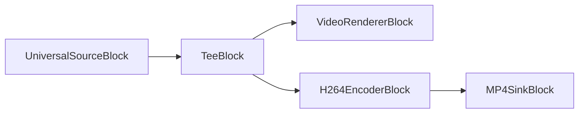
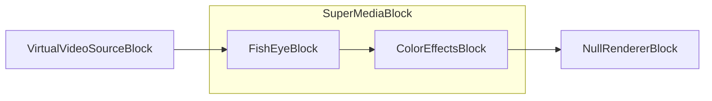
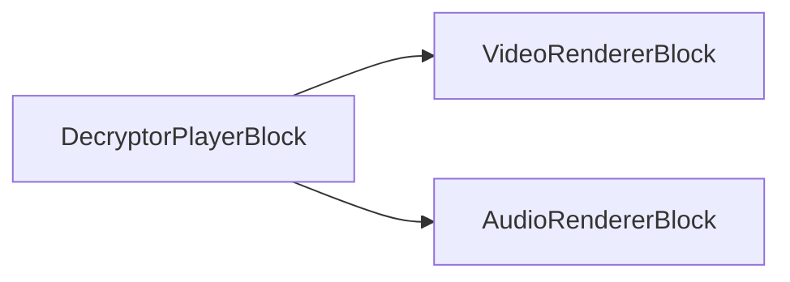
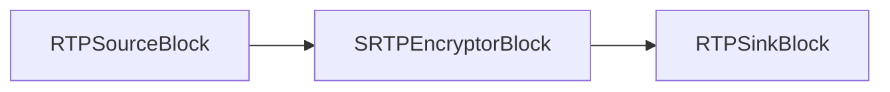

# Blocs spéciaux

[Media Blocks SDK .Net](https://www.visioforge.com/media-blocks-sdk-net){ .md-button .md-button--primary target="_blank" }

## Introduction

Les blocs spéciaux sont des blocs qui n'entrent dans aucune autre catégorie.

## Analyseur MPEG-TS

Le `TSAnalyzerBlock` est un moniteur MPEG-TS de qualité diffusion : il rapporte la liste des programmes (PAT/PMT/PSI), le débit par PID et total, la synchronisation PCR, l'embrouillage, les informations de service DVB, les détails de codec et la conformité complète ETSI TR 101 290 Priorité 1/2/3 — à partir d'un fichier ou d'un flux UDP/SRT en direct, soit comme puits terminal, soit comme passthrough en ligne.

Pour la référence complète — modes, paramètres, modèle de rapport et exemples de code — consultez la page dédiée [Bloc analyseur de flux MPEG-TS](TSAnalyzerBlock.md).

### Informations sur le bloc

Nom : TSAnalyzerBlock.

| Direction du pin | Type de média | Nombre de pins |
| --- | :---: | :---: |
| Entrée | Flux d'octets MPEG-TS | 1 |
| Sortie | Flux d'octets MPEG-TS (passthrough) | 1 en mode `InputOutput`, 0 en mode `Input` |

### Plateformes

Windows, macOS, Linux, iOS, Android.

## Null Renderer

Le bloc null renderer envoie les données vers null. Ce bloc peut être nécessaire lorsque votre bloc possède des sorties que vous ne souhaitez pas utiliser.

### Informations sur le bloc

Nom : NullRendererBlock.

Direction du pin | Type de média | Nombre de pins
--- | :---: | :---:
Entrée | Tout type | 1

### Pipeline d'exemple

Le pipeline d'exemple ci-dessous lit un fichier et envoie les données vidéo au capteur d'échantillons vidéo, dans lequel vous pouvez capturer chaque image vidéo après décodage. Le bloc Null Renderer sert à terminer le pipeline.


### Exemple de code

```csharp
private void Start()
{
  // créer le pipeline
  var pipeline = new MediaBlocksPipeline();

  // créer le bloc source universel
  var filename = "test.mp4";
  var fileSource = new UniversalSourceBlock(await UniversalSourceSettings.CreateAsync(filename));

  // créer le bloc capteur d'échantillons vidéo et ajouter le gestionnaire d'événements
  var sampleGrabber = new VideoSampleGrabberBlock();
  sampleGrabber.OnVideoFrameBuffer += sampleGrabber_OnVideoFrameBuffer;

  // créer le bloc null renderer (le type de média du pad est obligatoire — il doit correspondre à la sortie amont)
  var nullRenderer = new NullRendererBlock(MediaBlockPadMediaType.Video);

  // connecter les blocs
  pipeline.Connect(fileSource.VideoOutput, sampleGrabber.Input);        
  pipeline.Connect(sampleGrabber.Output, nullRenderer.Input);   

  // démarrer le pipeline
  await pipeline.StartAsync();
}

private void sampleGrabber_OnVideoFrameBuffer(object sender, VideoFrameXBufferEventArgs e)
{
    // nouvelle image vidéo reçue
}
```

### Plateformes

Windows, macOS, Linux, iOS, Android.

## Tee

Le bloc tee divise le flux de données vidéo ou audio en plusieurs flux qui sont des copies complètes du flux d'origine.

### Informations sur le bloc

Nom : TeeBlock.

Direction du pin | Type de média | Nombre de pins
--- | :---: | :---:
Entrée | Tout type | 1
Sortie | Identique à l'entrée | 2 ou plus

### Pipeline d'exemple



### Constructeur

```csharp
TeeBlock(int numOfOutputs, MediaBlockPadMediaType mediaType, TeeQueueSettings queueSettings = null)
```

Paramètres :

- `numOfOutputs` - Nombre initial de pads de sortie à créer (au moins 1).
- `mediaType` - Type de média que ce tee gérera (Video, Audio ou Auto).
- `queueSettings` - Paramètres de file d'attente facultatifs pour contrôler le comportement de mise en tampon. Si null, utilise les valeurs par défaut à faible latence.

### Paramètres de file d'attente

La classe `TeeQueueSettings` (espace de noms `VisioForge.Core.Types.X.Special`) contrôle le comportement de mise en tampon de chaque sortie tee. Par défaut, TeeBlock utilise des paramètres à faible latence (1 tampon par file) au lieu des valeurs par défaut GStreamer (200 tampons).

#### Propriétés de TeeQueueSettings

| Propriété | Type | Par défaut | Description |
| --- | :---: | :---: | --- |
| MaxSizeBuffers | uint | 1 | Nombre maximal de tampons dans la file. Définir à 0 pour désactiver. La valeur par défaut GStreamer est 200. |
| MaxSizeBytes | uint | 0 | Octets maximaux dans la file. Définir à 0 pour désactiver. La valeur par défaut GStreamer est 10485760 (10 Mo). |
| MaxSizeTime | ulong | 0 | Temps maximal en nanosecondes. Définir à 0 pour désactiver. La valeur par défaut GStreamer est 1000000000 (1 seconde). |
| MinThresholdBuffers | uint | 0 | Nombre minimal de tampons avant d'autoriser la lecture. |
| MinThresholdBytes | uint | 0 | Octets minimaux avant d'autoriser la lecture. |
| MinThresholdTime | ulong | 0 | Temps minimal en nanosecondes avant d'autoriser la lecture. |
| Leaky | TeeQueueLeaky | No | Endroit où la file fuit lorsqu'elle est pleine (No, Upstream ou Downstream). |
| FlushOnEos | bool | false | Rejeter toutes les données à la réception d'un EOS. |
| Silent | bool | true | Supprimer les signaux de file pour de meilleures performances. |

#### Énumération TeeQueueLeaky

| Valeur | Description |
| --- | --- |
| No | Pas de fuite — la file se bloque lorsqu'elle est pleine. |
| Upstream | Fuite côté amont (abandonner les tampons entrants lorsque pleine). |
| Downstream | Fuite côté aval (abandonner les anciens tampons lorsque pleine). |

#### Méthodes fabriques

- `TeeQueueSettings.LowLatency()` - Crée des paramètres optimisés pour une latence minimale (1 tampon, aucune limite d'octets/de temps). C'est le comportement par défaut.
- `TeeQueueSettings.GStreamerDefaults()` - Crée des paramètres correspondant aux valeurs par défaut GStreamer (200 tampons, 10 Mo, 1 seconde).

### Exemple de code

```csharp
var pipeline = new MediaBlocksPipeline();

var filename = "test.mp4";
var fileSource = new UniversalSourceBlock(await UniversalSourceSettings.CreateAsync(filename));

var videoTee = new TeeBlock(2, MediaBlockPadMediaType.Video);
var h264Encoder = new H264EncoderBlock(new OpenH264EncoderSettings());
var mp4Muxer = new MP4SinkBlock(new MP4SinkSettings(@"output.mp4"));
var videoRenderer = new VideoRendererBlock(pipeline, VideoView1);

pipeline.Connect(fileSource.VideoOutput, videoTee.Input);
pipeline.Connect(videoTee.Outputs[0], videoRenderer.Input);
pipeline.Connect(videoTee.Outputs[1], h264Encoder.Input);
pipeline.Connect(h264Encoder.Output, mp4Muxer.CreateNewInput(MediaBlockPadMediaType.Video));

await pipeline.StartAsync();
```

### Utilisation de paramètres de file d'attente personnalisés

```csharp
// Utiliser la mise en tampon par défaut GStreamer (latence plus élevée, davantage de tampons)
var gstreamerSettings = TeeQueueSettings.GStreamerDefaults();
var videoTee = new TeeBlock(2, MediaBlockPadMediaType.Video, gstreamerSettings);

// Ou créer des paramètres personnalisés
var customSettings = new TeeQueueSettings
{
    MaxSizeBuffers = 50,
    MaxSizeBytes = 5242880, // 5 Mo
    MaxSizeTime = 500000000, // 0,5 seconde
    Leaky = TeeQueueLeaky.Downstream // Abandonner les anciens tampons lorsque pleine
};
var audioTee = new TeeBlock(3, MediaBlockPadMediaType.Audio, customSettings);
```

#### Applications d'exemple

- [Simple Capture Demo](https://github.com/visioforge/.Net-SDK-s-samples/tree/master/Media%20Blocks%20SDK/WPF/CSharp/Simple%20Capture%20Demo)

### Plateformes

Windows, macOS, Linux, iOS, Android.

## Super MediaBlock

Le Super MediaBlock vous permet de combiner plusieurs blocs en un seul bloc.

### Informations sur le bloc

Nom : SuperMediaBlock.

Direction du pin | Type de média | Nombre de pins
--- | :---: | :---:
Entrée | Tout type | 1
Sortie | Tout type | 1

### Pipeline d'exemple


À l'intérieur du SuperMediaBlock :


Pipeline final :



### Exemple de code

```csharp
var pipeline = new MediaBlocksPipeline();

var videoViewBlock = new VideoRendererBlock(pipeline, VideoView1);

var videoSource = new VirtualVideoSourceBlock(new VirtualVideoSourceSettings());

var colorEffectsBlock = new ColorEffectsBlock(VisioForge.Core.Types.X.VideoEffects.ColorEffectsPreset.Sepia);
var fishEyeBlock = new FishEyeBlock();

var superBlock = new SuperMediaBlock();
superBlock.Blocks.Add(fishEyeBlock);
superBlock.Blocks.Add(colorEffectsBlock);
superBlock.Configure(pipeline);

pipeline.Connect(videoSource.Output, superBlock.Input);
pipeline.Connect(superBlock.Output, videoViewBlock.Input);

await pipeline.StartAsync();
```

### Plateformes

Windows, macOS, Linux, iOS, Android.

## Bloc Encryptor

Le bloc Encryptor chiffre un flux multimédia à l'aide du chiffrement AES en temps réel. Il peut servir à protéger des flux vidéo, audio ou de données avant l'écriture sur stockage ou l'envoi sur le réseau.

### Informations sur le bloc

Nom : EncryptorBlock.

| Direction du pin | Type de média | Nombre de pins |
| --- | :---: | :---: |
| Entrée | Tout type | 1 |
| Sortie | Tout type | 1 |

### Pipeline d'exemple


### Constructeur

```csharp
EncryptorBlock(EncryptorDecryptorSettings settings)
```

Paramètres :

- `settings` - Configuration de chiffrement AES, incluant la clé, le vecteur d'initialisation et le type de chiffre.

### Disponibilité

Appelez `EncryptorBlock.IsAvailable()` pour vérifier la prise en charge du chiffrement AES avant de créer une instance.

### Exemple de code

```csharp
var pipeline = new MediaBlocksPipeline();

var settings = new EncryptorDecryptorSettings(
    key: "1f9423681beb9a79215820f6bda73d0f",
    iv: "e9aa8e834d8d70b7e0d254ff670dd718");

var fileSource = new BasicFileSourceBlock("input.mp4");
var encryptor = new EncryptorBlock(settings);
var fileSink = new FileSinkBlock("encrypted.bin", false);

pipeline.Connect(fileSource.Output, encryptor.Input);
pipeline.Connect(encryptor.Output, fileSink.Input);

await pipeline.StartAsync();
```

### Plateformes

Windows, macOS, Linux.

## Bloc Decryptor

Le bloc Decryptor déchiffre en temps réel un flux multimédia chiffré AES, restaurant les données d'origine. La clé et l'IV doivent correspondre à ceux utilisés lors du chiffrement. Pour une solution complète de lecture de fichiers chiffrés, envisagez plutôt le [Bloc Decryptor Player](#bloc-decryptor-player).

### Informations sur le bloc

Nom : DecryptorBlock.

| Direction du pin | Type de média | Nombre de pins |
| --- | :---: | :---: |
| Entrée | Tout type | 1 |
| Sortie | Tout type | 1 |

### Pipeline d'exemple


### Constructeur

```csharp
DecryptorBlock(EncryptorDecryptorSettings settings)
```

Paramètres :

- `settings` - Configuration de déchiffrement AES. La clé et l'IV doivent correspondre aux paramètres de chiffrement.

### Exemple de code

```csharp
var pipeline = new MediaBlocksPipeline();

var settings = new EncryptorDecryptorSettings(
    key: "1f9423681beb9a79215820f6bda73d0f",
    iv: "e9aa8e834d8d70b7e0d254ff670dd718");

var fileSource = new BasicFileSourceBlock("encrypted.bin");
var decryptor = new DecryptorBlock(settings);
var queue = new QueueBlock();
var decodeBin = new DecodeBinBlock();

pipeline.Connect(fileSource.Output, decryptor.Input);
pipeline.Connect(decryptor.Output, queue.Input);
pipeline.Connect(queue.Output, decodeBin.Input);

var videoRenderer = new VideoRendererBlock(pipeline, VideoView1);
pipeline.Connect(decodeBin.VideoOutput, videoRenderer.Input);

await pipeline.StartAsync();
```

### Plateformes

Windows, macOS, Linux.

## Bloc Decryptor Player

Le bloc Decryptor Player est un bloc source composite combinant la lecture du fichier, le déchiffrement AES, la mise en file d'attente et le décodage en un seul bloc simple d'utilisation. Il n'a pas de pad d'entrée externe — il lit et déchiffre le fichier en interne. Connectez ses pads de sortie directement aux moteurs de rendu ou à d'autres blocs de traitement.

Pipeline interne : `BasicFileSourceBlock → DecryptorBlock → QueueBlock → DecodeBinBlock`

### Informations sur le bloc

Nom : DecryptorPlayerBlock.

| Direction du pin | Type de média | Nombre de pins |
| --- | :---: | :---: |
| Sortie vidéo | Vidéo non compressée | 1 |
| Sortie audio | Audio non compressé | 1 |
| Sortie sous-titres | Données de sous-titres | 1 (facultatif) |

### Pipeline d'exemple



### Constructeur

```csharp
DecryptorPlayerBlock(MediaBlocksPipeline pipeline, string filename, string key, string iv,
    bool renderVideo = true, bool renderAudio = true, bool renderSubtitle = false)
```

Paramètres :

- `pipeline` - Instance du pipeline parent.
- `filename` - Chemin du fichier multimédia chiffré AES.
- `key` - Clé de chiffrement sous forme de chaîne hexadécimale (32 caractères pour AES-128, 64 pour AES-256).
- `iv` - Vecteur d'initialisation sous forme de chaîne hexadécimale (toujours 32 caractères hex / 16 octets).
- `renderVideo` - Indique si le pad de sortie vidéo est exposé. Par défaut : `true`.
- `renderAudio` - Indique si le pad de sortie audio est exposé. Par défaut : `true`.
- `renderSubtitle` - Indique si le pad de sortie des sous-titres est exposé. Par défaut : `false`.

### Pads de sortie

- `VideoOutput` - Images vidéo décodées (disponible lorsque `renderVideo` vaut `true`).
- `AudioOutput` - Échantillons audio décodés (disponible lorsque `renderAudio` vaut `true`).
- `SubtitleOutput` - Données de sous-titres décodées (disponible lorsque `renderSubtitle` vaut `true`).

### Disponibilité

Appelez `DecryptorPlayerBlock.IsAvailable()` pour vérifier la prise en charge du déchiffrement avant de créer une instance.

### Exemple de code

```csharp
var pipeline = new MediaBlocksPipeline();

var decryptorPlayer = new DecryptorPlayerBlock(
    pipeline,
    filename: "encrypted.bin",
    key: "1f9423681beb9a79215820f6bda73d0f",
    iv: "e9aa8e834d8d70b7e0d254ff670dd718");

var videoRenderer = new VideoRendererBlock(pipeline, VideoView1);
var audioRenderer = new AudioRendererBlock();

pipeline.Connect(decryptorPlayer.VideoOutput, videoRenderer.Input);
pipeline.Connect(decryptorPlayer.AudioOutput, audioRenderer.Input);

await pipeline.StartAsync();
```

### Plateformes

Windows, macOS, Linux.

## Bloc SRTP Encryptor

Le bloc SRTP Encryptor chiffre les flux multimédias RTP via SRTP (Secure Real-time Transport Protocol) tel que défini dans la RFC 3711. Il offre confidentialité, authentification des messages et protection contre la rediffusion pour les flux multimédias temps réel comme la visioconférence ou la diffusion en direct.

### Informations sur le bloc

Nom : SRTPEncryptorBlock.

| Direction du pin | Type de média | Nombre de pins |
| --- | :---: | :---: |
| Entrée | RTP | 1 |
| Sortie | SRTP | 1 |

### Pipeline d'exemple



### Constructeur

```csharp
SRTPEncryptorBlock(SRTPSettings settings)
```

Paramètres :

- `settings` - Configuration de chiffrement SRTP incluant la clé maître, la suite de chiffrement et la méthode d'authentification.

### Disponibilité

Appelez `SRTPEncryptorBlock.IsAvailable()` pour vérifier la prise en charge SRTP avant de créer une instance.

### Exemple de code

```csharp
var settings = new SRTPSettings("000102030405060708090A0B0C0D0E0F")
{
    Cipher = SRTPCipher.AES_128_ICM,
    Auth = SRTPAuth.HMAC_SHA1_80
};

var encryptor = new SRTPEncryptorBlock(settings);
```

### Plateformes

Windows, macOS, Linux.

## Bloc SRTP Decryptor

Le bloc SRTP Decryptor déchiffre les flux RTP chiffrés SRTP entrants pour les ramener en RTP en clair. Les paramètres doivent correspondre à ceux utilisés par l'encrypteur. Il vérifie également les balises d'authentification des messages et offre une protection contre les attaques par rediffusion.

### Informations sur le bloc

Nom : SRTPDecryptorBlock.

| Direction du pin | Type de média | Nombre de pins |
| --- | :---: | :---: |
| Entrée | SRTP | 1 |
| Sortie | RTP | 1 |

### Pipeline d'exemple


### Constructeur

```csharp
SRTPDecryptorBlock(SRTPSettings settings)
```

Paramètres :

- `settings` - Configuration de déchiffrement SRTP. Doit correspondre aux paramètres de chiffrement utilisés côté émetteur.

### Disponibilité

Appelez `SRTPDecryptorBlock.IsAvailable()` pour vérifier la prise en charge SRTP avant de créer une instance.

### Exemple de code

```csharp
var settings = new SRTPSettings("000102030405060708090A0B0C0D0E0F");
var decryptor = new SRTPDecryptorBlock(settings);
```

### Plateformes

Windows, macOS, Linux.

## SRTPSettings

La classe `SRTPSettings` fournit la configuration des opérations de chiffrement et de déchiffrement SRTP. (Source : `VisioForge.Core/Types/X/Special/SRTPSettings.cs`)

### Propriétés

| Propriété | Type | Par défaut | Description |
| --- | :---: | :---: | --- |
| Key | string | — | Clé maître sous forme de chaîne hex. 32 caractères hex (16 octets) pour AES-128-ICM ; 64 caractères hex (32 octets) pour AES-256-ICM. |
| Cipher | SRTPCipher | AES_128_ICM | Algorithme de chiffrement. |
| Auth | SRTPAuth | HMAC_SHA1_80 | Méthode d'authentification. |
| SSRC | uint | 0 | Identifiant Synchronization Source RTP. Utilisez 0 pour correspondre à toute SSRC. |

### Constructeurs

- `SRTPSettings()` - Crée des paramètres avec chiffrement AES-128-ICM et authentification HMAC-SHA1-80.
- `SRTPSettings(string key)` - Crée des paramètres avec la clé maître spécifiée et les valeurs par défaut.

### Plateformes

Windows, macOS, Linux.

## SRTPCipher

L'énumération `SRTPCipher` définit les algorithmes de chiffrement disponibles pour SRTP. (Source : `VisioForge.Core/Types/X/Special/SRTPSettings.cs`)

### Valeurs de l'énumération

- `NULL` - Pas de chiffrement. Fournit uniquement l'authentification.
- `AES_128_ICM` - AES-128 en Integer Counter Mode. Choix le plus courant ; nécessite une clé de 16 octets (32 caractères hex).
- `AES_256_ICM` - AES-256 en Integer Counter Mode. Sécurité maximale ; nécessite une clé de 32 octets (64 caractères hex).

### Plateformes

Windows, macOS, Linux.

## SRTPAuth

L'énumération `SRTPAuth` définit les méthodes d'authentification de message disponibles pour SRTP. (Source : `VisioForge.Core/Types/X/Special/SRTPSettings.cs`)

### Valeurs de l'énumération

- `NULL` - Pas d'authentification. Non recommandé en production.
- `HMAC_SHA1_80` - HMAC-SHA1 avec un tag d'authentification 80 bits. Recommandé pour la plupart des applications.
- `HMAC_SHA1_32` - HMAC-SHA1 avec un tag d'authentification 32 bits. Surcharge de bande passante réduite pour les réseaux contraints.

### Plateformes

Windows, macOS, Linux.

## AESCipher

L'énumération `AESCipher` définit les types de chiffres AES utilisables. (Source : `VisioForge.Core/Types/X/Special/AESCipher.cs`)

### Valeurs de l'énumération

- `AES_128` : clé de chiffrement AES 128 bits en mode CBC.
- `AES_256` : clé de chiffrement AES 256 bits en mode CBC.

### Plateformes

Windows, macOS, Linux, iOS, Android.

## EncryptorDecryptorSettings

La classe `EncryptorDecryptorSettings` contient les paramètres des opérations de chiffrement et de déchiffrement. (Source : `VisioForge.Core/Types/X/Special/EncryptorDecryptorSettings.cs`)

### Propriétés

- `Cipher` (`AESCipher`) : obtient ou définit le type de chiffre AES. Par défaut `AES_128`.
- `Key` (`string`) : obtient ou définit la clé de chiffrement.
- `IV` (`string`) : obtient ou définit le vecteur d'initialisation (16 octets en hex).
- `SerializeIV` (`bool`) : obtient ou définit une valeur indiquant s'il faut sérialiser l'IV.

### Constructeur

- `EncryptorDecryptorSettings(string key, string iv)` : initialise une nouvelle instance avec la clé et le vecteur d'initialisation indiqués.

### Plateformes

Windows, macOS, Linux, iOS, Android.

## CustomMediaBlockPad

La classe `CustomMediaBlockPad` définit les informations d'un pad d'un `CustomMediaBlock`. (Source : `VisioForge.Core/Types/X/Special/CustomMediaBlockPad.cs`)

### Propriétés

- `Direction` (`MediaBlockPadDirection`) : obtient ou définit la direction du pad (entrée/sortie).
- `MediaType` (`MediaBlockPadMediaType`) : obtient ou définit le type de média du pad (par ex. Audio, Video).
- `CustomCaps` (`Gst.Caps`) : obtient ou définit des capacités GStreamer personnalisées pour un pad de sortie.

### Constructeur

- `CustomMediaBlockPad(MediaBlockPadDirection direction, MediaBlockPadMediaType mediaType)` : initialise une nouvelle instance avec la direction et le type de média spécifiés.

### Plateformes

Windows, macOS, Linux, iOS, Android.

## CustomMediaBlockSettings

La classe `CustomMediaBlockSettings` fournit les paramètres de configuration d'un bloc multimédia personnalisé, potentiellement encapsulant des éléments GStreamer. (Source : `VisioForge.Core/Types/X/Special/CustomMediaBlockSettings.cs`)

### Propriétés

- `ElementName` (`string`) : obtient le nom de l'élément GStreamer ou de l'élément Media Blocks SDK. Pour créer un Bin GStreamer personnalisé, inclure des crochets, par ex. `"[ videotestsrc ! videoconvert ]"`.
- `UsePadAddedEvent` (`bool`) : obtient ou définit une valeur indiquant s'il faut utiliser l'événement `pad-added` pour les pads GStreamer créés dynamiquement.
- `ElementParams` (`Dictionary<string, object>`) : obtient les paramètres de l'élément.
- `Pads` (`List<CustomMediaBlockPad>`) : obtient la liste des définitions `CustomMediaBlockPad` du bloc.
- `ListProperties` (`bool`) : obtient ou définit une valeur indiquant s'il faut lister les propriétés de l'élément dans la fenêtre Debug après création. Par défaut `false`.

### Constructeur

- `CustomMediaBlockSettings(string elementName)` : initialise une nouvelle instance avec le nom d'élément spécifié.

### Plateformes

Windows, macOS, Linux, iOS, Android.

## InputSelectorSyncMode

L'énumération `InputSelectorSyncMode` définit la manière dont un input-selector (utilisé par `SourceSwitchSettings`) synchronise les tampons en mode `sync-streams`. (Source : `VisioForge.Core/Types/X/Special/SourceSwitchSettings.cs`)

### Valeurs de l'énumération

- `ActiveSegment` (0) : synchronisation à l'aide du segment actif actuel.
- `Clock` (1) : synchronisation à l'aide de l'horloge.

### Plateformes

Windows, macOS, Linux, iOS, Android.

## SourceSwitchSettings

La classe `SourceSwitchSettings` configure un bloc capable de basculer entre plusieurs sources d'entrée. (Source : `VisioForge.Core/Types/X/Special/SourceSwitchSettings.cs`)

Le résumé « Represents the currently active sink pad » du commentaire du code peut être légèrement trompeur ou incomplet pour le nom de classe `SourceSwitchSettings`. Les propriétés suggèrent qu'il s'agit de configurer un commutateur de sources.

### Propriétés

- `PadsCount` (`int`) : obtient ou définit le nombre de pads d'entrée. Par défaut `2`.
- `DefaultActivePad` (`int`) : obtient ou définit le pad puits initialement actif.
- `CacheBuffers` (`bool`) : obtient ou définit l'option indiquant si le pad actif met les tampons en cache pour éviter de manquer des images lors de la réactivation. Par défaut `false`.
- `DropBackwards` (`bool`) : obtient ou définit l'option d'abandonner les tampons rétrogrades par rapport au dernier tampon de sortie avant la bascule. Par défaut `false`.
- `SyncMode` (`InputSelectorSyncMode`) : obtient ou définit la manière dont l'input-selector synchronise les tampons en mode `sync-streams`. Par défaut `InputSelectorSyncMode.ActiveSegment`.
- `SyncStreams` (`bool`) : obtient ou définit si tous les flux inactifs sont synchronisés au running time du flux actif ou à l'horloge courante. Par défaut `true`.
- `CustomName` (`string`) : obtient ou définit un nom personnalisé à des fins de journalisation. Par défaut `"SourceSwitch"`.

### Constructeur

- `SourceSwitchSettings(int padsCount = 2)` : initialise une nouvelle instance, en spécifiant facultativement le nombre de pads.

### Plateformes

Windows, macOS, Linux, iOS, Android.

## Bloc Queue

Le bloc Queue fournit une mise en tampon entre les éléments du pipeline afin de lisser les variations de traitement et de permettre un flux de données asynchrone.

### Informations sur le bloc

Nom : QueueBlock.

| Direction du pin | Type de média | Nombre de pins |
| --- | :---: | :---: |
| Entrée | tout type | 1 |
| Sortie | tout type | 1 |

### Exemple de code

```csharp
var pipeline = new MediaBlocksPipeline();

var fileSource = new UniversalSourceBlock(await UniversalSourceSettings.CreateAsync("test.mp4"));

var queue = new QueueBlock();
pipeline.Connect(fileSource.VideoOutput, queue.Input);

var videoRenderer = new VideoRendererBlock(pipeline, VideoView1);
pipeline.Connect(queue.Output, videoRenderer.Input);

await pipeline.StartAsync();
```

### Plateformes

Windows, macOS, Linux, iOS, Android.

## Bloc MultiQueue

Le bloc MultiQueue fournit une mise en tampon synchronisée pour plusieurs flux, essentielle pour maintenir la synchro A/V dans les pipelines complexes.

### Informations sur le bloc

Nom : MultiQueueBlock.

| Direction du pin | Type de média | Nombre de pins |
| --- | :---: | :---: |
| Entrée | tout type | multiples |
| Sortie | tout type | multiples |

### Exemple de code

```csharp
var pipeline = new MediaBlocksPipeline();

var fileSource = new UniversalSourceBlock(await UniversalSourceSettings.CreateAsync("test.mp4"));

// Le constructeur de MultiQueueBlock pré-alloue des paires de pads entrée/sortie (par défaut 2).
var multiqueue = new MultiQueueBlock(inputOutputCount: 2);

pipeline.Connect(fileSource.VideoOutput, multiqueue.Inputs[0]);
pipeline.Connect(fileSource.AudioOutput, multiqueue.Inputs[1]);

// Connecter les sorties aux encodeurs/moteurs de rendu
await pipeline.StartAsync();
```

### Plateformes

Windows, macOS, Linux, iOS, Android.

## Source Switch

Le bloc SourceSwitch permet de basculer dynamiquement entre plusieurs sources d'entrée sans interrompre le pipeline.

### Informations sur le bloc

Nom : SourceSwitchBlock.

| Direction du pin | Type de média | Nombre de pins |
| --- | :---: | :---: |
| Entrée | tout type | multiples |
| Sortie | tout type | 1 |

### Exemple de code

```csharp
var pipeline = new MediaBlocksPipeline();

var source1 = new UniversalSourceBlock(await UniversalSourceSettings.CreateAsync("video1.mp4"));
var source2 = new UniversalSourceBlock(await UniversalSourceSettings.CreateAsync("video2.mp4"));

// SourceSwitchSettings(padsCount) pré-alloue les pads d'entrée.
var switchSettings = new SourceSwitchSettings(2) { DefaultActivePad = 0 };
var sourceSwitch = new SourceSwitchBlock(switchSettings);

// Câbler les sources aux pads d'entrée pré-alloués
pipeline.Connect(source1.VideoOutput, sourceSwitch.Inputs[0]);
pipeline.Connect(source2.VideoOutput, sourceSwitch.Inputs[1]);

var videoRenderer = new VideoRendererBlock(pipeline, VideoView1);
pipeline.Connect(sourceSwitch.Output, videoRenderer.Input);

await pipeline.StartAsync();

// Basculer vers la deuxième source
sourceSwitch.Switch(1);
```

### Plateformes

Windows, macOS, Linux, iOS, Android.

## Universal Decoder

Le bloc UniversalDecoder détecte et décode automatiquement divers formats audio et vidéo compressés.

### Informations sur le bloc

Nom : UniversalDecoderBlock.

| Direction du pin | Type de média | Nombre de pins |
| --- | :---: | :---: |
| Entrée | média compressé | 1 |
| Sortie | média non compressé | multiples |

### Exemple de code

```csharp
var pipeline = new MediaBlocksPipeline();

var fileSource = new UniversalSourceBlock(await UniversalSourceSettings.CreateAsync("test.mp4"));

var decoder = new UniversalDecoderBlock();
pipeline.Connect(fileSource.VideoOutput, decoder.Input);

var videoRenderer = new VideoRendererBlock(pipeline, VideoView1);
pipeline.Connect(decoder.VideoOutput, videoRenderer.Input);

await pipeline.StartAsync();
```

### Plateformes

Windows, macOS, Linux, iOS, Android.

## Universal Demux Decoder

Le bloc UniversalDemuxDecoder combine démultiplexage et décodage dans un seul bloc pour simplifier la construction du pipeline.

### Informations sur le bloc

Nom : UniversalDemuxDecoderBlock.

| Direction du pin | Type de média | Nombre de pins |
| --- | :---: | :---: |
| Entrée | format conteneur | 1 |
| Sortie vidéo | vidéo non compressée | 1 |
| Sortie audio | audio non compressé | 1 |

### Exemple de code

```csharp
var pipeline = new MediaBlocksPipeline();

var demuxDecoder = new UniversalDemuxDecoderBlock(
    await UniversalSourceSettings.CreateAsync("test.mp4"));

var videoRenderer = new VideoRendererBlock(pipeline, VideoView1);
pipeline.Connect(demuxDecoder.VideoOutput, videoRenderer.Input);

var audioRenderer = new AudioRendererBlock();
pipeline.Connect(demuxDecoder.AudioOutput, audioRenderer.Input);

await pipeline.StartAsync();
```

### Plateformes

Windows, macOS, Linux, iOS, Android.

## Détecteur de codes-barres

Le bloc BarcodeDetector détecte et décode divers formats de codes-barres (QR codes, DataMatrix, Code128, EAN-13, etc.) dans les flux vidéo en temps réel.

Pour un guide complet avec des exemples multiplateformes, consultez le [Guide du lecteur de codes-barres et QR codes](../Guides/barcode-qr-reader-guide.md).

### Informations sur le bloc

Nom : BarcodeDetectorBlock.

| Direction du pin | Type de média | Nombre de pins |
| --- | :---: | :---: |
| Entrée | vidéo non compressée | 1 |
| Sortie | vidéo non compressée | 1 (mode InputOutput) ou 0 (mode InputOnly) |

### Exemple de code

```csharp
var pipeline = new MediaBlocksPipeline();

var videoSource = new SystemVideoSourceBlock(videoSettings);

var barcodeDetector = new BarcodeDetectorBlock(BarcodeDetectorMode.InputOutput);
barcodeDetector.OnBarcodeDetected += (sender, args) =>
{
    Console.WriteLine($"Barcode detected: {args.BarcodeType} - {args.Value}");
};
pipeline.Connect(videoSource.Output, barcodeDetector.Input);

var videoRenderer = new VideoRendererBlock(pipeline, VideoView1);
pipeline.Connect(barcodeDetector.Output, videoRenderer.Input);

await pipeline.StartAsync();
```

### Plateformes

Windows, macOS, Linux, iOS, Android.

## Décodeur DataMatrix

Le bloc DataMatrixDecoder détecte et décode les codes-barres 2D DataMatrix dans les flux vidéo.

### Informations sur le bloc

Nom : DataMatrixDecoderBlock.

| Direction du pin | Type de média | Nombre de pins |
| --- | :---: | :---: |
| Entrée | vidéo non compressée | 1 |
| Sortie | vidéo non compressée | 1 |

### Exemple de code

```csharp
var pipeline = new MediaBlocksPipeline();

var videoSource = new SystemVideoSourceBlock(videoSettings);

var dataMatrixDecoder = new DataMatrixDecoderBlock();
dataMatrixDecoder.OnDataMatrixDetected += (sender, args) =>
{
    Console.WriteLine($"DataMatrix detected: {args.Data}");
};
pipeline.Connect(videoSource.Output, dataMatrixDecoder.Input);

var videoRenderer = new VideoRendererBlock(pipeline, VideoView1);
pipeline.Connect(dataMatrixDecoder.Output, videoRenderer.Input);

await pipeline.StartAsync();
```

### Plateformes

Windows, macOS, Linux, iOS, Android.

## Frame Doubler

Le bloc FrameDoubler duplique les images vidéo pour augmenter la fréquence d'images effective.

### Informations sur le bloc

Nom : FrameDoublerBlock.

| Direction du pin | Type de média | Nombre de pins |
| --- | :---: | :---: |
| Entrée | vidéo non compressée | 1 |
| Sortie | vidéo non compressée | 1 |

### Exemple de code

```csharp
var pipeline = new MediaBlocksPipeline();

var fileSource = new UniversalSourceBlock(await UniversalSourceSettings.CreateAsync("test.mp4"));

var frameDoubler = new FrameDoublerBlock();
pipeline.Connect(fileSource.VideoOutput, frameDoubler.Input);

var videoRenderer = new VideoRendererBlock(pipeline, VideoView1);
pipeline.Connect(frameDoubler.Output, videoRenderer.Input);

await pipeline.StartAsync();
```

### Plateformes

Windows, macOS, Linux, iOS, Android.

## Decode Bin

Le bloc DecodeBin sélectionne et gère automatiquement les décodeurs appropriés pour les flux multimédias.

### Informations sur le bloc

Nom : DecodeBinBlock.

| Direction du pin | Type de média | Nombre de pins |
| --- | :---: | :---: |
| Entrée | média compressé | 1 |
| Sortie | média non compressé | dynamique |

### Exemple de code

```csharp
var pipeline = new MediaBlocksPipeline();

var fileSource = new UniversalSourceBlock(await UniversalSourceSettings.CreateAsync("test.mp4"));

var decodeBin = new DecodeBinBlock();
pipeline.Connect(fileSource.VideoOutput, decodeBin.Input);

// DecodeBin créera des pads de sortie dynamiquement à mesure que les flux sont découverts
await pipeline.StartAsync();
```

### Plateformes

Windows, macOS, Linux, iOS, Android.

## Parse Bin

Le bloc ParseBin analyse automatiquement les flux multimédias et expose les flux élémentaires.

### Informations sur le bloc

Nom : ParseBinBlock.

| Direction du pin | Type de média | Nombre de pins |
| --- | :---: | :---: |
| Entrée | média compressé | 1 |
| Sortie | flux analysés | dynamique |

### Exemple de code

```csharp
var pipeline = new MediaBlocksPipeline();

var fileSource = new UniversalSourceBlock(await UniversalSourceSettings.CreateAsync("test.mp4"));

var parseBin = new ParseBinBlock();
pipeline.Connect(fileSource.VideoOutput, parseBin.Input);

// ParseBin créera des pads de sortie pour chaque flux découvert
await pipeline.StartAsync();
```

### Plateformes

Windows, macOS, Linux, iOS, Android.

## Custom Transform

Le bloc CustomTransform permet d'intégrer une logique de transformation personnalisée dans le pipeline.

### Informations sur le bloc

Nom : CustomTransformBlock.

| Direction du pin | Type de média | Nombre de pins |
| --- | :---: | :---: |
| Entrée | tout type | 1 |
| Sortie | tout type | 1 |

### Exemple de code

Encapsulez tout élément GStreamer (ou bin) dans un pipeline Media Blocks via `CustomMediaBlock` + `CustomMediaBlockSettings`. `ElementName` se définit dans le constructeur ; les paramètres propres à l'élément vont dans le dictionnaire `ElementParams`.

```csharp
var pipeline = new MediaBlocksPipeline();

var fileSource = new UniversalSourceBlock(await UniversalSourceSettings.CreateAsync("test.mp4"));

// Encapsuler l'élément GStreamer « videoscale ».
var customSettings = new CustomMediaBlockSettings("videoscale");
customSettings.ElementParams.Add("method", 0);
var customBlock = new CustomMediaBlock(customSettings);

pipeline.Connect(fileSource.VideoOutput, customBlock.Input);

var videoRenderer = new VideoRendererBlock(pipeline, VideoView1);
pipeline.Connect(customBlock.Output, videoRenderer.Input);

await pipeline.StartAsync();
```

> **Remarque :** `CustomTransformBlock` est un bloc différent, de plus bas niveau, conçu pour pousser des échantillons par programmation depuis du code C# (via `PushSample`/`PushBuffer`) — il n'encapsule pas d'élément GStreamer par nom.

### Plateformes

Windows, macOS, Linux, iOS, Android.

## Data Sample Grabber

Le bloc DataSampleGrabber intercepte et fournit l'accès aux tampons de données qui transitent par le pipeline.

### Informations sur le bloc

Nom : DataSampleGrabberBlock.

| Direction du pin | Type de média | Nombre de pins |
| --- | :---: | :---: |
| Entrée | tout type | 1 |
| Sortie | tout type | 1 |

### Exemple de code

```csharp
var pipeline = new MediaBlocksPipeline();

var fileSource = new UniversalSourceBlock(await UniversalSourceSettings.CreateAsync("test.mp4"));

var dataSG = new DataSampleGrabberBlock();
dataSG.OnDataFrame += (sender, args) =>
{
    // Type d'événement réel : EventHandler<DataFrameEventArgs> avec un DataFrame sur .Frame
    var dataFrame = args.Frame;
};
pipeline.Connect(fileSource.VideoOutput, dataSG.Input);

var videoRenderer = new VideoRendererBlock(pipeline, VideoView1);
pipeline.Connect(dataSG.Output, videoRenderer.Input);

await pipeline.StartAsync();
```

### Plateformes

Windows, macOS, Linux, iOS, Android.

## Data Processor

Le bloc DataProcessor fournit des capacités de traitement de données personnalisées pour des formats de données non standard.

### Informations sur le bloc

Nom : DataProcessorBlock.

| Direction du pin | Type de média | Nombre de pins |
| --- | :---: | :---: |
| Entrée | tout type | 1 |
| Sortie | tout type | 1 |

### Exemple de code

```csharp
var pipeline = new MediaBlocksPipeline();

var dataSource = new CustomDataSource();

var dataProcessor = new DataProcessorBlock();
pipeline.Connect(dataSource.Output, dataProcessor.Input);

// Traiter et transmettre les données
await pipeline.StartAsync();
```

### Plateformes

Windows, macOS, Linux, iOS, Android.

## Custom Colorspace

Le `CustomColorspaceXBlock` convertit la vidéo brute de RGB vers YV12 (YUV 4:2:0 planaire) à l'aide d'un plugin GStreamer C# intégré. La conversion applique les coefficients ITU-R BT.601 avec un moyennage par blocs 2×2 pour le sous-échantillonnage de la chrominance.

Les propriétés facultatives `Width`, `Height` et `FrameRate` contraignent la négociation des caps ; laissez-les non définies pour une négociation automatique. La largeur et la hauteur doivent être des nombres pairs.

`CustomColorspaceXBlock.IsAvailable()` renvoie toujours `true` — le plugin est implémenté en code managé et ne nécessite aucune dépendance GStreamer externe.

### Informations sur le bloc

Nom : CustomColorspaceXBlock.

Direction du pin | Type de média | Nombre de pins
--- | :---: | :---:
Entrée | video/x-raw (RGB) | 1
Sortie | video/x-raw (YV12) | 1

### Exemple de code

```csharp
var pipeline = new MediaBlocksPipeline();

var filename = "test.mp4";
var fileSource = new UniversalSourceBlock(await UniversalSourceSettings.CreateAsync(filename));

var colorspace = new CustomColorspaceXBlock(width: 1280, height: 720);
pipeline.Connect(fileSource.VideoOutput, colorspace.Input);

var videoRenderer = new VideoRendererBlock(pipeline, VideoView1);
pipeline.Connect(colorspace.Output, videoRenderer.Input);

await pipeline.StartAsync();
```

### Plateformes

Windows, macOS, Linux, iOS, Android.

## Live Sync

Le `LiveSyncBlock` encapsule l'élément GStreamer `livesync` pour maintenir un pipeline en direct en temps réel. Il abandonne les images arrivant en retard et duplique la dernière image lorsque la source cale, maintenant une sortie temps réel fluide sans calage du pipeline. Les flux audio et vidéo sont pris en charge.

Utilisez ce bloc dans les pipelines de diffusion en direct ou de capture pour absorber le jitter temporel des sources réseau ou matérielles.

### Informations sur le bloc

Nom : LiveSyncBlock.

Direction du pin | Type de média | Nombre de pins
--- | :---: | :---:
Entrée | Tout type | 1
Sortie | Tout type | 1

### Disponibilité

`LiveSyncBlock.IsAvailable()` renvoie `true` si l'élément GStreamer `livesync` est présent.

### Exemple de code

```csharp
var pipeline = new MediaBlocksPipeline();

var rtmpSettings = await RTMPSourceSettings.CreateAsync(new Uri("rtmp://example.com/live/stream"));
var rtmpSource = new RTMPSourceBlock(rtmpSettings);

var liveSync = new LiveSyncBlock();
pipeline.Connect(rtmpSource.VideoOutput, liveSync.Input);

var videoRenderer = new VideoRendererBlock(pipeline, VideoView1);
pipeline.Connect(liveSync.Output, videoRenderer.Input);

await pipeline.StartAsync();
```

### Plateformes

Windows, macOS, Linux.

## Custom Media Block

Le `CustomMediaBlock` est un pont flexible entre la couche d'abstraction MediaBlocks et les éléments GStreamer bruts. Il peut encapsuler tout élément GStreamer par nom de fabrique ou encapsuler une description de pipeline bin, ce qui est utile pour intégrer des plugins tiers, des éléments expérimentaux ou des fonctionnalités non encore couvertes par une classe MediaBlocks dédiée.

Les paramètres et types de pads associés (`CustomMediaBlockSettings`, `CustomMediaBlockPad`) sont documentés dans les sections [CustomMediaBlockSettings](#custommediablocksettings) et [CustomMediaBlockPad](#custommediablockpad) ci-dessus.

### Informations sur le bloc

Nom : CustomMediaBlock.

| Direction du pin | Type de média | Nombre de pins |
| --- | :---: | :---: |
| Entrée | Défini par les paramètres | 0…N |
| Sortie | Défini par les paramètres | 0…N |

### Fonctionnalités clés

- Encapsuler tout élément GStreamer par son nom (par ex. `"videoscale"`) ou comme description de bin (par ex. `"[ videoscale ! videoconvert ]"`).
- Définir les propriétés de l'élément via le dictionnaire `ElementParams` avant le démarrage du pipeline.
- Recevoir le `Gst.Element` brut via l'événement `OnElementAdded` pour une configuration supplémentaire.
- Utiliser `UsePadAddedEvent = true` pour les éléments à pads dynamiques (par ex. démultiplexeurs).
- Appliquer des filtres de caps facultatifs sur les pads de sortie via `CustomMediaBlockPad.CustomCaps`.

### Événements

- `OnElementAdded` — déclenché immédiatement après la création de l'élément GStreamer et son ajout au pipeline, permettant la configuration directe des propriétés ou signaux sur l'élément brut.

### Pipeline d'exemple


### Exemple de code

```csharp
var pipeline = new MediaBlocksPipeline();

var fileSource = new UniversalSourceBlock(await UniversalSourceSettings.CreateAsync("test.mp4"));

// Encapsuler l'élément GStreamer videoscale avec une propriété
var settings = new CustomMediaBlockSettings("videoscale")
{
    ListProperties = false
};
settings.ElementParams["method"] = 0; // plus proche voisin
settings.Pads.Add(new CustomMediaBlockPad(MediaBlockPadDirection.In, MediaBlockPadMediaType.Video));
settings.Pads.Add(new CustomMediaBlockPad(MediaBlockPadDirection.Out, MediaBlockPadMediaType.Video));

var customBlock = new CustomMediaBlock(settings);
customBlock.OnElementAdded += (sender, element) =>
{
    // Configuration supplémentaire de l'élément après création
};

pipeline.Connect(fileSource.VideoOutput, customBlock.Input);

var videoRenderer = new VideoRendererBlock(pipeline, VideoView1);
pipeline.Connect(customBlock.Output, videoRenderer.Input);

await pipeline.StartAsync();
```

### Exemple de description de bin

```csharp
// Encapsuler un pipeline GStreamer multi-éléments en un seul bloc
var settings = new CustomMediaBlockSettings("[ videoscale ! videoconvert ]");
settings.Pads.Add(new CustomMediaBlockPad(MediaBlockPadDirection.In, MediaBlockPadMediaType.Video));
settings.Pads.Add(new CustomMediaBlockPad(MediaBlockPadDirection.Out, MediaBlockPadMediaType.Video));

var customBlock = new CustomMediaBlock(settings);
```

### Plateformes

Windows, macOS, Linux, iOS, Android.

---

## Universal Transform Block

Le `UniversalTransformBlock` est une classe de base abstraite pour implémenter des transformations d'images vidéo personnalisées en code C# managé. Il prend en charge les transformations 1:N : une image d'entrée unique peut produire zéro, une ou plusieurs images de sortie, ce qui permet des cas d'usage comme l'abandon d'images, la duplication, le découpage ou la conversion de format.

Sous-classez `UniversalTransformBlock`, fournissez des chaînes de caps GStreamer pour l'entrée et la sortie, et redéfinissez `OnTransformFrame` pour implémenter la logique de transformation.

### Informations sur le bloc

Nom : (sous-classe définie par l'utilisateur).

| Direction du pin | Type de média | Nombre de pins |
| --- | :---: | :---: |
| Entrée vidéo | Vidéo non compressée | 1 |
| Sortie vidéo | Vidéo non compressée | 1 |

### Constructeur (protégé)

```csharp
protected UniversalTransformBlock(string inputCaps, string outputCaps)
```

Paramètres :

- `inputCaps` — chaîne de caps GStreamer décrivant le format d'entrée accepté (par ex. `"video/x-raw,format=RGB,width=1920,height=1080,framerate=30/1"`).
- `outputCaps` — chaîne de caps GStreamer décrivant le format de sortie produit.

### Méthode abstraite à redéfinir

```csharp
protected abstract List<Gst.Buffer> OnTransformFrame(
    Gst.Buffer inputBuffer,
    Gst.Caps inputCaps,
    Gst.Caps outputCaps);
```

Sémantique de la valeur renvoyée :

- **Liste vide** — abandonner l'image (aucune sortie produite).
- **Un tampon** — transformation 1:1 standard.
- **Plusieurs tampons** — transformation 1:N (par ex. duplication ou découpage d'images).

### Méthodes auxiliaires

- `CreateBuffer(byte[] data, ulong pts, ulong dts, ulong duration)` — crée un `Gst.Buffer` à partir d'un tableau d'octets managé.
- `GetVideoInfo(Caps caps, out string format, out int width, out int height, out int frameRateNum, out int frameRateDen)` — analyse le format vidéo, les dimensions et la fréquence d'images depuis un objet caps.

### Pipeline d'exemple


### Exemple de code

```csharp
// Définir une transformation personnalisée : inverser chaque image (RGB → RGB)
public class InvertTransformBlock : UniversalTransformBlock
{
    public InvertTransformBlock()
        : base(
            inputCaps:  "video/x-raw,format=RGB",
            outputCaps: "video/x-raw,format=RGB")
    {
    }

    protected override List<Gst.Buffer> OnTransformFrame(
        Gst.Buffer inputBuffer,
        Gst.Caps inputCaps,
        Gst.Caps outputCaps)
    {
        // Mapper le tampon d'entrée, inverser les pixels, renvoyer un nouveau tampon
        using var map = inputBuffer.Map(Gst.MapFlags.Read);
        var data = map.Data.ToArray();
        for (int i = 0; i < data.Length; i++)
            data[i] = (byte)(255 - data[i]);

        var output = CreateBuffer(data, inputBuffer.Pts, inputBuffer.Dts, inputBuffer.Duration);
        return new List<Gst.Buffer> { output };
    }
}

// Utilisation dans un pipeline
var pipeline = new MediaBlocksPipeline();

var fileSource = new UniversalSourceBlock(await UniversalSourceSettings.CreateAsync("test.mp4"));
var transform = new InvertTransformBlock();

pipeline.Connect(fileSource.VideoOutput, transform.Input);

var videoRenderer = new VideoRendererBlock(pipeline, VideoView1);
pipeline.Connect(transform.Output, videoRenderer.Input);

await pipeline.StartAsync();
```

### Plateformes

Windows, macOS, Linux, iOS, Android.
