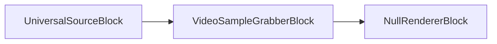
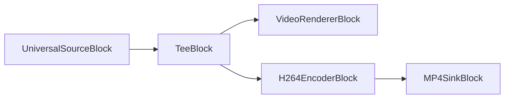
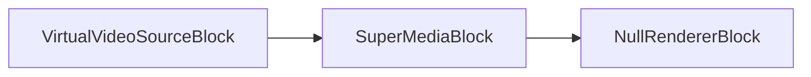
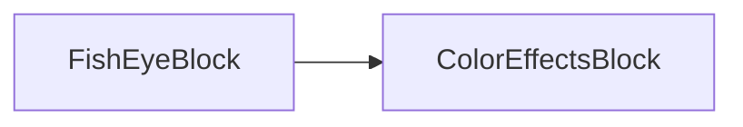
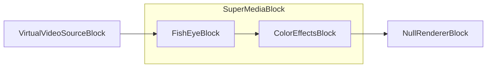

# Special blocks

[!badge size="xl" target="blank" variant="info" text="Media Blocks SDK .Net"](https://www.visioforge.com/media-blocks-sdk-net)

## Introduction

Special blocks are blocks that do not fit into any other category.

## Null Renderer

The null renderer block sends the data to null. This block may be required if your block has outputs you do not want to use.

### Block info

Name: NullRendererBlock.

Pin direction | Media type | Pins count
--- | :---: | :---:
Input | Any | 1

### The sample pipeline

The sample pipeline is shown below. It reads a file and sends the video data to the video samples grabber, where you can grab each video frame after decoding. The Null renderer block is used to end the pipeline.



### Sample code

```csharp
private void Start()
{
  // create the pipeline
  var pipeline = new MediaBlocksPipeline();

  // create universal source block
  var filename = "test.mp4";
  var fileSource = new UniversalSourceBlock(await UniversalSourceSettings.CreateAsync(new Uri(filename)));

  // create video sample grabber block and add the event handler
  var sampleGrabber = new VideoSampleGrabberBlock();
  sampleGrabber.OnVideoFrameBuffer += sampleGrabber_OnVideoFrameBuffer;

  // create null renderer block
  var nullRenderer = new NullRendererBlock();

  // connect blocks
  pipeline.Connect(fileSource.VideoOutput, sampleGrabber.Input);        
  pipeline.Connect(sampleGrabber.Output, nullRenderer.Input);   

  // start the pipeline
  await pipeline.StartAsync();
}

private void sampleGrabber_OnVideoFrameBuffer(object sender, VideoFrameXBufferEventArgs e)
{
    // received new video frame
}
```

### Platforms

Windows, macOS, Linux, iOS, Android.

## Tee

The tee block splits the video or audio data stream into multiple streams that completely copy the original stream.

### Block info

Name: TeeBlock.

Pin direction | Media type | Pins count
--- | :---: | :---:
Input | Any | 1
Output | Same as input | 2 or more

### The sample pipeline



### Sample code

```csharp
var pipeline = new MediaBlocksPipeline();

var filename = "test.mp4";
var fileSource = new UniversalSourceBlock(await UniversalSourceSettings.CreateAsync(new Uri(filename)));

var videoTee = new TeeBlock(2);
var h264Encoder = new H264EncoderBlock(new OpenH264EncoderSettings());
var mp4Muxer = new MP4SinkBlock(new MP4SinkSettings(@"output.mp4"));
var videoRenderer = new VideoRendererBlock(pipeline, VideoView1);

pipeline.Connect(fileSource.VideoOutput, videoTee.Input);
pipeline.Connect(videoTee.Outputs[0], videoRenderer.Input);
pipeline.Connect(videoTee.Outputs[1], h264Encoder.Input);
pipeline.Connect(h264Encoder.Output, mp4Muxer.CreateNewInput(MediaBlockPadMediaType.Video));

await pipeline.StartAsync();
```

#### Sample applications

- [Simple Capture Demo](https://github.com/visioforge/.Net-SDK-s-samples/tree/master/Media%20Blocks%20SDK/WPF/CSharp/Simple%20Capture%20Demo)

### Platforms

Windows, macOS, Linux, iOS, Android.

## Super MediaBlock

The Super MediaBlock allows you to combine multiple blocks into a single block.

### Block info

Name: SuperMediaBlock.

Pin direction | Media type | Pins count
--- | :---: | :---:
Input | Any | 1
Output | Any | 1

### The sample pipeline



Inside the SuperMediaBlock:



Final pipeline:



### Sample code

```csharp
var pipeline = new MediaBlocksPipeline();

var videoViewBlock = new VideoRendererBlock(pipeline, VideoView1);

var videoSource = new VirtualVideoSourceBlock(new VirtualVideoSourceSettings());

var colorEffectsBlock = new ColorEffectsBlock(VisioForge.Core.Types.X.VideoEffects.ColorEffectsPreset.Sepia);
var fishEyeBlock = new FishEyeBlock();

var superBlock = new SuperMediaBlock();
superBlock.Blocks.Add(fishEyeBlock);
superBlock.Blocks.Add(colorEffectsBlock);
superBlock.Configure(pipeline);

pipeline.Connect(videoSource.Output, superBlock.Input);
pipeline.Connect(superBlock.Output, videoViewBlock.Input);

await pipeline.StartAsync();
```

### Platforms

Windows, macOS, Linux, iOS, Android.

## AESCipher

The `AESCipher` enum defines the types of AES ciphers that can be used. (Source: `VisioForge.Core/Types/X/Special/AESCipher.cs`)

### Enum Values

- `AES_128`: AES 128-bit cipher key using CBC method.
- `AES_256`: AES 256-bit cipher key using CBC method.

### Platforms

Windows, macOS, Linux, iOS, Android.

## EncryptorDecryptorSettings

The `EncryptorDecryptorSettings` class holds settings for encryption and decryption operations. (Source: `VisioForge.Core/Types/X/Special/EncryptorDecryptorSettings.cs`)

### Properties

- `Cipher` (`AESCipher`): Gets or sets the AES cipher type. Defaults to `AES_128`.
- `Key` (`string`): Gets or sets the encryption key.
- `IV` (`string`): Gets or sets the initialization vector (16 bytes as hex).
- `SerializeIV` (`bool`): Gets or sets a value indicating whether to serialize the IV.

### Constructor

- `EncryptorDecryptorSettings(string key, string iv)`: Initializes a new instance with the given key and initialization vector.

### Platforms

Windows, macOS, Linux, iOS, Android.

## CustomMediaBlockPad

The `CustomMediaBlockPad` class defines information for a pad within a `CustomMediaBlock`. (Source: `VisioForge.Core/Types/X/Special/CustomMediaBlockPad.cs`)

### Properties

- `Direction` (`MediaBlockPadDirection`): Gets or sets the pad direction (input/output).
- `MediaType` (`MediaBlockPadMediaType`): Gets or sets the media type of the pad (e.g., Audio, Video).
- `CustomCaps` (`Gst.Caps`): Gets or sets custom GStreamer capabilities for an output pad.

### Constructor

- `CustomMediaBlockPad(MediaBlockPadDirection direction, MediaBlockPadMediaType mediaType)`: Initializes a new instance with the specified direction and media type.

### Platforms

Windows, macOS, Linux, iOS, Android.

## CustomMediaBlockSettings

The `CustomMediaBlockSettings` class provides settings for configuring a custom media block, potentially wrapping GStreamer elements. (Source: `VisioForge.Core/Types/X/Special/CustomMediaBlockSettings.cs`)

### Properties

- `ElementName` (`string`): Gets the name of the GStreamer element or Media Blocks SDK element. To create a custom GStreamer Bin, include square brackets, e.g., `"[ videotestsrc ! videoconvert ]"`.
- `UsePadAddedEvent` (`bool`): Gets or sets a value indicating whether to use the `pad-added` event for dynamically created GStreamer pads.
- `ElementParams` (`Dictionary<string, object>`): Gets the parameters for the element.
- `Pads` (`List<CustomMediaBlockPad>`): Gets the list of `CustomMediaBlockPad` definitions for the block.
- `ListProperties` (`bool`): Gets or sets a value indicating whether to list element properties to the Debug window after creation. Defaults to `false`.

### Constructor

- `CustomMediaBlockSettings(string elementName)`: Initializes a new instance with the specified element name.

### Platforms

Windows, macOS, Linux, iOS, Android.

## InputSelectorSyncMode

The `InputSelectorSyncMode` enum defines how an input-selector (used by `SourceSwitchSettings`) synchronizes buffers when in `sync-streams` mode. (Source: `VisioForge.Core/Types/X/Special/SourceSwitchSettings.cs`)

### Enum Values

- `ActiveSegment` (0): Sync using the current active segment.
- `Clock` (1): Sync using the clock.

### Platforms

Windows, macOS, Linux, iOS, Android.

## SourceSwitchSettings

The `SourceSwitchSettings` class configures a block that can switch between multiple input sources. (Source: `VisioForge.Core/Types/X/Special/SourceSwitchSettings.cs`)

The summary "Represents the currently active sink pad" from the code comment might be slightly misleading or incomplete for the class name `SourceSwitchSettings`. The properties suggest it's for configuring a source switcher.

### Properties

- `PadsCount` (`int`): Gets or sets the number of input pads. Defaults to `2`.
- `DefaultActivePad` (`int`): Gets or sets the initially active sink pad.
- `CacheBuffers` (`bool`): Gets or sets whether the active pad caches buffers to avoid missing frames when reactivated. Defaults to `false`.
- `DropBackwards` (`bool`): Gets or sets whether to drop buffers that go backwards relative to the last output buffer pre-switch. Defaults to `false`.
- `SyncMode` (`InputSelectorSyncMode`): Gets or sets how the input-selector syncs buffers in `sync-streams` mode. Defaults to `InputSelectorSyncMode.ActiveSegment`.
- `SyncStreams` (`bool`): Gets or sets if all inactive streams will be synced to the running time of the active stream or to the current clock. Defaults to `true`.
- `CustomName` (`string`): Gets or sets a custom name for logging purposes. Defaults to `"SourceSwitch"`.

### Constructor

- `SourceSwitchSettings(int padsCount = 2)`: Initializes a new instance, optionally specifying the number of pads.

### Platforms

Windows, macOS, Linux, iOS, Android.
