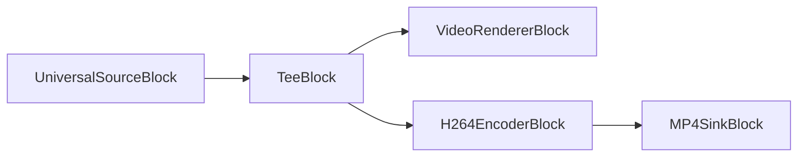
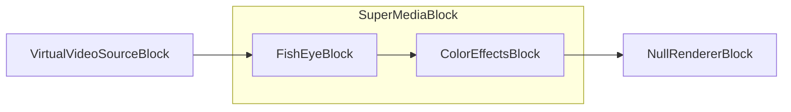
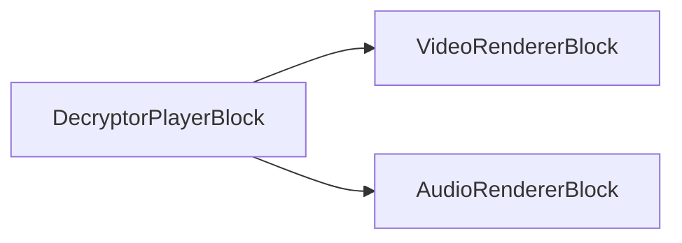
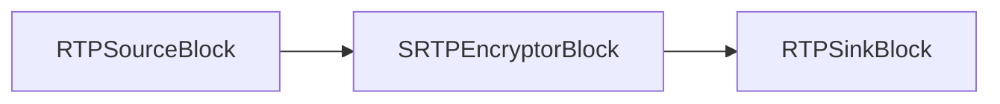

# Special blocks

[Media Blocks SDK .Net](https://www.visioforge.com/media-blocks-sdk-net){ .md-button .md-button--primary target="_blank" }

## Introduction

Special blocks are blocks that do not fit into any other category.

## Null Renderer

The null renderer block sends the data to null. This block may be required if your block has outputs you do not want to use.

### Block info

Name: NullRendererBlock.

Pin direction | Media type | Pins count
--- | :---: | :---:
Input | Any | 1

### The sample pipeline

The sample pipeline is shown below. It reads a file and sends the video data to the video samples grabber, where you can grab each video frame after decoding. The Null renderer block is used to end the pipeline.


```mermaid
graph LR;
    UniversalSourceBlock-->VideoSampleGrabberBlock;
    VideoSampleGrabberBlock-->NullRendererBlock;
```

### Sample code

```csharp
private void Start()
{
  // create the pipeline
  var pipeline = new MediaBlocksPipeline();

  // create universal source block
  var filename = "test.mp4";
  var fileSource = new UniversalSourceBlock(await UniversalSourceSettings.CreateAsync(new Uri(filename)));

  // create video sample grabber block and add the event handler
  var sampleGrabber = new VideoSampleGrabberBlock();
  sampleGrabber.OnVideoFrameBuffer += sampleGrabber_OnVideoFrameBuffer;

  // create null renderer block
  var nullRenderer = new NullRendererBlock();

  // connect blocks
  pipeline.Connect(fileSource.VideoOutput, sampleGrabber.Input);        
  pipeline.Connect(sampleGrabber.Output, nullRenderer.Input);   

  // start the pipeline
  await pipeline.StartAsync();
}

private void sampleGrabber_OnVideoFrameBuffer(object sender, VideoFrameXBufferEventArgs e)
{
    // received new video frame
}
```

### Platforms

Windows, macOS, Linux, iOS, Android.

## Tee

The tee block splits the video or audio data stream into multiple streams that completely copy the original stream.

### Block info

Name: TeeBlock.

Pin direction | Media type | Pins count
--- | :---: | :---:
Input | Any | 1
Output | Same as input | 2 or more

### The sample pipeline


```mermaid
graph LR;
    UniversalSourceBlock-->TeeBlock;
    TeeBlock-->VideoRendererBlock;
    TeeBlock-->H264EncoderBlock;
    H264EncoderBlock-->MP4SinkBlock;
```

### Constructor

```csharp
TeeBlock(int numOfOutputs, MediaBlockPadMediaType mediaType, TeeQueueSettings queueSettings = null)
```

Parameters:

- `numOfOutputs` - The initial number of output pads to create (must be at least 1).
- `mediaType` - The type of media this tee will handle (Video, Audio, or Auto).
- `queueSettings` - Optional queue settings for controlling buffering behavior. If null, uses low-latency defaults.

### Queue settings

The `TeeQueueSettings` class (namespace `VisioForge.Core.Types.X.Special`) controls the buffering behavior for each tee output. By default, TeeBlock uses low-latency settings (1 buffer per queue) instead of GStreamer defaults (200 buffers).

#### TeeQueueSettings properties

| Property | Type | Default | Description |
| --- | :---: | :---: | --- |
| MaxSizeBuffers | uint | 1 | Maximum number of buffers in the queue. Set to 0 to disable. GStreamer default is 200. |
| MaxSizeBytes | uint | 0 | Maximum bytes in queue. Set to 0 to disable. GStreamer default is 10485760 (10 MB). |
| MaxSizeTime | ulong | 0 | Maximum time in nanoseconds. Set to 0 to disable. GStreamer default is 1000000000 (1 second). |
| MinThresholdBuffers | uint | 0 | Minimum buffer count before allowing reading. |
| MinThresholdBytes | uint | 0 | Minimum bytes before allowing reading. |
| MinThresholdTime | ulong | 0 | Minimum time in nanoseconds before allowing reading. |
| Leaky | TeeQueueLeaky | No | Where the queue leaks when full (No, Upstream, or Downstream). |
| FlushOnEos | bool | false | Discard all data when EOS is received. |
| Silent | bool | true | Suppress queue signals for better performance. |

#### TeeQueueLeaky enum

| Value | Description |
| --- | --- |
| No | No leaking - queue will block when full. |
| Upstream | Leak on upstream side (drop incoming buffers when full). |
| Downstream | Leak on downstream side (drop old buffers when full). |

#### Factory methods

- `TeeQueueSettings.LowLatency()` - Creates settings optimized for minimal latency (1 buffer, no byte/time limits). This is the default behavior.
- `TeeQueueSettings.GStreamerDefaults()` - Creates settings matching GStreamer defaults (200 buffers, 10 MB, 1 second).

### Sample code

```csharp
var pipeline = new MediaBlocksPipeline();

var filename = "test.mp4";
var fileSource = new UniversalSourceBlock(await UniversalSourceSettings.CreateAsync(new Uri(filename)));

var videoTee = new TeeBlock(2, MediaBlockPadMediaType.Video);
var h264Encoder = new H264EncoderBlock(new OpenH264EncoderSettings());
var mp4Muxer = new MP4SinkBlock(new MP4SinkSettings(@"output.mp4"));
var videoRenderer = new VideoRendererBlock(pipeline, VideoView1);

pipeline.Connect(fileSource.VideoOutput, videoTee.Input);
pipeline.Connect(videoTee.Outputs[0], videoRenderer.Input);
pipeline.Connect(videoTee.Outputs[1], h264Encoder.Input);
pipeline.Connect(h264Encoder.Output, mp4Muxer.CreateNewInput(MediaBlockPadMediaType.Video));

await pipeline.StartAsync();
```

### Using custom queue settings

```csharp
// Use GStreamer default buffering (higher latency, more buffering)
var gstreamerSettings = TeeQueueSettings.GStreamerDefaults();
var videoTee = new TeeBlock(2, MediaBlockPadMediaType.Video, gstreamerSettings);

// Or create custom settings
var customSettings = new TeeQueueSettings
{
    MaxSizeBuffers = 50,
    MaxSizeBytes = 5242880, // 5 MB
    MaxSizeTime = 500000000, // 0.5 seconds
    Leaky = TeeQueueLeaky.Downstream // Drop old buffers when full
};
var audioTee = new TeeBlock(3, MediaBlockPadMediaType.Audio, customSettings);
```

#### Sample applications

- [Simple Capture Demo](https://github.com/visioforge/.Net-SDK-s-samples/tree/master/Media%20Blocks%20SDK/WPF/CSharp/Simple%20Capture%20Demo)

### Platforms

Windows, macOS, Linux, iOS, Android.

## Super MediaBlock

The Super MediaBlock allows you to combine multiple blocks into a single block.

### Block info

Name: SuperMediaBlock.

Pin direction | Media type | Pins count
--- | :---: | :---:
Input | Any | 1
Output | Any | 1

### The sample pipeline


```mermaid
graph LR;
    VirtualVideoSourceBlock-->SuperMediaBlock;
    SuperMediaBlock-->NullRendererBlock;
```

Inside the SuperMediaBlock:


```mermaid
graph LR;
    FishEyeBlock-->ColorEffectsBlock;
```

Final pipeline:


```mermaid
graph LR;
    VirtualVideoSourceBlock-->FishEyeBlock;
    subgraph SuperMediaBlock
    FishEyeBlock-->ColorEffectsBlock;
    end
    ColorEffectsBlock-->NullRendererBlock;
```

### Sample code

```csharp
var pipeline = new MediaBlocksPipeline();

var videoViewBlock = new VideoRendererBlock(pipeline, VideoView1);

var videoSource = new VirtualVideoSourceBlock(new VirtualVideoSourceSettings());

var colorEffectsBlock = new ColorEffectsBlock(VisioForge.Core.Types.X.VideoEffects.ColorEffectsPreset.Sepia);
var fishEyeBlock = new FishEyeBlock();

var superBlock = new SuperMediaBlock();
superBlock.Blocks.Add(fishEyeBlock);
superBlock.Blocks.Add(colorEffectsBlock);
superBlock.Configure(pipeline);

pipeline.Connect(videoSource.Output, superBlock.Input);
pipeline.Connect(superBlock.Output, videoViewBlock.Input);

await pipeline.StartAsync();
```

### Platforms

Windows, macOS, Linux, iOS, Android.

## Encryptor Block

The Encryptor block encrypts a media stream using AES encryption in real-time. It can be used to protect video, audio, or any other data stream before writing to storage or sending over the network.

### Block info

Name: EncryptorBlock.

| Pin direction | Media type | Pins count |
| --- | :---: | :---: |
| Input | Any | 1 |
| Output | Any | 1 |

### The sample pipeline


```mermaid
graph LR;
    BasicFileSourceBlock-->EncryptorBlock;
    EncryptorBlock-->FileSinkBlock;
```

### Constructor

```csharp
EncryptorBlock(EncryptorDecryptorSettings settings)
```

Parameters:

- `settings` - The AES encryption configuration, including key, initialization vector, and cipher type.

### Availability

Call `EncryptorBlock.IsAvailable()` to verify AES encryption support before creating an instance.

### Sample code

```csharp
var pipeline = new MediaBlocksPipeline();

var settings = new EncryptorDecryptorSettings(
    key: "1f9423681beb9a79215820f6bda73d0f",
    iv: "e9aa8e834d8d70b7e0d254ff670dd718");

var fileSource = new BasicFileSourceBlock("input.mp4");
var encryptor = new EncryptorBlock(settings);
var fileSink = new FileSinkBlock("encrypted.bin", false);

pipeline.Connect(fileSource.Output, encryptor.Input);
pipeline.Connect(encryptor.Output, fileSink.Input);

await pipeline.StartAsync();
```

### Platforms

Windows, macOS, Linux.

## Decryptor Block

The Decryptor block decrypts an AES-encrypted media stream in real-time, restoring the original data. The key and IV must match those used during encryption. For a complete encrypted file playback solution, consider using [Decryptor Player Block](#decryptor-player-block) instead.

### Block info

Name: DecryptorBlock.

| Pin direction | Media type | Pins count |
| --- | :---: | :---: |
| Input | Any | 1 |
| Output | Any | 1 |

### The sample pipeline


```mermaid
graph LR;
    BasicFileSourceBlock-->DecryptorBlock;
    DecryptorBlock-->QueueBlock;
    QueueBlock-->DecodeBinBlock;
    DecodeBinBlock-->VideoRendererBlock;
```

### Constructor

```csharp
DecryptorBlock(EncryptorDecryptorSettings settings)
```

Parameters:

- `settings` - The AES decryption configuration. Key and IV must match the encryption settings.

### Sample code

```csharp
var pipeline = new MediaBlocksPipeline();

var settings = new EncryptorDecryptorSettings(
    key: "1f9423681beb9a79215820f6bda73d0f",
    iv: "e9aa8e834d8d70b7e0d254ff670dd718");

var fileSource = new BasicFileSourceBlock("encrypted.bin");
var decryptor = new DecryptorBlock(settings);
var queue = new QueueBlock();
var decodeBin = new DecodeBinBlock();

pipeline.Connect(fileSource.Output, decryptor.Input);
pipeline.Connect(decryptor.Output, queue.Input);
pipeline.Connect(queue.Output, decodeBin.Input);

var videoRenderer = new VideoRendererBlock(pipeline, VideoView1);
pipeline.Connect(decodeBin.VideoOutput, videoRenderer.Input);

await pipeline.StartAsync();
```

### Platforms

Windows, macOS, Linux.

## Decryptor Player Block

The Decryptor Player block is a composite source block that combines file reading, AES decryption, queuing, and decoding into a single easy-to-use block. It has no external input pad — it reads and decrypts the file internally. Connect its output pads directly to renderers or further processing blocks.

Internal pipeline: `BasicFileSourceBlock → DecryptorBlock → QueueBlock → DecodeBinBlock`

### Block info

Name: DecryptorPlayerBlock.

| Pin direction | Media type | Pins count |
| --- | :---: | :---: |
| Output video | Uncompressed video | 1 |
| Output audio | Uncompressed audio | 1 |
| Output subtitle | Subtitle data | 1 (optional) |

### The sample pipeline


```mermaid
graph LR;
    DecryptorPlayerBlock-->VideoRendererBlock;
    DecryptorPlayerBlock-->AudioRendererBlock;
```

### Constructor

```csharp
DecryptorPlayerBlock(MediaBlocksPipeline pipeline, string filename, string key, string iv,
    bool renderVideo = true, bool renderAudio = true, bool renderSubtitle = false)
```

Parameters:

- `pipeline` - The parent pipeline instance.
- `filename` - Path to the AES-encrypted media file.
- `key` - Encryption key as a hexadecimal string (32 chars for AES-128, 64 for AES-256).
- `iv` - Initialization vector as a hexadecimal string (always 32 hex characters / 16 bytes).
- `renderVideo` - Whether to expose the video output pad. Default: `true`.
- `renderAudio` - Whether to expose the audio output pad. Default: `true`.
- `renderSubtitle` - Whether to expose the subtitle output pad. Default: `false`.

### Output pads

- `VideoOutput` - Decoded video frames (available when `renderVideo` is `true`).
- `AudioOutput` - Decoded audio samples (available when `renderAudio` is `true`).
- `SubtitleOutput` - Decoded subtitle data (available when `renderSubtitle` is `true`).

### Availability

Call `DecryptorPlayerBlock.IsAvailable()` to verify decryption support before creating an instance.

### Sample code

```csharp
var pipeline = new MediaBlocksPipeline();

var decryptorPlayer = new DecryptorPlayerBlock(
    pipeline,
    filename: "encrypted.bin",
    key: "1f9423681beb9a79215820f6bda73d0f",
    iv: "e9aa8e834d8d70b7e0d254ff670dd718");

var videoRenderer = new VideoRendererBlock(pipeline, VideoView1);
var audioRenderer = new AudioRendererBlock();

pipeline.Connect(decryptorPlayer.VideoOutput, videoRenderer.Input);
pipeline.Connect(decryptorPlayer.AudioOutput, audioRenderer.Input);

await pipeline.StartAsync();
```

### Platforms

Windows, macOS, Linux.

## SRTP Encryptor Block

The SRTP Encryptor block encrypts RTP media streams using SRTP (Secure Real-time Transport Protocol) as defined in RFC 3711. It provides confidentiality, message authentication, and replay protection for real-time media streams such as video conferencing or live broadcasts.

### Block info

Name: SRTPEncryptorBlock.

| Pin direction | Media type | Pins count |
| --- | :---: | :---: |
| Input | RTP | 1 |
| Output | SRTP | 1 |

### The sample pipeline


```mermaid
graph LR;
    RTPSourceBlock-->SRTPEncryptorBlock;
    SRTPEncryptorBlock-->RTPSinkBlock;
```

### Constructor

```csharp
SRTPEncryptorBlock(SRTPSettings settings)
```

Parameters:

- `settings` - SRTP encryption configuration including master key, cipher suite, and authentication method.

### Availability

Call `SRTPEncryptorBlock.IsAvailable()` to verify SRTP support before creating an instance.

### Sample code

```csharp
var settings = new SRTPSettings("000102030405060708090A0B0C0D0E0F")
{
    Cipher = SRTPCipher.AES_128_ICM,
    Auth = SRTPAuth.HMAC_SHA1_80
};

var encryptor = new SRTPEncryptorBlock(settings);
```

### Platforms

Windows, macOS, Linux.

## SRTP Decryptor Block

The SRTP Decryptor block decrypts incoming SRTP-encrypted RTP streams back to plaintext RTP. The settings must match those used by the encryptor. It also verifies message authentication tags and provides replay attack protection.

### Block info

Name: SRTPDecryptorBlock.

| Pin direction | Media type | Pins count |
| --- | :---: | :---: |
| Input | SRTP | 1 |
| Output | RTP | 1 |

### The sample pipeline


```mermaid
graph LR;
    NetworkSourceBlock-->SRTPDecryptorBlock;
    SRTPDecryptorBlock-->RTPDecoderBlock;
```

### Constructor

```csharp
SRTPDecryptorBlock(SRTPSettings settings)
```

Parameters:

- `settings` - SRTP decryption configuration. Must match the encryption settings used on the sender side.

### Availability

Call `SRTPDecryptorBlock.IsAvailable()` to verify SRTP support before creating an instance.

### Sample code

```csharp
var settings = new SRTPSettings("000102030405060708090A0B0C0D0E0F");
var decryptor = new SRTPDecryptorBlock(settings);
```

### Platforms

Windows, macOS, Linux.

## SRTPSettings

The `SRTPSettings` class provides configuration for SRTP encryption and decryption operations. (Source: `VisioForge.Core/Types/X/Special/SRTPSettings.cs`)

### Properties

| Property | Type | Default | Description |
| --- | :---: | :---: | --- |
| Key | string | — | Master key as a hex string. 32 hex chars (16 bytes) for AES-128-ICM; 64 hex chars (32 bytes) for AES-256-ICM. |
| Cipher | SRTPCipher | AES_128_ICM | Encryption algorithm. |
| Auth | SRTPAuth | HMAC_SHA1_80 | Authentication method. |
| SSRC | uint | 0 | RTP Synchronization Source identifier. Use 0 to match any SSRC. |

### Constructors

- `SRTPSettings()` - Creates settings with AES-128-ICM cipher and HMAC-SHA1-80 authentication.
- `SRTPSettings(string key)` - Creates settings with the specified master key and defaults.

### Platforms

Windows, macOS, Linux.

## SRTPCipher

The `SRTPCipher` enum defines the encryption algorithms available for SRTP. (Source: `VisioForge.Core/Types/X/Special/SRTPSettings.cs`)

### Enum Values

- `NULL` - No encryption. Provides authentication only.
- `AES_128_ICM` - AES-128 in Integer Counter Mode. Most common choice; requires a 16-byte (32 hex char) key.
- `AES_256_ICM` - AES-256 in Integer Counter Mode. Maximum security; requires a 32-byte (64 hex char) key.

### Platforms

Windows, macOS, Linux.

## SRTPAuth

The `SRTPAuth` enum defines the message authentication methods available for SRTP. (Source: `VisioForge.Core/Types/X/Special/SRTPSettings.cs`)

### Enum Values

- `NULL` - No authentication. Not recommended for production use.
- `HMAC_SHA1_80` - HMAC-SHA1 with an 80-bit authentication tag. Recommended for most applications.
- `HMAC_SHA1_32` - HMAC-SHA1 with a 32-bit authentication tag. Lower bandwidth overhead for constrained networks.

### Platforms

Windows, macOS, Linux.

## AESCipher

The `AESCipher` enum defines the types of AES ciphers that can be used. (Source: `VisioForge.Core/Types/X/Special/AESCipher.cs`)

### Enum Values

- `AES_128`: AES 128-bit cipher key using CBC method.
- `AES_256`: AES 256-bit cipher key using CBC method.

### Platforms

Windows, macOS, Linux, iOS, Android.

## EncryptorDecryptorSettings

The `EncryptorDecryptorSettings` class holds settings for encryption and decryption operations. (Source: `VisioForge.Core/Types/X/Special/EncryptorDecryptorSettings.cs`)

### Properties

- `Cipher` (`AESCipher`): Gets or sets the AES cipher type. Defaults to `AES_128`.
- `Key` (`string`): Gets or sets the encryption key.
- `IV` (`string`): Gets or sets the initialization vector (16 bytes as hex).
- `SerializeIV` (`bool`): Gets or sets a value indicating whether to serialize the IV.

### Constructor

- `EncryptorDecryptorSettings(string key, string iv)`: Initializes a new instance with the given key and initialization vector.

### Platforms

Windows, macOS, Linux, iOS, Android.

## CustomMediaBlockPad

The `CustomMediaBlockPad` class defines information for a pad within a `CustomMediaBlock`. (Source: `VisioForge.Core/Types/X/Special/CustomMediaBlockPad.cs`)

### Properties

- `Direction` (`MediaBlockPadDirection`): Gets or sets the pad direction (input/output).
- `MediaType` (`MediaBlockPadMediaType`): Gets or sets the media type of the pad (e.g., Audio, Video).
- `CustomCaps` (`Gst.Caps`): Gets or sets custom GStreamer capabilities for an output pad.

### Constructor

- `CustomMediaBlockPad(MediaBlockPadDirection direction, MediaBlockPadMediaType mediaType)`: Initializes a new instance with the specified direction and media type.

### Platforms

Windows, macOS, Linux, iOS, Android.

## CustomMediaBlockSettings

The `CustomMediaBlockSettings` class provides settings for configuring a custom media block, potentially wrapping GStreamer elements. (Source: `VisioForge.Core/Types/X/Special/CustomMediaBlockSettings.cs`)

### Properties

- `ElementName` (`string`): Gets the name of the GStreamer element or Media Blocks SDK element. To create a custom GStreamer Bin, include square brackets, e.g., `"[ videotestsrc ! videoconvert ]"`.
- `UsePadAddedEvent` (`bool`): Gets or sets a value indicating whether to use the `pad-added` event for dynamically created GStreamer pads.
- `ElementParams` (`Dictionary<string, object>`): Gets the parameters for the element.
- `Pads` (`List<CustomMediaBlockPad>`): Gets the list of `CustomMediaBlockPad` definitions for the block.
- `ListProperties` (`bool`): Gets or sets a value indicating whether to list element properties to the Debug window after creation. Defaults to `false`.

### Constructor

- `CustomMediaBlockSettings(string elementName)`: Initializes a new instance with the specified element name.

### Platforms

Windows, macOS, Linux, iOS, Android.

## InputSelectorSyncMode

The `InputSelectorSyncMode` enum defines how an input-selector (used by `SourceSwitchSettings`) synchronizes buffers when in `sync-streams` mode. (Source: `VisioForge.Core/Types/X/Special/SourceSwitchSettings.cs`)

### Enum Values

- `ActiveSegment` (0): Sync using the current active segment.
- `Clock` (1): Sync using the clock.

### Platforms

Windows, macOS, Linux, iOS, Android.

## SourceSwitchSettings

The `SourceSwitchSettings` class configures a block that can switch between multiple input sources. (Source: `VisioForge.Core/Types/X/Special/SourceSwitchSettings.cs`)

The summary "Represents the currently active sink pad" from the code comment might be slightly misleading or incomplete for the class name `SourceSwitchSettings`. The properties suggest it's for configuring a source switcher.

### Properties

- `PadsCount` (`int`): Gets or sets the number of input pads. Defaults to `2`.
- `DefaultActivePad` (`int`): Gets or sets the initially active sink pad.
- `CacheBuffers` (`bool`): Gets or sets whether the active pad caches buffers to avoid missing frames when reactivated. Defaults to `false`.
- `DropBackwards` (`bool`): Gets or sets whether to drop buffers that go backwards relative to the last output buffer pre-switch. Defaults to `false`.
- `SyncMode` (`InputSelectorSyncMode`): Gets or sets how the input-selector syncs buffers in `sync-streams` mode. Defaults to `InputSelectorSyncMode.ActiveSegment`.
- `SyncStreams` (`bool`): Gets or sets if all inactive streams will be synced to the running time of the active stream or to the current clock. Defaults to `true`.
- `CustomName` (`string`): Gets or sets a custom name for logging purposes. Defaults to `"SourceSwitch"`.

### Constructor

- `SourceSwitchSettings(int padsCount = 2)`: Initializes a new instance, optionally specifying the number of pads.

### Platforms

Windows, macOS, Linux, iOS, Android.

## Queue Block

The Queue block provides buffering between pipeline elements to smooth out processing variations and enable asynchronous data flow.

### Block info

Name: QueueBlock.

| Pin direction | Media type | Pins count |
| --- | :---: | :---: |
| Input | any | 1 |
| Output | any | 1 |

### Sample code

```csharp
var pipeline = new MediaBlocksPipeline();

var fileSource = new UniversalSourceBlock(await UniversalSourceSettings.CreateAsync(new Uri("test.mp4")));

var queue = new QueueBlock();
pipeline.Connect(fileSource.VideoOutput, queue.Input);

var videoRenderer = new VideoRendererBlock(pipeline, VideoView1);
pipeline.Connect(queue.Output, videoRenderer.Input);

await pipeline.StartAsync();
```

### Platforms

Windows, macOS, Linux, iOS, Android.

## MultiQueue Block

The MultiQueue block provides synchronized buffering for multiple streams, essential for maintaining A/V sync in complex pipelines.

### Block info

Name: MultiQueueBlock.

| Pin direction | Media type | Pins count |
| --- | :---: | :---: |
| Input | any | multiple |
| Output | any | multiple |

### Sample code

```csharp
var pipeline = new MediaBlocksPipeline();

var fileSource = new UniversalSourceBlock(await UniversalSourceSettings.CreateAsync(new Uri("test.mp4")));

var multiqueue = new MultiQueueBlock();
var videoInput = multiqueue.CreateNewInput(MediaBlockPadMediaType.Video);
var audioInput = multiqueue.CreateNewInput(MediaBlockPadMediaType.Audio);

pipeline.Connect(fileSource.VideoOutput, videoInput);
pipeline.Connect(fileSource.AudioOutput, audioInput);

// Connect outputs to encoders/renderers
await pipeline.StartAsync();
```

### Platforms

Windows, macOS, Linux, iOS, Android.

## Source Switch

The SourceSwitch block allows dynamic switching between multiple input sources without interrupting the pipeline.

### Block info

Name: SourceSwitchBlock.

| Pin direction | Media type | Pins count |
| --- | :---: | :---: |
| Input | any | multiple |
| Output | any | 1 |

### Sample code

```csharp
var pipeline = new MediaBlocksPipeline();

var source1 = new UniversalSourceBlock(await UniversalSourceSettings.CreateAsync(new Uri("video1.mp4")));
var source2 = new UniversalSourceBlock(await UniversalSourceSettings.CreateAsync(new Uri("video2.mp4")));

var switchSettings = new SourceSwitchSettings(2) { DefaultActivePad = 0 };
var sourceSwitch = new SourceSwitchBlock(switchSettings);

pipeline.Connect(source1.VideoOutput, sourceSwitch.Input);
pipeline.Connect(source2.VideoOutput, sourceSwitch.CreateNewInput(MediaBlockPadMediaType.Video));

var videoRenderer = new VideoRendererBlock(pipeline, VideoView1);
pipeline.Connect(sourceSwitch.Output, videoRenderer.Input);

await pipeline.StartAsync();

// Switch to second source
sourceSwitch.SetActivePad(1);
```

### Platforms

Windows, macOS, Linux, iOS, Android.

## Universal Decoder

The UniversalDecoder block automatically detects and decodes various compressed audio and video formats.

### Block info

Name: UniversalDecoderBlock.

| Pin direction | Media type | Pins count |
| --- | :---: | :---: |
| Input | compressed media | 1 |
| Output | uncompressed media | multiple |

### Sample code

```csharp
var pipeline = new MediaBlocksPipeline();

var fileSource = new UniversalSourceBlock(await UniversalSourceSettings.CreateAsync(new Uri("test.mp4")));

var decoder = new UniversalDecoderBlock();
pipeline.Connect(fileSource.VideoOutput, decoder.Input);

var videoRenderer = new VideoRendererBlock(pipeline, VideoView1);
pipeline.Connect(decoder.VideoOutput, videoRenderer.Input);

await pipeline.StartAsync();
```

### Platforms

Windows, macOS, Linux, iOS, Android.

## Universal Demux Decoder

The UniversalDemuxDecoder block combines demuxing and decoding in a single block for simplified pipeline construction.

### Block info

Name: UniversalDemuxDecoderBlock.

| Pin direction | Media type | Pins count |
| --- | :---: | :---: |
| Input | container format | 1 |
| Output video | uncompressed video | 1 |
| Output audio | uncompressed audio | 1 |

### Sample code

```csharp
var pipeline = new MediaBlocksPipeline();

var demuxDecoder = new UniversalDemuxDecoderBlock("test.mp4");

var videoRenderer = new VideoRendererBlock(pipeline, VideoView1);
pipeline.Connect(demuxDecoder.VideoOutput, videoRenderer.Input);

var audioRenderer = new AudioRendererBlock();
pipeline.Connect(demuxDecoder.AudioOutput, audioRenderer.Input);

await pipeline.StartAsync();
```

### Platforms

Windows, macOS, Linux, iOS, Android.

## Barcode Detector

The BarcodeDetector block detects and decodes various barcode formats (QR codes, DataMatrix, Code128, EAN-13, and more) in real-time video streams.

For a complete guide with cross-platform examples, see the [Barcode & QR Code Scanner Guide](../Guides/barcode-qr-reader-guide.md).

### Block info

Name: BarcodeDetectorBlock.

| Pin direction | Media type | Pins count |
| --- | :---: | :---: |
| Input | uncompressed video | 1 |
| Output | uncompressed video | 1 (InputOutput mode) or 0 (InputOnly mode) |

### Sample code

```csharp
var pipeline = new MediaBlocksPipeline();

var videoSource = new SystemVideoSourceBlock(videoSettings);

var barcodeDetector = new BarcodeDetectorBlock(BarcodeDetectorMode.InputOutput);
barcodeDetector.OnBarcodeDetected += (sender, args) =>
{
    Console.WriteLine($"Barcode detected: {args.BarcodeType} - {args.Value}");
};
pipeline.Connect(videoSource.Output, barcodeDetector.Input);

var videoRenderer = new VideoRendererBlock(pipeline, VideoView1);
pipeline.Connect(barcodeDetector.Output, videoRenderer.Input);

await pipeline.StartAsync();
```

### Platforms

Windows, macOS, Linux, iOS, Android.

## DataMatrix Decoder

The DataMatrixDecoder block detects and decodes DataMatrix 2D barcodes in video streams.

### Block info

Name: DataMatrixDecoderBlock.

| Pin direction | Media type | Pins count |
| --- | :---: | :---: |
| Input | uncompressed video | 1 |
| Output | uncompressed video | 1 |

### Sample code

```csharp
var pipeline = new MediaBlocksPipeline();

var videoSource = new SystemVideoSourceBlock(videoSettings);

var dataMatrixDecoder = new DataMatrixDecoderBlock();
dataMatrixDecoder.OnDataMatrixDetected += (sender, args) =>
{
    Console.WriteLine($"DataMatrix detected: {args.Data}");
};
pipeline.Connect(videoSource.Output, dataMatrixDecoder.Input);

var videoRenderer = new VideoRendererBlock(pipeline, VideoView1);
pipeline.Connect(dataMatrixDecoder.Output, videoRenderer.Input);

await pipeline.StartAsync();
```

### Platforms

Windows, macOS, Linux, iOS, Android.

## Frame Doubler

The FrameDoubler block duplicates video frames to increase the effective frame rate.

### Block info

Name: FrameDoublerBlock.

| Pin direction | Media type | Pins count |
| --- | :---: | :---: |
| Input | uncompressed video | 1 |
| Output | uncompressed video | 1 |

### Sample code

```csharp
var pipeline = new MediaBlocksPipeline();

var fileSource = new UniversalSourceBlock(await UniversalSourceSettings.CreateAsync(new Uri("test.mp4")));

var frameDoubler = new FrameDoublerBlock();
pipeline.Connect(fileSource.VideoOutput, frameDoubler.Input);

var videoRenderer = new VideoRendererBlock(pipeline, VideoView1);
pipeline.Connect(frameDoubler.Output, videoRenderer.Input);

await pipeline.StartAsync();
```

### Platforms

Windows, macOS, Linux, iOS, Android.

## Video Enhancement

The VideoEnhancement block applies AI-based video enhancement and upscaling.

### Block info

Name: VideoEnhancementBlock.

| Pin direction | Media type | Pins count |
| --- | :---: | :---: |
| Input | uncompressed video | 1 |
| Output | uncompressed video | 1 |

### Sample code

```csharp
var pipeline = new MediaBlocksPipeline();

var fileSource = new UniversalSourceBlock(await UniversalSourceSettings.CreateAsync(new Uri("test.mp4")));

var enhancementSettings = new VideoEnhancementSettings
{
    UpscaleFactor = 2,
    DenoiseStrength = 0.5
};
var enhancement = new VideoEnhancementBlock(enhancementSettings);
pipeline.Connect(fileSource.VideoOutput, enhancement.Input);

var videoRenderer = new VideoRendererBlock(pipeline, VideoView1);
pipeline.Connect(enhancement.Output, videoRenderer.Input);

await pipeline.StartAsync();
```

### Platforms

Windows, macOS, Linux (requires appropriate AI models).

## Decode Bin

The DecodeBin block automatically selects and manages appropriate decoders for media streams.

### Block info

Name: DecodeBinBlock.

| Pin direction | Media type | Pins count |
| --- | :---: | :---: |
| Input | compressed media | 1 |
| Output | uncompressed media | dynamic |

### Sample code

```csharp
var pipeline = new MediaBlocksPipeline();

var fileSource = new UniversalSourceBlock(await UniversalSourceSettings.CreateAsync(new Uri("test.mp4")));

var decodeBin = new DecodeBinBlock();
pipeline.Connect(fileSource.VideoOutput, decodeBin.Input);

// DecodeBin will create output pads dynamically as streams are discovered
await pipeline.StartAsync();
```

### Platforms

Windows, macOS, Linux, iOS, Android.

## Parse Bin

The ParseBin block automatically parses media streams and exposes elementary streams.

### Block info

Name: ParseBinBlock.

| Pin direction | Media type | Pins count |
| --- | :---: | :---: |
| Input | compressed media | 1 |
| Output | parsed streams | dynamic |

### Sample code

```csharp
var pipeline = new MediaBlocksPipeline();

var fileSource = new UniversalSourceBlock(await UniversalSourceSettings.CreateAsync(new Uri("test.mp4")));

var parseBin = new ParseBinBlock();
pipeline.Connect(fileSource.VideoOutput, parseBin.Input);

// ParseBin will create output pads for each discovered stream
await pipeline.StartAsync();
```

### Platforms

Windows, macOS, Linux, iOS, Android.

## Custom Transform

The CustomTransform block allows integration of custom transformation logic into the pipeline.

### Block info

Name: CustomTransformBlock.

| Pin direction | Media type | Pins count |
| --- | :---: | :---: |
| Input | any | 1 |
| Output | any | 1 |

### Sample code

```csharp
var pipeline = new MediaBlocksPipeline();

var fileSource = new UniversalSourceBlock(await UniversalSourceSettings.CreateAsync(new Uri("test.mp4")));

var customSettings = new CustomTransformSettings
{
    ElementName = "videoscale", // GStreamer element name
    Properties = new Dictionary<string, object>
    {
        { "method", 0 }
    }
};
var customTransform = new CustomTransformBlock(customSettings);
pipeline.Connect(fileSource.VideoOutput, customTransform.Input);

var videoRenderer = new VideoRendererBlock(pipeline, VideoView1);
pipeline.Connect(customTransform.Output, videoRenderer.Input);

await pipeline.StartAsync();
```

### Platforms

Windows, macOS, Linux, iOS, Android.

## Data Sample Grabber

The DataSampleGrabber block intercepts and provides access to data buffers flowing through the pipeline.

### Block info

Name: DataSampleGrabberBlock.

| Pin direction | Media type | Pins count |
| --- | :---: | :---: |
| Input | any | 1 |
| Output | any | 1 |

### Sample code

```csharp
var pipeline = new MediaBlocksPipeline();

var fileSource = new UniversalSourceBlock(await UniversalSourceSettings.CreateAsync(new Uri("test.mp4")));

var dataSG = new DataSampleGrabberBlock();
dataSG.OnDataBuffer += (sender, args) =>
{
    // Process buffer data
    var bufferSize = args.BufferSize;
    var bufferData = args.BufferData;
};
pipeline.Connect(fileSource.VideoOutput, dataSG.Input);

var videoRenderer = new VideoRendererBlock(pipeline, VideoView1);
pipeline.Connect(dataSG.Output, videoRenderer.Input);

await pipeline.StartAsync();
```

### Platforms

Windows, macOS, Linux, iOS, Android.

## Debug Timestamp

The DebugTimestamp block logs detailed timestamp information for debugging synchronization issues.

### Block info

Name: DebugTimestampBlock.

| Pin direction | Media type | Pins count |
| --- | :---: | :---: |
| Input | any | 1 |
| Output | any | 1 |

### Sample code

```csharp
var pipeline = new MediaBlocksPipeline();

var fileSource = new UniversalSourceBlock(await UniversalSourceSettings.CreateAsync(new Uri("test.mp4")));

var debugTimestamp = new DebugTimestampBlock();
pipeline.Connect(fileSource.VideoOutput, debugTimestamp.Input);

var videoRenderer = new VideoRendererBlock(pipeline, VideoView1);
pipeline.Connect(debugTimestamp.Output, videoRenderer.Input);

await pipeline.StartAsync();
```

### Platforms

Windows, macOS, Linux, iOS, Android.

## Data Processor

The DataProcessor block provides custom data processing capabilities for non-standard data formats.

### Block info

Name: DataProcessorBlock.

| Pin direction | Media type | Pins count |
| --- | :---: | :---: |
| Input | any | 1 |
| Output | any | 1 |

### Sample code

```csharp
var pipeline = new MediaBlocksPipeline();

var dataSource = new CustomDataSource();

var dataProcessor = new DataProcessorBlock();
pipeline.Connect(dataSource.Output, dataProcessor.Input);

// Process and forward data
await pipeline.StartAsync();
```

### Platforms

Windows, macOS, Linux, iOS, Android.

## Custom Colorspace

The `CustomColorspaceXBlock` converts raw video from RGB to YV12 (YUV 4:2:0 planar) using a built-in C# GStreamer plugin. The conversion applies ITU-R BT.601 coefficients with 2×2 block averaging for chroma subsampling.

Optional `Width`, `Height`, and `FrameRate` properties constrain caps negotiation; leave them unset for auto-negotiation. Width and height values must be even numbers.

`CustomColorspaceXBlock.IsAvailable()` always returns `true` — the plugin is implemented in managed code and requires no external GStreamer dependency.

### Block info

Name: CustomColorspaceXBlock.

Pin direction | Media type | Pins count
--- | :---: | :---:
Input | video/x-raw (RGB) | 1
Output | video/x-raw (YV12) | 1

### Sample code

```csharp
var pipeline = new MediaBlocksPipeline();

var filename = "test.mp4";
var fileSource = new UniversalSourceBlock(await UniversalSourceSettings.CreateAsync(new Uri(filename)));

var colorspace = new CustomColorspaceXBlock(width: 1280, height: 720);
pipeline.Connect(fileSource.VideoOutput, colorspace.Input);

var videoRenderer = new VideoRendererBlock(pipeline, VideoView1);
pipeline.Connect(colorspace.Output, videoRenderer.Input);

await pipeline.StartAsync();
```

### Platforms

Windows, macOS, Linux, iOS, Android.

## Live Sync

The `LiveSyncBlock` wraps the GStreamer `livesync` element to keep a live pipeline in real time. It drops frames that arrive late and duplicates the last frame when the source stalls, maintaining smooth real-time output without pipeline stalls. Both audio and video streams are supported.

Use this block in live streaming or capture pipelines to absorb timing jitter from network or hardware sources.

### Block info

Name: LiveSyncBlock.

Pin direction | Media type | Pins count
--- | :---: | :---:
Input | Any | 1
Output | Any | 1

### Availability

`LiveSyncBlock.IsAvailable()` returns `true` if the GStreamer `livesync` element is present.

### Sample code

```csharp
var pipeline = new MediaBlocksPipeline();

var rtmpSettings = await RTMPSourceSettings.CreateAsync(new Uri("rtmp://example.com/live/stream"));
var rtmpSource = new RTMPSourceBlock(rtmpSettings);

var liveSync = new LiveSyncBlock();
pipeline.Connect(rtmpSource.VideoOutput, liveSync.Input);

var videoRenderer = new VideoRendererBlock(pipeline, VideoView1);
pipeline.Connect(liveSync.Output, videoRenderer.Input);

await pipeline.StartAsync();
```

### Platforms

Windows, macOS, Linux.

## Custom Media Block

The `CustomMediaBlock` is a flexible bridge between the MediaBlocks abstraction layer and raw GStreamer elements. It can wrap any GStreamer element by factory name or wrap a bin pipeline description, making it useful for integrating third-party plugins, experimental elements, or functionality not yet covered by a dedicated MediaBlocks class.

The associated settings and pad types (`CustomMediaBlockSettings`, `CustomMediaBlockPad`) are documented in the [CustomMediaBlockSettings](#custommediablocksettings) and [CustomMediaBlockPad](#custommediablockpad) sections above.

### Block info

Name: CustomMediaBlock.

| Pin direction | Media type | Pins count |
| --- | :---: | :---: |
| Input | Defined by settings | 0…N |
| Output | Defined by settings | 0…N |

### Key features

- Wrap any GStreamer element by name (e.g., `"videoscale"`) or as a bin description (e.g., `"[ videoscale ! videoconvert ]"`).
- Set element properties via `ElementParams` dictionary before the pipeline starts.
- Receive the raw `Gst.Element` via the `OnElementAdded` event for additional configuration.
- Use `UsePadAddedEvent = true` for elements with dynamic pads (e.g., demuxers).
- Apply optional caps filters on output pads via `CustomMediaBlockPad.CustomCaps`.

### Events

- `OnElementAdded` — fired immediately after the GStreamer element is created and added to the pipeline, allowing direct property or signal configuration on the raw element.

### The sample pipeline


```mermaid
graph LR;
    UniversalSourceBlock-->CustomMediaBlock;
    CustomMediaBlock-->VideoRendererBlock;
```

### Sample code

```csharp
var pipeline = new MediaBlocksPipeline();

var fileSource = new UniversalSourceBlock(await UniversalSourceSettings.CreateAsync(new Uri("test.mp4")));

// Wrap GStreamer videoscale element with a property
var settings = new CustomMediaBlockSettings("videoscale")
{
    ListProperties = false
};
settings.ElementParams["method"] = 0; // nearest-neighbour
settings.Pads.Add(new CustomMediaBlockPad(MediaBlockPadDirection.In, MediaBlockPadMediaType.Video));
settings.Pads.Add(new CustomMediaBlockPad(MediaBlockPadDirection.Out, MediaBlockPadMediaType.Video));

var customBlock = new CustomMediaBlock(settings);
customBlock.OnElementAdded += (sender, element) =>
{
    // Additional element configuration after creation
};

pipeline.Connect(fileSource.VideoOutput, customBlock.Input);

var videoRenderer = new VideoRendererBlock(pipeline, VideoView1);
pipeline.Connect(customBlock.Output, videoRenderer.Input);

await pipeline.StartAsync();
```

### Bin description example

```csharp
// Wrap a multi-element GStreamer pipeline as a single block
var settings = new CustomMediaBlockSettings("[ videoscale ! videoconvert ]");
settings.Pads.Add(new CustomMediaBlockPad(MediaBlockPadDirection.In, MediaBlockPadMediaType.Video));
settings.Pads.Add(new CustomMediaBlockPad(MediaBlockPadDirection.Out, MediaBlockPadMediaType.Video));

var customBlock = new CustomMediaBlock(settings);
```

### Platforms

Windows, macOS, Linux, iOS, Android.

---

## Universal Transform Block

The `UniversalTransformBlock` is an abstract base class for implementing custom video frame transformations in managed C# code. It supports 1:N frame transformations: a single input frame can produce zero, one, or multiple output frames, enabling use cases such as frame dropping, duplication, splitting, or format conversion.

Subclass `UniversalTransformBlock`, provide GStreamer caps strings for input and output, and override `OnTransformFrame` to implement the transformation logic.

### Block info

Name: (user-defined subclass).

| Pin direction | Media type | Pins count |
| --- | :---: | :---: |
| Input video | Uncompressed video | 1 |
| Output video | Uncompressed video | 1 |

### Constructor (protected)

```csharp
protected UniversalTransformBlock(string inputCaps, string outputCaps)
```

Parameters:

- `inputCaps` — GStreamer caps string describing the accepted input format (e.g., `"video/x-raw,format=RGB,width=1920,height=1080,framerate=30/1"`).
- `outputCaps` — GStreamer caps string describing the produced output format.

### Abstract method to override

```csharp
protected abstract List<Gst.Buffer> OnTransformFrame(
    Gst.Buffer inputBuffer,
    Gst.Caps inputCaps,
    Gst.Caps outputCaps);
```

Return value semantics:

- **Empty list** — drop the frame (no output produced).
- **One buffer** — standard 1:1 transform.
- **Multiple buffers** — 1:N transform (e.g., frame duplication or splitting).

### Helper methods

- `CreateBuffer(byte[] data, ulong pts, ulong dts, ulong duration)` — creates a `Gst.Buffer` from a managed byte array.
- `GetVideoInfo(Caps caps, out string format, out int width, out int height, out int frameRateNum, out int frameRateDen)` — parses video format, dimensions, and frame rate from a caps object.

### The sample pipeline


```mermaid
graph LR;
    UniversalSourceBlock-->CustomTransformBlock;
    CustomTransformBlock-->VideoRendererBlock;
```

### Sample code

```csharp
// Define a custom transform: invert every frame (RGB → RGB)
public class InvertTransformBlock : UniversalTransformBlock
{
    public InvertTransformBlock()
        : base(
            inputCaps:  "video/x-raw,format=RGB",
            outputCaps: "video/x-raw,format=RGB")
    {
    }

    protected override List<Gst.Buffer> OnTransformFrame(
        Gst.Buffer inputBuffer,
        Gst.Caps inputCaps,
        Gst.Caps outputCaps)
    {
        // Map input buffer, invert pixels, return new buffer
        using var map = inputBuffer.Map(Gst.MapFlags.Read);
        var data = map.Data.ToArray();
        for (int i = 0; i < data.Length; i++)
            data[i] = (byte)(255 - data[i]);

        var output = CreateBuffer(data, inputBuffer.Pts, inputBuffer.Dts, inputBuffer.Duration);
        return new List<Gst.Buffer> { output };
    }
}

// Use in a pipeline
var pipeline = new MediaBlocksPipeline();

var fileSource = new UniversalSourceBlock(await UniversalSourceSettings.CreateAsync(new Uri("test.mp4")));
var transform = new InvertTransformBlock();

pipeline.Connect(fileSource.VideoOutput, transform.Input);

var videoRenderer = new VideoRendererBlock(pipeline, VideoView1);
pipeline.Connect(transform.Output, videoRenderer.Input);

await pipeline.StartAsync();
```

### Platforms

Windows, macOS, Linux, iOS, Android.
