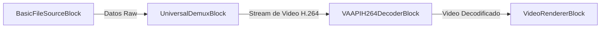
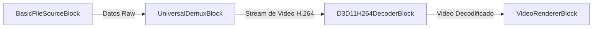

---
title: Bloques Decodificadores de Video de VisioForge Media Blocks SDK .Net
description: Descomprime streams de video con decodificadores hardware-acelerados: H.264, HEVC, VP9 y más códecs en pipelines de Media Blocks SDK.
sidebar_label: Decodificadores de Video
---

# Bloques Decodificadores de Video - SDK de VisioForge Media Blocks .Net

[SDK de Media Blocks .Net](https://www.visioforge.com/media-blocks-sdk-net){ .md-button .md-button--primary target="_blank" }

Los bloques Decodificadores de Video son componentes esenciales en un pipeline de medios, responsables de descomprimir streams de video codificados en frames de video raw que pueden procesarse o renderizarse posteriormente. El SDK de VisioForge Media Blocks .Net ofrece una variedad de bloques decodificadores de video soportando numerosos códecs y tecnologías de aceleración de hardware.

## Bloques Decodificadores de Video Disponibles

### Bloque Decodificador H264

Decodifica streams de video H.264 (AVC). Este es uno de los estándares de compresión de video más utilizados. El bloque puede utilizar diferentes implementaciones de decodificador subyacentes como FFMPEG, OpenH264, o decodificadores acelerados por hardware si están disponibles.

#### Información del bloque

Nombre: `H264DecoderBlock`.

| Dirección del pin | Tipo de medio | Conteo de pines |
| --- | :---: | :---: |
| Entrada de video | video H.264 codificado | 1 |
| Salida de video | video sin comprimir | 1 |

#### Ajustes

El `H264DecoderBlock` está configurado usando ajustes que implementan `IH264DecoderSettings`. Las clases de ajustes disponibles incluyen:
- `FFMPEGH264DecoderSettings`
- `OpenH264DecoderSettings`
- `NVH264DecoderSettings` (para aceleración GPU NVIDIA)
- `VAAPIH264DecoderSettings` (para aceleración VA-API en Linux)

Un constructor sin parámetros intentará seleccionar un decodificador disponible automáticamente.

#### El pipeline de muestra


#### Código de muestra

```csharp
var pipeline = new MediaBlocksPipeline();

// Crear bloque Decodificador H264
var h264Decoder = new H264DecoderBlock();

// Ejemplo: Crear fuente de archivo básica, demuxer, y renderizador
var basicFileSource = new BasicFileSourceBlock("test_h264.mp4");

// Obtener información de medios usando MediaInfoReaderX
var reader = new MediaInfoReaderX();
await reader.OpenAsync("test_h264.mp4");
var mediaInfo = reader.Info;
if (mediaInfo == null)
{
    Console.WriteLine("Falló al obtener información de medios.");
    return;
}
var universalDemux = new UniversalDemuxBlock(mediaInfo, renderVideo: true, renderAudio: false);

var videoRenderer = new VideoRendererBlock(pipeline, VideoView1); // Asumiendo VideoView1

// Conectar bloques
pipeline.Connect(basicFileSource.Output, universalDemux.Input);
pipeline.Connect(universalDemux.GetVideoOutput(), h264Decoder.Input);
pipeline.Connect(h264Decoder.Output, videoRenderer.Input);

// Iniciar pipeline
await pipeline.StartAsync();
```

#### Disponibilidad

Puede verificar implementaciones de decodificador específicas usando `H264Decoder.IsAvailable(H264DecoderType decoderType)`.
`H264DecoderType` incluye `FFMPEG`, `OpenH264`, `GPU_Nvidia_H264`, `VAAPI_H264`, etc.

#### Plataformas

Windows, macOS, Linux. (Decodificadores específicos de hardware como NVH264Decoder requieren hardware y drivers específicos).

### Bloque Decodificador JPEG

Decodifica streams de video JPEG (Motion JPEG) o imágenes JPEG individuales en frames de video raw.

#### Información del bloque

Nombre: `JPEGDecoderBlock`.

| Dirección del pin | Tipo de medio | Conteo de pines |
| --- | :---: | :---: |
| Entrada de video | video/imágenes JPEG codificadas | 1 |
| Salida de video | video sin comprimir | 1 |

#### El pipeline de muestra


#### Código de muestra

```csharp
var pipeline = new MediaBlocksPipeline();

// Crear bloque Decodificador JPEG
var jpegDecoder = new JPEGDecoderBlock();

// Ejemplo: Crear fuente HTTP para cámara MJPEG y renderizador de video
var httpSettings = new HTTPSourceSettings(new Uri("http://mjpegcamera:8080"));
var httpSource = new HTTPSourceBlock(httpSettings);
var videoRenderer = new VideoRendererBlock(pipeline, VideoView1); // Asumiendo VideoView1

// Conectar bloques
pipeline.Connect(httpSource.Output, jpegDecoder.Input);
pipeline.Connect(jpegDecoder.Output, videoRenderer.Input);

// Iniciar pipeline
await pipeline.StartAsync();
```

#### Disponibilidad

Puede verificar si el decodificador NVIDIA JPEG subyacente (si aplica) está disponible usando `NVJPEGDecoder.IsAvailable()`. La funcionalidad genérica de decodificador JPEG generalmente está disponible.

#### Plataformas

Windows, macOS, Linux. (Implementación específica de NVIDIA requiere hardware NVIDIA).

### Bloque Decodificador H.264 NVIDIA (NVH264DecoderBlock)

Proporciona decodificación acelerada por hardware de streams de video H.264 (AVC) usando tecnología NVDEC de NVIDIA. Esto ofrece alto rendimiento y eficiencia en sistemas con GPUs NVIDIA compatibles.

#### Información del bloque

Nombre: `NVH264DecoderBlock`.

| Dirección del pin | Tipo de medio | Conteo de pines |
| --- | :---: | :---: |
| Entrada de video | video H.264 codificado | 1 |
| Salida de video | video sin comprimir | 1 |

#### El pipeline de muestra


#### Código de muestra

```csharp
var pipeline = new MediaBlocksPipeline();

// Crear bloque Decodificador H.264 NVIDIA
var nvH264Decoder = new NVH264DecoderBlock();

// Ejemplo: Crear fuente de archivo básica, demuxer, y renderizador
var basicFileSource = new BasicFileSourceBlock("test_h264.mp4");

var reader = new MediaInfoReaderX();
await reader.OpenAsync("test_h264.mp4");
var mediaInfo = reader.Info;
if (mediaInfo == null)
{
    Console.WriteLine("Falló al obtener información de medios.");
    return;
}
var universalDemux = new UniversalDemuxBlock(mediaInfo, renderVideo: true, renderAudio: false);

var videoRenderer = new VideoRendererBlock(pipeline, VideoView1);

// Conectar bloques
pipeline.Connect(basicFileSource.Output, universalDemux.Input);
pipeline.Connect(universalDemux.GetVideoOutput(), nvH264Decoder.Input);
pipeline.Connect(nvH264Decoder.Output, videoRenderer.Input);

// Iniciar pipeline
await pipeline.StartAsync();
```

#### Disponibilidad

Verificar disponibilidad usando `NVH264Decoder.IsAvailable()`. Requiere GPU NVIDIA que soporte NVDEC y drivers apropiados.

#### Plataformas

Windows, Linux (con drivers NVIDIA).

### Bloque Decodificador H.265 NVIDIA (NVH265DecoderBlock)

Proporciona decodificación acelerada por hardware de streams de video H.265 (HEVC) usando tecnología NVDEC de NVIDIA. H.265 ofrece eficiencia de compresión mejorada en comparación con H.264.

#### Información del bloque

Nombre: `NVH265DecoderBlock`.

| Dirección del pin | Tipo de medio | Conteo de pines |
| --- | :---: | :---: |
| Entrada de video | video H.265/HEVC codificado | 1 |
| Salida de video | video sin comprimir | 1 |

#### El pipeline de muestra


#### Código de muestra

```csharp
var pipeline = new MediaBlocksPipeline();

// Crear bloque Decodificador H.265 NVIDIA
var nvH265Decoder = new NVH265DecoderBlock();

// Ejemplo: Crear fuente de archivo básica, demuxer, y renderizador
var basicFileSource = new BasicFileSourceBlock("test_h265.mp4");

var reader = new MediaInfoReaderX();
await reader.OpenAsync("test_h265.mp4");
var mediaInfo = reader.Info;
if (mediaInfo == null)
{
    Console.WriteLine("Falló al obtener información de medios.");
    return;
}
var universalDemux = new UniversalDemuxBlock(mediaInfo, renderVideo: true, renderAudio: false);

var videoRenderer = new VideoRendererBlock(pipeline, VideoView1);

// Conectar bloques
pipeline.Connect(basicFileSource.Output, universalDemux.Input);
pipeline.Connect(universalDemux.GetVideoOutput(), nvH265Decoder.Input);
pipeline.Connect(nvH265Decoder.Output, videoRenderer.Input);

// Iniciar pipeline
await pipeline.StartAsync();
```

#### Disponibilidad

Verificar disponibilidad usando `NVH265Decoder.IsAvailable()`. Requiere GPU NVIDIA que soporte NVDEC para H.265 y drivers apropiados.

#### Plataformas

Windows, Linux (con drivers NVIDIA).

### Bloque Decodificador JPEG NVIDIA (NVJPEGDecoderBlock)

Proporciona decodificación acelerada por hardware de imágenes JPEG o streams Motion JPEG (MJPEG) usando biblioteca NVJPEG de NVIDIA. Esto es particularmente útil para streams MJPEG de alta resolución o alta tasa de frames.
(Nota: El pipeline de muestra para JPEG con BasicFileSourceBlock podría no ser común en comparación con HTTPSource para MJPEG. El ejemplo a continuación está adaptado pero considere casos de uso típicos.)

#### Información del bloque

Nombre: `NVJPEGDecoderBlock`.

| Dirección del pin | Tipo de medio | Conteo de pines |
| --- | :---: | :---: |
| Entrada de video | video/imágenes JPEG codificadas | 1 |
| Salida de video | video sin comprimir | 1 |

#### El pipeline de muestra


Para streams MJPEG en vivo, `HTTPSourceBlock --> NVJPEGDecoderBlock` es más típico.

#### Código de muestra

```csharp
var pipeline = new MediaBlocksPipeline();

// Crear bloque Decodificador JPEG NVIDIA
var nvJpegDecoder = new NVJPEGDecoderBlock();

// Ejemplo: Crear fuente de archivo básica para archivo MJPEG, demuxer, y renderizador
// Asegurar que "test.mjpg" contenga un stream Motion JPEG.
var basicFileSource = new BasicFileSourceBlock("test.mjpg");

var reader = new MediaInfoReaderX();
await reader.OpenAsync("test.mjpg");
var mediaInfo = reader.Info;
if (mediaInfo == null || mediaInfo.VideoStreams.Count == 0 || !mediaInfo.VideoStreams[0].Codec.Contains("jpeg"))
{
    Console.WriteLine("Falló al obtener información de medios MJPEG o no es un archivo MJPEG.");
    return;
}
var universalDemux = new UniversalDemuxBlock(mediaInfo, renderVideo: true, renderAudio: false);

var videoRenderer = new VideoRendererBlock(pipeline, VideoView1);

// Conectar bloques
pipeline.Connect(basicFileSource.Output, universalDemux.Input);
pipeline.Connect(universalDemux.GetVideoOutput(), nvJpegDecoder.Input);
pipeline.Connect(nvJpegDecoder.Output, videoRenderer.Input);

// Iniciar pipeline
await pipeline.StartAsync();
```

#### Disponibilidad

Verificar disponibilidad usando `NVJPEGDecoder.IsAvailable()`. Requiere GPU NVIDIA y drivers apropiados.

#### Plataformas

Windows, Linux (con drivers NVIDIA).

### Bloque Decodificador MPEG-1 NVIDIA (NVMPEG1DecoderBlock)

Proporciona decodificación acelerada por hardware de streams de video MPEG-1 usando tecnología NVDEC de NVIDIA.

#### Información del bloque

Nombre: `NVMPEG1DecoderBlock`.

| Dirección del pin | Tipo de medio | Conteo de pines |
| --- | :---: | :---: |
| Entrada de video | video MPEG-1 codificado | 1 |
| Salida de video | video sin comprimir | 1 |

#### El pipeline de muestra


#### Código de muestra

```csharp
var pipeline = new MediaBlocksPipeline();

// Crear bloque Decodificador MPEG-1 NVIDIA
var nvMpeg1Decoder = new NVMPEG1DecoderBlock();

// Ejemplo: Crear fuente de archivo básica, demuxer, y renderizador
var basicFileSource = new BasicFileSourceBlock("test_mpeg1.mpg");

var reader = new MediaInfoReaderX();
await reader.OpenAsync("test_mpeg1.mpg");
var mediaInfo = reader.Info;
if (mediaInfo == null)
{
    Console.WriteLine("Falló al obtener información de medios.");
    return;
}
var universalDemux = new UniversalDemuxBlock(mediaInfo, renderVideo: true, renderAudio: false);

var videoRenderer = new VideoRendererBlock(pipeline, VideoView1);

// Conectar bloques
pipeline.Connect(basicFileSource.Output, universalDemux.Input);
pipeline.Connect(universalDemux.GetVideoOutput(), nvMpeg1Decoder.Input);
pipeline.Connect(nvMpeg1Decoder.Output, videoRenderer.Input);

// Iniciar pipeline
await pipeline.StartAsync();
```

#### Disponibilidad

Verificar disponibilidad usando `NVMPEG1Decoder.IsAvailable()`. Requiere GPU NVIDIA que soporte NVDEC para MPEG-1 y drivers apropiados.

#### Plataformas

Windows, Linux (con drivers NVIDIA).

### Bloque Decodificador MPEG-2 NVIDIA (NVMPEG2DecoderBlock)

Proporciona decodificación acelerada por hardware de streams de video MPEG-2 usando tecnología NVDEC de NVIDIA. Comúnmente usado para video DVD y algunas transmisiones digitales de televisión.

#### Información del bloque

Nombre: `NVMPEG2DecoderBlock`.

| Dirección del pin | Tipo de medio | Conteo de pines |
| --- | :---: | :---: |
| Entrada de video | video MPEG-2 codificado | 1 |
| Salida de video | video sin comprimir | 1 |

#### El pipeline de muestra


#### Código de muestra

```csharp
var pipeline = new MediaBlocksPipeline();

// Crear bloque Decodificador MPEG-2 NVIDIA
var nvMpeg2Decoder = new NVMPEG2DecoderBlock();

// Ejemplo: Crear fuente de archivo básica, demuxer, y renderizador
var basicFileSource = new BasicFileSourceBlock("test_mpeg2.mpg");

var reader = new MediaInfoReaderX();
await reader.OpenAsync("test_mpeg2.mpg");
var mediaInfo = reader.Info;
if (mediaInfo == null)
{
    Console.WriteLine("Falló al obtener información de medios.");
    return;
}
var universalDemux = new UniversalDemuxBlock(mediaInfo, renderVideo: true, renderAudio: false);

var videoRenderer = new VideoRendererBlock(pipeline, VideoView1);

// Conectar bloques
pipeline.Connect(basicFileSource.Output, universalDemux.Input);
pipeline.Connect(universalDemux.GetVideoOutput(), nvMpeg2Decoder.Input);
pipeline.Connect(nvMpeg2Decoder.Output, videoRenderer.Input);

// Iniciar pipeline
await pipeline.StartAsync();
```

#### Disponibilidad

Verificar disponibilidad usando `NVMPEG2Decoder.IsAvailable()`. Requiere GPU NVIDIA que soporte NVDEC para MPEG-2 y drivers apropiados.

#### Plataformas

Windows, Linux (con drivers NVIDIA).

### Bloque Decodificador MPEG-4 NVIDIA (NVMPEG4DecoderBlock)

Proporciona decodificación acelerada por hardware de streams de video MPEG-4 Part 2 (a menudo encontrados en archivos AVI, ej. DivX/Xvid) usando tecnología NVDEC de NVIDIA. Nota que esto es diferente de MPEG-4 Part 10 (H.264/AVC).

#### Información del bloque

Nombre: `NVMPEG4DecoderBlock`.

| Dirección del pin | Tipo de medio | Conteo de pines |
| --- | :---: | :---: |
| Entrada de video | video MPEG-4 Part 2 codificado | 1 |
| Salida de video | video sin comprimir | 1 |

#### El pipeline de muestra


#### Código de muestra

```csharp
var pipeline = new MediaBlocksPipeline();

// Crear bloque Decodificador MPEG-4 NVIDIA
var nvMpeg4Decoder = new NVMPEG4DecoderBlock();

// Ejemplo: Crear fuente de archivo básica, demuxer, y renderizador
var basicFileSource = new BasicFileSourceBlock("test_mpeg4.avi");

var reader = new MediaInfoReaderX();
await reader.OpenAsync("test_mpeg4.avi");
var mediaInfo = reader.Info;
if (mediaInfo == null)
{
    Console.WriteLine("Falló al obtener información de medios.");
    return;
}
var universalDemux = new UniversalDemuxBlock(mediaInfo, renderVideo: true, renderAudio: false);

var videoRenderer = new VideoRendererBlock(pipeline, VideoView1);

// Conectar bloques
pipeline.Connect(basicFileSource.Output, universalDemux.Input);
pipeline.Connect(universalDemux.GetVideoOutput(), nvMpeg4Decoder.Input);
pipeline.Connect(nvMpeg4Decoder.Output, videoRenderer.Input);

// Iniciar pipeline
await pipeline.StartAsync();
```

#### Disponibilidad

Verificar disponibilidad usando `NVMPEG4Decoder.IsAvailable()`. Requiere GPU NVIDIA que soporte NVDEC para MPEG-4 Part 2 y drivers apropiados.

#### Plataformas

Windows, Linux (con drivers NVIDIA).

### Bloque Decodificador VP8 NVIDIA (NVVP8DecoderBlock)

Proporciona decodificación acelerada por hardware de streams de video VP8 usando tecnología NVDEC de NVIDIA. VP8 es un formato de video abierto, a menudo usado con WebM.

#### Información del bloque

Nombre: `NVVP8DecoderBlock`.

| Dirección del pin | Tipo de medio | Conteo de pines |
| --- | :---: | :---: |
| Entrada de video | video VP8 codificado | 1 |
| Salida de video | video sin comprimir | 1 |

#### El pipeline de muestra


#### Código de muestra

```csharp
var pipeline = new MediaBlocksPipeline();

// Crear bloque Decodificador VP8 NVIDIA
var nvVp8Decoder = new NVVP8DecoderBlock();

// Ejemplo: Crear fuente de archivo básica, demuxer, y renderizador
var basicFileSource = new BasicFileSourceBlock("test_vp8.webm");

var reader = new MediaInfoReaderX();
await reader.OpenAsync("test_vp8.webm");
var mediaInfo = reader.Info;
if (mediaInfo == null)
{
    Console.WriteLine("Falló al obtener información de medios.");
    return;
}
var universalDemux = new UniversalDemuxBlock(mediaInfo, renderVideo: true, renderAudio: false);

var videoRenderer = new VideoRendererBlock(pipeline, VideoView1);

// Conectar bloques
pipeline.Connect(basicFileSource.Output, universalDemux.Input);
pipeline.Connect(universalDemux.GetVideoOutput(), nvVp8Decoder.Input);
pipeline.Connect(nvVp8Decoder.Output, videoRenderer.Input);

// Iniciar pipeline
await pipeline.StartAsync();
```

#### Disponibilidad

Verificar disponibilidad usando `NVVP8Decoder.IsAvailable()`. Requiere GPU NVIDIA que soporte NVDEC para VP8 y drivers apropiados.

#### Plataformas

Windows, Linux (con drivers NVIDIA).

### Bloque Decodificador VP9 NVIDIA (NVVP9DecoderBlock)

Proporciona decodificación acelerada por hardware de streams de video VP9 usando tecnología NVDEC de NVIDIA. VP9 es un estándar de codificación de video abierto y sin royalties desarrollado por Google, a menudo usado para streaming web (ej. YouTube).

#### Información del bloque

Nombre: `NVVP9DecoderBlock`.

| Dirección del pin | Tipo de medio | Conteo de pines |
| --- | :---: | :---: |
| Entrada de video | video VP9 codificado | 1 |
| Salida de video | video sin comprimir | 1 |

#### El pipeline de muestra


#### Código de muestra

```csharp
var pipeline = new MediaBlocksPipeline();

// Crear bloque Decodificador VP9 NVIDIA
var nvVp9Decoder = new NVVP9DecoderBlock();

// Ejemplo: Crear fuente de archivo básica, demuxer, y renderizador
var basicFileSource = new BasicFileSourceBlock("test_vp9.webm");

var reader = new MediaInfoReaderX();
await reader.OpenAsync("test_vp9.webm");
var mediaInfo = reader.Info;
if (mediaInfo == null)
{
    Console.WriteLine("Falló al obtener información de medios.");
    return;
}
var universalDemux = new UniversalDemuxBlock(mediaInfo, renderVideo: true, renderAudio: false);

var videoRenderer = new VideoRendererBlock(pipeline, VideoView1);

// Conectar bloques
pipeline.Connect(basicFileSource.Output, universalDemux.Input);
pipeline.Connect(universalDemux.GetVideoOutput(), nvVp9Decoder.Input);
pipeline.Connect(nvVp9Decoder.Output, videoRenderer.Input);

// Iniciar pipeline
await pipeline.StartAsync();
```

#### Disponibilidad

Verificar disponibilidad usando `NVVP9Decoder.IsAvailable()`. Requiere GPU NVIDIA que soporte NVDEC para VP9 y drivers apropiados.

#### Plataformas

Windows, Linux (con drivers NVIDIA).

### Bloque Decodificador H.264 VAAPI (VAAPIH264DecoderBlock)

Proporciona decodificación acelerada por hardware de streams de video H.264 (AVC) usando VA-API (Video Acceleration API). Disponible en sistemas Linux con hardware y drivers compatibles.

#### Información del bloque

| Dirección del pin | Tipo de medio           | Conteo de pines |
|-------------------|-------------------------|-----------------|
| Entrada de video  | video H.264 codificado  | 1               |
| Salida de video   | video sin comprimir     | 1               |

#### El pipeline de muestra



#### Código de muestra

```csharp
var pipeline = new MediaBlocksPipeline();
var vaapiH264Decoder = new VAAPIH264DecoderBlock();
var basicFileSource = new BasicFileSourceBlock("test_h264.mp4");
var reader = new MediaInfoReaderX();
await reader.OpenAsync("test_h264.mp4");
var mediaInfo = reader.Info;
if (mediaInfo == null)
{
    Console.WriteLine("Falló al obtener información de medios.");
    return;
}
var universalDemux = new UniversalDemuxBlock(mediaInfo, renderVideo: true, renderAudio: false);
var videoRenderer = new VideoRendererBlock(pipeline, VideoView1);

pipeline.Connect(basicFileSource.Output, universalDemux.Input);
pipeline.Connect(universalDemux.GetVideoOutput(), vaapiH264Decoder.Input);
pipeline.Connect(vaapiH264Decoder.Output, videoRenderer.Input);

await pipeline.StartAsync();
```

#### Disponibilidad

Verificar con `VAAPIH264DecoderBlock.IsAvailable()`. Requiere soporte VA-API y redist SDK correcto.

#### Plataformas

Linux (con drivers VA-API).

---

### Bloque Decodificador HEVC VAAPI (VAAPIHEVCDecoderBlock)

Proporciona decodificación acelerada por hardware de streams de video H.265 (HEVC) usando VA-API. Disponible en sistemas Linux con hardware y drivers compatibles.

#### Información del bloque

| Dirección del pin | Tipo de medio            | Conteo de pines |
|-------------------|--------------------------|-----------------|
| Entrada de video  | video H.265/HEVC codificado | 1               |
| Salida de video   | video sin comprimir       | 1               |

#### El pipeline de muestra


#### Código de muestra

```csharp
var pipeline = new MediaBlocksPipeline();
var vaapiHevcDecoder = new VAAPIHEVCDecoderBlock();
var basicFileSource = new BasicFileSourceBlock("test_hevc.mp4");
var reader = new MediaInfoReaderX();
await reader.OpenAsync("test_hevc.mp4");
var mediaInfo = reader.Info;
if (mediaInfo == null)
{
    Console.WriteLine("Falló al obtener información de medios.");
    return;
}
var universalDemux = new UniversalDemuxBlock(mediaInfo, renderVideo: true, renderAudio: false);
var videoRenderer = new VideoRendererBlock(pipeline, VideoView1);

pipeline.Connect(basicFileSource.Output, universalDemux.Input);
pipeline.Connect(universalDemux.GetVideoOutput(), vaapiHevcDecoder.Input);
pipeline.Connect(vaapiHevcDecoder.Output, videoRenderer.Input);

await pipeline.StartAsync();
```

#### Disponibilidad

Verificar con `VAAPIHEVCDecoderBlock.IsAvailable()`. Requiere soporte VA-API y redist SDK correcto.

#### Plataformas

Linux (con drivers VA-API).

---

### Bloque Decodificador JPEG VAAPI (VAAPIJPEGDecoderBlock)

Proporciona decodificación acelerada por hardware de streams de video JPEG/MJPEG usando VA-API. Disponible en sistemas Linux con hardware y drivers compatibles.

#### Información del bloque

| Dirección del pin | Tipo de medio                | Conteo de pines |
|-------------------|------------------------------|-----------------|
| Entrada de video  | video/imágenes JPEG codificadas | 1               |
| Salida de video   | video sin comprimir          | 1               |

#### El pipeline de muestra


#### Código de muestra

```csharp
var pipeline = new MediaBlocksPipeline();
var vaapiJpegDecoder = new VAAPIJPEGDecoderBlock();
var httpSettings = new HTTPSourceSettings(new Uri("http://your-mjpeg-camera/stream"));
var httpSource = new HTTPSourceBlock(httpSettings);
var videoRenderer = new VideoRendererBlock(pipeline, VideoView1);

pipeline.Connect(httpSource.Output, vaapiJpegDecoder.Input);
pipeline.Connect(vaapiJpegDecoder.Output, videoRenderer.Input);

await pipeline.StartAsync();
```

#### Disponibilidad

Verificar con `VAAPIJPEGDecoderBlock.IsAvailable()`. Requiere soporte VA-API y redist SDK correcto.

#### Plataformas

Linux (con drivers VA-API).

---

### Bloque Decodificador VC1 VAAPI (VAAPIVC1DecoderBlock)

Proporciona decodificación acelerada por hardware de streams de video VC-1 usando VA-API. Disponible en sistemas Linux con hardware y drivers compatibles.

#### Información del bloque

| Dirección del pin | Tipo de medio           | Conteo de pines |
|-------------------|-------------------------|-----------------|
| Entrada de video  | video VC-1 codificado   | 1               |
| Salida de video   | video sin comprimir     | 1               |

#### El pipeline de muestra


#### Código de muestra

```csharp
var pipeline = new MediaBlocksPipeline();
var vaapiVc1Decoder = new VAAPIVC1DecoderBlock();
var basicFileSource = new BasicFileSourceBlock("test_vc1.wmv");
var reader = new MediaInfoReaderX();
await reader.OpenAsync("test_vc1.wmv");
var mediaInfo = reader.Info;
if (mediaInfo == null)
{
    Console.WriteLine("Falló al obtener información de medios.");
    return;
}
var universalDemux = new UniversalDemuxBlock(mediaInfo, renderVideo: true, renderAudio: false);
var videoRenderer = new VideoRendererBlock(pipeline, VideoView1);

pipeline.Connect(basicFileSource.Output, universalDemux.Input);
pipeline.Connect(universalDemux.GetVideoOutput(), vaapiVc1Decoder.Input);
pipeline.Connect(vaapiVc1Decoder.Output, videoRenderer.Input);

await pipeline.StartAsync();
```

#### Disponibilidad

Verificar con `VAAPIVC1DecoderBlock.IsAvailable()`. Requiere soporte VA-API y redist SDK correcto.

#### Plataformas

Linux (con drivers VA-API).

---

## Bloques Decodificadores de Video Direct3D 11/DXVA

Los bloques decodificadores Direct3D 11/DXVA proporcionan decodificación acelerada por hardware en sistemas Windows con GPUs y drivers compatibles. Estos bloques son útiles para pipelines de reproducción y procesamiento de video de alto rendimiento en Windows.

### Bloque Decodificador AV1 D3D11

Decodifica streams de video AV1 usando aceleración hardware Direct3D 11/DXVA.

#### Información del bloque

Nombre: `D3D11AV1DecoderBlock`.

| Dirección del pin | Tipo de medio           | Conteo de pines |
|-------------------|-------------------------|-----------------|
| Entrada de video  | video AV1 codificado    | 1               |
| Salida de video   | video sin comprimir     | 1               |

#### El pipeline de muestra


#### Código de muestra

```csharp
var pipeline = new MediaBlocksPipeline();

// Crear bloque Decodificador AV1 D3D11
var d3d11Av1Decoder = new D3D11AV1DecoderBlock();

var basicFileSource = new BasicFileSourceBlock("test_av1.mkv");
var reader = new MediaInfoReaderX();
await reader.OpenAsync("test_av1.mkv");
var mediaInfo = reader.Info;
if (mediaInfo == null)
{
    Console.WriteLine("Falló al obtener información de medios.");
    return;
}
var universalDemux = new UniversalDemuxBlock(mediaInfo, renderVideo: true, renderAudio: false);
var videoRenderer = new VideoRendererBlock(pipeline, VideoView1);

pipeline.Connect(basicFileSource.Output, universalDemux.Input);
pipeline.Connect(universalDemux.GetVideoOutput(), d3d11Av1Decoder.Input);
pipeline.Connect(d3d11Av1Decoder.Output, videoRenderer.Input);

await pipeline.StartAsync();
```

#### Disponibilidad

Verificar disponibilidad usando `D3D11AV1DecoderBlock.IsAvailable()`. Requiere Windows con soporte D3D11/DXVA y redist SDK correcto.

#### Plataformas

Windows (D3D11/DXVA requerido).

---

### Bloque Decodificador H.264 D3D11

Decodifica streams de video H.264 (AVC) usando aceleración hardware Direct3D 11/DXVA.

#### Información del bloque

Nombre: `D3D11H264DecoderBlock`.

| Dirección del pin | Tipo de medio           | Conteo de pines |
|-------------------|-------------------------|-----------------|
| Entrada de video  | video H.264 codificado  | 1               |
| Salida de video   | video sin comprimir     | 1               |

#### El pipeline de muestra



#### Código de muestra

```csharp
var pipeline = new MediaBlocksPipeline();

// Crear bloque Decodificador H.264 D3D11
var d3d11H264Decoder = new D3D11H264DecoderBlock();

var basicFileSource = new BasicFileSourceBlock("test_h264.mp4");
var reader = new MediaInfoReaderX();
await reader.OpenAsync("test_h264.mp4");
var mediaInfo = reader.Info;
if (mediaInfo == null)
{
    Console.WriteLine("Falló al obtener información de medios.");
    return;
}
var universalDemux = new UniversalDemuxBlock(mediaInfo, renderVideo: true, renderAudio: false);
var videoRenderer = new VideoRendererBlock(pipeline, VideoView1);

pipeline.Connect(basicFileSource.Output, universalDemux.Input);
pipeline.Connect(universalDemux.GetVideoOutput(), d3d11H264Decoder.Input);
pipeline.Connect(d3d11H264Decoder.Output, videoRenderer.Input);

await pipeline.StartAsync();
```

#### Disponibilidad

Verificar disponibilidad usando `D3D11H264DecoderBlock.IsAvailable()`. Requiere Windows con soporte D3D11/DXVA y redist SDK correcto.

#### Plataformas

Windows (D3D11/DXVA requerido).

---

### Bloque Decodificador H.265 D3D11

Decodifica streams de video H.265 (HEVC) usando aceleración hardware Direct3D 11/DXVA.

#### Información del bloque

Nombre: `D3D11H265DecoderBlock`.

| Dirección del pin | Tipo de medio            | Conteo de pines |
|-------------------|--------------------------|-----------------|
| Entrada de video  | video H.265/HEVC codificado | 1               |
| Salida de video   | video sin comprimir       | 1               |

#### El pipeline de muestra


#### Código de muestra

```csharp
var pipeline = new MediaBlocksPipeline();

// Crear bloque Decodificador H.265 D3D11
var d3d11H265Decoder = new D3D11H265DecoderBlock();

var basicFileSource = new BasicFileSourceBlock("test_h265.mp4");
var reader = new MediaInfoReaderX();
await reader.OpenAsync("test_h265.mp4");
var mediaInfo = reader.Info;
if (mediaInfo == null)
{
    Console.WriteLine("Falló al obtener información de medios.");
    return;
}
var universalDemux = new UniversalDemuxBlock(mediaInfo, renderVideo: true, renderAudio: false);
var videoRenderer = new VideoRendererBlock(pipeline, VideoView1);

pipeline.Connect(basicFileSource.Output, universalDemux.Input);
pipeline.Connect(universalDemux.GetVideoOutput(), d3d11H265Decoder.Input);
pipeline.Connect(d3d11H265Decoder.Output, videoRenderer.Input);

await pipeline.StartAsync();
```

#### Disponibilidad

Verificar disponibilidad usando `D3D11H265DecoderBlock.IsAvailable()`. Requiere Windows con soporte D3D11/DXVA y redist SDK correcto.

#### Plataformas

Windows (D3D11/DXVA requerido).

---

### Bloque Decodificador MPEG-2 D3D11

Decodifica streams de video MPEG-2 usando aceleración hardware Direct3D 11/DXVA.

#### Información del bloque

Nombre: `D3D11MPEG2DecoderBlock`.

| Dirección del pin | Tipo de medio           | Conteo de pines |
|-------------------|-------------------------|-----------------|
| Entrada de video  | video MPEG-2 codificado | 1               |
| Salida de video   | video sin comprimir     | 1               |

#### El pipeline de muestra


#### Código de muestra

```csharp
var pipeline = new MediaBlocksPipeline();

// Crear bloque Decodificador MPEG-2 D3D11
var d3d11Mpeg2Decoder = new D3D11MPEG2DecoderBlock();

var basicFileSource = new BasicFileSourceBlock("test_mpeg2.mpg");
var reader = new MediaInfoReaderX();
await reader.OpenAsync("test_mpeg2.mpg");
var mediaInfo = reader.Info;
if (mediaInfo == null)
{
    Console.WriteLine("Falló al obtener información de medios.");
    return;
}
var universalDemux = new UniversalDemuxBlock(mediaInfo, renderVideo: true, renderAudio: false);
var videoRenderer = new VideoRendererBlock(pipeline, VideoView1);

pipeline.Connect(basicFileSource.Output, universalDemux.Input);
pipeline.Connect(universalDemux.GetVideoOutput(), d3d11Mpeg2Decoder.Input);
pipeline.Connect(d3d11Mpeg2Decoder.Output, videoRenderer.Input);

await pipeline.StartAsync();
```

#### Disponibilidad

Verificar disponibilidad usando `D3D11MPEG2Decoder.IsAvailable()`. Requiere Windows con soporte D3D11/DXVA y redist SDK correcto.

#### Plataformas

Windows (D3D11/DXVA requerido).

---

### Bloque Decodificador VP8 D3D11

Decodifica streams de video VP8 usando aceleración hardware Direct3D 11/DXVA.

#### Información del bloque

Nombre: `D3D11VP8DecoderBlock`.

| Dirección del pin | Tipo de medio           | Conteo de pines |
|-------------------|-------------------------|-----------------|
| Entrada de video  | video VP8 codificado    | 1               |
| Salida de video   | video sin comprimir     | 1               |

#### El pipeline de muestra


#### Código de muestra

```csharp
var pipeline = new MediaBlocksPipeline();

// Crear bloque Decodificador VP8 D3D11
var d3d11Vp8Decoder = new D3D11VP8DecoderBlock();

var basicFileSource = new BasicFileSourceBlock("test_vp8.webm");
var reader = new MediaInfoReaderX();
await reader.OpenAsync("test_vp8.webm");
var mediaInfo = reader.Info;
if (mediaInfo == null)
{
    Console.WriteLine("Falló al obtener información de medios.");
    return;
}
var universalDemux = new UniversalDemuxBlock(mediaInfo, renderVideo: true, renderAudio: false);
var videoRenderer = new VideoRendererBlock(pipeline, VideoView1);

pipeline.Connect(basicFileSource.Output, universalDemux.Input);
pipeline.Connect(universalDemux.GetVideoOutput(), d3d11Vp8Decoder.Input);
pipeline.Connect(d3d11Vp8Decoder.Output, videoRenderer.Input);

await pipeline.StartAsync();
```

#### Disponibilidad

Verificar disponibilidad usando `D3D11VP8Decoder.IsAvailable()`. Requiere Windows con soporte D3D11/DXVA y redist SDK correcto.

#### Plataformas

Windows (D3D11/DXVA requerido).

---

### Bloque Decodificador VP9 D3D11

Decodifica streams de video VP9 usando aceleración hardware Direct3D 11/DXVA.

#### Información del bloque

Nombre: `D3D11VP9DecoderBlock`.

| Dirección del pin | Tipo de medio           | Conteo de pines |
|-------------------|-------------------------|-----------------|
| Entrada de video  | video VP9 codificado    | 1               |
| Salida de video   | video sin comprimir     | 1               |

#### El pipeline de muestra


#### Código de muestra

```csharp
var pipeline = new MediaBlocksPipeline();

// Crear bloque Decodificador VP9 D3D11
var d3d11Vp9Decoder = new D3D11VP9DecoderBlock();

var basicFileSource = new BasicFileSourceBlock("test_vp9.webm");
var reader = new MediaInfoReaderX();
await reader.OpenAsync("test_vp9.webm");
var mediaInfo = reader.Info;
if (mediaInfo == null)
{
    Console.WriteLine("Falló al obtener información de medios.");
    return;
}
var universalDemux = new UniversalDemuxBlock(mediaInfo, renderVideo: true, renderAudio: false);
var videoRenderer = new VideoRendererBlock(pipeline, VideoView1);

pipeline.Connect(basicFileSource.Output, universalDemux.Input);
pipeline.Connect(universalDemux.GetVideoOutput(), d3d11Vp9Decoder.Input);
pipeline.Connect(d3d11Vp9Decoder.Output, videoRenderer.Input);

await pipeline.StartAsync();
```

#### Disponibilidad

Verificar disponibilidad usando `D3D11VP9Decoder.IsAvailable()`. Requiere Windows con soporte D3D11/DXVA y redist SDK correcto.

#### Plataformas

Windows (D3D11/DXVA requerido).