# Bloques de procesamiento de video

[Media Blocks SDK .Net](https://www.visioforge.com/media-blocks-sdk-net){ .md-button .md-button--primary target="_blank" }

## Tabla de Contenidos

- [Envejecimiento](#envejecimiento)
- [Combinación Alfa](#combinacion-alfa)
- [Desentrelazado Automático](#desentrelazado-automatico)
- [Bayer a RGB](#bayer-a-rgb)
- [Croma Key](#croma-key)
- [Demux Alfa de Codec](#demux-alfa-de-codec)
- [Efectos de Color](#efectos-de-color)
- [Desentrelazado](#desentrelazado)
- [Dados](#dados)
- [Borde](#borde)
- [Ojo de Pez](#ojo-de-pez)
- [Voltear/Girar](#volteargirar)
- [Gamma](#gamma)
- [Desenfoque Gaussiano](#desenfoque-gaussiano)
- [Escala de Grises](#escala-de-grises)
- [Superposición de Imagen](#superposicion-de-imagen)
- [Superposición de Imagen Cairo](#superposicion-de-imagen-cairo)
- [Entrelazado](#entrelazado)
- [Detector de Fotograma Clave](#detector-de-fotograma-clave)
- [Procesador LUT](#procesador-lut)
- [Espejo](#espejo)
- [Desenfoque en Movimiento](#desenfoque-en-movimiento)
- [Eco en Movimiento](#eco-en-movimiento)
- [Eco de Zoom en Movimiento](#eco-de-zoom-en-movimiento)
- [Animación Óptica BW](#animacion-optica-bw)
- [Administrador de Superposiciones](#administrador-de-superposiciones)
- [Perspectiva](#perspectiva)
- [Pellizco](#pellizco)
- [Pseudo 3D](#pseudo-3d)
- [Superposición de Código QR](#superposicion-de-codigo-qr)
- [Quark](#quark)
- [Cambiar Tamaño](#cambiar-tamano)
- [Ondulación](#ondulacion)
- [Girar](#girar)
- [Esquinas Redondeadas](#esquinas-redondeadas)
- [SMPTE](#smpte)
- [SMPTE Alfa](#smpte-alfa)
- [Superposición SVG](#superposicion-svg)
- [Marca de Video Simple](#marca-de-video-simple)
- [Detección de Marca de Video Simple](#deteccion-de-marca-de-video-simple)
- [Suavizar](#suavizar)
- [Capturador de Muestra de Video](#capturador-de-muestra-de-video)
- [Esfera](#esfera)
- [Cuadrado](#cuadrado)
- [Retroceso](#retroceso)
- [Estirar](#estirar)
- [Superposición de Texto](#superposicion-de-texto)
- [Túnel](#tunel)
- [Remolino](#remolino)
- [Recorte de Relación de Aspecto de Video](#recorte-de-relacion-de-aspecto-de-video)
- [Balance de Video](#balance-de-video)
- [Caja de Video](#caja-de-video)
- [Convertidor de Video](#convertidor-de-video)
- [Recorte de Video](#recorte-de-video)
- [Efectos de Video](#efectos-de-video)
- [Mezclador de Video](#mezclador-de-video)
- [Cambia Relleno de Video](#cambia-relleno-de-video)
- [Tasa de Video](#tasa-de-video)
- [Escala de Video](#escala-de-video)
- [Deformar](#deformar)
- [Ondulación de Agua](#ondulacion-de-agua)
- [Convertidor de Video D3D11](#convertidor-de-video-d3d11)
- [Efectos de Video (Windows)](#efectos-de-video-windows)
- [Compositor de Video D3D11](#compositor-de-video-d3d11)
- [Procesador VR360](#procesador-vr360)

## Envejecimiento

[Media Blocks SDK .Net](https://www.visioforge.com/media-blocks-sdk-net){ .md-button .md-button--primary target="_blank" }

El bloque de Envejecimiento simula el deterioro de película vintage y efectos de desgaste, aplicando efectos de envejecimiento realistas al contenido de video incluyendo rasguños de película, partículas de polvo, degradación de color y tonos sepia, y fluctuaciones temporales para crear apariencia auténtica de película vintage.

### Información del bloque

Nombre: AgingBlock.

Dirección del pin | Tipo de medio | Cantidad de pines
--- | :---: | :---:
Entrada | Video sin comprimir | 1
Salida | Video sin comprimir | 1

### Pipeline de muestra

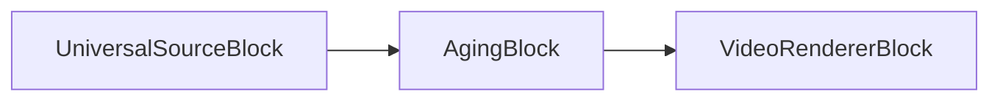

### Código de muestra

```csharp
var pipeline = new MediaBlocksPipeline();

var filename = "test.mp4";
var fileSource = new UniversalSourceBlock(await UniversalSourceSettings.CreateAsync(new Uri(filename)));

var agingSettings = new AgingVideoEffect
{
    ScratchIntensity = 0.5,
    DustIntensity = 0.3,
    ColorShift = true
};
var aging = new AgingBlock(agingSettings);
pipeline.Connect(fileSource.VideoOutput, aging.Input);

var videoRenderer = new VideoRendererBlock(pipeline, VideoView1);
pipeline.Connect(aging.Output, videoRenderer.Input);

await pipeline.StartAsync();
```

### Plataformas

Windows, macOS, Linux, iOS, Android.

## Combinación Alfa

[Media Blocks SDK .Net](https://www.visioforge.com/media-blocks-sdk-net){ .md-button .md-button--primary target="_blank" }

El bloque AlphaCombine combina dos flujos de video usando mezcla de canal alfa, habilitando operaciones sofisticadas de composición con control de transparencia.

### Información del bloque

Nombre: AlphaCombineBlock.

Dirección del pin | Tipo de medio | Cantidad de pines
--- | :---: | :---:
Entrada (Primaria) | Video sin comprimir | 1
Entrada (Alfa) | Video sin comprimir | 1
Salida | Video sin comprimir | 1

### Pipeline de muestra

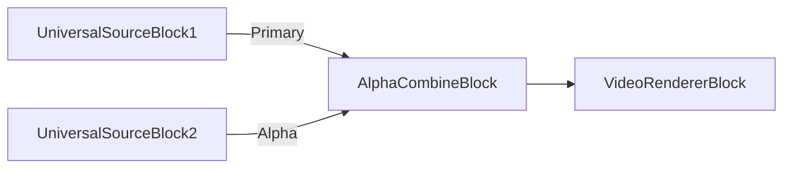

### Código de muestra

```csharp
var pipeline = new MediaBlocksPipeline();

var primarySource = new UniversalSourceBlock(await UniversalSourceSettings.CreateAsync(new Uri("video.mp4")));
var alphaSource = new UniversalSourceBlock(await UniversalSourceSettings.CreateAsync(new Uri("alpha.mp4")));

var alphaCombine = new AlphaCombineBlock();
pipeline.Connect(primarySource.VideoOutput, alphaCombine.Input);
pipeline.Connect(alphaSource.VideoOutput, alphaCombine.AlphaInput);

var videoRenderer = new VideoRendererBlock(pipeline, VideoView1);
pipeline.Connect(alphaCombine.Output, videoRenderer.Input);

await pipeline.StartAsync();
```

### Plataformas

Windows, macOS, Linux, iOS, Android.

## Desentrelazado Automático

[Media Blocks SDK .Net](https://www.visioforge.com/media-blocks-sdk-net){ .md-button .md-button--primary target="_blank" }

El bloque AutoDeinterlace detecta y desentrelaza automáticamente contenido de video entrelazado, convirtiéndolo a formato progresivo. Determina inteligentemente cuándo se necesita el desentrelazado basado en las propiedades del flujo de video.

### Información del bloque

Nombre: AutoDeinterlaceBlock.

Dirección del pin | Tipo de medio | Cantidad de pines
--- | :---: | :---:
Entrada | Video sin comprimir | 1
Salida | Video sin comprimir | 1

### Pipeline de muestra

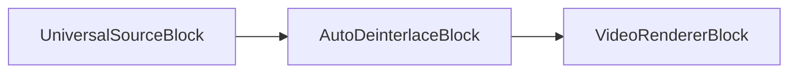

### Código de muestra

```csharp
var pipeline = new MediaBlocksPipeline();

var filename = "interlaced_video.mp4";
var fileSource = new UniversalSourceBlock(await UniversalSourceSettings.CreateAsync(new Uri(filename)));

var autoDeinterlace = new AutoDeinterlaceBlock(new AutoDeinterlaceSettings());
pipeline.Connect(fileSource.VideoOutput, autoDeinterlace.Input);

var videoRenderer = new VideoRendererBlock(pipeline, VideoView1);
pipeline.Connect(autoDeinterlace.Output, videoRenderer.Input);

await pipeline.StartAsync();
```

### Plataformas

Windows, macOS, Linux, iOS, Android.

## Bayer a RGB

[Media Blocks SDK .Net](https://www.visioforge.com/media-blocks-sdk-net){ .md-button .md-button--primary target="_blank" }

El bloque Bayer2RGB convierte datos de sensor raw de patrón Bayer a video RGB color. Esto es esencial para procesar video de cámaras industriales y sensores que generan datos raw de patrón Bayer.

### Información del bloque

Nombre: Bayer2RGBBlock.

Dirección del pin | Tipo de medio | Cantidad de pines
--- | :---: | :---:
Entrada | Video de patrón Bayer | 1
Salida | Video RGB sin comprimir | 1

### Pipeline de muestra

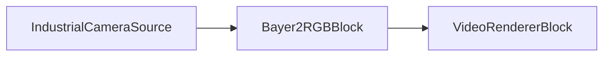

### Código de muestra

```csharp
var pipeline = new MediaBlocksPipeline();

// Asumiendo una fuente de cámara que genera patrón Bayer
var cameraSource = new SystemVideoSourceBlock(cameraSettings);

var bayer2rgb = new Bayer2RGBBlock();
pipeline.Connect(cameraSource.Output, bayer2rgb.Input);

var videoRenderer = new VideoRendererBlock(pipeline, VideoView1);
pipeline.Connect(bayer2rgb.Output, videoRenderer.Input);

await pipeline.StartAsync();
```

### Plataformas

Windows, macOS, Linux.

## Croma Key

[Media Blocks SDK .Net](https://www.visioforge.com/media-blocks-sdk-net){ .md-button .md-button--primary target="_blank" }

El bloque ChromaKey proporciona funcionalidad profesional de composición de pantalla verde y keying de color, removiendo colores específicos del contenido de video y componiendo sujetos en primer plano en fondos diferentes. Características selección sofisticada de color, refinamiento de bordes, supresión de spill y generación de canal alfa.

### Información del bloque

Nombre: ChromaKeyBlock.

Dirección del pin | Tipo de medio | Cantidad de pines
--- | :---: | :---:
Entrada (Fondo) | Video sin comprimir | 1
Entrada (Croma) | Video sin comprimir | 1
Salida | Video sin comprimir | 1

### Pipeline de muestra

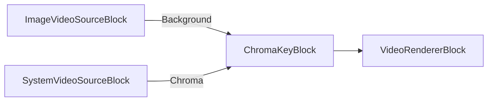

### Código de muestra

```csharp
var pipeline = new MediaBlocksPipeline();

// Crear fuente de fondo (imagen o video)
var backgroundSettings = new ImageVideoSourceSettings("background.jpg")
{
    FrameRate = new VideoFrameRate(30.0)
};
var backgroundSource = new ImageVideoSourceBlock(backgroundSettings);

// Crear fuente de primer plano con pantalla verde
var device = (await DeviceEnumerator.Shared.VideoSourcesAsync())[0];
var videoFormat = device.VideoFormats[0];
var videoSettings = new VideoCaptureDeviceSourceSettings(device)
{
    Format = videoFormat.ToFormat()
};
var videoSource = new SystemVideoSourceBlock(videoSettings);

// Crear bloque de croma key
var chromaKeySettings = new ChromaKeySettingsX(new Size(1920, 1080))
{
    ChromaColor = ChromaKeyColor.Green,
    Sensitivity = 0.5,
    NoiseLevel = 0.1,
    Alpha = 1.0
};
var chromaKey = new ChromaKeyBlock(chromaKeySettings);

// Conectar pipeline
pipeline.Connect(backgroundSource.Output, chromaKey.BackgroundInput);
pipeline.Connect(videoSource.Output, chromaKey.ChromaInput);

var videoRenderer = new VideoRendererBlock(pipeline, VideoView1);
pipeline.Connect(chromaKey.Output, videoRenderer.Input);

await pipeline.StartAsync();
```

### Aplicaciones de muestra

- [Demo de ChromaKey (WPF)](https://github.com/visioforge/.Net-SDK-s-samples/tree/master/Media%20Blocks%20SDK/WPF/CSharp/ChromaKey)

### Plataformas

Windows, macOS, Linux, iOS, Android.

## Demux Alfa de Codec

[Media Blocks SDK .Net](https://www.visioforge.com/media-blocks-sdk-net){ .md-button .md-button--primary target="_blank" }

El bloque CodecAlphaDemux separa el canal alfa de codecs de video que soportan canales alfa embebidos (como VP8, VP9, o ProRes con alfa).

### Información del bloque

Nombre: CodecAlphaDemuxBlock.

Dirección del pin | Tipo de medio | Cantidad de pines
--- | :---: | :---:
Entrada | Video comprimido con alfa | 1
Salida (Video) | Video sin comprimir | 1
Salida (Alfa) | Canal alfa | 1

### Pipeline de muestra

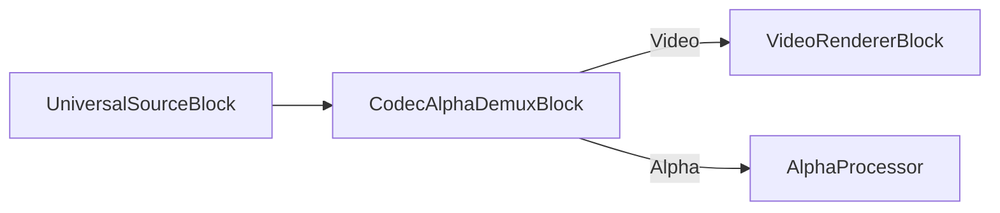

### Código de muestra

```csharp
var pipeline = new MediaBlocksPipeline();

var filename = "video_with_alpha.webm"; // VP8/VP9 con alfa
var fileSource = new UniversalSourceBlock(await UniversalSourceSettings.CreateAsync(new Uri(filename)));

var alphaDemux = new CodecAlphaDemuxBlock();
pipeline.Connect(fileSource.VideoOutput, alphaDemux.Input);

var videoRenderer = new VideoRendererBlock(pipeline, VideoView1);
pipeline.Connect(alphaDemux.VideoOutput, videoRenderer.Input);

await pipeline.StartAsync();
```

### Plataformas

Windows, macOS, Linux, iOS, Android.

## Efectos de Color

[Media Blocks SDK .Net](https://www.visioforge.com/media-blocks-sdk-net){ .md-button .md-button--primary target="_blank" }

El bloque realiza procesamiento básico de color de marco de video: toning de cámara de calor falsa, toning sepia, invertir y ligeramente sombrear a azul, procesamiento cruzado toning, y filtro de primer plano amarillo/fondo azul de color.

### Información del bloque

Nombre: ColorEffectsBlock.

Dirección del pin | Tipo de medio | Cantidad de pines
--- | :---: | :---:
Entrada | Video sin comprimir | 1
Salida | Video sin comprimir | 1

### Pipeline de muestra

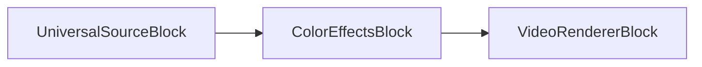

### Código de muestra

```csharp
var pipeline = new MediaBlocksPipeline();

var filename = "test.mp4";
var fileSource = new UniversalSourceBlock(await UniversalSourceSettings.CreateAsync(new Uri(filename)));

// Sepia
var colorEffects = new ColorEffectsBlock(ColorEffectsPreset.Sepia);
pipeline.Connect(fileSource.VideoOutput, colorEffects.Input);

var videoRenderer = new VideoRendererBlock(pipeline, VideoView1);
pipeline.Connect(colorEffects.Output, videoRenderer.Input);            

await pipeline.StartAsync();
```

### Plataformas

Windows, macOS, Linux, iOS, Android.

## Dados

[Media Blocks SDK .Net](https://www.visioforge.com/media-blocks-sdk-net){ .md-button .md-button--primary target="_blank" }

El bloque Dice divide el marco de video en una cuadrícula de mosaicos y aplica varias transformaciones para crear un efecto visual fragmentado, tipo mosaico.

### Información del bloque

Nombre: DiceBlock.

Dirección del pin | Tipo de medio | Cantidad de pines
--- | :---: | :---:
Entrada | Video sin comprimir | 1
Salida | Video sin comprimir | 1

### Pipeline de muestra

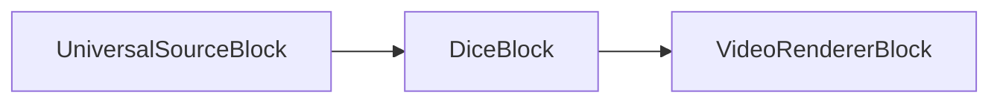

### Código de muestra

```csharp
var pipeline = new MediaBlocksPipeline();

var filename = "test.mp4";
var fileSource = new UniversalSourceBlock(await UniversalSourceSettings.CreateAsync(new Uri(filename)));

var dice = new DiceBlock(new DiceVideoEffect());
pipeline.Connect(fileSource.VideoOutput, dice.Input);

var videoRenderer = new VideoRendererBlock(pipeline, VideoView1);
pipeline.Connect(dice.Output, videoRenderer.Input);

await pipeline.StartAsync();
```

### Plataformas

Windows, macOS, Linux, iOS, Android.

## Borde

[Media Blocks SDK .Net](https://www.visioforge.com/media-blocks-sdk-net){ .md-button .md-button--primary target="_blank" }

El bloque Edge detecta y resalta bordes en marcos de video, creando un efecto visual de detección de bordes útil para propósitos artísticos o preprocesamiento de visión por computadora.

### Información del bloque

Nombre: EdgeBlock.

Dirección del pin | Tipo de medio | Cantidad de pines
--- | :---: | :---:
Entrada | Video sin comprimir | 1
Salida | Video sin comprimir | 1

### Pipeline de muestra

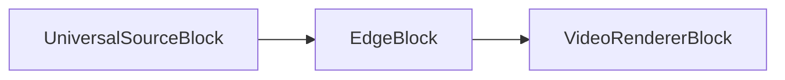

### Código de muestra

```csharp
var pipeline = new MediaBlocksPipeline();

var filename = "test.mp4";
var fileSource = new UniversalSourceBlock(await UniversalSourceSettings.CreateAsync(new Uri(filename)));

var edge = new EdgeBlock();
pipeline.Connect(fileSource.VideoOutput, edge.Input);

var videoRenderer = new VideoRendererBlock(pipeline, VideoView1);
pipeline.Connect(edge.Output, videoRenderer.Input);

await pipeline.StartAsync();
```

### Plataformas

Windows, macOS, Linux, iOS, Android.

## Desentrelazado

[Media Blocks SDK .Net](https://www.visioforge.com/media-blocks-sdk-net){ .md-button .md-button--primary target="_blank" }

El bloque desentrelaza marcos de video entrelazados en marcos de video progresivos. Varios métodos de procesamiento están disponibles.
Usa la clase DeinterlaceSettings para configurar el bloque.

### Información del bloque

Nombre: DeinterlaceBlock.

Dirección del pin | Tipo de medio | Cantidad de pines
--- | :---: | :---:
Entrada | Video sin comprimir | 1
Salida | Video sin comprimir | 1

### Pipeline de muestra

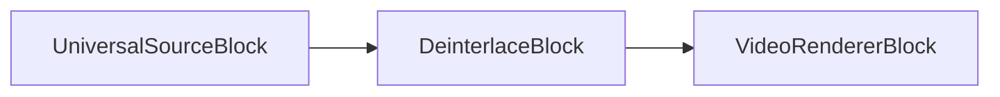

### Código de muestra

```csharp
var pipeline = new MediaBlocksPipeline();

var filename = "test.mp4";
var fileSource = new UniversalSourceBlock(await UniversalSourceSettings.CreateAsync(new Uri(filename)));

var deinterlace = new DeinterlaceBlock(new DeinterlaceSettings());
pipeline.Connect(fileSource.VideoOutput, deinterlace.Input);

var videoRenderer = new VideoRendererBlock(pipeline, VideoView1);
pipeline.Connect(deinterlace.Output, videoRenderer.Input);            

await pipeline.StartAsync();
```

### Plataformas

Windows, macOS, Linux, iOS, Android.

## Ojo de Pez

[Media Blocks SDK .Net](https://www.visioforge.com/media-blocks-sdk-net){ .md-button .md-button--primary target="_blank" }

El bloque de ojo de pez simula una lente de ojo de pez al hacer zoom en el centro de la imagen y comprimir los bordes.

### Información del bloque

Nombre: FishEyeBlock.

Dirección del pin | Tipo de medio | Cantidad de pines
--- | :---: | :---:
Entrada | Video sin comprimir | 1
Salida | Video sin comprimir | 1

### Pipeline de muestra

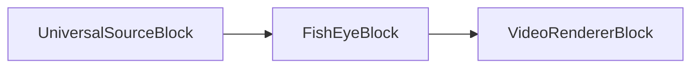

### Código de muestra

```csharp
var pipeline = new MediaBlocksPipeline();

var filename = "test.mp4";
var fileSource = new UniversalSourceBlock(await UniversalSourceSettings.CreateAsync(new Uri(filename)));

var fishEye = new FishEyeBlock();
pipeline.Connect(fileSource.VideoOutput, fishEye.Input);

var videoRenderer = new VideoRendererBlock(pipeline, VideoView1);
pipeline.Connect(fishEye.Output, videoRenderer.Input);            

await pipeline.StartAsync();
```

### Plataformas

Windows, macOS, Linux, iOS, Android.

## Voltear/Girar

[Media Blocks SDK .Net](https://www.visioforge.com/media-blocks-sdk-net){ .md-button .md-button--primary target="_blank" }

El bloque voltea y gira el flujo de video.
Usa la enumeración VideoFlipRotateMethod para configurar.

### Información del bloque

Nombre: FlipRotateBlock.

Dirección del pin | Tipo de medio | Cantidad de pines
--- | :---: | :---:
Entrada | Video sin comprimir | 1
Salida | Video sin comprimir | 1

### Pipeline de muestra

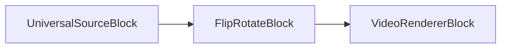

### Código de muestra

```csharp
var pipeline = new MediaBlocksPipeline();

var filename = "test.mp4";
var fileSource = new UniversalSourceBlock(await UniversalSourceSettings.CreateAsync(new Uri(filename)));

// Rotación de 90 grados
var flipRotate = new FlipRotateBlock(VideoFlipRotateMethod.Method90R);
pipeline.Connect(fileSource.VideoOutput, flipRotate.Input);

var videoRenderer = new VideoRendererBlock(pipeline, VideoView1);
pipeline.Connect(flipRotate.Output, videoRenderer.Input);            

await pipeline.StartAsync();
```

### Plataformas

Windows, macOS, Linux, iOS, Android.

## Gamma

[Media Blocks SDK .Net](https://www.visioforge.com/media-blocks-sdk-net){ .md-button .md-button--primary target="_blank" }

El bloque realiza corrección gamma en un flujo de video.

### Información del bloque

Nombre: GammaBlock.

Dirección del pin | Tipo de medio | Cantidad de pines
--- | :---: | :---:
Entrada | Video sin comprimir | 1
Salida | Video sin comprimir | 1

### Pipeline de muestra

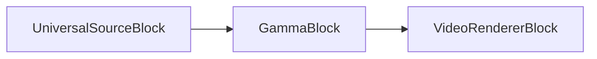

### Código de muestra

```csharp
var pipeline = new MediaBlocksPipeline();

var filename = "test.mp4";
var fileSource = new UniversalSourceBlock(await UniversalSourceSettings.CreateAsync(new Uri(filename)));

var gamma = new GammaBlock(2.0);
pipeline.Connect(fileSource.VideoOutput, gamma.Input);

var videoRenderer = new VideoRendererBlock(pipeline, VideoView1);
pipeline.Connect(gamma.Output, videoRenderer.Input);            

await pipeline.StartAsync();
```

### Plataformas

Windows, macOS, Linux, iOS, Android.

## Desenfoque Gaussiano

[Media Blocks SDK .Net](https://www.visioforge.com/media-blocks-sdk-net){ .md-button .md-button--primary target="_blank" }

El bloque desenfoca el flujo de video usando la función Gaussiana.

### Información del bloque

Nombre: GaussianBlurBlock.

Dirección del pin | Tipo de medio | Cantidad de pines
--- | :---: | :---:
Entrada | Video sin comprimir | 1
Salida | Video sin comprimir | 1

### Pipeline de muestra

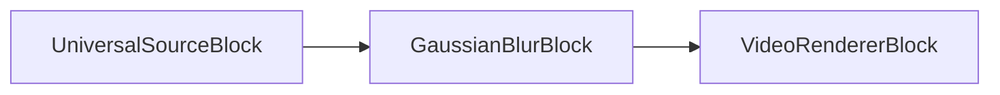

### Código de muestra

```csharp
var pipeline = new MediaBlocksPipeline();

var filename = "test.mp4";
var fileSource = new UniversalSourceBlock(await UniversalSourceSettings.CreateAsync(new Uri(filename)));

var gaussianBlur = new GaussianBlurBlock();
pipeline.Connect(fileSource.VideoOutput, gaussianBlur.Input);

var videoRenderer = new VideoRendererBlock(pipeline, VideoView1);
pipeline.Connect(gaussianBlur.Output, videoRenderer.Input);            

await pipeline.StartAsync();
```

### Plataformas

Windows, macOS, Linux, iOS, Android.

## Escala de Grises

[Media Blocks SDK .Net](https://www.visioforge.com/media-blocks-sdk-net){ .md-button .md-button--primary target="_blank" }

El bloque Grayscale convierte video color a escala de grises (blanco y negro), removiendo toda la información de color mientras preserva la luminancia.

### Información del bloque

Nombre: GrayscaleBlock.

Dirección del pin | Tipo de medio | Cantidad de pines
--- | :---: | :---:
Entrada | Video sin comprimir | 1
Salida | Video sin comprimir | 1

### Pipeline de muestra

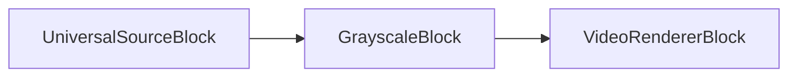

### Código de muestra

```csharp
var pipeline = new MediaBlocksPipeline();

var filename = "test.mp4";
var fileSource = new UniversalSourceBlock(await UniversalSourceSettings.CreateAsync(new Uri(filename)));

var grayscale = new GrayscaleBlock();
pipeline.Connect(fileSource.VideoOutput, grayscale.Input);

var videoRenderer = new VideoRendererBlock(pipeline, VideoView1);
pipeline.Connect(grayscale.Output, videoRenderer.Input);

await pipeline.StartAsync();
```

### Plataformas

Windows, macOS, Linux, iOS, Android.

## Superposición de Imagen

[Media Blocks SDK .Net](https://www.visioforge.com/media-blocks-sdk-net){ .md-button .md-button--primary target="_blank" }

El bloque superpone una imagen cargada desde un archivo en un flujo de video.

Puedes configurar una posición de imagen y valor alfa opcional. 32-bit imágenes con canal alfa están soportadas.

### Información del bloque

Nombre: ImageOverlayBlock.

Dirección del pin | Tipo de medio | Cantidad de pines
--- | :---: | :---:
Entrada | Video sin comprimir | 1
Salida | Video sin comprimir | 1

### Pipeline de muestra

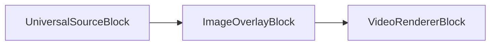

### Código de muestra

```csharp
var pipeline = new MediaBlocksPipeline();

var filename = "test.mp4";
var fileSource = new UniversalSourceBlock(await UniversalSourceSettings.CreateAsync(new Uri(filename)));

var imageOverlay = new ImageOverlayBlock(@"logo.png");
pipeline.Connect(fileSource.VideoOutput, imageOverlay.Input);

var videoRenderer = new VideoRendererBlock(pipeline, VideoView1);
pipeline.Connect(imageOverlay.Output, videoRenderer.Input);            

await pipeline.StartAsync();
```

### Plataformas

Windows, macOS, Linux, iOS, Android.

## Superposición de Imagen Cairo

[Media Blocks SDK .Net](https://www.visioforge.com/media-blocks-sdk-net){ .md-button .md-button--primary target="_blank" }

El bloque ImageOverlayCairo proporciona capacidades avanzadas de superposición de imagen usando la biblioteca gráfica Cairo, ofreciendo calidad de renderizado mejorada y características adicionales comparado con el bloque de superposición de imagen estándar.

### Información del bloque

Nombre: ImageOverlayCairoBlock.

Dirección del pin | Tipo de medio | Cantidad de pines
--- | :---: | :---:
Entrada | Video sin comprimir | 1
Salida | Video sin comprimir | 1

### Pipeline de muestra

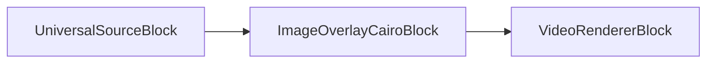

### Código de muestra

```csharp
var pipeline = new MediaBlocksPipeline();

var filename = "test.mp4";
var fileSource = new UniversalSourceBlock(await UniversalSourceSettings.CreateAsync(new Uri(filename)));

var imageOverlayCairo = new ImageOverlayCairoBlock("logo.png");
pipeline.Connect(fileSource.VideoOutput, imageOverlayCairo.Input);

var videoRenderer = new VideoRendererBlock(pipeline, VideoView1);
pipeline.Connect(imageOverlayCairo.Output, videoRenderer.Input);

await pipeline.StartAsync();
```

### Plataformas

Windows, macOS, Linux, iOS, Android.

## Entrelazado

[Media Blocks SDK .Net](https://www.visioforge.com/media-blocks-sdk-net){ .md-button .md-button--primary target="_blank" }

El bloque Interlace convierte video progresivo a formato entrelazado, creando líneas de campo alternas. Esto es útil para broadcast o compatibilidad con sistemas de display entrelazados.

### Información del bloque

Nombre: InterlaceBlock.

Dirección del pin | Tipo de medio | Cantidad de pines
--- | :---: | :---:
Entrada | Video sin comprimir | 1
Salida | Video sin comprimir | 1

### Pipeline de muestra

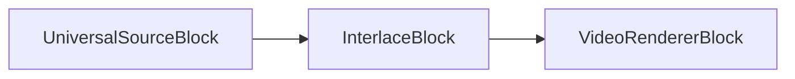

### Código de muestra

```csharp
var pipeline = new MediaBlocksPipeline();

var filename = "test.mp4";
var fileSource = new UniversalSourceBlock(await UniversalSourceSettings.CreateAsync(new Uri(filename)));

var interlace = new InterlaceBlock(new InterlaceSettings());
pipeline.Connect(fileSource.VideoOutput, interlace.Input);

var videoRenderer = new VideoRendererBlock(pipeline, VideoView1);
pipeline.Connect(interlace.Output, videoRenderer.Input);

await pipeline.StartAsync();
```

### Plataformas

Windows, macOS, Linux, iOS, Android.

## Detector de Fotograma Clave

[Media Blocks SDK .Net](https://www.visioforge.com/media-blocks-sdk-net){ .md-button .md-button--primary target="_blank" }

El bloque KeyFrameDetector analiza flujos de video para detectar e identificar fotogramas clave (I-frames) en la secuencia de video, útil para aplicaciones de edición de video y análisis.

### Información del bloque

Nombre: KeyFrameDetectorBlock.

Dirección del pin | Tipo de medio | Cantidad de pines
--- | :---: | :---:
Entrada | Video sin comprimir | 1
Salida | Video sin comprimir | 1

### Pipeline de muestra

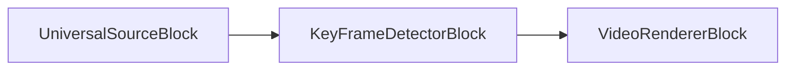

### Código de muestra

```csharp
var pipeline = new MediaBlocksPipeline();

var filename = "test.mp4";
var fileSource = new UniversalSourceBlock(await UniversalSourceSettings.CreateAsync(new Uri(filename)));

var keyFrameDetector = new KeyFrameDetectorBlock();
keyFrameDetector.OnKeyFrameDetected += (sender, e) =>
{
    Console.WriteLine($"Fotograma clave detectado en timestamp: {e.Timestamp}");
};
pipeline.Connect(fileSource.VideoOutput, keyFrameDetector.Input);

var videoRenderer = new VideoRendererBlock(pipeline, VideoView1);
pipeline.Connect(keyFrameDetector.Output, videoRenderer.Input);

await pipeline.StartAsync();
```

### Plataformas

Windows, macOS, Linux, iOS, Android.

## Procesador LUT

[Media Blocks SDK .Net](https://www.visioforge.com/media-blocks-sdk-net){ .md-button .md-button--primary target="_blank" }

El bloque Procesador LUT (Look-Up Table) aplica corrección y gradación de color usando archivos LUT 3D, habilitando transformaciones de color profesionales y looks cinematográficos.

### Información del bloque

Nombre: LUTProcessorBlock.

Dirección del pin | Tipo de medio | Cantidad de pines
--- | :---: | :---:
Entrada | Video sin comprimir | 1
Salida | Video sin comprimir | 1

### Pipeline de muestra

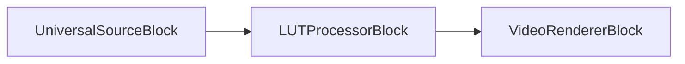

### Código de muestra

```csharp
var pipeline = new MediaBlocksPipeline();

var filename = "test.mp4";
var fileSource = new UniversalSourceBlock(await UniversalSourceSettings.CreateAsync(new Uri(filename)));

var lutSettings = new LUTVideoEffect
{
    LUTFilePath = "cinematic_lut.cube"
};
var lutProcessor = new LUTProcessorBlock(lutSettings);
pipeline.Connect(fileSource.VideoOutput, lutProcessor.Input);

var videoRenderer = new VideoRendererBlock(pipeline, VideoView1);
pipeline.Connect(lutProcessor.Output, videoRenderer.Input);

await pipeline.StartAsync();
```

### Plataformas

Windows, macOS, Linux, iOS, Android.

## Espejo

[Media Blocks SDK .Net](https://www.visioforge.com/media-blocks-sdk-net){ .md-button .md-button--primary target="_blank" }

El bloque espejo divide la imagen en dos mitades y refleja una sobre la otra.

### Información del bloque

Nombre: MirrorBlock.

Dirección del pin | Tipo de medio | Cantidad de pines
--- | :---: | :---:
Entrada | Video sin comprimir | 1
Salida | Video sin comprimir | 1

### Pipeline de muestra

```mermaid
graph LR;
    UniversalSourceBlock-->MirrorBlock;
    MirrorBlock-->VideoRendererBlock;
```

### Código de muestra

```csharp
var pipeline = new MediaBlocksPipeline();

var filename = "test.mp4";
var fileSource = new UniversalSourceBlock(await UniversalSourceSettings.CreateAsync(new Uri(filename)));

var mirrorBlock = new MirrorBlock(MirrorMode.Top);
pipeline.Connect(fileSource.VideoOutput, mirrorBlock.Input);

var videoRenderer = new VideoRendererBlock(pipeline, VideoView1);
pipeline.Connect(mirrorBlock.Output, videoRenderer.Input);            

await pipeline.StartAsync();
```

### Plataformas

Windows, macOS, Linux, iOS, Android.

## Desenfoque en Movimiento

[Media Blocks SDK .Net](https://www.visioforge.com/media-blocks-sdk-net){ .md-button .md-button--primary target="_blank" }

El bloque MovingBlur crea efectos dinámicos de desenfoque de movimiento al mezclar el marco actual con marcos previos, simulando desenfoque de movimiento de cámara o creando efectos artísticos de arrastre.

### Información del bloque

Nombre: MovingBlurBlock.

Dirección del pin | Tipo de medio | Cantidad de pines
--- | :---: | :---:
Entrada | Video sin comprimir | 1
Salida | Video sin comprimir | 1

### Pipeline de muestra

```mermaid
graph LR;
    UniversalSourceBlock-->MovingBlurBlock;
    MovingBlurBlock-->VideoRendererBlock;
```

### Código de muestra

```csharp
var pipeline = new MediaBlocksPipeline();

var filename = "test.mp4";
var fileSource = new UniversalSourceBlock(await UniversalSourceSettings.CreateAsync(new Uri(filename)));

var movingBlur = new MovingBlurBlock(new MovingBlurVideoEffect());
pipeline.Connect(fileSource.VideoOutput, movingBlur.Input);

var videoRenderer = new VideoRendererBlock(pipeline, VideoView1);
pipeline.Connect(movingBlur.Output, videoRenderer.Input);

await pipeline.StartAsync();
```

### Plataformas

Windows, macOS, Linux, iOS, Android.

## Eco en Movimiento

[Media Blocks SDK .Net](https://www.visioforge.com/media-blocks-sdk-net){ .md-button .md-button--primary target="_blank" }

El bloque MovingEcho crea efectos eco-like al capas versiones retardadas de marcos de video, produciendo un efecto de ghosting o trail.

### Información del bloque

Nombre: MovingEchoBlock.

Dirección del pin | Tipo de medio | Cantidad de pines
--- | :---: | :---:
Entrada | Video sin comprimir | 1
Salida | Video sin comprimir | 1

### Pipeline de muestra

```mermaid
graph LR;
    UniversalSourceBlock-->MovingEchoBlock;
    MovingEchoBlock-->VideoRendererBlock;
```

### Código de muestra

```csharp
var pipeline = new MediaBlocksPipeline();

var filename = "test.mp4";
var fileSource = new UniversalSourceBlock(await UniversalSourceSettings.CreateAsync(new Uri(filename)));

var movingEcho = new MovingEchoBlock(new MovingEchoVideoEffect());
pipeline.Connect(fileSource.VideoOutput, movingEcho.Input);

var videoRenderer = new VideoRendererBlock(pipeline, VideoView1);
pipeline.Connect(movingEcho.Output, videoRenderer.Input);

await pipeline.StartAsync();
```

### Plataformas

Windows, macOS, Linux, iOS, Android.

## Eco de Zoom en Movimiento

[Media Blocks SDK .Net](https://www.visioforge.com/media-blocks-sdk-net){ .md-button .md-button--primary target="_blank" }

El bloque MovingZoomEcho combina efectos eco de movimiento con transformaciones de zoom, creando efectos visuales dinámicos que simulan trails de zoom.

### Información del bloque

Nombre: MovingZoomEchoBlock.

Dirección del pin | Tipo de medio | Cantidad de pines
--- | :---: | :---:
Entrada | Video sin comprimir | 1
Salida | Video sin comprimir | 1

### Pipeline de muestra

```mermaid
graph LR;
    UniversalSourceBlock-->MovingZoomEchoBlock;
    MovingZoomEchoBlock-->VideoRendererBlock;
```

### Código de muestra

```csharp
var pipeline = new MediaBlocksPipeline();

var filename = "test.mp4";
var fileSource = new UniversalSourceBlock(await UniversalSourceSettings.CreateAsync(new Uri(filename)));

var movingZoomEcho = new MovingZoomEchoBlock(new MovingZoomEchoVideoEffect());
pipeline.Connect(fileSource.VideoOutput, movingZoomEcho.Input);

var videoRenderer = new VideoRendererBlock(pipeline, VideoView1);
pipeline.Connect(movingZoomEcho.Output, videoRenderer.Input);

await pipeline.StartAsync();
```

### Plataformas

Windows, macOS, Linux, iOS, Android.

## Animación Óptica BW

[Media Blocks SDK .Net](https://www.visioforge.com/media-blocks-sdk-net){ .md-button .md-button--primary target="_blank" }

El bloque OpticalAnimationBW aplica efectos de animación óptica blanco y negro, creando transformaciones visuales estilo película vintage.

### Información del bloque

Nombre: OpticalAnimationBWBlock.

Dirección del pin | Tipo de medio | Cantidad de pines
--- | :---: | :---:
Entrada | Video sin comprimir | 1
Salida | Video sin comprimir | 1

### Pipeline de muestra

```mermaid
graph LR;
    UniversalSourceBlock-->OpticalAnimationBWBlock;
    OpticalAnimationBWBlock-->VideoRendererBlock;
```

### Código de muestra

```csharp
var pipeline = new MediaBlocksPipeline();

var filename = "test.mp4";
var fileSource = new UniversalSourceBlock(await UniversalSourceSettings.CreateAsync(new Uri(filename)));

var opticalAnimBW = new OpticalAnimationBWBlock(new OpticalAnimationBWVideoEffect());
pipeline.Connect(fileSource.VideoOutput, opticalAnimBW.Input);

var videoRenderer = new VideoRendererBlock(pipeline, VideoView1);
pipeline.Connect(opticalAnimBW.Output, videoRenderer.Input);

await pipeline.StartAsync();
```

### Plataformas

Windows, macOS, Linux, iOS, Android.

## Administrador de Superposiciones

[Media Blocks SDK .Net](https://www.visioforge.com/media-blocks-sdk-net){ .md-button .md-button--primary target="_blank" }

El bloque OverlayManager proporciona un sistema completo para gestionar múltiples superposiciones (texto, imágenes, formas) en video, con soporte para actualizaciones dinámicas y animaciones.

### Información del bloque

Nombre: OverlayManagerBlock.

Dirección del pin | Tipo de medio | Cantidad de pines
--- | :---: | :---:
Entrada | Video sin comprimir | 1
Salida | Video sin comprimir | 1

### Pipeline de muestra

```mermaid
graph LR;
    UniversalSourceBlock-->OverlayManagerBlock;
    OverlayManagerBlock-->VideoRendererBlock;
```

### Código de muestra

```csharp
var pipeline = new MediaBlocksPipeline();

var filename = "test.mp4";
var fileSource = new UniversalSourceBlock(await UniversalSourceSettings.CreateAsync(new Uri(filename)));

var overlayManager = new OverlayManagerBlock();
pipeline.Connect(fileSource.VideoOutput, overlayManager.Input);

var videoRenderer = new VideoRendererBlock(pipeline, VideoView1);
pipeline.Connect(overlayManager.Output, videoRenderer.Input);

await pipeline.StartAsync();

// Agregar superposiciones dinámicamente
await overlayManager.AddTextOverlayAsync("Hola Mundo", 100, 100);
await overlayManager.AddImageOverlayAsync("logo.png", 10, 10);
```

### Aplicaciones de muestra

- [Documentación de página OverlayManagerBlock](OverlayManagerBlock.md)

### Plataformas

Windows, macOS, Linux, iOS, Android.

## Perspectiva

[Media Blocks SDK .Net](https://www.visioforge.com/media-blocks-sdk-net){ .md-button .md-button--primary target="_blank" }

El bloque perspectiva aplica una transformación de perspectiva 2D.

### Información del bloque

Nombre: PerspectiveBlock.

Dirección del pin | Tipo de medio | Cantidad de pines
--- | :---: | :---:
Entrada | Video sin comprimir | 1
Salida | Video sin comprimir | 1

### Pipeline de muestra

```mermaid
graph LR;
    UniversalSourceBlock-->PerspectiveBlock;
    PerspectiveBlock-->VideoRendererBlock;
```

### Código de muestra

```csharp
var pipeline = new MediaBlocksPipeline();

var filename = "test.mp4";
var fileSource = new UniversalSourceBlock(await UniversalSourceSettings.CreateAsync(new Uri(filename)));

var persBlock = new PerspectiveBlock(new int[] { 1, 2, 3, 4, 5, 6, 7, 8, 9 });
pipeline.Connect(fileSource.VideoOutput, persBlock.Input);

var videoRenderer = new VideoRendererBlock(pipeline, VideoView1);
pipeline.Connect(persBlock.Output, videoRenderer.Input);            

await pipeline.StartAsync();
```

### Plataformas

Windows, macOS, Linux, iOS, Android.

## Pellizco

[Media Blocks SDK .Net](https://www.visioforge.com/media-blocks-sdk-net){ .md-button .md-button--primary target="_blank" }

El bloque realiza la transformación geométrica de pellizco de la imagen.

### Información del bloque

Nombre: PinchBlock.

Dirección del pin | Tipo de medio | Cantidad de pines
--- | :---: | :---:
Entrada | Video sin comprimir | 1
Salida | Video sin comprimir | 1

### Pipeline de muestra

```mermaid
graph LR;
    UniversalSourceBlock-->PinchBlock;
    PinchBlock-->VideoRendererBlock;
```

### Código de muestra

```csharp
var pipeline = new MediaBlocksPipeline();

var filename = "test.mp4";
var fileSource = new UniversalSourceBlock(await UniversalSourceSettings.CreateAsync(new Uri(filename)));

var pinchBlock = new PinchBlock();
pipeline.Connect(fileSource.VideoOutput, pinchBlock.Input);

var videoRenderer = new VideoRendererBlock(pipeline, VideoView1);
pipeline.Connect(pinchBlock.Output, videoRenderer.Input);            

await pipeline.StartAsync();
```

### Plataformas

Windows, macOS, Linux, iOS, Android.

## Pseudo 3D

[Media Blocks SDK .Net](https://www.visioforge.com/media-blocks-sdk-net){ .md-button .md-button--primary target="_blank" }

El bloque Pseudo3D aplica transformaciones de perspectiva 3D-like para crear ilusiones de profundidad en video 2D.

### Información del bloque

Nombre: Pseudo3DBlock.

Dirección del pin | Tipo de medio | Cantidad de pines
--- | :---: | :---:
Entrada | Video sin comprimir | 1
Salida | Video sin comprimir | 1

### Pipeline de muestra

```mermaid
graph LR;
    UniversalSourceBlock-->Pseudo3DBlock;
    Pseudo3DBlock-->VideoRendererBlock;
```

### Código de muestra

```csharp
var pipeline = new MediaBlocksPipeline();

var filename = "test.mp4";
var fileSource = new UniversalSourceBlock(await UniversalSourceSettings.CreateAsync(new Uri(filename)));

var pseudo3D = new Pseudo3DBlock(new Pseudo3DVideoEffect());
pipeline.Connect(fileSource.VideoOutput, pseudo3D.Input);

var videoRenderer = new VideoRendererBlock(pipeline, VideoView1);
pipeline.Connect(pseudo3D.Output, videoRenderer.Input);

await pipeline.StartAsync();
```

### Plataformas

Windows, macOS, Linux, iOS, Android.

## Superposición de Código QR

[Media Blocks SDK .Net](https://www.visioforge.com/media-blocks-sdk-net){ .md-button .md-button--primary target="_blank" }

El bloque QRCodeOverlay genera y superpone códigos QR en contenido de video, útil para embeber URLs, metadatos o información de tracking.

### Información del bloque

Nombre: QRCodeOverlayBlock.

Dirección del pin | Tipo de medio | Cantidad de pines
--- | :---: | :---:
Entrada | Video sin comprimir | 1
Salida | Video sin comprimir | 1

### Pipeline de muestra

```mermaid
graph LR;
    UniversalSourceBlock-->QRCodeOverlayBlock;
    QRCodeOverlayBlock-->VideoRendererBlock;
```

### Código de muestra

```csharp
var pipeline = new MediaBlocksPipeline();

var filename = "test.mp4";
var fileSource = new UniversalSourceBlock(await UniversalSourceSettings.CreateAsync(new Uri(filename)));

var qrCodeOverlay = new QRCodeOverlayBlock("https://www.visioforge.com");
pipeline.Connect(fileSource.VideoOutput, qrCodeOverlay.Input);

var videoRenderer = new VideoRendererBlock(pipeline, VideoView1);
pipeline.Connect(qrCodeOverlay.Output, videoRenderer.Input);

await pipeline.StartAsync();
```

### Plataformas

Windows, macOS, Linux, iOS, Android.

## Quark

[Media Blocks SDK .Net](https://www.visioforge.com/media-blocks-sdk-net){ .md-button .md-button--primary target="_blank" }

El bloque Quark aplica un efecto visual tipo partícula que rompe la imagen en fragmentos quark-style.

### Información del bloque

Nombre: QuarkBlock.

Dirección del pin | Tipo de medio | Cantidad de pines
--- | :---: | :---:
Entrada | Video sin comprimir | 1
Salida | Video sin comprimir | 1

### Pipeline de muestra

```mermaid
graph LR;
    UniversalSourceBlock-->QuarkBlock;
    QuarkBlock-->VideoRendererBlock;
```

### Código de muestra

```csharp
var pipeline = new MediaBlocksPipeline();

var filename = "test.mp4";
var fileSource = new UniversalSourceBlock(await UniversalSourceSettings.CreateAsync(new Uri(filename)));

var quark = new QuarkBlock(new QuarkVideoEffect());
pipeline.Connect(fileSource.VideoOutput, quark.Input);

var videoRenderer = new VideoRendererBlock(pipeline, VideoView1);
pipeline.Connect(quark.Output, videoRenderer.Input);

await pipeline.StartAsync();
```

### Plataformas

Windows, macOS, Linux, iOS, Android.

## Ondulación

[Media Blocks SDK .Net](https://www.visioforge.com/media-blocks-sdk-net){ .md-button .md-button--primary target="_blank" }

El bloque Ripple crea efectos de distorsión tipo ondulación de agua a través del marco de video.

### Información del bloque

Nombre: RippleBlock.

Dirección del pin | Tipo de medio | Cantidad de pines
--- | :---: | :---:
Entrada | Video sin comprimir | 1
Salida | Video sin comprimir | 1

### Pipeline de muestra

```mermaid
graph LR;
    UniversalSourceBlock-->RippleBlock;
    RippleBlock-->VideoRendererBlock;
```

### Código de muestra

```csharp
var pipeline = new MediaBlocksPipeline();

var filename = "test.mp4";
var fileSource = new UniversalSourceBlock(await UniversalSourceSettings.CreateAsync(new Uri(filename)));

var ripple = new RippleBlock(new RippleVideoEffect());
pipeline.Connect(fileSource.VideoOutput, ripple.Input);

var videoRenderer = new VideoRendererBlock(pipeline, VideoView1);
pipeline.Connect(ripple.Output, videoRenderer.Input);

await pipeline.StartAsync();
```

### Plataformas

Windows, macOS, Linux, iOS, Android.

## Girar

[Media Blocks SDK .Net](https://www.visioforge.com/media-blocks-sdk-net){ .md-button .md-button--primary target="_blank" }

El bloque gira la imagen por un ángulo especificado.

### Información del bloque

Nombre: RotateBlock.

Dirección del pin | Tipo de medio | Cantidad de pines
--- | :---: | :---:
Entrada | Video sin comprimir | 1
Salida | Video sin comprimir | 1

### Pipeline de muestra

```mermaid
graph LR;
    UniversalSourceBlock-->RotateBlock;
    RotateBlock-->VideoRendererBlock;
```

### Código de muestra

```csharp
var pipeline = new MediaBlocksPipeline();

var filename = "test.mp4";
var fileSource = new UniversalSourceBlock(await UniversalSourceSettings.CreateAsync(new Uri(filename)));

var rotateBlock = new RotateBlock(0.7);
pipeline.Connect(fileSource.VideoOutput, rotateBlock.Input);

var videoRenderer = new VideoRendererBlock(pipeline, VideoView1);
pipeline.Connect(rotateBlock.Output, videoRenderer.Input);            

await pipeline.StartAsync();
```

### Plataformas

Windows, macOS, Linux, iOS, Android.

## Esquinas Redondeadas

[Media Blocks SDK .Net](https://www.visioforge.com/media-blocks-sdk-net){ .md-button .md-button--primary target="_blank" }

El bloque RoundedCorners aplica esquinas redondeadas a marcos de video, creando una apariencia moderna y suave.

### Información del bloque

Nombre: RoundedCornersBlock.

Dirección del pin | Tipo de medio | Cantidad de pines
--- | :---: | :---:
Entrada | Video sin comprimir | 1
Salida | Video sin comprimir | 1

### Pipeline de muestra

```mermaid
graph LR;
    UniversalSourceBlock-->RoundedCornersBlock;
    RoundedCornersBlock-->VideoRendererBlock;
```

### Código de muestra

```csharp
var pipeline = new MediaBlocksPipeline();

var filename = "test.mp4";
var fileSource = new UniversalSourceBlock(await UniversalSourceSettings.CreateAsync(new Uri(filename)));

var roundedCorners = new RoundedCornersBlock(20); // Radio de 20 píxeles
pipeline.Connect(fileSource.VideoOutput, roundedCorners.Input);

var videoRenderer = new VideoRendererBlock(pipeline, VideoView1);
pipeline.Connect(roundedCorners.Output, videoRenderer.Input);

await pipeline.StartAsync();
```

### Plataformas

Windows, macOS, Linux, iOS, Android.

## Cambiar Tamaño

[Media Blocks SDK .Net](https://www.visioforge.com/media-blocks-sdk-net){ .md-button .md-button--primary target="_blank" }

El bloque cambia el tamaño del flujo de video. Puedes configurar el método de cambio de tamaño, el flag letterbox, y muchas otras opciones.

Usa la clase `ResizeVideoEffect` para configurar.

### Información del bloque

Nombre: VideoResizeBlock.

Dirección del pin | Tipo de medio | Cantidad de pines
--- | :---: | :---:
Entrada | Video sin comprimir | 1
Salida | Video sin comprimir | 1

### Pipeline de muestra

```mermaid
graph LR;
    UniversalSourceBlock-->VideoResizeBlock;
    VideoResizeBlock-->VideoRendererBlock;
```

### Código de muestra

```csharp
var pipeline = new MediaBlocksPipeline();

var filename = "test.mp4";
var fileSource = new UniversalSourceBlock(await UniversalSourceSettings.CreateAsync(new Uri(filename)));

var videoResize = new VideoResizeBlock(new ResizeVideoEffect(1280, 720) { Letterbox = false });
pipeline.Connect(fileSource.VideoOutput, videoResize.Input);

var videoRenderer = new VideoRendererBlock(pipeline, VideoView1);
pipeline.Connect(videoResize.Output, videoRenderer.Input);            

await pipeline.StartAsync();
```

### Plataformas

Windows, macOS, Linux, iOS, Android.

## Capturador de Muestra de Video

[Media Blocks SDK .Net](https://www.visioforge.com/media-blocks-sdk-net){ .md-button .md-button--primary target="_blank" }

El capturador de muestra de video llama a un evento para cada marco de video. Puedes guardar o procesar el marco de video recibido.

### Información del bloque

Nombre: VideoSampleGrabberBlock.

Dirección del pin | Tipo de medio | Cantidad de pines
--- | :---: | :---:
Entrada | Video sin comprimir | 1
Salida | Video sin comprimir | 1

### Pipeline de muestra

```mermaid
graph LR;
    UniversalSourceBlock-->VideoSampleGrabberBlock;
    VideoSampleGrabberBlock-->VideoRendererBlock;
```

### Código de muestra

```csharp
var pipeline = new MediaBlocksPipeline();

var filename = "test.mp4";
var fileSource = new UniversalSourceBlock(await UniversalSourceSettings.CreateAsync(new Uri(filename)));

var videoSG = new VideoSampleGrabberBlock();
videoSG.OnVideoFrameBuffer += VideoSG_OnVideoFrameBuffer;
pipeline.Connect(fileSource.VideoOutput, videoSG.Input);

var videoRenderer = new VideoRendererBlock(pipeline, VideoView1);
pipeline.Connect(videoSG.Output, videoRenderer.Input);            

await pipeline.StartAsync();

private void VideoSG_OnVideoFrameBuffer(object sender, VideoFrameBufferEventArgs e)
{
    // guardar o procesar el marco de video
}
```

### Plataformas

Windows, macOS, Linux, iOS, Android.

## SMPTE

[Media Blocks SDK .Net](https://www.visioforge.com/media-blocks-sdk-net){ .md-button .md-button--primary target="_blank" }

El bloque SMPTE crea transiciones de wipe profesionales estilo broadcast entre dos fuentes de video usando patrones de transición estándar SMPTE (Society of Motion Picture and Television Engineers).

### Información del bloque

Nombre: SMPTEBlock.

Dirección del pin | Tipo de medio | Cantidad de pines
--- | :---: | :---:
Entrada (Fuente 1) | Video sin comprimir | 1
Entrada (Fuente 2) | Video sin comprimir | 1
Salida | Video sin comprimir | 1

### Pipeline de muestra

```mermaid
graph LR;
    UniversalSourceBlock1-->|Source1|SMPTEBlock;
    UniversalSourceBlock2-->|Source2|SMPTEBlock;
    SMPTEBlock-->VideoRendererBlock;
```

### Código de muestra

```csharp
var pipeline = new MediaBlocksPipeline();

var source1 = new UniversalSourceBlock(await UniversalSourceSettings.CreateAsync(new Uri("video1.mp4")));
var source2 = new UniversalSourceBlock(await UniversalSourceSettings.CreateAsync(new Uri("video2.mp4")));

var smpteSettings = new SMPTEVideoEffect
{
    TransitionType = 1, // Wipe circular
    Duration = 2.0 // 2 segundos
};
var smpte = new SMPTEBlock(smpteSettings);
pipeline.Connect(source1.VideoOutput, smpte.Input1);
pipeline.Connect(source2.VideoOutput, smpte.Input2);

var videoRenderer = new VideoRendererBlock(pipeline, VideoView1);
pipeline.Connect(smpte.Output, videoRenderer.Input);

await pipeline.StartAsync();
```

### Plataformas

Windows, macOS, Linux, iOS, Android.

## SMPTE Alfa

[Media Blocks SDK .Net](https://www.visioforge.com/media-blocks-sdk-net){ .md-button .md-button--primary target="_blank" }

El bloque SMPTEAlpha crea transiciones de wipe estilo SMPTE con soporte de canal alfa para composición aware de transparencia.

### Información del bloque

Nombre: SMPTEAlphaBlock.

Dirección del pin | Tipo de medio | Cantidad de pines
--- | :---: | :---:
Entrada (Fuente 1) | Video sin comprimir | 1
Entrada (Fuente 2) | Video sin comprimir | 1
Salida | Video sin comprimir | 1

### Pipeline de muestra

```mermaid
graph LR;
    UniversalSourceBlock1-->|Source1|SMPTEAlphaBlock;
    UniversalSourceBlock2-->|Source2|SMPTEAlphaBlock;
    SMPTEAlphaBlock-->VideoRendererBlock;
```

### Código de muestra

```csharp
var pipeline = new MediaBlocksPipeline();

var source1 = new UniversalSourceBlock(await UniversalSourceSettings.CreateAsync(new Uri("video1.mp4")));
var source2 = new UniversalSourceBlock(await UniversalSourceSettings.CreateAsync(new Uri("video2.mp4")));

var smpteAlphaSettings = new SMPTEAlphaVideoEffect
{
    TransitionType = 2,
    Duration = 1.5
};
var smpteAlpha = new SMPTEAlphaBlock(smpteAlphaSettings);
pipeline.Connect(source1.VideoOutput, smpteAlpha.Input1);
pipeline.Connect(source2.VideoOutput, smpteAlpha.Input2);

var videoRenderer = new VideoRendererBlock(pipeline, VideoView1);
pipeline.Connect(smpteAlpha.Output, videoRenderer.Input);

await pipeline.StartAsync();
```

### Plataformas

Windows, macOS, Linux, iOS, Android.

## Superposición SVG

[Media Blocks SDK .Net](https://www.visioforge.com/media-blocks-sdk-net){ .md-button .md-button--primary target="_blank" }

El bloque SVGOverlay renderiza contenido SVG (Scalable Vector Graphics) encima de video, habilitando superposiciones gráficas escalables de alta calidad.

### Información del bloque

Nombre: SVGOverlayBlock.

Dirección del pin | Tipo de medio | Cantidad de pines
--- | :---: | :---:
Entrada | Video sin comprimir | 1
Salida | Video sin comprimir | 1

### Pipeline de muestra

```mermaid
graph LR;
    UniversalSourceBlock-->SVGOverlayBlock;
    SVGOverlayBlock-->VideoRendererBlock;
```

### Código de muestra

```csharp
var pipeline = new MediaBlocksPipeline();

var filename = "test.mp4";
var fileSource = new UniversalSourceBlock(await UniversalSourceSettings.CreateAsync(new Uri(filename)));

var svgSettings = new SVGOverlayVideoEffect
{
    SVGFilePath = "logo.svg"
};
var svgOverlay = new SVGOverlayBlock(svgSettings);
pipeline.Connect(fileSource.VideoOutput, svgOverlay.Input);

var videoRenderer = new VideoRendererBlock(pipeline, VideoView1);
pipeline.Connect(svgOverlay.Output, videoRenderer.Input);

await pipeline.StartAsync();
```

### Plataformas

Windows, macOS, Linux, iOS, Android.

## Marca de Video Simple

[Media Blocks SDK .Net](https://www.visioforge.com/media-blocks-sdk-net){ .md-button .md-button--primary target="_blank" }

El bloque SimpleVideoMark embebe marcas de agua invisibles o marcadores en contenido de video para propósitos de tracking y verificación.

### Información del bloque

Nombre: SimpleVideoMarkBlock.

Dirección del pin | Tipo de medio | Cantidad de pines
--- | :---: | :---:
Entrada | Video sin comprimir | 1
Salida | Video sin comprimir | 1

### Pipeline de muestra

```mermaid
graph LR;
    UniversalSourceBlock-->SimpleVideoMarkBlock;
    SimpleVideoMarkBlock-->VideoRendererBlock;
```

### Código de muestra

```csharp
var pipeline = new MediaBlocksPipeline();

var filename = "test.mp4";
var fileSource = new UniversalSourceBlock(await UniversalSourceSettings.CreateAsync(new Uri(filename)));

var videoMark = new SimpleVideoMarkBlock(42); // Identificador único
pipeline.Connect(fileSource.VideoOutput, videoMark.Input);

var videoRenderer = new VideoRendererBlock(pipeline, VideoView1);
pipeline.Connect(videoMark.Output, videoRenderer.Input);

await pipeline.StartAsync();
```

### Plataformas

Windows, macOS, Linux, iOS, Android.

## Detección de Marca de Video Simple

[Media Blocks SDK .Net](https://www.visioforge.com/media-blocks-sdk-net){ .md-button .md-button--primary target="_blank" }

El bloque SimpleVideoMarkDetect detecta y extrae marcas de agua invisibles embebidas por el bloque SimpleVideoMark.

### Información del bloque

Nombre: SimpleVideoMarkDetectBlock.

Dirección del pin | Tipo de medio | Cantidad de pines
--- | :---: | :---:
Entrada | Video sin comprimir | 1
Salida | Video sin comprimir | 1

### Pipeline de muestra

```mermaid
graph LR;
    UniversalSourceBlock-->SimpleVideoMarkDetectBlock;
    SimpleVideoMarkDetectBlock-->VideoRendererBlock;
```

### Código de muestra

```csharp
var pipeline = new MediaBlocksPipeline();

var filename = "marked_video.mp4";
var fileSource = new UniversalSourceBlock(await UniversalSourceSettings.CreateAsync(new Uri(filename)));

var markDetect = new SimpleVideoMarkDetectBlock(42);
markDetect.OnMarkDetected += (sender, e) =>
{
    Console.WriteLine($"Marca detectada");
};
pipeline.Connect(fileSource.VideoOutput, markDetect.Input);

var videoRenderer = new VideoRendererBlock(pipeline, VideoView1);
pipeline.Connect(markDetect.Output, videoRenderer.Input);

await pipeline.StartAsync();
```

### Plataformas

Windows, macOS, Linux, iOS, Android.

## Suavizar

[Media Blocks SDK .Net](https://www.visioforge.com/media-blocks-sdk-net){ .md-button .md-button--primary target="_blank" }

El bloque Smooth aplica filtros de suavizado para reducir ruido y crear apariencia de video más suave.

### Información del bloque

Nombre: SmoothBlock.

Dirección del pin | Tipo de medio | Cantidad de pines
--- | :---: | :---:
Entrada | Video sin comprimir | 1
Salida | Video sin comprimir | 1

### Pipeline de muestra

```mermaid
graph LR;
    UniversalSourceBlock-->SmoothBlock;
    SmoothBlock-->VideoRendererBlock;
```

### Código de muestra

```csharp
var pipeline = new MediaBlocksPipeline();

var filename = "test.mp4";
var fileSource = new UniversalSourceBlock(await UniversalSourceSettings.CreateAsync(new Uri(filename)));

var smooth = new SmoothBlock(new SmoothVideoEffect());
pipeline.Connect(fileSource.VideoOutput, smooth.Input);

var videoRenderer = new VideoRendererBlock(pipeline, VideoView1);
pipeline.Connect(smooth.Output, videoRenderer.Input);

await pipeline.StartAsync();
```

### Plataformas

Windows, macOS, Linux, iOS, Android.

## Esfera

[Media Blocks SDK .Net](https://www.visioforge.com/media-blocks-sdk-net){ .md-button .md-button--primary target="_blank" }

El bloque esfera aplica una transformación geométrica de esfera al video.

### Información del bloque

Nombre: SphereBlock.

Dirección del pin | Tipo de medio | Cantidad de pines
--- | :---: | :---:
Entrada | Video sin comprimir | 1
Salida | Video sin comprimir | 1

### Pipeline de muestra

```mermaid
graph LR;
    UniversalSourceBlock-->SphereBlock;
    SphereBlock-->VideoRendererBlock;
```

### Código de muestra

```csharp
var pipeline = new MediaBlocksPipeline();

var filename = "test.mp4";
var fileSource = new UniversalSourceBlock(await UniversalSourceSettings.CreateAsync(new Uri(filename)));

var sphereBlock = new SphereBlock();
pipeline.Connect(fileSource.VideoOutput, sphereBlock.Input);

var videoRenderer = new VideoRendererBlock(pipeline, VideoView1);
pipeline.Connect(sphereBlock.Output, videoRenderer.Input);            

await pipeline.StartAsync();
```

### Plataformas

Windows, macOS, Linux, iOS, Android.

## Cuadrado

[Media Blocks SDK .Net](https://www.visioforge.com/media-blocks-sdk-net){ .md-button .md-button--primary target="_blank" }

El bloque cuadrado distorsiona la parte central de la imagen en un cuadrado.

### Información del bloque

Nombre: SquareBlock.

Dirección del pin | Tipo de medio | Cantidad de pines
--- | :---: | :---:
Entrada | Video sin comprimir | 1
Salida | Video sin comprimir | 1

### Pipeline de muestra

```mermaid
graph LR;
    UniversalSourceBlock-->SquareBlock;
    SquareBlock-->VideoRendererBlock;
```

### Código de muestra

```csharp
var pipeline = new MediaBlocksPipeline();

var filename = "test.mp4";
var fileSource = new UniversalSourceBlock(await UniversalSourceSettings.CreateAsync(new Uri(filename)));

var squareBlock = new SquareBlock(new SquareVideoEffect());
pipeline.Connect(fileSource.VideoOutput, squareBlock.Input);

var videoRenderer = new VideoRendererBlock(pipeline, VideoView1);
pipeline.Connect(squareBlock.Output, videoRenderer.Input);            

await pipeline.StartAsync();
```

### Plataformas

Windows, macOS, Linux, iOS, Android.

## Retroceso

[Media Blocks SDK .Net](https://www.visioforge.com/media-blocks-sdk-net){ .md-button .md-button--primary target="_blank" }

El bloque Squeezeback crea efectos dinámicos de picture-in-picture al escalar y posicionar contenido de video con transiciones configurables y layouts. Nota: Para casos de uso avanzados, ver SqueezebackBlockV2.

### Información del bloque

Nombre: SqueezebackBlock.

Dirección del pin | Tipo de medio | Cantidad de pines
--- | :---: | :---:
Entrada | Video sin comprimir | 1
Salida | Video sin comprimir | 1

### Pipeline de muestra

```mermaid
graph LR;
    UniversalSourceBlock-->SqueezebackBlock;
    SqueezebackBlock-->VideoRendererBlock;
```

### Código de muestra

```csharp
var pipeline = new MediaBlocksPipeline();

var mainSource = new UniversalSourceBlock(await UniversalSourceSettings.CreateAsync(new Uri("main.mp4")));

// Obtener información de video
var videoInfo = mainSource.GetInfo().VideoStreams[0];
var videoFrameInfo = new VideoFrameInfoX(videoInfo.Width, videoInfo.Height, VideoFormatX.NV12);

// Configurar superposición de imagen para fondo
var imageSettings = new ImageOverlaySettings("background.jpg");

// Definir rectángulo de video para efecto PIP
var videoRect = new Rect(10, 10, 320, 240);

var squeezeback = new SqueezebackBlock(pipeline, videoFrameInfo, imageSettings, videoRect);
pipeline.Connect(mainSource.VideoOutput, squeezeback.Input);

var videoRenderer = new VideoRendererBlock(pipeline, VideoView1);
pipeline.Connect(squeezeback.Output, videoRenderer.Input);

await pipeline.StartAsync();
```

### Plataformas

Windows, macOS, Linux, iOS, Android.

## Estirar

[Media Blocks SDK .Net](https://www.visioforge.com/media-blocks-sdk-net){ .md-button .md-button--primary target="_blank" }

El bloque estirar estira el video en el círculo alrededor del punto central.

### Información del bloque

Nombre: StretchBlock.

Dirección del pin | Tipo de medio | Cantidad de pines
--- | :---: | :---:
Entrada | Video sin comprimir | 1
Salida | Video sin comprimir | 1

### Pipeline de muestra

```mermaid
graph LR;
    UniversalSourceBlock-->StretchBlock;
    StretchBlock-->VideoRendererBlock;
```

### Código de muestra

```csharp
var pipeline = new MediaBlocksPipeline();

var filename = "test.mp4";
var fileSource = new UniversalSourceBlock(await UniversalSourceSettings.CreateAsync(new Uri(filename)));

var stretchBlock = new StretchBlock();
pipeline.Connect(fileSource.VideoOutput, stretchBlock.Input);

var videoRenderer = new VideoRendererBlock(pipeline, VideoView1);
pipeline.Connect(stretchBlock.Output, videoRenderer.Input);            

await pipeline.StartAsync();
```

### Plataformas

Windows, macOS, Linux, iOS, Android.

## Superposición de Texto

[Media Blocks SDK .Net](https://www.visioforge.com/media-blocks-sdk-net){ .md-button .md-button--primary target="_blank" }

El bloque agrega la superposición de texto encima del flujo de video.

### Información del bloque

Nombre: TextOverlayBlock.

Dirección del pin | Tipo de medio | Cantidad de pines
--- | :---: | :---:
Entrada | Video sin comprimir | 1
Salida | Video sin comprimir | 1

### Configuración

`TextOverlayBlock` se configura usando `TextOverlaySettings`. Propiedades clave:

- `Text` (string): El texto a superponer.
- `Font` (FontSettings): Configuración de fuente (familia, tamaño, peso, etc.).
- `Color` (`SKColor`): Color del texto.
- `OutlineColor` (`SKColor`): Color del contorno del texto.
- `HorizontalAlignment` (enum `TextOverlayHAlign`): Alineación horizontal.
- `VerticalAlignment` (enum `TextOverlayVAlign`): Alineación vertical.
- `XPad` (int): Padding horizontal cuando se usa alineación izquierda/derecha.
- `YPad` (int): Padding vertical cuando se usa alineación superior/inferior.
- `XPos` (double): Posición horizontal cuando se usa alineación de posición (0.0-1.0).
- `YPos` (double): Posición vertical cuando se usa alineación de posición (0.0-1.0).
- `DeltaX` (int): Desplazamiento de posición X en píxeles.
- `DeltaY` (int): Desplazamiento de posición Y en píxeles.

### Pipeline de muestra

```mermaid
graph LR;
    UniversalSourceBlock-->TextOverlayBlock;
    TextOverlayBlock-->VideoRendererBlock;
```

### Código de muestra

```csharp
var pipeline = new MediaBlocksPipeline();

var filename = "test.mp4";
var fileSource = new UniversalSourceBlock(await UniversalSourceSettings.CreateAsync(new Uri(filename)));

var textOverlay = new TextOverlayBlock(new TextOverlaySettings("Hola mundo!")
{
    Font = new FontSettings
    {
        Name = "Arial",
        Size = 32
    },
    Color = SKColors.Yellow,
    HorizontalAlignment = TextOverlayHAlign.Left,
    VerticalAlignment = TextOverlayVAlign.Top,
    XPad = 50,
    YPad = 50
});
pipeline.Connect(fileSource.VideoOutput, textOverlay.Input);

var videoRenderer = new VideoRendererBlock(pipeline, VideoView1);
pipeline.Connect(textOverlay.Output, videoRenderer.Input);            

await pipeline.StartAsync();
```

### Plataformas

Windows, macOS, Linux, iOS, Android.

## Túnel

[Media Blocks SDK .Net](https://www.visioforge.com/media-blocks-sdk-net){ .md-button .md-button--primary target="_blank" }

El bloque aplica un efecto de túnel de luz al flujo de video.

### Información del bloque

Nombre: TunnelBlock.

Dirección del pin | Tipo de medio | Cantidad de pines
--- | :---: | :---:
Entrada | Video sin comprimir | 1
Salida | Video sin comprimir | 1

### Pipeline de muestra

```mermaid
graph LR;
    UniversalSourceBlock-->TunnelBlock;
    TunnelBlock-->VideoRendererBlock;
```

### Código de muestra

```csharp
var pipeline = new MediaBlocksPipeline();

var filename = "test.mp4";
var fileSource = new UniversalSourceBlock(await UniversalSourceSettings.CreateAsync(new Uri(filename)));

var tunnelBlock = new TunnelBlock();
pipeline.Connect(fileSource.VideoOutput, tunnelBlock.Input);

var videoRenderer = new VideoRendererBlock(pipeline, VideoView1);
pipeline.Connect(tunnelBlock.Output, videoRenderer.Input);            

await pipeline.StartAsync();
```

### Plataformas

Windows, macOS, Linux, iOS, Android.

## Remolino

[Media Blocks SDK .Net](https://www.visioforge.com/media-blocks-sdk-net){ .md-button .md-button--primary target="_blank" }

El bloque remolino tuerce el marco de video desde el centro hacia afuera.

### Información del bloque

Nombre: TwirlBlock.

Dirección del pin | Tipo de medio | Cantidad de pines
--- | :---: | :---:
Entrada | Video sin comprimir | 1
Salida | Video sin comprimir | 1

### Pipeline de muestra

```mermaid
graph LR;
    UniversalSourceBlock-->TwirlBlock;
    TwirlBlock-->VideoRendererBlock;
```

### Código de muestra

```csharp
var pipeline = new MediaBlocksPipeline();

var filename = "test.mp4";
var fileSource = new UniversalSourceBlock(await UniversalSourceSettings.CreateAsync(new Uri(filename)));

var twirlBlock = new TwirlBlock();
pipeline.Connect(fileSource.VideoOutput, twirlBlock.Input);

var videoRenderer = new VideoRendererBlock(pipeline, VideoView1);
pipeline.Connect(twirlBlock.Output, videoRenderer.Input);            

await pipeline.StartAsync();
```

### Plataformas

Windows, macOS, Linux, iOS, Android.

## Balance de Video

[Media Blocks SDK .Net](https://www.visioforge.com/media-blocks-sdk-net){ .md-button .md-button--primary target="_blank" }

El bloque procesa el flujo de video y permite cambiar brillo, contraste, tono, y saturación.
Usa la clase VideoBalanceVideoEffect para configurar los ajustes del bloque.

### Información del bloque

Nombre: VideoBalanceBlock.

Dirección del pin | Tipo de medio | Cantidad de pines
--- | :---: | :---:
Entrada | Video sin comprimir | 1
Salida | Video sin comprimir | 1

### Pipeline de muestra

```mermaid
graph LR;
    UniversalSourceBlock-->VideoBalanceBlock;
    VideoBalanceBlock-->VideoRendererBlock;
```

### Código de muestra

```csharp
var pipeline = new MediaBlocksPipeline();

var filename = "test.mp4";
var fileSource = new UniversalSourceBlock(await UniversalSourceSettings.CreateAsync(new Uri(filename)));

var videoBalance = new VideoBalanceBlock(new VideoBalanceVideoEffect() { Brightness = 0.25 });
pipeline.Connect(fileSource.VideoOutput, videoBalance.Input);

var videoRenderer = new VideoRendererBlock(pipeline, VideoView1);
pipeline.Connect(videoBalance.Output, videoRenderer.Input);            

await pipeline.StartAsync();
```

### Plataformas

Windows, macOS, Linux, iOS, Android.

## Mezclador de Video

[Media Blocks SDK .Net](https://www.visioforge.com/media-blocks-sdk-net){ .md-button .md-button--primary target="_blank" }

El bloque mezclador de video tiene varias entradas y una salida. El bloque dibuja las entradas en el orden seleccionado en las posiciones seleccionadas. También puedes configurar el nivel deseado de transparencia para cada flujo.

### Información del bloque

Nombre: VideoMixerBlock.

Dirección del pin | Tipo de medio | Cantidad de pines
--- | :---: | :---:
Entrada | Video sin comprimir | 1 o más
Salida | Video sin comprimir | 1

### Pipeline de muestra

```mermaid
graph LR;
    UniversalSourceBlock#1-->VideoMixerBlock;
    UniversalSourceBlock#2-->VideoMixerBlock;
    VideoMixerBlock-->VideoRendererBlock;
```

### Código de muestra

```csharp
var pipeline = new MediaBlocksPipeline();

// Definir archivos fuente
var filename1 = "test.mp4"; // Reemplaza con tu primer archivo de video
var fileSource1 = new UniversalSourceBlock(await UniversalSourceSettings.CreateAsync(new Uri(filename1)));

var filename2 = "test2.mp4"; // Reemplaza con tu segundo archivo de video
var fileSource2 = new UniversalSourceBlock(await UniversalSourceSettings.CreateAsync(new Uri(filename2)));

// Configurar VideoMixerSettings con resolución de salida y tasa de cuadros
// Por ejemplo, resolución 1280x720 a 30 cuadros por segundo
var outputWidth = 1280;
var outputHeight = 720;
var outputFrameRate = new VideoFrameRate(30);
var mixerSettings = new VideoMixerSettings(outputWidth, outputHeight, outputFrameRate);

// Agregar flujos al mezclador
// Flujo 1: Video principal, ocupa el marco de salida completo, Z-order 0 (capa inferior)
mixerSettings.AddStream(new VideoMixerStream(new Rect(0, 0, outputWidth, outputHeight), 0));

// Flujo 2: Video superpuesto, rectángulo más pequeño, posicionado en (50,50), Z-order 1 (encima)
// Rectángulo: left=50, top=50, width=320, height=180
mixerSettings.AddStream(new VideoMixerStream(new Rect(50, 50, 320, 180), 1));

// Crear el VideoMixerBlock
var videoMixer = new VideoMixerBlock(mixerSettings);

// Conectar salidas de fuente a entradas de VideoMixerBlock
pipeline.Connect(fileSource1.VideoOutput, videoMixer.Inputs[0]);
pipeline.Connect(fileSource2.VideoOutput, videoMixer.Inputs[1]);

// Crear un VideoRendererBlock para mostrar el video mezclado
// VideoView1 es un placeholder para tu elemento UI (ej. un control WPF)
var videoRenderer = new VideoRendererBlock(pipeline, VideoView1); 
pipeline.Connect(videoMixer.Output, videoRenderer.Input);

// Iniciar el pipeline
await pipeline.StartAsync();
```

### Plataformas

Windows, macOS, Linux, iOS, Android.

### Tipos de Mezclador de Video y Configuración

El Media Blocks SDK ofrece varios tipos de mezcladores de video, permitiéndote elegir el más adecuado para las necesidades de rendimiento de tu aplicación y capacidades de plataforma objetivo. Estos incluyen mezcladores basados en CPU, Direct3D 11, y OpenGL.

Todas las clases de configuración de mezclador heredan de `VideoMixerBaseSettings`, que define propiedades comunes como resolución de salida (`Width`, `Height`), `FrameRate`, y la lista de `Streams` a mezclar.

#### 1. Mezclador de Video basado en CPU (VideoMixerSettings)

Este es el mezclador de video predeterminado y se basa en procesamiento CPU para mezclar flujos de video. Es agnóstico de plataforma y una buena opción de propósito general.

Para usar el mezclador basado en CPU, instancia `VideoMixerSettings`:

```csharp
// Resolución de salida 1920x1080 a 30 FPS
var outputWidth = 1920;
var outputHeight = 1080;
var outputFrameRate = new VideoFrameRate(30);

var mixerSettings = new VideoMixerSettings(outputWidth, outputHeight, outputFrameRate);

// Agregar flujos (ver ejemplo en la sección principal de Video Mixer)
// mixerSettings.AddStream(new VideoMixerStream(new Rect(0, 0, outputWidth, outputHeight), 0));
// ...

var videoMixer = new VideoMixerBlock(mixerSettings);
```

#### 2. Compositor de Video Direct3D 11 (D3D11VideoCompositorSettings)

Para aplicaciones Windows, el `D3D11VideoCompositorSettings` proporciona mezcla de video acelerada por hardware usando Direct3D 11. Esto puede ofrecer mejoras significativas de rendimiento, especialmente con video de alta resolución o un gran número de flujos.

```csharp
// Resolución de salida 1920x1080 a 30 FPS
var outputWidth = 1920;
var outputHeight = 1080;
var outputFrameRate = new VideoFrameRate(30);

// Opcionalmente, especificar el índice del adaptador gráfico (-1 para predeterminado)
var adapterIndex = -1; 
var d3dMixerSettings = new D3D11VideoCompositorSettings(outputWidth, outputHeight, outputFrameRate)
{
    AdapterIndex = adapterIndex
};

// Los flujos se agregan de manera similar a VideoMixerSettings
// d3dMixerSettings.AddStream(new VideoMixerStream(new Rect(0, 0, outputWidth, outputHeight), 0));
// Para control más avanzado, puedes usar D3D11VideoCompositorStream para especificar estados de blend
// d3dMixerSettings.AddStream(new D3D11VideoCompositorStream(new Rect(50, 50, 320, 180), 1) 
// {
//     BlendSourceRGB = D3D11CompositorBlend.SourceAlpha,
//     BlendDestRGB = D3D11CompositorBlend.InverseSourceAlpha
// });
// ...

var videoMixer = new VideoMixerBlock(d3dMixerSettings);
```

La clase `D3D11VideoCompositorStream`, que hereda de `VideoMixerStream`, permite control granular sobre estados de blend D3D11 si es necesario.

#### 3. Mezclador de Video OpenGL (GLVideoMixerSettings)

El `GLVideoMixerSettings` habilita mezcla de video acelerada por hardware usando OpenGL. Esta es una solución multiplataforma para aprovechar capacidades GPU en Windows, macOS, y Linux.

```csharp
// Resolución de salida 1920x1080 a 30 FPS
var outputWidth = 1920;
var outputHeight = 1080;
var outputFrameRate = new VideoFrameRate(30);

var glMixerSettings = new GLVideoMixerSettings(outputWidth, outputHeight, outputFrameRate);

// Los flujos se agregan de manera similar a VideoMixerSettings
// glMixerSettings.AddStream(new VideoMixerStream(new Rect(0, 0, outputWidth, outputHeight), 0));
// Para control más avanzado, puedes usar GLVideoMixerStream para especificar funciones y ecuaciones de blend
// glMixerSettings.AddStream(new GLVideoMixerStream(new Rect(50, 50, 320, 180), 1)
// {
//     BlendFunctionSourceRGB = GLVideoMixerBlendFunction.SourceAlpha,
//     BlendFunctionDesctinationRGB = GLVideoMixerBlendFunction.OneMinusSourceAlpha,
//     BlendEquationRGB = GLVideoMixerBlendEquation.Add
// });
// ...

var videoMixer = new VideoMixerBlock(glMixerSettings);
```

La clase `GLVideoMixerStream`, heredando de `VideoMixerStream`, proporciona propiedades para controlar parámetros de blending específicos de OpenGL.

Elegir el mezclador apropiado depende de los requisitos de tu aplicación. Para mezcla simple o compatibilidad máxima, el mezclador basado en CPU es adecuado. Para rendimiento crítico de aplicaciones en Windows, D3D11 es recomendado. Para aceleración GPU multiplataforma, OpenGL es la opción preferida.

## Ondulación de Agua

[Media Blocks SDK .Net](https://www.visioforge.com/media-blocks-sdk-net){ .md-button .md-button--primary target="_blank" }

El bloque de ondulación de agua crea un efecto de ondulación de agua en el flujo de video.
Usa la clase `WaterRippleVideoEffect` para configurar.

### Información del bloque

Nombre: WaterRippleBlock.

Dirección del pin | Tipo de medio | Cantidad de pines
--- | :---: | :---:
Entrada | Video sin comprimir | 1
Salida | Video sin comprimir | 1

### Pipeline de muestra

```mermaid
graph LR;
    UniversalSourceBlock-->WaterRippleBlock;
    WaterRippleBlock-->VideoRendererBlock;
```

### Código de muestra

```csharp
var pipeline = new MediaBlocksPipeline();

var filename = "test.mp4";
var fileSource = new UniversalSourceBlock(await UniversalSourceSettings.CreateAsync(new Uri(filename)));

var wrBlock = new WaterRippleBlock(new WaterRippleVideoEffect());
pipeline.Connect(fileSource.VideoOutput, wrBlock.Input);

var videoRenderer = new VideoRendererBlock(pipeline, VideoView1);
pipeline.Connect(wrBlock.Output, videoRenderer.Input);            

await pipeline.StartAsync();
```

### Plataformas

Windows, macOS, Linux, iOS, Android.

## Recorte de Relación de Aspecto de Video

[Media Blocks SDK .Net](https://www.visioforge.com/media-blocks-sdk-net){ .md-button .md-button--primary target="_blank" ]

El bloque VideoAspectRatioCrop recorta automáticamente video a una relación de aspecto específica, removiendo letterboxing o pillarboxing.

### Información del bloque

Nombre: VideoAspectRatioCropBlock.

Dirección del pin | Tipo de medio | Cantidad de pines
--- | :---: | :---:
Entrada | Video sin comprimir | 1
Salida | Video sin comprimir | 1

### Pipeline de muestra

```mermaid
graph LR;
    UniversalSourceBlock-->VideoAspectRatioCropBlock;
    VideoAspectRatioCropBlock-->VideoRendererBlock;
```

### Código de muestra

```csharp
var pipeline = new MediaBlocksPipeline();

var filename = "test.mp4";
var fileSource = new UniversalSourceBlock(await UniversalSourceSettings.CreateAsync(new Uri(filename)));

var aspectCrop = new VideoAspectRatioCropBlock(new AspectRatioCropVideoEffect { AspectRatio = "16:9" });
pipeline.Connect(fileSource.VideoOutput, aspectCrop.Input);

var videoRenderer = new VideoRendererBlock(pipeline, VideoView1);
pipeline.Connect(aspectCrop.Output, videoRenderer.Input);

await pipeline.StartAsync();
```

### Plataformas

Windows, macOS, Linux, iOS, Android.

## Caja de Video

[Media Blocks SDK .Net](https://www.visioforge.com/media-blocks-sdk-net){ .md-button .md-button--primary target="_blank" ]

El bloque VideoBox agrega bordes coloreados o letterboxing alrededor del contenido de video.

### Información del bloque

Nombre: VideoBoxBlock.

Dirección del pin | Tipo de medio | Cantidad de pines
--- | :---: | :---:
Entrada | Video sin comprimir | 1
Salida | Video sin comprimir | 1

### Pipeline de muestra

```mermaid
graph LR;
    UniversalSourceBlock-->VideoBoxBlock;
    VideoBoxBlock-->VideoRendererBlock;
```

### Código de muestra

```csharp
var pipeline = new MediaBlocksPipeline();

var filename = "test.mp4";
var fileSource = new UniversalSourceBlock(await UniversalSourceSettings.CreateAsync(new Uri(filename)));

var videoBox = new VideoBoxBlock(new BoxVideoEffect
{
    Top = 50,
    Bottom = 50,
    Left = 100,
    Right = 100
});
pipeline.Connect(fileSource.VideoOutput, videoBox.Input);

var videoRenderer = new VideoRendererBlock(pipeline, VideoView1);
pipeline.Connect(videoBox.Output, videoRenderer.Input);

await pipeline.StartAsync();
```

### Plataformas

Windows, macOS, Linux, iOS, Android.

## Convertidor de Video

[Media Blocks SDK .Net](https://www.visioforge.com/media-blocks-sdk-net){ .md-button .md-button--primary target="_blank" ]

El bloque VideoConverter convierte video entre diferentes espacios de color y formatos de píxel.

### Información del bloque

Nombre: VideoConverterBlock.

Dirección del pin | Tipo de medio | Cantidad de pines
--- | :---: | :---:
Entrada | Video sin comprimir | 1
Salida | Video sin comprimir | 1

### Pipeline de muestra

```mermaid
graph LR;
    UniversalSourceBlock-->VideoConverterBlock;
    VideoConverterBlock-->VideoRendererBlock;
```

### Código de muestra

```csharp
var pipeline = new MediaBlocksPipeline();

var filename = "test.mp4";
var fileSource = new UniversalSourceBlock(await UniversalSourceSettings.CreateAsync(new Uri(filename)));

var videoConverter = new VideoConverterBlock();
pipeline.Connect(fileSource.VideoOutput, videoConverter.Input);

var videoRenderer = new VideoRendererBlock(pipeline, VideoView1);
pipeline.Connect(videoConverter.Output, videoRenderer.Input);

await pipeline.StartAsync();
```

### Plataformas

Windows, macOS, Linux, iOS, Android.

## Recorte de Video

[Media Blocks SDK .Net](https://www.visioforge.com/media-blocks-sdk-net){ .md-button .md-button--primary target="_blank" ]

El bloque VideoCrop remueve porciones del marco de video al recortar regiones específicas.

### Información del bloque

Nombre: VideoCropBlock.

Dirección del pin | Tipo de medio | Cantidad de pines
--- | :---: | :---:
Entrada | Video sin comprimir | 1
Salida | Video sin comprimir | 1

### Pipeline de muestra

```mermaid
graph LR;
    UniversalSourceBlock-->VideoCropBlock;
    VideoCropBlock-->VideoRendererBlock;
```

### Código de muestra

```csharp
var pipeline = new MediaBlocksPipeline();

var filename = "test.mp4";
var fileSource = new UniversalSourceBlock(await UniversalSourceSettings.CreateAsync(new Uri(filename)));

var cropSettings = new CropVideoEffect
{
    Top = 100,
    Bottom = 100,
    Left = 50,
    Right = 50
};
var videoCrop = new VideoCropBlock(cropSettings);
pipeline.Connect(fileSource.VideoOutput, videoCrop.Input);

var videoRenderer = new VideoRendererBlock(pipeline, VideoView1);
pipeline.Connect(videoCrop.Output, videoRenderer.Input);

await pipeline.StartAsync();
```

### Plataformas

Windows, macOS, Linux, iOS, Android.

## Efectos de Video

[Media Blocks SDK .Net](https://www.visioforge.com/media-blocks-sdk-net){ .md-button .md-button--primary target="_blank" ]

El bloque VideoEffects proporciona una colección completa de efectos de video incluyendo ajustes de color, filtros, y transformaciones.

### Información del bloque

Nombre: VideoEffectsBlock.

Dirección del pin | Tipo de medio | Cantidad de pines
--- | :---: | :---:
Entrada | Video sin comprimir | 1
Salida | Video sin comprimir | 1

### Pipeline de muestra

```mermaid
graph LR;
    UniversalSourceBlock-->VideoEffectsBlock;
    VideoEffectsBlock-->VideoRendererBlock;
```

### Código de muestra

```csharp
var pipeline = new MediaBlocksPipeline();

var filename = "test.mp4";
var fileSource = new UniversalSourceBlock(await UniversalSourceSettings.CreateAsync(new Uri(filename)));

var videoEffects = new VideoEffectsBlock();
pipeline.Connect(fileSource.VideoOutput, videoEffects.Input);

var videoRenderer = new VideoRendererBlock(pipeline, VideoView1);
pipeline.Connect(videoEffects.Output, videoRenderer.Input);

await pipeline.StartAsync();
```

### Plataformas

Windows, macOS, Linux, iOS, Android.

## Cambia Relleno de Video

[Media Blocks SDK .Net](https://www.visioforge.com/media-blocks-sdk-net){ .md-button .md-button--primary target="_blank" ]

El bloque VideoPaddingChanger modifica el relleno/bordes de video dinámicamente.

### Información del bloque

Nombre: VideoPaddingChangerBlock.

Dirección del pin | Tipo de medio | Cantidad de pines
--- | :---: | :---:
Entrada | Video sin comprimir | 1
Salida | Video sin comprimir | 1

### Pipeline de muestra

```mermaid
graph LR;
    UniversalSourceBlock-->VideoPaddingChangerBlock;
    VideoPaddingChangerBlock-->VideoRendererBlock;
```

### Código de muestra

```csharp
var pipeline = new MediaBlocksPipeline();

var filename = "test.mp4";
var fileSource = new UniversalSourceBlock(await UniversalSourceSettings.CreateAsync(new Uri(filename)));

var paddingSettings = new VideoPaddingChangerSettings
{
    Top = 20,
    Bottom = 20,
    Left = 40,
    Right = 40
};
var paddingChanger = new VideoPaddingChangerBlock(paddingSettings);
pipeline.Connect(fileSource.VideoOutput, paddingChanger.Input);

var videoRenderer = new VideoRendererBlock(pipeline, VideoView1);
pipeline.Connect(paddingChanger.Output, videoRenderer.Input);

await pipeline.StartAsync();
```

### Plataformas

Windows, macOS, Linux, iOS, Android.

## Tasa de Video

[Media Blocks SDK .Net](https://www.visioforge.com/media-blocks-sdk-net){ .md-button .md-button--primary target="_blank" ]

El bloque VideoRate ajusta la tasa de cuadros del contenido de video a través de duplicación o dropping de cuadros.

### Información del bloque

Nombre: VideoRateBlock.

Dirección del pin | Tipo de medio | Cantidad de pines
--- | :---: | :---:
Entrada | Video sin comprimir | 1
Salida | Video sin comprimir | 1

### Pipeline de muestra

```mermaid
graph LR;
    UniversalSourceBlock-->VideoRateBlock;
    VideoRateBlock-->VideoRendererBlock;
```

### Código de muestra

```csharp
var pipeline = new MediaBlocksPipeline();

var filename = "test.mp4";
var fileSource = new UniversalSourceBlock(await UniversalSourceSettings.CreateAsync(new Uri(filename)));

var videoRate = new VideoRateBlock(new VideoFrameRate(60.0)); // Convertir a 60fps
pipeline.Connect(fileSource.VideoOutput, videoRate.Input);

var videoRenderer = new VideoRendererBlock(pipeline, VideoView1);
pipeline.Connect(videoRate.Output, videoRenderer.Input);

await pipeline.StartAsync();
```

### Plataformas

Windows, macOS, Linux, iOS, Android.

## Escala de Video

[Media Blocks SDK .Net](https://www.visioforge.com/media-blocks-sdk-net){ .md-button .md-button--primary target="_blank" ]

El bloque VideoScale escala video a diferentes resoluciones con varios métodos de interpolación para control de calidad.

### Información del bloque

Nombre: VideoScaleBlock.

Dirección del pin | Tipo de medio | Cantidad de pines
--- | :---: | :---:
Entrada | Video sin comprimir | 1
Salida | Video sin comprimir | 1

### Pipeline de muestra

```mermaid
graph LR;
    UniversalSourceBlock-->VideoScaleBlock;
    VideoScaleBlock-->VideoRendererBlock;
```

### Código de muestra

```csharp
var pipeline = new MediaBlocksPipeline();

var filename = "test.mp4";
var fileSource = new UniversalSourceBlock(await UniversalSourceSettings.CreateAsync(new Uri(filename)));

var videoScale = new VideoScaleBlock();
pipeline.Connect(fileSource.VideoOutput, videoScale.Input);

var videoRenderer = new VideoRendererBlock(pipeline, VideoView1);
pipeline.Connect(videoScale.Output, videoRenderer.Input);

await pipeline.StartAsync();
```

### Plataformas

Windows, macOS, Linux, iOS, Android.

## Deformar

[Media Blocks SDK .Net](https://www.visioforge.com/media-blocks-sdk-net){ .md-button .md-button--primary target="_blank" ]

El bloque Warp aplica transformaciones de warping geométrico para crear efectos de distorsión.

### Información del bloque

Nombre: WarpBlock.

Dirección del pin | Tipo de medio | Cantidad de pines
--- | :---: | :---:
Entrada | Video sin comprimir | 1
Salida | Video sin comprimir | 1

### Pipeline de muestra

```mermaid
graph LR;
    UniversalSourceBlock-->WarpBlock;
    WarpBlock-->VideoRendererBlock;
```

### Código de muestra

```csharp
var pipeline = new MediaBlocksPipeline();

var filename = "test.mp4";
var fileSource = new UniversalSourceBlock(await UniversalSourceSettings.CreateAsync(new Uri(filename)));

var warp = new WarpBlock(new WarpVideoEffect());
pipeline.Connect(fileSource.VideoOutput, warp.Input);

var videoRenderer = new VideoRendererBlock(pipeline, VideoView1);
pipeline.Connect(warp.Output, videoRenderer.Input);

await pipeline.StartAsync();
```

### Plataformas

Windows, macOS, Linux, iOS, Android.

## Convertidor de Video D3D11

[Media Blocks SDK .Net](https://www.visioforge.com/media-blocks-sdk-net){ .md-button .md-button--primary target="_blank" ]

El bloque Convertidor de Video D3D11 realiza conversión de formato de video acelerada por hardware usando Direct3D 11. Esto es útil para cambios eficientes de espacio de color o formato en plataformas Windows.

### Información del bloque

Nombre: D3D11VideoConverterBlock.

Dirección del pin | Tipo de medio | Cantidad de pines
--- | :---: | :---:
Entrada | Video sin comprimir | 1
Salida | Video sin comprimir | 1

### Pipeline de muestra

```mermaid
graph LR;
    UniversalSourceBlock-->D3D11VideoConverterBlock;
    D3D11VideoConverterBlock-->VideoRendererBlock;
```

### Código de muestra

```csharp
var pipeline = new MediaBlocksPipeline();

var filename = "test.mp4";
var fileSource = new UniversalSourceBlock(await UniversalSourceSettings.CreateAsync(new Uri(filename)));

var d3d11Converter = new D3D11VideoConverterBlock();
pipeline.Connect(fileSource.VideoOutput, d3d11Converter.Input);

var videoRenderer = new VideoRendererBlock(pipeline, VideoView1);
pipeline.Connect(d3d11Converter.Output, videoRenderer.Input);

await pipeline.StartAsync();
```

### Plataformas

Windows (Direct3D 11 requerido).

## Efectos de Video (Windows)

[Media Blocks SDK .Net](https://www.visioforge.com/media-blocks-sdk-net){ .md-button .md-button--primary target="_blank" ]

El bloque Efectos de Video (Windows) permite agregar, actualizar, y gestionar múltiples efectos de video en tiempo real. Este bloque es específico de Windows y aprovecha el pipeline de Media Foundation para procesamiento de efectos.

### Información del bloque

Nombre: VideoEffectsWinBlock.

Dirección del pin | Tipo de medio | Cantidad de pines
--- | :---: | :---:
Entrada | Video sin comprimir | 1
Salida | Video sin comprimir | 1

### Pipeline de muestra

```mermaid
graph LR;
    UniversalSourceBlock-->VideoEffectsWinBlock;
    VideoEffectsWinBlock-->VideoRendererBlock;
```

### Código de muestra

```csharp
var pipeline = new MediaBlocksPipeline();

var filename = "test.mp4";
var fileSource = new UniversalSourceBlock(await UniversalSourceSettings.CreateAsync(new Uri(filename)));

var videoEffects = new VideoEffectsWinBlock();
// Ejemplo: agregar un efecto de brillo
videoEffects.Video_Effects_Add(new VideoEffectBrightness(true, 0.2));
pipeline.Connect(fileSource.VideoOutput, videoEffects.Input);

var videoRenderer = new VideoRendererBlock(pipeline, VideoView1);
pipeline.Connect(videoEffects.Output, videoRenderer.Input);

await pipeline.StartAsync();
```

### Plataformas

Windows.

## Compositor de Video D3D11

[Media Blocks SDK .Net](https://www.visioforge.com/media-blocks-sdk-net){ .md-button .md-button--primary target="_blank" ]

El bloque Compositor de Video D3D11 proporciona composición y mezcla de video acelerada por hardware usando Direct3D 11. Está diseñado para composición de multi-flujo de video de alto rendimiento en Windows.

### Información del bloque

Nombre: D3D11VideoCompositorBlock.

Dirección del pin | Tipo de medio | Cantidad de pines
--- | :---: | :---:
Entrada | Video sin comprimir | 1 o más
Salida | Video sin comprimir | 1

### Pipeline de muestra

```mermaid
graph LR;
    UniversalSourceBlock#1-->D3D11VideoCompositorBlock;
    UniversalSourceBlock#2-->D3D11VideoCompositorBlock;
    D3D11VideoCompositorBlock-->VideoRendererBlock;
```

### Código de muestra

```csharp
var pipeline = new MediaBlocksPipeline();

var filename1 = "test.mp4";
var fileSource1 = new UniversalSourceBlock(await UniversalSourceSettings.CreateAsync(new Uri(filename1)));

var filename2 = "test2.mp4";
var fileSource2 = new UniversalSourceBlock(await UniversalSourceSettings.CreateAsync(new Uri(filename2)));

var outputWidth = 1280;
var outputHeight = 720;
var outputFrameRate = new VideoFrameRate(30);
var settings = new D3D11VideoCompositorSettings(outputWidth, outputHeight, outputFrameRate);
settings.AddStream(new D3D11VideoCompositorStream(new Rect(0, 0, outputWidth, outputHeight), 0));
settings.AddStream(new D3D11VideoCompositorStream(new Rect(50, 50, 320, 180), 1));

var d3d11Compositor = new D3D11VideoCompositorBlock(settings);
pipeline.Connect(fileSource1.VideoOutput, d3d11Compositor.Inputs[0]);
pipeline.Connect(fileSource2.VideoOutput, d3d11Compositor.Inputs[1]);

var videoRenderer = new VideoRendererBlock(pipeline, VideoView1);
pipeline.Connect(d3d11Compositor.Output, videoRenderer.Input);

await pipeline.StartAsync();
```

### Plataformas

Windows (Direct3D 11 requerido).

## Procesador VR360

[Media Blocks SDK .Net](https://www.visioforge.com/media-blocks-sdk-net){ .md-button .md-button--primary target="_blank" ]

El bloque Procesador VR360 aplica efectos de video equirectangular de 360 grados, adecuado para contenido VR. Usa Direct3D 11 para procesamiento acelerado por GPU y permite ajuste en tiempo real de yaw, pitch, roll, y campo de visión.

### Información del bloque

Nombre: VR360ProcessorBlock.

Dirección del pin | Tipo de medio | Cantidad de pines
--- | :---: | :---:
Entrada | Video sin comprimir | 1
Salida | Video sin comprimir | 1

### Pipeline de muestra

```mermaid
graph LR;
    UniversalSourceBlock-->VR360ProcessorBlock;
    VR360ProcessorBlock-->VideoRendererBlock;
```

### Código de muestra

```csharp
var pipeline = new MediaBlocksPipeline();

var filename = "test.mp4";
var fileSource = new UniversalSourceBlock(await UniversalSourceSettings.CreateAsync(new Uri(filename)));

var vr360Settings = new D3D11VR360RendererSettings
{
    Yaw = 0,
    Pitch = 0,
    Roll = 0,
    FOV = 90
};
var vr360Processor = new VR360ProcessorBlock(vr360Settings);
pipeline.Connect(fileSource.VideoOutput, vr360Processor.Input);

var videoRenderer = new VideoRendererBlock(pipeline, VideoView1);
pipeline.Connect(vr360Processor.Output, videoRenderer.Input);

await pipeline.StartAsync();
```

### Plataformas

Windows (Direct3D 11 requerido).