# Blocs de traitement vidéo

[Media Blocks SDK .Net](https://www.visioforge.com/media-blocks-sdk-net){ .md-button .md-button--primary target="_blank" }

## Table des matières

- [Aging](#aging)
- [Alpha Combine](#alpha-combine)
- [Auto Deinterlace](#auto-deinterlace)
- [Bayer to RGB](#bayer-to-rgb)
- [Chroma Key](#chroma-key)
- [Codec Alpha Demux](#codec-alpha-demux)
- [Color effects](#color-effects)
- [Deinterlace](#deinterlace)
- [Dice](#dice)
- [Edge](#edge)
- [Fish eye](#fish-eye)
- [Flip/Rotate](#fliprotate)
- [Gamma](#gamma)
- [Gaussian blur](#gaussian-blur)
- [Grayscale](#grayscale)
- [Image overlay](#image-overlay)
- [Image Overlay Cairo](#image-overlay-cairo)
- [Interlace](#interlace)
- [Key Frame Detector](#key-frame-detector)
- [LUT Processor](#lut-processor)
- [Mirror](#mirror)
- [Motion Detection](#motion-detection)
- [Moving Blur](#moving-blur)
- [Moving Echo](#moving-echo)
- [Moving Zoom Echo](#moving-zoom-echo)
- [Optical Animation BW](#optical-animation-bw)
- [Overlay Manager](#overlay-manager)
- [Perspective](#perspective)
- [Pinch](#pinch)
- [Pseudo 3D](#pseudo-3d)
- [QR Code Overlay](#qr-code-overlay)
- [Quark](#quark)
- [Resize](#resize)
- [Ripple](#ripple)
- [Rotate](#rotate)
- [Rounded Corners](#rounded-corners)
- [SMPTE](#smpte)
- [SMPTE Alpha](#smpte-alpha)
- [SVG Overlay](#svg-overlay)
- [Simple Video Mark](#simple-video-mark)
- [Simple Video Mark Detect](#simple-video-mark-detect)
- [Smooth](#smooth)
- [Video sample grabber](#video-sample-grabber)
- [Sphere](#sphere)
- [Square](#square)
- [Pan Zoom](#pan-zoom)
- [Stretch](#stretch)
- [Text overlay](#text-overlay)
- [Tunnel](#tunnel)
- [Twirl](#twirl)
- [Video Aspect Ratio Crop](#video-aspect-ratio-crop)
- [Video balance](#video-balance)
- [Video Box](#video-box)
- [Video Converter](#video-converter)
- [Video Crop](#video-crop)
- [Video Effects](#video-effects)
- [Video mixer](#video-mixer)
- [Video Padding Changer](#video-padding-changer)
- [Video Rate](#video-rate)
- [Warp](#warp)
- [Water ripple](#water-ripple)
- [D3D11 Video Converter](#d3d11-video-converter)
- [Video Effects (Windows)](#video-effects-windows)
- [D3D11 Video Compositor](#d3d11-video-compositor)
- [VR360 Processor](#vr360-processor)

## Aging

[Media Blocks SDK .Net](https://www.visioforge.com/media-blocks-sdk-net){ .md-button .md-button--primary target="_blank" }

Le bloc Aging simule la détérioration et l'usure des films d'époque, en appliquant à la vidéo des effets de vieillissement réalistes : rayures de pellicule, particules de poussière, dégradation des couleurs, virage sépia et fluctuations temporelles, afin de recréer une apparence authentique de film ancien.

### Informations sur le bloc

Nom : AgingBlock.

Direction du pad | Type de média | Nombre de pads
--- | :---: | :---:
Entrée | Vidéo non compressée | 1
Sortie | Vidéo non compressée | 1

### Exemple de pipeline

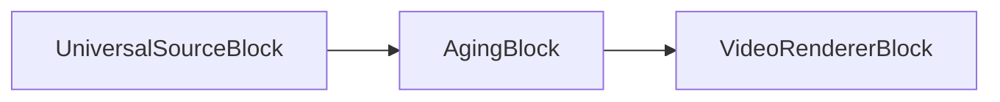

### Exemple de code

```csharp
var pipeline = new MediaBlocksPipeline();

var filename = "test.mp4";
var fileSource = new UniversalSourceBlock(await UniversalSourceSettings.CreateAsync(new Uri(filename)));

var agingSettings = new AgingVideoEffect
{
    ColorAging   = true,   // jaunissement / délavage (bool, par défaut true)
    Dusts        = true,   // particules de poussière aléatoires (bool, par défaut true)
    Pits         = true,   // petits trous / imperfections (bool, par défaut true)
    ScratchLines = 7       // nombre de rayures verticales (uint, par défaut 7)
};
var aging = new AgingBlock(agingSettings);
pipeline.Connect(fileSource.VideoOutput, aging.Input);

var videoRenderer = new VideoRendererBlock(pipeline, VideoView1);
pipeline.Connect(aging.Output, videoRenderer.Input);

await pipeline.StartAsync();
```

### Plateformes

Windows, macOS, Linux, iOS, Android.

## Alpha Combine

[Media Blocks SDK .Net](https://www.visioforge.com/media-blocks-sdk-net){ .md-button .md-button--primary target="_blank" }

Le bloc AlphaCombine combine deux flux vidéo grâce au mélange par canal alpha, permettant des opérations de composition sophistiquées avec un contrôle de la transparence.

### Informations sur le bloc

Nom : AlphaCombineBlock.

Direction du pad | Type de média | Nombre de pads
--- | :---: | :---:
Entrée (Primaire) | Vidéo non compressée | 1
Entrée (Alpha) | Vidéo non compressée | 1
Sortie | Vidéo non compressée | 1

### Exemple de pipeline

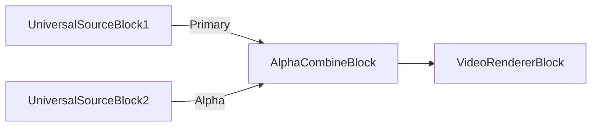

### Exemple de code

```csharp
var pipeline = new MediaBlocksPipeline();

var primarySource = new UniversalSourceBlock(await UniversalSourceSettings.CreateAsync(new Uri("video.mp4")));
var alphaSource = new UniversalSourceBlock(await UniversalSourceSettings.CreateAsync(new Uri("alpha.mp4")));

var alphaCombine = new AlphaCombineBlock();
pipeline.Connect(primarySource.VideoOutput, alphaCombine.Input);
pipeline.Connect(alphaSource.VideoOutput, alphaCombine.AlphaInput);

var videoRenderer = new VideoRendererBlock(pipeline, VideoView1);
pipeline.Connect(alphaCombine.Output, videoRenderer.Input);

await pipeline.StartAsync();
```

### Plateformes

Windows, macOS, Linux, iOS, Android.

## Auto Deinterlace

[Media Blocks SDK .Net](https://www.visioforge.com/media-blocks-sdk-net){ .md-button .md-button--primary target="_blank" }

Le bloc AutoDeinterlace détecte et désentrelace automatiquement le contenu vidéo entrelacé, en le convertissant au format progressif. Il détermine intelligemment quand le désentrelacement est nécessaire en se basant sur les propriétés du flux vidéo.

### Informations sur le bloc

Nom : AutoDeinterlaceBlock.

Direction du pad | Type de média | Nombre de pads
--- | :---: | :---:
Entrée | Vidéo non compressée | 1
Sortie | Vidéo non compressée | 1

### Exemple de pipeline

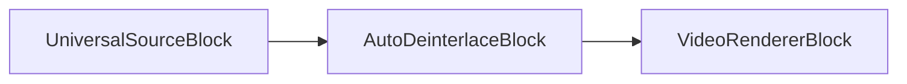

### Exemple de code

```csharp
var pipeline = new MediaBlocksPipeline();

var filename = "interlaced_video.mp4";
var fileSource = new UniversalSourceBlock(await UniversalSourceSettings.CreateAsync(new Uri(filename)));

var autoDeinterlace = new AutoDeinterlaceBlock(new AutoDeinterlaceSettings());
pipeline.Connect(fileSource.VideoOutput, autoDeinterlace.Input);

var videoRenderer = new VideoRendererBlock(pipeline, VideoView1);
pipeline.Connect(autoDeinterlace.Output, videoRenderer.Input);

await pipeline.StartAsync();
```

### Plateformes

Windows, macOS, Linux, iOS, Android.

## Bayer to RGB

[Media Blocks SDK .Net](https://www.visioforge.com/media-blocks-sdk-net){ .md-button .md-button--primary target="_blank" }

Le bloc Bayer2RGB convertit les données brutes de capteur au motif Bayer en vidéo couleur RGB. Ce traitement est indispensable pour les vidéos issues de caméras et capteurs industriels qui délivrent des données brutes au format Bayer.

### Informations sur le bloc

Nom : Bayer2RGBBlock.

Direction du pad | Type de média | Nombre de pads
--- | :---: | :---:
Entrée | Vidéo Bayer brute | 1
Sortie | Vidéo RGB non compressée | 1

### Exemple de pipeline

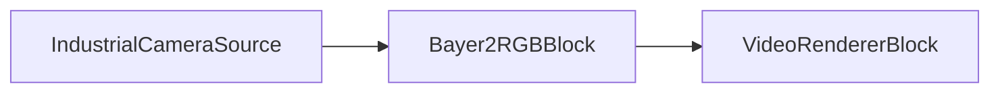

### Exemple de code

```csharp
var pipeline = new MediaBlocksPipeline();

// Suppose une source caméra qui produit un motif Bayer
var cameraSource = new SystemVideoSourceBlock(cameraSettings);

var bayer2rgb = new Bayer2RGBBlock();
pipeline.Connect(cameraSource.Output, bayer2rgb.Input);

var videoRenderer = new VideoRendererBlock(pipeline, VideoView1);
pipeline.Connect(bayer2rgb.Output, videoRenderer.Input);

await pipeline.StartAsync();
```

### Plateformes

Windows, macOS, Linux.

## Chroma Key

[Media Blocks SDK .Net](https://www.visioforge.com/media-blocks-sdk-net){ .md-button .md-button--primary target="_blank" }

Le bloc ChromaKey fournit des fonctions professionnelles de composition par fond vert et d'incrustation par chrominance, en supprimant des couleurs spécifiques du contenu vidéo et en combinant les sujets de premier plan sur différents arrière-plans. Il intègre une sélection de couleurs avancée, un raffinement des bords, la suppression des débordements de teinte et la génération d'un canal alpha.

### Informations sur le bloc

Nom : ChromaKeyBlock.

Direction du pad | Type de média | Nombre de pads
--- | :---: | :---:
Entrée (Arrière-plan) | Vidéo non compressée | 1
Entrée (Chroma) | Vidéo non compressée | 1
Sortie | Vidéo non compressée | 1

### Exemple de pipeline

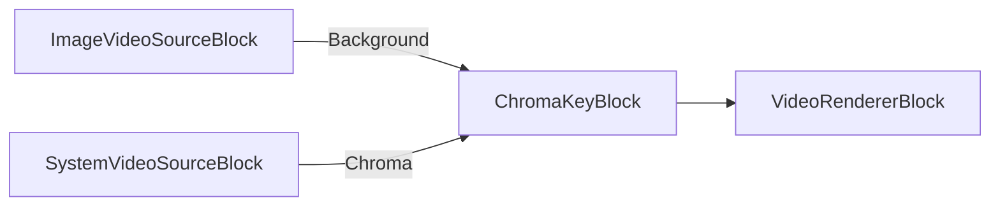

### Exemple de code

```csharp
var pipeline = new MediaBlocksPipeline();

// Créer la source d'arrière-plan (image ou vidéo)
var backgroundSettings = new ImageVideoSourceSettings("background.jpg")
{
    FrameRate = new VideoFrameRate(30.0)
};
var backgroundSource = new ImageVideoSourceBlock(backgroundSettings);

// Créer la source de premier plan avec fond vert
var device = (await DeviceEnumerator.Shared.VideoSourcesAsync())[0];
var videoFormat = device.VideoFormats[0];
var videoSettings = new VideoCaptureDeviceSourceSettings(device)
{
    Format = videoFormat.ToFormat()
};
var videoSource = new SystemVideoSourceBlock(videoSettings);

// Créer le bloc d'incrustation chroma key
var chromaKeySettings = new ChromaKeySettingsX(new Size(1920, 1080))
{
    ChromaColor = ChromaKeyColor.Green,
    Sensitivity = 0.5,
    NoiseLevel = 0.1,
    Alpha = 1.0
};
var chromaKey = new ChromaKeyBlock(chromaKeySettings);

// Connecter le pipeline
pipeline.Connect(backgroundSource.Output, chromaKey.BackgroundInput);
pipeline.Connect(videoSource.Output, chromaKey.ChromaInput);

var videoRenderer = new VideoRendererBlock(pipeline, VideoView1);
pipeline.Connect(chromaKey.Output, videoRenderer.Input);

await pipeline.StartAsync();
```

### Exemples d'applications

- [ChromaKey Demo (WPF)](https://github.com/visioforge/.Net-SDK-s-samples/tree/master/Media%20Blocks%20SDK/WPF/CSharp/ChromaKey)

### Plateformes

Windows, macOS, Linux, iOS, Android.

## Codec Alpha Demux

[Media Blocks SDK .Net](https://www.visioforge.com/media-blocks-sdk-net){ .md-button .md-button--primary target="_blank" }

Le bloc CodecAlphaDemux sépare le canal alpha des codecs vidéo qui prennent en charge un canal alpha intégré (comme VP8, VP9 ou ProRes avec alpha).

### Informations sur le bloc

Nom : CodecAlphaDemuxBlock.

Direction du pad | Type de média | Nombre de pads
--- | :---: | :---:
Entrée | Vidéo compressée avec alpha | 1
Sortie (Vidéo) | Vidéo non compressée | 1
Sortie (Alpha) | Canal alpha | 1

### Exemple de pipeline

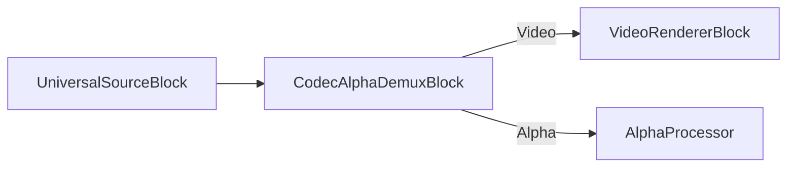

### Exemple de code

```csharp
var pipeline = new MediaBlocksPipeline();

var filename = "video_with_alpha.webm"; // VP8/VP9 avec alpha
var fileSource = new UniversalSourceBlock(await UniversalSourceSettings.CreateAsync(new Uri(filename)));

var alphaDemux = new CodecAlphaDemuxBlock();
pipeline.Connect(fileSource.VideoOutput, alphaDemux.Input);

var videoRenderer = new VideoRendererBlock(pipeline, VideoView1);
pipeline.Connect(alphaDemux.VideoOutput, videoRenderer.Input);

await pipeline.StartAsync();
```

### Plateformes

Windows, macOS, Linux, iOS, Android.

## Color effects

[Media Blocks SDK .Net](https://www.visioforge.com/media-blocks-sdk-net){ .md-button .md-button--primary target="_blank" }

Ce bloc effectue un traitement colorimétrique de base sur les images vidéo : effet caméra thermique factice, virage sépia, inversion avec légère teinte bleue, traitement croisé (cross processing) et filtre couleur premier plan jaune / arrière-plan bleu.

### Informations sur le bloc

Nom : ColorEffectsBlock.

Direction du pad | Type de média | Nombre de pads
--- | :---: | :---:
Entrée | Vidéo non compressée | 1
Sortie | Vidéo non compressée | 1

### Exemple de pipeline

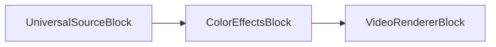

### Exemple de code

```csharp
var pipeline = new MediaBlocksPipeline();

var filename = "test.mp4";
var fileSource = new UniversalSourceBlock(await UniversalSourceSettings.CreateAsync(new Uri(filename)));

// Sépia
var colorEffects = new ColorEffectsBlock(ColorEffectsPreset.Sepia);
pipeline.Connect(fileSource.VideoOutput, colorEffects.Input);

var videoRenderer = new VideoRendererBlock(pipeline, VideoView1);
pipeline.Connect(colorEffects.Output, videoRenderer.Input);            

await pipeline.StartAsync();
```

### Plateformes

Windows, macOS, Linux, iOS, Android.

## Dice

[Media Blocks SDK .Net](https://www.visioforge.com/media-blocks-sdk-net){ .md-button .md-button--primary target="_blank" }

Le bloc Dice divise l'image vidéo en une grille de tuiles et applique diverses transformations pour créer un effet visuel fragmenté, façon mosaïque.

### Informations sur le bloc

Nom : DiceBlock.

Direction du pad | Type de média | Nombre de pads
--- | :---: | :---:
Entrée | Vidéo non compressée | 1
Sortie | Vidéo non compressée | 1

### Exemple de pipeline

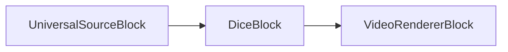

### Exemple de code

```csharp
var pipeline = new MediaBlocksPipeline();

var filename = "test.mp4";
var fileSource = new UniversalSourceBlock(await UniversalSourceSettings.CreateAsync(new Uri(filename)));

var dice = new DiceBlock(new DiceVideoEffect());
pipeline.Connect(fileSource.VideoOutput, dice.Input);

var videoRenderer = new VideoRendererBlock(pipeline, VideoView1);
pipeline.Connect(dice.Output, videoRenderer.Input);

await pipeline.StartAsync();
```

### Plateformes

Windows, macOS, Linux, iOS, Android.

## Edge

[Media Blocks SDK .Net](https://www.visioforge.com/media-blocks-sdk-net){ .md-button .md-button--primary target="_blank" }

Le bloc Edge détecte et met en évidence les contours dans les images vidéo, créant un effet visuel de détection de contours utile à des fins artistiques ou pour le prétraitement en vision par ordinateur.

### Informations sur le bloc

Nom : EdgeBlock.

Direction du pad | Type de média | Nombre de pads
--- | :---: | :---:
Entrée | Vidéo non compressée | 1
Sortie | Vidéo non compressée | 1

### Exemple de pipeline

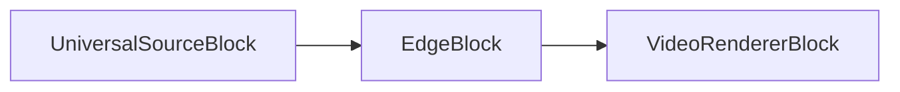

### Exemple de code

```csharp
var pipeline = new MediaBlocksPipeline();

var filename = "test.mp4";
var fileSource = new UniversalSourceBlock(await UniversalSourceSettings.CreateAsync(new Uri(filename)));

var edge = new EdgeBlock();
pipeline.Connect(fileSource.VideoOutput, edge.Input);

var videoRenderer = new VideoRendererBlock(pipeline, VideoView1);
pipeline.Connect(edge.Output, videoRenderer.Input);

await pipeline.StartAsync();
```

### Plateformes

Windows, macOS, Linux, iOS, Android.

## Deinterlace

[Media Blocks SDK .Net](https://www.visioforge.com/media-blocks-sdk-net){ .md-button .md-button--primary target="_blank" }

Ce bloc désentrelace les images vidéo entrelacées pour produire des images progressives. Plusieurs méthodes de traitement sont disponibles.
Utilisez la classe `DeinterlaceSettings` pour configurer le bloc.

### Informations sur le bloc

Nom : DeinterlaceBlock.

Direction du pad | Type de média | Nombre de pads
--- | :---: | :---:
Entrée | Vidéo non compressée | 1
Sortie | Vidéo non compressée | 1

### Exemple de pipeline

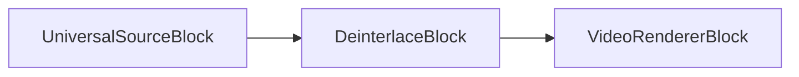

### Exemple de code

```csharp
var pipeline = new MediaBlocksPipeline();

var filename = "test.mp4";
var fileSource = new UniversalSourceBlock(await UniversalSourceSettings.CreateAsync(new Uri(filename)));

var deinterlace = new DeinterlaceBlock(new DeinterlaceSettings());
pipeline.Connect(fileSource.VideoOutput, deinterlace.Input);

var videoRenderer = new VideoRendererBlock(pipeline, VideoView1);
pipeline.Connect(deinterlace.Output, videoRenderer.Input);            

await pipeline.StartAsync();
```

### Plateformes

Windows, macOS, Linux, iOS, Android.

## Fish eye

[Media Blocks SDK .Net](https://www.visioforge.com/media-blocks-sdk-net){ .md-button .md-button--primary target="_blank" }

Le bloc fisheye simule un objectif fisheye en zoomant sur le centre de l'image et en compressant les bords.

### Informations sur le bloc

Nom : FishEyeBlock.

Direction du pad | Type de média | Nombre de pads
--- | :---: | :---:
Entrée | Vidéo non compressée | 1
Sortie | Vidéo non compressée | 1

### Exemple de pipeline

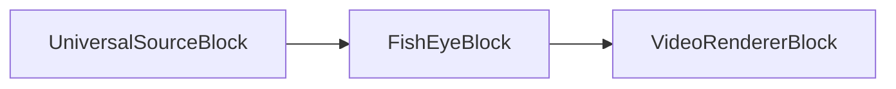

### Exemple de code

```csharp
var pipeline = new MediaBlocksPipeline();

var filename = "test.mp4";
var fileSource = new UniversalSourceBlock(await UniversalSourceSettings.CreateAsync(new Uri(filename)));

var fishEye = new FishEyeBlock();
pipeline.Connect(fileSource.VideoOutput, fishEye.Input);

var videoRenderer = new VideoRendererBlock(pipeline, VideoView1);
pipeline.Connect(fishEye.Output, videoRenderer.Input);            

await pipeline.StartAsync();
```

### Plateformes

Windows, macOS, Linux, iOS, Android.

## Flip/Rotate

[Media Blocks SDK .Net](https://www.visioforge.com/media-blocks-sdk-net){ .md-button .md-button--primary target="_blank" }

Ce bloc retourne et fait pivoter le flux vidéo.
Utilisez l'énumération `VideoFlipRotateMethod` pour le configurer.

### Informations sur le bloc

Nom : FlipRotateBlock.

Direction du pad | Type de média | Nombre de pads
--- | :---: | :---:
Entrée | Vidéo non compressée | 1
Sortie | Vidéo non compressée | 1

### Exemple de pipeline

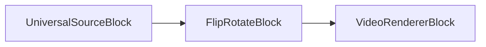

### Exemple de code

```csharp
var pipeline = new MediaBlocksPipeline();

var filename = "test.mp4";
var fileSource = new UniversalSourceBlock(await UniversalSourceSettings.CreateAsync(new Uri(filename)));

// Rotation de 90 degrés
var flipRotate = new FlipRotateBlock(VideoFlipRotateMethod.Method90R);
pipeline.Connect(fileSource.VideoOutput, flipRotate.Input);

var videoRenderer = new VideoRendererBlock(pipeline, VideoView1);
pipeline.Connect(flipRotate.Output, videoRenderer.Input);            

await pipeline.StartAsync();
```

### Plateformes

Windows, macOS, Linux, iOS, Android.

## Gamma

[Media Blocks SDK .Net](https://www.visioforge.com/media-blocks-sdk-net){ .md-button .md-button--primary target="_blank" }

Ce bloc effectue la correction gamma sur un flux vidéo.

### Informations sur le bloc

Nom : GammaBlock.

Direction du pad | Type de média | Nombre de pads
--- | :---: | :---:
Entrée | Vidéo non compressée | 1
Sortie | Vidéo non compressée | 1

### Exemple de pipeline

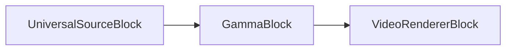

### Exemple de code

```csharp
var pipeline = new MediaBlocksPipeline();

var filename = "test.mp4";
var fileSource = new UniversalSourceBlock(await UniversalSourceSettings.CreateAsync(new Uri(filename)));

var gamma = new GammaBlock(2.0);
pipeline.Connect(fileSource.VideoOutput, gamma.Input);

var videoRenderer = new VideoRendererBlock(pipeline, VideoView1);
pipeline.Connect(gamma.Output, videoRenderer.Input);            

await pipeline.StartAsync();
```

### Plateformes

Windows, macOS, Linux, iOS, Android.

## Gaussian blur

[Media Blocks SDK .Net](https://www.visioforge.com/media-blocks-sdk-net){ .md-button .md-button--primary target="_blank" }

Ce bloc applique un flou au flux vidéo en utilisant la fonction gaussienne.

### Informations sur le bloc

Nom : GaussianBlurBlock.

Direction du pad | Type de média | Nombre de pads
--- | :---: | :---:
Entrée | Vidéo non compressée | 1
Sortie | Vidéo non compressée | 1

### Exemple de pipeline

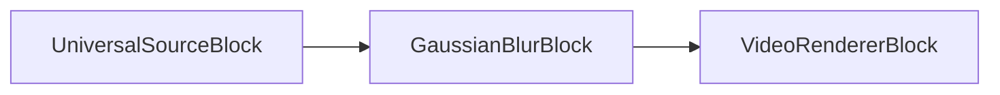

### Exemple de code

```csharp
var pipeline = new MediaBlocksPipeline();

var filename = "test.mp4";
var fileSource = new UniversalSourceBlock(await UniversalSourceSettings.CreateAsync(new Uri(filename)));

var gaussianBlur = new GaussianBlurBlock();
pipeline.Connect(fileSource.VideoOutput, gaussianBlur.Input);

var videoRenderer = new VideoRendererBlock(pipeline, VideoView1);
pipeline.Connect(gaussianBlur.Output, videoRenderer.Input);            

await pipeline.StartAsync();
```

### Plateformes

Windows, macOS, Linux, iOS, Android.

## Grayscale

[Media Blocks SDK .Net](https://www.visioforge.com/media-blocks-sdk-net){ .md-button .md-button--primary target="_blank" }

Le bloc Grayscale convertit la vidéo couleur en niveaux de gris (noir et blanc), en supprimant toute information de couleur tout en préservant la luminance.

### Informations sur le bloc

Nom : GrayscaleBlock.

Direction du pad | Type de média | Nombre de pads
--- | :---: | :---:
Entrée | Vidéo non compressée | 1
Sortie | Vidéo non compressée | 1

### Exemple de pipeline

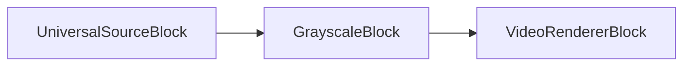

### Exemple de code

```csharp
var pipeline = new MediaBlocksPipeline();

var filename = "test.mp4";
var fileSource = new UniversalSourceBlock(await UniversalSourceSettings.CreateAsync(new Uri(filename)));

var grayscale = new GrayscaleBlock();
pipeline.Connect(fileSource.VideoOutput, grayscale.Input);

var videoRenderer = new VideoRendererBlock(pipeline, VideoView1);
pipeline.Connect(grayscale.Output, videoRenderer.Input);

await pipeline.StartAsync();
```

### Plateformes

Windows, macOS, Linux, iOS, Android.

## Image overlay

[Media Blocks SDK .Net](https://www.visioforge.com/media-blocks-sdk-net){ .md-button .md-button--primary target="_blank" }

Ce bloc superpose une image chargée depuis un fichier sur un flux vidéo.

Vous pouvez définir la position de l'image ainsi qu'une valeur alpha optionnelle. Les images 32 bits avec canal alpha sont prises en charge.

### Informations sur le bloc

Nom : ImageOverlayBlock.

Direction du pad | Type de média | Nombre de pads
--- | :---: | :---:
Entrée | Vidéo non compressée | 1
Sortie | Vidéo non compressée | 1

### Exemple de pipeline

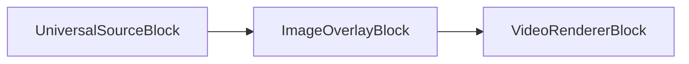

### Exemple de code

```csharp
var pipeline = new MediaBlocksPipeline();

var filename = "test.mp4";
var fileSource = new UniversalSourceBlock(await UniversalSourceSettings.CreateAsync(new Uri(filename)));

var imageOverlay = new ImageOverlayBlock(@"logo.png");
pipeline.Connect(fileSource.VideoOutput, imageOverlay.Input);

var videoRenderer = new VideoRendererBlock(pipeline, VideoView1);
pipeline.Connect(imageOverlay.Output, videoRenderer.Input);            

await pipeline.StartAsync();
```

### Plateformes

Windows, macOS, Linux, iOS, Android.

## Image Overlay Cairo

[Media Blocks SDK .Net](https://www.visioforge.com/media-blocks-sdk-net){ .md-button .md-button--primary target="_blank" }

Le bloc ImageOverlayCairo offre des fonctionnalités avancées de superposition d'image en s'appuyant sur la bibliothèque graphique Cairo, avec une qualité de rendu améliorée et des fonctionnalités supplémentaires par rapport au bloc de superposition d'image standard.

### Informations sur le bloc

Nom : ImageOverlayCairoBlock.

Direction du pad | Type de média | Nombre de pads
--- | :---: | :---:
Entrée | Vidéo non compressée | 1
Sortie | Vidéo non compressée | 1

### Exemple de pipeline

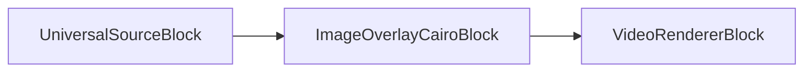

### Exemple de code

```csharp
var pipeline = new MediaBlocksPipeline();

var filename = "test.mp4";
var fileSource = new UniversalSourceBlock(await UniversalSourceSettings.CreateAsync(new Uri(filename)));

var imageOverlayCairo = new ImageOverlayCairoBlock("logo.png");
pipeline.Connect(fileSource.VideoOutput, imageOverlayCairo.Input);

var videoRenderer = new VideoRendererBlock(pipeline, VideoView1);
pipeline.Connect(imageOverlayCairo.Output, videoRenderer.Input);

await pipeline.StartAsync();
```

### Plateformes

Windows, macOS, Linux, iOS, Android.

## Interlace

[Media Blocks SDK .Net](https://www.visioforge.com/media-blocks-sdk-net){ .md-button .md-button--primary target="_blank" }

Le bloc Interlace convertit la vidéo progressive au format entrelacé, en créant des lignes de trames alternées. Utile pour la diffusion ou la compatibilité avec les systèmes d'affichage entrelacés.

### Informations sur le bloc

Nom : InterlaceBlock.

Direction du pad | Type de média | Nombre de pads
--- | :---: | :---:
Entrée | Vidéo non compressée | 1
Sortie | Vidéo non compressée | 1

### Exemple de pipeline

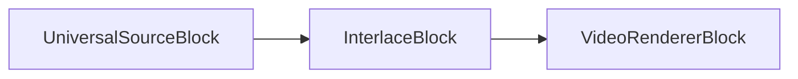

### Exemple de code

```csharp
var pipeline = new MediaBlocksPipeline();

var filename = "test.mp4";
var fileSource = new UniversalSourceBlock(await UniversalSourceSettings.CreateAsync(new Uri(filename)));

var interlace = new InterlaceBlock(new InterlaceSettings());
pipeline.Connect(fileSource.VideoOutput, interlace.Input);

var videoRenderer = new VideoRendererBlock(pipeline, VideoView1);
pipeline.Connect(interlace.Output, videoRenderer.Input);

await pipeline.StartAsync();
```

### Plateformes

Windows, macOS, Linux, iOS, Android.

## Key Frame Detector

[Media Blocks SDK .Net](https://www.visioforge.com/media-blocks-sdk-net){ .md-button .md-button--primary target="_blank" }

Le bloc KeyFrameDetector analyse les flux vidéo pour détecter et identifier les images-clés (I-frames) de la séquence vidéo, utile pour les applications d'édition et d'analyse vidéo.

### Informations sur le bloc

Nom : KeyFrameDetectorBlock.

Direction du pad | Type de média | Nombre de pads
--- | :---: | :---:
Entrée | Vidéo non compressée | 1
Sortie | Vidéo non compressée | 1

### Exemple de pipeline

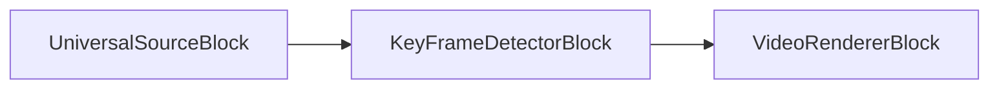

### Exemple de code

```csharp
var pipeline = new MediaBlocksPipeline();

var filename = "test.mp4";
var fileSource = new UniversalSourceBlock(await UniversalSourceSettings.CreateAsync(new Uri(filename)));

var keyFrameDetector = new KeyFrameDetectorBlock();
keyFrameDetector.OnKeyFrameDetected += (sender, e) =>
{
    // OnKeyFrameDetected est un EventHandler<TimeSpan> ; `e` est lui-même l'horodatage.
    Console.WriteLine($"Image-clé détectée à l'horodatage : {e}");
};
pipeline.Connect(fileSource.VideoOutput, keyFrameDetector.Input);

var videoRenderer = new VideoRendererBlock(pipeline, VideoView1);
pipeline.Connect(keyFrameDetector.Output, videoRenderer.Input);

await pipeline.StartAsync();
```

### Plateformes

Windows, macOS, Linux, iOS, Android.

## LUT Processor

[Media Blocks SDK .Net](https://www.visioforge.com/media-blocks-sdk-net){ .md-button .md-button--primary target="_blank" }

Le bloc LUT Processor (Look-Up Table) applique l'étalonnage et la correction colorimétriques au moyen de fichiers LUT 3D, permettant des transformations de couleurs professionnelles et des rendus cinématographiques.

### Informations sur le bloc

Nom : LUTProcessorBlock.

Direction du pad | Type de média | Nombre de pads
--- | :---: | :---:
Entrée | Vidéo non compressée | 1
Sortie | Vidéo non compressée | 1

### Exemple de pipeline

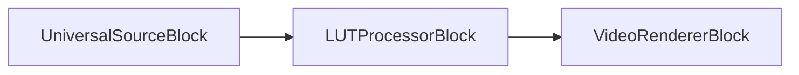

### Exemple de code

```csharp
var pipeline = new MediaBlocksPipeline();

var filename = "test.mp4";
var fileSource = new UniversalSourceBlock(await UniversalSourceSettings.CreateAsync(new Uri(filename)));

var lutSettings = new LUTVideoEffect
{
    Filename = "cinematic_lut.cube"   // chemin du fichier LUT au format .cube
};
var lutProcessor = new LUTProcessorBlock(lutSettings);
pipeline.Connect(fileSource.VideoOutput, lutProcessor.Input);

var videoRenderer = new VideoRendererBlock(pipeline, VideoView1);
pipeline.Connect(lutProcessor.Output, videoRenderer.Input);

await pipeline.StartAsync();
```

### Plateformes

Windows, macOS, Linux, iOS, Android.

## Mirror

[Media Blocks SDK .Net](https://www.visioforge.com/media-blocks-sdk-net){ .md-button .md-button--primary target="_blank" }

Le bloc miroir divise l'image en deux moitiés et réfléchit l'une par-dessus l'autre.

### Informations sur le bloc

Nom : MirrorBlock.

Direction du pad | Type de média | Nombre de pads
--- | :---: | :---:
Entrée | Vidéo non compressée | 1
Sortie | Vidéo non compressée | 1

### Exemple de pipeline

```mermaid
graph LR;
    UniversalSourceBlock-->MirrorBlock;
    MirrorBlock-->VideoRendererBlock;
```

### Exemple de code

```csharp
var pipeline = new MediaBlocksPipeline();

var filename = "test.mp4";
var fileSource = new UniversalSourceBlock(await UniversalSourceSettings.CreateAsync(new Uri(filename)));

var mirrorBlock = new MirrorBlock(MirrorMode.Top);
pipeline.Connect(fileSource.VideoOutput, mirrorBlock.Input);

var videoRenderer = new VideoRendererBlock(pipeline, VideoView1);
pipeline.Connect(mirrorBlock.Output, videoRenderer.Input);            

await pipeline.StartAsync();
```

### Plateformes

Windows, macOS, Linux, iOS, Android.

## Moving Blur

[Media Blocks SDK .Net](https://www.visioforge.com/media-blocks-sdk-net){ .md-button .md-button--primary target="_blank" }

Le bloc MovingBlur crée des effets de flou de mouvement dynamiques en mélangeant les images courantes avec les précédentes, simulant un flou de bougé caméra ou créant des effets de traînée artistiques.

### Informations sur le bloc

Nom : MovingBlurBlock.

Direction du pad | Type de média | Nombre de pads
--- | :---: | :---:
Entrée | Vidéo non compressée | 1
Sortie | Vidéo non compressée | 1

### Exemple de pipeline

```mermaid
graph LR;
    UniversalSourceBlock-->MovingBlurBlock;
    MovingBlurBlock-->VideoRendererBlock;
```

### Exemple de code

```csharp
var pipeline = new MediaBlocksPipeline();

var filename = "test.mp4";
var fileSource = new UniversalSourceBlock(await UniversalSourceSettings.CreateAsync(new Uri(filename)));

var movingBlur = new MovingBlurBlock(new MovingBlurVideoEffect());
pipeline.Connect(fileSource.VideoOutput, movingBlur.Input);

var videoRenderer = new VideoRendererBlock(pipeline, VideoView1);
pipeline.Connect(movingBlur.Output, videoRenderer.Input);

await pipeline.StartAsync();
```

### Plateformes

Windows, macOS, Linux, iOS, Android.

## Moving Echo

[Media Blocks SDK .Net](https://www.visioforge.com/media-blocks-sdk-net){ .md-button .md-button--primary target="_blank" }

Le bloc MovingEcho crée des effets visuels d'écho en superposant des versions retardées des images vidéo, produisant un effet de fantôme ou de traînée.

### Informations sur le bloc

Nom : MovingEchoBlock.

Direction du pad | Type de média | Nombre de pads
--- | :---: | :---:
Entrée | Vidéo non compressée | 1
Sortie | Vidéo non compressée | 1

### Exemple de pipeline

```mermaid
graph LR;
    UniversalSourceBlock-->MovingEchoBlock;
    MovingEchoBlock-->VideoRendererBlock;
```

### Exemple de code

```csharp
var pipeline = new MediaBlocksPipeline();

var filename = "test.mp4";
var fileSource = new UniversalSourceBlock(await UniversalSourceSettings.CreateAsync(new Uri(filename)));

var movingEcho = new MovingEchoBlock(new MovingEchoVideoEffect());
pipeline.Connect(fileSource.VideoOutput, movingEcho.Input);

var videoRenderer = new VideoRendererBlock(pipeline, VideoView1);
pipeline.Connect(movingEcho.Output, videoRenderer.Input);

await pipeline.StartAsync();
```

### Plateformes

Windows, macOS, Linux, iOS, Android.

## Moving Zoom Echo

[Media Blocks SDK .Net](https://www.visioforge.com/media-blocks-sdk-net){ .md-button .md-button--primary target="_blank" }

Le bloc MovingZoomEcho combine des effets d'écho de mouvement avec des transformations de zoom, créant des effets visuels dynamiques qui simulent des traînées de zoom.

### Informations sur le bloc

Nom : MovingZoomEchoBlock.

Direction du pad | Type de média | Nombre de pads
--- | :---: | :---:
Entrée | Vidéo non compressée | 1
Sortie | Vidéo non compressée | 1

### Exemple de pipeline

```mermaid
graph LR;
    UniversalSourceBlock-->MovingZoomEchoBlock;
    MovingZoomEchoBlock-->VideoRendererBlock;
```

### Exemple de code

```csharp
var pipeline = new MediaBlocksPipeline();

var filename = "test.mp4";
var fileSource = new UniversalSourceBlock(await UniversalSourceSettings.CreateAsync(new Uri(filename)));

var movingZoomEcho = new MovingZoomEchoBlock(new MovingZoomEchoVideoEffect());
pipeline.Connect(fileSource.VideoOutput, movingZoomEcho.Input);

var videoRenderer = new VideoRendererBlock(pipeline, VideoView1);
pipeline.Connect(movingZoomEcho.Output, videoRenderer.Input);

await pipeline.StartAsync();
```

### Plateformes

Windows, macOS, Linux, iOS, Android.

## Optical Animation BW

[Media Blocks SDK .Net](https://www.visioforge.com/media-blocks-sdk-net){ .md-button .md-button--primary target="_blank" }

Le bloc OpticalAnimationBW applique des effets d'animation optique en noir et blanc, créant des transformations visuelles de style film vintage.

### Informations sur le bloc

Nom : OpticalAnimationBWBlock.

Direction du pad | Type de média | Nombre de pads
--- | :---: | :---:
Entrée | Vidéo non compressée | 1
Sortie | Vidéo non compressée | 1

### Exemple de pipeline

```mermaid
graph LR;
    UniversalSourceBlock-->OpticalAnimationBWBlock;
    OpticalAnimationBWBlock-->VideoRendererBlock;
```

### Exemple de code

```csharp
var pipeline = new MediaBlocksPipeline();

var filename = "test.mp4";
var fileSource = new UniversalSourceBlock(await UniversalSourceSettings.CreateAsync(new Uri(filename)));

var opticalAnimBW = new OpticalAnimationBWBlock(new OpticalAnimationBWVideoEffect());
pipeline.Connect(fileSource.VideoOutput, opticalAnimBW.Input);

var videoRenderer = new VideoRendererBlock(pipeline, VideoView1);
pipeline.Connect(opticalAnimBW.Output, videoRenderer.Input);

await pipeline.StartAsync();
```

### Plateformes

Windows, macOS, Linux, iOS, Android.

## Overlay Manager

[Media Blocks SDK .Net](https://www.visioforge.com/media-blocks-sdk-net){ .md-button .md-button--primary target="_blank" }

Le bloc OverlayManager fournit un système complet pour gérer plusieurs superpositions (texte, images, formes) sur la vidéo, avec prise en charge des mises à jour dynamiques et des animations.

### Informations sur le bloc

Nom : OverlayManagerBlock.

Direction du pad | Type de média | Nombre de pads
--- | :---: | :---:
Entrée | Vidéo non compressée | 1
Sortie | Vidéo non compressée | 1

### Exemple de pipeline

```mermaid
graph LR;
    UniversalSourceBlock-->OverlayManagerBlock;
    OverlayManagerBlock-->VideoRendererBlock;
```

### Exemple de code

```csharp
var pipeline = new MediaBlocksPipeline();

var filename = "test.mp4";
var fileSource = new UniversalSourceBlock(await UniversalSourceSettings.CreateAsync(new Uri(filename)));

var overlayManager = new OverlayManagerBlock();
pipeline.Connect(fileSource.VideoOutput, overlayManager.Input);

var videoRenderer = new VideoRendererBlock(pipeline, VideoView1);
pipeline.Connect(overlayManager.Output, videoRenderer.Input);

await pipeline.StartAsync();

// Ajoutez des superpositions en construisant le type d'élément et en appelant Video_Overlay_Add.
var textOverlay = new OverlayManagerText("Hello World", x: 100, y: 100);
overlayManager.Video_Overlay_Add(textOverlay);

using (var logo = new System.Drawing.Bitmap("logo.png"))
{
    var imageOverlay = new OverlayManagerImage(logo, x: 10, y: 10);
    overlayManager.Video_Overlay_Add(imageOverlay);
}
```

### Exemples d'applications

- [Page de documentation OverlayManagerBlock](OverlayManagerBlock.md)

### Plateformes

Windows, macOS, Linux, iOS, Android.

## Perspective

[Media Blocks SDK .Net](https://www.visioforge.com/media-blocks-sdk-net){ .md-button .md-button--primary target="_blank" }

Le bloc perspective applique une transformation de perspective 2D.

### Informations sur le bloc

Nom : PerspectiveBlock.

Direction du pad | Type de média | Nombre de pads
--- | :---: | :---:
Entrée | Vidéo non compressée | 1
Sortie | Vidéo non compressée | 1

### Exemple de pipeline

```mermaid
graph LR;
    UniversalSourceBlock-->PerspectiveBlock;
    PerspectiveBlock-->VideoRendererBlock;
```

### Exemple de code

```csharp
var pipeline = new MediaBlocksPipeline();

var filename = "test.mp4";
var fileSource = new UniversalSourceBlock(await UniversalSourceSettings.CreateAsync(new Uri(filename)));

var persBlock = new PerspectiveBlock(new int[] { 1, 2, 3, 4, 5, 6, 7, 8, 9 });
pipeline.Connect(fileSource.VideoOutput, persBlock.Input);

var videoRenderer = new VideoRendererBlock(pipeline, VideoView1);
pipeline.Connect(persBlock.Output, videoRenderer.Input);            

await pipeline.StartAsync();
```

### Plateformes

Windows, macOS, Linux, iOS, Android.

## Pinch

[Media Blocks SDK .Net](https://www.visioforge.com/media-blocks-sdk-net){ .md-button .md-button--primary target="_blank" }

Ce bloc applique la transformation géométrique de pincement (pinch) à l'image.

### Informations sur le bloc

Nom : PinchBlock.

Direction du pad | Type de média | Nombre de pads
--- | :---: | :---:
Entrée | Vidéo non compressée | 1
Sortie | Vidéo non compressée | 1

### Exemple de pipeline

```mermaid
graph LR;
    UniversalSourceBlock-->PinchBlock;
    PinchBlock-->VideoRendererBlock;
```

### Exemple de code

```csharp
var pipeline = new MediaBlocksPipeline();

var filename = "test.mp4";
var fileSource = new UniversalSourceBlock(await UniversalSourceSettings.CreateAsync(new Uri(filename)));

var pinchBlock = new PinchBlock();
pipeline.Connect(fileSource.VideoOutput, pinchBlock.Input);

var videoRenderer = new VideoRendererBlock(pipeline, VideoView1);
pipeline.Connect(pinchBlock.Output, videoRenderer.Input);            

await pipeline.StartAsync();
```

### Plateformes

Windows, macOS, Linux, iOS, Android.

## Pseudo 3D

[Media Blocks SDK .Net](https://www.visioforge.com/media-blocks-sdk-net){ .md-button .md-button--primary target="_blank" }

Le bloc Pseudo3D applique des transformations de perspective de type 3D pour créer des illusions de profondeur dans la vidéo 2D.

### Informations sur le bloc

Nom : Pseudo3DBlock.

Direction du pad | Type de média | Nombre de pads
--- | :---: | :---:
Entrée | Vidéo non compressée | 1
Sortie | Vidéo non compressée | 1

### Exemple de pipeline

```mermaid
graph LR;
    UniversalSourceBlock-->Pseudo3DBlock;
    Pseudo3DBlock-->VideoRendererBlock;
```

### Exemple de code

```csharp
var pipeline = new MediaBlocksPipeline();

var filename = "test.mp4";
var fileSource = new UniversalSourceBlock(await UniversalSourceSettings.CreateAsync(new Uri(filename)));

var pseudo3D = new Pseudo3DBlock(new Pseudo3DVideoEffect());
pipeline.Connect(fileSource.VideoOutput, pseudo3D.Input);

var videoRenderer = new VideoRendererBlock(pipeline, VideoView1);
pipeline.Connect(pseudo3D.Output, videoRenderer.Input);

await pipeline.StartAsync();
```

### Plateformes

Windows, macOS, Linux, iOS, Android.

## QR Code Overlay

[Media Blocks SDK .Net](https://www.visioforge.com/media-blocks-sdk-net){ .md-button .md-button--primary target="_blank" }

Le bloc QRCodeOverlay génère et superpose des QR codes sur le contenu vidéo, utile pour intégrer des URLs, des métadonnées ou des informations de suivi.

### Informations sur le bloc

Nom : QRCodeOverlayBlock.

Direction du pad | Type de média | Nombre de pads
--- | :---: | :---:
Entrée | Vidéo non compressée | 1
Sortie | Vidéo non compressée | 1

### Exemple de pipeline

```mermaid
graph LR;
    UniversalSourceBlock-->QRCodeOverlayBlock;
    QRCodeOverlayBlock-->VideoRendererBlock;
```

### Exemple de code

```csharp
var pipeline = new MediaBlocksPipeline();

var filename = "test.mp4";
var fileSource = new UniversalSourceBlock(await UniversalSourceSettings.CreateAsync(new Uri(filename)));

var qrCodeOverlay = new QRCodeOverlayBlock("https://www.visioforge.com");
pipeline.Connect(fileSource.VideoOutput, qrCodeOverlay.Input);

var videoRenderer = new VideoRendererBlock(pipeline, VideoView1);
pipeline.Connect(qrCodeOverlay.Output, videoRenderer.Input);

await pipeline.StartAsync();
```

### Plateformes

Windows, macOS, Linux, iOS, Android.

## Quark

[Media Blocks SDK .Net](https://www.visioforge.com/media-blocks-sdk-net){ .md-button .md-button--primary target="_blank" }

Le bloc Quark applique un effet visuel de type particules qui fragmente l'image en éléments façon quark.

### Informations sur le bloc

Nom : QuarkBlock.

Direction du pad | Type de média | Nombre de pads
--- | :---: | :---:
Entrée | Vidéo non compressée | 1
Sortie | Vidéo non compressée | 1

### Exemple de pipeline

```mermaid
graph LR;
    UniversalSourceBlock-->QuarkBlock;
    QuarkBlock-->VideoRendererBlock;
```

### Exemple de code

```csharp
var pipeline = new MediaBlocksPipeline();

var filename = "test.mp4";
var fileSource = new UniversalSourceBlock(await UniversalSourceSettings.CreateAsync(new Uri(filename)));

var quark = new QuarkBlock(new QuarkVideoEffect());
pipeline.Connect(fileSource.VideoOutput, quark.Input);

var videoRenderer = new VideoRendererBlock(pipeline, VideoView1);
pipeline.Connect(quark.Output, videoRenderer.Input);

await pipeline.StartAsync();
```

### Plateformes

Windows, macOS, Linux, iOS, Android.

## Ripple

[Media Blocks SDK .Net](https://www.visioforge.com/media-blocks-sdk-net){ .md-button .md-button--primary target="_blank" }

Le bloc Ripple crée des effets de distorsion façon ondulations à la surface de l'eau sur l'image vidéo.

### Informations sur le bloc

Nom : RippleBlock.

Direction du pad | Type de média | Nombre de pads
--- | :---: | :---:
Entrée | Vidéo non compressée | 1
Sortie | Vidéo non compressée | 1

### Exemple de pipeline

```mermaid
graph LR;
    UniversalSourceBlock-->RippleBlock;
    RippleBlock-->VideoRendererBlock;
```

### Exemple de code

```csharp
var pipeline = new MediaBlocksPipeline();

var filename = "test.mp4";
var fileSource = new UniversalSourceBlock(await UniversalSourceSettings.CreateAsync(new Uri(filename)));

var ripple = new RippleBlock(new RippleVideoEffect());
pipeline.Connect(fileSource.VideoOutput, ripple.Input);

var videoRenderer = new VideoRendererBlock(pipeline, VideoView1);
pipeline.Connect(ripple.Output, videoRenderer.Input);

await pipeline.StartAsync();
```

### Plateformes

Windows, macOS, Linux, iOS, Android.

## Rotate

[Media Blocks SDK .Net](https://www.visioforge.com/media-blocks-sdk-net){ .md-button .md-button--primary target="_blank" }

Ce bloc fait pivoter l'image selon un angle spécifié.

### Informations sur le bloc

Nom : RotateBlock.

Direction du pad | Type de média | Nombre de pads
--- | :---: | :---:
Entrée | Vidéo non compressée | 1
Sortie | Vidéo non compressée | 1

### Exemple de pipeline

```mermaid
graph LR;
    UniversalSourceBlock-->RotateBlock;
    RotateBlock-->VideoRendererBlock;
```

### Exemple de code

```csharp
var pipeline = new MediaBlocksPipeline();

var filename = "test.mp4";
var fileSource = new UniversalSourceBlock(await UniversalSourceSettings.CreateAsync(new Uri(filename)));

var rotateBlock = new RotateBlock(0.7);
pipeline.Connect(fileSource.VideoOutput, rotateBlock.Input);

var videoRenderer = new VideoRendererBlock(pipeline, VideoView1);
pipeline.Connect(rotateBlock.Output, videoRenderer.Input);            

await pipeline.StartAsync();
```

### Plateformes

Windows, macOS, Linux, iOS, Android.

## Rounded Corners

[Media Blocks SDK .Net](https://www.visioforge.com/media-blocks-sdk-net){ .md-button .md-button--primary target="_blank" }

Le bloc RoundedCorners applique des coins arrondis aux images vidéo, créant une apparence moderne aux bords adoucis.

### Informations sur le bloc

Nom : RoundedCornersBlock.

Direction du pad | Type de média | Nombre de pads
--- | :---: | :---:
Entrée | Vidéo non compressée | 1
Sortie | Vidéo non compressée | 1

### Exemple de pipeline

```mermaid
graph LR;
    UniversalSourceBlock-->RoundedCornersBlock;
    RoundedCornersBlock-->VideoRendererBlock;
```

### Exemple de code

```csharp
var pipeline = new MediaBlocksPipeline();

var filename = "test.mp4";
var fileSource = new UniversalSourceBlock(await UniversalSourceSettings.CreateAsync(new Uri(filename)));

var roundedCorners = new RoundedCornersBlock(20); // Rayon de 20 pixels
pipeline.Connect(fileSource.VideoOutput, roundedCorners.Input);

var videoRenderer = new VideoRendererBlock(pipeline, VideoView1);
pipeline.Connect(roundedCorners.Output, videoRenderer.Input);

await pipeline.StartAsync();
```

### Plateformes

Windows, macOS, Linux, iOS, Android.

## Resize

[Media Blocks SDK .Net](https://www.visioforge.com/media-blocks-sdk-net){ .md-button .md-button--primary target="_blank" }

Ce bloc redimensionne le flux vidéo. Vous pouvez configurer la méthode de redimensionnement, l'indicateur letterbox, et de nombreuses autres options.

Utilisez la classe `ResizeVideoEffect` pour la configuration.

### Informations sur le bloc

Nom : VideoResizeBlock.

Direction du pad | Type de média | Nombre de pads
--- | :---: | :---:
Entrée | Vidéo non compressée | 1
Sortie | Vidéo non compressée | 1

### Exemple de pipeline

```mermaid
graph LR;
    UniversalSourceBlock-->VideoResizeBlock;
    VideoResizeBlock-->VideoRendererBlock;
```

### Exemple de code

```csharp
var pipeline = new MediaBlocksPipeline();

var filename = "test.mp4";
var fileSource = new UniversalSourceBlock(await UniversalSourceSettings.CreateAsync(new Uri(filename)));

var videoResize = new VideoResizeBlock(new ResizeVideoEffect(1280, 720) { Letterbox = false });
pipeline.Connect(fileSource.VideoOutput, videoResize.Input);

var videoRenderer = new VideoRendererBlock(pipeline, VideoView1);
pipeline.Connect(videoResize.Output, videoRenderer.Input);            

await pipeline.StartAsync();
```

### Plateformes

Windows, macOS, Linux, iOS, Android.

## Video sample grabber

[Media Blocks SDK .Net](https://www.visioforge.com/media-blocks-sdk-net){ .md-button .md-button--primary target="_blank" }

Le capteur d'échantillons vidéo (video sample grabber) déclenche un événement pour chaque image vidéo. Vous pouvez enregistrer ou traiter l'image vidéo reçue.

### Informations sur le bloc

Nom : VideoSampleGrabberBlock.

Direction du pad | Type de média | Nombre de pads
--- | :---: | :---:
Entrée | Vidéo non compressée | 1
Sortie | Vidéo non compressée | 1

### Exemple de pipeline

```mermaid
graph LR;
    UniversalSourceBlock-->VideoSampleGrabberBlock;
    VideoSampleGrabberBlock-->VideoRendererBlock;
```

### Exemple de code

```csharp
var pipeline = new MediaBlocksPipeline();

var filename = "test.mp4";
var fileSource = new UniversalSourceBlock(await UniversalSourceSettings.CreateAsync(new Uri(filename)));

var videoSG = new VideoSampleGrabberBlock();
videoSG.OnVideoFrameBuffer += VideoSG_OnVideoFrameBuffer;
pipeline.Connect(fileSource.VideoOutput, videoSG.Input);

var videoRenderer = new VideoRendererBlock(pipeline, VideoView1);
pipeline.Connect(videoSG.Output, videoRenderer.Input);            

await pipeline.StartAsync();

private void VideoSG_OnVideoFrameBuffer(object sender, VideoFrameBufferEventArgs e)
{
    // enregistrer ou traiter l'image vidéo
}
```

### Plateformes

Windows, macOS, Linux, iOS, Android.

## SMPTE

[Media Blocks SDK .Net](https://www.visioforge.com/media-blocks-sdk-net){ .md-button .md-button--primary target="_blank" }

Le bloc SMPTE crée des transitions de type volet (wipe) de qualité diffusion entre deux sources vidéo, en utilisant les motifs de transition standard SMPTE (Society of Motion Picture and Television Engineers).

### Informations sur le bloc

Nom : SMPTEBlock.

Direction du pad | Type de média | Nombre de pads
--- | :---: | :---:
Entrée (Source 1) | Vidéo non compressée | 1
Entrée (Source 2) | Vidéo non compressée | 1
Sortie | Vidéo non compressée | 1

### Exemple de pipeline

```mermaid
graph LR;
    UniversalSourceBlock1-->|Source1|SMPTEBlock;
    UniversalSourceBlock2-->|Source2|SMPTEBlock;
    SMPTEBlock-->VideoRendererBlock;
```

### Exemple de code

```csharp
var pipeline = new MediaBlocksPipeline();

var source1 = new UniversalSourceBlock(await UniversalSourceSettings.CreateAsync(new Uri("video1.mp4")));
var source2 = new UniversalSourceBlock(await UniversalSourceSettings.CreateAsync(new Uri("video2.mp4")));

var smpteSettings = new SMPTEVideoEffect
{
    Type   = SMPTETransitionType.BarWipeLeftToRight,  // enum SMPTETransitionType — plus de 70 styles de volets (wipe)
    Border = 0                                        // int — épaisseur de la bordure (0 = sans bordure)
};
var smpte = new SMPTEBlock(smpteSettings);
// SMPTEBlock n'expose actuellement qu'un seul pad d'entrée ; reliez une seule source.
pipeline.Connect(source1.VideoOutput, smpte.Input);

var videoRenderer = new VideoRendererBlock(pipeline, VideoView1);
pipeline.Connect(smpte.Output, videoRenderer.Input);

await pipeline.StartAsync();
```

### Plateformes

Windows, macOS, Linux, iOS, Android.

## SMPTE Alpha

[Media Blocks SDK .Net](https://www.visioforge.com/media-blocks-sdk-net){ .md-button .md-button--primary target="_blank" }

Le bloc SMPTEAlpha crée des transitions de type volet (wipe) au format SMPTE avec prise en charge du canal alpha pour une composition tenant compte de la transparence.

### Informations sur le bloc

Nom : SMPTEAlphaBlock.

Direction du pad | Type de média | Nombre de pads
--- | :---: | :---:
Entrée (Source 1) | Vidéo non compressée | 1
Entrée (Source 2) | Vidéo non compressée | 1
Sortie | Vidéo non compressée | 1

### Exemple de pipeline

```mermaid
graph LR;
    UniversalSourceBlock1-->|Source1|SMPTEAlphaBlock;
    UniversalSourceBlock2-->|Source2|SMPTEAlphaBlock;
    SMPTEAlphaBlock-->VideoRendererBlock;
```

### Exemple de code

```csharp
var pipeline = new MediaBlocksPipeline();

var source1 = new UniversalSourceBlock(await UniversalSourceSettings.CreateAsync(new Uri("video1.mp4")));
var source2 = new UniversalSourceBlock(await UniversalSourceSettings.CreateAsync(new Uri("video2.mp4")));

var smpteAlphaSettings = new SMPTEAlphaVideoEffect
{
    Type = SMPTETransitionType.BarWipeTopToBottom     // enum SMPTETransitionType
};
var smpteAlpha = new SMPTEAlphaBlock(smpteAlphaSettings);
// SMPTEAlphaBlock n'expose actuellement qu'un seul pad d'entrée ; reliez une seule source.
pipeline.Connect(source1.VideoOutput, smpteAlpha.Input);

var videoRenderer = new VideoRendererBlock(pipeline, VideoView1);
pipeline.Connect(smpteAlpha.Output, videoRenderer.Input);

await pipeline.StartAsync();
```

### Plateformes

Windows, macOS, Linux, iOS, Android.

## SVG Overlay

[Media Blocks SDK .Net](https://www.visioforge.com/media-blocks-sdk-net){ .md-button .md-button--primary target="_blank" }

Le bloc SVGOverlay restitue du contenu SVG (Scalable Vector Graphics) par-dessus la vidéo, permettant des superpositions graphiques vectorielles redimensionnables de haute qualité.

### Informations sur le bloc

Nom : SVGOverlayBlock.

Direction du pad | Type de média | Nombre de pads
--- | :---: | :---:
Entrée | Vidéo non compressée | 1
Sortie | Vidéo non compressée | 1

### Exemple de pipeline

```mermaid
graph LR;
    UniversalSourceBlock-->SVGOverlayBlock;
    SVGOverlayBlock-->VideoRendererBlock;
```

### Exemple de code

```csharp
var pipeline = new MediaBlocksPipeline();

var filename = "test.mp4";
var fileSource = new UniversalSourceBlock(await UniversalSourceSettings.CreateAsync(new Uri(filename)));

var svgSettings = new SVGOverlayVideoEffect
{
    Filename = "logo.svg"   // chemin vers le fichier SVG ; alternative : définir Data avec une chaîne SVG inline
};
var svgOverlay = new SVGOverlayBlock(svgSettings);
pipeline.Connect(fileSource.VideoOutput, svgOverlay.Input);

var videoRenderer = new VideoRendererBlock(pipeline, VideoView1);
pipeline.Connect(svgOverlay.Output, videoRenderer.Input);

await pipeline.StartAsync();
```

### Plateformes

Windows, macOS, Linux, iOS, Android.

## Simple Video Mark

[Media Blocks SDK .Net](https://www.visioforge.com/media-blocks-sdk-net){ .md-button .md-button--primary target="_blank" }

Le bloc SimpleVideoMark intègre des filigranes ou marqueurs invisibles dans le contenu vidéo à des fins de suivi et de vérification.

### Informations sur le bloc

Nom : SimpleVideoMarkBlock.

Direction du pad | Type de média | Nombre de pads
--- | :---: | :---:
Entrée | Vidéo non compressée | 1
Sortie | Vidéo non compressée | 1

### Exemple de pipeline

```mermaid
graph LR;
    UniversalSourceBlock-->SimpleVideoMarkBlock;
    SimpleVideoMarkBlock-->VideoRendererBlock;
```

### Exemple de code

```csharp
var pipeline = new MediaBlocksPipeline();

var filename = "test.mp4";
var fileSource = new UniversalSourceBlock(await UniversalSourceSettings.CreateAsync(new Uri(filename)));

var videoMark = new SimpleVideoMarkBlock(42); // Identifiant unique
pipeline.Connect(fileSource.VideoOutput, videoMark.Input);

var videoRenderer = new VideoRendererBlock(pipeline, VideoView1);
pipeline.Connect(videoMark.Output, videoRenderer.Input);

await pipeline.StartAsync();
```

### Plateformes

Windows, macOS, Linux, iOS, Android.

## Simple Video Mark Detect

[Media Blocks SDK .Net](https://www.visioforge.com/media-blocks-sdk-net){ .md-button .md-button--primary target="_blank" }

Le bloc SimpleVideoMarkDetect détecte et extrait les filigranes invisibles intégrés par le bloc SimpleVideoMark.

### Informations sur le bloc

Nom : SimpleVideoMarkDetectBlock.

Direction du pad | Type de média | Nombre de pads
--- | :---: | :---:
Entrée | Vidéo non compressée | 1
Sortie | Vidéo non compressée | 1

### Exemple de pipeline

```mermaid
graph LR;
    UniversalSourceBlock-->SimpleVideoMarkDetectBlock;
    SimpleVideoMarkDetectBlock-->VideoRendererBlock;
```

### Exemple de code

```csharp
var pipeline = new MediaBlocksPipeline();

var filename = "marked_video.mp4";
var fileSource = new UniversalSourceBlock(await UniversalSourceSettings.CreateAsync(new Uri(filename)));

var markDetect = new SimpleVideoMarkDetectBlock();
markDetect.VideoMarkDetected += (sender, e) =>
{
    Console.WriteLine($"Marqueur détecté");
};
pipeline.Connect(fileSource.VideoOutput, markDetect.Input);

var videoRenderer = new VideoRendererBlock(pipeline, VideoView1);
pipeline.Connect(markDetect.Output, videoRenderer.Input);

await pipeline.StartAsync();
```

### Plateformes

Windows, macOS, Linux, iOS, Android.

## Smooth

[Media Blocks SDK .Net](https://www.visioforge.com/media-blocks-sdk-net){ .md-button .md-button--primary target="_blank" }

Le bloc Smooth applique des filtres de lissage pour réduire le bruit et donner à la vidéo une apparence plus douce.

### Informations sur le bloc

Nom : SmoothBlock.

Direction du pad | Type de média | Nombre de pads
--- | :---: | :---:
Entrée | Vidéo non compressée | 1
Sortie | Vidéo non compressée | 1

### Exemple de pipeline

```mermaid
graph LR;
    UniversalSourceBlock-->SmoothBlock;
    SmoothBlock-->VideoRendererBlock;
```

### Exemple de code

```csharp
var pipeline = new MediaBlocksPipeline();

var filename = "test.mp4";
var fileSource = new UniversalSourceBlock(await UniversalSourceSettings.CreateAsync(new Uri(filename)));

var smooth = new SmoothBlock(new SmoothVideoEffect());
pipeline.Connect(fileSource.VideoOutput, smooth.Input);

var videoRenderer = new VideoRendererBlock(pipeline, VideoView1);
pipeline.Connect(smooth.Output, videoRenderer.Input);

await pipeline.StartAsync();
```

### Plateformes

Windows, macOS, Linux, iOS, Android.

## Sphere

[Media Blocks SDK .Net](https://www.visioforge.com/media-blocks-sdk-net){ .md-button .md-button--primary target="_blank" }

Le bloc sphère applique une transformation géométrique sphérique à la vidéo.

### Informations sur le bloc

Nom : SphereBlock.

Direction du pad | Type de média | Nombre de pads
--- | :---: | :---:
Entrée | Vidéo non compressée | 1
Sortie | Vidéo non compressée | 1

### Exemple de pipeline

```mermaid
graph LR;
    UniversalSourceBlock-->SphereBlock;
    SphereBlock-->VideoRendererBlock;
```

### Exemple de code

```csharp
var pipeline = new MediaBlocksPipeline();

var filename = "test.mp4";
var fileSource = new UniversalSourceBlock(await UniversalSourceSettings.CreateAsync(new Uri(filename)));

var sphereBlock = new SphereBlock();
pipeline.Connect(fileSource.VideoOutput, sphereBlock.Input);

var videoRenderer = new VideoRendererBlock(pipeline, VideoView1);
pipeline.Connect(sphereBlock.Output, videoRenderer.Input);            

await pipeline.StartAsync();
```

### Plateformes

Windows, macOS, Linux, iOS, Android.

## Square

[Media Blocks SDK .Net](https://www.visioforge.com/media-blocks-sdk-net){ .md-button .md-button--primary target="_blank" }

Le bloc square (carré) déforme la partie centrale de la vidéo en lui donnant une forme carrée.

### Informations sur le bloc

Nom : SquareBlock.

Direction du pad | Type de média | Nombre de pads
--- | :---: | :---:
Entrée | Vidéo non compressée | 1
Sortie | Vidéo non compressée | 1

### Exemple de pipeline

```mermaid
graph LR;
    UniversalSourceBlock-->SquareBlock;
    SquareBlock-->VideoRendererBlock;
```

### Exemple de code

```csharp
var pipeline = new MediaBlocksPipeline();

var filename = "test.mp4";
var fileSource = new UniversalSourceBlock(await UniversalSourceSettings.CreateAsync(new Uri(filename)));

var squareBlock = new SquareBlock(new SquareVideoEffect());
pipeline.Connect(fileSource.VideoOutput, squareBlock.Input);

var videoRenderer = new VideoRendererBlock(pipeline, VideoView1);
pipeline.Connect(squareBlock.Output, videoRenderer.Input);

await pipeline.StartAsync();
```

### Plateformes

Windows, macOS, Linux, iOS, Android.

## Pan Zoom

[Media Blocks SDK .Net](https://www.visioforge.com/media-blocks-sdk-net){ .md-button .md-button--primary target="_blank" }

Le `PanZoomBlock` applique des transformations de panoramique et de zoom à un flux vidéo en utilisant un rendu basé sur Cairo via l'élément GStreamer `cairooverlay`. Le bloc prend en charge le panoramique et le zoom statiques ainsi qu'animés (interpolés dans le temps), ainsi que le mappage de la vidéo sur un rectangle cible arbitraire.

### Informations sur le bloc

Nom : PanZoomBlock.

Direction du pad | Type de média | Nombre de pads
--- | :---: | :---:
Entrée | Vidéo non compressée | 1
Sortie | Vidéo non compressée | 1

### Paramètres

Ce bloc n'accepte aucun paramètre de constructeur. Les transformations sont configurées en appelant des méthodes sur l'instance du bloc :

Méthode | Classe de paramètres | Description
--- | --- | ---
`SetZoom(settings)` | `VideoStreamZoomSettings` | Applique un zoom statique centré sur un point
`SetDynamicZoom(settings)` | `VideoStreamDynamicZoomSettings` | Anime le zoom entre des valeurs de début et de fin dans le temps
`SetPan(settings)` | `VideoStreamPanSettings` | Décale la vidéo d'un offset en pixels
`SetDynamicPan(settings)` | `VideoStreamDynamicPanSettings` | Anime le panoramique entre des positions de début et de fin dans le temps
`SetRect(settings)` | `VideoStreamRectSettings` | Mappe la vidéo sur un rectangle cible (prend la priorité sur le zoom/panoramique)

**`VideoStreamZoomSettings`**

Propriété | Type | Valeur par défaut | Description
--- | --- | :---: | ---
`ZoomX` | `double` | `1.0` | Facteur de zoom horizontal
`ZoomY` | `double` | `1.0` | Facteur de zoom vertical
`CenterX` | `double` | `0.5` | Centre de zoom horizontal (0.0–1.0)
`CenterY` | `double` | `0.5` | Centre de zoom vertical (0.0–1.0)
`Enabled` | `bool` | `true` | Active ou désactive cette transformation

**`VideoStreamPanSettings`**

Propriété | Type | Valeur par défaut | Description
--- | --- | :---: | ---
`PanX` | `double` | `0.0` | Décalage horizontal en pixels
`PanY` | `double` | `0.0` | Décalage vertical en pixels
`Enabled` | `bool` | `true` | Active ou désactive cette transformation

`VideoStreamDynamicZoomSettings` étend le zoom statique avec `StartTime`/`StopTime` (`TimeSpan`) ainsi que des valeurs de zoom et de centre de début/fin, interpolées linéairement pendant la lecture.

`VideoStreamDynamicPanSettings` étend le panoramique statique avec `StartTime`/`StopTime` ainsi que des valeurs de panoramique de début/fin, interpolées linéairement pendant la lecture.

`VideoStreamRectSettings` mappe la vidéo sur un `TargetRect` (`Rect`). Lorsqu'il est activé, il a la priorité sur les paramètres de zoom et de panoramique.

### Exemple de pipeline

```mermaid
graph LR;
    UniversalSourceBlock-->PanZoomBlock;
    PanZoomBlock-->VideoRendererBlock;
```

### Exemple de code

```csharp
var pipeline = new MediaBlocksPipeline();

var fileSource = new UniversalSourceBlock(await UniversalSourceSettings.CreateAsync(new Uri("test.mp4")));

var panZoom = new PanZoomBlock();
panZoom.SetZoom(new VideoStreamZoomSettings(zoomX: 2.0, zoomY: 2.0, centerX: 0.5, centerY: 0.5));
panZoom.SetPan(new VideoStreamPanSettings(panX: -100, panY: 0));

pipeline.Connect(fileSource.VideoOutput, panZoom.Input);

var videoRenderer = new VideoRendererBlock(pipeline, VideoView1);
pipeline.Connect(panZoom.Output, videoRenderer.Input);

await pipeline.StartAsync();
```

### Disponibilité

`PanZoomBlock.IsAvailable()` renvoie `true` si l'élément GStreamer `cairooverlay` est disponible.

### Plateformes

Windows, macOS, Linux, iOS, Android.

## Stretch

[Media Blocks SDK .Net](https://www.visioforge.com/media-blocks-sdk-net){ .md-button .md-button--primary target="_blank" }

Le bloc stretch (étirement) étire la vidéo en cercle autour du point central.

### Informations sur le bloc

Nom : StretchBlock.

Direction du pad | Type de média | Nombre de pads
--- | :---: | :---:
Entrée | Vidéo non compressée | 1
Sortie | Vidéo non compressée | 1

### Exemple de pipeline

```mermaid
graph LR;
    UniversalSourceBlock-->StretchBlock;
    StretchBlock-->VideoRendererBlock;
```

### Exemple de code

```csharp
var pipeline = new MediaBlocksPipeline();

var filename = "test.mp4";
var fileSource = new UniversalSourceBlock(await UniversalSourceSettings.CreateAsync(new Uri(filename)));

var stretchBlock = new StretchBlock();
pipeline.Connect(fileSource.VideoOutput, stretchBlock.Input);

var videoRenderer = new VideoRendererBlock(pipeline, VideoView1);
pipeline.Connect(stretchBlock.Output, videoRenderer.Input);            

await pipeline.StartAsync();
```

### Plateformes

Windows, macOS, Linux, iOS, Android.

## Text overlay

[Media Blocks SDK .Net](https://www.visioforge.com/media-blocks-sdk-net){ .md-button .md-button--primary target="_blank" }

Ce bloc ajoute la superposition de texte par-dessus le flux vidéo.

### Informations sur le bloc

Nom : TextOverlayBlock.

Direction du pad | Type de média | Nombre de pads
--- | :---: | :---:
Entrée | Vidéo non compressée | 1
Sortie | Vidéo non compressée | 1

### Configuration

Le `TextOverlayBlock` est configuré à l'aide de `TextOverlaySettings`. Propriétés clés :

- `Text` (string) : le texte à superposer.
- `Font` (FontSettings) : configuration de la police (famille, taille, graisse, etc.).
- `Color` (`SKColor`) : couleur du texte.
- `OutlineColor` (`SKColor`) : couleur du contour du texte.
- `HorizontalAlignment` (enum `TextOverlayHAlign`) : alignement horizontal.
- `VerticalAlignment` (enum `TextOverlayVAlign`) : alignement vertical.
- `XPad` (int) : marge horizontale lors d'un alignement à gauche/droite.
- `YPad` (int) : marge verticale lors d'un alignement en haut/bas.
- `XPos` (double) : position horizontale lors d'un alignement par position (0.0–1.0).
- `YPos` (double) : position verticale lors d'un alignement par position (0.0–1.0).
- `DeltaX` (int) : décalage de position X en pixels.
- `DeltaY` (int) : décalage de position Y en pixels.

### Exemple de pipeline

```mermaid
graph LR;
    UniversalSourceBlock-->TextOverlayBlock;
    TextOverlayBlock-->VideoRendererBlock;
```

### Exemple de code

```csharp
var pipeline = new MediaBlocksPipeline();

var filename = "test.mp4";
var fileSource = new UniversalSourceBlock(await UniversalSourceSettings.CreateAsync(new Uri(filename)));

var textOverlay = new TextOverlayBlock(new TextOverlaySettings("Hello world!")
{
    Font = new FontSettings
    {
        Name = "Arial",
        Size = 32
    },
    Color = SKColors.Yellow,
    HorizontalAlignment = TextOverlayHAlign.Left,
    VerticalAlignment = TextOverlayVAlign.Top,
    XPad = 50,
    YPad = 50
});
pipeline.Connect(fileSource.VideoOutput, textOverlay.Input);

var videoRenderer = new VideoRendererBlock(pipeline, VideoView1);
pipeline.Connect(textOverlay.Output, videoRenderer.Input);            

await pipeline.StartAsync();
```

### Plateformes

Windows, macOS, Linux, iOS, Android.

## Tunnel

[Media Blocks SDK .Net](https://www.visioforge.com/media-blocks-sdk-net){ .md-button .md-button--primary target="_blank" }

Ce bloc applique un effet de tunnel lumineux à un flux vidéo.

### Informations sur le bloc

Nom : TunnelBlock.

Direction du pad | Type de média | Nombre de pads
--- | :---: | :---:
Entrée | Vidéo non compressée | 1
Sortie | Vidéo non compressée | 1

### Exemple de pipeline

```mermaid
graph LR;
    UniversalSourceBlock-->TunnelBlock;
    TunnelBlock-->VideoRendererBlock;
```

### Exemple de code

```csharp
var pipeline = new MediaBlocksPipeline();

var filename = "test.mp4";
var fileSource = new UniversalSourceBlock(await UniversalSourceSettings.CreateAsync(new Uri(filename)));

var tunnelBlock = new TunnelBlock();
pipeline.Connect(fileSource.VideoOutput, tunnelBlock.Input);

var videoRenderer = new VideoRendererBlock(pipeline, VideoView1);
pipeline.Connect(tunnelBlock.Output, videoRenderer.Input);            

await pipeline.StartAsync();
```

### Plateformes

Windows, macOS, Linux, iOS, Android.

## Twirl

[Media Blocks SDK .Net](https://www.visioforge.com/media-blocks-sdk-net){ .md-button .md-button--primary target="_blank" }

Le bloc twirl (tourbillon) fait tournoyer l'image vidéo depuis le centre vers l'extérieur.

### Informations sur le bloc

Nom : TwirlBlock.

Direction du pad | Type de média | Nombre de pads
--- | :---: | :---:
Entrée | Vidéo non compressée | 1
Sortie | Vidéo non compressée | 1

### Exemple de pipeline

```mermaid
graph LR;
    UniversalSourceBlock-->TwirlBlock;
    TwirlBlock-->VideoRendererBlock;
```

### Exemple de code

```csharp
var pipeline = new MediaBlocksPipeline();

var filename = "test.mp4";
var fileSource = new UniversalSourceBlock(await UniversalSourceSettings.CreateAsync(new Uri(filename)));

var twirlBlock = new TwirlBlock();
pipeline.Connect(fileSource.VideoOutput, twirlBlock.Input);

var videoRenderer = new VideoRendererBlock(pipeline, VideoView1);
pipeline.Connect(twirlBlock.Output, videoRenderer.Input);            

await pipeline.StartAsync();
```

### Plateformes

Windows, macOS, Linux, iOS, Android.

## Video balance

[Media Blocks SDK .Net](https://www.visioforge.com/media-blocks-sdk-net){ .md-button .md-button--primary target="_blank" }

Ce bloc traite le flux vidéo et vous permet de modifier la luminosité, le contraste, la teinte et la saturation.
Utilisez la classe `VideoBalanceVideoEffect` pour configurer les paramètres du bloc.

### Informations sur le bloc

Nom : VideoBalanceBlock.

Direction du pad | Type de média | Nombre de pads
--- | :---: | :---:
Entrée | Vidéo non compressée | 1
Sortie | Vidéo non compressée | 1

### Exemple de pipeline

```mermaid
graph LR;
    UniversalSourceBlock-->VideoBalanceBlock;
    VideoBalanceBlock-->VideoRendererBlock;
```

### Exemple de code

```csharp
var pipeline = new MediaBlocksPipeline();

var filename = "test.mp4";
var fileSource = new UniversalSourceBlock(await UniversalSourceSettings.CreateAsync(new Uri(filename)));

var videoBalance = new VideoBalanceBlock(new VideoBalanceVideoEffect() { Brightness = 0.25 });
pipeline.Connect(fileSource.VideoOutput, videoBalance.Input);

var videoRenderer = new VideoRendererBlock(pipeline, VideoView1);
pipeline.Connect(videoBalance.Output, videoRenderer.Input);            

await pipeline.StartAsync();
```

### Plateformes

Windows, macOS, Linux, iOS, Android.

## Video mixer

[Media Blocks SDK .Net](https://www.visioforge.com/media-blocks-sdk-net){ .md-button .md-button--primary target="_blank" }

Le bloc de mélangeur vidéo possède plusieurs entrées et une seule sortie. Le bloc dessine les entrées dans l'ordre sélectionné aux positions sélectionnées. Vous pouvez également définir le niveau de transparence souhaité pour chaque flux.

### Informations sur le bloc

Nom : VideoMixerBlock.

Direction du pad | Type de média | Nombre de pads
--- | :---: | :---:
Entrée | Vidéo non compressée | 1 ou plus
Sortie | Vidéo non compressée | 1

### Exemple de pipeline

```mermaid
graph LR;
    UniversalSourceBlock#1-->VideoMixerBlock;
    UniversalSourceBlock#2-->VideoMixerBlock;
    VideoMixerBlock-->VideoRendererBlock;
```

### Exemple de code

```csharp
var pipeline = new MediaBlocksPipeline();

// Définir les fichiers sources
var filename1 = "test.mp4"; // Remplacez par votre premier fichier vidéo
var fileSource1 = new UniversalSourceBlock(await UniversalSourceSettings.CreateAsync(new Uri(filename1)));

var filename2 = "test2.mp4"; // Remplacez par votre second fichier vidéo
var fileSource2 = new UniversalSourceBlock(await UniversalSourceSettings.CreateAsync(new Uri(filename2)));

// Configurer VideoMixerSettings avec la résolution de sortie et la fréquence d'images
// Par exemple, résolution 1280x720 à 30 images par seconde
var outputWidth = 1280;
var outputHeight = 720;
var outputFrameRate = new VideoFrameRate(30);
var mixerSettings = new VideoMixerSettings(outputWidth, outputHeight, outputFrameRate);

// Ajouter des flux au mélangeur
// Flux 1 : vidéo principale, occupe toute l'image de sortie, ordre Z 0 (couche inférieure)
mixerSettings.AddStream(new VideoMixerStream(new Rect(0, 0, outputWidth, outputHeight), 0));

// Flux 2 : vidéo en superposition, encadré 320x180 positionné en (50,50), ordre Z 1 (au-dessus)
// IMPORTANT : le constructeur de Rect attend (left, top, right, bottom) — pour un encadré 320x180 en (50,50),
// passez right=50+320=370 et bottom=50+180=230, et NON la largeur/hauteur directement.
mixerSettings.AddStream(new VideoMixerStream(new Rect(50, 50, 370, 230), 1));

// Créer le VideoMixerBlock
var videoMixer = new VideoMixerBlock(mixerSettings);

// Connecter les sorties des sources aux entrées du VideoMixerBlock
pipeline.Connect(fileSource1.VideoOutput, videoMixer.Inputs[0]);
pipeline.Connect(fileSource2.VideoOutput, videoMixer.Inputs[1]);

// Créer un VideoRendererBlock pour afficher la vidéo mélangée
// VideoView1 est un emplacement pour votre élément d'interface (par ex. un contrôle WPF)
var videoRenderer = new VideoRendererBlock(pipeline, VideoView1); 
pipeline.Connect(videoMixer.Output, videoRenderer.Input);

// Démarrer le pipeline
await pipeline.StartAsync();
```

### Plateformes

Windows, macOS, Linux, iOS, Android.

### Types de mélangeurs vidéo et configuration

Le Media Blocks SDK propose plusieurs types de mélangeurs vidéo, vous permettant de choisir celui qui correspond le mieux aux exigences de performance de votre application et aux capacités de la plateforme cible. Cela inclut des mélangeurs CPU, Direct3D 11 et OpenGL.

Toutes les classes de paramètres de mélangeur héritent de `VideoMixerBaseSettings`, qui définit des propriétés communes comme la résolution de sortie (`Width`, `Height`), `FrameRate` et la liste des `Streams` à mélanger.

#### 1. Mélangeur vidéo CPU (VideoMixerSettings)

Il s'agit du mélangeur vidéo par défaut, qui repose sur le traitement CPU pour combiner les flux vidéo. Indépendant de la plateforme, c'est une bonne option polyvalente.

Pour utiliser le mélangeur CPU, vous instanciez `VideoMixerSettings` :

```csharp
// Résolution de sortie 1920x1080 à 30 FPS
var outputWidth = 1920;
var outputHeight = 1080;
var outputFrameRate = new VideoFrameRate(30);

var mixerSettings = new VideoMixerSettings(outputWidth, outputHeight, outputFrameRate);

// Ajoutez des flux (voir l'exemple dans la section Video Mixer principale)
// mixerSettings.AddStream(new VideoMixerStream(new Rect(0, 0, outputWidth, outputHeight), 0));
// ...

var videoMixer = new VideoMixerBlock(mixerSettings);
```

#### 2. Compositeur vidéo Direct3D 11 (D3D11VideoCompositorSettings)

Pour les applications Windows, `D3D11VideoCompositorSettings` fournit un mélange vidéo accéléré matériellement via Direct3D 11. Cela peut apporter des gains de performance significatifs, en particulier pour la vidéo haute résolution ou un grand nombre de flux.

```csharp
// Résolution de sortie 1920x1080 à 30 FPS
var outputWidth = 1920;
var outputHeight = 1080;
var outputFrameRate = new VideoFrameRate(30);

// Optionnel : spécifiez l'index de l'adaptateur graphique (-1 pour celui par défaut)
var adapterIndex = -1; 
var d3dMixerSettings = new D3D11VideoCompositorSettings(outputWidth, outputHeight, outputFrameRate)
{
    AdapterIndex = adapterIndex
};

// Les flux sont ajoutés de la même façon qu'avec VideoMixerSettings
// d3dMixerSettings.AddStream(new VideoMixerStream(new Rect(0, 0, outputWidth, outputHeight), 0));
// Pour un contrôle plus fin, vous pouvez utiliser D3D11VideoCompositorStream pour spécifier les états de mélange
// d3dMixerSettings.AddStream(new D3D11VideoCompositorStream(new Rect(50, 50, 370, 230), 1) 
// {
//     BlendSourceRGB = D3D11CompositorBlend.SourceAlpha,
//     BlendDestRGB = D3D11CompositorBlend.InverseSourceAlpha
// });
// ...

var videoMixer = new VideoMixerBlock(d3dMixerSettings);
```

La classe `D3D11VideoCompositorStream`, qui hérite de `VideoMixerStream`, permet un contrôle fin des états de mélange (blend states) D3D11 si nécessaire.

#### 3. Mélangeur vidéo OpenGL (GLVideoMixerSettings)

`GLVideoMixerSettings` permet un mélange vidéo accéléré matériellement via OpenGL. C'est une solution multiplateforme pour exploiter les capacités du GPU sur Windows, macOS et Linux.

```csharp
// Résolution de sortie 1920x1080 à 30 FPS
var outputWidth = 1920;
var outputHeight = 1080;
var outputFrameRate = new VideoFrameRate(30);

var glMixerSettings = new GLVideoMixerSettings(outputWidth, outputHeight, outputFrameRate);

// Les flux sont ajoutés de la même façon qu'avec VideoMixerSettings
// glMixerSettings.AddStream(new VideoMixerStream(new Rect(0, 0, outputWidth, outputHeight), 0));
// Pour un contrôle plus fin, vous pouvez utiliser GLVideoMixerStream pour spécifier les fonctions et équations de mélange
// glMixerSettings.AddStream(new GLVideoMixerStream(new Rect(50, 50, 370, 230), 1)
// {
//     BlendFunctionSourceRGB = GLVideoMixerBlendFunction.SourceAlpha,
//     BlendFunctionDesctinationRGB = GLVideoMixerBlendFunction.OneMinusSourceAlpha,
//     BlendEquationRGB = GLVideoMixerBlendEquation.Add
// });
// ...

var videoMixer = new VideoMixerBlock(glMixerSettings);
```

La classe `GLVideoMixerStream`, qui hérite de `VideoMixerStream`, fournit des propriétés permettant de contrôler les paramètres de mélange spécifiques à OpenGL.

Le choix du mélangeur approprié dépend des exigences de votre application. Pour un mélange simple ou une compatibilité maximale, le mélangeur CPU est adapté. Pour les applications critiques en performance sous Windows, D3D11 est recommandé. Pour une accélération GPU multiplateforme, OpenGL est le choix préféré.

## Water ripple

[Media Blocks SDK .Net](https://www.visioforge.com/media-blocks-sdk-net){ .md-button .md-button--primary target="_blank" }

Le bloc water ripple crée un effet d'ondulation d'eau sur le flux vidéo.
Utilisez la classe `WaterRippleVideoEffect` pour la configuration.

### Informations sur le bloc

Nom : WaterRippleBlock.

Direction du pad | Type de média | Nombre de pads
--- | :---: | :---:
Entrée | Vidéo non compressée | 1
Sortie | Vidéo non compressée | 1

### Exemple de pipeline

```mermaid
graph LR;
    UniversalSourceBlock-->WaterRippleBlock;
    WaterRippleBlock-->VideoRendererBlock;
```

### Exemple de code

```csharp
var pipeline = new MediaBlocksPipeline();

var filename = "test.mp4";
var fileSource = new UniversalSourceBlock(await UniversalSourceSettings.CreateAsync(new Uri(filename)));

var wrBlock = new WaterRippleBlock(new WaterRippleVideoEffect());
pipeline.Connect(fileSource.VideoOutput, wrBlock.Input);

var videoRenderer = new VideoRendererBlock(pipeline, VideoView1);
pipeline.Connect(wrBlock.Output, videoRenderer.Input);            

await pipeline.StartAsync();
```

### Plateformes

Windows, macOS, Linux, iOS, Android.

## Video Aspect Ratio Crop

[Media Blocks SDK .Net](https://www.visioforge.com/media-blocks-sdk-net){ .md-button .md-button--primary target="_blank" }

Le bloc VideoAspectRatioCrop rogne automatiquement la vidéo selon un rapport d'aspect spécifique, en supprimant les bandes noires horizontales (letterbox) ou verticales (pillarbox).

### Informations sur le bloc

Nom : VideoAspectRatioCropBlock.

Direction du pad | Type de média | Nombre de pads
--- | :---: | :---:
Entrée | Vidéo non compressée | 1
Sortie | Vidéo non compressée | 1

### Exemple de pipeline

```mermaid
graph LR;
    UniversalSourceBlock-->VideoAspectRatioCropBlock;
    VideoAspectRatioCropBlock-->VideoRendererBlock;
```

### Exemple de code

```csharp
var pipeline = new MediaBlocksPipeline();

var filename = "test.mp4";
var fileSource = new UniversalSourceBlock(await UniversalSourceSettings.CreateAsync(new Uri(filename)));

var aspectCrop = new VideoAspectRatioCropBlock(new AspectRatioCropVideoEffect { AspectRatio = "16:9" });
pipeline.Connect(fileSource.VideoOutput, aspectCrop.Input);

var videoRenderer = new VideoRendererBlock(pipeline, VideoView1);
pipeline.Connect(aspectCrop.Output, videoRenderer.Input);

await pipeline.StartAsync();
```

### Plateformes

Windows, macOS, Linux, iOS, Android.

## Video Box

[Media Blocks SDK .Net](https://www.visioforge.com/media-blocks-sdk-net){ .md-button .md-button--primary target="_blank" }

Le bloc VideoBox ajoute des bordures colorées ou des bandes de type letterbox autour du contenu vidéo.

### Informations sur le bloc

Nom : VideoBoxBlock.

Direction du pad | Type de média | Nombre de pads
--- | :---: | :---:
Entrée | Vidéo non compressée | 1
Sortie | Vidéo non compressée | 1

### Exemple de pipeline

```mermaid
graph LR;
    UniversalSourceBlock-->VideoBoxBlock;
    VideoBoxBlock-->VideoRendererBlock;
```

### Exemple de code

```csharp
var pipeline = new MediaBlocksPipeline();

var filename = "test.mp4";
var fileSource = new UniversalSourceBlock(await UniversalSourceSettings.CreateAsync(new Uri(filename)));

var videoBox = new VideoBoxBlock(new BoxVideoEffect
{
    Top = 50,
    Bottom = 50,
    Left = 100,
    Right = 100
});
pipeline.Connect(fileSource.VideoOutput, videoBox.Input);

var videoRenderer = new VideoRendererBlock(pipeline, VideoView1);
pipeline.Connect(videoBox.Output, videoRenderer.Input);

await pipeline.StartAsync();
```

### Plateformes

Windows, macOS, Linux, iOS, Android.

## Video Converter

[Media Blocks SDK .Net](https://www.visioforge.com/media-blocks-sdk-net){ .md-button .md-button--primary target="_blank" }

Le bloc VideoConverter convertit la vidéo entre différents espaces colorimétriques et formats de pixels.

### Informations sur le bloc

Nom : VideoConverterBlock.

Direction du pad | Type de média | Nombre de pads
--- | :---: | :---:
Entrée | Vidéo non compressée | 1
Sortie | Vidéo non compressée | 1

### Exemple de pipeline

```mermaid
graph LR;
    UniversalSourceBlock-->VideoConverterBlock;
    VideoConverterBlock-->VideoRendererBlock;
```

### Exemple de code

```csharp
var pipeline = new MediaBlocksPipeline();

var filename = "test.mp4";
var fileSource = new UniversalSourceBlock(await UniversalSourceSettings.CreateAsync(new Uri(filename)));

var videoConverter = new VideoConverterBlock();
pipeline.Connect(fileSource.VideoOutput, videoConverter.Input);

var videoRenderer = new VideoRendererBlock(pipeline, VideoView1);
pipeline.Connect(videoConverter.Output, videoRenderer.Input);

await pipeline.StartAsync();
```

### Plateformes

Windows, macOS, Linux, iOS, Android.

## Video Crop

[Media Blocks SDK .Net](https://www.visioforge.com/media-blocks-sdk-net){ .md-button .md-button--primary target="_blank" }

Le bloc VideoCrop supprime des parties de l'image vidéo en rognant des régions spécifiques.

### Informations sur le bloc

Nom : VideoCropBlock.

Direction du pad | Type de média | Nombre de pads
--- | :---: | :---:
Entrée | Vidéo non compressée | 1
Sortie | Vidéo non compressée | 1

### Exemple de pipeline

```mermaid
graph LR;
    UniversalSourceBlock-->VideoCropBlock;
    VideoCropBlock-->VideoRendererBlock;
```

### Exemple de code

```csharp
var pipeline = new MediaBlocksPipeline();

var filename = "test.mp4";
var fileSource = new UniversalSourceBlock(await UniversalSourceSettings.CreateAsync(new Uri(filename)));

var cropSettings = new CropVideoEffect
{
    Top = 100,
    Bottom = 100,
    Left = 50,
    Right = 50
};
var videoCrop = new VideoCropBlock(cropSettings);
pipeline.Connect(fileSource.VideoOutput, videoCrop.Input);

var videoRenderer = new VideoRendererBlock(pipeline, VideoView1);
pipeline.Connect(videoCrop.Output, videoRenderer.Input);

await pipeline.StartAsync();
```

### Plateformes

Windows, macOS, Linux, iOS, Android.

## Video Effects

[Media Blocks SDK .Net](https://www.visioforge.com/media-blocks-sdk-net){ .md-button .md-button--primary target="_blank" }

Le bloc VideoEffects fournit une collection complète d'effets vidéo, comprenant des ajustements colorimétriques, des filtres et des transformations.

### Informations sur le bloc

Nom : VideoEffectsBlock.

Direction du pad | Type de média | Nombre de pads
--- | :---: | :---:
Entrée | Vidéo non compressée | 1
Sortie | Vidéo non compressée | 1

### Exemple de pipeline

```mermaid
graph LR;
    UniversalSourceBlock-->VideoEffectsBlock;
    VideoEffectsBlock-->VideoRendererBlock;
```

### Exemple de code

```csharp
var pipeline = new MediaBlocksPipeline();

var filename = "test.mp4";
var fileSource = new UniversalSourceBlock(await UniversalSourceSettings.CreateAsync(new Uri(filename)));

var videoEffects = new VideoEffectsBlock();
pipeline.Connect(fileSource.VideoOutput, videoEffects.Input);

var videoRenderer = new VideoRendererBlock(pipeline, VideoView1);
pipeline.Connect(videoEffects.Output, videoRenderer.Input);

await pipeline.StartAsync();
```

### Plateformes

Windows, macOS, Linux, iOS, Android.

## Video Padding Changer

[Media Blocks SDK .Net](https://www.visioforge.com/media-blocks-sdk-net){ .md-button .md-button--primary target="_blank" }

Le bloc VideoPaddingChanger modifie dynamiquement le remplissage (padding) / les bordures de la vidéo.

### Informations sur le bloc

Nom : VideoPaddingChangerBlock.

Direction du pad | Type de média | Nombre de pads
--- | :---: | :---:
Entrée | Vidéo non compressée | 1
Sortie | Vidéo non compressée | 1

### Exemple de pipeline

```mermaid
graph LR;
    UniversalSourceBlock-->VideoPaddingChangerBlock;
    VideoPaddingChangerBlock-->VideoRendererBlock;
```

### Exemple de code

```csharp
var pipeline = new MediaBlocksPipeline();

var filename = "test.mp4";
var fileSource = new UniversalSourceBlock(await UniversalSourceSettings.CreateAsync(new Uri(filename)));

var paddingSettings = new VideoPaddingChangerSettings
{
    Top = 20,
    Bottom = 20,
    Left = 40,
    Right = 40
};
var paddingChanger = new VideoPaddingChangerBlock(paddingSettings);
pipeline.Connect(fileSource.VideoOutput, paddingChanger.Input);

var videoRenderer = new VideoRendererBlock(pipeline, VideoView1);
pipeline.Connect(paddingChanger.Output, videoRenderer.Input);

await pipeline.StartAsync();
```

### Plateformes

Windows, macOS, Linux, iOS, Android.

## Video Rate

[Media Blocks SDK .Net](https://www.visioforge.com/media-blocks-sdk-net){ .md-button .md-button--primary target="_blank" }

Le bloc VideoRate ajuste la fréquence d'images du contenu vidéo par duplication ou suppression d'images.

### Informations sur le bloc

Nom : VideoRateBlock.

Direction du pad | Type de média | Nombre de pads
--- | :---: | :---:
Entrée | Vidéo non compressée | 1
Sortie | Vidéo non compressée | 1

### Exemple de pipeline

```mermaid
graph LR;
    UniversalSourceBlock-->VideoRateBlock;
    VideoRateBlock-->VideoRendererBlock;
```

### Exemple de code

```csharp
var pipeline = new MediaBlocksPipeline();

var filename = "test.mp4";
var fileSource = new UniversalSourceBlock(await UniversalSourceSettings.CreateAsync(new Uri(filename)));

var videoRate = new VideoRateBlock(new VideoFrameRate(60.0)); // Convertir en 60 fps
pipeline.Connect(fileSource.VideoOutput, videoRate.Input);

var videoRenderer = new VideoRendererBlock(pipeline, VideoView1);
pipeline.Connect(videoRate.Output, videoRenderer.Input);

await pipeline.StartAsync();
```

### Plateformes

Windows, macOS, Linux, iOS, Android.

## Warp

[Media Blocks SDK .Net](https://www.visioforge.com/media-blocks-sdk-net){ .md-button .md-button--primary target="_blank" }

Le bloc Warp applique des transformations géométriques de déformation pour créer des effets de distorsion.

### Informations sur le bloc

Nom : WarpBlock.

Direction du pad | Type de média | Nombre de pads
--- | :---: | :---:
Entrée | Vidéo non compressée | 1
Sortie | Vidéo non compressée | 1

### Exemple de pipeline

```mermaid
graph LR;
    UniversalSourceBlock-->WarpBlock;
    WarpBlock-->VideoRendererBlock;
```

### Exemple de code

```csharp
var pipeline = new MediaBlocksPipeline();

var filename = "test.mp4";
var fileSource = new UniversalSourceBlock(await UniversalSourceSettings.CreateAsync(new Uri(filename)));

var warp = new WarpBlock(new WarpVideoEffect());
pipeline.Connect(fileSource.VideoOutput, warp.Input);

var videoRenderer = new VideoRendererBlock(pipeline, VideoView1);
pipeline.Connect(warp.Output, videoRenderer.Input);

await pipeline.StartAsync();
```

### Plateformes

Windows, macOS, Linux, iOS, Android.

## D3D11 Video Converter

[Media Blocks SDK .Net](https://www.visioforge.com/media-blocks-sdk-net){ .md-button .md-button--primary target="_blank" }

Le bloc D3D11 Video Converter effectue une conversion de format vidéo accélérée matériellement via Direct3D 11. Utile pour des changements efficaces d'espace colorimétrique ou de format sur les plateformes Windows.

### Informations sur le bloc

Nom : D3D11VideoConverterBlock.

Direction du pad | Type de média | Nombre de pads
--- | :---: | :---:
Entrée | Vidéo non compressée | 1
Sortie | Vidéo non compressée | 1

### Exemple de pipeline

```mermaid
graph LR;
    UniversalSourceBlock-->D3D11VideoConverterBlock;
    D3D11VideoConverterBlock-->VideoRendererBlock;
```

### Exemple de code

```csharp
var pipeline = new MediaBlocksPipeline();

var filename = "test.mp4";
var fileSource = new UniversalSourceBlock(await UniversalSourceSettings.CreateAsync(new Uri(filename)));

var d3d11Converter = new D3D11VideoConverterBlock();
pipeline.Connect(fileSource.VideoOutput, d3d11Converter.Input);

var videoRenderer = new VideoRendererBlock(pipeline, VideoView1);
pipeline.Connect(d3d11Converter.Output, videoRenderer.Input);

await pipeline.StartAsync();
```

### Plateformes

Windows (Direct3D 11 requis).

## Video Effects (Windows)

[Media Blocks SDK .Net](https://www.visioforge.com/media-blocks-sdk-net){ .md-button .md-button--primary target="_blank" }

Le bloc Video Effects (Windows) vous permet d'ajouter, de mettre à jour et de gérer plusieurs effets vidéo en temps réel. Ce bloc est spécifique à Windows et tire parti du pipeline Media Foundation pour le traitement des effets.

### Informations sur le bloc

Nom : VideoEffectsWinBlock.

Direction du pad | Type de média | Nombre de pads
--- | :---: | :---:
Entrée | Vidéo non compressée | 1
Sortie | Vidéo non compressée | 1

### Exemple de pipeline

```mermaid
graph LR;
    UniversalSourceBlock-->VideoEffectsWinBlock;
    VideoEffectsWinBlock-->VideoRendererBlock;
```

### Exemple de code

```csharp
var pipeline = new MediaBlocksPipeline();

var filename = "test.mp4";
var fileSource = new UniversalSourceBlock(await UniversalSourceSettings.CreateAsync(new Uri(filename)));

var videoEffects = new VideoEffectsWinBlock();
// Exemple : ajouter un effet de luminosité
videoEffects.Video_Effects_Add(new VideoEffectBrightness(true, 0.2));
pipeline.Connect(fileSource.VideoOutput, videoEffects.Input);

var videoRenderer = new VideoRendererBlock(pipeline, VideoView1);
pipeline.Connect(videoEffects.Output, videoRenderer.Input);

await pipeline.StartAsync();
```

### Plateformes

Windows.

## D3D11 Video Compositor

[Media Blocks SDK .Net](https://www.visioforge.com/media-blocks-sdk-net){ .md-button .md-button--primary target="_blank" }

Le bloc D3D11 Video Compositor fournit un mélange et une composition vidéo accélérés matériellement via Direct3D 11. Il est conçu pour la composition vidéo multi-flux haute performance sur Windows.

### Informations sur le bloc

Nom : D3D11VideoCompositorBlock.

Direction du pad | Type de média | Nombre de pads
--- | :---: | :---:
Entrée | Vidéo non compressée | 1 ou plus
Sortie | Vidéo non compressée | 1

### Exemple de pipeline

```mermaid
graph LR;
    UniversalSourceBlock#1-->D3D11VideoCompositorBlock;
    UniversalSourceBlock#2-->D3D11VideoCompositorBlock;
    D3D11VideoCompositorBlock-->VideoRendererBlock;
```

### Exemple de code

```csharp
var pipeline = new MediaBlocksPipeline();

var filename1 = "test.mp4";
var fileSource1 = new UniversalSourceBlock(await UniversalSourceSettings.CreateAsync(new Uri(filename1)));

var filename2 = "test2.mp4";
var fileSource2 = new UniversalSourceBlock(await UniversalSourceSettings.CreateAsync(new Uri(filename2)));

var outputWidth = 1280;
var outputHeight = 720;
var outputFrameRate = new VideoFrameRate(30);
var settings = new D3D11VideoCompositorSettings(outputWidth, outputHeight, outputFrameRate);
settings.AddStream(new D3D11VideoCompositorStream(new Rect(0, 0, outputWidth, outputHeight), 0));
settings.AddStream(new D3D11VideoCompositorStream(new Rect(50, 50, 370, 230), 1));

var d3d11Compositor = new D3D11VideoCompositorBlock(settings);
pipeline.Connect(fileSource1.VideoOutput, d3d11Compositor.Inputs[0]);
pipeline.Connect(fileSource2.VideoOutput, d3d11Compositor.Inputs[1]);

var videoRenderer = new VideoRendererBlock(pipeline, VideoView1);
pipeline.Connect(d3d11Compositor.Output, videoRenderer.Input);

await pipeline.StartAsync();
```

### Plateformes

Windows (Direct3D 11 requis).

## VR360 Processor

[Media Blocks SDK .Net](https://www.visioforge.com/media-blocks-sdk-net){ .md-button .md-button--primary target="_blank" }

Le bloc VR360 Processor applique des effets vidéo équirectangulaires à 360 degrés, adaptés au contenu VR. Il utilise Direct3D 11 pour un traitement accéléré par GPU et permet l'ajustement en temps réel du lacet (yaw), du tangage (pitch), du roulis (roll) et du champ de vision.

### Informations sur le bloc

Nom : VR360ProcessorBlock.

Direction du pad | Type de média | Nombre de pads
--- | :---: | :---:
Entrée | Vidéo non compressée | 1
Sortie | Vidéo non compressée | 1

### Exemple de pipeline

```mermaid
graph LR;
    UniversalSourceBlock-->VR360ProcessorBlock;
    VR360ProcessorBlock-->VideoRendererBlock;
```

### Exemple de code

```csharp
var pipeline = new MediaBlocksPipeline();

var filename = "test.mp4";
var fileSource = new UniversalSourceBlock(await UniversalSourceSettings.CreateAsync(new Uri(filename)));

var vr360Settings = new D3D11VR360RendererSettings
{
    Yaw = 0,
    Pitch = 0,
    Roll = 0,
    FOV = 90
};
var vr360Processor = new VR360ProcessorBlock(vr360Settings);
pipeline.Connect(fileSource.VideoOutput, vr360Processor.Input);

var videoRenderer = new VideoRendererBlock(pipeline, VideoView1);
pipeline.Connect(vr360Processor.Output, videoRenderer.Input);

await pipeline.StartAsync();
```

### Plateformes

Windows (Direct3D 11 requis).

---

## Motion Detection

[!button text="En savoir plus sur le SDK" variant="info" target="blank" icon="rocket"](https://www.visioforge.com/media-blocks-sdk)

`MotionDetectionBlock` analyse des images vidéo consécutives pour détecter du mouvement à l'aide d'un algorithme de différenciation d'images. Il produit un niveau d'intensité par image (0–100) ainsi qu'une matrice de grille spatiale via l'événement `OnMotionDetected`. Les images traversent le bloc sans modification.

### Informations sur le bloc

Nom : MotionDetectionBlock.

| Direction du pad | Type de média | Nombre de pads |
| --- | :---: | :---: |
| Entrée | Vidéo non compressée | 1 |
| Sortie | Vidéo non compressée | 1 |

### Paramètres

`MotionDetectionBlockSettings` configure l'algorithme de détection :

| Propriété | Type | Par défaut | Description |
| --- | :---: | :---: | --- |
| `MotionThreshold` | `int` | `5` | Niveau de mouvement minimal (0–100) requis pour déclencher l'événement |
| `CompareGreyscale` | `bool` | `true` | Compare les images en utilisant la moyenne en niveaux de gris |
| `GridWidth` | `int` | `8` | Nombre de cellules horizontales dans la matrice de mouvement |
| `GridHeight` | `int` | `8` | Nombre de cellules verticales dans la matrice de mouvement |

L'événement `OnMotionDetected` fournit :

- `Level` — intensité globale du mouvement (0–100)
- `Matrix` — `byte[]` de taille `GridWidth × GridHeight`, intensité de mouvement par cellule

L'événement n'est déclenché que lorsque `Level >= MotionThreshold`. Les gestionnaires d'événement s'exécutent sur un thread d'arrière-plan GStreamer et doivent être thread-safe.

### Exemple de pipeline

```mermaid
graph LR;
    UniversalSourceBlock-->MotionDetectionBlock;
    MotionDetectionBlock-->VideoRendererBlock;
```

### Exemple de code

```csharp
var pipeline = new MediaBlocksPipeline();

var filename = "test.mp4";
var fileSource = new UniversalSourceBlock(await UniversalSourceSettings.CreateAsync(new Uri(filename)));

var motionSettings = new MotionDetectionBlockSettings
{
    MotionThreshold = 10,
    GridWidth = 8,
    GridHeight = 8
};
var motionDetector = new MotionDetectionBlock(motionSettings);
motionDetector.OnMotionDetected += (sender, e) =>
{
    Console.WriteLine($"Niveau de mouvement : {e.Level}");
};

pipeline.Connect(fileSource.VideoOutput, motionDetector.Input);

var videoRenderer = new VideoRendererBlock(pipeline, VideoView1);
pipeline.Connect(motionDetector.Output, videoRenderer.Input);

await pipeline.StartAsync();
```

### Plateformes

Windows, macOS, Linux.
