# Video processing blocks

[!badge size="xl" target="blank" variant="info" text="Media Blocks SDK .Net"](https://www.visioforge.com/media-blocks-sdk-net)

## Table of Contents

- [Color effects](#color-effects)
- [Deinterlace](#deinterlace)
- [Fish eye](#fish-eye)
- [Flip/Rotate](#fliprotate)
- [Gamma](#gamma)
- [Gaussian blur](#gaussian-blur)
- [Image overlay](#image-overlay)
- [Mirror](#mirror)
- [Perspective](#perspective)
- [Pinch](#pinch)
- [Resize](#resize)
- [Rotate](#rotate)
- [Video sample grabber](#video-sample-grabber)
- [Sphere](#sphere)
- [Square](#square)
- [Stretch](#stretch)
- [Text overlay](#text-overlay)
- [Tunnel](#tunnel)
- [Twirl](#twirl)
- [Video balance](#video-balance)
- [Video mixer](#video-mixer)
- [Water ripple](#water-ripple)
- [D3D11 Video Converter](#d3d11-video-converter)
- [Video Effects (Windows)](#video-effects-windows)
- [D3D11 Video Compositor](#d3d11-video-compositor)
- [VR360 Processor](#vr360-processor)

## Color effects

[!badge size="xl" target="blank" variant="info" text="Media Blocks SDK .Net"](https://www.visioforge.com/media-blocks-sdk-net)

The block performs basic video frame color processing: fake heat camera toning, sepia toning, invert and slightly shade to blue, cross processing toning, and yellow foreground/blue background color filter.

### Block info

Name: ColorEffectsBlock.

Pin direction | Media type | Pins count
--- | :---: | :---:
Input | Uncompressed video | 1
Output | Uncompressed video | 1

### The sample pipeline

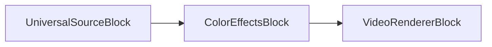

### Sample code

```csharp
var pipeline = new MediaBlocksPipeline();

var filename = "test.mp4";
var fileSource = new UniversalSourceBlock(await UniversalSourceSettings.CreateAsync(new Uri(filename)));

// Sepia
var colorEffects = new ColorEffectsBlock(ColorEffectsPreset.Sepia);
pipeline.Connect(fileSource.VideoOutput, colorEffects.Input);

var videoRenderer = new VideoRendererBlock(pipeline, VideoView1);
pipeline.Connect(colorEffects.Output, videoRenderer.Input);            

await pipeline.StartAsync();
```

### Platforms

Windows, macOS, Linux, iOS, Android.

## Deinterlace

[!badge size="xl" target="blank" variant="info" text="Media Blocks SDK .Net"](https://www.visioforge.com/media-blocks-sdk-net)

The block deinterlaces interlaced video frames into progressive video frames. Several methods of processing are available.
Use the DeinterlaceSettings class to configure the block.

### Block info

Name: DeinterlaceBlock.

Pin direction | Media type | Pins count
--- | :---: | :---:
Input | Uncompressed video | 1
Output | Uncompressed video | 1

### The sample pipeline

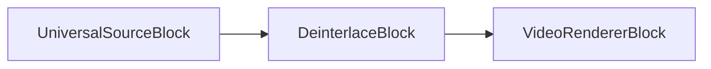

### Sample code

```csharp
var pipeline = new MediaBlocksPipeline();

var filename = "test.mp4";
var fileSource = new UniversalSourceBlock(await UniversalSourceSettings.CreateAsync(new Uri(filename)));

var deinterlace = new DeinterlaceBlock(new DeinterlaceSettings());
pipeline.Connect(fileSource.VideoOutput, deinterlace.Input);

var videoRenderer = new VideoRendererBlock(pipeline, VideoView1);
pipeline.Connect(deinterlace.Output, videoRenderer.Input);            

await pipeline.StartAsync();
```

### Platforms

Windows, macOS, Linux, iOS, Android.

## Fish eye

[!badge size="xl" target="blank" variant="info" text="Media Blocks SDK .Net"](https://www.visioforge.com/media-blocks-sdk-net)

The fisheye block simulates a fisheye lens by zooming on the center of the image and compressing the edges.

### Block info

Name: FishEyeBlock.

Pin direction | Media type | Pins count
--- | :---: | :---:
Input | Uncompressed video | 1
Output | Uncompressed video | 1

### The sample pipeline

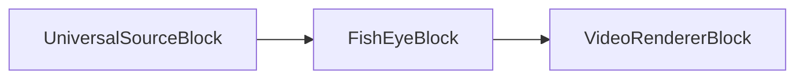

### Sample code

```csharp
var pipeline = new MediaBlocksPipeline();

var filename = "test.mp4";
var fileSource = new UniversalSourceBlock(await UniversalSourceSettings.CreateAsync(new Uri(filename)));

var fishEye = new FishEyeBlock();
pipeline.Connect(fileSource.VideoOutput, fishEye.Input);

var videoRenderer = new VideoRendererBlock(pipeline, VideoView1);
pipeline.Connect(fishEye.Output, videoRenderer.Input);            

await pipeline.StartAsync();
```

### Platforms

Windows, macOS, Linux, iOS, Android.

## Flip/Rotate

[!badge size="xl" target="blank" variant="info" text="Media Blocks SDK .Net"](https://www.visioforge.com/media-blocks-sdk-net)

The block flips and rotates the video stream.
Use the VideoFlipRotateMethod enumeration to configure.

### Block info

Name: FlipRotateBlock.

Pin direction | Media type | Pins count
--- | :---: | :---:
Input | Uncompressed video | 1
Output | Uncompressed video | 1

### The sample pipeline

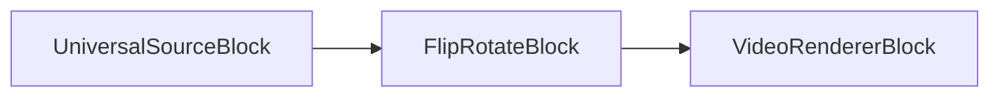

### Sample code

```csharp
var pipeline = new MediaBlocksPipeline();

var filename = "test.mp4";
var fileSource = new UniversalSourceBlock(await UniversalSourceSettings.CreateAsync(new Uri(filename)));

// 90 degree rotation
var flipRotate = new FlipRotateBlock(VideoFlipRotateMethod.Method90R);
pipeline.Connect(fileSource.VideoOutput, flipRotate.Input);

var videoRenderer = new VideoRendererBlock(pipeline, VideoView1);
pipeline.Connect(flipRotate.Output, videoRenderer.Input);            

await pipeline.StartAsync();
```

### Platforms

Windows, macOS, Linux, iOS, Android.

## Gamma

[!badge size="xl" target="blank" variant="info" text="Media Blocks SDK .Net"](https://www.visioforge.com/media-blocks-sdk-net)

The block performs gamma correction on a video stream.

### Block info

Name: GammaBlock.

Pin direction | Media type | Pins count
--- | :---: | :---:
Input | Uncompressed video | 1
Output | Uncompressed video | 1

### The sample pipeline

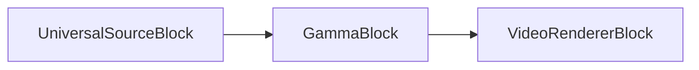

### Sample code

```csharp
var pipeline = new MediaBlocksPipeline();

var filename = "test.mp4";
var fileSource = new UniversalSourceBlock(await UniversalSourceSettings.CreateAsync(new Uri(filename)));

var gamma = new GammaBlock(2.0);
pipeline.Connect(fileSource.VideoOutput, gamma.Input);

var videoRenderer = new VideoRendererBlock(pipeline, VideoView1);
pipeline.Connect(gamma.Output, videoRenderer.Input);            

await pipeline.StartAsync();
```

### Platforms

Windows, macOS, Linux, iOS, Android.

## Gaussian blur

[!badge size="xl" target="blank" variant="info" text="Media Blocks SDK .Net"](https://www.visioforge.com/media-blocks-sdk-net)

The block blurs the video stream using the Gaussian function.

### Block info

Name: GaussianBlurBlock.

Pin direction | Media type | Pins count
--- | :---: | :---:
Input | Uncompressed video | 1
Output | Uncompressed video | 1

### The sample pipeline

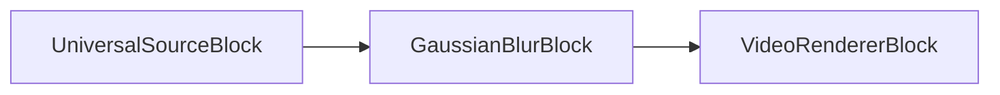

### Sample code

```csharp
var pipeline = new MediaBlocksPipeline();

var filename = "test.mp4";
var fileSource = new UniversalSourceBlock(await UniversalSourceSettings.CreateAsync(new Uri(filename)));

var gaussianBlur = new GaussianBlurBlock();
pipeline.Connect(fileSource.VideoOutput, gaussianBlur.Input);

var videoRenderer = new VideoRendererBlock(pipeline, VideoView1);
pipeline.Connect(gaussianBlur.Output, videoRenderer.Input);            

await pipeline.StartAsync();
```

### Platforms

Windows, macOS, Linux, iOS, Android.

## Image overlay

[!badge size="xl" target="blank" variant="info" text="Media Blocks SDK .Net"](https://www.visioforge.com/media-blocks-sdk-net)

The block overlays an image loaded from a file onto a video stream.

You can set an image position and optional alpha value. 32-bit images with alpha-channel are supported.

### Block info

Name: ImageOverlayBlock.

Pin direction | Media type | Pins count
--- | :---: | :---:
Input | Uncompressed video | 1
Output | Uncompressed video | 1

### The sample pipeline

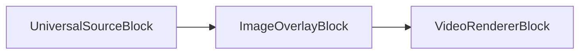

### Sample code

```csharp
var pipeline = new MediaBlocksPipeline();

var filename = "test.mp4";
var fileSource = new UniversalSourceBlock(await UniversalSourceSettings.CreateAsync(new Uri(filename)));

var imageOverlay = new ImageOverlayBlock(@"logo.png");
pipeline.Connect(fileSource.VideoOutput, imageOverlay.Input);

var videoRenderer = new VideoRendererBlock(pipeline, VideoView1);
pipeline.Connect(imageOverlay.Output, videoRenderer.Input);            

await pipeline.StartAsync();
```

### Platforms

Windows, macOS, Linux, iOS, Android.

## Mirror

[!badge size="xl" target="blank" variant="info" text="Media Blocks SDK .Net"](https://www.visioforge.com/media-blocks-sdk-net)

The mirror block splits the image into two halves and reflects one over the other.

### Block info

Name: MirrorBlock.

Pin direction | Media type | Pins count
--- | :---: | :---:
Input | Uncompressed video | 1
Output | Uncompressed video | 1

### The sample pipeline

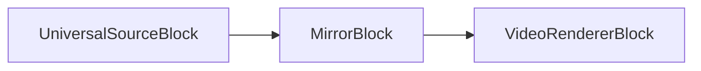

### Sample code

```csharp
var pipeline = new MediaBlocksPipeline();

var filename = "test.mp4";
var fileSource = new UniversalSourceBlock(await UniversalSourceSettings.CreateAsync(new Uri(filename)));

var mirrorBlock = new MirrorBlock(MirrorMode.Top);
pipeline.Connect(fileSource.VideoOutput, mirrorBlock.Input);

var videoRenderer = new VideoRendererBlock(pipeline, VideoView1);
pipeline.Connect(mirrorBlock.Output, videoRenderer.Input);            

await pipeline.StartAsync();
```

### Platforms

Windows, macOS, Linux, iOS, Android.

## Perspective

[!badge size="xl" target="blank" variant="info" text="Media Blocks SDK .Net"](https://www.visioforge.com/media-blocks-sdk-net)

The perspective block applies a 2D perspective transform.

### Block info

Name: PerspectiveBlock.

Pin direction | Media type | Pins count
--- | :---: | :---:
Input | Uncompressed video | 1
Output | Uncompressed video | 1

### The sample pipeline

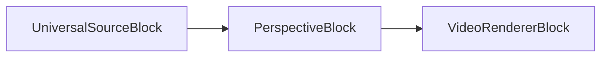

### Sample code

```csharp
var pipeline = new MediaBlocksPipeline();

var filename = "test.mp4";
var fileSource = new UniversalSourceBlock(await UniversalSourceSettings.CreateAsync(new Uri(filename)));

var persBlock = new PerspectiveBlock(new int[] { 1, 2, 3, 4, 5, 6, 7, 8, 9 });
pipeline.Connect(fileSource.VideoOutput, persBlock.Input);

var videoRenderer = new VideoRendererBlock(pipeline, VideoView1);
pipeline.Connect(persBlock.Output, videoRenderer.Input);            

await pipeline.StartAsync();
```

### Platforms

Windows, macOS, Linux, iOS, Android.

## Pinch

[!badge size="xl" target="blank" variant="info" text="Media Blocks SDK .Net"](https://www.visioforge.com/media-blocks-sdk-net)

The block performs the pinch geometric transform of the image.

### Block info

Name: PinchBlock.

Pin direction | Media type | Pins count
--- | :---: | :---:
Input | Uncompressed video | 1
Output | Uncompressed video | 1

### The sample pipeline

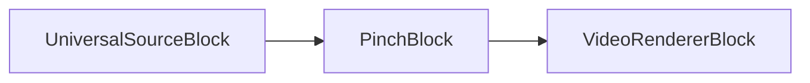

### Sample code

```csharp
var pipeline = new MediaBlocksPipeline();

var filename = "test.mp4";
var fileSource = new UniversalSourceBlock(await UniversalSourceSettings.CreateAsync(new Uri(filename)));

var pinchBlock = new PinchBlock();
pipeline.Connect(fileSource.VideoOutput, pinchBlock.Input);

var videoRenderer = new VideoRendererBlock(pipeline, VideoView1);
pipeline.Connect(pinchBlock.Output, videoRenderer.Input);            

await pipeline.StartAsync();
```

### Platforms

Windows, macOS, Linux, iOS, Android.

## Rotate

[!badge size="xl" target="blank" variant="info" text="Media Blocks SDK .Net"](https://www.visioforge.com/media-blocks-sdk-net)

The block rotates the image by a specified angle.

### Block info

Name: RotateBlock.

Pin direction | Media type | Pins count
--- | :---: | :---:
Input | Uncompressed video | 1
Output | Uncompressed video | 1

### The sample pipeline

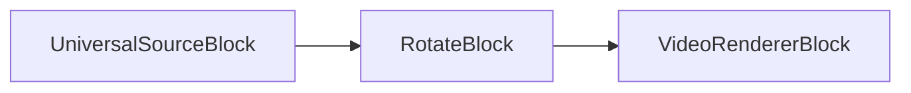

### Sample code

```csharp
var pipeline = new MediaBlocksPipeline();

var filename = "test.mp4";
var fileSource = new UniversalSourceBlock(await UniversalSourceSettings.CreateAsync(new Uri(filename)));

var rotateBlock = new RotateBlock(0.7);
pipeline.Connect(fileSource.VideoOutput, rotateBlock.Input);

var videoRenderer = new VideoRendererBlock(pipeline, VideoView1);
pipeline.Connect(rotateBlock.Output, videoRenderer.Input);            

await pipeline.StartAsync();
```

### Platforms

Windows, macOS, Linux, iOS, Android.

## Resize

[!badge size="xl" target="blank" variant="info" text="Media Blocks SDK .Net"](https://www.visioforge.com/media-blocks-sdk-net)

The block resizes the video stream. You can configure the resize method, the letterbox flag, and many other options.

Use the `ResizeVideoEffect` class to configure.

### Block info

Name: VideoResizeBlock.

Pin direction | Media type | Pins count
--- | :---: | :---:
Input | Uncompressed video | 1
Output | Uncompressed video | 1

### The sample pipeline

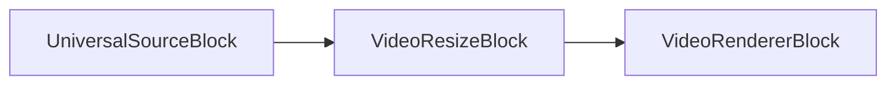

### Sample code

```csharp
var pipeline = new MediaBlocksPipeline();

var filename = "test.mp4";
var fileSource = new UniversalSourceBlock(await UniversalSourceSettings.CreateAsync(new Uri(filename)));

var videoResize = new VideoResizeBlock(new ResizeVideoEffect(1280, 720) { Letterbox = false });
pipeline.Connect(fileSource.VideoOutput, videoResize.Input);

var videoRenderer = new VideoRendererBlock(pipeline, VideoView1);
pipeline.Connect(videoResize.Output, videoRenderer.Input);            

await pipeline.StartAsync();
```

### Platforms

Windows, macOS, Linux, iOS, Android.

## Video sample grabber

[!badge size="xl" target="blank" variant="info" text="Media Blocks SDK .Net"](https://www.visioforge.com/media-blocks-sdk-net)

The video sample grabber calls an event for each video frame. You can save or process the received video frame.

### Block info

Name: VideoSampleGrabberBlock.

Pin direction | Media type | Pins count
--- | :---: | :---:
Input | Uncompressed video | 1
Output | Uncompressed video | 1

### The sample pipeline


### Sample code

```csharp
var pipeline = new MediaBlocksPipeline();

var filename = "test.mp4";
var fileSource = new UniversalSourceBlock(await UniversalSourceSettings.CreateAsync(new Uri(filename)));

var videoSG = new VideoSampleGrabberBlock();
videoSG.OnVideoFrameBuffer += VideoSG_OnVideoFrameBuffer;
pipeline.Connect(fileSource.VideoOutput, videoSG.Input);

var videoRenderer = new VideoRendererBlock(pipeline, VideoView1);
pipeline.Connect(videoSG.Output, videoRenderer.Input);            

await pipeline.StartAsync();

private void VideoSG_OnVideoFrameBuffer(object sender, VideoFrameBufferEventArgs e)
{
    // save or process the video frame
}
```

### Platforms

Windows, macOS, Linux, iOS, Android.

## Sphere

[!badge size="xl" target="blank" variant="info" text="Media Blocks SDK .Net"](https://www.visioforge.com/media-blocks-sdk-net)

The sphere block applies a sphere geometric transform to the video.

### Block info

Name: SphereBlock.

Pin direction | Media type | Pins count
--- | :---: | :---:
Input | Uncompressed video | 1
Output | Uncompressed video | 1

### The sample pipeline

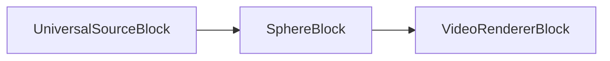

### Sample code

```csharp
var pipeline = new MediaBlocksPipeline();

var filename = "test.mp4";
var fileSource = new UniversalSourceBlock(await UniversalSourceSettings.CreateAsync(new Uri(filename)));

var sphereBlock = new SphereBlock();
pipeline.Connect(fileSource.VideoOutput, sphereBlock.Input);

var videoRenderer = new VideoRendererBlock(pipeline, VideoView1);
pipeline.Connect(sphereBlock.Output, videoRenderer.Input);            

await pipeline.StartAsync();
```

### Platforms

Windows, macOS, Linux, iOS, Android.

## Square

[!badge size="xl" target="blank" variant="info" text="Media Blocks SDK .Net"](https://www.visioforge.com/media-blocks-sdk-net)

The square block distorts the center part of the video into a square.

### Block info

Name: SquareBlock.

Pin direction | Media type | Pins count
--- | :---: | :---:
Input | Uncompressed video | 1
Output | Uncompressed video | 1

### The sample pipeline


### Sample code

```csharp
var pipeline = new MediaBlocksPipeline();

var filename = "test.mp4";
var fileSource = new UniversalSourceBlock(await UniversalSourceSettings.CreateAsync(new Uri(filename)));

var squareBlock = new SquareBlock(new SquareVideoEffect());
pipeline.Connect(fileSource.VideoOutput, squareBlock.Input);

var videoRenderer = new VideoRendererBlock(pipeline, VideoView1);
pipeline.Connect(squareBlock.Output, videoRenderer.Input);            

await pipeline.StartAsync();
```

### Platforms

Windows, macOS, Linux, iOS, Android.

## Stretch

[!badge size="xl" target="blank" variant="info" text="Media Blocks SDK .Net"](https://www.visioforge.com/media-blocks-sdk-net)

The stretch block stretches the video in the circle around the center point.

### Block info

Name: StretchBlock.

Pin direction | Media type | Pins count
--- | :---: | :---:
Input | Uncompressed video | 1
Output | Uncompressed video | 1

### The sample pipeline

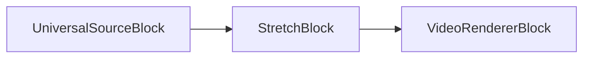

### Sample code

```csharp
var pipeline = new MediaBlocksPipeline();

var filename = "test.mp4";
var fileSource = new UniversalSourceBlock(await UniversalSourceSettings.CreateAsync(new Uri(filename)));

var stretchBlock = new StretchBlock();
pipeline.Connect(fileSource.VideoOutput, stretchBlock.Input);

var videoRenderer = new VideoRendererBlock(pipeline, VideoView1);
pipeline.Connect(stretchBlock.Output, videoRenderer.Input);            

await pipeline.StartAsync();
```

### Platforms

Windows, macOS, Linux, iOS, Android.

## Text overlay

[!badge size="xl" target="blank" variant="info" text="Media Blocks SDK .Net"](https://www.visioforge.com/media-blocks-sdk-net)

The block adds the text overlay on top of the video stream.

### Block info

Name: TextOverlayBlock.

Pin direction | Media type | Pins count
--- | :---: | :---:
Input | Uncompressed video | 1
Output | Uncompressed video | 1

### The sample pipeline

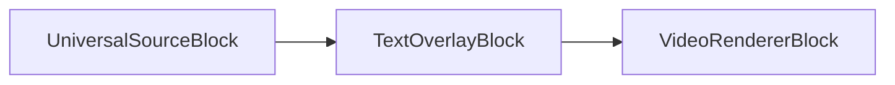

### Sample code

```csharp
var pipeline = new MediaBlocksPipeline();

var filename = "test.mp4";
var fileSource = new UniversalSourceBlock(await UniversalSourceSettings.CreateAsync(new Uri(filename)));

var textOverlay = new TextOverlayBlock(new TextOverlaySettings("Hello world!"));
pipeline.Connect(fileSource.VideoOutput, textOverlay.Input);

var videoRenderer = new VideoRendererBlock(pipeline, VideoView1);
pipeline.Connect(textOverlay.Output, videoRenderer.Input);            

await pipeline.StartAsync();
```

### Platforms

Windows, macOS, Linux, iOS, Android.

## Tunnel

[!badge size="xl" target="blank" variant="info" text="Media Blocks SDK .Net"](https://www.visioforge.com/media-blocks-sdk-net)

The block applies a light tunnel effect to a video stream.

### Block info

Name: TunnelBlock.

Pin direction | Media type | Pins count
--- | :---: | :---:
Input | Uncompressed video | 1
Output | Uncompressed video | 1

### The sample pipeline

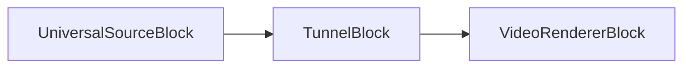

### Sample code

```csharp
var pipeline = new MediaBlocksPipeline();

var filename = "test.mp4";
var fileSource = new UniversalSourceBlock(await UniversalSourceSettings.CreateAsync(new Uri(filename)));

var tunnelBlock = new TunnelBlock();
pipeline.Connect(fileSource.VideoOutput, tunnelBlock.Input);

var videoRenderer = new VideoRendererBlock(pipeline, VideoView1);
pipeline.Connect(tunnelBlock.Output, videoRenderer.Input);            

await pipeline.StartAsync();
```

### Platforms

Windows, macOS, Linux, iOS, Android.

## Twirl

[!badge size="xl" target="blank" variant="info" text="Media Blocks SDK .Net"](https://www.visioforge.com/media-blocks-sdk-net)

The twirl block twists the video frame from the center out.

### Block info

Name: TwirlBlock.

Pin direction | Media type | Pins count
--- | :---: | :---:
Input | Uncompressed video | 1
Output | Uncompressed video | 1

### The sample pipeline

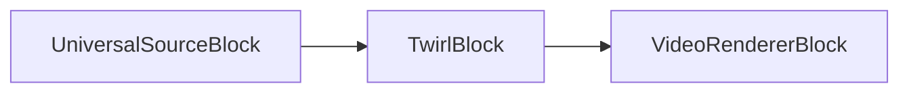

### Sample code

```csharp
var pipeline = new MediaBlocksPipeline();

var filename = "test.mp4";
var fileSource = new UniversalSourceBlock(await UniversalSourceSettings.CreateAsync(new Uri(filename)));

var twirlBlock = new TwirlBlock();
pipeline.Connect(fileSource.VideoOutput, twirlBlock.Input);

var videoRenderer = new VideoRendererBlock(pipeline, VideoView1);
pipeline.Connect(twirlBlock.Output, videoRenderer.Input);            

await pipeline.StartAsync();
```

### Platforms

Windows, macOS, Linux, iOS, Android.

## Video balance

[!badge size="xl" target="blank" variant="info" text="Media Blocks SDK .Net"](https://www.visioforge.com/media-blocks-sdk-net)

The block processes the video stream and allows you to change brightness, contrast, hue, and saturation.
Use the VideoBalanceVideoEffect class to configure the block settings.

### Block info

Name: VideoBalanceBlock.

Pin direction | Media type | Pins count
--- | :---: | :---:
Input | Uncompressed video | 1
Output | Uncompressed video | 1

### The sample pipeline

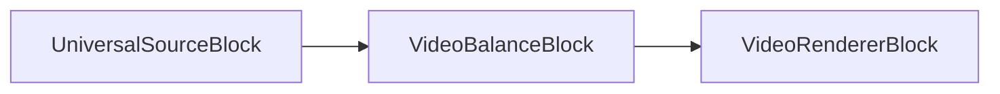

### Sample code

```csharp
var pipeline = new MediaBlocksPipeline();

var filename = "test.mp4";
var fileSource = new UniversalSourceBlock(await UniversalSourceSettings.CreateAsync(new Uri(filename)));

var videoBalance = new VideoBalanceBlock(new VideoBalanceVideoEffect() { Brightness = 0.25 });
pipeline.Connect(fileSource.VideoOutput, videoBalance.Input);

var videoRenderer = new VideoRendererBlock(pipeline, VideoView1);
pipeline.Connect(videoBalance.Output, videoRenderer.Input);            

await pipeline.StartAsync();
```

### Platforms

Windows, macOS, Linux, iOS, Android.

## Video mixer

[!badge size="xl" target="blank" variant="info" text="Media Blocks SDK .Net"](https://www.visioforge.com/media-blocks-sdk-net)

The video mixer block has several inputs and one output. The block draws the inputs in the selected order at the selected positions. You can also set the desired level of transparency for each stream.

### Block info

Name: VideoMixerBlock.

Pin direction | Media type | Pins count
--- | :---: | :---:
Input | Uncompressed video | 1 or more
Output | Uncompressed video | 1

### The sample pipeline

```mermaid
graph LR;
    UniversalSourceBlock#1-->VideoMixerBlock;
    UniversalSourceBlock#2-->VideoMixerBlock;
    VideoMixerBlock-->VideoRendererBlock;
```

### Sample code

```csharp
var pipeline = new MediaBlocksPipeline();

// Define source files
var filename1 = "test.mp4"; // Replace with your first video file
var fileSource1 = new UniversalSourceBlock(await UniversalSourceSettings.CreateAsync(new Uri(filename1)));

var filename2 = "test2.mp4"; // Replace with your second video file
var fileSource2 = new UniversalSourceBlock(await UniversalSourceSettings.CreateAsync(new Uri(filename2)));

// Configure VideoMixerSettings with output resolution and frame rate
// For example, 1280x720 resolution at 30 frames per second
var outputWidth = 1280;
var outputHeight = 720;
var outputFrameRate = new VideoFrameRate(30);
var mixerSettings = new VideoMixerSettings(outputWidth, outputHeight, outputFrameRate);

// Add streams to the mixer
// Stream 1: Main video, occupies the full output frame, Z-order 0 (bottom layer)
mixerSettings.AddStream(new VideoMixerStream(new Rect(0, 0, outputWidth, outputHeight), 0));

// Stream 2: Overlay video, smaller rectangle, positioned at (50,50), Z-order 1 (on top)
// Rectangle: left=50, top=50, width=320, height=180
mixerSettings.AddStream(new VideoMixerStream(new Rect(50, 50, 320, 180), 1));

// Create the VideoMixerBlock
var videoMixer = new VideoMixerBlock(mixerSettings);

// Connect source outputs to VideoMixerBlock inputs
pipeline.Connect(fileSource1.VideoOutput, videoMixer.Inputs[0]);
pipeline.Connect(fileSource2.VideoOutput, videoMixer.Inputs[1]);

// Create a VideoRendererBlock to display the mixed video
// VideoView1 is a placeholder for your UI element (e.g., a WPF control)
var videoRenderer = new VideoRendererBlock(pipeline, VideoView1); 
pipeline.Connect(videoMixer.Output, videoRenderer.Input);

// Start the pipeline
await pipeline.StartAsync();
```

### Platforms

Windows, macOS, Linux, iOS, Android.

### Video Mixer Types and Configuration

The Media Blocks SDK offers several types of video mixers, allowing you to choose the best fit for your application's performance needs and target platform capabilities. These include CPU-based, Direct3D 11, and OpenGL mixers.

All mixer settings classes inherit from `VideoMixerBaseSettings`, which defines common properties like output resolution (`Width`, `Height`), `FrameRate`, and the list of `Streams` to be mixed.

#### 1. CPU-based Video Mixer (VideoMixerSettings)

This is the default video mixer and relies on CPU processing for mixing video streams. It is platform-agnostic and a good general-purpose option.

To use the CPU-based mixer, you instantiate `VideoMixerSettings`:

```csharp
// Output resolution 1920x1080 at 30 FPS
var outputWidth = 1920;
var outputHeight = 1080;
var outputFrameRate = new VideoFrameRate(30);

var mixerSettings = new VideoMixerSettings(outputWidth, outputHeight, outputFrameRate);

// Add streams (see example in the main Video Mixer section)
// mixerSettings.AddStream(new VideoMixerStream(new Rect(0, 0, outputWidth, outputHeight), 0));
// ...

var videoMixer = new VideoMixerBlock(mixerSettings);
```

#### 2. Direct3D 11 Video Compositor (D3D11VideoCompositorSettings)

For Windows applications, the `D3D11VideoCompositorSettings` provides hardware-accelerated video mixing using Direct3D 11. This can offer significant performance improvements, especially with high-resolution video or a large number of streams.

```csharp
// Output resolution 1920x1080 at 30 FPS
var outputWidth = 1920;
var outputHeight = 1080;
var outputFrameRate = new VideoFrameRate(30);

// Optionally, specify the graphics adapter index (-1 for default)
var adapterIndex = -1; 
var d3dMixerSettings = new D3D11VideoCompositorSettings(outputWidth, outputHeight, outputFrameRate)
{
    AdapterIndex = adapterIndex
};

// Streams are added similarly to VideoMixerSettings
// d3dMixerSettings.AddStream(new VideoMixerStream(new Rect(0, 0, outputWidth, outputHeight), 0));
// For more advanced control, you can use D3D11VideoCompositorStream to specify blend states
// d3dMixerSettings.AddStream(new D3D11VideoCompositorStream(new Rect(50, 50, 320, 180), 1) 
// {
//     BlendSourceRGB = D3D11CompositorBlend.SourceAlpha,
//     BlendDestRGB = D3D11CompositorBlend.InverseSourceAlpha
// });
// ...

var videoMixer = new VideoMixerBlock(d3dMixerSettings);
```

The `D3D11VideoCompositorStream` class, which inherits from `VideoMixerStream`, allows for fine-grained control over D3D11 blend states if needed.

#### 3. OpenGL Video Mixer (GLVideoMixerSettings)

The `GLVideoMixerSettings` enables hardware-accelerated video mixing using OpenGL. This is a cross-platform solution for leveraging GPU capabilities on Windows, macOS, and Linux.

```csharp
// Output resolution 1920x1080 at 30 FPS
var outputWidth = 1920;
var outputHeight = 1080;
var outputFrameRate = new VideoFrameRate(30);

var glMixerSettings = new GLVideoMixerSettings(outputWidth, outputHeight, outputFrameRate);

// Streams are added similarly to VideoMixerSettings
// glMixerSettings.AddStream(new VideoMixerStream(new Rect(0, 0, outputWidth, outputHeight), 0));
// For more advanced control, you can use GLVideoMixerStream to specify blend functions and equations
// glMixerSettings.AddStream(new GLVideoMixerStream(new Rect(50, 50, 320, 180), 1)
// {
//     BlendFunctionSourceRGB = GLVideoMixerBlendFunction.SourceAlpha,
//     BlendFunctionDesctinationRGB = GLVideoMixerBlendFunction.OneMinusSourceAlpha,
//     BlendEquationRGB = GLVideoMixerBlendEquation.Add
// });
// ...

var videoMixer = new VideoMixerBlock(glMixerSettings);
```

The `GLVideoMixerStream` class, inheriting from `VideoMixerStream`, provides properties to control OpenGL-specific blending parameters.

Choosing the appropriate mixer depends on your application's requirements. For simple mixing or maximum compatibility, the CPU-based mixer is suitable. For performance-critical applications on Windows, D3D11 is recommended. For cross-platform GPU acceleration, OpenGL is the preferred choice.

## Water ripple

[!badge size="xl" target="blank" variant="info" text="Media Blocks SDK .Net"](https://www.visioforge.com/media-blocks-sdk-net)

The water ripple block creates a water ripple effect on the video stream.
Use the `WaterRippleVideoEffect` class to configure.

### Block info

Name: WaterRippleBlock.

Pin direction | Media type | Pins count
--- | :---: | :---:
Input | Uncompressed video | 1
Output | Uncompressed video | 1

### The sample pipeline

```mermaid
graph LR;
    UniversalSourceBlock-->WaterRippleBlock;
    WaterRippleBlock-->VideoRendererBlock;
```

### Sample code

```csharp
var pipeline = new MediaBlocksPipeline();

var filename = "test.mp4";
var fileSource = new UniversalSourceBlock(await UniversalSourceSettings.CreateAsync(new Uri(filename)));

var wrBlock = new WaterRippleBlock(new WaterRippleVideoEffect());
pipeline.Connect(fileSource.VideoOutput, wrBlock.Input);

var videoRenderer = new VideoRendererBlock(pipeline, VideoView1);
pipeline.Connect(wrBlock.Output, videoRenderer.Input);            

await pipeline.StartAsync();
```

### Platforms

Windows, macOS, Linux, iOS, Android.

## D3D11 Video Converter

[!badge size="xl" target="blank" variant="info" text="Media Blocks SDK .Net"](https://www.visioforge.com/media-blocks-sdk-net)

The D3D11 Video Converter block performs hardware-accelerated video format conversion using Direct3D 11. This is useful for efficient color space or format changes on Windows platforms.

### Block info

Name: D3D11VideoConverterBlock.

Pin direction | Media type | Pins count
--- | :---: | :---:
Input | Uncompressed video | 1
Output | Uncompressed video | 1

### The sample pipeline

```mermaid
graph LR;
    UniversalSourceBlock-->D3D11VideoConverterBlock;
    D3D11VideoConverterBlock-->VideoRendererBlock;
```

### Sample code

```csharp
var pipeline = new MediaBlocksPipeline();

var filename = "test.mp4";
var fileSource = new UniversalSourceBlock(await UniversalSourceSettings.CreateAsync(new Uri(filename)));

var d3d11Converter = new D3D11VideoConverterBlock();
pipeline.Connect(fileSource.VideoOutput, d3d11Converter.Input);

var videoRenderer = new VideoRendererBlock(pipeline, VideoView1);
pipeline.Connect(d3d11Converter.Output, videoRenderer.Input);

await pipeline.StartAsync();
```

### Platforms

Windows (Direct3D 11 required).

## Video Effects (Windows)

[!badge size="xl" target="blank" variant="info" text="Media Blocks SDK .Net"](https://www.visioforge.com/media-blocks-sdk-net)

The Video Effects (Windows) block allows you to add, update, and manage multiple video effects in real time. This block is specific to Windows and leverages the Media Foundation pipeline for effects processing.

### Block info

Name: VideoEffectsWinBlock.

Pin direction | Media type | Pins count
--- | :---: | :---:
Input | Uncompressed video | 1
Output | Uncompressed video | 1

### The sample pipeline

```mermaid
graph LR;
    UniversalSourceBlock-->VideoEffectsWinBlock;
    VideoEffectsWinBlock-->VideoRendererBlock;
```

### Sample code

```csharp
var pipeline = new MediaBlocksPipeline();

var filename = "test.mp4";
var fileSource = new UniversalSourceBlock(await UniversalSourceSettings.CreateAsync(new Uri(filename)));

var videoEffects = new VideoEffectsWinBlock();
// Example: add a brightness effect
videoEffects.Video_Effects_Add(new VideoEffectBrightness(true, 0.2));
pipeline.Connect(fileSource.VideoOutput, videoEffects.Input);

var videoRenderer = new VideoRendererBlock(pipeline, VideoView1);
pipeline.Connect(videoEffects.Output, videoRenderer.Input);

await pipeline.StartAsync();
```

### Platforms

Windows.

## D3D11 Video Compositor

[!badge size="xl" target="blank" variant="info" text="Media Blocks SDK .Net"](https://www.visioforge.com/media-blocks-sdk-net)

The D3D11 Video Compositor block provides hardware-accelerated video mixing and compositing using Direct3D 11. It is designed for high-performance multi-stream video composition on Windows.

### Block info

Name: D3D11VideoCompositorBlock.

Pin direction | Media type | Pins count
--- | :---: | :---:
Input | Uncompressed video | 1 or more
Output | Uncompressed video | 1

### The sample pipeline

```mermaid
graph LR;
    UniversalSourceBlock#1-->D3D11VideoCompositorBlock;
    UniversalSourceBlock#2-->D3D11VideoCompositorBlock;
    D3D11VideoCompositorBlock-->VideoRendererBlock;
```

### Sample code

```csharp
var pipeline = new MediaBlocksPipeline();

var filename1 = "test.mp4";
var fileSource1 = new UniversalSourceBlock(await UniversalSourceSettings.CreateAsync(new Uri(filename1)));

var filename2 = "test2.mp4";
var fileSource2 = new UniversalSourceBlock(await UniversalSourceSettings.CreateAsync(new Uri(filename2)));

var outputWidth = 1280;
var outputHeight = 720;
var outputFrameRate = new VideoFrameRate(30);
var settings = new D3D11VideoCompositorSettings(outputWidth, outputHeight, outputFrameRate);
settings.AddStream(new D3D11VideoCompositorStream(new Rect(0, 0, outputWidth, outputHeight), 0));
settings.AddStream(new D3D11VideoCompositorStream(new Rect(50, 50, 320, 180), 1));

var d3d11Compositor = new D3D11VideoCompositorBlock(settings);
pipeline.Connect(fileSource1.VideoOutput, d3d11Compositor.Inputs[0]);
pipeline.Connect(fileSource2.VideoOutput, d3d11Compositor.Inputs[1]);

var videoRenderer = new VideoRendererBlock(pipeline, VideoView1);
pipeline.Connect(d3d11Compositor.Output, videoRenderer.Input);

await pipeline.StartAsync();
```

### Platforms

Windows (Direct3D 11 required).

## VR360 Processor

[!badge size="xl" target="blank" variant="info" text="Media Blocks SDK .Net"](https://www.visioforge.com/media-blocks-sdk-net)

The VR360 Processor block applies 360-degree equirectangular video effects, suitable for VR content. It uses Direct3D 11 for GPU-accelerated processing and allows real-time adjustment of yaw, pitch, roll, and field of view.

### Block info

Name: VR360ProcessorBlock.

Pin direction | Media type | Pins count
--- | :---: | :---:
Input | Uncompressed video | 1
Output | Uncompressed video | 1

### The sample pipeline

```mermaid
graph LR;
    UniversalSourceBlock-->VR360ProcessorBlock;
    VR360ProcessorBlock-->VideoRendererBlock;
```

### Sample code

```csharp
var pipeline = new MediaBlocksPipeline();

var filename = "test.mp4";
var fileSource = new UniversalSourceBlock(await UniversalSourceSettings.CreateAsync(new Uri(filename)));

var vr360Settings = new D3D11VR360RendererSettings
{
    Yaw = 0,
    Pitch = 0,
    Roll = 0,
    FOV = 90
};
var vr360Processor = new VR360ProcessorBlock(vr360Settings);
pipeline.Connect(fileSource.VideoOutput, vr360Processor.Input);

var videoRenderer = new VideoRendererBlock(pipeline, VideoView1);
pipeline.Connect(vr360Processor.Output, videoRenderer.Input);

await pipeline.StartAsync();
```

### Platforms

Windows (Direct3D 11 required).
