# Video processing blocks

[Media Blocks SDK .Net](https://www.visioforge.com/media-blocks-sdk-net){ .md-button .md-button--primary target="_blank" }

## Table of Contents

- [Aging](#aging)
- [Alpha Combine](#alpha-combine)
- [Auto Deinterlace](#auto-deinterlace)
- [Bayer to RGB](#bayer-to-rgb)
- [Chroma Key](#chroma-key)
- [Codec Alpha Demux](#codec-alpha-demux)
- [Color effects](#color-effects)
- [Deinterlace](#deinterlace)
- [Dice](#dice)
- [Edge](#edge)
- [Fish eye](#fish-eye)
- [Flip/Rotate](#fliprotate)
- [Gamma](#gamma)
- [Gaussian blur](#gaussian-blur)
- [Grayscale](#grayscale)
- [Image overlay](#image-overlay)
- [Image Overlay Cairo](#image-overlay-cairo)
- [Interlace](#interlace)
- [Key Frame Detector](#key-frame-detector)
- [LUT Processor](#lut-processor)
- [Mirror](#mirror)
- [Moving Blur](#moving-blur)
- [Moving Echo](#moving-echo)
- [Moving Zoom Echo](#moving-zoom-echo)
- [Optical Animation BW](#optical-animation-bw)
- [Overlay Manager](#overlay-manager)
- [Perspective](#perspective)
- [Pinch](#pinch)
- [Pseudo 3D](#pseudo-3d)
- [QR Code Overlay](#qr-code-overlay)
- [Quark](#quark)
- [Resize](#resize)
- [Ripple](#ripple)
- [Rotate](#rotate)
- [Rounded Corners](#rounded-corners)
- [SMPTE](#smpte)
- [SMPTE Alpha](#smpte-alpha)
- [SVG Overlay](#svg-overlay)
- [Simple Video Mark](#simple-video-mark)
- [Simple Video Mark Detect](#simple-video-mark-detect)
- [Smooth](#smooth)
- [Video sample grabber](#video-sample-grabber)
- [Sphere](#sphere)
- [Square](#square)
- [Squeezeback](#squeezeback)
- [Stretch](#stretch)
- [Text overlay](#text-overlay)
- [Tunnel](#tunnel)
- [Twirl](#twirl)
- [Video Aspect Ratio Crop](#video-aspect-ratio-crop)
- [Video balance](#video-balance)
- [Video Box](#video-box)
- [Video Converter](#video-converter)
- [Video Crop](#video-crop)
- [Video Effects](#video-effects)
- [Video mixer](#video-mixer)
- [Video Padding Changer](#video-padding-changer)
- [Video Rate](#video-rate)
- [Video Scale](#video-scale)
- [Warp](#warp)
- [Water ripple](#water-ripple)
- [D3D11 Video Converter](#d3d11-video-converter)
- [Video Effects (Windows)](#video-effects-windows)
- [D3D11 Video Compositor](#d3d11-video-compositor)
- [VR360 Processor](#vr360-processor)

## Aging

[Media Blocks SDK .Net](https://www.visioforge.com/media-blocks-sdk-net){ .md-button .md-button--primary target="_blank" }

The Aging block simulates vintage film deterioration and weathering effects, applying realistic aging effects to video content including film scratches, dust particles, color degradation, sepia toning, and temporal fluctuations to create authentic vintage film appearance.

### Block info

Name: AgingBlock.

Pin direction | Media type | Pins count
--- | :---: | :---:
Input | Uncompressed video | 1
Output | Uncompressed video | 1

### The sample pipeline


### Sample code

```csharp
var pipeline = new MediaBlocksPipeline();

var filename = "test.mp4";
var fileSource = new UniversalSourceBlock(await UniversalSourceSettings.CreateAsync(new Uri(filename)));

var agingSettings = new AgingVideoEffect
{
    ScratchIntensity = 0.5,
    DustIntensity = 0.3,
    ColorShift = true
};
var aging = new AgingBlock(agingSettings);
pipeline.Connect(fileSource.VideoOutput, aging.Input);

var videoRenderer = new VideoRendererBlock(pipeline, VideoView1);
pipeline.Connect(aging.Output, videoRenderer.Input);

await pipeline.StartAsync();
```

### Platforms

Windows, macOS, Linux, iOS, Android.

## Alpha Combine

[Media Blocks SDK .Net](https://www.visioforge.com/media-blocks-sdk-net){ .md-button .md-button--primary target="_blank" }

The AlphaCombine block combines two video streams using alpha channel blending, enabling sophisticated compositing operations with transparency control.

### Block info

Name: AlphaCombineBlock.

Pin direction | Media type | Pins count
--- | :---: | :---:
Input (Primary) | Uncompressed video | 1
Input (Alpha) | Uncompressed video | 1
Output | Uncompressed video | 1

### The sample pipeline

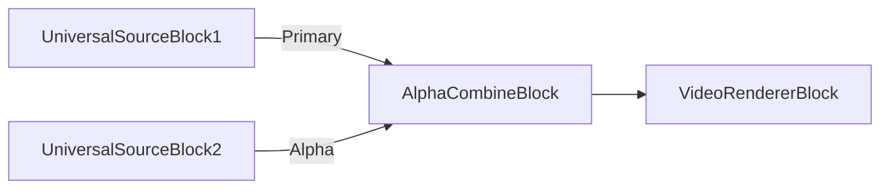

### Sample code

```csharp
var pipeline = new MediaBlocksPipeline();

var primarySource = new UniversalSourceBlock(await UniversalSourceSettings.CreateAsync(new Uri("video.mp4")));
var alphaSource = new UniversalSourceBlock(await UniversalSourceSettings.CreateAsync(new Uri("alpha.mp4")));

var alphaCombine = new AlphaCombineBlock();
pipeline.Connect(primarySource.VideoOutput, alphaCombine.Input);
pipeline.Connect(alphaSource.VideoOutput, alphaCombine.AlphaInput);

var videoRenderer = new VideoRendererBlock(pipeline, VideoView1);
pipeline.Connect(alphaCombine.Output, videoRenderer.Input);

await pipeline.StartAsync();
```

### Platforms

Windows, macOS, Linux, iOS, Android.

## Auto Deinterlace

[Media Blocks SDK .Net](https://www.visioforge.com/media-blocks-sdk-net){ .md-button .md-button--primary target="_blank" }

The AutoDeinterlace block automatically detects and deinterlaces interlaced video content, converting it to progressive format. It intelligently determines when deinterlacing is needed based on the video stream properties.

### Block info

Name: AutoDeinterlaceBlock.

Pin direction | Media type | Pins count
--- | :---: | :---:
Input | Uncompressed video | 1
Output | Uncompressed video | 1

### The sample pipeline

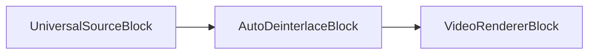

### Sample code

```csharp
var pipeline = new MediaBlocksPipeline();

var filename = "interlaced_video.mp4";
var fileSource = new UniversalSourceBlock(await UniversalSourceSettings.CreateAsync(new Uri(filename)));

var autoDeinterlace = new AutoDeinterlaceBlock(new AutoDeinterlaceSettings());
pipeline.Connect(fileSource.VideoOutput, autoDeinterlace.Input);

var videoRenderer = new VideoRendererBlock(pipeline, VideoView1);
pipeline.Connect(autoDeinterlace.Output, videoRenderer.Input);

await pipeline.StartAsync();
```

### Platforms

Windows, macOS, Linux, iOS, Android.

## Bayer to RGB

[Media Blocks SDK .Net](https://www.visioforge.com/media-blocks-sdk-net){ .md-button .md-button--primary target="_blank" }

The Bayer2RGB block converts Bayer pattern raw sensor data to RGB color video. This is essential for processing video from industrial cameras and sensors that output raw Bayer pattern data.

### Block info

Name: Bayer2RGBBlock.

Pin direction | Media type | Pins count
--- | :---: | :---:
Input | Bayer pattern video | 1
Output | Uncompressed RGB video | 1

### The sample pipeline

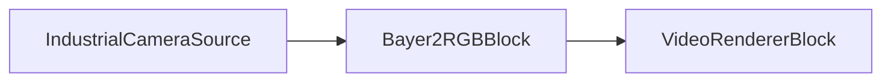

### Sample code

```csharp
var pipeline = new MediaBlocksPipeline();

// Assuming a camera source that outputs Bayer pattern
var cameraSource = new SystemVideoSourceBlock(cameraSettings);

var bayer2rgb = new Bayer2RGBBlock();
pipeline.Connect(cameraSource.Output, bayer2rgb.Input);

var videoRenderer = new VideoRendererBlock(pipeline, VideoView1);
pipeline.Connect(bayer2rgb.Output, videoRenderer.Input);

await pipeline.StartAsync();
```

### Platforms

Windows, macOS, Linux.

## Chroma Key

[Media Blocks SDK .Net](https://www.visioforge.com/media-blocks-sdk-net){ .md-button .md-button--primary target="_blank" }

The ChromaKey block provides professional green screen compositing and color keying functionality, removing specific colors from video content and compositing foreground subjects onto different backgrounds. Features sophisticated color selection, edge refinement, spill suppression, and alpha channel generation.

### Block info

Name: ChromaKeyBlock.

Pin direction | Media type | Pins count
--- | :---: | :---:
Input (Background) | Uncompressed video | 1
Input (Chroma) | Uncompressed video | 1
Output | Uncompressed video | 1

### The sample pipeline

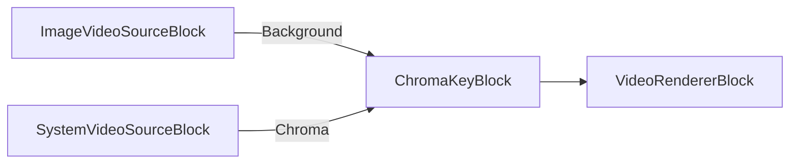

### Sample code

```csharp
var pipeline = new MediaBlocksPipeline();

// Create background source (image or video)
var backgroundSettings = new ImageVideoSourceSettings("background.jpg")
{
    FrameRate = new VideoFrameRate(30.0)
};
var backgroundSource = new ImageVideoSourceBlock(backgroundSettings);

// Create foreground source with green screen
var device = (await DeviceEnumerator.Shared.VideoSourcesAsync())[0];
var videoFormat = device.VideoFormats[0];
var videoSettings = new VideoCaptureDeviceSourceSettings(device)
{
    Format = videoFormat.ToFormat()
};
var videoSource = new SystemVideoSourceBlock(videoSettings);

// Create chroma key block
var chromaKeySettings = new ChromaKeySettingsX(new Size(1920, 1080))
{
    ChromaColor = ChromaKeyColor.Green,
    Sensitivity = 0.5,
    NoiseLevel = 0.1,
    Alpha = 1.0
};
var chromaKey = new ChromaKeyBlock(chromaKeySettings);

// Connect pipeline
pipeline.Connect(backgroundSource.Output, chromaKey.BackgroundInput);
pipeline.Connect(videoSource.Output, chromaKey.ChromaInput);

var videoRenderer = new VideoRendererBlock(pipeline, VideoView1);
pipeline.Connect(chromaKey.Output, videoRenderer.Input);

await pipeline.StartAsync();
```

### Sample applications

- [ChromaKey Demo (WPF)](https://github.com/visioforge/.Net-SDK-s-samples/tree/master/Media%20Blocks%20SDK/WPF/CSharp/ChromaKey)

### Platforms

Windows, macOS, Linux, iOS, Android.

## Codec Alpha Demux

[Media Blocks SDK .Net](https://www.visioforge.com/media-blocks-sdk-net){ .md-button .md-button--primary target="_blank" }

The CodecAlphaDemux block separates alpha channel from video codecs that support embedded alpha channels (like VP8, VP9, or ProRes with alpha).

### Block info

Name: CodecAlphaDemuxBlock.

Pin direction | Media type | Pins count
--- | :---: | :---:
Input | Compressed video with alpha | 1
Output (Video) | Uncompressed video | 1
Output (Alpha) | Alpha channel | 1

### The sample pipeline

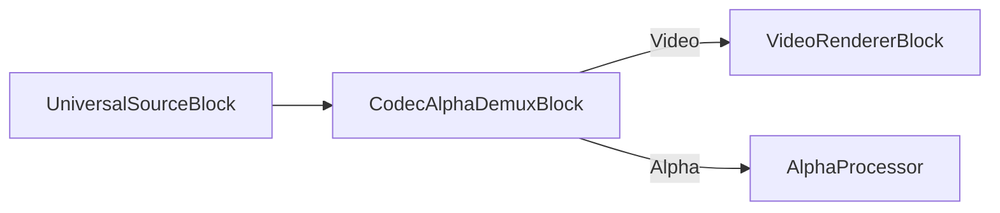

### Sample code

```csharp
var pipeline = new MediaBlocksPipeline();

var filename = "video_with_alpha.webm"; // VP8/VP9 with alpha
var fileSource = new UniversalSourceBlock(await UniversalSourceSettings.CreateAsync(new Uri(filename)));

var alphaDemux = new CodecAlphaDemuxBlock();
pipeline.Connect(fileSource.VideoOutput, alphaDemux.Input);

var videoRenderer = new VideoRendererBlock(pipeline, VideoView1);
pipeline.Connect(alphaDemux.VideoOutput, videoRenderer.Input);

await pipeline.StartAsync();
```

### Platforms

Windows, macOS, Linux, iOS, Android.

## Color effects

[Media Blocks SDK .Net](https://www.visioforge.com/media-blocks-sdk-net){ .md-button .md-button--primary target="_blank" }

The block performs basic video frame color processing: fake heat camera toning, sepia toning, invert and slightly shade to blue, cross processing toning, and yellow foreground/blue background color filter.

### Block info

Name: ColorEffectsBlock.

Pin direction | Media type | Pins count
--- | :---: | :---:
Input | Uncompressed video | 1
Output | Uncompressed video | 1

### The sample pipeline

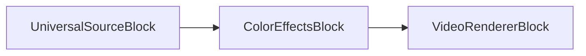

### Sample code

```csharp
var pipeline = new MediaBlocksPipeline();

var filename = "test.mp4";
var fileSource = new UniversalSourceBlock(await UniversalSourceSettings.CreateAsync(new Uri(filename)));

// Sepia
var colorEffects = new ColorEffectsBlock(ColorEffectsPreset.Sepia);
pipeline.Connect(fileSource.VideoOutput, colorEffects.Input);

var videoRenderer = new VideoRendererBlock(pipeline, VideoView1);
pipeline.Connect(colorEffects.Output, videoRenderer.Input);            

await pipeline.StartAsync();
```

### Platforms

Windows, macOS, Linux, iOS, Android.

## Dice

[Media Blocks SDK .Net](https://www.visioforge.com/media-blocks-sdk-net){ .md-button .md-button--primary target="_blank" }

The Dice block divides the video frame into a grid of tiles and applies various transformations to create a fragmented, mosaic-like visual effect.

### Block info

Name: DiceBlock.

Pin direction | Media type | Pins count
--- | :---: | :---:
Input | Uncompressed video | 1
Output | Uncompressed video | 1

### The sample pipeline

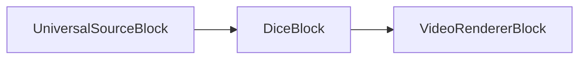

### Sample code

```csharp
var pipeline = new MediaBlocksPipeline();

var filename = "test.mp4";
var fileSource = new UniversalSourceBlock(await UniversalSourceSettings.CreateAsync(new Uri(filename)));

var dice = new DiceBlock(new DiceVideoEffect());
pipeline.Connect(fileSource.VideoOutput, dice.Input);

var videoRenderer = new VideoRendererBlock(pipeline, VideoView1);
pipeline.Connect(dice.Output, videoRenderer.Input);

await pipeline.StartAsync();
```

### Platforms

Windows, macOS, Linux, iOS, Android.

## Edge

[Media Blocks SDK .Net](https://www.visioforge.com/media-blocks-sdk-net){ .md-button .md-button--primary target="_blank" }

The Edge block detects and highlights edges in video frames, creating an edge-detection visual effect useful for artistic purposes or computer vision preprocessing.

### Block info

Name: EdgeBlock.

Pin direction | Media type | Pins count
--- | :---: | :---:
Input | Uncompressed video | 1
Output | Uncompressed video | 1

### The sample pipeline

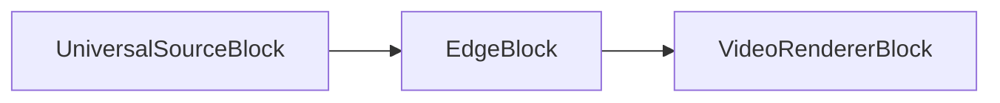

### Sample code

```csharp
var pipeline = new MediaBlocksPipeline();

var filename = "test.mp4";
var fileSource = new UniversalSourceBlock(await UniversalSourceSettings.CreateAsync(new Uri(filename)));

var edge = new EdgeBlock();
pipeline.Connect(fileSource.VideoOutput, edge.Input);

var videoRenderer = new VideoRendererBlock(pipeline, VideoView1);
pipeline.Connect(edge.Output, videoRenderer.Input);

await pipeline.StartAsync();
```

### Platforms

Windows, macOS, Linux, iOS, Android.

## Deinterlace

[Media Blocks SDK .Net](https://www.visioforge.com/media-blocks-sdk-net){ .md-button .md-button--primary target="_blank" }

The block deinterlaces interlaced video frames into progressive video frames. Several methods of processing are available.
Use the DeinterlaceSettings class to configure the block.

### Block info

Name: DeinterlaceBlock.

Pin direction | Media type | Pins count
--- | :---: | :---:
Input | Uncompressed video | 1
Output | Uncompressed video | 1

### The sample pipeline

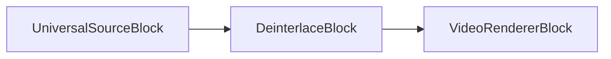

### Sample code

```csharp
var pipeline = new MediaBlocksPipeline();

var filename = "test.mp4";
var fileSource = new UniversalSourceBlock(await UniversalSourceSettings.CreateAsync(new Uri(filename)));

var deinterlace = new DeinterlaceBlock(new DeinterlaceSettings());
pipeline.Connect(fileSource.VideoOutput, deinterlace.Input);

var videoRenderer = new VideoRendererBlock(pipeline, VideoView1);
pipeline.Connect(deinterlace.Output, videoRenderer.Input);            

await pipeline.StartAsync();
```

### Platforms

Windows, macOS, Linux, iOS, Android.

## Fish eye

[Media Blocks SDK .Net](https://www.visioforge.com/media-blocks-sdk-net){ .md-button .md-button--primary target="_blank" }

The fisheye block simulates a fisheye lens by zooming on the center of the image and compressing the edges.

### Block info

Name: FishEyeBlock.

Pin direction | Media type | Pins count
--- | :---: | :---:
Input | Uncompressed video | 1
Output | Uncompressed video | 1

### The sample pipeline

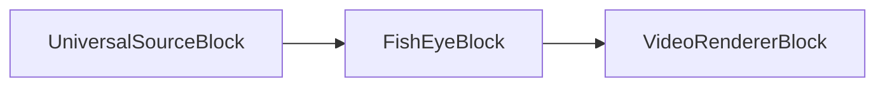

### Sample code

```csharp
var pipeline = new MediaBlocksPipeline();

var filename = "test.mp4";
var fileSource = new UniversalSourceBlock(await UniversalSourceSettings.CreateAsync(new Uri(filename)));

var fishEye = new FishEyeBlock();
pipeline.Connect(fileSource.VideoOutput, fishEye.Input);

var videoRenderer = new VideoRendererBlock(pipeline, VideoView1);
pipeline.Connect(fishEye.Output, videoRenderer.Input);            

await pipeline.StartAsync();
```

### Platforms

Windows, macOS, Linux, iOS, Android.

## Flip/Rotate

[Media Blocks SDK .Net](https://www.visioforge.com/media-blocks-sdk-net){ .md-button .md-button--primary target="_blank" }

The block flips and rotates the video stream.
Use the VideoFlipRotateMethod enumeration to configure.

### Block info

Name: FlipRotateBlock.

Pin direction | Media type | Pins count
--- | :---: | :---:
Input | Uncompressed video | 1
Output | Uncompressed video | 1

### The sample pipeline

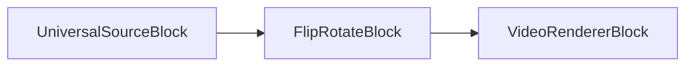

### Sample code

```csharp
var pipeline = new MediaBlocksPipeline();

var filename = "test.mp4";
var fileSource = new UniversalSourceBlock(await UniversalSourceSettings.CreateAsync(new Uri(filename)));

// 90 degree rotation
var flipRotate = new FlipRotateBlock(VideoFlipRotateMethod.Method90R);
pipeline.Connect(fileSource.VideoOutput, flipRotate.Input);

var videoRenderer = new VideoRendererBlock(pipeline, VideoView1);
pipeline.Connect(flipRotate.Output, videoRenderer.Input);            

await pipeline.StartAsync();
```

### Platforms

Windows, macOS, Linux, iOS, Android.

## Gamma

[Media Blocks SDK .Net](https://www.visioforge.com/media-blocks-sdk-net){ .md-button .md-button--primary target="_blank" }

The block performs gamma correction on a video stream.

### Block info

Name: GammaBlock.

Pin direction | Media type | Pins count
--- | :---: | :---:
Input | Uncompressed video | 1
Output | Uncompressed video | 1

### The sample pipeline

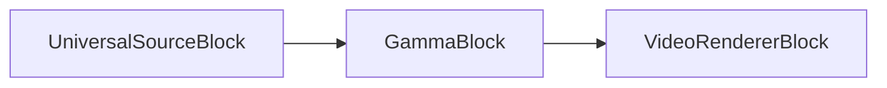

### Sample code

```csharp
var pipeline = new MediaBlocksPipeline();

var filename = "test.mp4";
var fileSource = new UniversalSourceBlock(await UniversalSourceSettings.CreateAsync(new Uri(filename)));

var gamma = new GammaBlock(2.0);
pipeline.Connect(fileSource.VideoOutput, gamma.Input);

var videoRenderer = new VideoRendererBlock(pipeline, VideoView1);
pipeline.Connect(gamma.Output, videoRenderer.Input);            

await pipeline.StartAsync();
```

### Platforms

Windows, macOS, Linux, iOS, Android.

## Gaussian blur

[Media Blocks SDK .Net](https://www.visioforge.com/media-blocks-sdk-net){ .md-button .md-button--primary target="_blank" }

The block blurs the video stream using the Gaussian function.

### Block info

Name: GaussianBlurBlock.

Pin direction | Media type | Pins count
--- | :---: | :---:
Input | Uncompressed video | 1
Output | Uncompressed video | 1

### The sample pipeline

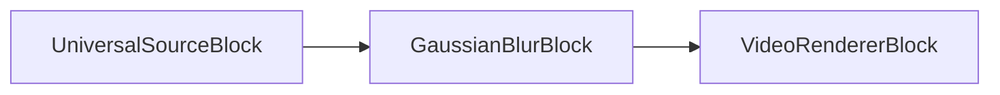

### Sample code

```csharp
var pipeline = new MediaBlocksPipeline();

var filename = "test.mp4";
var fileSource = new UniversalSourceBlock(await UniversalSourceSettings.CreateAsync(new Uri(filename)));

var gaussianBlur = new GaussianBlurBlock();
pipeline.Connect(fileSource.VideoOutput, gaussianBlur.Input);

var videoRenderer = new VideoRendererBlock(pipeline, VideoView1);
pipeline.Connect(gaussianBlur.Output, videoRenderer.Input);            

await pipeline.StartAsync();
```

### Platforms

Windows, macOS, Linux, iOS, Android.

## Grayscale

[Media Blocks SDK .Net](https://www.visioforge.com/media-blocks-sdk-net){ .md-button .md-button--primary target="_blank" }

The Grayscale block converts color video to grayscale (black and white), removing all color information while preserving luminance.

### Block info

Name: GrayscaleBlock.

Pin direction | Media type | Pins count
--- | :---: | :---:
Input | Uncompressed video | 1
Output | Uncompressed video | 1

### The sample pipeline

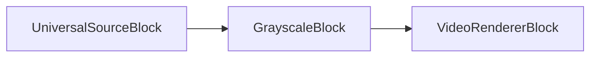

### Sample code

```csharp
var pipeline = new MediaBlocksPipeline();

var filename = "test.mp4";
var fileSource = new UniversalSourceBlock(await UniversalSourceSettings.CreateAsync(new Uri(filename)));

var grayscale = new GrayscaleBlock();
pipeline.Connect(fileSource.VideoOutput, grayscale.Input);

var videoRenderer = new VideoRendererBlock(pipeline, VideoView1);
pipeline.Connect(grayscale.Output, videoRenderer.Input);

await pipeline.StartAsync();
```

### Platforms

Windows, macOS, Linux, iOS, Android.

## Image overlay

[Media Blocks SDK .Net](https://www.visioforge.com/media-blocks-sdk-net){ .md-button .md-button--primary target="_blank" }

The block overlays an image loaded from a file onto a video stream.

You can set an image position and optional alpha value. 32-bit images with alpha-channel are supported.

### Block info

Name: ImageOverlayBlock.

Pin direction | Media type | Pins count
--- | :---: | :---:
Input | Uncompressed video | 1
Output | Uncompressed video | 1

### The sample pipeline

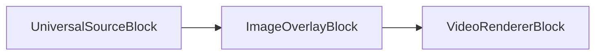

### Sample code

```csharp
var pipeline = new MediaBlocksPipeline();

var filename = "test.mp4";
var fileSource = new UniversalSourceBlock(await UniversalSourceSettings.CreateAsync(new Uri(filename)));

var imageOverlay = new ImageOverlayBlock(@"logo.png");
pipeline.Connect(fileSource.VideoOutput, imageOverlay.Input);

var videoRenderer = new VideoRendererBlock(pipeline, VideoView1);
pipeline.Connect(imageOverlay.Output, videoRenderer.Input);            

await pipeline.StartAsync();
```

### Platforms

Windows, macOS, Linux, iOS, Android.

## Image Overlay Cairo

[Media Blocks SDK .Net](https://www.visioforge.com/media-blocks-sdk-net){ .md-button .md-button--primary target="_blank" }

The ImageOverlayCairo block provides advanced image overlay capabilities using the Cairo graphics library, offering enhanced rendering quality and additional features compared to the standard image overlay block.

### Block info

Name: ImageOverlayCairoBlock.

Pin direction | Media type | Pins count
--- | :---: | :---:
Input | Uncompressed video | 1
Output | Uncompressed video | 1

### The sample pipeline

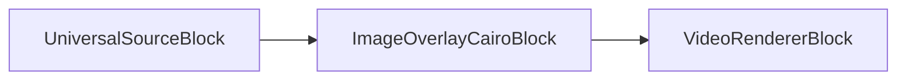

### Sample code

```csharp
var pipeline = new MediaBlocksPipeline();

var filename = "test.mp4";
var fileSource = new UniversalSourceBlock(await UniversalSourceSettings.CreateAsync(new Uri(filename)));

var imageOverlayCairo = new ImageOverlayCairoBlock("logo.png");
pipeline.Connect(fileSource.VideoOutput, imageOverlayCairo.Input);

var videoRenderer = new VideoRendererBlock(pipeline, VideoView1);
pipeline.Connect(imageOverlayCairo.Output, videoRenderer.Input);

await pipeline.StartAsync();
```

### Platforms

Windows, macOS, Linux, iOS, Android.

## Interlace

[Media Blocks SDK .Net](https://www.visioforge.com/media-blocks-sdk-net){ .md-button .md-button--primary target="_blank" }

The Interlace block converts progressive video to interlaced format, creating alternating field lines. This is useful for broadcast or compatibility with interlaced display systems.

### Block info

Name: InterlaceBlock.

Pin direction | Media type | Pins count
--- | :---: | :---:
Input | Uncompressed video | 1
Output | Uncompressed video | 1

### The sample pipeline

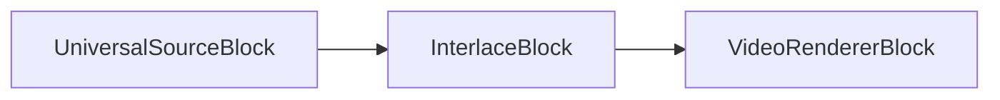

### Sample code

```csharp
var pipeline = new MediaBlocksPipeline();

var filename = "test.mp4";
var fileSource = new UniversalSourceBlock(await UniversalSourceSettings.CreateAsync(new Uri(filename)));

var interlace = new InterlaceBlock(new InterlaceSettings());
pipeline.Connect(fileSource.VideoOutput, interlace.Input);

var videoRenderer = new VideoRendererBlock(pipeline, VideoView1);
pipeline.Connect(interlace.Output, videoRenderer.Input);

await pipeline.StartAsync();
```

### Platforms

Windows, macOS, Linux, iOS, Android.

## Key Frame Detector

[Media Blocks SDK .Net](https://www.visioforge.com/media-blocks-sdk-net){ .md-button .md-button--primary target="_blank" }

The KeyFrameDetector block analyzes video streams to detect and identify key frames (I-frames) in the video sequence, useful for video editing and analysis applications.

### Block info

Name: KeyFrameDetectorBlock.

Pin direction | Media type | Pins count
--- | :---: | :---:
Input | Uncompressed video | 1
Output | Uncompressed video | 1

### The sample pipeline

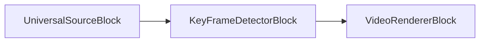

### Sample code

```csharp
var pipeline = new MediaBlocksPipeline();

var filename = "test.mp4";
var fileSource = new UniversalSourceBlock(await UniversalSourceSettings.CreateAsync(new Uri(filename)));

var keyFrameDetector = new KeyFrameDetectorBlock();
keyFrameDetector.OnKeyFrameDetected += (sender, e) =>
{
    Console.WriteLine($"Key frame detected at timestamp: {e.Timestamp}");
};
pipeline.Connect(fileSource.VideoOutput, keyFrameDetector.Input);

var videoRenderer = new VideoRendererBlock(pipeline, VideoView1);
pipeline.Connect(keyFrameDetector.Output, videoRenderer.Input);

await pipeline.StartAsync();
```

### Platforms

Windows, macOS, Linux, iOS, Android.

## LUT Processor

[Media Blocks SDK .Net](https://www.visioforge.com/media-blocks-sdk-net){ .md-button .md-button--primary target="_blank" }

The LUT (Look-Up Table) Processor block applies color grading and correction using 3D LUT files, enabling professional color transformations and cinematic looks.

### Block info

Name: LUTProcessorBlock.

Pin direction | Media type | Pins count
--- | :---: | :---:
Input | Uncompressed video | 1
Output | Uncompressed video | 1

### The sample pipeline

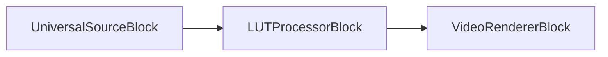

### Sample code

```csharp
var pipeline = new MediaBlocksPipeline();

var filename = "test.mp4";
var fileSource = new UniversalSourceBlock(await UniversalSourceSettings.CreateAsync(new Uri(filename)));

var lutSettings = new LUTVideoEffect
{
    LUTFilePath = "cinematic_lut.cube"
};
var lutProcessor = new LUTProcessorBlock(lutSettings);
pipeline.Connect(fileSource.VideoOutput, lutProcessor.Input);

var videoRenderer = new VideoRendererBlock(pipeline, VideoView1);
pipeline.Connect(lutProcessor.Output, videoRenderer.Input);

await pipeline.StartAsync();
```

### Platforms

Windows, macOS, Linux, iOS, Android.

## Mirror

[Media Blocks SDK .Net](https://www.visioforge.com/media-blocks-sdk-net){ .md-button .md-button--primary target="_blank" }

The mirror block splits the image into two halves and reflects one over the other.

### Block info

Name: MirrorBlock.

Pin direction | Media type | Pins count
--- | :---: | :---:
Input | Uncompressed video | 1
Output | Uncompressed video | 1

### The sample pipeline

```mermaid
graph LR;
    UniversalSourceBlock-->MirrorBlock;
    MirrorBlock-->VideoRendererBlock;
```

### Sample code

```csharp
var pipeline = new MediaBlocksPipeline();

var filename = "test.mp4";
var fileSource = new UniversalSourceBlock(await UniversalSourceSettings.CreateAsync(new Uri(filename)));

var mirrorBlock = new MirrorBlock(MirrorMode.Top);
pipeline.Connect(fileSource.VideoOutput, mirrorBlock.Input);

var videoRenderer = new VideoRendererBlock(pipeline, VideoView1);
pipeline.Connect(mirrorBlock.Output, videoRenderer.Input);            

await pipeline.StartAsync();
```

### Platforms

Windows, macOS, Linux, iOS, Android.

## Moving Blur

[Media Blocks SDK .Net](https://www.visioforge.com/media-blocks-sdk-net){ .md-button .md-button--primary target="_blank" }

The MovingBlur block creates dynamic motion blur effects by blending current frames with previous frames, simulating camera motion blur or creating artistic trailing effects.

### Block info

Name: MovingBlurBlock.

Pin direction | Media type | Pins count
--- | :---: | :---:
Input | Uncompressed video | 1
Output | Uncompressed video | 1

### The sample pipeline

```mermaid
graph LR;
    UniversalSourceBlock-->MovingBlurBlock;
    MovingBlurBlock-->VideoRendererBlock;
```

### Sample code

```csharp
var pipeline = new MediaBlocksPipeline();

var filename = "test.mp4";
var fileSource = new UniversalSourceBlock(await UniversalSourceSettings.CreateAsync(new Uri(filename)));

var movingBlur = new MovingBlurBlock(new MovingBlurVideoEffect());
pipeline.Connect(fileSource.VideoOutput, movingBlur.Input);

var videoRenderer = new VideoRendererBlock(pipeline, VideoView1);
pipeline.Connect(movingBlur.Output, videoRenderer.Input);

await pipeline.StartAsync();
```

### Platforms

Windows, macOS, Linux, iOS, Android.

## Moving Echo

[Media Blocks SDK .Net](https://www.visioforge.com/media-blocks-sdk-net){ .md-button .md-button--primary target="_blank" }

The MovingEcho block creates echo-like visual effects by layering delayed versions of the video frames, producing a ghosting or trail effect.

### Block info

Name: MovingEchoBlock.

Pin direction | Media type | Pins count
--- | :---: | :---:
Input | Uncompressed video | 1
Output | Uncompressed video | 1

### The sample pipeline

```mermaid
graph LR;
    UniversalSourceBlock-->MovingEchoBlock;
    MovingEchoBlock-->VideoRendererBlock;
```

### Sample code

```csharp
var pipeline = new MediaBlocksPipeline();

var filename = "test.mp4";
var fileSource = new UniversalSourceBlock(await UniversalSourceSettings.CreateAsync(new Uri(filename)));

var movingEcho = new MovingEchoBlock(new MovingEchoVideoEffect());
pipeline.Connect(fileSource.VideoOutput, movingEcho.Input);

var videoRenderer = new VideoRendererBlock(pipeline, VideoView1);
pipeline.Connect(movingEcho.Output, videoRenderer.Input);

await pipeline.StartAsync();
```

### Platforms

Windows, macOS, Linux, iOS, Android.

## Moving Zoom Echo

[Media Blocks SDK .Net](https://www.visioforge.com/media-blocks-sdk-net){ .md-button .md-button--primary target="_blank" }

The MovingZoomEcho block combines motion echo effects with zoom transformations, creating dynamic visual effects that simulate zooming trails.

### Block info

Name: MovingZoomEchoBlock.

Pin direction | Media type | Pins count
--- | :---: | :---:
Input | Uncompressed video | 1
Output | Uncompressed video | 1

### The sample pipeline

```mermaid
graph LR;
    UniversalSourceBlock-->MovingZoomEchoBlock;
    MovingZoomEchoBlock-->VideoRendererBlock;
```

### Sample code

```csharp
var pipeline = new MediaBlocksPipeline();

var filename = "test.mp4";
var fileSource = new UniversalSourceBlock(await UniversalSourceSettings.CreateAsync(new Uri(filename)));

var movingZoomEcho = new MovingZoomEchoBlock(new MovingZoomEchoVideoEffect());
pipeline.Connect(fileSource.VideoOutput, movingZoomEcho.Input);

var videoRenderer = new VideoRendererBlock(pipeline, VideoView1);
pipeline.Connect(movingZoomEcho.Output, videoRenderer.Input);

await pipeline.StartAsync();
```

### Platforms

Windows, macOS, Linux, iOS, Android.

## Optical Animation BW

[Media Blocks SDK .Net](https://www.visioforge.com/media-blocks-sdk-net){ .md-button .md-button--primary target="_blank" }

The OpticalAnimationBW block applies black and white optical animation effects, creating vintage film-style visual transformations.

### Block info

Name: OpticalAnimationBWBlock.

Pin direction | Media type | Pins count
--- | :---: | :---:
Input | Uncompressed video | 1
Output | Uncompressed video | 1

### The sample pipeline

```mermaid
graph LR;
    UniversalSourceBlock-->OpticalAnimationBWBlock;
    OpticalAnimationBWBlock-->VideoRendererBlock;
```

### Sample code

```csharp
var pipeline = new MediaBlocksPipeline();

var filename = "test.mp4";
var fileSource = new UniversalSourceBlock(await UniversalSourceSettings.CreateAsync(new Uri(filename)));

var opticalAnimBW = new OpticalAnimationBWBlock(new OpticalAnimationBWVideoEffect());
pipeline.Connect(fileSource.VideoOutput, opticalAnimBW.Input);

var videoRenderer = new VideoRendererBlock(pipeline, VideoView1);
pipeline.Connect(opticalAnimBW.Output, videoRenderer.Input);

await pipeline.StartAsync();
```

### Platforms

Windows, macOS, Linux, iOS, Android.

## Overlay Manager

[Media Blocks SDK .Net](https://www.visioforge.com/media-blocks-sdk-net){ .md-button .md-button--primary target="_blank" }

The OverlayManager block provides a comprehensive system for managing multiple overlays (text, images, shapes) on video, with support for dynamic updates and animations.

### Block info

Name: OverlayManagerBlock.

Pin direction | Media type | Pins count
--- | :---: | :---:
Input | Uncompressed video | 1
Output | Uncompressed video | 1

### The sample pipeline

```mermaid
graph LR;
    UniversalSourceBlock-->OverlayManagerBlock;
    OverlayManagerBlock-->VideoRendererBlock;
```

### Sample code

```csharp
var pipeline = new MediaBlocksPipeline();

var filename = "test.mp4";
var fileSource = new UniversalSourceBlock(await UniversalSourceSettings.CreateAsync(new Uri(filename)));

var overlayManager = new OverlayManagerBlock();
pipeline.Connect(fileSource.VideoOutput, overlayManager.Input);

var videoRenderer = new VideoRendererBlock(pipeline, VideoView1);
pipeline.Connect(overlayManager.Output, videoRenderer.Input);

await pipeline.StartAsync();

// Add overlays dynamically
await overlayManager.AddTextOverlayAsync("Hello World", 100, 100);
await overlayManager.AddImageOverlayAsync("logo.png", 10, 10);
```

### Sample applications

- [OverlayManagerBlock documentation page](OverlayManagerBlock.md)

### Platforms

Windows, macOS, Linux, iOS, Android.

## Perspective

[Media Blocks SDK .Net](https://www.visioforge.com/media-blocks-sdk-net){ .md-button .md-button--primary target="_blank" }

The perspective block applies a 2D perspective transform.

### Block info

Name: PerspectiveBlock.

Pin direction | Media type | Pins count
--- | :---: | :---:
Input | Uncompressed video | 1
Output | Uncompressed video | 1

### The sample pipeline

```mermaid
graph LR;
    UniversalSourceBlock-->PerspectiveBlock;
    PerspectiveBlock-->VideoRendererBlock;
```

### Sample code

```csharp
var pipeline = new MediaBlocksPipeline();

var filename = "test.mp4";
var fileSource = new UniversalSourceBlock(await UniversalSourceSettings.CreateAsync(new Uri(filename)));

var persBlock = new PerspectiveBlock(new int[] { 1, 2, 3, 4, 5, 6, 7, 8, 9 });
pipeline.Connect(fileSource.VideoOutput, persBlock.Input);

var videoRenderer = new VideoRendererBlock(pipeline, VideoView1);
pipeline.Connect(persBlock.Output, videoRenderer.Input);            

await pipeline.StartAsync();
```

### Platforms

Windows, macOS, Linux, iOS, Android.

## Pinch

[Media Blocks SDK .Net](https://www.visioforge.com/media-blocks-sdk-net){ .md-button .md-button--primary target="_blank" }

The block performs the pinch geometric transform of the image.

### Block info

Name: PinchBlock.

Pin direction | Media type | Pins count
--- | :---: | :---:
Input | Uncompressed video | 1
Output | Uncompressed video | 1

### The sample pipeline

```mermaid
graph LR;
    UniversalSourceBlock-->PinchBlock;
    PinchBlock-->VideoRendererBlock;
```

### Sample code

```csharp
var pipeline = new MediaBlocksPipeline();

var filename = "test.mp4";
var fileSource = new UniversalSourceBlock(await UniversalSourceSettings.CreateAsync(new Uri(filename)));

var pinchBlock = new PinchBlock();
pipeline.Connect(fileSource.VideoOutput, pinchBlock.Input);

var videoRenderer = new VideoRendererBlock(pipeline, VideoView1);
pipeline.Connect(pinchBlock.Output, videoRenderer.Input);            

await pipeline.StartAsync();
```

### Platforms

Windows, macOS, Linux, iOS, Android.

## Pseudo 3D

[Media Blocks SDK .Net](https://www.visioforge.com/media-blocks-sdk-net){ .md-button .md-button--primary target="_blank" }

The Pseudo3D block applies 3D-like perspective transformations to create depth illusions in 2D video.

### Block info

Name: Pseudo3DBlock.

Pin direction | Media type | Pins count
--- | :---: | :---:
Input | Uncompressed video | 1
Output | Uncompressed video | 1

### The sample pipeline

```mermaid
graph LR;
    UniversalSourceBlock-->Pseudo3DBlock;
    Pseudo3DBlock-->VideoRendererBlock;
```

### Sample code

```csharp
var pipeline = new MediaBlocksPipeline();

var filename = "test.mp4";
var fileSource = new UniversalSourceBlock(await UniversalSourceSettings.CreateAsync(new Uri(filename)));

var pseudo3D = new Pseudo3DBlock(new Pseudo3DVideoEffect());
pipeline.Connect(fileSource.VideoOutput, pseudo3D.Input);

var videoRenderer = new VideoRendererBlock(pipeline, VideoView1);
pipeline.Connect(pseudo3D.Output, videoRenderer.Input);

await pipeline.StartAsync();
```

### Platforms

Windows, macOS, Linux, iOS, Android.

## QR Code Overlay

[Media Blocks SDK .Net](https://www.visioforge.com/media-blocks-sdk-net){ .md-button .md-button--primary target="_blank" }

The QRCodeOverlay block generates and overlays QR codes on video content, useful for embedding URLs, metadata, or tracking information.

### Block info

Name: QRCodeOverlayBlock.

Pin direction | Media type | Pins count
--- | :---: | :---:
Input | Uncompressed video | 1
Output | Uncompressed video | 1

### The sample pipeline

```mermaid
graph LR;
    UniversalSourceBlock-->QRCodeOverlayBlock;
    QRCodeOverlayBlock-->VideoRendererBlock;
```

### Sample code

```csharp
var pipeline = new MediaBlocksPipeline();

var filename = "test.mp4";
var fileSource = new UniversalSourceBlock(await UniversalSourceSettings.CreateAsync(new Uri(filename)));

var qrCodeOverlay = new QRCodeOverlayBlock("https://www.visioforge.com");
pipeline.Connect(fileSource.VideoOutput, qrCodeOverlay.Input);

var videoRenderer = new VideoRendererBlock(pipeline, VideoView1);
pipeline.Connect(qrCodeOverlay.Output, videoRenderer.Input);

await pipeline.StartAsync();
```

### Platforms

Windows, macOS, Linux, iOS, Android.

## Quark

[Media Blocks SDK .Net](https://www.visioforge.com/media-blocks-sdk-net){ .md-button .md-button--primary target="_blank" }

The Quark block applies a particle-like visual effect that breaks the image into quark-style fragments.

### Block info

Name: QuarkBlock.

Pin direction | Media type | Pins count
--- | :---: | :---:
Input | Uncompressed video | 1
Output | Uncompressed video | 1

### The sample pipeline

```mermaid
graph LR;
    UniversalSourceBlock-->QuarkBlock;
    QuarkBlock-->VideoRendererBlock;
```

### Sample code

```csharp
var pipeline = new MediaBlocksPipeline();

var filename = "test.mp4";
var fileSource = new UniversalSourceBlock(await UniversalSourceSettings.CreateAsync(new Uri(filename)));

var quark = new QuarkBlock(new QuarkVideoEffect());
pipeline.Connect(fileSource.VideoOutput, quark.Input);

var videoRenderer = new VideoRendererBlock(pipeline, VideoView1);
pipeline.Connect(quark.Output, videoRenderer.Input);

await pipeline.StartAsync();
```

### Platforms

Windows, macOS, Linux, iOS, Android.

## Ripple

[Media Blocks SDK .Net](https://www.visioforge.com/media-blocks-sdk-net){ .md-button .md-button--primary target="_blank" }

The Ripple block creates water ripple-like distortion effects across the video frame.

### Block info

Name: RippleBlock.

Pin direction | Media type | Pins count
--- | :---: | :---:
Input | Uncompressed video | 1
Output | Uncompressed video | 1

### The sample pipeline

```mermaid
graph LR;
    UniversalSourceBlock-->RippleBlock;
    RippleBlock-->VideoRendererBlock;
```

### Sample code

```csharp
var pipeline = new MediaBlocksPipeline();

var filename = "test.mp4";
var fileSource = new UniversalSourceBlock(await UniversalSourceSettings.CreateAsync(new Uri(filename)));

var ripple = new RippleBlock(new RippleVideoEffect());
pipeline.Connect(fileSource.VideoOutput, ripple.Input);

var videoRenderer = new VideoRendererBlock(pipeline, VideoView1);
pipeline.Connect(ripple.Output, videoRenderer.Input);

await pipeline.StartAsync();
```

### Platforms

Windows, macOS, Linux, iOS, Android.

## Rotate

[Media Blocks SDK .Net](https://www.visioforge.com/media-blocks-sdk-net){ .md-button .md-button--primary target="_blank" }

The block rotates the image by a specified angle.

### Block info

Name: RotateBlock.

Pin direction | Media type | Pins count
--- | :---: | :---:
Input | Uncompressed video | 1
Output | Uncompressed video | 1

### The sample pipeline

```mermaid
graph LR;
    UniversalSourceBlock-->RotateBlock;
    RotateBlock-->VideoRendererBlock;
```

### Sample code

```csharp
var pipeline = new MediaBlocksPipeline();

var filename = "test.mp4";
var fileSource = new UniversalSourceBlock(await UniversalSourceSettings.CreateAsync(new Uri(filename)));

var rotateBlock = new RotateBlock(0.7);
pipeline.Connect(fileSource.VideoOutput, rotateBlock.Input);

var videoRenderer = new VideoRendererBlock(pipeline, VideoView1);
pipeline.Connect(rotateBlock.Output, videoRenderer.Input);            

await pipeline.StartAsync();
```

### Platforms

Windows, macOS, Linux, iOS, Android.

## Rounded Corners

[Media Blocks SDK .Net](https://www.visioforge.com/media-blocks-sdk-net){ .md-button .md-button--primary target="_blank" }

The RoundedCorners block applies rounded corners to video frames, creating a modern, soft-edged appearance.

### Block info

Name: RoundedCornersBlock.

Pin direction | Media type | Pins count
--- | :---: | :---:
Input | Uncompressed video | 1
Output | Uncompressed video | 1

### The sample pipeline

```mermaid
graph LR;
    UniversalSourceBlock-->RoundedCornersBlock;
    RoundedCornersBlock-->VideoRendererBlock;
```

### Sample code

```csharp
var pipeline = new MediaBlocksPipeline();

var filename = "test.mp4";
var fileSource = new UniversalSourceBlock(await UniversalSourceSettings.CreateAsync(new Uri(filename)));

var roundedCorners = new RoundedCornersBlock(20); // Radius of 20 pixels
pipeline.Connect(fileSource.VideoOutput, roundedCorners.Input);

var videoRenderer = new VideoRendererBlock(pipeline, VideoView1);
pipeline.Connect(roundedCorners.Output, videoRenderer.Input);

await pipeline.StartAsync();
```

### Platforms

Windows, macOS, Linux, iOS, Android.

## Resize

[Media Blocks SDK .Net](https://www.visioforge.com/media-blocks-sdk-net){ .md-button .md-button--primary target="_blank" }

The block resizes the video stream. You can configure the resize method, the letterbox flag, and many other options.

Use the `ResizeVideoEffect` class to configure.

### Block info

Name: VideoResizeBlock.

Pin direction | Media type | Pins count
--- | :---: | :---:
Input | Uncompressed video | 1
Output | Uncompressed video | 1

### The sample pipeline

```mermaid
graph LR;
    UniversalSourceBlock-->VideoResizeBlock;
    VideoResizeBlock-->VideoRendererBlock;
```

### Sample code

```csharp
var pipeline = new MediaBlocksPipeline();

var filename = "test.mp4";
var fileSource = new UniversalSourceBlock(await UniversalSourceSettings.CreateAsync(new Uri(filename)));

var videoResize = new VideoResizeBlock(new ResizeVideoEffect(1280, 720) { Letterbox = false });
pipeline.Connect(fileSource.VideoOutput, videoResize.Input);

var videoRenderer = new VideoRendererBlock(pipeline, VideoView1);
pipeline.Connect(videoResize.Output, videoRenderer.Input);            

await pipeline.StartAsync();
```

### Platforms

Windows, macOS, Linux, iOS, Android.

## Video sample grabber

[Media Blocks SDK .Net](https://www.visioforge.com/media-blocks-sdk-net){ .md-button .md-button--primary target="_blank" }

The video sample grabber calls an event for each video frame. You can save or process the received video frame.

### Block info

Name: VideoSampleGrabberBlock.

Pin direction | Media type | Pins count
--- | :---: | :---:
Input | Uncompressed video | 1
Output | Uncompressed video | 1

### The sample pipeline

```mermaid
graph LR;
    UniversalSourceBlock-->VideoSampleGrabberBlock;
    VideoSampleGrabberBlock-->VideoRendererBlock;
```

### Sample code

```csharp
var pipeline = new MediaBlocksPipeline();

var filename = "test.mp4";
var fileSource = new UniversalSourceBlock(await UniversalSourceSettings.CreateAsync(new Uri(filename)));

var videoSG = new VideoSampleGrabberBlock();
videoSG.OnVideoFrameBuffer += VideoSG_OnVideoFrameBuffer;
pipeline.Connect(fileSource.VideoOutput, videoSG.Input);

var videoRenderer = new VideoRendererBlock(pipeline, VideoView1);
pipeline.Connect(videoSG.Output, videoRenderer.Input);            

await pipeline.StartAsync();

private void VideoSG_OnVideoFrameBuffer(object sender, VideoFrameBufferEventArgs e)
{
    // save or process the video frame
}
```

### Platforms

Windows, macOS, Linux, iOS, Android.

## SMPTE

[Media Blocks SDK .Net](https://www.visioforge.com/media-blocks-sdk-net){ .md-button .md-button--primary target="_blank" }

The SMPTE block creates professional broadcast-style wipe transitions between two video sources using SMPTE (Society of Motion Picture and Television Engineers) standard transition patterns.

### Block info

Name: SMPTEBlock.

Pin direction | Media type | Pins count
--- | :---: | :---:
Input (Source 1) | Uncompressed video | 1
Input (Source 2) | Uncompressed video | 1
Output | Uncompressed video | 1

### The sample pipeline

```mermaid
graph LR;
    UniversalSourceBlock1-->|Source1|SMPTEBlock;
    UniversalSourceBlock2-->|Source2|SMPTEBlock;
    SMPTEBlock-->VideoRendererBlock;
```

### Sample code

```csharp
var pipeline = new MediaBlocksPipeline();

var source1 = new UniversalSourceBlock(await UniversalSourceSettings.CreateAsync(new Uri("video1.mp4")));
var source2 = new UniversalSourceBlock(await UniversalSourceSettings.CreateAsync(new Uri("video2.mp4")));

var smpteSettings = new SMPTEVideoEffect
{
    TransitionType = 1, // Circle wipe
    Duration = 2.0 // 2 seconds
};
var smpte = new SMPTEBlock(smpteSettings);
pipeline.Connect(source1.VideoOutput, smpte.Input1);
pipeline.Connect(source2.VideoOutput, smpte.Input2);

var videoRenderer = new VideoRendererBlock(pipeline, VideoView1);
pipeline.Connect(smpte.Output, videoRenderer.Input);

await pipeline.StartAsync();
```

### Platforms

Windows, macOS, Linux, iOS, Android.

## SMPTE Alpha

[Media Blocks SDK .Net](https://www.visioforge.com/media-blocks-sdk-net){ .md-button .md-button--primary target="_blank" }

The SMPTEAlpha block creates SMPTE-style wipe transitions with alpha channel support for transparency-aware compositing.

### Block info

Name: SMPTEAlphaBlock.

Pin direction | Media type | Pins count
--- | :---: | :---:
Input (Source 1) | Uncompressed video | 1
Input (Source 2) | Uncompressed video | 1
Output | Uncompressed video | 1

### The sample pipeline

```mermaid
graph LR;
    UniversalSourceBlock1-->|Source1|SMPTEAlphaBlock;
    UniversalSourceBlock2-->|Source2|SMPTEAlphaBlock;
    SMPTEAlphaBlock-->VideoRendererBlock;
```

### Sample code

```csharp
var pipeline = new MediaBlocksPipeline();

var source1 = new UniversalSourceBlock(await UniversalSourceSettings.CreateAsync(new Uri("video1.mp4")));
var source2 = new UniversalSourceBlock(await UniversalSourceSettings.CreateAsync(new Uri("video2.mp4")));

var smpteAlphaSettings = new SMPTEAlphaVideoEffect
{
    TransitionType = 2,
    Duration = 1.5
};
var smpteAlpha = new SMPTEAlphaBlock(smpteAlphaSettings);
pipeline.Connect(source1.VideoOutput, smpteAlpha.Input1);
pipeline.Connect(source2.VideoOutput, smpteAlpha.Input2);

var videoRenderer = new VideoRendererBlock(pipeline, VideoView1);
pipeline.Connect(smpteAlpha.Output, videoRenderer.Input);

await pipeline.StartAsync();
```

### Platforms

Windows, macOS, Linux, iOS, Android.

## SVG Overlay

[Media Blocks SDK .Net](https://www.visioforge.com/media-blocks-sdk-net){ .md-button .md-button--primary target="_blank" }

The SVGOverlay block renders SVG (Scalable Vector Graphics) content on top of video, enabling high-quality scalable graphics overlays.

### Block info

Name: SVGOverlayBlock.

Pin direction | Media type | Pins count
--- | :---: | :---:
Input | Uncompressed video | 1
Output | Uncompressed video | 1

### The sample pipeline

```mermaid
graph LR;
    UniversalSourceBlock-->SVGOverlayBlock;
    SVGOverlayBlock-->VideoRendererBlock;
```

### Sample code

```csharp
var pipeline = new MediaBlocksPipeline();

var filename = "test.mp4";
var fileSource = new UniversalSourceBlock(await UniversalSourceSettings.CreateAsync(new Uri(filename)));

var svgSettings = new SVGOverlayVideoEffect
{
    SVGFilePath = "logo.svg"
};
var svgOverlay = new SVGOverlayBlock(svgSettings);
pipeline.Connect(fileSource.VideoOutput, svgOverlay.Input);

var videoRenderer = new VideoRendererBlock(pipeline, VideoView1);
pipeline.Connect(svgOverlay.Output, videoRenderer.Input);

await pipeline.StartAsync();
```

### Platforms

Windows, macOS, Linux, iOS, Android.

## Simple Video Mark

[Media Blocks SDK .Net](https://www.visioforge.com/media-blocks-sdk-net){ .md-button .md-button--primary target="_blank" }

The SimpleVideoMark block embeds invisible watermarks or markers into video content for tracking and verification purposes.

### Block info

Name: SimpleVideoMarkBlock.

Pin direction | Media type | Pins count
--- | :---: | :---:
Input | Uncompressed video | 1
Output | Uncompressed video | 1

### The sample pipeline

```mermaid
graph LR;
    UniversalSourceBlock-->SimpleVideoMarkBlock;
    SimpleVideoMarkBlock-->VideoRendererBlock;
```

### Sample code

```csharp
var pipeline = new MediaBlocksPipeline();

var filename = "test.mp4";
var fileSource = new UniversalSourceBlock(await UniversalSourceSettings.CreateAsync(new Uri(filename)));

var videoMark = new SimpleVideoMarkBlock(42); // Unique identifier
pipeline.Connect(fileSource.VideoOutput, videoMark.Input);

var videoRenderer = new VideoRendererBlock(pipeline, VideoView1);
pipeline.Connect(videoMark.Output, videoRenderer.Input);

await pipeline.StartAsync();
```

### Platforms

Windows, macOS, Linux, iOS, Android.

## Simple Video Mark Detect

[Media Blocks SDK .Net](https://www.visioforge.com/media-blocks-sdk-net){ .md-button .md-button--primary target="_blank" }

The SimpleVideoMarkDetect block detects and extracts invisible watermarks embedded by the SimpleVideoMark block.

### Block info

Name: SimpleVideoMarkDetectBlock.

Pin direction | Media type | Pins count
--- | :---: | :---:
Input | Uncompressed video | 1
Output | Uncompressed video | 1

### The sample pipeline

```mermaid
graph LR;
    UniversalSourceBlock-->SimpleVideoMarkDetectBlock;
    SimpleVideoMarkDetectBlock-->VideoRendererBlock;
```

### Sample code

```csharp
var pipeline = new MediaBlocksPipeline();

var filename = "marked_video.mp4";
var fileSource = new UniversalSourceBlock(await UniversalSourceSettings.CreateAsync(new Uri(filename)));

var markDetect = new SimpleVideoMarkDetectBlock(42);
markDetect.OnMarkDetected += (sender, e) =>
{
    Console.WriteLine($"Detected mark");
};
pipeline.Connect(fileSource.VideoOutput, markDetect.Input);

var videoRenderer = new VideoRendererBlock(pipeline, VideoView1);
pipeline.Connect(markDetect.Output, videoRenderer.Input);

await pipeline.StartAsync();
```

### Platforms

Windows, macOS, Linux, iOS, Android.

## Smooth

[Media Blocks SDK .Net](https://www.visioforge.com/media-blocks-sdk-net){ .md-button .md-button--primary target="_blank" }

The Smooth block applies smoothing filters to reduce noise and create softer video appearance.

### Block info

Name: SmoothBlock.

Pin direction | Media type | Pins count
--- | :---: | :---:
Input | Uncompressed video | 1
Output | Uncompressed video | 1

### The sample pipeline

```mermaid
graph LR;
    UniversalSourceBlock-->SmoothBlock;
    SmoothBlock-->VideoRendererBlock;
```

### Sample code

```csharp
var pipeline = new MediaBlocksPipeline();

var filename = "test.mp4";
var fileSource = new UniversalSourceBlock(await UniversalSourceSettings.CreateAsync(new Uri(filename)));

var smooth = new SmoothBlock(new SmoothVideoEffect());
pipeline.Connect(fileSource.VideoOutput, smooth.Input);

var videoRenderer = new VideoRendererBlock(pipeline, VideoView1);
pipeline.Connect(smooth.Output, videoRenderer.Input);

await pipeline.StartAsync();
```

### Platforms

Windows, macOS, Linux, iOS, Android.

## Sphere

[Media Blocks SDK .Net](https://www.visioforge.com/media-blocks-sdk-net){ .md-button .md-button--primary target="_blank" }

The sphere block applies a sphere geometric transform to the video.

### Block info

Name: SphereBlock.

Pin direction | Media type | Pins count
--- | :---: | :---:
Input | Uncompressed video | 1
Output | Uncompressed video | 1

### The sample pipeline

```mermaid
graph LR;
    UniversalSourceBlock-->SphereBlock;
    SphereBlock-->VideoRendererBlock;
```

### Sample code

```csharp
var pipeline = new MediaBlocksPipeline();

var filename = "test.mp4";
var fileSource = new UniversalSourceBlock(await UniversalSourceSettings.CreateAsync(new Uri(filename)));

var sphereBlock = new SphereBlock();
pipeline.Connect(fileSource.VideoOutput, sphereBlock.Input);

var videoRenderer = new VideoRendererBlock(pipeline, VideoView1);
pipeline.Connect(sphereBlock.Output, videoRenderer.Input);            

await pipeline.StartAsync();
```

### Platforms

Windows, macOS, Linux, iOS, Android.

## Square

[Media Blocks SDK .Net](https://www.visioforge.com/media-blocks-sdk-net){ .md-button .md-button--primary target="_blank" }

The square block distorts the center part of the video into a square.

### Block info

Name: SquareBlock.

Pin direction | Media type | Pins count
--- | :---: | :---:
Input | Uncompressed video | 1
Output | Uncompressed video | 1

### The sample pipeline

```mermaid
graph LR;
    UniversalSourceBlock-->SquareBlock;
    SquareBlock-->VideoRendererBlock;
```

### Sample code

```csharp
var pipeline = new MediaBlocksPipeline();

var filename = "test.mp4";
var fileSource = new UniversalSourceBlock(await UniversalSourceSettings.CreateAsync(new Uri(filename)));

var squareBlock = new SquareBlock(new SquareVideoEffect());
pipeline.Connect(fileSource.VideoOutput, squareBlock.Input);

var videoRenderer = new VideoRendererBlock(pipeline, VideoView1);
pipeline.Connect(squareBlock.Output, videoRenderer.Input);            

await pipeline.StartAsync();
```

### Platforms

Windows, macOS, Linux, iOS, Android.

## Squeezeback

[Media Blocks SDK .Net](https://www.visioforge.com/media-blocks-sdk-net){ .md-button .md-button--primary target="_blank" }

The Squeezeback block creates dynamic picture-in-picture effects by scaling and positioning video content with configurable transitions and layouts. Note: For advanced use cases, see SqueezebackBlockV2.

### Block info

Name: SqueezebackBlock.

Pin direction | Media type | Pins count
--- | :---: | :---:
Input | Uncompressed video | 1
Output | Uncompressed video | 1

### The sample pipeline

```mermaid
graph LR;
    UniversalSourceBlock-->SqueezebackBlock;
    SqueezebackBlock-->VideoRendererBlock;
```

### Sample code

```csharp
var pipeline = new MediaBlocksPipeline();

var mainSource = new UniversalSourceBlock(await UniversalSourceSettings.CreateAsync(new Uri("main.mp4")));

// Get video info
var videoInfo = mainSource.GetInfo().VideoStreams[0];
var videoFrameInfo = new VideoFrameInfoX(videoInfo.Width, videoInfo.Height, VideoFormatX.NV12);

// Setup image overlay for background
var imageSettings = new ImageOverlaySettings("background.jpg");

// Define video rectangle for PIP effect
var videoRect = new Rect(10, 10, 320, 240);

var squeezeback = new SqueezebackBlock(pipeline, videoFrameInfo, imageSettings, videoRect);
pipeline.Connect(mainSource.VideoOutput, squeezeback.Input);

var videoRenderer = new VideoRendererBlock(pipeline, VideoView1);
pipeline.Connect(squeezeback.Output, videoRenderer.Input);

await pipeline.StartAsync();
```

### Platforms

Windows, macOS, Linux, iOS, Android.

## Stretch

[Media Blocks SDK .Net](https://www.visioforge.com/media-blocks-sdk-net){ .md-button .md-button--primary target="_blank" }

The stretch block stretches the video in the circle around the center point.

### Block info

Name: StretchBlock.

Pin direction | Media type | Pins count
--- | :---: | :---:
Input | Uncompressed video | 1
Output | Uncompressed video | 1

### The sample pipeline

```mermaid
graph LR;
    UniversalSourceBlock-->StretchBlock;
    StretchBlock-->VideoRendererBlock;
```

### Sample code

```csharp
var pipeline = new MediaBlocksPipeline();

var filename = "test.mp4";
var fileSource = new UniversalSourceBlock(await UniversalSourceSettings.CreateAsync(new Uri(filename)));

var stretchBlock = new StretchBlock();
pipeline.Connect(fileSource.VideoOutput, stretchBlock.Input);

var videoRenderer = new VideoRendererBlock(pipeline, VideoView1);
pipeline.Connect(stretchBlock.Output, videoRenderer.Input);            

await pipeline.StartAsync();
```

### Platforms

Windows, macOS, Linux, iOS, Android.

## Text overlay

[Media Blocks SDK .Net](https://www.visioforge.com/media-blocks-sdk-net){ .md-button .md-button--primary target="_blank" }

The block adds the text overlay on top of the video stream.

### Block info

Name: TextOverlayBlock.

Pin direction | Media type | Pins count
--- | :---: | :---:
Input | Uncompressed video | 1
Output | Uncompressed video | 1

### Configuration

`TextOverlayBlock` is configured using `TextOverlaySettings`. Key properties:

- `Text` (string): The text to overlay.
- `Font` (FontSettings): Font configuration (family, size, weight, etc.).
- `Color` (`SKColor`): Text color.
- `OutlineColor` (`SKColor`): Text outline color.
- `HorizontalAlignment` (enum `TextOverlayHAlign`): Horizontal alignment.
- `VerticalAlignment` (enum `TextOverlayVAlign`): Vertical alignment.
- `XPad` (int): Horizontal padding when using left/right alignment.
- `YPad` (int): Vertical padding when using top/bottom alignment.
- `XPos` (double): Horizontal position when using position alignment (0.0-1.0).
- `YPos` (double): Vertical position when using position alignment (0.0-1.0).
- `DeltaX` (int): X position offset in pixels.
- `DeltaY` (int): Y position offset in pixels.

### The sample pipeline

```mermaid
graph LR;
    UniversalSourceBlock-->TextOverlayBlock;
    TextOverlayBlock-->VideoRendererBlock;
```

### Sample code

```csharp
var pipeline = new MediaBlocksPipeline();

var filename = "test.mp4";
var fileSource = new UniversalSourceBlock(await UniversalSourceSettings.CreateAsync(new Uri(filename)));

var textOverlay = new TextOverlayBlock(new TextOverlaySettings("Hello world!")
{
    Font = new FontSettings
    {
        Name = "Arial",
        Size = 32
    },
    Color = SKColors.Yellow,
    HorizontalAlignment = TextOverlayHAlign.Left,
    VerticalAlignment = TextOverlayVAlign.Top,
    XPad = 50,
    YPad = 50
});
pipeline.Connect(fileSource.VideoOutput, textOverlay.Input);

var videoRenderer = new VideoRendererBlock(pipeline, VideoView1);
pipeline.Connect(textOverlay.Output, videoRenderer.Input);            

await pipeline.StartAsync();
```

### Platforms

Windows, macOS, Linux, iOS, Android.

## Tunnel

[Media Blocks SDK .Net](https://www.visioforge.com/media-blocks-sdk-net){ .md-button .md-button--primary target="_blank" }

The block applies a light tunnel effect to a video stream.

### Block info

Name: TunnelBlock.

Pin direction | Media type | Pins count
--- | :---: | :---:
Input | Uncompressed video | 1
Output | Uncompressed video | 1

### The sample pipeline

```mermaid
graph LR;
    UniversalSourceBlock-->TunnelBlock;
    TunnelBlock-->VideoRendererBlock;
```

### Sample code

```csharp
var pipeline = new MediaBlocksPipeline();

var filename = "test.mp4";
var fileSource = new UniversalSourceBlock(await UniversalSourceSettings.CreateAsync(new Uri(filename)));

var tunnelBlock = new TunnelBlock();
pipeline.Connect(fileSource.VideoOutput, tunnelBlock.Input);

var videoRenderer = new VideoRendererBlock(pipeline, VideoView1);
pipeline.Connect(tunnelBlock.Output, videoRenderer.Input);            

await pipeline.StartAsync();
```

### Platforms

Windows, macOS, Linux, iOS, Android.

## Twirl

[Media Blocks SDK .Net](https://www.visioforge.com/media-blocks-sdk-net){ .md-button .md-button--primary target="_blank" }

The twirl block twists the video frame from the center out.

### Block info

Name: TwirlBlock.

Pin direction | Media type | Pins count
--- | :---: | :---:
Input | Uncompressed video | 1
Output | Uncompressed video | 1

### The sample pipeline

```mermaid
graph LR;
    UniversalSourceBlock-->TwirlBlock;
    TwirlBlock-->VideoRendererBlock;
```

### Sample code

```csharp
var pipeline = new MediaBlocksPipeline();

var filename = "test.mp4";
var fileSource = new UniversalSourceBlock(await UniversalSourceSettings.CreateAsync(new Uri(filename)));

var twirlBlock = new TwirlBlock();
pipeline.Connect(fileSource.VideoOutput, twirlBlock.Input);

var videoRenderer = new VideoRendererBlock(pipeline, VideoView1);
pipeline.Connect(twirlBlock.Output, videoRenderer.Input);            

await pipeline.StartAsync();
```

### Platforms

Windows, macOS, Linux, iOS, Android.

## Video balance

[Media Blocks SDK .Net](https://www.visioforge.com/media-blocks-sdk-net){ .md-button .md-button--primary target="_blank" }

The block processes the video stream and allows you to change brightness, contrast, hue, and saturation.
Use the VideoBalanceVideoEffect class to configure the block settings.

### Block info

Name: VideoBalanceBlock.

Pin direction | Media type | Pins count
--- | :---: | :---:
Input | Uncompressed video | 1
Output | Uncompressed video | 1

### The sample pipeline

```mermaid
graph LR;
    UniversalSourceBlock-->VideoBalanceBlock;
    VideoBalanceBlock-->VideoRendererBlock;
```

### Sample code

```csharp
var pipeline = new MediaBlocksPipeline();

var filename = "test.mp4";
var fileSource = new UniversalSourceBlock(await UniversalSourceSettings.CreateAsync(new Uri(filename)));

var videoBalance = new VideoBalanceBlock(new VideoBalanceVideoEffect() { Brightness = 0.25 });
pipeline.Connect(fileSource.VideoOutput, videoBalance.Input);

var videoRenderer = new VideoRendererBlock(pipeline, VideoView1);
pipeline.Connect(videoBalance.Output, videoRenderer.Input);            

await pipeline.StartAsync();
```

### Platforms

Windows, macOS, Linux, iOS, Android.

## Video mixer

[Media Blocks SDK .Net](https://www.visioforge.com/media-blocks-sdk-net){ .md-button .md-button--primary target="_blank" }

The video mixer block has several inputs and one output. The block draws the inputs in the selected order at the selected positions. You can also set the desired level of transparency for each stream.

### Block info

Name: VideoMixerBlock.

Pin direction | Media type | Pins count
--- | :---: | :---:
Input | Uncompressed video | 1 or more
Output | Uncompressed video | 1

### The sample pipeline

```mermaid
graph LR;
    UniversalSourceBlock#1-->VideoMixerBlock;
    UniversalSourceBlock#2-->VideoMixerBlock;
    VideoMixerBlock-->VideoRendererBlock;
```

### Sample code

```csharp
var pipeline = new MediaBlocksPipeline();

// Define source files
var filename1 = "test.mp4"; // Replace with your first video file
var fileSource1 = new UniversalSourceBlock(await UniversalSourceSettings.CreateAsync(new Uri(filename1)));

var filename2 = "test2.mp4"; // Replace with your second video file
var fileSource2 = new UniversalSourceBlock(await UniversalSourceSettings.CreateAsync(new Uri(filename2)));

// Configure VideoMixerSettings with output resolution and frame rate
// For example, 1280x720 resolution at 30 frames per second
var outputWidth = 1280;
var outputHeight = 720;
var outputFrameRate = new VideoFrameRate(30);
var mixerSettings = new VideoMixerSettings(outputWidth, outputHeight, outputFrameRate);

// Add streams to the mixer
// Stream 1: Main video, occupies the full output frame, Z-order 0 (bottom layer)
mixerSettings.AddStream(new VideoMixerStream(new Rect(0, 0, outputWidth, outputHeight), 0));

// Stream 2: Overlay video, smaller rectangle, positioned at (50,50), Z-order 1 (on top)
// Rectangle: left=50, top=50, width=320, height=180
mixerSettings.AddStream(new VideoMixerStream(new Rect(50, 50, 320, 180), 1));

// Create the VideoMixerBlock
var videoMixer = new VideoMixerBlock(mixerSettings);

// Connect source outputs to VideoMixerBlock inputs
pipeline.Connect(fileSource1.VideoOutput, videoMixer.Inputs[0]);
pipeline.Connect(fileSource2.VideoOutput, videoMixer.Inputs[1]);

// Create a VideoRendererBlock to display the mixed video
// VideoView1 is a placeholder for your UI element (e.g., a WPF control)
var videoRenderer = new VideoRendererBlock(pipeline, VideoView1); 
pipeline.Connect(videoMixer.Output, videoRenderer.Input);

// Start the pipeline
await pipeline.StartAsync();
```

### Platforms

Windows, macOS, Linux, iOS, Android.

### Video Mixer Types and Configuration

The Media Blocks SDK offers several types of video mixers, allowing you to choose the best fit for your application's performance needs and target platform capabilities. These include CPU-based, Direct3D 11, and OpenGL mixers.

All mixer settings classes inherit from `VideoMixerBaseSettings`, which defines common properties like output resolution (`Width`, `Height`), `FrameRate`, and the list of `Streams` to be mixed.

#### 1. CPU-based Video Mixer (VideoMixerSettings)

This is the default video mixer and relies on CPU processing for mixing video streams. It is platform-agnostic and a good general-purpose option.

To use the CPU-based mixer, you instantiate `VideoMixerSettings`:

```csharp
// Output resolution 1920x1080 at 30 FPS
var outputWidth = 1920;
var outputHeight = 1080;
var outputFrameRate = new VideoFrameRate(30);

var mixerSettings = new VideoMixerSettings(outputWidth, outputHeight, outputFrameRate);

// Add streams (see example in the main Video Mixer section)
// mixerSettings.AddStream(new VideoMixerStream(new Rect(0, 0, outputWidth, outputHeight), 0));
// ...

var videoMixer = new VideoMixerBlock(mixerSettings);
```

#### 2. Direct3D 11 Video Compositor (D3D11VideoCompositorSettings)

For Windows applications, the `D3D11VideoCompositorSettings` provides hardware-accelerated video mixing using Direct3D 11. This can offer significant performance improvements, especially with high-resolution video or a large number of streams.

```csharp
// Output resolution 1920x1080 at 30 FPS
var outputWidth = 1920;
var outputHeight = 1080;
var outputFrameRate = new VideoFrameRate(30);

// Optionally, specify the graphics adapter index (-1 for default)
var adapterIndex = -1; 
var d3dMixerSettings = new D3D11VideoCompositorSettings(outputWidth, outputHeight, outputFrameRate)
{
    AdapterIndex = adapterIndex
};

// Streams are added similarly to VideoMixerSettings
// d3dMixerSettings.AddStream(new VideoMixerStream(new Rect(0, 0, outputWidth, outputHeight), 0));
// For more advanced control, you can use D3D11VideoCompositorStream to specify blend states
// d3dMixerSettings.AddStream(new D3D11VideoCompositorStream(new Rect(50, 50, 320, 180), 1) 
// {
//     BlendSourceRGB = D3D11CompositorBlend.SourceAlpha,
//     BlendDestRGB = D3D11CompositorBlend.InverseSourceAlpha
// });
// ...

var videoMixer = new VideoMixerBlock(d3dMixerSettings);
```

The `D3D11VideoCompositorStream` class, which inherits from `VideoMixerStream`, allows for fine-grained control over D3D11 blend states if needed.

#### 3. OpenGL Video Mixer (GLVideoMixerSettings)

The `GLVideoMixerSettings` enables hardware-accelerated video mixing using OpenGL. This is a cross-platform solution for leveraging GPU capabilities on Windows, macOS, and Linux.

```csharp
// Output resolution 1920x1080 at 30 FPS
var outputWidth = 1920;
var outputHeight = 1080;
var outputFrameRate = new VideoFrameRate(30);

var glMixerSettings = new GLVideoMixerSettings(outputWidth, outputHeight, outputFrameRate);

// Streams are added similarly to VideoMixerSettings
// glMixerSettings.AddStream(new VideoMixerStream(new Rect(0, 0, outputWidth, outputHeight), 0));
// For more advanced control, you can use GLVideoMixerStream to specify blend functions and equations
// glMixerSettings.AddStream(new GLVideoMixerStream(new Rect(50, 50, 320, 180), 1)
// {
//     BlendFunctionSourceRGB = GLVideoMixerBlendFunction.SourceAlpha,
//     BlendFunctionDesctinationRGB = GLVideoMixerBlendFunction.OneMinusSourceAlpha,
//     BlendEquationRGB = GLVideoMixerBlendEquation.Add
// });
// ...

var videoMixer = new VideoMixerBlock(glMixerSettings);
```

The `GLVideoMixerStream` class, inheriting from `VideoMixerStream`, provides properties to control OpenGL-specific blending parameters.

Choosing the appropriate mixer depends on your application's requirements. For simple mixing or maximum compatibility, the CPU-based mixer is suitable. For performance-critical applications on Windows, D3D11 is recommended. For cross-platform GPU acceleration, OpenGL is the preferred choice.

## Water ripple

[Media Blocks SDK .Net](https://www.visioforge.com/media-blocks-sdk-net){ .md-button .md-button--primary target="_blank" }

The water ripple block creates a water ripple effect on the video stream.
Use the `WaterRippleVideoEffect` class to configure.

### Block info

Name: WaterRippleBlock.

Pin direction | Media type | Pins count
--- | :---: | :---:
Input | Uncompressed video | 1
Output | Uncompressed video | 1

### The sample pipeline

```mermaid
graph LR;
    UniversalSourceBlock-->WaterRippleBlock;
    WaterRippleBlock-->VideoRendererBlock;
```

### Sample code

```csharp
var pipeline = new MediaBlocksPipeline();

var filename = "test.mp4";
var fileSource = new UniversalSourceBlock(await UniversalSourceSettings.CreateAsync(new Uri(filename)));

var wrBlock = new WaterRippleBlock(new WaterRippleVideoEffect());
pipeline.Connect(fileSource.VideoOutput, wrBlock.Input);

var videoRenderer = new VideoRendererBlock(pipeline, VideoView1);
pipeline.Connect(wrBlock.Output, videoRenderer.Input);            

await pipeline.StartAsync();
```

### Platforms

Windows, macOS, Linux, iOS, Android.

## Video Aspect Ratio Crop

[Media Blocks SDK .Net](https://www.visioforge.com/media-blocks-sdk-net){ .md-button .md-button--primary target="_blank" }

The VideoAspectRatioCrop block automatically crops video to a specific aspect ratio, removing letterboxing or pillarboxing.

### Block info

Name: VideoAspectRatioCropBlock.

Pin direction | Media type | Pins count
--- | :---: | :---:
Input | Uncompressed video | 1
Output | Uncompressed video | 1

### The sample pipeline

```mermaid
graph LR;
    UniversalSourceBlock-->VideoAspectRatioCropBlock;
    VideoAspectRatioCropBlock-->VideoRendererBlock;
```

### Sample code

```csharp
var pipeline = new MediaBlocksPipeline();

var filename = "test.mp4";
var fileSource = new UniversalSourceBlock(await UniversalSourceSettings.CreateAsync(new Uri(filename)));

var aspectCrop = new VideoAspectRatioCropBlock(new AspectRatioCropVideoEffect { AspectRatio = "16:9" });
pipeline.Connect(fileSource.VideoOutput, aspectCrop.Input);

var videoRenderer = new VideoRendererBlock(pipeline, VideoView1);
pipeline.Connect(aspectCrop.Output, videoRenderer.Input);

await pipeline.StartAsync();
```

### Platforms

Windows, macOS, Linux, iOS, Android.

## Video Box

[Media Blocks SDK .Net](https://www.visioforge.com/media-blocks-sdk-net){ .md-button .md-button--primary target="_blank" }

The VideoBox block adds colored borders or letterboxing around video content.

### Block info

Name: VideoBoxBlock.

Pin direction | Media type | Pins count
--- | :---: | :---:
Input | Uncompressed video | 1
Output | Uncompressed video | 1

### The sample pipeline

```mermaid
graph LR;
    UniversalSourceBlock-->VideoBoxBlock;
    VideoBoxBlock-->VideoRendererBlock;
```

### Sample code

```csharp
var pipeline = new MediaBlocksPipeline();

var filename = "test.mp4";
var fileSource = new UniversalSourceBlock(await UniversalSourceSettings.CreateAsync(new Uri(filename)));

var videoBox = new VideoBoxBlock(new BoxVideoEffect
{
    Top = 50,
    Bottom = 50,
    Left = 100,
    Right = 100
});
pipeline.Connect(fileSource.VideoOutput, videoBox.Input);

var videoRenderer = new VideoRendererBlock(pipeline, VideoView1);
pipeline.Connect(videoBox.Output, videoRenderer.Input);

await pipeline.StartAsync();
```

### Platforms

Windows, macOS, Linux, iOS, Android.

## Video Converter

[Media Blocks SDK .Net](https://www.visioforge.com/media-blocks-sdk-net){ .md-button .md-button--primary target="_blank" }

The VideoConverter block converts video between different color spaces and pixel formats.

### Block info

Name: VideoConverterBlock.

Pin direction | Media type | Pins count
--- | :---: | :---:
Input | Uncompressed video | 1
Output | Uncompressed video | 1

### The sample pipeline

```mermaid
graph LR;
    UniversalSourceBlock-->VideoConverterBlock;
    VideoConverterBlock-->VideoRendererBlock;
```

### Sample code

```csharp
var pipeline = new MediaBlocksPipeline();

var filename = "test.mp4";
var fileSource = new UniversalSourceBlock(await UniversalSourceSettings.CreateAsync(new Uri(filename)));

var videoConverter = new VideoConverterBlock();
pipeline.Connect(fileSource.VideoOutput, videoConverter.Input);

var videoRenderer = new VideoRendererBlock(pipeline, VideoView1);
pipeline.Connect(videoConverter.Output, videoRenderer.Input);

await pipeline.StartAsync();
```

### Platforms

Windows, macOS, Linux, iOS, Android.

## Video Crop

[Media Blocks SDK .Net](https://www.visioforge.com/media-blocks-sdk-net){ .md-button .md-button--primary target="_blank" }

The VideoCrop block removes portions of the video frame by cropping specific regions.

### Block info

Name: VideoCropBlock.

Pin direction | Media type | Pins count
--- | :---: | :---:
Input | Uncompressed video | 1
Output | Uncompressed video | 1

### The sample pipeline

```mermaid
graph LR;
    UniversalSourceBlock-->VideoCropBlock;
    VideoCropBlock-->VideoRendererBlock;
```

### Sample code

```csharp
var pipeline = new MediaBlocksPipeline();

var filename = "test.mp4";
var fileSource = new UniversalSourceBlock(await UniversalSourceSettings.CreateAsync(new Uri(filename)));

var cropSettings = new CropVideoEffect
{
    Top = 100,
    Bottom = 100,
    Left = 50,
    Right = 50
};
var videoCrop = new VideoCropBlock(cropSettings);
pipeline.Connect(fileSource.VideoOutput, videoCrop.Input);

var videoRenderer = new VideoRendererBlock(pipeline, VideoView1);
pipeline.Connect(videoCrop.Output, videoRenderer.Input);

await pipeline.StartAsync();
```

### Platforms

Windows, macOS, Linux, iOS, Android.

## Video Effects

[Media Blocks SDK .Net](https://www.visioforge.com/media-blocks-sdk-net){ .md-button .md-button--primary target="_blank" }

The VideoEffects block provides a comprehensive collection of video effects including color adjustments, filters, and transformations.

### Block info

Name: VideoEffectsBlock.

Pin direction | Media type | Pins count
--- | :---: | :---:
Input | Uncompressed video | 1
Output | Uncompressed video | 1

### The sample pipeline

```mermaid
graph LR;
    UniversalSourceBlock-->VideoEffectsBlock;
    VideoEffectsBlock-->VideoRendererBlock;
```

### Sample code

```csharp
var pipeline = new MediaBlocksPipeline();

var filename = "test.mp4";
var fileSource = new UniversalSourceBlock(await UniversalSourceSettings.CreateAsync(new Uri(filename)));

var videoEffects = new VideoEffectsBlock();
pipeline.Connect(fileSource.VideoOutput, videoEffects.Input);

var videoRenderer = new VideoRendererBlock(pipeline, VideoView1);
pipeline.Connect(videoEffects.Output, videoRenderer.Input);

await pipeline.StartAsync();
```

### Platforms

Windows, macOS, Linux, iOS, Android.

## Video Padding Changer

[Media Blocks SDK .Net](https://www.visioforge.com/media-blocks-sdk-net){ .md-button .md-button--primary target="_blank" }

The VideoPaddingChanger block modifies video padding/borders dynamically.

### Block info

Name: VideoPaddingChangerBlock.

Pin direction | Media type | Pins count
--- | :---: | :---:
Input | Uncompressed video | 1
Output | Uncompressed video | 1

### The sample pipeline

```mermaid
graph LR;
    UniversalSourceBlock-->VideoPaddingChangerBlock;
    VideoPaddingChangerBlock-->VideoRendererBlock;
```

### Sample code

```csharp
var pipeline = new MediaBlocksPipeline();

var filename = "test.mp4";
var fileSource = new UniversalSourceBlock(await UniversalSourceSettings.CreateAsync(new Uri(filename)));

var paddingSettings = new VideoPaddingChangerSettings
{
    Top = 20,
    Bottom = 20,
    Left = 40,
    Right = 40
};
var paddingChanger = new VideoPaddingChangerBlock(paddingSettings);
pipeline.Connect(fileSource.VideoOutput, paddingChanger.Input);

var videoRenderer = new VideoRendererBlock(pipeline, VideoView1);
pipeline.Connect(paddingChanger.Output, videoRenderer.Input);

await pipeline.StartAsync();
```

### Platforms

Windows, macOS, Linux, iOS, Android.

## Video Rate

[Media Blocks SDK .Net](https://www.visioforge.com/media-blocks-sdk-net){ .md-button .md-button--primary target="_blank" }

The VideoRate block adjusts the frame rate of video content through duplication or dropping frames.

### Block info

Name: VideoRateBlock.

Pin direction | Media type | Pins count
--- | :---: | :---:
Input | Uncompressed video | 1
Output | Uncompressed video | 1

### The sample pipeline

```mermaid
graph LR;
    UniversalSourceBlock-->VideoRateBlock;
    VideoRateBlock-->VideoRendererBlock;
```

### Sample code

```csharp
var pipeline = new MediaBlocksPipeline();

var filename = "test.mp4";
var fileSource = new UniversalSourceBlock(await UniversalSourceSettings.CreateAsync(new Uri(filename)));

var videoRate = new VideoRateBlock(new VideoFrameRate(60.0)); // Convert to 60fps
pipeline.Connect(fileSource.VideoOutput, videoRate.Input);

var videoRenderer = new VideoRendererBlock(pipeline, VideoView1);
pipeline.Connect(videoRate.Output, videoRenderer.Input);

await pipeline.StartAsync();
```

### Platforms

Windows, macOS, Linux, iOS, Android.

## Video Scale

[Media Blocks SDK .Net](https://www.visioforge.com/media-blocks-sdk-net){ .md-button .md-button--primary target="_blank" }

The VideoScale block scales video to different resolutions with various interpolation methods for quality control.

### Block info

Name: VideoScaleBlock.

Pin direction | Media type | Pins count
--- | :---: | :---:
Input | Uncompressed video | 1
Output | Uncompressed video | 1

### The sample pipeline

```mermaid
graph LR;
    UniversalSourceBlock-->VideoScaleBlock;
    VideoScaleBlock-->VideoRendererBlock;
```

### Sample code

```csharp
var pipeline = new MediaBlocksPipeline();

var filename = "test.mp4";
var fileSource = new UniversalSourceBlock(await UniversalSourceSettings.CreateAsync(new Uri(filename)));

var videoScale = new VideoScaleBlock();
pipeline.Connect(fileSource.VideoOutput, videoScale.Input);

var videoRenderer = new VideoRendererBlock(pipeline, VideoView1);
pipeline.Connect(videoScale.Output, videoRenderer.Input);

await pipeline.StartAsync();
```

### Platforms

Windows, macOS, Linux, iOS, Android.

## Warp

[Media Blocks SDK .Net](https://www.visioforge.com/media-blocks-sdk-net){ .md-button .md-button--primary target="_blank" }

The Warp block applies geometric warping transformations to create distortion effects.

### Block info

Name: WarpBlock.

Pin direction | Media type | Pins count
--- | :---: | :---:
Input | Uncompressed video | 1
Output | Uncompressed video | 1

### The sample pipeline

```mermaid
graph LR;
    UniversalSourceBlock-->WarpBlock;
    WarpBlock-->VideoRendererBlock;
```

### Sample code

```csharp
var pipeline = new MediaBlocksPipeline();

var filename = "test.mp4";
var fileSource = new UniversalSourceBlock(await UniversalSourceSettings.CreateAsync(new Uri(filename)));

var warp = new WarpBlock(new WarpVideoEffect());
pipeline.Connect(fileSource.VideoOutput, warp.Input);

var videoRenderer = new VideoRendererBlock(pipeline, VideoView1);
pipeline.Connect(warp.Output, videoRenderer.Input);

await pipeline.StartAsync();
```

### Platforms

Windows, macOS, Linux, iOS, Android.

## D3D11 Video Converter

[Media Blocks SDK .Net](https://www.visioforge.com/media-blocks-sdk-net){ .md-button .md-button--primary target="_blank" }

The D3D11 Video Converter block performs hardware-accelerated video format conversion using Direct3D 11. This is useful for efficient color space or format changes on Windows platforms.

### Block info

Name: D3D11VideoConverterBlock.

Pin direction | Media type | Pins count
--- | :---: | :---:
Input | Uncompressed video | 1
Output | Uncompressed video | 1

### The sample pipeline

```mermaid
graph LR;
    UniversalSourceBlock-->D3D11VideoConverterBlock;
    D3D11VideoConverterBlock-->VideoRendererBlock;
```

### Sample code

```csharp
var pipeline = new MediaBlocksPipeline();

var filename = "test.mp4";
var fileSource = new UniversalSourceBlock(await UniversalSourceSettings.CreateAsync(new Uri(filename)));

var d3d11Converter = new D3D11VideoConverterBlock();
pipeline.Connect(fileSource.VideoOutput, d3d11Converter.Input);

var videoRenderer = new VideoRendererBlock(pipeline, VideoView1);
pipeline.Connect(d3d11Converter.Output, videoRenderer.Input);

await pipeline.StartAsync();
```

### Platforms

Windows (Direct3D 11 required).

## Video Effects (Windows)

[Media Blocks SDK .Net](https://www.visioforge.com/media-blocks-sdk-net){ .md-button .md-button--primary target="_blank" }

The Video Effects (Windows) block allows you to add, update, and manage multiple video effects in real time. This block is specific to Windows and leverages the Media Foundation pipeline for effects processing.

### Block info

Name: VideoEffectsWinBlock.

Pin direction | Media type | Pins count
--- | :---: | :---:
Input | Uncompressed video | 1
Output | Uncompressed video | 1

### The sample pipeline

```mermaid
graph LR;
    UniversalSourceBlock-->VideoEffectsWinBlock;
    VideoEffectsWinBlock-->VideoRendererBlock;
```

### Sample code

```csharp
var pipeline = new MediaBlocksPipeline();

var filename = "test.mp4";
var fileSource = new UniversalSourceBlock(await UniversalSourceSettings.CreateAsync(new Uri(filename)));

var videoEffects = new VideoEffectsWinBlock();
// Example: add a brightness effect
videoEffects.Video_Effects_Add(new VideoEffectBrightness(true, 0.2));
pipeline.Connect(fileSource.VideoOutput, videoEffects.Input);

var videoRenderer = new VideoRendererBlock(pipeline, VideoView1);
pipeline.Connect(videoEffects.Output, videoRenderer.Input);

await pipeline.StartAsync();
```

### Platforms

Windows.

## D3D11 Video Compositor

[Media Blocks SDK .Net](https://www.visioforge.com/media-blocks-sdk-net){ .md-button .md-button--primary target="_blank" }

The D3D11 Video Compositor block provides hardware-accelerated video mixing and compositing using Direct3D 11. It is designed for high-performance multi-stream video composition on Windows.

### Block info

Name: D3D11VideoCompositorBlock.

Pin direction | Media type | Pins count
--- | :---: | :---:
Input | Uncompressed video | 1 or more
Output | Uncompressed video | 1

### The sample pipeline

```mermaid
graph LR;
    UniversalSourceBlock#1-->D3D11VideoCompositorBlock;
    UniversalSourceBlock#2-->D3D11VideoCompositorBlock;
    D3D11VideoCompositorBlock-->VideoRendererBlock;
```

### Sample code

```csharp
var pipeline = new MediaBlocksPipeline();

var filename1 = "test.mp4";
var fileSource1 = new UniversalSourceBlock(await UniversalSourceSettings.CreateAsync(new Uri(filename1)));

var filename2 = "test2.mp4";
var fileSource2 = new UniversalSourceBlock(await UniversalSourceSettings.CreateAsync(new Uri(filename2)));

var outputWidth = 1280;
var outputHeight = 720;
var outputFrameRate = new VideoFrameRate(30);
var settings = new D3D11VideoCompositorSettings(outputWidth, outputHeight, outputFrameRate);
settings.AddStream(new D3D11VideoCompositorStream(new Rect(0, 0, outputWidth, outputHeight), 0));
settings.AddStream(new D3D11VideoCompositorStream(new Rect(50, 50, 320, 180), 1));

var d3d11Compositor = new D3D11VideoCompositorBlock(settings);
pipeline.Connect(fileSource1.VideoOutput, d3d11Compositor.Inputs[0]);
pipeline.Connect(fileSource2.VideoOutput, d3d11Compositor.Inputs[1]);

var videoRenderer = new VideoRendererBlock(pipeline, VideoView1);
pipeline.Connect(d3d11Compositor.Output, videoRenderer.Input);

await pipeline.StartAsync();
```

### Platforms

Windows (Direct3D 11 required).

## VR360 Processor

[Media Blocks SDK .Net](https://www.visioforge.com/media-blocks-sdk-net){ .md-button .md-button--primary target="_blank" }

The VR360 Processor block applies 360-degree equirectangular video effects, suitable for VR content. It uses Direct3D 11 for GPU-accelerated processing and allows real-time adjustment of yaw, pitch, roll, and field of view.

### Block info

Name: VR360ProcessorBlock.

Pin direction | Media type | Pins count
--- | :---: | :---:
Input | Uncompressed video | 1
Output | Uncompressed video | 1

### The sample pipeline

```mermaid
graph LR;
    UniversalSourceBlock-->VR360ProcessorBlock;
    VR360ProcessorBlock-->VideoRendererBlock;
```

### Sample code

```csharp
var pipeline = new MediaBlocksPipeline();

var filename = "test.mp4";
var fileSource = new UniversalSourceBlock(await UniversalSourceSettings.CreateAsync(new Uri(filename)));

var vr360Settings = new D3D11VR360RendererSettings
{
    Yaw = 0,
    Pitch = 0,
    Roll = 0,
    FOV = 90
};
var vr360Processor = new VR360ProcessorBlock(vr360Settings);
pipeline.Connect(fileSource.VideoOutput, vr360Processor.Input);

var videoRenderer = new VideoRendererBlock(pipeline, VideoView1);
pipeline.Connect(vr360Processor.Output, videoRenderer.Input);

await pipeline.StartAsync();
```

### Platforms

Windows (Direct3D 11 required).
