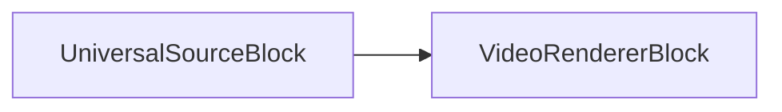

# Bloque Renderizador de Video

[Media Blocks SDK .Net](https://www.visioforge.com/media-blocks-sdk-net){ .md-button .md-button--primary target="_blank" }

## Visión General

El bloque Renderizador de Video es un componente esencial diseñado para desarrolladores que necesitan mostrar flujos de video en sus aplicaciones. Esta poderosa herramienta le permite renderizar contenido de video en áreas específicas de ventanas o pantallas a través de varias plataformas y frameworks de UI.

El bloque utiliza un control visual específico de plataforma llamado `VideoView` que aprovecha la tecnología DirectX en sistemas Windows e implementa típicamente renderizado OpenGL en otras plataformas. El SDK soporta completamente el desarrollo multiplataforma con compatibilidad para los frameworks de UI Avalonia y MAUI.

Una de las ventajas clave de este bloque es su flexibilidad - los desarrolladores pueden implementar múltiples vistas de video y renderizadores para mostrar el mismo flujo de video en diferentes ubicaciones simultáneamente, ya sea en secciones separadas de una ventana o a través de múltiples ventanas.

## Tecnologías de Renderizado

### Integración DirectX

En plataformas Windows, el Bloque Renderizador de Video se integra perfectamente con DirectX para renderizado acelerado por hardware de alto rendimiento. Esta integración proporciona varios beneficios:

- **Aceleración de hardware**: Utiliza la GPU para procesamiento y renderizado eficiente de video
- **Reproducción de baja latencia**: Minimiza el retraso entre el procesamiento de frames y la visualización
- **Compartición de superficies Direct3D**: Permite gestión eficiente de memoria y copia reducida de datos de video
- **Soporte de múltiples pantallas**: Maneja el renderizado a través de varias configuraciones de pantalla
- **Soporte para Alto DPI**: Asegura renderizado nítido en pantallas de alta resolución

El renderizador selecciona automáticamente la versión apropiada de DirectX basándose en las capacidades de su sistema, soportando DirectX 11 y DirectX 12 donde estén disponibles.

### Implementación OpenGL

Para compatibilidad multiplataforma, el Renderizador de Video usa OpenGL en Linux y sistemas macOS antiguos:

- **API de renderizado consistente**: Proporciona un enfoque unificado a través de diferentes sistemas operativos
- **Procesamiento basado en shaders**: Permite efectos de video avanzados y transformaciones de color
- **Optimización de mapeo de texturas**: Maneja eficientemente la presentación de frames de video
- **Soporte de objetos framebuffer**: Permite renderizado fuera de pantalla y composición compleja
- **Escalado acelerado por hardware**: Ofrece redimensionamiento de alta calidad con impacto mínimo en rendimiento

Las variantes OpenGL ES se utilizan en plataformas móviles para asegurar rendimiento óptimo mientras mantienen compatibilidad con el pipeline de renderizado principal.

### Soporte del Framework Metal

En plataformas Apple más nuevas (macOS, iOS, iPadOS), el Renderizador de Video puede aprovechar Metal - la API moderna de gráficos y cómputo de Apple:

- **Integración nativa con Apple**: Optimizado específicamente para hardware Apple
- **Sobrecarga de CPU reducida**: Minimiza cuellos de botella de procesamiento comparado con OpenGL
- **Ejecución paralela mejorada**: Mejor utilización de procesadores multi-núcleo
- **Ancho de banda de memoria mejorado**: Manejo más eficiente de frames de video
- **Integración con la cadena de herramientas de video de Apple**: Interoperabilidad perfecta con AV Foundation y Core Video

El renderizador selecciona automáticamente Metal cuando está disponible en plataformas Apple, recurriendo a OpenGL cuando es necesario en versiones anteriores.

## Especificaciones Técnicas

### Información del Bloque

Nombre: VideoRendererBlock

| Dirección del pin | Tipo de medio | Cantidad de pines |
| --- | :---: | :---: |
| Entrada de video | video sin comprimir | uno o más |

## Guía de Implementación

### Configurando su Vista de Video

El componente Video View sirve como el elemento visual donde se mostrará su contenido de video. Necesita integrarse correctamente en el diseño de UI de su aplicación.

### Creando un Pipeline Básico

A continuación se muestra una representación visual de una implementación simple de pipeline:



Este diagrama ilustra cómo un bloque fuente se conecta directamente al renderizador de video para crear un sistema funcional de reproducción de video.

### Ejemplo de Implementación de Código

El siguiente ejemplo demuestra cómo implementar un pipeline básico de renderizado de video:

```csharp
// Crear un pipeline
var pipeline = new MediaBlocksPipeline();

// crear un bloque fuente
var filename = "test.mp4";
var fileSource = new UniversalSourceBlock(await UniversalSourceSettings.CreateAsync(new Uri(filename)));

// crear un bloque renderizador de video
var videoRenderer = new VideoRendererBlock(pipeline, VideoView1);

// conectar los bloques
pipeline.Connect(fileSource.VideoOutput, videoRenderer.Input);

// iniciar el pipeline
await pipeline.StartAsync();
```

## Compatibilidad de Plataformas

El bloque Renderizador de Video ofrece amplia compatibilidad a través de múltiples sistemas operativos y dispositivos:

- Windows
- macOS
- Linux
- iOS
- Android

Esto lo hace una solución ideal para desarrolladores que construyen aplicaciones multiplataforma que requieren capacidades consistentes de renderizado de video.
