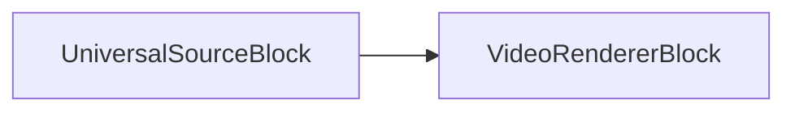

# Bloc moteur de rendu vidéo

[Media Blocks SDK .Net](https://www.visioforge.com/media-blocks-sdk-net){ .md-button .md-button--primary target="_blank" }

## Vue d'ensemble

Le bloc moteur de rendu vidéo est un composant essentiel conçu pour les développeurs qui doivent afficher des flux vidéo dans leurs applications. Cet outil puissant vous permet de faire le rendu du contenu vidéo sur des zones spécifiques de fenêtres ou d'écrans sur diverses plateformes et frameworks d'interface utilisateur.

Le bloc utilise un contrôle visuel spécifique à la plateforme appelé `VideoView` qui tire parti de la technologie DirectX sur les systèmes Windows et implémente généralement le rendu OpenGL sur les autres plateformes. Le SDK prend pleinement en charge le développement multiplateforme avec une compatibilité aussi bien pour les frameworks d'interface utilisateur Avalonia que MAUI.

L'un des principaux avantages de ce bloc est sa flexibilité — les développeurs peuvent implémenter plusieurs vues vidéo et moteurs de rendu pour afficher le même flux vidéo à différents endroits simultanément, que ce soit dans des sections distinctes d'une fenêtre ou à travers plusieurs fenêtres.

## Technologies de rendu

### Intégration DirectX

Sur les plateformes Windows, le bloc moteur de rendu vidéo s'intègre parfaitement à DirectX pour un rendu haute performance accéléré matériellement. Cette intégration offre plusieurs avantages :

- **Accélération matérielle** : utilise le GPU pour un traitement et un rendu vidéo efficaces
- **Lecture à faible latence** : minimise le délai entre le traitement de l'image et l'affichage
- **Partage de surfaces Direct3D** : permet une gestion efficace de la mémoire et réduit la copie des données vidéo
- **Prise en charge de plusieurs affichages** : gère le rendu sur diverses configurations d'affichage
- **Prise en charge du High DPI** : garantit un rendu net sur les écrans haute résolution

Le moteur de rendu sélectionne automatiquement la version DirectX appropriée en fonction des capacités de votre système, prenant en charge DirectX 11 et DirectX 12 lorsque disponibles.

### Implémentation OpenGL

Pour la compatibilité multiplateforme, le moteur de rendu vidéo utilise OpenGL sur Linux et sur les anciens systèmes macOS :

- **API de rendu cohérente** : offre une approche unifiée sur différents systèmes d'exploitation
- **Traitement basé sur des shaders** : permet des effets vidéo avancés et des transformations de couleur
- **Optimisation de la cartographie des textures** : gère efficacement la présentation des images vidéo
- **Prise en charge des objets framebuffer** : permet le rendu hors écran et la composition complexe
- **Mise à l'échelle accélérée matériellement** : offre un redimensionnement de haute qualité avec un impact minimal sur les performances

Les variantes OpenGL ES sont utilisées sur les plateformes mobiles pour garantir des performances optimales tout en maintenant la compatibilité avec le pipeline de rendu principal.

### Prise en charge du framework Metal

Sur les plateformes Apple récentes (macOS, iOS, iPadOS), le moteur de rendu vidéo peut tirer parti de Metal — l'API graphique et de calcul moderne d'Apple :

- **Intégration native Apple** : optimisée spécifiquement pour le matériel Apple
- **Réduction de la charge CPU** : minimise les goulots d'étranglement de traitement par rapport à OpenGL
- **Exécution parallèle améliorée** : tire mieux parti des processeurs multi-cœurs
- **Bande passante mémoire améliorée** : gestion plus efficace des images vidéo
- **Intégration avec la chaîne d'outils vidéo Apple** : interopérabilité transparente avec AV Foundation et Core Video

Le moteur de rendu sélectionne automatiquement Metal lorsqu'il est disponible sur les plateformes Apple, en se rabattant sur OpenGL si nécessaire sur les versions plus anciennes.

## Spécifications techniques

### Informations sur le bloc

Nom : VideoRendererBlock

| Direction du pin | Type de média | Nombre de pins |
| --- | :---: | :---: |
| Vidéo en entrée | vidéo non compressée | un ou plusieurs |

## Guide d'implémentation

### Mise en place de votre vue vidéo

Le composant Video View sert d'élément visuel sur lequel votre contenu vidéo sera affiché. Il doit être correctement intégré dans la disposition d'interface utilisateur de votre application.

### Création d'un pipeline basique

Voici une représentation visuelle d'une implémentation de pipeline simple :



Ce diagramme illustre comment un bloc source se connecte directement au moteur de rendu vidéo pour créer un système de lecture vidéo fonctionnel.

### Exemple d'implémentation de code

L'exemple suivant montre comment implémenter un pipeline de rendu vidéo basique :

```csharp
// Créer un pipeline
var pipeline = new MediaBlocksPipeline();

// créer un bloc source
var filename = "test.mp4";
var fileSource = new UniversalSourceBlock(await UniversalSourceSettings.CreateAsync(new Uri(filename)));

// créer un bloc moteur de rendu vidéo
var videoRenderer = new VideoRendererBlock(pipeline, VideoView1);

// connecter les blocs
pipeline.Connect(fileSource.VideoOutput, videoRenderer.Input);

// démarrer le pipeline
await pipeline.StartAsync();
```

## Compatibilité avec les plateformes

Le bloc moteur de rendu vidéo offre une large compatibilité avec de multiples systèmes d'exploitation et appareils :

- Windows
- macOS
- Linux
- iOS
- Android

Cela en fait une solution idéale pour les développeurs construisant des applications multiplateformes qui nécessitent des capacités de rendu vidéo cohérentes.
