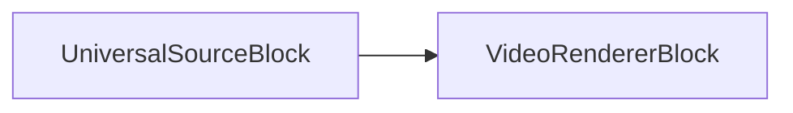

# Video Renderer Block

[Media Blocks SDK .Net](https://www.visioforge.com/media-blocks-sdk-net){ .md-button .md-button--primary target="_blank" }

## Overview

The Video Renderer block is an essential component designed for developers who need to display video streams in their applications. This powerful tool enables you to render video content on specific areas of windows or screens across various platforms and UI frameworks.

The block utilizes a platform-specific visual control called `VideoView` which leverages DirectX technology on Windows systems and typically implements OpenGL rendering on other platforms. The SDK fully supports cross-platform development with compatibility for both Avalonia and MAUI UI frameworks.

One of the key advantages of this block is its flexibility - developers can implement multiple video views and renderers to display the same video stream in different locations simultaneously, whether in separate sections of a window or across multiple windows.

## Rendering Technologies

### DirectX Integration

On Windows platforms, the Video Renderer Block seamlessly integrates with DirectX for high-performance hardware-accelerated rendering. This integration provides several benefits:

- **Hardware acceleration**: Utilizes the GPU for efficient video processing and rendering
- **Low-latency playback**: Minimizes delay between frame processing and display
- **Direct3D surface sharing**: Enables efficient memory management and reduced copying of video data
- **Multiple display support**: Handles rendering across various display configurations
- **Support for High DPI**: Ensures crisp rendering on high-resolution displays

The renderer automatically selects the appropriate DirectX version based on your system capabilities, supporting DirectX 11 and DirectX 12 where available.

### OpenGL Implementation

For cross-platform compatibility, the Video Renderer uses OpenGL on Linux and older macOS systems:

- **Consistent rendering API**: Provides a unified approach across different operating systems
- **Shader-based processing**: Enables advanced video effects and color transformations
- **Texture mapping optimization**: Efficiently handles video frame presentation
- **Framebuffer objects support**: Allows for off-screen rendering and complex composition
- **Hardware-accelerated scaling**: Delivers high-quality resizing with minimal performance impact

OpenGL ES variants are utilized on mobile platforms to ensure optimal performance while maintaining compatibility with the core rendering pipeline.

### Metal Framework Support

On newer Apple platforms (macOS, iOS, iPadOS), the Video Renderer can leverage Metal - Apple's modern graphics and compute API:

- **Native Apple integration**: Optimized specifically for Apple hardware
- **Reduced CPU overhead**: Minimizes processing bottlenecks compared to OpenGL
- **Enhanced parallel execution**: Better utilizes multi-core processors
- **Improved memory bandwidth**: More efficient video frame handling
- **Integration with Apple's video toolchain**: Seamless interoperability with AV Foundation and Core Video

The renderer automatically selects Metal when available on Apple platforms, falling back to OpenGL when necessary on older versions.

## Technical Specifications

### Block Information

Name: VideoRendererBlock

| Pin direction | Media type | Pins count |
| --- | :---: | :---: |
| Input video | uncompressed video | one or more |

## Implementation Guide

### Setting Up Your Video View

The Video View component serves as the visual element where your video content will be displayed. It needs to be properly integrated into your application's UI layout.

### Creating a Basic Pipeline

Below is a visual representation of a simple pipeline implementation:



This diagram illustrates how a source block connects directly to the video renderer to create a functional video playback system.

### Code Implementation Example

The following sample demonstrates how to implement a basic video rendering pipeline:

```csharp
// Create a pipeline
var pipeline = new MediaBlocksPipeline();

// create a source block
var filename = "test.mp4";
var fileSource = new UniversalSourceBlock(await UniversalSourceSettings.CreateAsync(new Uri(filename)));

// create a video renderer block
var videoRenderer = new VideoRendererBlock(pipeline, VideoView1);

// connect the blocks
pipeline.Connect(fileSource.VideoOutput, videoRenderer.Input);

// start the pipeline
await pipeline.StartAsync();
```

## Platform Compatibility

The Video Renderer block offers wide compatibility across multiple operating systems and devices:

- Windows
- macOS
- Linux
- iOS
- Android

This makes it an ideal solution for developers building cross-platform applications that require consistent video rendering capabilities.
