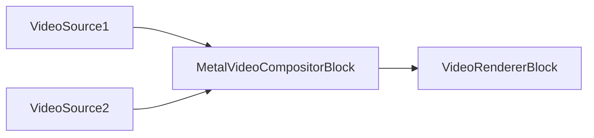

# Bloques de plataforma Apple - VisioForge Media Blocks SDK .Net

[Media Blocks SDK .Net](https://www.visioforge.com/media-blocks-sdk-net){ .md-button .md-button--primary target="_blank" }

Esta sección cubre los MediaBlocks específicamente optimizados para plataformas Apple (iOS, macOS, tvOS).

## Bloques disponibles

### Fuentes de audio

- **OSXAudioSourceBlock**: captura de audio en macOS mediante Core Audio
  - Consulte la [documentación de fuentes de audio](../Sources/index.md#system-audio-source)
  
- **IOSAudioSourceBlock**: captura de audio en iOS
  - Consulte la [documentación de fuentes de audio](../Sources/index.md#system-audio-source)

### Salidas de audio

- **OSXAudioSinkBlock**: reproducción de audio en macOS
  - Consulte la [documentación de renderizado de audio](../AudioRendering/index.md)
  
- **IOSAudioSinkBlock**: reproducción de audio en iOS
  - Consulte la [documentación de renderizado de audio](../AudioRendering/index.md)

### Fuentes de video

- **IOSVideoSourceBlock**: captura desde la cámara de iOS
  - Consulte la [documentación de fuentes de video](../Sources/index.md#system-video-source)

### Codificadores de video

- **AppleProResEncoderBlock**: códec profesional de video Apple ProRes
  - Consulte la [documentación del codificador ProRes](../VideoEncoders/index.md#apple-prores-encoder)

### Procesamiento de video

- **MetalVideoCompositorBlock**: compositor de video multi-entrada acelerado por GPU mediante Apple Metal

## Metal Video Compositor

### Metal Video Compositor Block

El `MetalVideoCompositorBlock` compone varios flujos de video en tiempo real usando el framework de GPU Apple Metal. Cada flujo de entrada tiene posición, tamaño, z-order, alfa y operador de mezcla configurables. El bloque produce una única salida de video BGRA.

#### Información del bloque

Nombre: MetalVideoCompositorBlock.

| Dirección del pin | Tipo de medio | Cantidad de pines |
| --- | :---: | :---: |
| Entrada de video | Video sin comprimir | N (uno por flujo) |
| Salida de video | Video sin comprimir | 1 |

#### Configuración

El bloque acepta una instancia de `MetalVideoCompositorSettings`:

| Propiedad | Tipo | Predeterminado | Descripción |
| --- | --- | :---: | --- |
| `Width` | `int` | 1920 | Ancho de salida en píxeles |
| `Height` | `int` | 1080 | Alto de salida en píxeles |
| `FrameRate` | `VideoFrameRate` | FPS_30 | Tasa de fotogramas de salida |
| `Background` | `VideoMixerBackground` | Transparent | Modo de fondo |
| `Streams` | `List<VideoMixerStream>` | Vacío | Configuraciones de los flujos de entrada |

Cada flujo de entrada es un `MetalVideoMixerStream`:

| Propiedad | Tipo | Predeterminado | Descripción |
| --- | --- | :---: | --- |
| `Rectangle` | `Rect` | requerido | Posición y tamaño dentro del fotograma de salida |
| `ZOrder` | `uint` | requerido | Orden de apilamiento (mayor = al frente) |
| `Alpha` | `double` | 1.0 | Opacidad (0.0 transparente – 1.0 opaco) |
| `BlendOperator` | `MetalVideoMixerBlendOperator` | Over | Modo de mezcla: Source, Over o Add |
| `KeepAspectRatio` | `bool` | false | Preservar la relación de aspecto de la fuente durante el escalado |

#### El pipeline de ejemplo



#### Código de ejemplo

```csharp
var pipeline = new MediaBlocksPipeline();

// Configurar el compositor: 1920x1080 @ 30 fps
var settings = new MetalVideoCompositorSettings(1920, 1080, VideoFrameRate.FPS_30);

// Primer flujo: mitad izquierda de la pantalla
settings.AddStream(new MetalVideoMixerStream(
    rectangle: new Rect(0, 0, 960, 1080),
    zorder: 0));

// Segundo flujo: mitad derecha de la pantalla
// El constructor de Rect es (left, top, right, bottom). Para la mitad derecha de
// un canvas 1920x1080 use right=1920 y bottom=1080 — la forma anterior
// (960, 0, 960, 1080) tiene left==right y produce una caja de ancho cero.
settings.AddStream(new MetalVideoMixerStream(
    rectangle: new Rect(960, 0, 1920, 1080),
    zorder: 1));

var compositor = new MetalVideoCompositorBlock(settings);

// Renderizar la salida compuesta
var videoRenderer = new VideoRendererBlock(pipeline, VideoView1);
pipeline.Connect(compositor.Output, videoRenderer.Input);

await pipeline.StartAsync();

// En tiempo real: desvanecer el flujo 0 durante 2 segundos
compositor.StartFadeOut(settings.Streams[0].ID, TimeSpan.FromSeconds(2));
```

#### Disponibilidad

```csharp
bool available = MetalVideoCompositorBlock.IsAvailable();
```

Devuelve `true` si el plugin GStreamer `vfmetalcompositor` está disponible en el sistema actual.

#### Plataformas

macOS, iOS.

## Requisitos de plataforma

- **iOS**: iOS 12.0 o superior
- **macOS**: macOS 10.13 o superior
- **tvOS**: tvOS 12.0 o superior

## Características

- Integración nativa con los frameworks de Apple (AVFoundation, Core Audio, Core Video)
- Procesamiento acelerado por hardware en Apple Silicon y Macs Intel
- Optimizado para bajo consumo en dispositivos móviles
- Soporte para codificación ProRes de alta calidad
- Integración con los permisos de cámara y micrófono de iOS

## Código de ejemplo

### Captura desde la cámara de iOS

```csharp
var pipeline = new MediaBlocksPipeline();

// Fuente de video iOS
var videoSource = new IOSVideoSourceBlock(videoSettings);

// Procesar y mostrar
var videoRenderer = new VideoRendererBlock(pipeline, VideoView1);
pipeline.Connect(videoSource.Output, videoRenderer.Input);

await pipeline.StartAsync();
```

### Captura y reproducción de audio en macOS

```csharp
var pipeline = new MediaBlocksPipeline();

// Fuente de audio macOS
var audioSource = new OSXAudioSourceBlock(audioSettings);

// Salida de audio macOS
var audioSink = new OSXAudioSinkBlock();
pipeline.Connect(audioSource.Output, audioSink.Input);

await pipeline.StartAsync();
```

### Codificación ProRes

```csharp
var pipeline = new MediaBlocksPipeline();

var fileSource = new UniversalSourceBlock(await UniversalSourceSettings.CreateAsync(new Uri("input.mp4")));

// Codificador Apple ProRes
// AppleProResEncoderSettings expone Quality (double 0.0-1.0), Bitrate, MaxKeyframeInterval,
// MaxKeyFrameIntervalDuration, AllowFrameReordering, PreserveAlpha, Realtime — no es un enum de perfiles.
var proresSettings = new AppleProResEncoderSettings
{
    Quality = 0.8
};
var proresEncoder = new AppleProResEncoderBlock(proresSettings);
pipeline.Connect(fileSource.VideoOutput, proresEncoder.Input);

// Salida a archivo MOV
var movSink = new MOVSinkBlock(new MOVSinkSettings("output.mov"));
pipeline.Connect(proresEncoder.Output, movSink.CreateNewInput(MediaBlockPadMediaType.Video));

await pipeline.StartAsync();
```

## Plataformas

iOS, macOS, tvOS.

## Documentación relacionada

- [Sources](../Sources/index.md) — todos los bloques de fuente, incluidos los específicos de Apple
- [VideoEncoders](../VideoEncoders/index.md) — codificación de video, incluida ProRes
- [AudioRendering](../AudioRendering/index.md) — reproducción de audio
