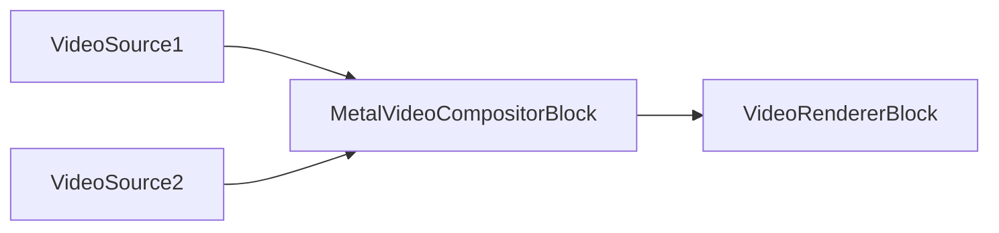
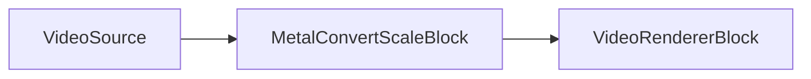
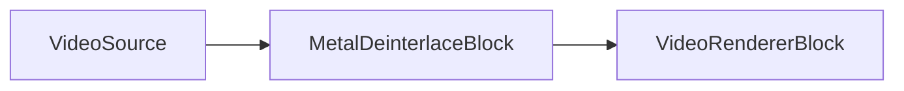
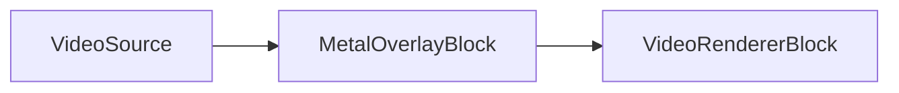
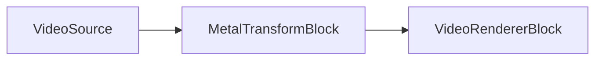

# Blocs plateforme Apple - VisioForge Media Blocks SDK .Net

[Media Blocks SDK .Net](https://www.visioforge.com/media-blocks-sdk-net){ .md-button .md-button--primary target="_blank" }

Cette section couvre les MediaBlocks spécifiquement optimisés pour les plateformes Apple (iOS, macOS, tvOS).

## Blocs disponibles

### Sources audio

- **OSXAudioSourceBlock** : capture audio macOS via Core Audio
  - Voir la [documentation des sources audio](../Sources/index.md#system-audio-source)
  
- **IOSAudioSourceBlock** : capture audio iOS
  - Voir la [documentation des sources audio](../Sources/index.md#system-audio-source)

### Puits audio

- **OSXAudioSinkBlock** : lecture audio macOS
  - Voir la [documentation du rendu audio](../AudioRendering/index.md)
  
- **IOSAudioSinkBlock** : lecture audio iOS
  - Voir la [documentation du rendu audio](../AudioRendering/index.md)

### Sources vidéo

- **IOSVideoSourceBlock** : capture caméra iOS
  - Voir la [documentation des sources vidéo](../Sources/index.md#system-video-source)

### Encodeurs vidéo

- **AppleProResEncoderBlock** : codec vidéo professionnel Apple ProRes
  - Voir la [documentation de l'encodeur ProRes](../VideoEncoders/index.md#apple-prores-encoder)

### Traitement vidéo

- **MetalVideoCompositorBlock** : compositeur vidéo multi-entrées accéléré par GPU utilisant Apple Metal
- **MetalConvertScaleBlock** : conversion de format de pixels et mise à l'échelle accélérées par GPU avec bordures de letterbox optionnelles
- **MetalDeinterlaceBlock** : désentrelacement accéléré par GPU (bob, weave, linéaire, greedy-H adaptatif au mouvement)
- **MetalOverlayBlock** : composition d'image PNG/JPEG accélérée par GPU avec positionnement et opacité ajustables
- **MetalTransformBlock** : opérations de retournement, rotation et rognage accélérées par GPU

## Compositeur vidéo Metal

### Bloc Metal Video Compositor

Le `MetalVideoCompositorBlock` compose plusieurs flux vidéo en temps réel à l'aide du framework GPU Apple Metal. Chaque flux d'entrée dispose d'une position, d'une taille, d'un z-order, d'un alpha et d'un opérateur de mélange configurables. Le bloc produit une sortie vidéo BGRA unique.

#### Informations sur le bloc

Nom : MetalVideoCompositorBlock.

| Direction du pin | Type de média | Nombre de pins |
| --- | :---: | :---: |
| Entrée vidéo | Vidéo non compressée | N (un par flux) |
| Sortie vidéo | Vidéo non compressée | 1 |

#### Paramètres

Le bloc prend une instance `MetalVideoCompositorSettings` :

| Propriété | Type | Par défaut | Description |
| --- | --- | :---: | --- |
| `Width` | `int` | 1920 | Largeur de sortie en pixels |
| `Height` | `int` | 1080 | Hauteur de sortie en pixels |
| `FrameRate` | `VideoFrameRate` | FPS_30 | Fréquence d'images de sortie |
| `Background` | `VideoMixerBackground` | Transparent | Mode d'arrière-plan |
| `Streams` | `List<VideoMixerStream>` | Vide | Configurations des flux d'entrée |

Chaque flux d'entrée est un `MetalVideoMixerStream` :

| Propriété | Type | Par défaut | Description |
| --- | --- | :---: | --- |
| `Rectangle` | `Rect` | requis | Position et taille dans l'image de sortie |
| `ZOrder` | `uint` | requis | Ordre d'empilement (plus élevé = au premier plan) |
| `Alpha` | `double` | 1.0 | Opacité (0.0 transparent – 1.0 opaque) |
| `BlendOperator` | `MetalVideoMixerBlendOperator` | Over | Mode de mélange : Source, Over ou Add |
| `KeepAspectRatio` | `bool` | false | Préserver le rapport d'aspect source lors de la mise à l'échelle |

#### Pipeline d'exemple



#### Exemple de code

```csharp
var pipeline = new MediaBlocksPipeline();

// Configurer le compositeur : 1920x1080 à 30 i/s
var settings = new MetalVideoCompositorSettings(1920, 1080, VideoFrameRate.FPS_30);

// Premier flux : moitié gauche de l'écran
settings.AddStream(new MetalVideoMixerStream(
    rectangle: new Rect(0, 0, 960, 1080),
    zorder: 0));

// Deuxième flux : moitié droite de l'écran
// Le constructeur de Rect est (left, top, right, bottom). Pour la moitié droite
// d'un canevas 1920x1080, utilisez right=1920 et bottom=1080 — la forme
// précédente (960, 0, 960, 1080) a left==right et produit une boîte de largeur nulle.
settings.AddStream(new MetalVideoMixerStream(
    rectangle: new Rect(960, 0, 1920, 1080),
    zorder: 1));

var compositor = new MetalVideoCompositorBlock(settings);

// Effectuer le rendu de la sortie composée
var videoRenderer = new VideoRendererBlock(pipeline, VideoView1);
pipeline.Connect(compositor.Output, videoRenderer.Input);

await pipeline.StartAsync();

// Temps réel : faire disparaître progressivement le flux 0 sur 2 secondes
compositor.StartFadeOut(settings.Streams[0].ID, TimeSpan.FromSeconds(2));
```

#### Disponibilité

```csharp
bool available = MetalVideoCompositorBlock.IsAvailable();
```

Renvoie `true` si le plugin GStreamer `vfmetalcompositor` est disponible sur le système courant.

#### Plateformes

macOS, iOS.

## Metal Convert/Scale

### Bloc Metal Convert/Scale

Le `MetalConvertScaleBlock` effectue la conversion de format de pixels et la mise à l'échelle en une seule passe GPU à l'aide du framework Apple Metal. Il peut éventuellement ajouter des bordures de letterbox/pillarbox pour préserver le rapport d'aspect source.

#### Informations sur le bloc

Nom : MetalConvertScaleBlock.

| Direction du pin | Type de média | Nombre de pins |
| --- | :---: | :---: |
| Entrée vidéo | Vidéo non compressée | 1 |
| Sortie vidéo | Vidéo non compressée | 1 |

#### Paramètres

Le bloc prend une instance `MetalConvertScaleSettings` :

| Propriété | Type | Par défaut | Description |
| --- | --- | :---: | --- |
| `Method` | `MetalScalingMethod` | Bilinear | Interpolation de mise à l'échelle : `Bilinear` ou `Nearest` |
| `AddBorders` | `bool` | false | Ajouter des bordures de letterbox/pillarbox pour préserver le rapport d'aspect |
| `BorderColor` | `uint` | 0xFF000000 | Couleur de bordure au format ARGB (noir opaque) |

#### Pipeline d'exemple



#### Exemple de code

```csharp
var pipeline = new MediaBlocksPipeline();

var videoSource = new IOSVideoSourceBlock(videoSettings);

// Mise à l'échelle bilinéaire avec bordures de letterbox
var settings = new MetalConvertScaleSettings
{
    Method = MetalScalingMethod.Bilinear,
    AddBorders = true,
    BorderColor = 0xFF000000
};
var convertScale = new MetalConvertScaleBlock(settings);
pipeline.Connect(videoSource.Output, convertScale.Input);

var videoRenderer = new VideoRendererBlock(pipeline, VideoView1);
pipeline.Connect(convertScale.Output, videoRenderer.Input);

await pipeline.StartAsync();
```

#### Disponibilité

```csharp
bool available = MetalConvertScaleBlock.IsAvailable();
```

Renvoie `true` si le plugin GStreamer `vfmetalconvertscale` est disponible sur le système courant.

#### Plateformes

macOS, iOS.

## Metal Deinterlace

### Bloc Metal Deinterlace

Le `MetalDeinterlaceBlock` supprime les artefacts d'entrelacement sur le GPU à l'aide du framework Apple Metal. Il prend en charge les algorithmes bob, weave, linéaire et greedy-H (adaptatif au mouvement).

#### Informations sur le bloc

Nom : MetalDeinterlaceBlock.

| Direction du pin | Type de média | Nombre de pins |
| --- | :---: | :---: |
| Entrée vidéo | Vidéo non compressée | 1 |
| Sortie vidéo | Vidéo non compressée | 1 |

#### Paramètres

Le bloc prend une instance `MetalDeinterlaceSettings` :

| Propriété | Type | Par défaut | Description |
| --- | --- | :---: | --- |
| `Method` | `MetalDeinterlaceMethod` | Bob | Algorithme : `Bob`, `Weave`, `Linear` ou `GreedyH` |
| `FieldLayout` | `MetalDeinterlaceFieldLayout` | Auto | Ordre des trames : `Auto`, `TopFieldFirst` ou `BottomFieldFirst` |
| `MotionThreshold` | `double` | 0.1 | Seuil de détection de mouvement pour l'algorithme greedy-H (0.0–1.0) |

#### Pipeline d'exemple



#### Exemple de code

```csharp
var pipeline = new MediaBlocksPipeline();

var videoSource = new IOSVideoSourceBlock(videoSettings);

// Désentrelacement greedy-H adaptatif au mouvement
var settings = new MetalDeinterlaceSettings
{
    Method = MetalDeinterlaceMethod.GreedyH,
    FieldLayout = MetalDeinterlaceFieldLayout.Auto,
    MotionThreshold = 0.1
};
var deinterlace = new MetalDeinterlaceBlock(settings);
pipeline.Connect(videoSource.Output, deinterlace.Input);

var videoRenderer = new VideoRendererBlock(pipeline, VideoView1);
pipeline.Connect(deinterlace.Output, videoRenderer.Input);

await pipeline.StartAsync();
```

#### Disponibilité

```csharp
bool available = MetalDeinterlaceBlock.IsAvailable();
```

Renvoie `true` si le plugin GStreamer `vfmetaldeinterlace` est disponible sur le système courant.

#### Plateformes

macOS, iOS.

## Metal Overlay

### Bloc Metal Overlay

Le `MetalOverlayBlock` compose une image PNG ou JPEG sur les images vidéo sur le GPU à l'aide du framework Apple Metal. L'overlay peut être positionné en pixels absolus ou en fraction de la taille de l'image, avec une opacité ajustable.

#### Informations sur le bloc

Nom : MetalOverlayBlock.

| Direction du pin | Type de média | Nombre de pins |
| --- | :---: | :---: |
| Entrée vidéo | Vidéo non compressée | 1 |
| Sortie vidéo | Vidéo non compressée | 1 |

#### Paramètres

Le bloc prend une instance `MetalOverlaySettings` :

| Propriété | Type | Par défaut | Description |
| --- | --- | :---: | --- |
| `Location` | `string` | null | Chemin vers l'image d'overlay (PNG ou JPEG) ; null désactive l'overlay |
| `X` | `int` | 0 | Position X en pixels (ignorée lorsque `RelativeX` n'est pas -1) |
| `Y` | `int` | 0 | Position Y en pixels (ignorée lorsque `RelativeY` n'est pas -1) |
| `Width` | `int` | 0 | Largeur de l'overlay en pixels (0 = largeur de l'image d'origine) |
| `Height` | `int` | 0 | Hauteur de l'overlay en pixels (0 = hauteur de l'image d'origine) |
| `Alpha` | `double` | 1.0 | Opacité (0.0 transparent – 1.0 opaque) |
| `RelativeX` | `double` | -1.0 | X relatif en fraction de la largeur vidéo ; -1.0 utilise le pixel `X` |
| `RelativeY` | `double` | -1.0 | Y relatif en fraction de la hauteur vidéo ; -1.0 utilise le pixel `Y` |

#### Pipeline d'exemple



#### Exemple de code

```csharp
var pipeline = new MediaBlocksPipeline();

var videoSource = new IOSVideoSourceBlock(videoSettings);

// Logo en haut à gauche avec 80 % d'opacité
var settings = new MetalOverlaySettings
{
    Location = "logo.png",
    X = 20,
    Y = 20,
    Alpha = 0.8
};
var overlay = new MetalOverlayBlock(settings);
pipeline.Connect(videoSource.Output, overlay.Input);

var videoRenderer = new VideoRendererBlock(pipeline, VideoView1);
pipeline.Connect(overlay.Output, videoRenderer.Input);

await pipeline.StartAsync();
```

#### Disponibilité

```csharp
bool available = MetalOverlayBlock.IsAvailable();
```

Renvoie `true` si le plugin GStreamer `vfmetaloverlay` est disponible sur le système courant.

#### Plateformes

macOS, iOS.

## Metal Transform

### Bloc Metal Transform

Le `MetalTransformBlock` applique des opérations de retournement, de rotation et de rognage sur le GPU à l'aide du framework Apple Metal.

#### Informations sur le bloc

Nom : MetalTransformBlock.

| Direction du pin | Type de média | Nombre de pins |
| --- | :---: | :---: |
| Entrée vidéo | Vidéo non compressée | 1 |
| Sortie vidéo | Vidéo non compressée | 1 |

#### Paramètres

Le bloc prend une instance `MetalTransformSettings` :

| Propriété | Type | Par défaut | Description |
| --- | --- | :---: | --- |
| `Method` | `MetalTransformMethod` | None | Rotation/retournement : `None`, `Clockwise`, `Rotate180`, `CounterClockwise`, `HorizontalFlip`, `VerticalFlip`, `UpperLeftDiagonal` ou `UpperRightDiagonal` |
| `CropTop` | `int` | 0 | Pixels à rogner en haut |
| `CropBottom` | `int` | 0 | Pixels à rogner en bas |
| `CropLeft` | `int` | 0 | Pixels à rogner à gauche |
| `CropRight` | `int` | 0 | Pixels à rogner à droite |

#### Pipeline d'exemple



#### Exemple de code

```csharp
var pipeline = new MediaBlocksPipeline();

var videoSource = new IOSVideoSourceBlock(videoSettings);

// Rotation de 90 degrés dans le sens horaire et rognage de 10 px de chaque côté
var settings = new MetalTransformSettings
{
    Method = MetalTransformMethod.Clockwise,
    CropLeft = 10,
    CropRight = 10
};
var transform = new MetalTransformBlock(settings);
pipeline.Connect(videoSource.Output, transform.Input);

var videoRenderer = new VideoRendererBlock(pipeline, VideoView1);
pipeline.Connect(transform.Output, videoRenderer.Input);

await pipeline.StartAsync();
```

#### Disponibilité

```csharp
bool available = MetalTransformBlock.IsAvailable();
```

Renvoie `true` si le plugin GStreamer `vfmetaltransform` est disponible sur le système courant.

#### Plateformes

macOS, iOS.

## Exigences de plateforme

- **iOS** : iOS 12.0 ou ultérieur
- **macOS** : macOS 10.13 ou ultérieur
- **tvOS** : tvOS 12.0 ou ultérieur

## Fonctionnalités

- Intégration native avec les frameworks Apple (AVFoundation, Core Audio, Core Video)
- Traitement accéléré matériellement sur Apple Silicon et Mac Intel
- Optimisé pour une faible consommation d'énergie sur les appareils mobiles
- Prise en charge de l'encodage ProRes haute qualité
- Intégration avec les autorisations caméra et microphone iOS

## Exemple de code

### Capture caméra iOS

```csharp
var pipeline = new MediaBlocksPipeline();

// Source vidéo iOS
var videoSource = new IOSVideoSourceBlock(videoSettings);

// Traiter et afficher
var videoRenderer = new VideoRendererBlock(pipeline, VideoView1);
pipeline.Connect(videoSource.Output, videoRenderer.Input);

await pipeline.StartAsync();
```

### Capture et lecture audio macOS

```csharp
var pipeline = new MediaBlocksPipeline();

// Source audio macOS
var audioSource = new OSXAudioSourceBlock(audioSettings);

// Puits audio macOS
var audioSink = new OSXAudioSinkBlock();
pipeline.Connect(audioSource.Output, audioSink.Input);

await pipeline.StartAsync();
```

### Encodage ProRes

```csharp
var pipeline = new MediaBlocksPipeline();

var fileSource = new UniversalSourceBlock(await UniversalSourceSettings.CreateAsync("input.mp4"));

// Encodeur Apple ProRes
// AppleProResEncoderSettings expose Quality (double 0.0-1.0), Bitrate, MaxKeyframeInterval,
// MaxKeyFrameIntervalDuration, AllowFrameReordering, PreserveAlpha, Realtime — pas une énumération de profils nommée.
var proresSettings = new AppleProResEncoderSettings
{
    Quality = 0.8
};
var proresEncoder = new AppleProResEncoderBlock(proresSettings);
pipeline.Connect(fileSource.VideoOutput, proresEncoder.Input);

// Sortie vers un fichier MOV
var movSink = new MOVSinkBlock(new MOVSinkSettings("output.mov"));
pipeline.Connect(proresEncoder.Output, movSink.CreateNewInput(MediaBlockPadMediaType.Video));

await pipeline.StartAsync();
```

## Plateformes

iOS, macOS, tvOS.

## Documentation connexe

- [Sources](../Sources/index.md) - Tous les blocs source, y compris ceux spécifiques à Apple
- [VideoEncoders](../VideoEncoders/index.md) - Encodage vidéo dont ProRes
- [AudioRendering](../AudioRendering/index.md) - Lecture audio
