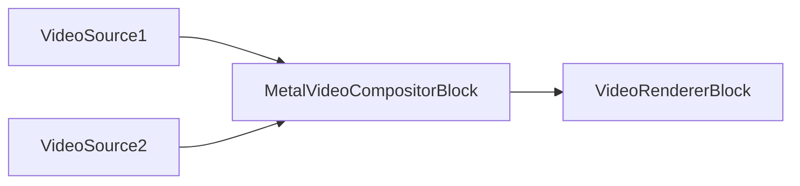
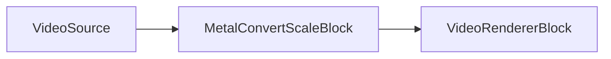
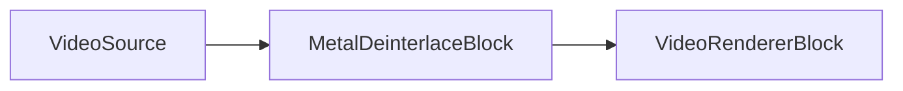
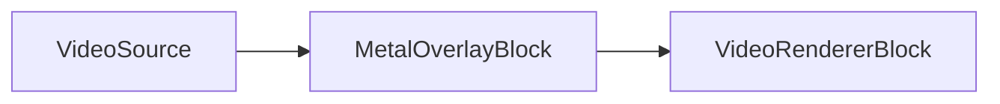
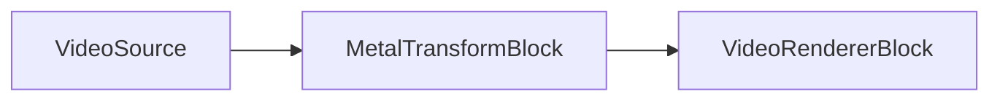

# Apple Platform Blocks - VisioForge Media Blocks SDK .Net

[Media Blocks SDK .Net](https://www.visioforge.com/media-blocks-sdk-net){ .md-button .md-button--primary target="_blank" }

This section covers MediaBlocks specifically optimized for Apple platforms (iOS, macOS, tvOS).

## Available Blocks

### Audio Sources

- **OSXAudioSourceBlock**: macOS audio capture using Core Audio
  - See [Audio Sources Documentation](../Sources/index.md#system-audio-source)
  
- **IOSAudioSourceBlock**: iOS audio capture
  - See [Audio Sources Documentation](../Sources/index.md#system-audio-source)

### Audio Sinks

- **OSXAudioSinkBlock**: macOS audio playback
  - See [Audio Rendering Documentation](../AudioRendering/index.md)
  
- **IOSAudioSinkBlock**: iOS audio playback
  - See [Audio Rendering Documentation](../AudioRendering/index.md)

### Video Sources

- **IOSVideoSourceBlock**: iOS camera capture
  - See [Video Sources Documentation](../Sources/index.md#system-video-source)

### Video Encoders

- **AppleProResEncoderBlock**: Apple ProRes professional video codec
  - See [ProRes Encoder Documentation](../VideoEncoders/index.md#apple-prores-encoder)

### Video Processing

- **MetalVideoCompositorBlock**: GPU-accelerated multi-input video compositor using Apple Metal
- **MetalConvertScaleBlock**: GPU-accelerated format conversion and scaling using Apple Metal
- **MetalDeinterlaceBlock**: GPU-accelerated deinterlacing using Apple Metal
- **MetalOverlayBlock**: GPU-accelerated image overlay using Apple Metal
- **MetalTransformBlock**: GPU-accelerated flip, rotate, and crop using Apple Metal

## Metal Video Compositor

### Metal Video Compositor Block

The `MetalVideoCompositorBlock` composites multiple video streams in real time using the Apple Metal GPU framework. Each input stream has configurable position, size, z-order, alpha, and blend operator. The block produces a single BGRA video output.

#### Block info

Name: MetalVideoCompositorBlock.

| Pin direction | Media type | Pins count |
| --- | :---: | :---: |
| Input video | Uncompressed video | N (one per stream) |
| Output video | Uncompressed video | 1 |

#### Settings

The block takes a `MetalVideoCompositorSettings` instance:

| Property | Type | Default | Description |
| --- | --- | :---: | --- |
| `Width` | `int` | 1920 | Output width in pixels |
| `Height` | `int` | 1080 | Output height in pixels |
| `FrameRate` | `VideoFrameRate` | FPS_30 | Output frame rate |
| `Background` | `VideoMixerBackground` | Transparent | Background mode |
| `Streams` | `List<VideoMixerStream>` | Empty | Input stream configurations |

Each input stream is a `MetalVideoMixerStream`:

| Property | Type | Default | Description |
| --- | --- | :---: | --- |
| `Rectangle` | `Rect` | required | Position and size within the output frame |
| `ZOrder` | `uint` | required | Stacking order (higher = in front) |
| `Alpha` | `double` | 1.0 | Opacity (0.0 transparent – 1.0 opaque) |
| `BlendOperator` | `MetalVideoMixerBlendOperator` | Over | Blend mode: Source, Over, or Add |
| `KeepAspectRatio` | `bool` | false | Preserve source aspect ratio during scaling |

#### The sample pipeline



#### Sample code

```csharp
var pipeline = new MediaBlocksPipeline();

// Configure compositor: 1920x1080 @ 30fps
var settings = new MetalVideoCompositorSettings(1920, 1080, VideoFrameRate.FPS_30);

// First stream: left half of screen
settings.AddStream(new MetalVideoMixerStream(
    rectangle: new Rect(0, 0, 960, 1080),
    zorder: 0));

// Second stream: right half of screen
// Rect ctor is (left, top, right, bottom). For the right half of a 1920x1080
// canvas use right=1920 and bottom=1080 — the previous form (960, 0, 960, 1080)
// has left==right and produces a zero-width box.
settings.AddStream(new MetalVideoMixerStream(
    rectangle: new Rect(960, 0, 1920, 1080),
    zorder: 1));

var compositor = new MetalVideoCompositorBlock(settings);

// Render composited output
var videoRenderer = new VideoRendererBlock(pipeline, VideoView1);
pipeline.Connect(compositor.Output, videoRenderer.Input);

await pipeline.StartAsync();

// Real-time: fade out stream 0 over 2 seconds
compositor.StartFadeOut(settings.Streams[0].ID, TimeSpan.FromSeconds(2));
```

#### Availability

```csharp
bool available = MetalVideoCompositorBlock.IsAvailable();
```

Returns `true` if the `vfmetalcompositor` GStreamer plugin is available on the current system.

#### Platforms

macOS, iOS.

## Metal Convert/Scale

### Metal Convert/Scale Block

The `MetalConvertScaleBlock` performs pixel-format conversion and scaling in a single GPU pass using the Apple Metal framework. It can optionally add letterbox/pillarbox borders to preserve the source aspect ratio.

#### Block info

Name: MetalConvertScaleBlock.

| Pin direction | Media type | Pins count |
| --- | :---: | :---: |
| Input video | Uncompressed video | 1 |
| Output video | Uncompressed video | 1 |

#### Settings

The block takes a `MetalConvertScaleSettings` instance:

| Property | Type | Default | Description |
| --- | --- | :---: | --- |
| `Method` | `MetalScalingMethod` | Bilinear | Scaling interpolation: `Bilinear` or `Nearest` |
| `AddBorders` | `bool` | false | Add letterbox/pillarbox borders to preserve aspect ratio |
| `BorderColor` | `uint` | 0xFF000000 | Border color in ARGB format (opaque black) |

#### The sample pipeline



#### Sample code

```csharp
var pipeline = new MediaBlocksPipeline();

var videoSource = new IOSVideoSourceBlock(videoSettings);

// Bilinear scaling with letterbox borders
var settings = new MetalConvertScaleSettings
{
    Method = MetalScalingMethod.Bilinear,
    AddBorders = true,
    BorderColor = 0xFF000000
};
var convertScale = new MetalConvertScaleBlock(settings);
pipeline.Connect(videoSource.Output, convertScale.Input);

var videoRenderer = new VideoRendererBlock(pipeline, VideoView1);
pipeline.Connect(convertScale.Output, videoRenderer.Input);

await pipeline.StartAsync();
```

#### Availability

```csharp
bool available = MetalConvertScaleBlock.IsAvailable();
```

Returns `true` if the `vfmetalconvertscale` GStreamer plugin is available on the current system.

#### Platforms

macOS, iOS.

## Metal Deinterlace

### Metal Deinterlace Block

The `MetalDeinterlaceBlock` removes interlacing artifacts on the GPU using the Apple Metal framework. It supports bob, weave, linear, and greedy-H (motion-adaptive) algorithms.

#### Block info

Name: MetalDeinterlaceBlock.

| Pin direction | Media type | Pins count |
| --- | :---: | :---: |
| Input video | Uncompressed video | 1 |
| Output video | Uncompressed video | 1 |

#### Settings

The block takes a `MetalDeinterlaceSettings` instance:

| Property | Type | Default | Description |
| --- | --- | :---: | --- |
| `Method` | `MetalDeinterlaceMethod` | Bob | Algorithm: `Bob`, `Weave`, `Linear`, or `GreedyH` |
| `FieldLayout` | `MetalDeinterlaceFieldLayout` | Auto | Field order: `Auto`, `TopFieldFirst`, or `BottomFieldFirst` |
| `MotionThreshold` | `double` | 0.1 | Motion detection threshold for the greedy-H algorithm (0.0–1.0) |

#### The sample pipeline



#### Sample code

```csharp
var pipeline = new MediaBlocksPipeline();

var videoSource = new IOSVideoSourceBlock(videoSettings);

// Motion-adaptive greedy-H deinterlacing
var settings = new MetalDeinterlaceSettings
{
    Method = MetalDeinterlaceMethod.GreedyH,
    FieldLayout = MetalDeinterlaceFieldLayout.Auto,
    MotionThreshold = 0.1
};
var deinterlace = new MetalDeinterlaceBlock(settings);
pipeline.Connect(videoSource.Output, deinterlace.Input);

var videoRenderer = new VideoRendererBlock(pipeline, VideoView1);
pipeline.Connect(deinterlace.Output, videoRenderer.Input);

await pipeline.StartAsync();
```

#### Availability

```csharp
bool available = MetalDeinterlaceBlock.IsAvailable();
```

Returns `true` if the `vfmetaldeinterlace` GStreamer plugin is available on the current system.

#### Platforms

macOS, iOS.

## Metal Overlay

### Metal Overlay Block

The `MetalOverlayBlock` composites a PNG or JPEG image onto video frames on the GPU using the Apple Metal framework. The overlay can be positioned in absolute pixels or as a fraction of the frame size, with adjustable opacity.

#### Block info

Name: MetalOverlayBlock.

| Pin direction | Media type | Pins count |
| --- | :---: | :---: |
| Input video | Uncompressed video | 1 |
| Output video | Uncompressed video | 1 |

#### Settings

The block takes a `MetalOverlaySettings` instance:

| Property | Type | Default | Description |
| --- | --- | :---: | --- |
| `Location` | `string` | null | Path to the overlay image (PNG or JPEG); null disables the overlay |
| `X` | `int` | 0 | X position in pixels (ignored when `RelativeX` is not -1) |
| `Y` | `int` | 0 | Y position in pixels (ignored when `RelativeY` is not -1) |
| `Width` | `int` | 0 | Overlay width in pixels (0 = original image width) |
| `Height` | `int` | 0 | Overlay height in pixels (0 = original image height) |
| `Alpha` | `double` | 1.0 | Opacity (0.0 transparent – 1.0 opaque) |
| `RelativeX` | `double` | -1.0 | Relative X as a fraction of video width; -1.0 uses pixel `X` |
| `RelativeY` | `double` | -1.0 | Relative Y as a fraction of video height; -1.0 uses pixel `Y` |

#### The sample pipeline



#### Sample code

```csharp
var pipeline = new MediaBlocksPipeline();

var videoSource = new IOSVideoSourceBlock(videoSettings);

// Logo at top-left with 80% opacity
var settings = new MetalOverlaySettings
{
    Location = "logo.png",
    X = 20,
    Y = 20,
    Alpha = 0.8
};
var overlay = new MetalOverlayBlock(settings);
pipeline.Connect(videoSource.Output, overlay.Input);

var videoRenderer = new VideoRendererBlock(pipeline, VideoView1);
pipeline.Connect(overlay.Output, videoRenderer.Input);

await pipeline.StartAsync();
```

#### Availability

```csharp
bool available = MetalOverlayBlock.IsAvailable();
```

Returns `true` if the `vfmetaloverlay` GStreamer plugin is available on the current system.

#### Platforms

macOS, iOS.

## Metal Transform

### Metal Transform Block

The `MetalTransformBlock` applies flip, rotate, and crop operations on the GPU using the Apple Metal framework.

#### Block info

Name: MetalTransformBlock.

| Pin direction | Media type | Pins count |
| --- | :---: | :---: |
| Input video | Uncompressed video | 1 |
| Output video | Uncompressed video | 1 |

#### Settings

The block takes a `MetalTransformSettings` instance:

| Property | Type | Default | Description |
| --- | --- | :---: | --- |
| `Method` | `MetalTransformMethod` | None | Rotation/flip: `None`, `Clockwise`, `Rotate180`, `CounterClockwise`, `HorizontalFlip`, `VerticalFlip`, `UpperLeftDiagonal`, or `UpperRightDiagonal` |
| `CropTop` | `int` | 0 | Pixels to crop from the top |
| `CropBottom` | `int` | 0 | Pixels to crop from the bottom |
| `CropLeft` | `int` | 0 | Pixels to crop from the left |
| `CropRight` | `int` | 0 | Pixels to crop from the right |

#### The sample pipeline



#### Sample code

```csharp
var pipeline = new MediaBlocksPipeline();

var videoSource = new IOSVideoSourceBlock(videoSettings);

// Rotate 90 degrees clockwise and crop 10px from each side
var settings = new MetalTransformSettings
{
    Method = MetalTransformMethod.Clockwise,
    CropLeft = 10,
    CropRight = 10
};
var transform = new MetalTransformBlock(settings);
pipeline.Connect(videoSource.Output, transform.Input);

var videoRenderer = new VideoRendererBlock(pipeline, VideoView1);
pipeline.Connect(transform.Output, videoRenderer.Input);

await pipeline.StartAsync();
```

#### Availability

```csharp
bool available = MetalTransformBlock.IsAvailable();
```

Returns `true` if the `vfmetaltransform` GStreamer plugin is available on the current system.

#### Platforms

macOS, iOS.

## Platform Requirements

- **iOS**: iOS 12.0 or later
- **macOS**: macOS 10.13 or later
- **tvOS**: tvOS 12.0 or later

## Features

- Native integration with Apple frameworks (AVFoundation, Core Audio, Core Video)
- Hardware-accelerated processing on Apple Silicon and Intel Macs
- Optimized for low power consumption on mobile devices
- Support for high-quality ProRes encoding
- Integration with iOS camera and microphone permissions

## Sample Code

### iOS Camera Capture

```csharp
var pipeline = new MediaBlocksPipeline();

// iOS video source
var videoSource = new IOSVideoSourceBlock(videoSettings);

// Process and display
var videoRenderer = new VideoRendererBlock(pipeline, VideoView1);
pipeline.Connect(videoSource.Output, videoRenderer.Input);

await pipeline.StartAsync();
```

### macOS Audio Capture and Playback

```csharp
var pipeline = new MediaBlocksPipeline();

// macOS audio source
var audioSource = new OSXAudioSourceBlock(audioSettings);

// macOS audio sink
var audioSink = new OSXAudioSinkBlock();
pipeline.Connect(audioSource.Output, audioSink.Input);

await pipeline.StartAsync();
```

### ProRes Encoding

```csharp
var pipeline = new MediaBlocksPipeline();

var fileSource = new UniversalSourceBlock(await UniversalSourceSettings.CreateAsync("input.mp4"));

// Apple ProRes encoder
// AppleProResEncoderSettings exposes Quality (double 0.0-1.0), Bitrate, MaxKeyframeInterval,
// MaxKeyFrameIntervalDuration, AllowFrameReordering, PreserveAlpha, Realtime — not a named profile enum.
var proresSettings = new AppleProResEncoderSettings
{
    Quality = 0.8
};
var proresEncoder = new AppleProResEncoderBlock(proresSettings);
pipeline.Connect(fileSource.VideoOutput, proresEncoder.Input);

// Output to MOV file
var movSink = new MOVSinkBlock(new MOVSinkSettings("output.mov"));
pipeline.Connect(proresEncoder.Output, movSink.CreateNewInput(MediaBlockPadMediaType.Video));

await pipeline.StartAsync();
```

## Platforms

iOS, macOS, tvOS.

## Related Documentation

- [Sources](../Sources/index.md) - All source blocks including Apple-specific
- [VideoEncoders](../VideoEncoders/index.md) - Video encoding including ProRes
- [AudioRendering](../AudioRendering/index.md) - Audio playback
