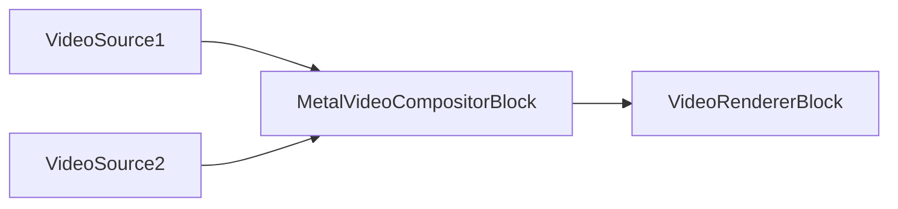

# Apple Platform Blocks - VisioForge Media Blocks SDK .Net

[Media Blocks SDK .Net](https://www.visioforge.com/media-blocks-sdk-net){ .md-button .md-button--primary target="_blank" }

This section covers MediaBlocks specifically optimized for Apple platforms (iOS, macOS, tvOS).

## Available Blocks

### Audio Sources

- **OSXAudioSourceBlock**: macOS audio capture using Core Audio
  - See [Audio Sources Documentation](../Sources/index.md#system-audio-source)
  
- **IOSAudioSourceBlock**: iOS audio capture
  - See [Audio Sources Documentation](../Sources/index.md#system-audio-source)

### Audio Sinks

- **OSXAudioSinkBlock**: macOS audio playback
  - See [Audio Rendering Documentation](../AudioRendering/index.md)
  
- **IOSAudioSinkBlock**: iOS audio playback
  - See [Audio Rendering Documentation](../AudioRendering/index.md)

### Video Sources

- **IOSVideoSourceBlock**: iOS camera capture
  - See [Video Sources Documentation](../Sources/index.md#system-video-source)

### Video Encoders

- **AppleProResEncoderBlock**: Apple ProRes professional video codec
  - See [ProRes Encoder Documentation](../VideoEncoders/index.md#apple-prores-encoder)

### Video Processing

- **MetalVideoCompositorBlock**: GPU-accelerated multi-input video compositor using Apple Metal

## Metal Video Compositor

### Metal Video Compositor Block

The `MetalVideoCompositorBlock` composites multiple video streams in real time using the Apple Metal GPU framework. Each input stream has configurable position, size, z-order, alpha, and blend operator. The block produces a single BGRA video output.

#### Block info

Name: MetalVideoCompositorBlock.

| Pin direction | Media type | Pins count |
| --- | :---: | :---: |
| Input video | Uncompressed video | N (one per stream) |
| Output video | Uncompressed video | 1 |

#### Settings

The block takes a `MetalVideoCompositorSettings` instance:

| Property | Type | Default | Description |
| --- | --- | :---: | --- |
| `Width` | `int` | 1920 | Output width in pixels |
| `Height` | `int` | 1080 | Output height in pixels |
| `FrameRate` | `VideoFrameRate` | FPS_30 | Output frame rate |
| `Background` | `VideoMixerBackground` | Transparent | Background mode |
| `Streams` | `List<VideoMixerStream>` | Empty | Input stream configurations |

Each input stream is a `MetalVideoMixerStream`:

| Property | Type | Default | Description |
| --- | --- | :---: | --- |
| `Rectangle` | `Rect` | required | Position and size within the output frame |
| `ZOrder` | `uint` | required | Stacking order (higher = in front) |
| `Alpha` | `double` | 1.0 | Opacity (0.0 transparent – 1.0 opaque) |
| `BlendOperator` | `MetalVideoMixerBlendOperator` | Over | Blend mode: Source, Over, or Add |
| `KeepAspectRatio` | `bool` | false | Preserve source aspect ratio during scaling |

#### The sample pipeline



#### Sample code

```csharp
var pipeline = new MediaBlocksPipeline();

// Configure compositor: 1920x1080 @ 30fps
var settings = new MetalVideoCompositorSettings(1920, 1080, VideoFrameRate.FPS_30);

// First stream: left half of screen
settings.AddStream(new MetalVideoMixerStream(
    rectangle: new Rect(0, 0, 960, 1080),
    zorder: 0));

// Second stream: right half of screen
// Rect ctor is (left, top, right, bottom). For the right half of a 1920x1080
// canvas use right=1920 and bottom=1080 — the previous form (960, 0, 960, 1080)
// has left==right and produces a zero-width box.
settings.AddStream(new MetalVideoMixerStream(
    rectangle: new Rect(960, 0, 1920, 1080),
    zorder: 1));

var compositor = new MetalVideoCompositorBlock(settings);

// Render composited output
var videoRenderer = new VideoRendererBlock(pipeline, VideoView1);
pipeline.Connect(compositor.Output, videoRenderer.Input);

await pipeline.StartAsync();

// Real-time: fade out stream 0 over 2 seconds
compositor.StartFadeOut(settings.Streams[0].ID, TimeSpan.FromSeconds(2));
```

#### Availability

```csharp
bool available = MetalVideoCompositorBlock.IsAvailable();
```

Returns `true` if the `vfmetalcompositor` GStreamer plugin is available on the current system.

#### Platforms

macOS, iOS.

## Platform Requirements

- **iOS**: iOS 12.0 or later
- **macOS**: macOS 10.13 or later
- **tvOS**: tvOS 12.0 or later

## Features

- Native integration with Apple frameworks (AVFoundation, Core Audio, Core Video)
- Hardware-accelerated processing on Apple Silicon and Intel Macs
- Optimized for low power consumption on mobile devices
- Support for high-quality ProRes encoding
- Integration with iOS camera and microphone permissions

## Sample Code

### iOS Camera Capture

```csharp
var pipeline = new MediaBlocksPipeline();

// iOS video source
var videoSource = new IOSVideoSourceBlock(videoSettings);

// Process and display
var videoRenderer = new VideoRendererBlock(pipeline, VideoView1);
pipeline.Connect(videoSource.Output, videoRenderer.Input);

await pipeline.StartAsync();
```

### macOS Audio Capture and Playback

```csharp
var pipeline = new MediaBlocksPipeline();

// macOS audio source
var audioSource = new OSXAudioSourceBlock(audioSettings);

// macOS audio sink
var audioSink = new OSXAudioSinkBlock();
pipeline.Connect(audioSource.Output, audioSink.Input);

await pipeline.StartAsync();
```

### ProRes Encoding

```csharp
var pipeline = new MediaBlocksPipeline();

var fileSource = new UniversalSourceBlock(await UniversalSourceSettings.CreateAsync(new Uri("input.mp4")));

// Apple ProRes encoder
// AppleProResEncoderSettings exposes Quality (double 0.0-1.0), Bitrate, MaxKeyframeInterval,
// MaxKeyFrameIntervalDuration, AllowFrameReordering, PreserveAlpha, Realtime — not a named profile enum.
var proresSettings = new AppleProResEncoderSettings
{
    Quality = 0.8
};
var proresEncoder = new AppleProResEncoderBlock(proresSettings);
pipeline.Connect(fileSource.VideoOutput, proresEncoder.Input);

// Output to MOV file
var movSink = new MOVSinkBlock(new MOVSinkSettings("output.mov"));
pipeline.Connect(proresEncoder.Output, movSink.CreateNewInput(MediaBlockPadMediaType.Video));

await pipeline.StartAsync();
```

## Platforms

iOS, macOS, tvOS.

## Related Documentation

- [Sources](../Sources/index.md) - All source blocks including Apple-specific
- [VideoEncoders](../VideoEncoders/index.md) - Video encoding including ProRes
- [AudioRendering](../AudioRendering/index.md) - Audio playback
