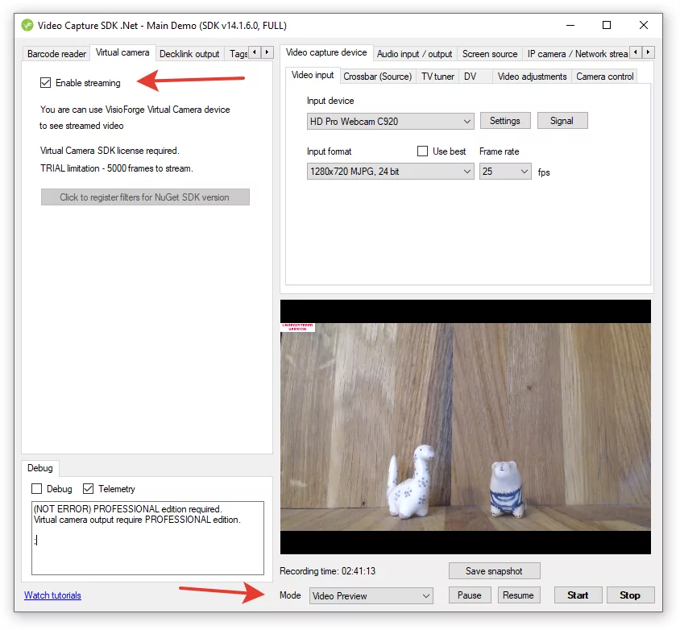

# Intégration streaming FFMPEG avec .NET

[Video Capture SDK .Net](https://www.visioforge.com/video-capture-sdk-net){ .md-button .md-button--primary target="_blank" }

!!! tip "Agents de codage IA : utilisez le serveur MCP VisioForge"

    Vous développez ceci avec **Claude Code**, **Cursor** ou un autre agent de codage IA ?
    Connectez-vous au [serveur MCP public VisioForge](../../general/mcp-server-usage.md)
    à l'adresse `https://mcp.visioforge.com/mcp` pour des recherches API structurées,
    des exemples de code exécutables et des guides de déploiement — plus précis qu'un
    grep sur `llms.txt`. Aucune authentification requise.

    Claude Code : `claude mcp add --transport http visioforge-sdk https://mcp.visioforge.com/mcp`

## Introduction au streaming FFMPEG

Le Video Capture SDK offre de puissantes capacités pour diffuser la vidéo depuis plusieurs sources directement vers FFMPEG, qui s'exécute en tant que processus externe. Cette intégration offre aux développeurs une flexibilité exceptionnelle, vous permettant d'utiliser des builds FFMPEG GPL/LGPL avec n'importe quelle configuration de codecs vidéo/audio et de multiplexeurs selon les exigences de votre projet.

Avec cette intégration, vous pouvez :

- Capturer la vidéo depuis diverses sources
- Diffuser le contenu capturé vers FFMPEG
- Configurer FFMPEG pour enregistrer les flux dans des fichiers
- Diffuser le contenu vers des serveurs distants
- Traiter la vidéo en temps réel
- Appliquer des filtres et des transformations

Cette approche combine la robustesse du SDK .NET avec la polyvalence de FFMPEG, créant une solution puissante pour les applications de capture et de streaming vidéo.

## Démarrer avec le streaming FFMPEG

Avant de plonger dans les détails d'implémentation, il est important de comprendre le flux de travail de base :

1. Configurez votre source vidéo (périphérique de capture, écran, fichier, etc.)
2. Activez la sortie Caméra virtuelle
3. Démarrez le processus de streaming vidéo
4. Configurez et lancez FFMPEG avec les paramètres appropriés
5. Traitez ou enregistrez le flux selon vos besoins

Explorons chaque étape en détail.

## Implémentation de base

### Étape 1 : configurer votre source vidéo

La première étape consiste à configurer votre source vidéo. Cela peut être fait par programme ou via l'interface utilisateur si vous utilisez l'application Main Demo. Voici un exemple de code simple pour activer la sortie Caméra virtuelle :

```cs
VideoCapture1.Virtual_Camera_Output_Enabled = true;
```

Cette unique ligne de code active la fonctionnalité de sortie Caméra virtuelle, rendant le flux vidéo disponible pour FFMPEG.



### Étape 2 : démarrer le streaming vidéo

Une fois la sortie Caméra virtuelle activée, vous devez initier le processus de streaming vidéo. Cela peut être fait en appelant la méthode appropriée sur votre instance VideoCapture :

```cs
// Configurer vos sources vidéo
// ...

// Activer la sortie Caméra virtuelle
VideoCapture1.Virtual_Camera_Output_Enabled = true;

// Démarrer le processus de streaming
VideoCapture1.Start();
```

### Étape 3 : configurer et lancer FFMPEG

Maintenant que votre vidéo est diffusée et envoyée à la sortie Caméra virtuelle, vous devez configurer FFMPEG pour recevoir et traiter ce flux. FFMPEG est lancé en tant que processus externe avec des arguments de ligne de commande spécifiques :

```bash
ffmpeg -f dshow -i video="VisioForge Virtual Camera" -c:v libopenh264 output.mp4
```

Cette commande dit à FFMPEG de :

- Utiliser DirectShow (`-f dshow`) comme format d'entrée
- Capturer la vidéo depuis la source « VisioForge Virtual Camera » (`-i video="VisioForge Virtual Camera"`)
- Encoder la vidéo avec le codec libopenh264 (`-c:v libopenh264`)
- Sauvegarder la sortie dans un fichier nommé « output.mp4 »

## Options de configuration FFMPEG avancées

### Ajouter l'audio à votre flux

Si vous souhaitez inclure l'audio dans votre flux, vous pouvez utiliser la Carte Audio Virtuelle fournie avec le SDK :

```bash
ffmpeg -f dshow -i video="VisioForge Virtual Camera" -f dshow -i audio="VisioForge Virtual Audio Card" -c:v libopenh264 -c:a aac -b:a 128k output.mp4
```

Cette commande ajoute :

- La capture audio depuis la Carte Audio Virtuelle
- L'encodage audio AAC avec un débit de 128 kbps

### Streaming vers des serveurs RTMP

Pour le streaming en direct vers des plateformes telles que YouTube, Twitch ou Facebook, vous pouvez utiliser RTMP :

```bash
ffmpeg -f dshow -i video="VisioForge Virtual Camera" -f dshow -i audio="VisioForge Virtual Audio Card" -c:v libx264 -preset veryfast -tune zerolatency -c:a aac -b:a 128k -f flv rtmp://your-streaming-server/app/key
```

Cette configuration :

- Utilise le codec x264 pour l'encodage vidéo
- Définit le preset d'encodage à « veryfast » pour réduire l'utilisation du CPU
- Active le réglage zero-latency pour le streaming en direct
- Produit en sortie le format FLV
- Envoie le flux vers l'URL de votre serveur RTMP

### Streaming HLS

HTTP Live Streaming (HLS) est une autre option populaire, particulièrement pour les spectateurs web et mobiles :

```bash
ffmpeg -f dshow -i video="VisioForge Virtual Camera" -c:v libx264 -c:a aac -b:a 128k -f hls -hls_time 4 -hls_playlist_type event stream.m3u8
```

Cette commande :

- Crée des segments HLS de 4 secondes chacun
- Définit le type de playlist à « event »
- Génère un fichier playlist m3u8 et des fichiers de segments TS

## Optimisation des performances

Lors du travail avec le streaming FFMPEG, plusieurs facteurs peuvent affecter les performances :

### Accélération matérielle

L'activation de l'accélération matérielle peut réduire significativement l'utilisation du CPU et améliorer les performances :

```bash
ffmpeg -f dshow -i video="VisioForge Virtual Camera" -c:v h264_nvenc -preset llhq -b:v 5M output.mp4
```

Cet exemple utilise l'encodeur NVENC de NVIDIA pour l'encodage H.264, ce qui décharge le travail d'encodage vers le GPU.

### Configuration de la taille du tampon

L'ajustement des tailles de tampon peut aider à la stabilité, particulièrement pour les flux haute résolution :

```bash
ffmpeg -f dshow -video_size 1920x1080 -framerate 30 -i video="VisioForge Virtual Camera" -c:v libx264 -bufsize 5M -maxrate 5M output.mp4
```

### Options multi-threading

Contrôler la manière dont FFMPEG utilise les threads CPU peut optimiser les performances :

```bash
ffmpeg -f dshow -i video="VisioForge Virtual Camera" -c:v libx264 -threads 4 output.mp4
```

## Cas d'usage courants

### Enregistrement vidéo de surveillance

FFMPEG est excellent pour les applications de surveillance, prenant en charge des fonctionnalités comme les superpositions d'horodatage :

```bash
ffmpeg -f dshow -i video="VisioForge Virtual Camera" -vf "drawtext=text='%{localtime}':fontcolor=white:fontsize=24:box=1:boxcolor=black@0.5:x=10:y=10" -c:v libx264 surveillance.mp4
```

### Création de vidéos en time-lapse

Vous pouvez configurer FFMPEG pour créer des vidéos en time-lapse depuis vos flux :

```bash
ffmpeg -f dshow -i video="VisioForge Virtual Camera" -vf "setpts=0.1*PTS" -c:v libx264 timelapse.mp4
```

### Plusieurs formats de sortie simultanément

FFMPEG peut générer plusieurs sorties à partir d'un seul flux d'entrée :

```bash
ffmpeg -f dshow -i video="VisioForge Virtual Camera" -c:v libx264 -f mp4 output.mp4 -c:v libvpx -f webm output.webm
```

## Exigences de déploiement

Pour déployer avec succès des applications utilisant cette approche de streaming, assurez-vous d'inclure :

- Les redistribuables de base du SDK
- Les redistribuables spécifiques au SDK
- Les redistribuables du Virtual Camera SDK

Pour des informations détaillées sur les exigences de déploiement, consultez la page [Déploiement](../deployment.md) de la documentation.

## Dépannage des problèmes courants

### Le flux n'apparaît pas dans FFMPEG

Si FFMPEG ne reconnaît pas la Caméra virtuelle :

- Assurez-vous que le pilote de Caméra virtuelle est correctement installé
- Vérifiez que la sortie Caméra virtuelle est activée dans votre code
- Vérifiez que le streaming vidéo a démarré avec succès

### Problèmes de qualité vidéo

Si la qualité vidéo est mauvaise :

- Augmentez le débit dans votre commande FFMPEG
- Ajustez le preset d'encodage (les presets plus lents produisent généralement une meilleure qualité)
- Vérifiez la résolution et la fréquence d'images de votre source

### Utilisation CPU élevée

Pour résoudre l'utilisation CPU élevée :

- Activez l'accélération matérielle si disponible
- Utilisez un preset d'encodage plus rapide
- Réduisez la résolution ou la fréquence d'images de sortie

## Conclusion

L'intégration du streaming FFMPEG avec le Video Capture SDK offre une solution puissante et flexible pour les besoins de traitement vidéo et de streaming. En suivant les directives et exemples de cette documentation, vous pouvez créer des applications vidéo sophistiquées qui tirent parti des forces des deux technologies.

Que vous construisiez une application de streaming, un système de surveillance ou un outil de traitement vidéo, cette intégration offre les performances et la flexibilité nécessaires pour des solutions de qualité professionnelle.

---
Pour plus d'exemples de code et d'exemples, visitez notre [dépôt GitHub](https://github.com/visioforge/.Net-SDK-s-samples).
