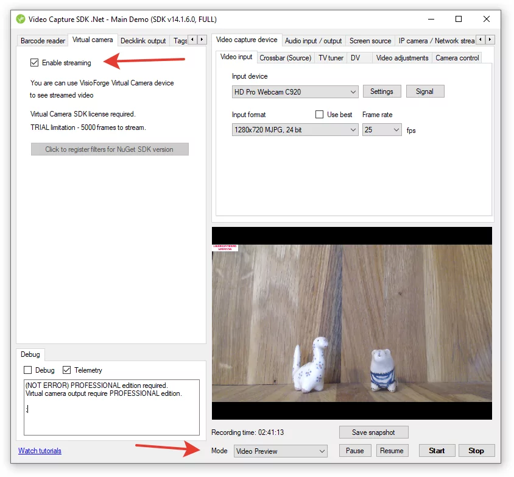

# FFMPEG Streaming Integration with .NET

[Video Capture SDK .Net](https://www.visioforge.com/video-capture-sdk-net){ .md-button .md-button--primary target="_blank" }

## Introduction to FFMPEG Streaming

The Video Capture SDK offers powerful capabilities for streaming video from multiple sources directly into FFMPEG, which runs as an external process. This integration provides developers with exceptional flexibility, allowing you to use GPL/LGPL FFMPEG builds with any configuration of video/audio codecs and muxers according to your project requirements.

With this integration, you can:

- Capture video from various sources
- Stream the captured content to FFMPEG
- Configure FFMPEG to save streams to files
- Stream content to remote servers
- Process video in real-time
- Apply filters and transformations

This approach combines the robustness of the .NET SDK with the versatility of FFMPEG, creating a powerful solution for video capture and streaming applications.

## Getting Started with FFMPEG Streaming

Before diving into implementation details, it's important to understand the basic workflow:

1. Configure your video source (capture device, screen, file, etc.)
2. Enable the Virtual Camera output
3. Start the video streaming process
4. Configure and launch FFMPEG with appropriate parameters
5. Process or save the stream as needed

Let's explore each step in detail.

## Basic Implementation

### Step 1: Configure Your Video Source

The first step involves setting up your video source. This can be done either programmatically or through the UI if you're using the Main Demo application. Here's a simple code example to enable the Virtual Camera output:

```cs
VideoCapture1.Virtual_Camera_Output_Enabled = true;
```

This single line of code activates the Virtual Camera output feature, making the video stream available to FFMPEG.



### Step 2: Start Video Streaming

Once the Virtual Camera output is enabled, you need to initiate the video streaming process. This can be done by calling the appropriate method on your VideoCapture instance:

```cs
// Configure your video sources
// ...

// Enable the Virtual Camera output
VideoCapture1.Virtual_Camera_Output_Enabled = true;

// Start the streaming process
VideoCapture1.Start();
```

### Step 3: Configure and Launch FFMPEG

Now that your video is streaming and being sent to the Virtual Camera output, you need to configure FFMPEG to receive and process this stream. FFMPEG is launched as an external process with specific command-line arguments:

```bash
ffmpeg -f dshow -i video="VisioForge Virtual Camera" -c:v libopenh264 output.mp4
```

This command tells FFMPEG to:

- Use DirectShow (`-f dshow`) as the input format
- Capture video from the "VisioForge Virtual Camera" source (`-i video="VisioForge Virtual Camera"`)
- Encode the video using the libopenh264 codec (`-c:v libopenh264`)
- Save the output to a file named "output.mp4"

## Advanced FFMPEG Configuration Options

### Adding Audio to Your Stream

If you want to include audio in your stream, you can use the Virtual Audio Card provided with the SDK:

```bash
ffmpeg -f dshow -i video="VisioForge Virtual Camera" -f dshow -i audio="VisioForge Virtual Audio Card" -c:v libopenh264 -c:a aac -b:a 128k output.mp4
```

This command adds:

- Audio capture from the Virtual Audio Card
- AAC audio encoding with a bitrate of 128 kbps

### Streaming to RTMP Servers

For live streaming to platforms like YouTube, Twitch, or Facebook, you can use RTMP:

```bash
ffmpeg -f dshow -i video="VisioForge Virtual Camera" -f dshow -i audio="VisioForge Virtual Audio Card" -c:v libx264 -preset veryfast -tune zerolatency -c:a aac -b:a 128k -f flv rtmp://your-streaming-server/app/key
```

This configuration:

- Uses the x264 codec for video encoding
- Sets the encoding preset to "veryfast" for reduced CPU usage
- Enables zero-latency tuning for live streaming
- Outputs to the FLV format
- Sends the stream to your RTMP server URL

### HLS Streaming

HTTP Live Streaming (HLS) is another popular option, especially for web and mobile viewers:

```bash
ffmpeg -f dshow -i video="VisioForge Virtual Camera" -c:v libx264 -c:a aac -b:a 128k -f hls -hls_time 4 -hls_playlist_type event stream.m3u8
```

This command:

- Creates HLS segments of 4 seconds each
- Sets the playlist type to "event"
- Generates an m3u8 playlist file and TS segment files

## Performance Optimization

When working with FFMPEG streaming, several factors can affect performance:

### Hardware Acceleration

Enabling hardware acceleration can significantly reduce CPU usage and improve performance:

```bash
ffmpeg -f dshow -i video="VisioForge Virtual Camera" -c:v h264_nvenc -preset llhq -b:v 5M output.mp4
```

This example uses NVIDIA's NVENC encoder for H.264 encoding, which offloads encoding work to the GPU.

### Buffer Size Configuration

Adjusting buffer sizes can help with stability, especially for high-resolution streams:

```bash
ffmpeg -f dshow -video_size 1920x1080 -framerate 30 -i video="VisioForge Virtual Camera" -c:v libx264 -bufsize 5M -maxrate 5M output.mp4
```

### Multi-threading Options

Controlling how FFMPEG utilizes CPU threads can optimize performance:

```bash
ffmpeg -f dshow -i video="VisioForge Virtual Camera" -c:v libx264 -threads 4 output.mp4
```

## Common Use Cases

### Recording Surveillance Video

FFMPEG is excellent for surveillance applications, supporting features like timestamp overlays:

```bash
ffmpeg -f dshow -i video="VisioForge Virtual Camera" -vf "drawtext=text='%{localtime}':fontcolor=white:fontsize=24:box=1:boxcolor=black@0.5:x=10:y=10" -c:v libx264 surveillance.mp4
```

### Creating Time-lapse Videos

You can configure FFMPEG to create time-lapse videos from your streams:

```bash
ffmpeg -f dshow -i video="VisioForge Virtual Camera" -vf "setpts=0.1*PTS" -c:v libx264 timelapse.mp4
```

### Multiple Output Formats Simultaneously

FFMPEG can generate multiple outputs from a single input stream:

```bash
ffmpeg -f dshow -i video="VisioForge Virtual Camera" -c:v libx264 -f mp4 output.mp4 -c:v libvpx -f webm output.webm
```

## Deployment Requirements

To successfully deploy applications using this streaming approach, ensure you include:

- Base SDK redistributables
- SDK-specific redistributables
- Virtual Camera SDK redistributables

For detailed information about deployment requirements, refer to the [Deployment](../deployment.md) page in the documentation.

## Troubleshooting Common Issues

### Stream Not Appearing in FFMPEG

If FFMPEG doesn't recognize the Virtual Camera:

- Ensure the Virtual Camera driver is properly installed
- Verify that the Virtual Camera output is enabled in your code
- Check that the video streaming has successfully started

### Video Quality Issues

If the video quality is poor:

- Increase the bitrate in your FFMPEG command
- Adjust the encoding preset (slower presets generally produce better quality)
- Check your source video resolution and frame rate

### High CPU Usage

To address high CPU utilization:

- Enable hardware acceleration if available
- Use a faster encoding preset
- Reduce the output resolution or frame rate

## Conclusion

Integrating FFMPEG streaming with the Video Capture SDK provides a powerful and flexible solution for video processing and streaming needs. By following the guidelines and examples in this documentation, you can create sophisticated video applications that leverage the strengths of both technologies.

Whether you're building a streaming application, a surveillance system, or a video processing tool, this integration offers the performance and flexibility needed for professional-grade solutions.

---
For more code samples and examples, visit our [GitHub repository](https://github.com/visioforge/.Net-SDK-s-samples).