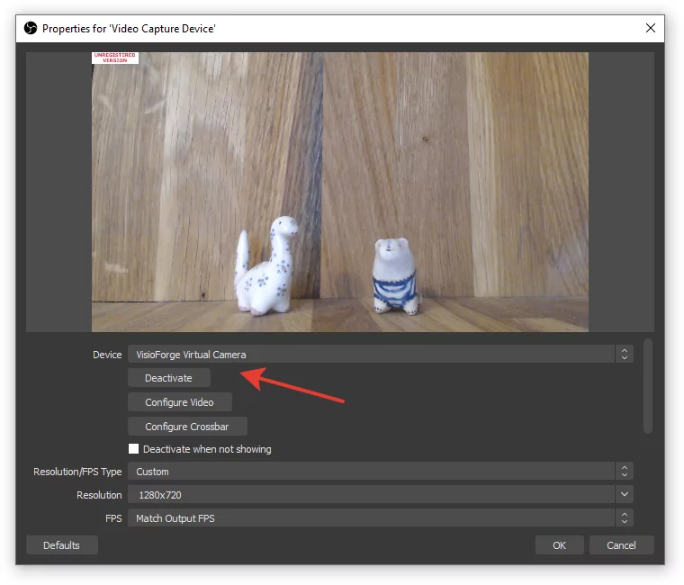

# Intégrer le streaming OBS dans Video Capture SDK .Net

[Video Capture SDK .Net](https://www.visioforge.com/video-capture-sdk-net){ .md-button .md-button--primary target="_blank" }

## Introduction à l'intégration OBS

Open Broadcaster Software (OBS) est devenu le standard de l'industrie pour le streaming en direct et l'enregistrement vidéo. Le Video Capture SDK .Net offre des capacités robustes pour diffuser vidéo et audio depuis plusieurs sources directement vers OBS, créant un pipeline puissant pour la création de contenu de qualité broadcast.

Cette intégration permet aux développeurs de créer des applications qui peuvent :

- Capturer depuis plusieurs périphériques caméra simultanément
- Traiter et améliorer les flux vidéo en temps réel
- Mixer diverses sources de contenu avant l'envoi vers OBS
- Créer des solutions de diffusion professionnelles avec un minimum de configuration

Que vous développiez des applications pour WinForms, WPF ou des environnements console, le SDK fournit une API cohérente pour l'intégration OBS.

## Fonctionnement de l'intégration OBS

Le SDK tire parti de la technologie DirectShow Virtual Camera pour créer un pont entre votre application et OBS. Cette approche offre plusieurs avantages :

1. **Streaming sans latence** : le transfert direct en mémoire minimise le délai
2. **Flexibilité des formats** : prise en charge de diverses résolutions et fréquences d'images
3. **Configuration minimale** : OBS reconnaît automatiquement le périphérique virtuel
4. **Synchronisation audio** : capacités de streaming audio-vidéo combinées

La caméra virtuelle apparaît à OBS comme un périphérique webcam standard, ce qui la rend immédiatement utilisable dans toute scène OBS.

## Guide d'implémentation

### Composants requis

Avant d'implémenter le streaming OBS, assurez-vous d'avoir installé les composants suivants :

- Video Capture SDK .Net (dernière version recommandée)
- Composants DirectShow Virtual Camera
- OBS Studio (version 27.0 ou supérieure recommandée)
- .NET Framework 4.6.2 ou supérieur (pour une compatibilité complète)

### Implémentation de base

Le code suivant montre comment activer la sortie de caméra virtuelle dans votre application :

```cs
// Initialiser le composant de capture vidéo
var videoCapture = new VideoCaptureCore();

// Configurer les paramètres de capture de base
// ...

// Activer la sortie de caméra virtuelle
videoCapture.Virtual_Camera_Output_Enabled = true;

// Démarrer la capture
videoCapture.Start();
```

Cette implémentation minimale enverra le flux caméra vers le périphérique virtuel qu'OBS peut utiliser comme source d'entrée.

## Configurer OBS pour l'intégration SDK

### Ajouter la source de caméra virtuelle

1. Lancez OBS Studio
2. Dans votre scène, cliquez sur le bouton « + » sous Sources
3. Sélectionnez « Périphérique de capture vidéo » dans la liste
4. Nommez votre source (par ex. « Virtual Camera SDK »)
5. Dans la boîte de dialogue Propriétés, sélectionnez « VisioForge Virtual Camera » dans la liste déroulante Périphérique
6. Configurez la résolution et le FPS pour correspondre à vos paramètres SDK
7. Cliquez sur « OK » pour ajouter la source



### Configuration audio

Pour le streaming audio, activez la sortie de caméra virtuelle en même temps que l'enregistrement audio sur le moteur `VideoCaptureCore` — la « VisioForge Virtual Audio Card » est routée automatiquement lorsque les deux indicateurs sont activés. Sélectionnez ensuite ce périphérique dans OBS :

```csharp
// Activer la sortie de caméra virtuelle sur le moteur VideoCaptureCore.
// Combiné avec Audio_RecordAudio = true, l'audio est automatiquement
// routé vers la carte audio virtuelle — pas d'indicateur séparé.
VideoCapture1.Virtual_Camera_Output_Enabled = true;

// Configurez votre source audio comme d'habitude.
VideoCapture1.Audio_CaptureDevice  = new AudioCaptureSource("Microphone");
VideoCapture1.Audio_PlayAudio      = false;
VideoCapture1.Audio_RecordAudio    = true;

await VideoCapture1.StartAsync();
```

Ensuite côté OBS :

1. Ajoutez une source « Capture d'entrée audio »
2. Sélectionnez « VisioForge Virtual Audio Card » comme périphérique
3. Ajustez les niveaux audio et les filtres selon les besoins

Cela crée un pipeline audiovisuel complet de votre application vers OBS.

## Considérations de performance

Lors du streaming vers OBS, considérez ces conseils de performance :

1. **Correspondance de résolution** : définissez la même résolution dans le SDK et dans OBS
2. **Cohérence de la fréquence d'images** : maintenez un FPS cohérent tout au long du pipeline
3. **Utilisation CPU** : surveillez la charge du processeur, en particulier lors de l'utilisation du traitement d'images
4. **Gestion de la mémoire** : libérez rapidement les ressources non nécessaires
5. **Taille du tampon** : ajustez les tailles de tampon selon la mémoire système disponible

Pour des performances optimales, nous recommandons l'utilisation d'un GPU dédié pour les tâches de traitement vidéo.

## Redistribuables requis

Assurez-vous que les composants suivants sont inclus dans le déploiement de votre application :

- Paquet redistribuable de base
- Composants redistribuables du SDK
- Fichiers redistribuables du Virtual Camera SDK

Consultez la documentation [Déploiement](../deployment.md) complète pour des instructions détaillées.

## Dépannage des problèmes courants

Si vous rencontrez des problèmes avec l'intégration OBS :

1. **Caméra virtuelle n'apparaît pas dans OBS** : vérifiez que le pilote de caméra virtuelle est correctement installé
2. **Mauvaises performances** : vérifiez les paramètres de résolution et de fréquence d'images dans le SDK et OBS
3. **Problèmes de synchronisation audio** : assurez-vous que les flux audio et vidéo utilisent le même mécanisme de timing
4. **Problèmes de qualité vidéo** : vérifiez les paramètres d'encodage et les configurations de tampon
5. **Plantages d'application** : vérifiez la bonne initialisation et l'arrêt des composants SDK

## Conclusion

Intégrer les capacités de streaming OBS dans vos applications .NET en utilisant le Video Capture SDK offre une base puissante pour construire des solutions de diffusion professionnelles. L'approche DirectShow Virtual Camera garantit la compatibilité avec OBS tout en maintenant performances et qualité.

En suivant le guide d'implémentation et les bonnes pratiques décrits dans ce document, les développeurs peuvent créer des applications de streaming sophistiquées qui tirent parti des forces combinées du SDK et d'OBS.

---
Visitez notre page [GitHub](https://github.com/visioforge/.Net-SDK-s-samples) pour obtenir plus d'exemples de code.
