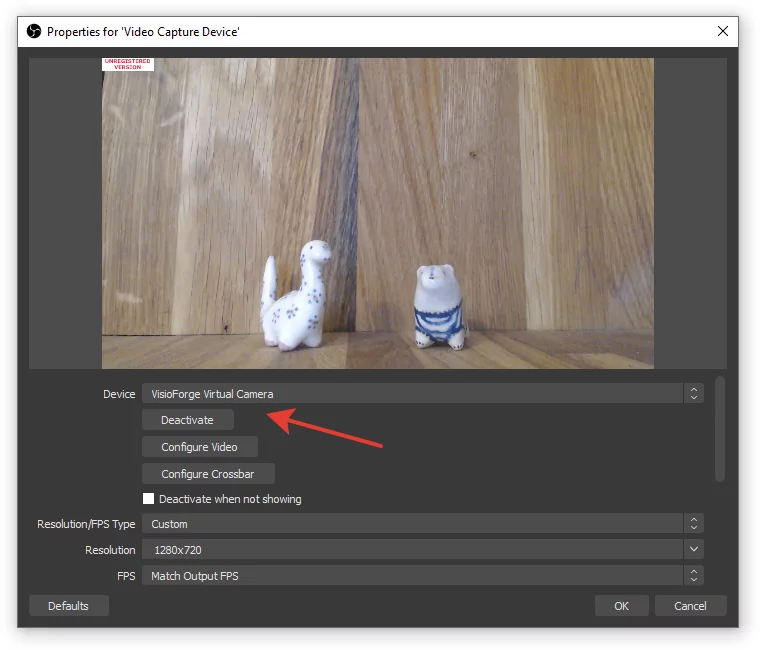

# Integrating OBS Streaming in Video Capture SDK .Net

[Video Capture SDK .Net](https://www.visioforge.com/video-capture-sdk-net){ .md-button .md-button--primary target="_blank" }

## Introduction to OBS Integration

Open Broadcaster Software (OBS) has become the industry standard for live streaming and video recording. The Video Capture SDK .Net provides robust capabilities to stream video and audio from multiple sources directly into OBS, creating a powerful pipeline for broadcast-quality content creation.

This integration allows developers to build applications that can:

- Capture from multiple camera devices simultaneously
- Process and enhance video streams in real-time
- Mix various content sources before sending to OBS
- Create professional broadcasting solutions with minimal setup

Whether you're developing applications for WinForms, WPF, or console environments, the SDK provides a consistent API for OBS integration.

## How OBS Integration Works

The SDK leverages DirectShow Virtual Camera technology to create a bridge between your application and OBS. This approach offers several advantages:

1. **Zero-latency streaming**: Direct memory transfer minimizes delay
2. **Format flexibility**: Support for various resolutions and frame rates
3. **Minimal configuration**: OBS recognizes the virtual device automatically
4. **Audio synchronization**: Combined audio-video streaming capabilities

The virtual camera appears to OBS as a standard webcam device, making it immediately usable within any OBS scene.

## Implementation Guide

### Required Components

Before implementing OBS streaming, ensure you have the following components installed:

- Video Capture SDK .Net (latest version recommended)
- DirectShow Virtual Camera components
- OBS Studio (version 27.0 or higher recommended)
- .NET Framework 4.6.2 or higher (for full compatibility)

### Basic Implementation

The following code demonstrates how to enable virtual camera output in your application:

```cs
// Initialize the video capture component
var videoCapture = new VideoCaptureCore();

// Configure basic capture settings
// ...

// Enable virtual camera output
videoCapture.Virtual_Camera_Output_Enabled = true;

// Start capture
videoCapture.Start();
```

This minimal implementation will send the camera feed to the virtual device that OBS can use as an input source.

## Configuring OBS for SDK Integration

### Adding the Virtual Camera Source

1. Launch OBS Studio
2. In your scene, click the "+" button under Sources
3. Select "Video Capture Device" from the list
4. Name your source (e.g., "SDK Virtual Camera")
5. In the Properties dialog, select "VisioForge Virtual Camera" from the Device dropdown
6. Configure resolution and FPS to match your SDK settings
7. Click "OK" to add the source



### Audio Configuration

For audio streaming, configure the "VisioForge Virtual Audio Card" in OBS:

1. Add an "Audio Input Capture" source
2. Select "VisioForge Virtual Audio Card" as the device
3. Adjust audio levels and filters as needed

This creates a complete audio-visual pipeline from your application to OBS.

## Performance Considerations

When streaming to OBS, consider these performance tips:

1. **Resolution matching**: Set the same resolution in both SDK and OBS
2. **Frame rate consistency**: Maintain consistent FPS throughout the pipeline
3. **CPU usage**: Monitor processor load, especially when using frame processing
4. **Memory management**: Dispose of unneeded resources promptly
5. **Buffer size**: Adjust buffer sizes based on available system memory

For optimal performance, we recommend using a dedicated GPU for video processing tasks.

## Required Redistributables

Ensure the following components are included in your application deployment:

- Base redistributable package
- SDK redistributable components
- Virtual Camera SDK redistributable files

Review the full [Deployment](../deployment.md) documentation for detailed instructions.

## Troubleshooting Common Issues

If you encounter issues with OBS integration:

1. **Virtual camera not appearing in OBS**: Verify that the virtual camera driver is properly installed
2. **Poor performance**: Check resolution and frame rate settings in both SDK and OBS
3. **Audio sync issues**: Ensure audio and video streams use the same timing mechanism
4. **Video quality problems**: Verify encoding settings and buffer configurations
5. **Application crashes**: Check for proper initialization and shutdown of SDK components

## Conclusion

Integrating OBS streaming capabilities into your .NET applications using the Video Capture SDK provides a powerful foundation for building professional broadcasting solutions. The DirectShow Virtual Camera approach ensures compatibility with OBS while maintaining high performance and quality.

By following the implementation guide and best practices outlined in this document, developers can create sophisticated streaming applications that leverage the combined strengths of the SDK and OBS.

---
Visit our [GitHub](https://github.com/visioforge/.Net-SDK-s-samples) page to get more code samples.