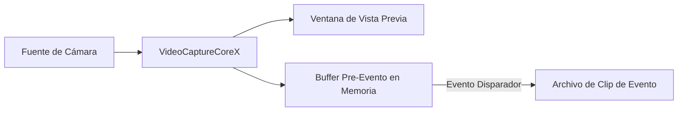

# Grabación Pre-Evento Usando C# .Net: Captura de Video con Buffer Circular

La grabación pre-evento permite a su aplicación almacenar continuamente video y audio en memoria y guardar clips de eventos que incluyen metraje de antes de que ocurriera el disparador. Úselo para grabar video de webcam, capturar streams de cámaras IP o guardar metraje RTSP con disparadores de detección de movimiento — esencial para aplicaciones de vigilancia, seguridad y monitoreo donde capturar lo que sucedió antes de un evento es crítico.

## Características Clave de la Grabación Pre-Evento de Video Capture SDK .Net

[Video Capture SDK .Net](https://www.visioforge.com/video-capture-sdk-net){ .md-button .md-button--primary target="_blank" }

- **Duración de buffer configurable**: Almacene los últimos 5 a 120+ segundos de video en memoria
- **Grabación post-evento automática**: Continúe grabando por una duración configurable después del disparador
- **Múltiples formatos de salida**: MP4 (predeterminado), MPEG-TS (seguro ante fallos), MKV
- **Extensión al re-disparar**: Si un evento recurre durante la grabación, el temporizador se reinicia sin crear un nuevo archivo
- **Múltiples salidas independientes**: Agregue múltiples salidas de grabación pre-evento por pipeline
- **Codificación acelerada por GPU**: Aprovecha codificadores hardware NVENC, QSV y AMF cuando están disponibles
- **Notificaciones de eventos**: Reciba callbacks cuando la grabación comienza y se detiene

## Cómo Funciona la Grabación Pre-Evento



1. `VideoCaptureCoreX` captura video desde una cámara (webcam, cámara IP, etc.) y muestra una vista previa
2. Los fotogramas codificados se almacenan continuamente en un buffer circular en memoria
3. Cuando llama a `TriggerPreEventRecording()`, el buffer se vacía a un archivo
4. Los fotogramas en vivo continúan grabándose por la duración post-evento configurada
5. La grabación se detiene automáticamente y el sistema vuelve al modo de almacenamiento en buffer

## Ejemplo de Implementación

!!!info Muestra de Demo
    Para un proyecto funcional completo con XAML y todas las dependencias, vea la [Demo de Grabación Pre-Evento VideoCaptureCoreX](https://github.com/visioforge/.Net-SDK-s-samples/tree/master/Video%20Capture%20SDK%20X/WPF/CSharp/PreEventRecording).

### Aplicación WPF con Cámara, Detección de Movimiento y Grabación Pre-Evento

El siguiente código está basado en la [demo WPF de Grabación Pre-Evento](https://github.com/visioforge/.Net-SDK-s-samples). Soporta tanto fuentes de cámara local como cámara IP RTSP, con detección de movimiento para disparadores de grabación automáticos.

```csharp
using System;
using System.Diagnostics;
using System.IO;
using System.Linq;
using System.Windows;

using VisioForge.Core;
using VisioForge.Core.Types.Events;
using VisioForge.Core.Types.VideoProcessing;
using VisioForge.Core.Types.X.Output;
using VisioForge.Core.Types.X.PreEventRecording;
using VisioForge.Core.Types.X.Sources;
using VisioForge.Core.Types.X.VideoEncoders;
using VisioForge.Core.Types.X.AudioEncoders;
using VisioForge.Core.VideoCaptureX;

public partial class MainWindow : Window, IDisposable
{
    private VideoCaptureCoreX VideoCapture1;
    private string _outputFolder;
    private System.Timers.Timer _statusTimer;

    private async void BtStart_Click(object sender, RoutedEventArgs e)
    {
        _outputFolder = Path.Combine(
            Environment.GetFolderPath(Environment.SpecialFolder.MyVideos),
            "PreEventRecording");
        Directory.CreateDirectory(_outputFolder);

        // Create VideoCaptureCoreX with video preview
        VideoCapture1 = new VideoCaptureCoreX(VideoView1);
        VideoCapture1.OnError += (s, args) => Log($"[Error] {args.Message}");

        // Configure video source — camera or RTSP
        bool useRtsp = false; // Set to true for RTSP IP camera
        if (useRtsp)
        {
            var rtspSettings = await RTSPSourceSettings.CreateAsync(
                new Uri("rtsp://192.168.1.21:554/Streaming/Channels/101"),
                login: "admin",
                password: "password",
                audioEnabled: true);
            VideoCapture1.Video_Source = rtspSettings;
            VideoCapture1.Audio_Record = true;
        }
        else
        {
            // Local camera
            var device = (await DeviceEnumerator.Shared.VideoSourcesAsync()).FirstOrDefault();
            VideoCapture1.Video_Source = new VideoCaptureDeviceSourceSettings(device);

            // Local audio device
            var audioDevice = (await DeviceEnumerator.Shared.AudioSourcesAsync()).FirstOrDefault();
            if (audioDevice != null)
            {
                VideoCapture1.Audio_Source = audioDevice.CreateSourceSettingsVC(null);
                VideoCapture1.Audio_Record = true;
            }
        }

        // Enable motion detection for automatic triggering
        VideoCapture1.Motion_Detection = new MotionDetectionExSettings
        {
            ProcessorType = MotionProcessorType.None,
            DetectorType = MotionDetectorType.TwoFramesDifference,
            DifferenceThreshold = 15,
            SuppressNoise = true
        };
        VideoCapture1.OnMotionDetection += VideoCapture1_OnMotionDetection;

        // Add pre-event recording output with explicit encoders
        var preEventSettings = new PreEventRecordingSettings
        {
            PreEventDuration = TimeSpan.FromSeconds(10),
            PostEventDuration = TimeSpan.FromSeconds(5)
        };

        var preEventOutput = new PreEventRecordingOutput(
            settings: preEventSettings,
            videoEnc: new OpenH264EncoderSettings(),
            audioEnc: new VOAACEncoderSettings());
        VideoCapture1.Outputs_Add(preEventOutput);

        // Subscribe to recording events
        VideoCapture1.OnPreEventRecordingStarted += (s, args) =>
        {
            Log($"Recording started: {args.Filename}");
            Dispatcher.Invoke(() => lbRecFile.Text = $"File: {args.Filename}");
        };

        VideoCapture1.OnPreEventRecordingStopped += (s, args) =>
        {
            Log($"Recording stopped: {args.Filename}");
        };

        // Start capture — preview and buffering begin
        await VideoCapture1.StartAsync();

        // Start status timer
        _statusTimer = new System.Timers.Timer(500);
        _statusTimer.Elapsed += (s, args) => UpdateStatus();
        _statusTimer.Start();

        Log("Started. Buffering...");
    }

    // Motion detection handler: auto-trigger recording on motion
    private void VideoCapture1_OnMotionDetection(object sender, MotionDetectionExEventArgs e)
    {
        if (VideoCapture1 == null) return;

        bool isMotion = e.LevelPercent >= 5;
        if (!isMotion) return;

        var state = VideoCapture1.GetPreEventRecordingState(0);
        if (state == PreEventRecordingState.Buffering)
        {
            var filename = Path.Combine(_outputFolder,
                $"motion_{DateTime.Now:yyyyMMdd_HHmmss}.mp4");
            VideoCapture1.TriggerPreEventRecording(0, filename);
            Log($"Motion triggered recording: {filename}");
        }
        else if (state == PreEventRecordingState.Recording ||
                 state == PreEventRecordingState.PostEventRecording)
        {
            // Motion still active — extend the recording
            VideoCapture1.ExtendPreEventRecording(0);
        }
    }

    // Manual trigger button
    private void BtTrigger_Click(object sender, RoutedEventArgs e)
    {
        if (VideoCapture1 == null) return;

        var filename = Path.Combine(_outputFolder,
            $"event_{DateTime.Now:yyyyMMdd_HHmmss}.mp4");
        VideoCapture1.TriggerPreEventRecording(0, filename);
        Log($"Trigger recording: {filename}");
    }

    // Manual stop recording button
    private void BtStopRec_Click(object sender, RoutedEventArgs e)
    {
        VideoCapture1?.StopPreEventRecording(0);
        Log("Recording stopped manually.");
    }

    // Extend recording button
    private void BtExtend_Click(object sender, RoutedEventArgs e)
    {
        VideoCapture1?.ExtendPreEventRecording(0);
        Log("Post-event timer extended.");
    }

    // Monitor status periodically
    private void UpdateStatus()
    {
        if (VideoCapture1 == null) return;

        var state = VideoCapture1.GetPreEventRecordingState(0);
        Dispatcher.Invoke(() => lbState.Text = $"State: {state}");
    }

    // Stop and clean up
    private async void BtStop_Click(object sender, RoutedEventArgs e)
    {
        _statusTimer?.Stop();
        _statusTimer?.Dispose();

        if (VideoCapture1 != null)
        {
            VideoCapture1.OnMotionDetection -= VideoCapture1_OnMotionDetection;
            await VideoCapture1.StopAsync();
            await VideoCapture1.DisposeAsync();
            VideoCapture1 = null;
        }

        Log("Stopped.");
    }

    private void Window_Closing(object sender, System.ComponentModel.CancelEventArgs e)
    {
        _statusTimer?.Stop();
        _statusTimer?.Dispose();

        VideoCapture1?.DisposeAsync().GetAwaiter().GetResult();
        VisioForgeX.DestroySDK();
    }
}
```

## Salida MPEG-TS para Seguridad ante Fallos

Para despliegues desatendidos o headless, use salida MPEG-TS para asegurar que las grabaciones siempre sean reproducibles incluso si el proceso falla:

```csharp
// Use the factory method for MPEG-TS output
var preEventOutput = PreEventRecordingOutput.CreateMPEGTS(
    settings: new PreEventRecordingSettings
    {
        PreEventDuration = TimeSpan.FromSeconds(30),
        PostEventDuration = TimeSpan.FromSeconds(10)
    });
core.Outputs_Add(preEventOutput);

// Trigger with .ts extension
core.TriggerPreEventRecording(0, "/recordings/event_001.ts");
```

!!!warning "MP4 vs MPEG-TS"
    Los archivos MP4 requieren un paso de finalización (escritura del moov atom). Si el proceso falla durante la grabación, el archivo MP4 puede ser irreproducible. MPEG-TS no tiene este requisito y siempre es reproducible, haciéndolo el formato recomendado para aplicaciones de vigilancia que funcionan desatendidas.

## Salida MKV

```csharp
var preEventOutput = PreEventRecordingOutput.CreateMKV(
    settings: new PreEventRecordingSettings
    {
        PreEventDuration = TimeSpan.FromSeconds(30),
        PostEventDuration = TimeSpan.FromSeconds(10)
    });
core.Outputs_Add(preEventOutput);

core.TriggerPreEventRecording(0, "/recordings/event_001.mkv");
```

## Referencia API

### PreEventRecordingOutput

| Constructor / Método de Fábrica | Descripción |
| --- | --- |
| `new PreEventRecordingOutput(settings, videoEnc, audioEnc)` | Salida MP4 con codificadores predeterminados o personalizados |
| `PreEventRecordingOutput.CreateMPEGTS(settings, videoEnc, audioEnc)` | Salida MPEG-TS (segura ante fallos) |
| `PreEventRecordingOutput.CreateMKV(settings, videoEnc, audioEnc)` | Salida MKV |

### Métodos de VideoCaptureCoreX

| Método | Descripción |
| --- | --- |
| `TriggerPreEventRecording(int index, string filename)` | Vaciar buffer a archivo e iniciar grabación. `index` es el índice de salida pre-evento basado en cero. |
| `TriggerPreEventRecordingAsync(int index, string filename)` | Versión asíncrona de TriggerPreEventRecording. |
| `ExtendPreEventRecording(int index)` | Reiniciar el temporizador post-evento. Llamar cuando la condición del disparador persiste. |
| `StopPreEventRecording(int index)` | Detener manualmente la grabación y volver al almacenamiento en buffer. |
| `IsPreEventRecording(int index)` | Devuelve `true` si la salida está grabando actualmente. |
| `GetPreEventRecordingState(int index)` | Devuelve el `PreEventRecordingState` actual. |

### Propiedades de VideoCaptureCoreX

| Propiedad | Tipo | Descripción |
| --- | :---: | --- |
| `PreEventRecording_Count` | int | Número de salidas de grabación pre-evento configuradas. |

### Eventos de VideoCaptureCoreX

| Evento | Descripción |
| --- | --- |
| `OnPreEventRecordingStarted` | Se dispara cuando comienza una grabación pre-evento. Incluye nombre de archivo y duración pre-evento real. |
| `OnPreEventRecordingStopped` | Se dispara cuando una grabación termina (temporizador expirado o detención manual). |

### Codificadores Disponibles

**Codificadores de video:**

- OpenH264 (software, multiplataforma)
- Intel QSV H264 (hardware)
- NVIDIA NVENC H264 (hardware)
- AMD AMF H264 (hardware)
- Intel QSV HEVC (hardware)
- NVIDIA NVENC HEVC (hardware)
- AMD AMF H265 (hardware)

**Codificadores de audio:**

- MP3
- VO-AAC
- AVENC AAC
- MF AAC (solo Windows)

## Dependencias Nativas

Paquete principal del SDK (administrado):

```xml
<PackageReference Include="VisioForge.DotNet.Core.VideoCaptureX" Version="15.x.x" />
```

Dependencias nativas para Windows x64:

```xml
<PackageReference Include="VisioForge.DotNet.Core.Redist.VideoCapture.x64" Version="15.x.x" />
```

Para plataformas alternativas (macOS, Linux, Android, iOS), use los paquetes de dependencias nativas correspondientes. Vea la [Guía de Despliegue](../../deployment-x/index.md) para más detalles.

## Compatibilidad Multiplataforma

La grabación pre-evento está disponible en todas las plataformas soportadas por Video Capture SDK .Net:

- Windows (x86, x64, ARM64)
- macOS (x64, ARM64)
- Linux (x64, ARM64)
- Android
- iOS

La disponibilidad de plataforma depende del soporte de muxer y codificador de GStreamer. Los codificadores acelerados por hardware (NVENC, QSV, AMF) están disponibles en plataformas con hardware GPU compatible.
