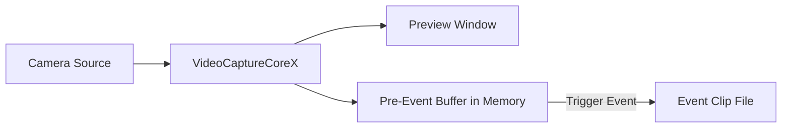

# Enregistrement pré-événement en C# .Net : capture vidéo par tampon circulaire

L'enregistrement pré-événement permet à votre application de mettre en mémoire tampon en continu la vidéo et l'audio en mémoire et de sauvegarder des clips d'événement qui incluent les images d'avant le déclencheur. Utilisez-le pour enregistrer la vidéo webcam, capturer les flux de caméra IP ou sauvegarder les images RTSP avec des déclencheurs de détection de mouvement — essentiel pour les applications de vidéosurveillance, de sécurité et de monitoring où capturer ce qui s'est passé avant un événement est critique.

## Fonctionnalités clés de l'enregistrement pré-événement de Video Capture SDK .Net

[Video Capture SDK .Net](https://www.visioforge.com/video-capture-sdk-net){ .md-button .md-button--primary target="_blank" }

- **Durée de tampon configurable** : mettez en tampon les 5 à 120+ dernières secondes de vidéo en mémoire
- **Enregistrement post-événement automatique** : continuez l'enregistrement pendant une durée configurable après le déclencheur
- **Plusieurs formats de sortie** : MP4 (par défaut), MPEG-TS (résistant aux plantages), MKV
- **Extension lors d'un nouveau déclenchement** : si un événement se reproduit pendant l'enregistrement, le minuteur se réinitialise sans créer de nouveau fichier
- **Plusieurs sorties indépendantes** : ajoutez plusieurs sorties d'enregistrement pré-événement par pipeline
- **Encodage accéléré par GPU** : exploite les encodeurs matériels NVENC, QSV et AMF lorsqu'ils sont disponibles
- **Notifications d'événements** : recevez des rappels lorsque l'enregistrement commence et s'arrête

## Fonctionnement de l'enregistrement pré-événement



1. `VideoCaptureCoreX` capture la vidéo depuis une caméra (webcam, caméra IP, etc.) et affiche un aperçu
2. Les images encodées sont stockées en continu dans un tampon circulaire en mémoire
3. Lorsque vous appelez `TriggerPreEventRecording()`, le tampon est vidé dans un fichier
4. Les images en direct continuent l'enregistrement pendant la durée post-événement configurée
5. L'enregistrement s'arrête automatiquement et le système revient en mode tampon

## Exemple d'implémentation

!!!info Exemple de démo
    Pour un projet de travail complet avec XAML et toutes les dépendances, consultez la [démo Pre-Event Recording VideoCaptureCoreX](https://github.com/visioforge/.Net-SDK-s-samples/tree/master/Video%20Capture%20SDK%20X/WPF/CSharp/PreEventRecording).

### Application WPF avec caméra, détection de mouvement et enregistrement pré-événement

Le code suivant est basé sur la [démo WPF Pre-Event Recording](https://github.com/visioforge/.Net-SDK-s-samples). Il prend en charge à la fois les sources caméra locale et caméra IP RTSP, avec détection de mouvement pour des déclencheurs d'enregistrement automatique.

```csharp
using System;
using System.Diagnostics;
using System.IO;
using System.Linq;
using System.Windows;

using VisioForge.Core;
using VisioForge.Core.Types.Events;
using VisioForge.Core.Types.VideoProcessing;
using VisioForge.Core.Types.X.Output;
using VisioForge.Core.Types.X.PreEventRecording;
using VisioForge.Core.Types.X.Sources;
using VisioForge.Core.Types.X.VideoEncoders;
using VisioForge.Core.Types.X.AudioEncoders;
using VisioForge.Core.VideoCaptureX;

public partial class MainWindow : Window, IDisposable
{
    private VideoCaptureCoreX VideoCapture1;
    private string _outputFolder;
    private System.Timers.Timer _statusTimer;

    private async void BtStart_Click(object sender, RoutedEventArgs e)
    {
        _outputFolder = Path.Combine(
            Environment.GetFolderPath(Environment.SpecialFolder.MyVideos),
            "PreEventRecording");
        Directory.CreateDirectory(_outputFolder);

        // Créer VideoCaptureCoreX avec aperçu vidéo
        VideoCapture1 = new VideoCaptureCoreX(VideoView1);
        VideoCapture1.OnError += (s, args) => Log($"[Error] {args.Message}");

        // Configurer la source vidéo — caméra ou RTSP
        bool useRtsp = false; // Mettre à true pour caméra IP RTSP
        if (useRtsp)
        {
            var rtspSettings = await RTSPSourceSettings.CreateAsync(
                new Uri("rtsp://192.168.1.21:554/Streaming/Channels/101"),
                login: "admin",
                password: "password",
                audioEnabled: true);
            VideoCapture1.Video_Source = rtspSettings;
            VideoCapture1.Audio_Record = true;
        }
        else
        {
            // Caméra locale
            var device = (await DeviceEnumerator.Shared.VideoSourcesAsync()).FirstOrDefault();
            VideoCapture1.Video_Source = new VideoCaptureDeviceSourceSettings(device);

            // Périphérique audio local
            var audioDevice = (await DeviceEnumerator.Shared.AudioSourcesAsync()).FirstOrDefault();
            if (audioDevice != null)
            {
                VideoCapture1.Audio_Source = audioDevice.CreateSourceSettingsVC(null);
                VideoCapture1.Audio_Record = true;
            }
        }

        // Activer la détection de mouvement pour le déclenchement automatique
        VideoCapture1.Motion_Detection = new MotionDetectionExSettings
        {
            ProcessorType = MotionProcessorType.None,
            DetectorType = MotionDetectorType.TwoFramesDifference,
            DifferenceThreshold = 15,
            SuppressNoise = true
        };
        VideoCapture1.OnMotionDetection += VideoCapture1_OnMotionDetection;

        // Ajouter une sortie d'enregistrement pré-événement avec encodeurs explicites
        var preEventSettings = new PreEventRecordingSettings
        {
            PreEventDuration = TimeSpan.FromSeconds(10),
            PostEventDuration = TimeSpan.FromSeconds(5)
        };

        var preEventOutput = new PreEventRecordingOutput(
            settings: preEventSettings,
            videoEnc: new OpenH264EncoderSettings(),
            audioEnc: new VOAACEncoderSettings());
        VideoCapture1.Outputs_Add(preEventOutput);

        // S'abonner aux événements d'enregistrement
        VideoCapture1.OnPreEventRecordingStarted += (s, args) =>
        {
            Log($"Recording started: {args.Filename}");
            Dispatcher.Invoke(() => lbRecFile.Text = $"File: {args.Filename}");
        };

        VideoCapture1.OnPreEventRecordingStopped += (s, args) =>
        {
            Log($"Recording stopped: {args.Filename}");
        };

        // Démarrer la capture — l'aperçu et la mise en tampon commencent
        await VideoCapture1.StartAsync();

        // Démarrer le minuteur de statut
        _statusTimer = new System.Timers.Timer(500);
        _statusTimer.Elapsed += (s, args) => UpdateStatus();
        _statusTimer.Start();

        Log("Started. Buffering...");
    }

    // Gestionnaire de détection de mouvement : déclenchement automatique sur mouvement
    private void VideoCapture1_OnMotionDetection(object sender, MotionDetectionExEventArgs e)
    {
        if (VideoCapture1 == null) return;

        bool isMotion = e.LevelPercent >= 5;
        if (!isMotion) return;

        var state = VideoCapture1.GetPreEventRecordingState(0);
        if (state == PreEventRecordingState.Buffering)
        {
            var filename = Path.Combine(_outputFolder,
                $"motion_{DateTime.Now:yyyyMMdd_HHmmss}.mp4");
            VideoCapture1.TriggerPreEventRecording(0, filename);
            Log($"Motion triggered recording: {filename}");
        }
        else if (state == PreEventRecordingState.Recording ||
                 state == PreEventRecordingState.PostEventRecording)
        {
            // Mouvement toujours actif — prolonger l'enregistrement
            VideoCapture1.ExtendPreEventRecording(0);
        }
    }

    // Bouton de déclenchement manuel
    private void BtTrigger_Click(object sender, RoutedEventArgs e)
    {
        if (VideoCapture1 == null) return;

        var filename = Path.Combine(_outputFolder,
            $"event_{DateTime.Now:yyyyMMdd_HHmmss}.mp4");
        VideoCapture1.TriggerPreEventRecording(0, filename);
        Log($"Trigger recording: {filename}");
    }

    // Bouton d'arrêt manuel de l'enregistrement
    private void BtStopRec_Click(object sender, RoutedEventArgs e)
    {
        VideoCapture1?.StopPreEventRecording(0);
        Log("Recording stopped manually.");
    }

    // Bouton d'extension de l'enregistrement
    private void BtExtend_Click(object sender, RoutedEventArgs e)
    {
        VideoCapture1?.ExtendPreEventRecording(0);
        Log("Post-event timer extended.");
    }

    // Surveiller le statut périodiquement
    private void UpdateStatus()
    {
        if (VideoCapture1 == null) return;

        var state = VideoCapture1.GetPreEventRecordingState(0);
        Dispatcher.Invoke(() => lbState.Text = $"State: {state}");
    }

    // Arrêter et nettoyer
    private async void BtStop_Click(object sender, RoutedEventArgs e)
    {
        _statusTimer?.Stop();
        _statusTimer?.Dispose();

        if (VideoCapture1 != null)
        {
            VideoCapture1.OnMotionDetection -= VideoCapture1_OnMotionDetection;
            await VideoCapture1.StopAsync();
            await VideoCapture1.DisposeAsync();
            VideoCapture1 = null;
        }

        Log("Stopped.");
    }

    private void Window_Closing(object sender, System.ComponentModel.CancelEventArgs e)
    {
        _statusTimer?.Stop();
        _statusTimer?.Dispose();

        VideoCapture1?.DisposeAsync().GetAwaiter().GetResult();
        VisioForgeX.DestroySDK();
    }
}
```

## Sortie MPEG-TS pour résistance aux plantages

Pour les déploiements sans surveillance ou sans interface, utilisez la sortie MPEG-TS pour garantir que les enregistrements sont toujours lisibles même en cas de plantage du processus :

```csharp
// Utiliser la méthode fabrique pour la sortie MPEG-TS
var preEventOutput = PreEventRecordingOutput.CreateMPEGTS(
    settings: new PreEventRecordingSettings
    {
        PreEventDuration = TimeSpan.FromSeconds(30),
        PostEventDuration = TimeSpan.FromSeconds(10)
    });
core.Outputs_Add(preEventOutput);

// Déclencher avec l'extension .ts
core.TriggerPreEventRecording(0, "/recordings/event_001.ts");
```

!!!warning "MP4 vs MPEG-TS"
    Les fichiers MP4 nécessitent une étape de finalisation (écriture de l'atome moov). Si le processus plante pendant l'enregistrement, le fichier MP4 peut être illisible. MPEG-TS n'a pas cette exigence et est toujours lisible, ce qui en fait le format recommandé pour les applications de vidéosurveillance fonctionnant sans surveillance.

## Sortie MKV

```csharp
var preEventOutput = PreEventRecordingOutput.CreateMKV(
    settings: new PreEventRecordingSettings
    {
        PreEventDuration = TimeSpan.FromSeconds(30),
        PostEventDuration = TimeSpan.FromSeconds(10)
    });
core.Outputs_Add(preEventOutput);

core.TriggerPreEventRecording(0, "/recordings/event_001.mkv");
```

## Référence d'API

### PreEventRecordingOutput

| Constructeur / Fabrique | Description |
| --- | --- |
| `new PreEventRecordingOutput(filename, settings, videoEnc, audioEnc)` | Sortie MP4 avec encodeurs par défaut ou personnalisés. Tous les arguments sont optionnels ; utilisez des arguments nommés pour omettre `filename`. |
| `PreEventRecordingOutput.CreateMPEGTS(filename, settings, videoEnc, audioEnc)` | Sortie MPEG-TS (résistante aux plantages). Tous les arguments sont optionnels. |
| `PreEventRecordingOutput.CreateMKV(filename, settings, videoEnc, audioEnc)` | Sortie MKV. Tous les arguments sont optionnels. |

### Méthodes VideoCaptureCoreX

| Méthode | Description |
| --- | --- |
| `TriggerPreEventRecording(int index, string filename)` | Vide le tampon dans un fichier et démarre l'enregistrement. `index` est l'index zéro de la sortie pré-événement. |
| `TriggerPreEventRecordingAsync(int index, string filename)` | Version asynchrone de TriggerPreEventRecording. |
| `ExtendPreEventRecording(int index)` | Réinitialise le minuteur post-événement. À appeler lorsque la condition de déclenchement persiste. |
| `StopPreEventRecording(int index)` | Arrête manuellement l'enregistrement et revient à la mise en tampon. |
| `IsPreEventRecording(int index)` | Retourne `true` si la sortie est actuellement en enregistrement. |
| `GetPreEventRecordingState(int index)` | Retourne le `PreEventRecordingState` actuel. |

### Propriétés VideoCaptureCoreX

| Propriété | Type | Description |
| --- | :---: | --- |
| `PreEventRecording_Count` | int | Nombre de sorties d'enregistrement pré-événement configurées. |

### Événements VideoCaptureCoreX

| Événement | Description |
| --- | --- |
| `OnPreEventRecordingStarted` | Déclenché lorsqu'un enregistrement pré-événement commence. Inclut le nom de fichier et la durée pré-événement réelle. |
| `OnPreEventRecordingStopped` | Déclenché lorsqu'un enregistrement se termine (minuteur expiré ou arrêt manuel). |

### Encodeurs disponibles

**Encodeurs vidéo :**

- OpenH264 (logiciel, multiplateforme)
- Intel QSV H264 (matériel)
- NVIDIA NVENC H264 (matériel)
- AMD AMF H264 (matériel)
- Intel QSV HEVC (matériel)
- NVIDIA NVENC HEVC (matériel)
- AMD AMF H265 (matériel)

**Encodeurs audio :**

- MP3
- VO-AAC
- AVENC AAC
- MF AAC (Windows uniquement)

## Dépendances natives

Paquet principal du SDK (managé) :

```xml
<PackageReference Include="VisioForge.DotNet.Core.VideoCaptureX" Version="15.x.x" />
```

Dépendances natives pour Windows x64 :

```xml
<PackageReference Include="VisioForge.DotNet.Core.Redist.VideoCapture.x64" Version="15.x.x" />
```

Pour les plateformes alternatives (macOS, Linux, Android, iOS), utilisez les paquets de dépendances natives correspondants. Consultez le [guide de déploiement](../../deployment-x/index.md) pour plus de détails.

## Compatibilité multiplateforme

L'enregistrement pré-événement est disponible sur toutes les plateformes prises en charge par Video Capture SDK .Net :

- Windows (x86, x64, ARM64)
- macOS (x64, ARM64)
- Linux (x64, ARM64)
- Android
- iOS

La disponibilité par plateforme dépend de la prise en charge GStreamer du multiplexeur et de l'encodeur. Les encodeurs accélérés par matériel (NVENC, QSV, AMF) sont disponibles sur les plateformes avec du matériel GPU compatible.
