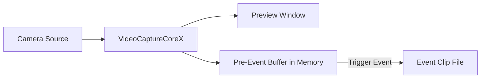

# Pre-Event Recording Using C# .Net: Circular Buffer Video Capture

Pre-event recording allows your application to continuously buffer video and audio in memory and save event clips that include footage from before the trigger occurred. Use it to record webcam video, capture IP camera streams, or save RTSP footage with motion detection triggers — essential for surveillance, security, and monitoring applications where capturing what happened before an event is critical.

## Key Features of Video Capture SDK .Net Pre-Event Recording

[Video Capture SDK .Net](https://www.visioforge.com/video-capture-sdk-net){ .md-button .md-button--primary target="_blank" }

- **Configurable buffer duration**: Buffer the last 5 to 120+ seconds of video in memory
- **Automatic post-event recording**: Continue recording for a configurable duration after the trigger
- **Multiple output formats**: MP4 (default), MPEG-TS (crash-safe), MKV
- **Extend on re-trigger**: If an event recurs during recording, the timer resets without creating a new file
- **Multiple independent outputs**: Add multiple pre-event recording outputs per pipeline
- **GPU-accelerated encoding**: Leverages NVENC, QSV, and AMF hardware encoders when available
- **Event notifications**: Receive callbacks when recording starts and stops

## How Pre-Event Recording Works



1. `VideoCaptureCoreX` captures video from a camera (webcam, IP camera, etc.) and displays a preview
2. Encoded frames are continuously stored in a circular buffer in memory
3. When you call `TriggerPreEventRecording()`, the buffer is flushed to a file
4. Live frames continue recording for the configured post-event duration
5. Recording stops automatically and the system returns to buffering mode

## Implementation Example

!!!info Demo Sample
    For a complete working project with XAML and all dependencies, see the [Pre-Event Recording VideoCaptureCoreX Demo](https://github.com/visioforge/.Net-SDK-s-samples/tree/master/Video%20Capture%20SDK%20X/WPF/CSharp/PreEventRecording).

### WPF Application with Camera, Motion Detection, and Pre-Event Recording

The following code is based on the [Pre-Event Recording WPF demo](https://github.com/visioforge/.Net-SDK-s-samples). It supports both local camera and RTSP IP camera sources, with motion detection for automatic recording triggers.

```csharp
using System;
using System.Diagnostics;
using System.IO;
using System.Linq;
using System.Windows;

using VisioForge.Core;
using VisioForge.Core.Types.Events;
using VisioForge.Core.Types.VideoProcessing;
using VisioForge.Core.Types.X.Output;
using VisioForge.Core.Types.X.PreEventRecording;
using VisioForge.Core.Types.X.Sources;
using VisioForge.Core.Types.X.VideoEncoders;
using VisioForge.Core.Types.X.AudioEncoders;
using VisioForge.Core.VideoCaptureX;

public partial class MainWindow : Window, IDisposable
{
    private VideoCaptureCoreX VideoCapture1;
    private string _outputFolder;
    private System.Timers.Timer _statusTimer;

    private async void BtStart_Click(object sender, RoutedEventArgs e)
    {
        _outputFolder = Path.Combine(
            Environment.GetFolderPath(Environment.SpecialFolder.MyVideos),
            "PreEventRecording");
        Directory.CreateDirectory(_outputFolder);

        // Create VideoCaptureCoreX with video preview
        VideoCapture1 = new VideoCaptureCoreX(VideoView1);
        VideoCapture1.OnError += (s, args) => Log($"[Error] {args.Message}");

        // Configure video source — camera or RTSP
        bool useRtsp = false; // Set to true for RTSP IP camera
        if (useRtsp)
        {
            var rtspSettings = await RTSPSourceSettings.CreateAsync(
                new Uri("rtsp://192.168.1.21:554/Streaming/Channels/101"),
                login: "admin",
                password: "password",
                audioEnabled: true);
            VideoCapture1.Video_Source = rtspSettings;
            VideoCapture1.Audio_Record = true;
        }
        else
        {
            // Local camera
            var device = (await DeviceEnumerator.Shared.VideoSourcesAsync()).FirstOrDefault();
            VideoCapture1.Video_Source = new VideoCaptureDeviceSourceSettings(device);

            // Local audio device
            var audioDevice = (await DeviceEnumerator.Shared.AudioSourcesAsync()).FirstOrDefault();
            if (audioDevice != null)
            {
                VideoCapture1.Audio_Source = audioDevice.CreateSourceSettingsVC(null);
                VideoCapture1.Audio_Record = true;
            }
        }

        // Enable motion detection for automatic triggering
        VideoCapture1.Motion_Detection = new MotionDetectionExSettings
        {
            ProcessorType = MotionProcessorType.None,
            DetectorType = MotionDetectorType.TwoFramesDifference,
            DifferenceThreshold = 15,
            SuppressNoise = true
        };
        VideoCapture1.OnMotionDetection += VideoCapture1_OnMotionDetection;

        // Add pre-event recording output with explicit encoders
        var preEventSettings = new PreEventRecordingSettings
        {
            PreEventDuration = TimeSpan.FromSeconds(10),
            PostEventDuration = TimeSpan.FromSeconds(5)
        };

        var preEventOutput = new PreEventRecordingOutput(
            settings: preEventSettings,
            videoEnc: new OpenH264EncoderSettings(),
            audioEnc: new VOAACEncoderSettings());
        VideoCapture1.Outputs_Add(preEventOutput);

        // Subscribe to recording events
        VideoCapture1.OnPreEventRecordingStarted += (s, args) =>
        {
            Log($"Recording started: {args.Filename}");
            Dispatcher.Invoke(() => lbRecFile.Text = $"File: {args.Filename}");
        };

        VideoCapture1.OnPreEventRecordingStopped += (s, args) =>
        {
            Log($"Recording stopped: {args.Filename}");
        };

        // Start capture — preview and buffering begin
        await VideoCapture1.StartAsync();

        // Start status timer
        _statusTimer = new System.Timers.Timer(500);
        _statusTimer.Elapsed += (s, args) => UpdateStatus();
        _statusTimer.Start();

        Log("Started. Buffering...");
    }

    // Motion detection handler: auto-trigger recording on motion
    private void VideoCapture1_OnMotionDetection(object sender, MotionDetectionExEventArgs e)
    {
        if (VideoCapture1 == null) return;

        bool isMotion = e.LevelPercent >= 5;
        if (!isMotion) return;

        var state = VideoCapture1.GetPreEventRecordingState(0);
        if (state == PreEventRecordingState.Buffering)
        {
            var filename = Path.Combine(_outputFolder,
                $"motion_{DateTime.Now:yyyyMMdd_HHmmss}.mp4");
            VideoCapture1.TriggerPreEventRecording(0, filename);
            Log($"Motion triggered recording: {filename}");
        }
        else if (state == PreEventRecordingState.Recording ||
                 state == PreEventRecordingState.PostEventRecording)
        {
            // Motion still active — extend the recording
            VideoCapture1.ExtendPreEventRecording(0);
        }
    }

    // Manual trigger button
    private void BtTrigger_Click(object sender, RoutedEventArgs e)
    {
        if (VideoCapture1 == null) return;

        var filename = Path.Combine(_outputFolder,
            $"event_{DateTime.Now:yyyyMMdd_HHmmss}.mp4");
        VideoCapture1.TriggerPreEventRecording(0, filename);
        Log($"Trigger recording: {filename}");
    }

    // Manual stop recording button
    private void BtStopRec_Click(object sender, RoutedEventArgs e)
    {
        VideoCapture1?.StopPreEventRecording(0);
        Log("Recording stopped manually.");
    }

    // Extend recording button
    private void BtExtend_Click(object sender, RoutedEventArgs e)
    {
        VideoCapture1?.ExtendPreEventRecording(0);
        Log("Post-event timer extended.");
    }

    // Monitor status periodically
    private void UpdateStatus()
    {
        if (VideoCapture1 == null) return;

        var state = VideoCapture1.GetPreEventRecordingState(0);
        Dispatcher.Invoke(() => lbState.Text = $"State: {state}");
    }

    // Stop and clean up
    private async void BtStop_Click(object sender, RoutedEventArgs e)
    {
        _statusTimer?.Stop();
        _statusTimer?.Dispose();

        if (VideoCapture1 != null)
        {
            VideoCapture1.OnMotionDetection -= VideoCapture1_OnMotionDetection;
            await VideoCapture1.StopAsync();
            await VideoCapture1.DisposeAsync();
            VideoCapture1 = null;
        }

        Log("Stopped.");
    }

    private void Window_Closing(object sender, System.ComponentModel.CancelEventArgs e)
    {
        _statusTimer?.Stop();
        _statusTimer?.Dispose();

        VideoCapture1?.DisposeAsync().GetAwaiter().GetResult();
        VisioForgeX.DestroySDK();
    }
}
```

## MPEG-TS Output for Crash Safety

For unattended or headless deployments, use MPEG-TS output to ensure recordings are always playable even if the process crashes:

```csharp
// Use the factory method for MPEG-TS output
var preEventOutput = PreEventRecordingOutput.CreateMPEGTS(
    settings: new PreEventRecordingSettings
    {
        PreEventDuration = TimeSpan.FromSeconds(30),
        PostEventDuration = TimeSpan.FromSeconds(10)
    });
core.Outputs_Add(preEventOutput);

// Trigger with .ts extension
core.TriggerPreEventRecording(0, "/recordings/event_001.ts");
```

!!!warning "MP4 vs MPEG-TS"
    MP4 files require a finalization step (writing the moov atom). If the process crashes during recording, the MP4 file may be unplayable. MPEG-TS does not have this requirement and is always playable, making it the recommended format for surveillance applications running unattended.

## MKV Output

```csharp
var preEventOutput = PreEventRecordingOutput.CreateMKV(
    settings: new PreEventRecordingSettings
    {
        PreEventDuration = TimeSpan.FromSeconds(30),
        PostEventDuration = TimeSpan.FromSeconds(10)
    });
core.Outputs_Add(preEventOutput);

core.TriggerPreEventRecording(0, "/recordings/event_001.mkv");
```

## API Reference

### PreEventRecordingOutput

| Constructor / Factory | Description |
| --- | --- |
| `new PreEventRecordingOutput(filename, settings, videoEnc, audioEnc)` | MP4 output with default or custom encoders. All args optional; use named args to skip `filename`. |
| `PreEventRecordingOutput.CreateMPEGTS(filename, settings, videoEnc, audioEnc)` | MPEG-TS output (crash-safe). All args optional. |
| `PreEventRecordingOutput.CreateMKV(filename, settings, videoEnc, audioEnc)` | MKV output. All args optional. |

### VideoCaptureCoreX Methods

| Method | Description |
| --- | --- |
| `TriggerPreEventRecording(int index, string filename)` | Flush buffer to file and start recording. `index` is the zero-based pre-event output index. |
| `TriggerPreEventRecordingAsync(int index, string filename)` | Async version of TriggerPreEventRecording. |
| `ExtendPreEventRecording(int index)` | Reset the post-event timer. Call when the trigger condition persists. |
| `StopPreEventRecording(int index)` | Manually stop recording and return to buffering. |
| `IsPreEventRecording(int index)` | Returns `true` if the output is currently recording. |
| `GetPreEventRecordingState(int index)` | Returns the current `PreEventRecordingState`. |

### VideoCaptureCoreX Properties

| Property | Type | Description |
| --- | :---: | --- |
| `PreEventRecording_Count` | int | Number of configured pre-event recording outputs. |

### VideoCaptureCoreX Events

| Event | Description |
| --- | --- |
| `OnPreEventRecordingStarted` | Fired when a pre-event recording begins. Includes filename and actual pre-event duration. |
| `OnPreEventRecordingStopped` | Fired when a recording finishes (timer expired or manual stop). |

### Available Encoders

**Video encoders:**

- OpenH264 (software, cross-platform)
- Intel QSV H264 (hardware)
- NVIDIA NVENC H264 (hardware)
- AMD AMF H264 (hardware)
- Intel QSV HEVC (hardware)
- NVIDIA NVENC HEVC (hardware)
- AMD AMF H265 (hardware)

**Audio encoders:**

- MP3
- VO-AAC
- AVENC AAC
- MF AAC (Windows only)

## Native Dependencies

Major SDK package (managed):

```xml
<PackageReference Include="VisioForge.DotNet.Core.VideoCaptureX" Version="15.x.x" />
```

Native dependencies for Windows x64:

```xml
<PackageReference Include="VisioForge.DotNet.Core.Redist.VideoCapture.x64" Version="15.x.x" />
```

For alternative platforms (macOS, Linux, Android, iOS), use the corresponding native dependency packages. See the [Deployment Guide](../../deployment-x/index.md) for details.

## Cross-Platform Compatibility

Pre-event recording is available on all platforms supported by Video Capture SDK .Net:

- Windows (x86, x64, ARM64)
- macOS (x64, ARM64)
- Linux (x64, ARM64)
- Android
- iOS

Platform availability depends on GStreamer muxer and encoder support. Hardware-accelerated encoders (NVENC, QSV, AMF) are available on platforms with compatible GPU hardware.
