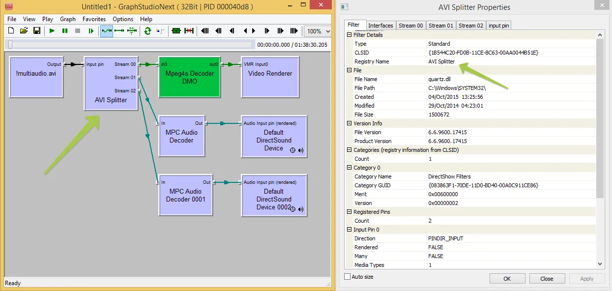
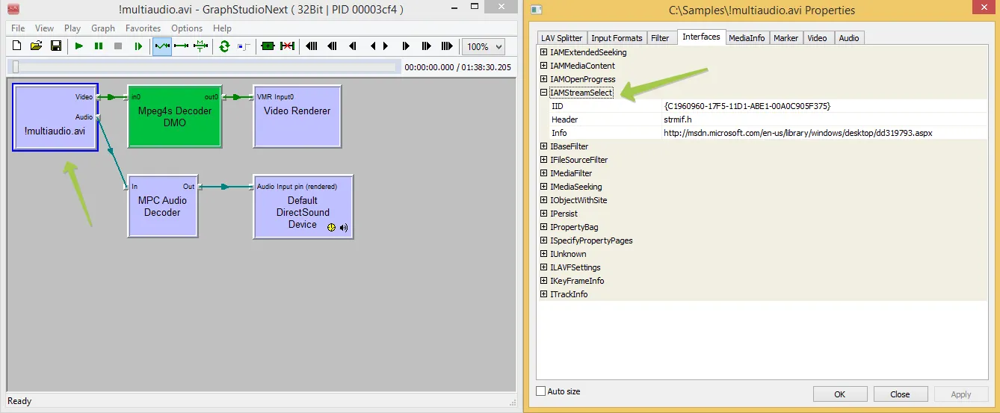

# Travailler avec plusieurs flux audio dans des fichiers vidéo

[Video Edit SDK .Net](https://www.visioforge.com/video-edit-sdk-net){ .md-button .md-button--primary target="_blank" } [VideoEditCore](#){ .md-button }

## Introduction aux flux audio multiples

Les fichiers vidéo contiennent couramment plusieurs flux audio pour prendre en charge différentes langues, pistes de commentaires ou qualités audio. Pour les développeurs créant des applications d'édition ou de traitement vidéo, gérer correctement ces flux multiples est essentiel pour produire des logiciels de niveau professionnel. Ce guide explore les défis techniques et les solutions pour travailler avec des fichiers vidéo à plusieurs flux audio dans des applications .NET.

Les flux audio multiples remplissent plusieurs fonctions importantes dans les applications vidéo :

- **Prise en charge multilingue** : fournir des pistes audio en différentes langues
- **Pistes de commentaires** : inclure le commentaire du réalisateur ou une narration alternative
- **Variations de qualité audio** : proposer différents débits ou formats (stéréo/surround)
- **Canaux audio spéciaux** : prise en charge de l'audiodescription pour l'accessibilité

## Contexte technique sur la gestion des flux audio

### Comprendre l'architecture DirectShow

Lorsque vous travaillez avec des fichiers vidéo contenant plusieurs flux audio, il est essentiel de comprendre comment l'architecture DirectShow sous-jacente traite ces flux. DirectShow utilise une architecture de graphe de filtres où chaque composant (filtre) traite des aspects spécifiques des données multimédias.

Le Video Edit SDK exploite le moteur DirectShow Editing Services (DES) pour le traitement multimédia, qui présente des limitations et des capacités spécifiques concernant la gestion de plusieurs flux audio. Ces limitations proviennent de la façon dont DES interagit avec différents types de filtres splitter.

### Types de filtres splitter et limitations

Les filtres splitter analysent les fichiers sources et extraient divers flux (vidéo, audio, sous-titres) pour traitement. Il existe deux mécanismes principaux par lesquels les splitters exposent plusieurs flux audio :

1. **Plusieurs broches de sortie** : certains splitters créent des broches de sortie séparées pour chaque flux audio
2. **Interface IAMStreamSelect** : d'autres utilisent cette interface pour permettre la sélection parmi plusieurs flux via une seule broche de sortie

Le moteur DirectShow Editing Services présente des limitations spécifiques lors du travail avec le premier type de splitter. Si vous devez accéder à un flux audio autre que le premier, vous pouvez rencontrer des restrictions avec certains types de splitters.

## Considérations spécifiques au format

### Prise en charge du format AVI

Le splitter AVI offre une excellente prise en charge des flux audio multiples. Lorsque vous travaillez avec des fichiers AVI, vous pouvez généralement accéder à tous les flux audio disponibles et les manipuler sans problèmes majeurs.

Ceci est démontré dans la visualisation du graphe de filtres ci-dessous :



Comme visible sur le diagramme, le splitter AVI crée des chemins séparés pour chaque flux audio, les rendant accessibles indépendamment via l'API du SDK.

### Défis avec les formats de conteneurs modernes

Les formats de conteneurs modernes comme MP4, MKV et MOV utilisent souvent des splitters plus sophistiqués tels que LAV Splitter. Bien que ces splitters prennent en charge une large gamme de formats et de codecs, ils peuvent présenter des défis lorsque vous tentez d'accéder simultanément à plusieurs flux audio.

Le graphe de filtres pour LAV Splitter démontre cette limitation :



LAV Splitter, bien qu'excellent pour la prise en charge des formats, n'expose pas les flux audio multiples d'une manière qui permette un accès direct aux flux secondaires via le moteur DES. Cette limitation nécessite des approches alternatives.

## Approches recommandées

### Méthode du fichier audio externe

L'approche la plus fiable pour gérer plusieurs flux audio consiste à extraire les pistes audio et à les utiliser comme fichiers externes séparés. Cette méthode contourne complètement les limitations des filtres splitter et offre une flexibilité maximale.

Étapes pour mettre en œuvre cette approche :

1. Extraire les flux audio souhaités du fichier vidéo source
2. Traiter chaque flux audio indépendamment
3. Combiner l'audio traité avec la vidéo lors de la sortie finale

Cette méthode garantit la compatibilité avec tous les types de formats et configurations de splitter.

### Sélection et configuration du splitter

Dans les scénarios où les fichiers audio externes ne sont pas envisageables, vous pouvez contrôler quel filtre splitter est utilisé pour analyser vos fichiers sources. En autorisant sélectivement uniquement certains splitters, vous pouvez vous assurer que votre application utilise des splitters qui exposent correctement plusieurs flux audio.

Utilisez la méthode `DirectShow_Filters_Blacklist_Add` pour exclure les splitters incompatibles :

```csharp
// Exemple : exclure LAV Splitter pour forcer l'utilisation des splitters natifs
videoEdit.DirectShow_Filters_Blacklist_Add("{B98D13E7-55DB-4385-A33D-09FD1BA26338}");
```

Pour des exemples d'implémentation plus détaillés, consultez la [documentation API sur le travail avec plusieurs sources](output-file-from-multiple-sources.md).

## Considérations de performance

Travailler avec plusieurs flux audio peut avoir un impact sur les performances, en particulier avec une vidéo haute résolution ou des exigences de traitement complexes. Tenez compte de ces stratégies d'optimisation :

- Pré-extraire les flux audio pour des projets d'édition complexes
- Utiliser l'accélération matérielle lorsqu'elle est disponible
- Mettre en œuvre des mécanismes de mise en tampon pour une lecture plus fluide
- Envisager un sous-échantillonnage temporaire pendant les opérations d'aperçu

## Composants et dépendances requis

Pour mettre en œuvre les techniques décrites dans ce guide, vous devrez inclure les dépendances suivantes :

- Redist Video Edit SDK [x86](https://www.nuget.org/packages/VisioForge.DotNet.Core.Redist.VideoEdit.x86/) [x64](https://www.nuget.org/packages/VisioForge.DotNet.Core.Redist.VideoEdit.x64/)

Pour des informations sur le déploiement de ces dépendances sur les systèmes des utilisateurs finaux, consultez la [documentation de déploiement](../deployment.md).

## Conclusion

Gérer efficacement plusieurs flux audio dans des fichiers vidéo nécessite de comprendre l'architecture sous-jacente et les limitations des composants DirectShow. En utilisant les techniques appropriées — qu'il s'agisse de fichiers audio externes, de sélection de splitter ou de méthodes API spécialisées — les développeurs peuvent créer des applications vidéo robustes qui prennent en charge correctement le contenu multilingue, les pistes de commentaires et d'autres scénarios multi-audio.

Pour des scénarios d'implémentation avancés et des exemples de code supplémentaires, consultez notre [dépôt GitHub](https://github.com/visioforge/.Net-SDK-s-samples).

---
Visitez notre page [GitHub](https://github.com/visioforge/.Net-SDK-s-samples) pour obtenir plus d'exemples de code.