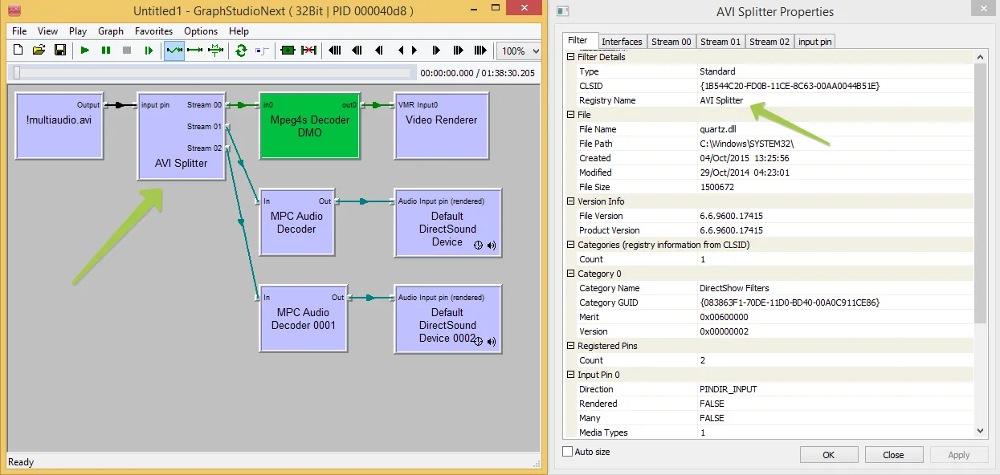
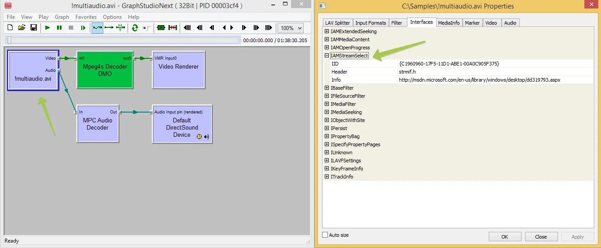

# Working with Multiple Audio Streams in Video Files

[Video Edit SDK .Net](https://www.visioforge.com/video-edit-sdk-net){ .md-button .md-button--primary target="_blank" } [VideoEditCore](#){ .md-button }

## Introduction to Multiple Audio Streams

Video files commonly contain multiple audio streams to support different languages, commentary tracks, or audio qualities. For developers building video editing or processing applications, properly handling these multiple streams is essential for creating professional-grade software. This guide explores the technical challenges and solutions for working with multi-audio stream video files in .NET applications.

Multiple audio streams serve several important purposes in video applications:

- **Multilingual support**: Providing audio tracks in different languages
- **Commentary tracks**: Including director's commentary or alternative narration
- **Audio quality variations**: Offering different bitrates or formats (stereo/surround)
- **Special audio channels**: Supporting descriptive audio for accessibility

## Technical Background on Audio Stream Handling

### Understanding DirectShow Architecture

When working with video files containing multiple audio streams, it's crucial to understand how the underlying DirectShow architecture processes these streams. DirectShow uses a filter graph architecture where each component (filter) processes specific aspects of media data.

The Video Edit SDK leverages DirectShow Editing Services (DES) engine for media processing, which comes with specific limitations and capabilities regarding multiple audio stream handling. These limitations stem from how DES interacts with different types of splitter filters.

### Splitter Filter Types and Limitations

Splitter filters parse source files and extract various streams (video, audio, subtitles) for processing. There are two primary mechanisms through which splitters expose multiple audio streams:

1. **Multiple output pins**: Some splitters create separate output pins for each audio stream
2. **IAMStreamSelect interface**: Others use this interface to allow selection from multiple streams through a single output pin

The DirectShow Editing Services engine has specific limitations when working with the first type of splitter. If you need to access any audio stream other than the first one, you may encounter restrictions with certain splitter types.

## Format-Specific Considerations

### AVI Format Support

The AVI splitter provides excellent support for multiple audio streams. When working with AVI files, you can typically access and manipulate all available audio streams without significant issues.

This is demonstrated in the filter graph visualization below:



As visible in the diagram, the AVI splitter creates separate pathways for each audio stream, making them independently accessible through the SDK's API.

### Challenges with Modern Container Formats

Modern container formats like MP4, MKV, and MOV often use more sophisticated splitters such as LAV Splitter. While these splitters support a wide range of formats and codecs, they can present challenges when attempting to access multiple audio streams simultaneously.

The filter graph for LAV Splitter demonstrates this limitation:



LAV Splitter, though excellent for format support, does not expose multiple audio streams in a way that allows direct access to secondary streams through the DES engine. This limitation necessitates alternative approaches.

## Recommended Approaches

### External Audio File Method

The most reliable approach for handling multiple audio streams is to extract and work with audio tracks as separate external files. This method completely bypasses the limitations of splitter filters and provides maximum flexibility.

Steps for implementing this approach:

1. Extract the desired audio streams from the source video file
2. Process each audio stream independently
3. Combine the processed audio with the video during final output

This method ensures compatibility across all format types and splitter configurations.

### Splitter Selection and Configuration

In scenarios where external audio files are not feasible, you can control which splitter filter is used to parse your source files. By selectively allowing only certain splitters, you can ensure that your application uses splitters that properly expose multiple audio streams.

Use the `DirectShow_Filters_Blacklist_Add` method to exclude incompatible splitters:

```csharp
// Example: Exclude LAV Splitter to force the use of native splitters
videoEdit.DirectShow_Filters_Blacklist_Add("{B98D13E7-55DB-4385-A33D-09FD1BA26338}");
```

For more detailed implementation examples, refer to the [API documentation for working with multiple sources](output-file-from-multiple-sources.md).

## Performance Considerations

Working with multiple audio streams can impact performance, especially with high-resolution video or complex processing requirements. Consider these optimization strategies:

- Pre-extract audio streams for complex editing projects
- Use hardware acceleration when available
- Implement buffering mechanisms for smoother playback
- Consider temporary downsampling during preview operations

## Required Components and Dependencies

To implement the techniques described in this guide, you'll need to include the following dependencies:

- Video Edit SDK redist [x86](https://www.nuget.org/packages/VisioForge.DotNet.Core.Redist.VideoEdit.x86/) [x64](https://www.nuget.org/packages/VisioForge.DotNet.Core.Redist.VideoEdit.x64/)

For information on deploying these dependencies to end-user systems, refer to the [deployment documentation](../deployment.md).

## Conclusion

Effectively handling multiple audio streams in video files requires understanding the underlying architecture and limitations of DirectShow components. By using the appropriate techniques—whether external audio files, splitter selection, or specialized API methods—developers can create robust video applications that properly support multilingual content, commentary tracks, and other multi-audio scenarios.

For advanced implementation scenarios and additional code examples, check out our [GitHub repository](https://github.com/visioforge/.Net-SDK-s-samples).

---
Visit our [GitHub](https://github.com/visioforge/.Net-SDK-s-samples) page to get more code samples.