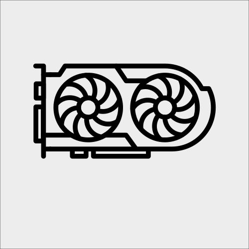

<!-- Hero Section -->

    <h1>VisioForge Products</h1>
    
Professional video capture, playback, editing, and processing SDKs for .NET, Delphi, and DirectShow developers. Build powerful multimedia applications with ease.

    
    

        <a href="docs/dotnet/" class="vf-sdk-card">
            <h3>.NET SDKs</h3>
            
Comprehensive video playback, capture, and editing with hardware acceleration, real-time processing, and support for all major platforms.

            Explore Documentation →
        </a>
        <a href="docs/vfp/" class="vf-sdk-card">
            <h3>Video Fingerprinting SDK</h3>
            
Create unique digital signatures of video content to detect duplicates, identify fragments, and match transformed videos.

            Explore Documentation →
        </a>
        <a href="docs/delphi/" class="vf-sdk-card">
            <h3>Delphi / ActiveX SDKs</h3>
            
Powerful Delphi/ActiveX libraries for video playback, capture, and editing with x64 support for professional media applications.

            Explore Documentation →
        </a>
        <a href="docs/directshow/" class="vf-sdk-card">
            <h3>DirectShow SDKs & Filters</h3>
            
DirectShow filters and SDKs for video playback, processing, encoding, and multimedia application development.

            Explore Documentation →
        </a>
    

<!-- Supported Platforms -->

    <h2>Cross-Platform Support</h2>
    
Build once, deploy everywhere. Our SDKs support all major platforms.

    

        

            
            Windows
        

        

            
            macOS
        

        

            
            Linux
        

        

            
            iOS
        

        

            
            Android
        

        

            
            Raspberry Pi
        

        

            
            NVIDIA Jetson
        

    

<!-- Documentation Features -->

    <h2>Comprehensive Developer Resources</h2>
    
Everything you need to integrate video capabilities into your applications

    

        

            

            <h3>In-Depth Documentation</h3>
            
Detailed API references, step-by-step guides, and architecture overviews covering all SDK features, classes, and methods with practical usage examples.

        

        

            

            <h3>Code Samples & GitHub Projects</h3>
            
Copy-paste code snippets in C#, VB.NET, and Delphi, plus complete downloadable sample applications for WinForms, WPF, MAUI, Avalonia, Uno, and console apps on GitHub.

        

        

            

            <h3>Video Tutorials</h3>
            
Step-by-step video walkthroughs showing how to build webcam capture, screen recording, IP camera streaming, and video editing applications.

        

        

            

            <h3>Deployment Guides</h3>
            
Platform-specific deployment instructions for Windows, macOS, Linux, iOS, Android, and embedded devices like Raspberry Pi and NVIDIA Jetson.

        

        

            

            <h3>Troubleshooting & FAQ</h3>
            
Solutions to common issues, performance optimization tips, licensing guidance, and answers to frequently asked developer questions.

        

        

            

            <h3>Hardware Acceleration</h3>
            
GPU-accelerated video encoding and decoding with NVIDIA NVENC/NVDEC, Intel Quick Sync, and AMD AMF for high-performance video processing.

        

    

<!-- CTA Banner -->

    <h2>Ready to Build Amazing Media Apps?</h2>
    
Download our SDKs with a free trial and start building today

    

        <a href="https://www.visioforge.com/buy" class="btn primary">View Pricing</a>
        <a href="https://support.visioforge.com/" class="btn secondary">Contact Support</a>
    

<!-- SEO Content Section -->

    <h2>About This Documentation</h2>
    
Welcome to the official VisioForge SDK documentation hub — your complete resource for building professional video and multimedia applications. Whether you're developing video surveillance systems, media players, video editors, live streaming platforms, or screen recording software, our documentation provides everything you need to succeed.

    
    
Our documentation is designed for developers of all skill levels and includes:

    <ul>
        <li><strong>Getting Started Guides</strong> — Quick setup instructions to have your first video application running in minutes</li>
        <li><strong>API Reference Documentation</strong> — Complete coverage of all classes, methods, properties, and events with detailed explanations</li>
        <li><strong>Code Samples & Snippets</strong> — Hundreds of copy-ready examples in C# and VB.NET for common and advanced scenarios</li>
        <li><strong>Video Tutorials</strong> — Visual step-by-step guides for tasks like webcam capture, MP4 recording, RTSP streaming, and video effects</li>
        <li><strong>Full Sample Projects</strong> — Complete applications available on our <a href="https://github.com/visioforge/.Net-SDK-s-samples" target="_blank">GitHub repository</a> for WinForms, WPF, MAUI, Avalonia, Uno, and console apps</li>
        <li><strong>Platform-Specific Guides</strong> — Detailed deployment and configuration instructions for Windows, macOS, Linux, iOS, Android, Raspberry Pi, and NVIDIA Jetson</li>
        <li><strong>Format & Codec References</strong> — Documentation for all supported video formats (MP4, AVI, MKV, WebM), codecs (H.264, HEVC, AV1, VP9), and streaming protocols (RTSP, RTMP, HLS, SRT, NDI)</li>
    </ul>
    
    
Our SDKs support the complete .NET ecosystem including .NET Framework 4.7.2+, .NET 5/6/7/8/9, and UI frameworks like WinForms, WPF, MAUI, Avalonia, Uno, and Blazor. With hardware-accelerated encoding and decoding via NVIDIA NVENC/NVDEC, Intel Quick Sync, and AMD AMF, you can build high-performance applications that leverage modern GPU capabilities.

    
    
Join thousands of developers worldwide who trust VisioForge SDKs for their multimedia projects. Explore our documentation, download the sample projects, and start building your next video application today. Need help? Our <a href="https://support.visioforge.com/" target="_blank">support team</a> and <a href="https://discord.com/invite/yvXUG56WCH" target="_blank">Discord community</a> are here to assist you.

