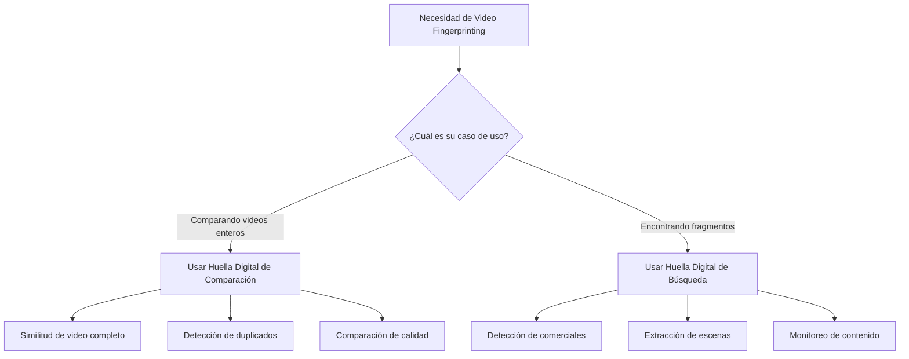

# Tipos de Huella Digital: Búsqueda vs Comparación

## Introducción

El SDK de Video Fingerprinting de VisioForge (disponible para .NET y C++) proporciona dos tipos de huella digital distintos, cada uno optimizado para casos de uso específicos. Entender las diferencias fundamentales entre **Búsqueda** y **Comparación** de huellas digitales es crucial para lograr rendimiento y precisión óptimos en sus aplicaciones de análisis de video.

Esta decisión arquitectónica surge de los requisitos inherentemente diferentes de buscar fragmentos de video versus comparar videos enteros. Mientras que ambos tipos analizan contenido de video para crear firmas únicas, emplean algoritmos diferentes, estructuras de datos y estrategias de optimización adaptadas a sus propósitos específicos.

## Arquitectura Técnica

### Diferencias Principales

El SDK implementa dos pipelines de procesamiento separados a través de llamadas API nativas distintas:

| Aspecto | Huella Digital de Comparación | Huella Digital de Búsqueda |
|--------|-------------------------------|----------------------------|
| **API Nativa** | Funciones `VFPCompare_*` | Funciones `VFPSearch_*` |
| **Estructura de Datos** | `VFPCompareData` | `VFPSearchData` |
| **Algoritmo Enfoque** | Similitud de video completo | Detección de fragmentos |
| **Resolución Temporal** | Precisión de nivel de segundo | Precisión de nivel de milisegundo |
| **Objetivo de Optimización** | Velocidad para búsqueda de ventana deslizante | |

### Diferencias de Estructura Interna

**Huellas Digitales de Comparación** usan una estructura de datos completa que captura características globales del video entero:

- Mantiene coherencia temporal a través de la duración completa
- Almacena firmas detalladas frame-por-frame
- Optimizada para comparación tolerante a shift
- Huella de memoria mayor para mejor precisión

**Huellas Digitales de Búsqueda** emplean una estructura compacta, optimizada para búsqueda:

- Usa firmas compatibles con ventana deslizante
- Implementa tablas hash para búsqueda rápida
- Reduce redundancia de información para almacenamiento compacto
- Huella de memoria menor para procesamiento más rápido

### Variaciones de Pipeline de Procesamiento

#### SDK .NET
```csharp
// Procesamiento de huella digital de comparación
VFPCompare.Process(frameData, width, height, stride, timestamp, ref compareData);

// Procesamiento de huella digital de búsqueda
VFPSearch.Process(frameData, width, height, stride, timestamp, ref searchData);
```

#### SDK C++
```cpp
// Procesamiento de huella digital de comparación
VFPCompare_Process(compareData, frameData, width, height, stride, timestamp);

// Procesamiento de huella digital de búsqueda
VFPSearch_Process(searchData, frameData, width, height, stride, timestamp);
```

Cada pipeline implementa algoritmos de extracción de características diferentes optimizados para sus respectivos casos de uso. Los algoritmos principales son idénticos entre SDKs .NET y C++, asegurando resultados consistentes en todas las plataformas.

## Huellas Digitales de Comparación

### Cuándo Usar

Las huellas digitales de comparación son ideales para:

- **Detección de duplicados**: Encontrar videos idénticos o casi idénticos en una colección
- **Evaluación de calidad**: Comparar diferentes codificaciones del mismo contenido
- **Rastreo de versiones**: Identificar diferentes ediciones o versiones de un video
- **Verificación de copyright**: Determinar si dos videos contienen el mismo contenido
- **Autenticación de contenido**: Verificar integridad y autenticidad de video

### Cómo Funcionan

Las huellas digitales de comparación analizan el video entero para crear una firma completa:

1. **Análisis de Frame**: Cada frame es procesado para extraer características visuales
2. **Agregación Temporal**: Características son agregadas sobre ventanas de tiempo
3. **Firma Global**: Una firma completa representando el video entero es generada
4. **Tolerancia a Shift**: El algoritmo cuenta con desalineación temporal

### Características de Rendimiento

| Métrica | Valor Típico | Notas |
|---------|--------------|-------|
| **Velocidad de Generación** | 10-15x tiempo real | Depende de resolución y CPU |
| **Uso de Memoria** | ~250 KB/minuto | Lineal con duración de video |
| **Velocidad de Comparación** | < 1ms | Para dos huellas digitales |
| **Precisión** | 95-99% | Para contenido similar |

### Ejemplo de Código: Generando Huellas Digitales de Comparación

```csharp
using VisioForge.Core.VideoFingerPrinting;

public async Task<VFPFingerPrint> GenerateCompareFingerprint(string videoFile)
{
    // Configurar la fuente
    var source = new VFPFingerprintSource(videoFile)
    {
        StartTime = TimeSpan.Zero,
        StopTime = TimeSpan.FromMinutes(5), // Analizar primeros 5 minutos
        CustomResolution = new Size(640, 480), // Normalizar resolución
        CustomCropSize = new Rect(0, 60, 0, 60) // Recortar barras letterbox
    };
    
    // Agregar áreas ignoradas (ej. marcas de agua, logos)
    source.IgnoredAreas.Add(new Rect(10, 10, 100, 50)); // Logo superior izquierda
    
    // Generar huella digital
    var fingerprint = await VFPAnalyzer.GetComparingFingerprintForVideoFileAsync(
        source,
        error => Console.WriteLine($"Error: {error}"),
        progress => Console.WriteLine($"Progreso: {progress}%")
    );
    
    return fingerprint;
}

// Comparar dos videos
public async Task<bool> CompareVideos(string video1, string video2)
{
    var fp1 = await GenerateCompareFingerprint(video1);
    var fp2 = await GenerateCompareFingerprint(video2);
    
    // Permitir hasta 10 segundos de shift temporal
    var difference = VFPAnalyzer.Compare(fp1, fp2, TimeSpan.FromSeconds(10));
    
    // Valores más bajos indican mayor similitud
    const int SIMILARITY_THRESHOLD = 500;
    return difference < SIMILARITY_THRESHOLD;
}
```

### Análisis de Huella de Memoria

Las huellas digitales de comparación escalan linealmente con la duración del video:

- **1 minuto de video**: ~250 KB
- **30 minutos de video**: ~7.5 MB
- **2 horas de película**: ~30 MB

La estructura de datos mantiene información temporal completa para comparación precisa.

## Huellas Digitales de Búsqueda

### Cuándo Usar

Las huellas digitales de búsqueda están optimizadas para:

- **Detección de comerciales**: Encontrar anuncios o comerciales en contenido broadcast
- **Detección de intro/outro**: Localizar secuencias de apertura o cierre
- **Extracción de escenas**: Encontrar escenas específicas a través de múltiples videos
- **Monitoreo de fragmentos**: Detectar cuándo aparecen clips específicos en streams
- **Moderación de contenido**: Identificar contenido prohibido en fragmentos

### Cómo Funcionan

Las huellas digitales de búsqueda usan un algoritmo diferente optimizado para detección de fragmentos:

1. **Ventana Deslizante**: Crea firmas superpuestas para búsqueda eficiente
2. **Hashing de Características**: Usa tablas hash para búsqueda rápida
3. **Redundancia Reducida**: Elimina información duplicada para almacenamiento compacto
4. **Coincidencia Rápida**: Optimizada para operaciones de ventana deslizante

### Características de Rendimiento

| Métrica | Valor Típico | Notas |
|---------|--------------|-------|
| **Velocidad de Generación** | 15-20x tiempo real | Más rápido que tipo comparación |
| **Uso de Memoria** | ~150 KB/minuto | Más compacto |
| **Velocidad de Búsqueda** | 100-500x tiempo real | Depende de longitud de contenido |
| **Tasa de Detección** | 90-95% | Para fragmentos > 3 segundos |

### Ejemplo de Código: Implementación de Búsqueda de Fragmentos

```csharp
using VisioForge.Core.VideoFingerPrinting;

public class VideoFragmentSearcher
{
    // Generar huella digital de búsqueda para un fragmento (ej. comercial)
    public async Task<VFPFingerPrint> CreateFragmentFingerprint(
        string fragmentFile, 
        TimeSpan start, 
        TimeSpan duration)
    {
        var source = new VFPFingerprintSource(fragmentFile)
        {
            StartTime = start,
            StopTime = start + duration
        };
        
        // Usar generación de huella digital optimizada para búsqueda
        return await VFPAnalyzer.GetSearchFingerprintForVideoFileAsync(
            source,
            error => Console.WriteLine($"Error: {error}"),
            progress => Console.WriteLine($"Análisis de fragmento: {progress}%")
        );
    }
    
    // Buscar fragmento en un video más largo
    public async Task<List<TimeSpan>> FindFragmentOccurrences(
        string fragmentFile,
        string targetVideoFile,
        TimeSpan fragmentDuration)
    {
        // Crear huella digital de fragmento (aguja)
        var fragmentFp = await CreateFragmentFingerprint(
            fragmentFile, 
            TimeSpan.Zero, 
            fragmentDuration
        );
        
        // Crear huella digital de video objetivo (pajar)
        var targetSource = new VFPFingerprintSource(targetVideoFile);
        var targetFp = await VFPAnalyzer.GetSearchFingerprintForVideoFileAsync(
            targetSource,
            error => Console.WriteLine($"Error: {error}"),
            progress => Console.WriteLine($"Análisis objetivo: {progress}%")
        );
        
        // Buscar todas las ocurrencias
        const int MAX_DIFFERENCE = 20; // Ajustar basado en requisitos de calidad
        var occurrences = await VFPAnalyzer.SearchAsync(
            fragmentFp,
            targetFp,
            fragmentDuration,
            MAX_DIFFERENCE,
            allowMultipleFragments: true
        );
        
        return occurrences;
    }
    
    // Ejemplo práctico: Encontrar todos los comerciales en una grabación
    public async Task DetectCommercials(string recordingFile, string[] commercialFiles)
    {
        foreach (var commercial in commercialFiles)
        {
            var positions = await FindFragmentOccurrences(
                commercial,
                recordingFile,
                TimeSpan.FromSeconds(30) // Duración típica de comercial
            );
            
            Console.WriteLine($"Comercial '{Path.GetFileName(commercial)}' encontrado en:");
            foreach (var position in positions)
            {
                Console.WriteLine($"  - {position:mm\\:ss}");
            }
        }
    }
}
```

### Optimización de Base de Datos

Las huellas digitales de búsqueda están diseñadas para almacenamiento eficiente en base de datos:

```csharp
// Almacenar huella digital en base de datos
public void StoreSearchFingerprint(VFPFingerPrint fingerprint, string databasePath)
{
    // Serializar a formato binario compacto
    byte[] data = fingerprint.Save();
    
    // Almacenar con metadatos para indexación
    var metadata = new
    {
        Id = fingerprint.ID,
        Duration = fingerprint.Duration,
        Size = data.Length,
        OriginalFile = fingerprint.OriginalFilename
    };
    
    // Guardar en base de datos (MongoDB, SQL, etc.)
    // ...
}
```

## Matriz de Decisión

### Guía de Decisión Rápida



### Tabla de Comparación Detallada

| Criterios | Huella Digital de Comparación | Huella Digital de Búsqueda |
|-----------|-------------------------------|----------------------------|
| **Caso de Uso** | Comparación de video completo | Detección de fragmentos |
| **Duración Típica** | Videos completos (minutos a horas) | Clips cortos (segundos a minutos) |
| **Eficiencia de Memoria** | Estándar | Alta |
| **Rendimiento de Búsqueda** | No optimizado | Altamente optimizado |
| **Precisión de Comparación** | Muy Alta | Alta |
| **Resolución Temporal** | Nivel de segundo | Nivel de milisegundo |
| **Almacenamiento en BD** | Huella mayor | Huella menor |
| **Velocidad de Procesamiento** | Estándar | Más rápido |
| **Tolerancia a Shift** | Incorporada | Limitada |
| **Soporte Multi-fragmento** | No | Sí |

### Comparación de Rendimiento

| Operación | Tipo Comparación | Tipo Búsqueda |
|-----------|------------------|---------------|
| **Procesamiento de 1 hora de video** | 240 segundos | 180 segundos |
| **Tamaño de huella digital (1 hora)** | ~15 MB | ~9 MB |
| **Velocidad de comparación (dos videos de 1 hora)** | < 1ms | N/A |
| **Velocidad de búsqueda (fragmento de 5 min en video de 1 hora)** | No óptimo | ~200ms |
| **Uso de memoria durante procesamiento** | ~500 MB | ~300 MB |

## Ejemplos de Implementación

### Implementación Completa de Comparación

```csharp
public class VideoComparisonService
{
    private readonly string _licenseKey;
    
    public VideoComparisonService(string licenseKey)
    {
        _licenseKey = licenseKey;
        VFPAnalyzer.SetLicenseKey(licenseKey);
    }
    
    public async Task<ComparisonResult> CompareVideosWithDetails(
        string video1Path,
        string video2Path,
        ComparisonOptions options = null)
    {
        options ??= new ComparisonOptions();
        
        // Configurar fuentes con preprocesamiento
        var source1 = ConfigureSource(video1Path, options);
        var source2 = ConfigureSource(video2Path, options);
        
        // Generar huellas digitales en paralelo
        var fp1Task = VFPAnalyzer.GetComparingFingerprintForVideoFileAsync(
            source1,
            error => LogError("Video 1", error),
            progress => LogProgress("Video 1", progress)
        );
        
        var fp2Task = VFPAnalyzer.GetComparingFingerprintForVideoFileAsync(
            source2,
            error => LogError("Video 2", error),
            progress => LogProgress("Video 2", progress)
        );
        
        var fingerprints = await Task.WhenAll(fp1Task, fp2Task);
        
        // Realizar comparación con tolerancia a shift
        var difference = VFPAnalyzer.Compare(
            fingerprints[0],
            fingerprints[1],
            options.MaxTemporalShift
        );
        
        return new ComparisonResult
        {
            Video1 = video1Path,
            Video2 = video2Path,
            Difference = difference,
            IsMatch = difference < options.SimilarityThreshold,
            Confidence = CalculateConfidence(difference),
            ProcessingTime = DateTime.Now - startTime
        };
    }
    
    private VFPFingerprintSource ConfigureSource(string path, ComparisonOptions options)
    {
        var source = new VFPFingerprintSource(path);
        
        if (options.NormalizeResolution)
        {
            source.CustomResolution = new Size(640, 360);
        }
        
        if (options.CropLetterbox)
        {
            source.CustomCropSize = new Rect(0, 60, 0, 60);
        }
        
        // Agregar áreas comunes de marca de agua para ignorar
        if (options.IgnoreWatermarks)
        {
            source.IgnoredAreas.Add(new Rect(10, 10, 150, 50)); // Superior izquierda
            source.IgnoredAreas.Add(new Rect(500, 10, 130, 40)); // Superior derecha
        }
        
        return source;
    }
    
    private double CalculateConfidence(int difference)
    {
        // Convertir diferencia a porcentaje de confianza
        if (difference == 0) return 100.0;
        if (difference > 1000) return 0.0;
        return Math.Max(0, 100.0 - (difference / 10.0));
    }
}

public class ComparisonOptions
{
    public TimeSpan MaxTemporalShift { get; set; } = TimeSpan.FromSeconds(10);
    public int SimilarityThreshold { get; set; } = 500;
    public bool NormalizeResolution { get; set; } = true;
    public bool CropLetterbox { get; set; } = true;
    public bool IgnoreWatermarks { get; set; } = true;
}
```

### Implementación Completa de Búsqueda

```csharp
public class FragmentSearchService
{
    private readonly Dictionary<string, VFPFingerPrint> _fingerprintCache;
    
    public FragmentSearchService(string licenseKey)
    {
        VFPAnalyzer.SetLicenseKey(licenseKey);
        _fingerprintCache = new Dictionary<string, VFPFingerPrint>();
    }
    
    public async Task<SearchResults> SearchFragmentsInVideo(
        List<FragmentDefinition> fragments,
        string targetVideo,
        SearchOptions options = null)
    {
        options ??= new SearchOptions();
        var results = new SearchResults();
        
        // Generar huella digital de video objetivo
        var targetFp = await GetOrCreateFingerprint(targetVideo, options);
        
        // Buscar cada fragmento
        foreach (var fragment in fragments)
        {
            var fragmentFp = await CreateFragmentFingerprint(fragment, options);
            
            var occurrences = await VFPAnalyzer.SearchAsync(
                fragmentFp,
                targetFp,
                fragment.Duration,
                options.MaxDifference,
                options.FindAllOccurrences
            );
            
            results.AddFragment(fragment, occurrences);
        }
        
        return results;
    }
    
    private async Task<VFPFingerPrint> CreateFragmentFingerprint(
        FragmentDefinition fragment,
        SearchOptions options)
    {
        var source = new VFPFingerprintSource(fragment.FilePath)
        {
            StartTime = fragment.StartTime,
            StopTime = fragment.StartTime + fragment.Duration
        };
        
        // Aplicar preprocesamiento
        if (options.PreprocessFragments)
        {
            source.CustomResolution = new Size(320, 240); // Más bajo para velocidad
        }
        
        return await VFPAnalyzer.GetSearchFingerprintForVideoFileAsync(
            source,
            error => Console.WriteLine($"Error de fragmento: {error}"),
            progress => { } // Progreso silencioso para fragmentos
        );
    }
    
    private async Task<VFPFingerPrint> GetOrCreateFingerprint(
        string videoPath,
        SearchOptions options)
    {
        // Verificar caché primero
        if (options.UseCache && _fingerprintCache.ContainsKey(videoPath))
        {
            return _fingerprintCache[videoPath];
        }
        
        // Verificar almacenamiento persistente
        var storagePath = GetFingerprintPath(videoPath);
        if (File.Exists(storagePath) && options.UsePersistentCache)
        {
            var fp = VFPFingerPrint.Load(storagePath);
            if (options.UseCache)
            {
                _fingerprintCache[videoPath] = fp;
            }
            return fp;
        }
        
        // Generar nueva huella digital
        var source = new VFPFingerprintSource(videoPath);
        var fingerprint = await VFPAnalyzer.GetSearchFingerprintForVideoFileAsync(
            source,
            error => Console.WriteLine($"Error objetivo: {error}"),
            progress => Console.WriteLine($"Analizando objetivo: {progress}%")
        );
        
        // Almacenar en caché resultados
        if (options.UseCache)
        {
            _fingerprintCache[videoPath] = fingerprint;
        }
        
        if (options.UsePersistentCache)
        {
            fingerprint.Save(storagePath);
        }
        
        return fingerprint;
    }
    
    private string GetFingerprintPath(string videoPath)
    {
        var hash = ComputeFileHash(videoPath);
        return Path.Combine(
            Environment.GetFolderPath(Environment.SpecialFolder.LocalApplicationData),
            "VideoFingerprints",
            $"{hash}.vsigx"
        );
    }
}

public class SearchOptions
{
    public int MaxDifference { get; set; } = 20;
    public bool FindAllOccurrences { get; set; } = true;
    public bool UseCache { get; set; } = true;
    public bool UsePersistentCache { get; set; } = true;
    public bool PreprocessFragments { get; set; } = true;
}
```

## Benchmarks de Rendimiento

### Comparación de Velocidad de Generación

Probando con un archivo de video de 1080p, 60 minutos:

| Tipo de Huella Digital | Tiempo de Procesamiento | Factor de Velocidad | Uso de CPU | Pico de Memoria |
|------------------------|-------------------------|---------------------|------------|----------------|
| Comparación (Completa) | 240 segundos | 15x tiempo real | 85% | 512 MB |
| Comparación (5 min) | 20 segundos | 15x tiempo real | 85% | 256 MB |
| Búsqueda (Completa) | 180 segundos | 20x tiempo real | 75% | 384 MB |
| Búsqueda (5 min) | 15 segundos | 20x tiempo real | 75% | 192 MB |

### Comparación de Uso de Memoria

Consumo de memoria para diferentes duraciones de video:

```csharp
// Código de benchmark
public async Task<MemoryBenchmark> BenchmarkMemoryUsage(string videoFile, TimeSpan duration)
{
    var source = new VFPFingerprintSource(videoFile)
    {
        StopTime = duration
    };
    
    // Medir huella digital de comparación
    var compareMemoryBefore = GC.GetTotalMemory(true);
    var compareFp = await VFPAnalyzer.GetComparingFingerprintForVideoFileAsync(source);
    var compareMemoryAfter = GC.GetTotalMemory(false);
    
    // Medir huella digital de búsqueda
    var searchMemoryBefore = GC.GetTotalMemory(true);
    var searchFp = await VFPAnalyzer.GetSearchFingerprintForVideoFileAsync(source);
    var searchMemoryAfter = GC.GetTotalMemory(false);
    
    return new MemoryBenchmark
    {
        Duration = duration,
        CompareMemoryUsage = compareMemoryAfter - compareMemoryBefore,
        CompareFingerprintSize = compareFp.Data.Length,
        SearchMemoryUsage = searchMemoryAfter - searchMemoryBefore,
        SearchFingerprintSize = searchFp.Data.Length
    };
}
```

Resultados:

| Duración | Memoria Comparación | Tamaño Comparación | Memoria Búsqueda | Tamaño Búsqueda |
|----------|---------------------|---------------------|------------------|-----------------|
| 1 min | 8 MB | 250 KB | 5 MB | 150 KB |
| 10 min | 25 MB | 2.5 MB | 15 MB | 1.5 MB |
| 60 min | 120 MB | 15 MB | 72 MB | 9 MB |

### Rendimiento de Búsqueda

Rendimiento de búsqueda de fragmento (fragmento de 5 minutos en varios largos de video):

| Duración Objetivo | Tiempo de Búsqueda | Factor de Velocidad | Coincidencias Encontradas |
|-------------------|---------------------|---------------------|--------------------------|
| 30 minutos | 120 ms | 15,000x | 1 |
| 1 hora | 200 ms | 18,000x | 2 |
| 2 horas | 350 ms | 20,571x | 4 |
| 4 horas | 650 ms | 22,153x | 8 |

## Mejores Prácticas

### Cuándo Usar Huellas Digitales de Comparación

1. **Sistema de Detección de Duplicados**

   ```csharp
   // Ideal para encontrar videos duplicados en colecciones grandes
   public async Task<List<DuplicateGroup>> FindDuplicates(string[] videoFiles)
   {
       var fingerprints = new Dictionary<string, VFPFingerPrint>();
       
       // Generar huellas digitales para todos los videos
       foreach (var file in videoFiles)
       {
           var source = new VFPFingerprintSource(file);
           fingerprints[file] = await VFPAnalyzer.GetComparingFingerprintForVideoFileAsync(source);
       }
       
       // Comparar todos los pares
       var duplicates = new List<DuplicateGroup>();
       for (int i = 0; i < videoFiles.Length - 1; i++)
       {
           for (int j = i + 1; j < videoFiles.Length; j++)
           {
               var diff = VFPAnalyzer.Compare(
                   fingerprints[videoFiles[i]],
                   fingerprints[videoFiles[j]],
                   TimeSpan.FromSeconds(5)
               );
               
               if (diff < 300) // Muy similar
               {
                   duplicates.Add(new DuplicateGroup(videoFiles[i], videoFiles[j], diff));
               }
           }
       }
       
       return duplicates;
   }
   ```

2. **Evaluación de Calidad**

   ```csharp
   // Comparar diferentes codificaciones del mismo contenido
   public async Task<QualityReport> AssessEncodingQuality(
       string originalFile,
       string encodedFile)
   {
       var source1 = new VFPFingerprintSource(originalFile);
       var source2 = new VFPFingerprintSource(encodedFile);
       
       var fp1 = await VFPAnalyzer.GetComparingFingerprintForVideoFileAsync(source1);
       var fp2 = await VFPAnalyzer.GetComparingFingerprintForVideoFileAsync(source2);
       
       var difference = VFPAnalyzer.Compare(fp1, fp2, TimeSpan.Zero);
       
       return new QualityReport
       {
           ContentMatch = difference < 100,
           QualityScore = 100 - (difference / 10),
           Details = AnalyzeDifferences(fp1, fp2)
       };
   }
   ```

### Cuándo Usar Huellas Digitales de Búsqueda

1. **Detección de Comerciales**

   ```csharp
   // Encontrar y remover comerciales de grabaciones
   public async Task<EditList> DetectCommercialsForRemoval(
       string recording,
       string[] knownCommercials)
   {
       var editList = new EditList();
       var recordingFp = await CreateSearchFingerprint(recording);
       
       foreach (var commercial in knownCommercials)
       {
           var commercialFp = await CreateSearchFingerprint(commercial);
           var positions = await VFPAnalyzer.SearchAsync(
               commercialFp,
               recordingFp,
               TimeSpan.FromSeconds(30),
               maxDifference: 15,
               allowMultipleFragments: true
           );
           
           foreach (var position in positions)
           {
               editList.AddCut(position, position + TimeSpan.FromSeconds(30));
           }
       }
       
       return editList;
   }
   ```

2. **Monitoreo de Contenido**

   ```csharp
   // Monitorear streams en vivo para contenido específico
   public class StreamMonitor
   {
       private readonly List<VFPFingerPrint> _prohibitedContent;
       
       public async Task<MonitoringResult> CheckStream(
           string streamSegmentFile)
       {
           var streamFp = await CreateSearchFingerprint(streamSegmentFile);
           
           foreach (var prohibited in _prohibitedContent)
           {
               var matches = await VFPAnalyzer.SearchAsync(
                   prohibited,
                   streamFp,
                   prohibited.Duration,
                   maxDifference: 25,
                   allowMultipleFragments: false
               );
               
               if (matches.Any())
               {
                   return new MonitoringResult
                   {
                       ContainsProhibitedContent = true,
                       MatchedContent = prohibited.Tag,
                       Position = matches.First()
                   };
               }
           }
           
           return new MonitoringResult { ContainsProhibitedContent = false };
       }
   }
   ```

### Errores Comunes a Evitar

1. **Usar Comparación para Búsqueda de Fragmentos**

   ```csharp
   // ❌ ERRÓNEO: Usar huellas digitales de comparación para búsqueda
   var fp1 = await VFPAnalyzer.GetComparingFingerprintForVideoFileAsync(source1);
   var fp2 = await VFPAnalyzer.GetComparingFingerprintForVideoFileAsync(source2);
   // ¡Esto no funcionará eficientemente para búsqueda de fragmentos!
   
   // ✅ CORRECTO: Usar huellas digitales de búsqueda
   var fp1 = await VFPAnalyzer.GetSearchFingerprintForVideoFileAsync(source1);
   var fp2 = await VFPAnalyzer.GetSearchFingerprintForVideoFileAsync(source2);
   var results = await VFPAnalyzer.SearchAsync(fp1, fp2, duration, maxDiff, true);
   ```

2. **No Almacenar en Caché Huellas Digitales**

   ```csharp
   // ❌ ERRÓNEO: Regenerar huellas digitales cada vez
   foreach (var query in queries)
   {
       var fp = await VFPAnalyzer.GetSearchFingerprintForVideoFileAsync(source);
       // Regeneración derrochadora
   }
   
   // ✅ CORRECTO: Generar una vez, usar múltiples veces
   var fp = await VFPAnalyzer.GetSearchFingerprintForVideoFileAsync(source);
   fp.Save("cache/fingerprint.vsigx");
   
   // Después...
   var cachedFp = VFPFingerPrint.Load("cache/fingerprint.vsigx");
   ```

3. **Valores de Umbral Incorrectos**

   ```csharp
   // ❌ ERRÓNEO: Usar mismo umbral para diferentes tipos
   const int THRESHOLD = 100;
   var compareResult = VFPAnalyzer.Compare(fp1, fp2, shift); // Puede ser demasiado estricto
   var searchResult = VFPSearch.Search(fp1, 0, fp2, 0, out diff, THRESHOLD); // Puede ser demasiado laxo
   
   // ✅ CORRECTO: Umbrales específicos de tipo
   const int COMPARE_THRESHOLD = 500; // Más tolerante para comparación completa
   const int SEARCH_THRESHOLD = 20;   // Más estricto para coincidencia de fragmentos
   ```

### Consejos de Optimización

1. **Preprocesamiento para Mejor Coincidencia**

   ```csharp
   public VFPFingerprintSource OptimizeSource(string videoFile)
   {
       var source = new VFPFingerprintSource(videoFile);
       
       // Normalizar resolución para resultados consistentes
       source.CustomResolution = new Size(640, 360);
       
       // Remover interferencia común
       source.CustomCropSize = new Rect(0, 60, 0, 60); // Remover letterbox
       
       // Ignorar overlays dinámicos
       source.IgnoredAreas.Add(new Rect(10, 10, 200, 50)); // Logo de canal
       source.IgnoredAreas.Add(new Rect(500, 400, 140, 40)); // Timestamp
       
       return source;
   }
   ```

2. **Optimización de Procesamiento por Lotes**

   ```csharp
   public async Task ProcessBatch(string[] files, bool useParallel = true)
   {
       if (useParallel)
       {
           // Procesar en paralelo con concurrencia controlada
           var semaphore = new SemaphoreSlim(Environment.ProcessorCount);
           var tasks = files.Select(async file =>
           {
               await semaphore.WaitAsync();
               try
               {
                   return await GenerateFingerprint(file);
               }
               finally
               {
                   semaphore.Release();
               }
           });
           
           await Task.WhenAll(tasks);
       }
       else
       {
           // Procesamiento secuencial para entornos con memoria limitada
           foreach (var file in files)
           {
               await GenerateFingerprint(file);
               GC.Collect(); // Forzar limpieza entre archivos
           }
       }
   }
   ```

### Configuraciones Personalizadas de Huella Digital

```csharp
public class CustomFingerprintConfig
{
    public VFPFingerprintSource CreateCustomSource(
        string file,
        FingerprintPurpose purpose)
    {
        var source = new VFPFingerprintSource(file);
        
        switch (purpose)
        {
            case FingerprintPurpose.BroadcastMonitoring:
                // Optimizar para contenido broadcast
                source.CustomResolution = new Size(720, 576);
                source.IgnoredAreas.Add(new Rect(0, 0, 720, 50)); // Banner superior
                source.IgnoredAreas.Add(new Rect(0, 526, 720, 50)); // Ticker inferior
                break;
                
            case FingerprintPurpose.MovieComparison:
                // Optimizar para contenido cinematográfico
                source.CustomCropSize = new Rect(0, 138, 0, 138); // 21:9 a 16:9
                source.CustomResolution = new Size(1280, 720);
                break;
                
            case FingerprintPurpose.WebVideoAnalysis:
                // Optimizar para videos web
                source.CustomResolution = new Size(480, 360);
                // Ignorar posiciones comunes de marca de agua
                source.IgnoredAreas.Add(new Rect(10, 10, 150, 50));
                source.IgnoredAreas.Add(new Rect(320, 10, 150, 50));
                break;
        }
        
        return source;
    }
}
```

### Estrategias de Almacenamiento en Base de Datos

```csharp
public class FingerprintDatabase
{
    private readonly string _connectionString;
    
    public async Task StoreFingerprintEfficiently(VFPFingerPrint fingerprint, bool isSearchType)
    {
        // Comprimir datos de huella digital
        var compressedData = Compress(fingerprint.Data);
        
        // Almacenar con metadatos para indexación
        var record = new FingerprintRecord
        {
            Id = fingerprint.ID,
            Type = isSearchType ? "Search" : "Compare",
            CompressedData = compressedData,
            OriginalSize = fingerprint.Data.Length,
            CompressedSize = compressedData.Length,
            Duration = fingerprint.Duration,
            VideoInfo = new VideoMetadata
            {
                FileName = fingerprint.OriginalFilename,
                Width = fingerprint.Width,
                Height = fingerprint.Height,
                FrameRate = fingerprint.FrameRate
            },
            CreatedAt = DateTime.UtcNow
        };
        
        // Usar colección/tabla apropiada basada en tipo
        var collection = isSearchType ? "search_fingerprints" : "compare_fingerprints";
        await SaveToDatabase(collection, record);
        
        // Crear índices para consultas eficientes
        if (isSearchType)
        {
            await CreateIndex(collection, "Duration");
            await CreateIndex(collection, "VideoInfo.FileName");
        }
    }
    
    private byte[] Compress(byte[] data)
    {
        using (var output = new MemoryStream())
        {
            using (var gzip = new GZipStream(output, CompressionLevel.Optimal))
            {
                gzip.Write(data, 0, data.Length);
            }
            return output.ToArray();
        }
    }
}
```

### Consideraciones de Procesamiento Distribuido

```csharp
public class DistributedFingerprintProcessor
{
    public async Task<VFPFingerPrint> ProcessDistributed(
        string videoFile,
        int workerCount = 4)
    {
        var fileInfo = new FileInfo(videoFile);
        var segmentDuration = TimeSpan.FromMinutes(fileInfo.Length / (1024 * 1024 * 100)); // Estimar
        
        // Dividir video en segmentos
        var segments = await SplitVideo(videoFile, workerCount);
        
        // Procesar segmentos en paralelo (podría ser en máquinas diferentes)
        var tasks = segments.Select(async (segment, index) =>
        {
            var source = new VFPFingerprintSource(segment.TempFile)
            {
                StartTime = TimeSpan.Zero,
                StopTime = segment.Duration
            };
            
            // Procesar en worker (local o remoto)
            return await ProcessOnWorker(source, index);
        });
        
        var partialFingerprints = await Task.WhenAll(tasks);
        
        // Fusionar resultados
        return MergeFingerprints(partialFingerprints);
    }
    
    private async Task<VFPFingerPrint> ProcessOnWorker(
        VFPFingerprintSource source,
        int workerId)
    {
        // Podría despachar a worker remoto vía API
        Console.WriteLine($"Worker {workerId} procesando segmento");
        
        // Usar tipo Search para segmentos (más eficiente)
        return await VFPAnalyzer.GetSearchFingerprintForVideoFileAsync(source);
    }
}
```

## Estrategias de Migración

### Migrando de Comparación a Búsqueda

Si ha estado usando huellas digitales de comparación para detección de fragmentos y quiere migrar a huellas digitales de búsqueda para mejor rendimiento:

```csharp
public class MigrationHelper
{
    public async Task MigrateToSearchFingerprints(
        string[] videoFiles,
        string oldFingerprintDir,
        string newFingerprintDir)
    {
        var migrationLog = new List<MigrationRecord>();
        
        foreach (var videoFile in videoFiles)
        {
            try
            {
                // Verificar si existe huella digital de comparación antigua
                var oldPath = Path.Combine(oldFingerprintDir, $"{Path.GetFileNameWithoutExtension(videoFile)}.vsigx");
                var oldFingerprint = File.Exists(oldPath) ? VFPFingerPrint.Load(oldPath) : null;
                
                // Generar nueva huella digital de búsqueda
                var source = new VFPFingerprintSource(videoFile);
                var newFingerprint = await VFPAnalyzer.GetSearchFingerprintForVideoFileAsync(source);
                
                // Guardar nueva huella digital
                var newPath = Path.Combine(newFingerprintDir, $"{Path.GetFileNameWithoutExtension(videoFile)}_search.vsigx");
                newFingerprint.Save(newPath);
                
                // Registrar migración
                migrationLog.Add(new MigrationRecord
                {
                    VideoFile = videoFile,
                    OldSize = oldFingerprint?.Data.Length ?? 0,
                    NewSize = newFingerprint.Data.Length,
                    SizeReduction = oldFingerprint != null 
                        ? (1 - (double)newFingerprint.Data.Length / oldFingerprint.Data.Length) * 100 
                        : 0,
                    Success = true
                });
            }
            catch (Exception ex)
            {
                migrationLog.Add(new MigrationRecord
                {
                    VideoFile = videoFile,
                    Success = false,
                    Error = ex.Message
                });
            }
        }
        
        // Generar reporte de migración
        GenerateMigrationReport(migrationLog);
    }
}
```

## Conclusión

La distinción entre tipos de huella digital de búsqueda y comparación en el SDK de Video Fingerprinting de VisioForge refleja una estrategia de optimización fundamental: cada tipo está construido específicamente para su caso de uso. Las huellas digitales de comparación sobresalen en similitud de video completo con alta precisión, mientras que las huellas digitales de búsqueda proporcionan rendimiento superior para detección de fragmentos y operaciones de base de datos.

Puntos clave a recordar:

- **Usar huellas digitales de comparación** para detección de duplicados, evaluación de calidad y comparación completa
- **Usar huellas digitales de búsqueda** para detección de fragmentos, identificación de comerciales y monitoreo de contenido
- **Considerar características de rendimiento** al elegir entre tipos
- **Implementar estrategias de caché** para evitar procesamiento redundante
- **Aplicar preprocesamiento** para mejorar precisión de coincidencia
- **Almacenar huellas digitales eficientemente** usando compresión y indexación apropiada de base de datos

Al entender estas diferencias y seguir las mejores prácticas descritas en esta guía, puede construir sistemas eficientes y precisos de análisis de video que escalen para manejar colecciones de video grandes mientras mantienen rendimiento óptimo.

## Recursos Adicionales

- [Página de Producto SDK de Video Fingerprinting](https://www.visioforge.com/video-fingerprinting-sdk)
- [Repositorio de Muestras GitHub](https://github.com/visioforge/.Net-SDK-s-samples/)
- [Canal de Soporte Discord](https://discord.com/invite/yvXUG56WCH)

````