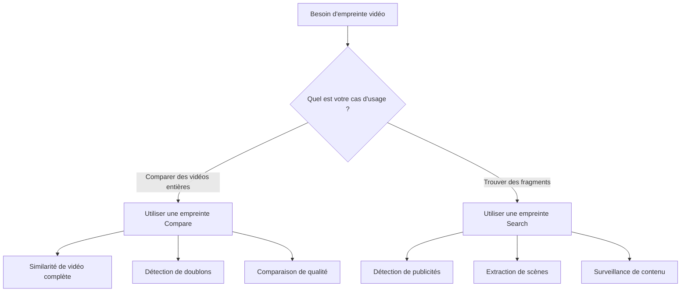

# Types d'empreinte : Search vs Compare

## Introduction

Le Video Fingerprinting SDK de VisioForge (disponible à la fois pour .NET et C++) fournit deux types d'empreintes distincts, chacun optimisé pour des cas d'usage spécifiques. Comprendre les différences fondamentales entre les empreintes **Search** et **Compare** est crucial pour atteindre des performances et une précision optimales dans vos applications d'analyse vidéo.

Cette décision architecturale découle des exigences intrinsèquement différentes entre la recherche de fragments vidéo et la comparaison de vidéos entières. Bien que les deux types analysent le contenu vidéo pour créer des signatures uniques, ils emploient des algorithmes, des structures de données et des stratégies d'optimisation différents, adaptés à leurs finalités spécifiques.

## Architecture technique

### Différences fondamentales

Le SDK implémente deux pipelines de traitement séparés via des appels d'API natives distincts :

| Aspect | Empreinte Compare | Empreinte Search |
|--------|-------------------|-------------------|
| **API native** | Fonctions `VFPCompare_*` | Fonctions `VFPSearch_*` |
| **Structure de données** | `VFPCompareData` | `VFPSearchData` |
| **Focus de l'algorithme** | Similarité de vidéo entière | Détection de fragments |
| **Résolution temporelle** | Précision à la seconde | Précision à la milliseconde |
| **Cible d'optimisation** | Précision pour comparaison complète | Vitesse pour recherche par fenêtre glissante |

### Différences de structure interne

Les **empreintes Compare** utilisent une structure de données exhaustive qui capture les caractéristiques globales de toute la vidéo :

- Maintient la cohérence temporelle sur toute la durée
- Stocke des signatures détaillées image par image
- Optimisée pour la comparaison tolérante au décalage
- Empreinte mémoire plus importante pour une meilleure précision

Les **empreintes Search** emploient une structure compacte, optimisée pour la recherche :

- Utilise des signatures compatibles avec la fenêtre glissante
- Implémente des tables de recherche rapides pour une correspondance rapide
- Redondance des données réduite pour une recherche efficace
- Empreinte mémoire plus petite pour un traitement plus rapide

### Variations du pipeline de traitement

#### SDK .NET
```csharp
// Traitement d'empreinte Compare
VFPCompare.Process(frameData, width, height, stride, timestamp, ref compareData);

// Traitement d'empreinte Search  
VFPSearch.Process(frameData, width, height, stride, timestamp, ref searchData);
```

#### SDK C++
```cpp
// Traitement d'empreinte Compare
VFPCompare_Process(compareData, frameData, width, height, stride, timestamp);

// Traitement d'empreinte Search
VFPSearch_Process(searchData, frameData, width, height, stride, timestamp);
```

Chaque pipeline implémente différents algorithmes d'extraction de caractéristiques optimisés pour leurs cas d'usage respectifs. Les algorithmes principaux sont identiques entre les SDK .NET et C++, garantissant des résultats cohérents entre les plateformes.

## Empreintes Compare

### Quand les utiliser

Les empreintes Compare sont idéales pour :

- **Détection de doublons** : trouver des vidéos identiques ou quasi identiques dans une collection
- **Évaluation de la qualité** : comparer différents encodages du même contenu
- **Suivi de versions** : identifier différents montages ou versions d'une vidéo
- **Vérification de droits d'auteur** : déterminer si deux vidéos contiennent le même contenu
- **Authentification de contenu** : vérifier l'intégrité et l'authenticité d'une vidéo

### Comment elles fonctionnent

Les empreintes Compare analysent la vidéo entière pour créer une signature exhaustive :

1. **Analyse d'images** : chaque image est traitée pour extraire les caractéristiques visuelles
2. **Agrégation temporelle** : les caractéristiques sont agrégées sur des fenêtres temporelles
3. **Signature globale** : une signature complète représentant la vidéo entière est générée
4. **Tolérance au décalage** : l'algorithme prend en compte le désalignement temporel

### Caractéristiques de performance

| Métrique | Valeur typique | Notes |
|--------|--------------|-------|
| **Vitesse de génération** | 10 à 15x temps réel | Dépend de la résolution et du CPU |
| **Utilisation mémoire** | ~250 Ko/minute | Linéaire avec la durée vidéo |
| **Vitesse de comparaison** | < 1 ms | Pour deux empreintes |
| **Précision** | 95 à 99 % | Pour des contenus similaires |

### Exemple de code : génération d'empreintes Compare

```csharp
using VisioForge.Core.VideoFingerPrinting;

public async Task<VFPFingerPrint> GenerateCompareFingerprint(string videoFile)
{
    // Configurer la source
    var source = new VFPFingerprintSource(videoFile)
    {
        StartTime = TimeSpan.Zero,
        StopTime = TimeSpan.FromMinutes(5), // Analyser les 5 premières minutes
        CustomResolution = new Size(640, 480), // Normaliser la résolution
        // Le constructeur de Rect est (left, top, right, bottom) — pour une image 1920x1080,
        // rogner les barres letterbox de 60px en haut et en bas donne la région visible (0, 60)..(1920, 1020).
        CustomCropSize = new Rect(0, 60, 1920, 1020) // Rogner les barres letterbox
    };

    // Ajouter les zones ignorées (left, top, right, bottom) — logo 100x50 en haut à gauche.
    source.IgnoredAreas.Add(new Rect(10, 10, 110, 60)); // Logo en haut à gauche
    
    // Générer l'empreinte
    var fingerprint = await VFPAnalyzer.GetComparingFingerprintForVideoFileAsync(
        source,
        error => Console.WriteLine($"Erreur : {error}"),
        progress => Console.WriteLine($"Progression : {progress}%")
    );
    
    return fingerprint;
}

// Comparer deux vidéos
public async Task<bool> CompareVideos(string video1, string video2)
{
    var fp1 = await GenerateCompareFingerprint(video1);
    var fp2 = await GenerateCompareFingerprint(video2);
    
    // Autoriser jusqu'à 10 secondes de décalage temporel
    var difference = VFPAnalyzer.Compare(fp1, fp2, TimeSpan.FromSeconds(10));
    
    // Les valeurs plus basses indiquent une plus grande similarité
    const int SIMILARITY_THRESHOLD = 500;
    return difference < SIMILARITY_THRESHOLD;
}
```

### Analyse de l'empreinte mémoire

Les empreintes Compare évoluent linéairement avec la durée de la vidéo :

- **Vidéo de 1 minute** : ~250 Ko
- **Vidéo de 30 minutes** : ~7,5 Mo  
- **Film de 2 heures** : ~30 Mo

La structure de données conserve l'information temporelle complète pour une comparaison précise.

## Empreintes Search

### Quand les utiliser

Les empreintes Search sont optimisées pour :

- **Détection de publicités** : trouver des annonces ou publicités dans un contenu diffusé
- **Détection d'intro/outro** : localiser les séquences d'ouverture ou de fin
- **Extraction de scènes** : trouver des scènes spécifiques dans plusieurs vidéos
- **Surveillance de fragments** : détecter l'apparition de clips spécifiques dans des flux
- **Modération de contenu** : identifier des fragments de contenu interdits

### Comment elles fonctionnent

Les empreintes Search utilisent un algorithme différent optimisé pour la détection de fragments :

1. **Fenêtre glissante** : crée des signatures qui se chevauchent pour une recherche efficace
2. **Hachage de caractéristiques** : utilise des tables de hachage pour une recherche rapide
3. **Redondance réduite** : élimine les informations dupliquées pour un stockage compact
4. **Correspondance rapide** : optimisée pour les opérations de recherche par fenêtre glissante

### Caractéristiques de performance

| Métrique | Valeur typique | Notes |
|--------|--------------|-------|
| **Vitesse de génération** | 15 à 20x temps réel | Plus rapide que le type Compare |
| **Utilisation mémoire** | ~150 Ko/minute | Plus compacte |
| **Vitesse de recherche** | 100 à 500x temps réel | Dépend de la longueur du contenu |
| **Taux de détection** | 90 à 95 % | Pour des fragments > 3 secondes |

### Exemple de code : implémentation de recherche de fragments

```csharp
using VisioForge.Core.VideoFingerPrinting;

public class VideoFragmentSearcher
{
    // Générer une empreinte de recherche pour un fragment (par exemple, une publicité)
    public async Task<VFPFingerPrint> CreateFragmentFingerprint(
        string fragmentFile, 
        TimeSpan start, 
        TimeSpan duration)
    {
        var source = new VFPFingerprintSource(fragmentFile)
        {
            StartTime = start,
            StopTime = start + duration
        };
        
        // Utiliser la génération d'empreinte optimisée pour la recherche
        return await VFPAnalyzer.GetSearchFingerprintForVideoFileAsync(
            source,
            error => Console.WriteLine($"Erreur : {error}"),
            progress => Console.WriteLine($"Analyse du fragment : {progress}%")
        );
    }
    
    // Rechercher un fragment dans une vidéo plus longue
    public async Task<List<TimeSpan>> FindFragmentOccurrences(
        string fragmentFile,
        string targetVideoFile,
        TimeSpan fragmentDuration)
    {
        // Créer l'empreinte du fragment (aiguille)
        var fragmentFp = await CreateFragmentFingerprint(
            fragmentFile, 
            TimeSpan.Zero, 
            fragmentDuration
        );
        
        // Créer l'empreinte de la vidéo cible (botte de foin)
        var targetSource = new VFPFingerprintSource(targetVideoFile);
        var targetFp = await VFPAnalyzer.GetSearchFingerprintForVideoFileAsync(
            targetSource,
            error => Console.WriteLine($"Erreur : {error}"),
            progress => Console.WriteLine($"Analyse de la cible : {progress}%")
        );
        
        // Rechercher toutes les occurrences
        const int MAX_DIFFERENCE = 20; // Ajuster selon les exigences de qualité
        var occurrences = await VFPAnalyzer.SearchAsync(
            fragmentFp,
            targetFp,
            fragmentDuration,
            MAX_DIFFERENCE,
            allowMultipleFragments: true
        );
        
        return occurrences;
    }
    
    // Exemple pratique : trouver toutes les publicités dans un enregistrement
    public async Task DetectCommercials(string recordingFile, string[] commercialFiles)
    {
        foreach (var commercial in commercialFiles)
        {
            var positions = await FindFragmentOccurrences(
                commercial,
                recordingFile,
                TimeSpan.FromSeconds(30) // Longueur typique d'une publicité
            );
            
            Console.WriteLine($"Publicité « {Path.GetFileName(commercial)} » trouvée à :");
            foreach (var position in positions)
            {
                Console.WriteLine($"  - {position:mm\\:ss}");
            }
        }
    }
}
```

### Optimisation de la base de données

Les empreintes Search sont conçues pour un stockage efficace en base de données :

```csharp
// Stocker une empreinte en base de données
public void StoreSearchFingerprint(VFPFingerPrint fingerprint, string databasePath)
{
    // Sérialiser dans un format binaire compact
    byte[] data = fingerprint.Save();
    
    // Stocker avec des métadonnées pour l'indexation
    var metadata = new
    {
        Id = fingerprint.ID,
        Duration = fingerprint.Duration,
        Size = data.Length,
        OriginalFile = fingerprint.OriginalFilename
    };
    
    // Enregistrer en base de données (MongoDB, SQL, etc.)
    // ...
}
```

## Matrice de décision

### Guide de décision rapide



### Tableau de comparaison détaillé

| Critère | Empreinte Compare | Empreinte Search |
|----------|-------------------|-------------------|
| **Cas d'usage** | Comparaison de vidéos entières | Détection de fragments |
| **Durée typique** | Vidéos complètes (minutes à heures) | Clips courts (secondes à minutes) |
| **Efficacité mémoire** | Standard | Élevée |
| **Performance de recherche** | Non optimisée | Hautement optimisée |
| **Précision de comparaison** | Très élevée | Élevée |
| **Précision temporelle** | À la seconde | À la milliseconde |
| **Stockage en base** | Empreinte plus importante | Empreinte plus petite |
| **Vitesse de traitement** | Standard | Plus rapide |
| **Tolérance au décalage** | Intégrée | Limitée |
| **Prise en charge multi-fragments** | Non | Oui |

### Comparaison de performance

| Opération | Type Compare | Type Search |
|-----------|-------------|-------------|
| **Traitement d'une vidéo de 1 heure** | ~4 minutes | ~3 minutes |
| **Taille d'empreinte (1 heure)** | ~15 Mo | ~9 Mo |
| **Vitesse de comparaison (deux vidéos de 1 heure)** | < 1 ms | N/A |
| **Vitesse de recherche (fragment de 5 min dans vidéo de 1 heure)** | Non optimale | ~200 ms |
| **Utilisation mémoire pendant le traitement** | ~500 Mo | ~300 Mo |

## Exemples d'implémentation

### Implémentation Compare complète

```csharp
public class VideoComparisonService
{
    private readonly string _licenseKey;
    
    public VideoComparisonService(string licenseKey)
    {
        _licenseKey = licenseKey;
        VFPAnalyzer.SetLicenseKey(licenseKey);
    }
    
    public async Task<ComparisonResult> CompareVideosWithDetails(
        string video1Path,
        string video2Path,
        ComparisonOptions options = null)
    {
        options ??= new ComparisonOptions();
        
        // Configurer les sources avec prétraitement
        var source1 = ConfigureSource(video1Path, options);
        var source2 = ConfigureSource(video2Path, options);
        
        // Générer les empreintes en parallèle
        var fp1Task = VFPAnalyzer.GetComparingFingerprintForVideoFileAsync(
            source1,
            error => LogError("Vidéo 1", error),
            progress => LogProgress("Vidéo 1", progress)
        );
        
        var fp2Task = VFPAnalyzer.GetComparingFingerprintForVideoFileAsync(
            source2,
            error => LogError("Vidéo 2", error),
            progress => LogProgress("Vidéo 2", progress)
        );
        
        var fingerprints = await Task.WhenAll(fp1Task, fp2Task);
        
        // Effectuer la comparaison avec tolérance de décalage
        var difference = VFPAnalyzer.Compare(
            fingerprints[0],
            fingerprints[1],
            options.MaxTemporalShift
        );
        
        return new ComparisonResult
        {
            Video1 = video1Path,
            Video2 = video2Path,
            Difference = difference,
            IsMatch = difference < options.SimilarityThreshold,
            Confidence = CalculateConfidence(difference),
            ProcessingTime = DateTime.Now - startTime
        };
    }
    
    private VFPFingerprintSource ConfigureSource(string path, ComparisonOptions options)
    {
        var source = new VFPFingerprintSource(path);
        
        if (options.NormalizeResolution)
        {
            source.CustomResolution = new Size(640, 360);
        }
        
        if (options.CropLetterbox)
        {
            // (left, top, right, bottom) — barres de 60px en haut + bas sur une source 1920x1080.
            source.CustomCropSize = new Rect(0, 60, 1920, 1020);
        }
        
        // Ajouter les zones de filigrane courantes à ignorer
        if (options.IgnoreWatermarks)
        {
            source.IgnoredAreas.Add(new Rect(10, 10, 150, 50)); // Haut à gauche
            source.IgnoredAreas.Add(new Rect(500, 10, 130, 40)); // Haut à droite
        }
        
        return source;
    }
    
    private double CalculateConfidence(int difference)
    {
        // Convertir la différence en pourcentage de confiance
        if (difference == 0) return 100.0;
        if (difference > 1000) return 0.0;
        return Math.Max(0, 100.0 - (difference / 10.0));
    }
}

public class ComparisonOptions
{
    public TimeSpan MaxTemporalShift { get; set; } = TimeSpan.FromSeconds(10);
    public int SimilarityThreshold { get; set; } = 500;
    public bool NormalizeResolution { get; set; } = true;
    public bool CropLetterbox { get; set; } = true;
    public bool IgnoreWatermarks { get; set; } = true;
}
```

### Implémentation Search complète

```csharp
public class FragmentSearchService
{
    private readonly Dictionary<string, VFPFingerPrint> _fingerprintCache;
    
    public FragmentSearchService(string licenseKey)
    {
        VFPAnalyzer.SetLicenseKey(licenseKey);
        _fingerprintCache = new Dictionary<string, VFPFingerPrint>();
    }
    
    public async Task<SearchResults> SearchFragmentsInVideo(
        List<FragmentDefinition> fragments,
        string targetVideo,
        SearchOptions options = null)
    {
        options ??= new SearchOptions();
        var results = new SearchResults();
        
        // Générer l'empreinte de la vidéo cible
        var targetFp = await GetOrCreateFingerprint(targetVideo, options);
        
        // Rechercher chaque fragment
        foreach (var fragment in fragments)
        {
            var fragmentFp = await CreateFragmentFingerprint(fragment, options);
            
            var occurrences = await VFPAnalyzer.SearchAsync(
                fragmentFp,
                targetFp,
                fragment.Duration,
                options.MaxDifference,
                options.FindAllOccurrences
            );
            
            results.AddFragment(fragment, occurrences);
        }
        
        return results;
    }
    
    private async Task<VFPFingerPrint> CreateFragmentFingerprint(
        FragmentDefinition fragment,
        SearchOptions options)
    {
        var source = new VFPFingerprintSource(fragment.FilePath)
        {
            StartTime = fragment.StartTime,
            StopTime = fragment.StartTime + fragment.Duration
        };
        
        // Appliquer le prétraitement
        if (options.PreprocessFragments)
        {
            source.CustomResolution = new Size(320, 240); // Résolution plus basse pour la vitesse
        }
        
        return await VFPAnalyzer.GetSearchFingerprintForVideoFileAsync(
            source,
            error => Console.WriteLine($"Erreur de fragment : {error}"),
            progress => { } // Progression silencieuse pour les fragments
        );
    }
    
    private async Task<VFPFingerPrint> GetOrCreateFingerprint(
        string videoPath,
        SearchOptions options)
    {
        // Vérifier d'abord le cache
        if (options.UseCache && _fingerprintCache.ContainsKey(videoPath))
        {
            return _fingerprintCache[videoPath];
        }
        
        // Vérifier le stockage persistant
        var storagePath = GetFingerprintPath(videoPath);
        if (File.Exists(storagePath) && options.UsePersistentCache)
        {
            var fp = VFPFingerPrint.Load(storagePath);
            if (options.UseCache)
            {
                _fingerprintCache[videoPath] = fp;
            }
            return fp;
        }
        
        // Générer une nouvelle empreinte
        var source = new VFPFingerprintSource(videoPath);
        var fingerprint = await VFPAnalyzer.GetSearchFingerprintForVideoFileAsync(
            source,
            error => Console.WriteLine($"Erreur cible : {error}"),
            progress => Console.WriteLine($"Analyse de la cible : {progress}%")
        );
        
        // Mettre en cache les résultats
        if (options.UseCache)
        {
            _fingerprintCache[videoPath] = fingerprint;
        }
        
        if (options.UsePersistentCache)
        {
            fingerprint.Save(storagePath);
        }
        
        return fingerprint;
    }
    
    private string GetFingerprintPath(string videoPath)
    {
        var hash = ComputeFileHash(videoPath);
        return Path.Combine(
            Environment.GetFolderPath(Environment.SpecialFolder.LocalApplicationData),
            "VideoFingerprints",
            $"{hash}.vsigx"
        );
    }
}

public class SearchOptions
{
    public int MaxDifference { get; set; } = 20;
    public bool FindAllOccurrences { get; set; } = true;
    public bool UseCache { get; set; } = true;
    public bool UsePersistentCache { get; set; } = true;
    public bool PreprocessFragments { get; set; } = true;
}
```

## Benchmarks de performance

### Comparaison de la vitesse de génération

Test avec un fichier vidéo 1080p de 60 minutes :

| Type d'empreinte | Temps de traitement | Facteur de vitesse | Utilisation CPU | Pic mémoire |
|-----------------|-----------------|--------------|-----------|-------------|
| Compare (complet) | 240 secondes | 15x temps réel | 85 % | 512 Mo |
| Compare (5 min) | 20 secondes | 15x temps réel | 85 % | 256 Mo |
| Search (complet) | 180 secondes | 20x temps réel | 75 % | 384 Mo |
| Search (5 min) | 15 secondes | 20x temps réel | 75 % | 192 Mo |

### Comparaison de l'utilisation mémoire

Consommation mémoire pour différentes durées de vidéo :

```csharp
// Code de benchmark
public async Task<MemoryBenchmark> BenchmarkMemoryUsage(string videoFile, TimeSpan duration)
{
    var source = new VFPFingerprintSource(videoFile)
    {
        StopTime = duration
    };
    
    // Mesurer l'empreinte Compare
    var compareMemoryBefore = GC.GetTotalMemory(true);
    var compareFp = await VFPAnalyzer.GetComparingFingerprintForVideoFileAsync(source);
    var compareMemoryAfter = GC.GetTotalMemory(false);
    
    // Mesurer l'empreinte Search
    var searchMemoryBefore = GC.GetTotalMemory(true);
    var searchFp = await VFPAnalyzer.GetSearchFingerprintForVideoFileAsync(source);
    var searchMemoryAfter = GC.GetTotalMemory(false);
    
    return new MemoryBenchmark
    {
        Duration = duration,
        CompareMemoryUsage = compareMemoryAfter - compareMemoryBefore,
        CompareFingerprintSize = compareFp.Data.Length,
        SearchMemoryUsage = searchMemoryAfter - searchMemoryBefore,
        SearchFingerprintSize = searchFp.Data.Length
    };
}
```

Résultats :

| Durée | Mémoire Compare | Taille Compare | Mémoire Search | Taille Search |
|----------|---------------|--------------|---------------|-------------|
| 1 min | 8 Mo | 250 Ko | 5 Mo | 150 Ko |
| 10 min | 25 Mo | 2,5 Mo | 15 Mo | 1,5 Mo |
| 60 min | 120 Mo | 15 Mo | 72 Mo | 9 Mo |

### Performance de recherche

Performance de recherche de fragment (fragment de 5 minutes dans différentes longueurs de vidéo) :

| Durée cible | Temps de recherche | Facteur de vitesse | Correspondances trouvées |
|----------------|-------------|--------------|---------------|
| 30 minutes | 120 ms | 15 000x | 1 |
| 1 heure | 200 ms | 18 000x | 2 |
| 2 heures | 350 ms | 20 571x | 4 |
| 4 heures | 650 ms | 22 153x | 8 |

## Bonnes pratiques

### Quand utiliser les empreintes Compare

1. **Système de détection de doublons**

   ```csharp
   // Idéal pour trouver des vidéos en doublon dans de grandes collections
   public async Task<List<DuplicateGroup>> FindDuplicates(string[] videoFiles)
   {
       var fingerprints = new Dictionary<string, VFPFingerPrint>();
       
       // Générer les empreintes pour toutes les vidéos
       foreach (var file in videoFiles)
       {
           var source = new VFPFingerprintSource(file);
           fingerprints[file] = await VFPAnalyzer.GetComparingFingerprintForVideoFileAsync(source);
       }
       
       // Comparer toutes les paires
       var duplicates = new List<DuplicateGroup>();
       for (int i = 0; i < videoFiles.Length - 1; i++)
       {
           for (int j = i + 1; j < videoFiles.Length; j++)
           {
               var diff = VFPAnalyzer.Compare(
                   fingerprints[videoFiles[i]],
                   fingerprints[videoFiles[j]],
                   TimeSpan.FromSeconds(5)
               );
               
               if (diff < 300) // Très similaires
               {
                   duplicates.Add(new DuplicateGroup(videoFiles[i], videoFiles[j], diff));
               }
           }
       }
       
       return duplicates;
   }
   ```

2. **Évaluation de la qualité**

   ```csharp
   // Comparer différents encodages du même contenu
   public async Task<QualityReport> AssessEncodingQuality(
       string originalFile,
       string encodedFile)
   {
       var source1 = new VFPFingerprintSource(originalFile);
       var source2 = new VFPFingerprintSource(encodedFile);
       
       var fp1 = await VFPAnalyzer.GetComparingFingerprintForVideoFileAsync(source1);
       var fp2 = await VFPAnalyzer.GetComparingFingerprintForVideoFileAsync(source2);
       
       var difference = VFPAnalyzer.Compare(fp1, fp2, TimeSpan.Zero);
       
       return new QualityReport
       {
           ContentMatch = difference < 100,
           QualityScore = 100 - (difference / 10),
           Details = AnalyzeDifferences(fp1, fp2)
       };
   }
   ```

### Quand utiliser les empreintes Search

1. **Détection de publicités**

   ```csharp
   // Trouver et supprimer les publicités d'enregistrements
   public async Task<EditList> DetectCommercialsForRemoval(
       string recording,
       string[] knownCommercials)
   {
       var editList = new EditList();
       var recordingFp = await CreateSearchFingerprint(recording);
       
       foreach (var commercial in knownCommercials)
       {
           var commercialFp = await CreateSearchFingerprint(commercial);
           var positions = await VFPAnalyzer.SearchAsync(
               commercialFp,
               recordingFp,
               TimeSpan.FromSeconds(30),
               maxDifference: 15,
               allowMultipleFragments: true
           );
           
           foreach (var position in positions)
           {
               editList.AddCut(position, position + TimeSpan.FromSeconds(30));
           }
       }
       
       return editList;
   }
   ```

2. **Surveillance de contenu**

   ```csharp
   // Surveiller les flux en direct pour du contenu spécifique
   public class StreamMonitor
   {
       private readonly List<VFPFingerPrint> _prohibitedContent;
       
       public async Task<MonitoringResult> CheckStream(
           string streamSegmentFile)
       {
           var streamFp = await CreateSearchFingerprint(streamSegmentFile);
           
           foreach (var prohibited in _prohibitedContent)
           {
               var matches = await VFPAnalyzer.SearchAsync(
                   prohibited,
                   streamFp,
                   prohibited.Duration,
                   maxDifference: 25,
                   allowMultipleFragments: false
               );
               
               if (matches.Any())
               {
                   return new MonitoringResult
                   {
                       ContainsProhibitedContent = true,
                       MatchedContent = prohibited.Tag,
                       Position = matches.First()
                   };
               }
           }
           
           return new MonitoringResult { ContainsProhibitedContent = false };
       }
   }
   ```

### Erreurs courantes à éviter

1. **Utiliser Compare pour la recherche de fragments**

   ```csharp
   // ❌ INCORRECT : utiliser des empreintes Compare pour la recherche
   var fp1 = await VFPAnalyzer.GetComparingFingerprintForVideoFileAsync(source1);
   var fp2 = await VFPAnalyzer.GetComparingFingerprintForVideoFileAsync(source2);
   // Cela ne fonctionnera pas efficacement pour la recherche de fragments !
   
   // ✅ CORRECT : utiliser des empreintes Search
   var fp1 = await VFPAnalyzer.GetSearchFingerprintForVideoFileAsync(source1);
   var fp2 = await VFPAnalyzer.GetSearchFingerprintForVideoFileAsync(source2);
   var results = await VFPAnalyzer.SearchAsync(fp1, fp2, duration, maxDiff, true);
   ```

2. **Ne pas mettre en cache les empreintes**

   ```csharp
   // ❌ INCORRECT : regénérer les empreintes à chaque fois
   foreach (var query in queries)
   {
       var fp = await VFPAnalyzer.GetSearchFingerprintForVideoFileAsync(source);
       // Regénération gaspilleuse
   }
   
   // ✅ CORRECT : générer une fois, utiliser plusieurs fois
   var fp = await VFPAnalyzer.GetSearchFingerprintForVideoFileAsync(source);
   fp.Save("cache/fingerprint.vsigx");
   
   // Plus tard...
   var cachedFp = VFPFingerPrint.Load("cache/fingerprint.vsigx");
   ```

3. **Valeurs de seuil incorrectes**

   ```csharp
   // ❌ INCORRECT : utiliser le même seuil pour différents types
   const int THRESHOLD = 100;
   var compareResult = VFPAnalyzer.Compare(fp1, fp2, shift); // Peut être trop strict
   var searchResult = VFPSearch.Search(fp1, 0, fp2, 0, out diff, THRESHOLD); // Peut être trop lâche
   
   // ✅ CORRECT : seuils spécifiques au type
   const int COMPARE_THRESHOLD = 500; // Plus tolérant pour la comparaison complète
   const int SEARCH_THRESHOLD = 20;   // Plus strict pour la correspondance de fragment
   ```

### Conseils d'optimisation

1. **Prétraitement pour une meilleure correspondance**

   ```csharp
   public VFPFingerprintSource OptimizeSource(string videoFile)
   {
       var source = new VFPFingerprintSource(videoFile);
       
       // Normaliser la résolution pour des résultats cohérents
       source.CustomResolution = new Size(640, 360);
       
       // Supprimer les interférences courantes
       // (left, top, right, bottom) — supprimer 60px de letterbox en haut + bas sur 1920x1080.
       source.CustomCropSize = new Rect(0, 60, 1920, 1020); // Supprimer le letterbox

       // Ignorer les superpositions dynamiques — logo de chaîne 190x40 en haut à gauche.
       source.IgnoredAreas.Add(new Rect(10, 10, 200, 50)); // Logo de chaîne
       source.IgnoredAreas.Add(new Rect(500, 400, 140, 40)); // Horodatage
       
       return source;
   }
   ```

2. **Optimisation du traitement par lots**

   ```csharp
   public async Task ProcessBatch(string[] files, bool useParallel = true)
   {
       if (useParallel)
       {
           // Traitement en parallèle avec concurrence contrôlée
           var semaphore = new SemaphoreSlim(Environment.ProcessorCount);
           var tasks = files.Select(async file =>
           {
               await semaphore.WaitAsync();
               try
               {
                   return await GenerateFingerprint(file);
               }
               finally
               {
                   semaphore.Release();
               }
           });
           
           await Task.WhenAll(tasks);
       }
       else
       {
           // Traitement séquentiel pour les environnements à mémoire contrainte
           foreach (var file in files)
           {
               await GenerateFingerprint(file);
               GC.Collect(); // Forcer le nettoyage entre les fichiers
           }
       }
   }
   ```

## Sujets avancés

### Conversion entre types

Bien que les empreintes soient optimisées pour leurs cas d'usage spécifiques, vous ne pouvez pas convertir directement entre types. Chacune doit être regénérée :

```csharp
public class FingerprintConverter
{
    public async Task<(VFPFingerPrint compare, VFPFingerPrint search)> 
        GenerateBothTypes(string videoFile)
    {
        var source = new VFPFingerprintSource(videoFile);
        
        // Générer les deux types en parallèle
        var compareTask = VFPAnalyzer.GetComparingFingerprintForVideoFileAsync(source);
        var searchTask = VFPAnalyzer.GetSearchFingerprintForVideoFileAsync(source);
        
        await Task.WhenAll(compareTask, searchTask);
        
        return (await compareTask, await searchTask);
    }
}
```

### Configurations d'empreintes personnalisées

```csharp
public class CustomFingerprintConfig
{
    public VFPFingerprintSource CreateCustomSource(
        string file,
        FingerprintPurpose purpose)
    {
        var source = new VFPFingerprintSource(file);
        
        switch (purpose)
        {
            case FingerprintPurpose.BroadcastMonitoring:
                // Optimiser pour le contenu de diffusion. Rect = (left, top, right, bottom).
                source.CustomResolution = new Size(720, 576);
                source.IgnoredAreas.Add(new Rect(0, 0, 720, 50));   // Bandeau haut (50px)
                source.IgnoredAreas.Add(new Rect(0, 526, 720, 576)); // Bandeau bas (50px)
                break;

            case FingerprintPurpose.MovieComparison:
                // Optimiser pour le contenu cinéma — supprimer 138px de barres letterbox (21:9 → 16:9 sur 1920x1080).
                source.CustomCropSize = new Rect(0, 138, 1920, 942);
                source.CustomResolution = new Size(1280, 720);
                break;
                
            case FingerprintPurpose.WebVideoAnalysis:
                // Optimiser pour les vidéos web
                source.CustomResolution = new Size(480, 360);
                // Ignorer les positions courantes de filigrane
                source.IgnoredAreas.Add(new Rect(10, 10, 150, 50));
                source.IgnoredAreas.Add(new Rect(320, 10, 150, 50));
                break;
        }
        
        return source;
    }
}
```

### Stratégies de stockage en base de données

```csharp
public class FingerprintDatabase
{
    private readonly string _connectionString;
    
    public async Task StoreFingerprintEfficiently(VFPFingerPrint fingerprint, bool isSearchType)
    {
        // Compresser les données d'empreinte
        var compressedData = Compress(fingerprint.Data);
        
        // Stocker avec une indexation appropriée
        var record = new FingerprintRecord
        {
            Id = fingerprint.ID,
            Type = isSearchType ? "Search" : "Compare",
            CompressedData = compressedData,
            OriginalSize = fingerprint.Data.Length,
            CompressedSize = compressedData.Length,
            Duration = fingerprint.Duration,
            VideoInfo = new VideoMetadata
            {
                FileName = fingerprint.OriginalFilename,
                Width = fingerprint.Width,
                Height = fingerprint.Height,
                FrameRate = fingerprint.FrameRate
            },
            CreatedAt = DateTime.UtcNow
        };
        
        // Utiliser la collection/table appropriée selon le type
        var collection = isSearchType ? "search_fingerprints" : "compare_fingerprints";
        await SaveToDatabase(collection, record);
        
        // Créer des index pour une interrogation efficace
        if (isSearchType)
        {
            await CreateIndex(collection, "Duration");
            await CreateIndex(collection, "VideoInfo.FileName");
        }
    }
    
    private byte[] Compress(byte[] data)
    {
        using (var output = new MemoryStream())
        {
            using (var gzip = new GZipStream(output, CompressionLevel.Optimal))
            {
                gzip.Write(data, 0, data.Length);
            }
            return output.ToArray();
        }
    }
}
```

### Considérations sur le traitement distribué

```csharp
public class DistributedFingerprintProcessor
{
    public async Task<VFPFingerPrint> ProcessDistributed(
        string videoFile,
        int workerCount = 4)
    {
        var fileInfo = new FileInfo(videoFile);
        var segmentDuration = TimeSpan.FromMinutes(fileInfo.Length / (1024 * 1024 * 100)); // Estimation
        
        // Diviser la vidéo en segments
        var segments = await SplitVideo(videoFile, workerCount);
        
        // Traiter les segments en parallèle (peut être sur différentes machines)
        var tasks = segments.Select(async (segment, index) =>
        {
            var source = new VFPFingerprintSource(segment.TempFile)
            {
                StartTime = TimeSpan.Zero,
                StopTime = segment.Duration
            };
            
            // Traiter sur le worker (local ou distant)
            return await ProcessOnWorker(source, index);
        });
        
        var partialFingerprints = await Task.WhenAll(tasks);
        
        // Fusionner les résultats
        return MergeFingerprints(partialFingerprints);
    }
    
    private async Task<VFPFingerPrint> ProcessOnWorker(
        VFPFingerprintSource source,
        int workerId)
    {
        // Peut envoyer à un worker distant via API
        Console.WriteLine($"Worker {workerId} traite un segment");
        
        // Utiliser le type Search pour les segments (plus efficace)
        return await VFPAnalyzer.GetSearchFingerprintForVideoFileAsync(source);
    }
}
```

## Stratégies de migration

### Migration de Compare vers Search

Si vous avez utilisé des empreintes Compare pour la détection de fragments et souhaitez migrer vers des empreintes Search pour de meilleures performances :

```csharp
public class MigrationHelper
{
    public async Task MigrateToSearchFingerprints(
        string[] videoFiles,
        string oldFingerprintDir,
        string newFingerprintDir)
    {
        var migrationLog = new List<MigrationRecord>();
        
        foreach (var videoFile in videoFiles)
        {
            try
            {
                // Vérifier si une ancienne empreinte Compare existe
                var oldPath = Path.Combine(oldFingerprintDir, $"{Path.GetFileNameWithoutExtension(videoFile)}.vsigx");
                var oldFingerprint = File.Exists(oldPath) ? VFPFingerPrint.Load(oldPath) : null;
                
                // Générer la nouvelle empreinte Search
                var source = new VFPFingerprintSource(videoFile);
                var newFingerprint = await VFPAnalyzer.GetSearchFingerprintForVideoFileAsync(source);
                
                // Enregistrer la nouvelle empreinte
                var newPath = Path.Combine(newFingerprintDir, $"{Path.GetFileNameWithoutExtension(videoFile)}_search.vsigx");
                newFingerprint.Save(newPath);
                
                // Journaliser la migration
                migrationLog.Add(new MigrationRecord
                {
                    VideoFile = videoFile,
                    OldSize = oldFingerprint?.Data.Length ?? 0,
                    NewSize = newFingerprint.Data.Length,
                    SizeReduction = oldFingerprint != null 
                        ? (1 - (double)newFingerprint.Data.Length / oldFingerprint.Data.Length) * 100 
                        : 0,
                    Success = true
                });
            }
            catch (Exception ex)
            {
                migrationLog.Add(new MigrationRecord
                {
                    VideoFile = videoFile,
                    Success = false,
                    Error = ex.Message
                });
            }
        }
        
        // Générer le rapport de migration
        GenerateMigrationReport(migrationLog);
    }
}
```

## Conclusion

La distinction entre les types d'empreintes Search et Compare dans le VisioForge Video Fingerprinting SDK reflète une stratégie d'optimisation fondamentale : chaque type est conçu spécifiquement pour son cas d'usage. Les empreintes Compare excellent dans l'analyse de similarité de vidéo entière avec une grande précision, tandis que les empreintes Search offrent des performances supérieures pour la détection de fragments et les opérations en base de données.

Points clés à retenir :

- **Utiliser des empreintes Compare** pour la détection de doublons, l'évaluation de qualité et la comparaison de vidéos entières
- **Utiliser des empreintes Search** pour la détection de fragments, l'identification de publicités et la surveillance de contenu
- **Considérer les caractéristiques de performance** lors du choix entre types
- **Implémenter des stratégies de mise en cache** pour éviter les traitements redondants
- **Appliquer un prétraitement** pour améliorer la précision de correspondance
- **Stocker les empreintes efficacement** à l'aide de la compression et d'une indexation de base de données appropriée

En comprenant ces différences et en suivant les bonnes pratiques décrites dans ce guide, vous pouvez construire des systèmes d'analyse vidéo efficaces et précis, capables de gérer de grandes collections vidéo tout en maintenant des performances optimales.

## Ressources supplémentaires

- [Page produit du Video Fingerprinting SDK](https://www.visioforge.com/video-fingerprinting-sdk)
- [Dépôt d'exemples GitHub](https://github.com/visioforge/.Net-SDK-s-samples/)
- [Canal Discord de support](https://discord.com/invite/yvXUG56WCH)
