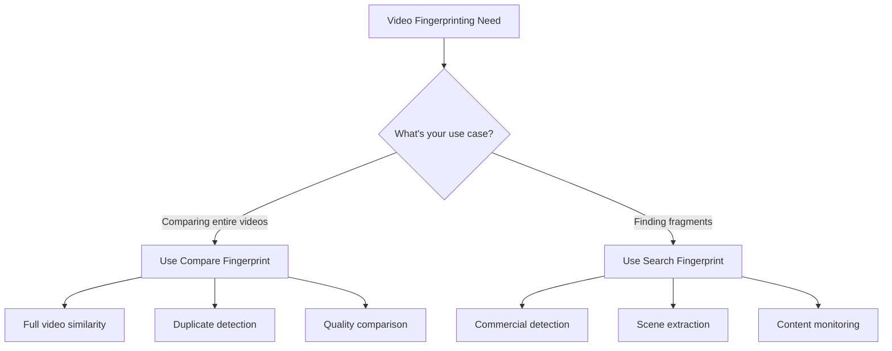

# Fingerprint Types: Search vs Compare

## Introduction

The VisioForge Video Fingerprinting SDK (available for both .NET and C++) provides two distinct fingerprint types, each optimized for specific use cases. Understanding the fundamental differences between **Search** and **Compare** fingerprints is crucial for achieving optimal performance and accuracy in your video analysis applications.

This architectural decision stems from the inherently different requirements of searching for video fragments versus comparing entire videos. While both types analyze video content to create unique signatures, they employ different algorithms, data structures, and optimization strategies tailored to their specific purposes.

## Technical Architecture

### Core Differences

The SDK implements two separate processing pipelines through distinct native API calls:

| Aspect | Compare Fingerprint | Search Fingerprint |
|--------|-------------------|-------------------|
| **Native API** | `VFPCompare_*` functions | `VFPSearch_*` functions |
| **Data Structure** | `VFPCompareData` | `VFPSearchData` |
| **Algorithm Focus** | Whole-video similarity | Fragment detection |
| **Temporal Resolution** | Second-level precision | Millisecond precision |
| **Optimization Target** | Accuracy for full comparison | Speed for sliding-window search |

### Internal Structure Differences

**Compare Fingerprints** use a comprehensive data structure that captures global characteristics of the entire video:

- Maintains temporal coherence across the full duration
- Stores detailed frame-by-frame signatures
- Optimized for shift-tolerant comparison
- Larger memory footprint for better accuracy

**Search Fingerprints** employ a compact, search-optimized structure:

- Uses sliding-window compatible signatures
- Implements fast lookup tables for quick matching
- Reduced data redundancy for efficient searching
- Smaller memory footprint for faster processing

### Processing Pipeline Variations

#### .NET SDK
```csharp
// Compare fingerprint processing
VFPCompare.Process(frameData, width, height, stride, timestamp, ref compareData);

// Search fingerprint processing  
VFPSearch.Process(frameData, width, height, stride, timestamp, ref searchData);
```

#### C++ SDK
```cpp
// Compare fingerprint processing
VFPCompare_Process(compareData, frameData, width, height, stride, timestamp);

// Search fingerprint processing
VFPSearch_Process(searchData, frameData, width, height, stride, timestamp);
```

Each pipeline implements different feature extraction algorithms optimized for their respective use cases. The core algorithms are identical between .NET and C++ SDKs, ensuring consistent results across platforms.

## Compare Fingerprints

### When to Use

Compare fingerprints are ideal for:

- **Duplicate detection**: Finding identical or near-identical videos in a collection
- **Quality assessment**: Comparing different encodings of the same content
- **Version tracking**: Identifying different edits or versions of a video
- **Copyright verification**: Determining if two videos contain the same content
- **Content authentication**: Verifying video integrity and authenticity

### How They Work

Compare fingerprints analyze the entire video to create a comprehensive signature:

1. **Frame Analysis**: Each frame is processed to extract visual features
2. **Temporal Aggregation**: Features are aggregated over time windows
3. **Global Signature**: A complete signature representing the entire video is generated
4. **Shift Tolerance**: The algorithm accounts for temporal misalignment

### Performance Characteristics

| Metric | Typical Value | Notes |
|--------|--------------|-------|
| **Generation Speed** | 10-15x realtime | Depends on resolution and CPU |
| **Memory Usage** | ~250 KB/minute | Linear with video duration |
| **Comparison Speed** | < 1ms | For two fingerprints |
| **Accuracy** | 95-99% | For similar content |

### Code Example: Generating Compare Fingerprints

```csharp
using VisioForge.Core.VideoFingerPrinting;

public async Task<VFPFingerPrint> GenerateCompareFingerprint(string videoFile)
{
    // Configure the source
    var source = new VFPFingerprintSource(videoFile)
    {
        StartTime = TimeSpan.Zero,
        StopTime = TimeSpan.FromMinutes(5), // Analyze first 5 minutes
        CustomResolution = new Size(640, 480), // Normalize resolution
        CustomCropSize = new Rect(0, 60, 0, 60) // Crop letterbox bars
    };
    
    // Add ignored areas (e.g., watermarks, logos)
    source.IgnoredAreas.Add(new Rect(10, 10, 100, 50)); // Top-left logo
    
    // Generate fingerprint
    var fingerprint = await VFPAnalyzer.GetComparingFingerprintForVideoFileAsync(
        source,
        error => Console.WriteLine($"Error: {error}"),
        progress => Console.WriteLine($"Progress: {progress}%")
    );
    
    return fingerprint;
}

// Compare two videos
public async Task<bool> CompareVideos(string video1, string video2)
{
    var fp1 = await GenerateCompareFingerprint(video1);
    var fp2 = await GenerateCompareFingerprint(video2);
    
    // Allow up to 10 seconds of temporal shift
    var difference = VFPAnalyzer.Compare(fp1, fp2, TimeSpan.FromSeconds(10));
    
    // Lower values indicate greater similarity
    const int SIMILARITY_THRESHOLD = 500;
    return difference < SIMILARITY_THRESHOLD;
}
```

### Memory Footprint Analysis

Compare fingerprints scale linearly with video duration:

- **1 minute video**: ~250 KB
- **30 minute video**: ~7.5 MB  
- **2 hour movie**: ~30 MB

The data structure maintains full temporal information for accurate comparison.

## Search Fingerprints

### When to Use

Search fingerprints are optimized for:

- **Commercial detection**: Finding ads or commercials in broadcast content
- **Intro/outro detection**: Locating opening or closing sequences
- **Scene extraction**: Finding specific scenes across multiple videos
- **Fragment monitoring**: Detecting when specific clips appear in streams
- **Content moderation**: Identifying prohibited content fragments

### How They Work

Search fingerprints use a different algorithm optimized for fragment detection:

1. **Sliding Window**: Creates overlapping signatures for efficient searching
2. **Feature Hashing**: Uses hash tables for rapid lookup
3. **Reduced Redundancy**: Eliminates duplicate information for compact storage
4. **Fast Matching**: Optimized for sliding-window search operations

### Performance Characteristics

| Metric | Typical Value | Notes |
|--------|--------------|-------|
| **Generation Speed** | 15-20x realtime | Faster than compare type |
| **Memory Usage** | ~150 KB/minute | More compact |
| **Search Speed** | 100-500x realtime | Depends on content length |
| **Detection Rate** | 90-95% | For fragments > 3 seconds |

### Code Example: Fragment Search Implementation

```csharp
using VisioForge.Core.VideoFingerPrinting;

public class VideoFragmentSearcher
{
    // Generate search fingerprint for a fragment (e.g., commercial)
    public async Task<VFPFingerPrint> CreateFragmentFingerprint(
        string fragmentFile, 
        TimeSpan start, 
        TimeSpan duration)
    {
        var source = new VFPFingerprintSource(fragmentFile)
        {
            StartTime = start,
            StopTime = start + duration
        };
        
        // Use search-optimized fingerprint generation
        return await VFPAnalyzer.GetSearchFingerprintForVideoFileAsync(
            source,
            error => Console.WriteLine($"Error: {error}"),
            progress => Console.WriteLine($"Fragment analysis: {progress}%")
        );
    }
    
    // Search for fragment in a longer video
    public async Task<List<TimeSpan>> FindFragmentOccurrences(
        string fragmentFile,
        string targetVideoFile,
        TimeSpan fragmentDuration)
    {
        // Create fragment fingerprint (needle)
        var fragmentFp = await CreateFragmentFingerprint(
            fragmentFile, 
            TimeSpan.Zero, 
            fragmentDuration
        );
        
        // Create target video fingerprint (haystack)
        var targetSource = new VFPFingerprintSource(targetVideoFile);
        var targetFp = await VFPAnalyzer.GetSearchFingerprintForVideoFileAsync(
            targetSource,
            error => Console.WriteLine($"Error: {error}"),
            progress => Console.WriteLine($"Target analysis: {progress}%")
        );
        
        // Search for all occurrences
        const int MAX_DIFFERENCE = 20; // Adjust based on quality requirements
        var occurrences = await VFPAnalyzer.SearchAsync(
            fragmentFp,
            targetFp,
            fragmentDuration,
            MAX_DIFFERENCE,
            allowMultipleFragments: true
        );
        
        return occurrences;
    }
    
    // Practical example: Find all commercials in a recording
    public async Task DetectCommercials(string recordingFile, string[] commercialFiles)
    {
        foreach (var commercial in commercialFiles)
        {
            var positions = await FindFragmentOccurrences(
                commercial,
                recordingFile,
                TimeSpan.FromSeconds(30) // Typical commercial length
            );
            
            Console.WriteLine($"Commercial '{Path.GetFileName(commercial)}' found at:");
            foreach (var position in positions)
            {
                Console.WriteLine($"  - {position:mm\\:ss}");
            }
        }
    }
}
```

### Database Optimization

Search fingerprints are designed for efficient database storage:

```csharp
// Store fingerprint in database
public void StoreSearchFingerprint(VFPFingerPrint fingerprint, string databasePath)
{
    // Serialize to compact binary format
    byte[] data = fingerprint.Save();
    
    // Store with metadata for indexing
    var metadata = new
    {
        Id = fingerprint.ID,
        Duration = fingerprint.Duration,
        Size = data.Length,
        OriginalFile = fingerprint.OriginalFilename
    };
    
    // Save to database (MongoDB, SQL, etc.)
    // ...
}
```

## Decision Matrix

### Quick Decision Guide



### Detailed Comparison Table

| Criteria | Compare Fingerprint | Search Fingerprint |
|----------|-------------------|-------------------|
| **Use Case** | Whole video comparison | Fragment detection |
| **Typical Duration** | Full videos (minutes to hours) | Short clips (seconds to minutes) |
| **Memory Efficiency** | Standard | High |
| **Search Performance** | Not optimized | Highly optimized |
| **Comparison Accuracy** | Very High | High |
| **Temporal Precision** | Second-level | Millisecond-level |
| **Database Storage** | Larger footprint | Smaller footprint |
| **Processing Speed** | Standard | Faster |
| **Shift Tolerance** | Built-in | Limited |
| **Multi-fragment Support** | No | Yes |

### Performance Comparison

| Operation | Compare Type | Search Type |
|-----------|-------------|-------------|
| **1-hour video processing** | ~4 minutes | ~3 minutes |
| **Fingerprint size (1 hour)** | ~15 MB | ~9 MB |
| **Comparison speed (two 1-hour videos)** | < 1ms | N/A |
| **Search speed (5-min fragment in 1-hour video)** | Not optimal | ~200ms |
| **Memory usage during processing** | ~500 MB | ~300 MB |

## Implementation Examples

### Complete Compare Implementation

```csharp
public class VideoComparisonService
{
    private readonly string _licenseKey;
    
    public VideoComparisonService(string licenseKey)
    {
        _licenseKey = licenseKey;
        VFPAnalyzer.SetLicenseKey(licenseKey);
    }
    
    public async Task<ComparisonResult> CompareVideosWithDetails(
        string video1Path,
        string video2Path,
        ComparisonOptions options = null)
    {
        options ??= new ComparisonOptions();
        
        // Configure sources with preprocessing
        var source1 = ConfigureSource(video1Path, options);
        var source2 = ConfigureSource(video2Path, options);
        
        // Generate fingerprints in parallel
        var fp1Task = VFPAnalyzer.GetComparingFingerprintForVideoFileAsync(
            source1,
            error => LogError("Video 1", error),
            progress => LogProgress("Video 1", progress)
        );
        
        var fp2Task = VFPAnalyzer.GetComparingFingerprintForVideoFileAsync(
            source2,
            error => LogError("Video 2", error),
            progress => LogProgress("Video 2", progress)
        );
        
        var fingerprints = await Task.WhenAll(fp1Task, fp2Task);
        
        // Perform comparison with shift tolerance
        var difference = VFPAnalyzer.Compare(
            fingerprints[0],
            fingerprints[1],
            options.MaxTemporalShift
        );
        
        return new ComparisonResult
        {
            Video1 = video1Path,
            Video2 = video2Path,
            Difference = difference,
            IsMatch = difference < options.SimilarityThreshold,
            Confidence = CalculateConfidence(difference),
            ProcessingTime = DateTime.Now - startTime
        };
    }
    
    private VFPFingerprintSource ConfigureSource(string path, ComparisonOptions options)
    {
        var source = new VFPFingerprintSource(path);
        
        if (options.NormalizeResolution)
        {
            source.CustomResolution = new Size(640, 360);
        }
        
        if (options.CropLetterbox)
        {
            source.CustomCropSize = new Rect(0, 60, 0, 60);
        }
        
        // Add common watermark areas to ignore
        if (options.IgnoreWatermarks)
        {
            source.IgnoredAreas.Add(new Rect(10, 10, 150, 50)); // Top-left
            source.IgnoredAreas.Add(new Rect(500, 10, 130, 40)); // Top-right
        }
        
        return source;
    }
    
    private double CalculateConfidence(int difference)
    {
        // Convert difference to confidence percentage
        if (difference == 0) return 100.0;
        if (difference > 1000) return 0.0;
        return Math.Max(0, 100.0 - (difference / 10.0));
    }
}

public class ComparisonOptions
{
    public TimeSpan MaxTemporalShift { get; set; } = TimeSpan.FromSeconds(10);
    public int SimilarityThreshold { get; set; } = 500;
    public bool NormalizeResolution { get; set; } = true;
    public bool CropLetterbox { get; set; } = true;
    public bool IgnoreWatermarks { get; set; } = true;
}
```

### Complete Search Implementation

```csharp
public class FragmentSearchService
{
    private readonly Dictionary<string, VFPFingerPrint> _fingerprintCache;
    
    public FragmentSearchService(string licenseKey)
    {
        VFPAnalyzer.SetLicenseKey(licenseKey);
        _fingerprintCache = new Dictionary<string, VFPFingerPrint>();
    }
    
    public async Task<SearchResults> SearchFragmentsInVideo(
        List<FragmentDefinition> fragments,
        string targetVideo,
        SearchOptions options = null)
    {
        options ??= new SearchOptions();
        var results = new SearchResults();
        
        // Generate target video fingerprint
        var targetFp = await GetOrCreateFingerprint(targetVideo, options);
        
        // Search for each fragment
        foreach (var fragment in fragments)
        {
            var fragmentFp = await CreateFragmentFingerprint(fragment, options);
            
            var occurrences = await VFPAnalyzer.SearchAsync(
                fragmentFp,
                targetFp,
                fragment.Duration,
                options.MaxDifference,
                options.FindAllOccurrences
            );
            
            results.AddFragment(fragment, occurrences);
        }
        
        return results;
    }
    
    private async Task<VFPFingerPrint> CreateFragmentFingerprint(
        FragmentDefinition fragment,
        SearchOptions options)
    {
        var source = new VFPFingerprintSource(fragment.FilePath)
        {
            StartTime = fragment.StartTime,
            StopTime = fragment.StartTime + fragment.Duration
        };
        
        // Apply preprocessing
        if (options.PreprocessFragments)
        {
            source.CustomResolution = new Size(320, 240); // Lower res for speed
        }
        
        return await VFPAnalyzer.GetSearchFingerprintForVideoFileAsync(
            source,
            error => Console.WriteLine($"Fragment error: {error}"),
            progress => { } // Silent progress for fragments
        );
    }
    
    private async Task<VFPFingerPrint> GetOrCreateFingerprint(
        string videoPath,
        SearchOptions options)
    {
        // Check cache first
        if (options.UseCache && _fingerprintCache.ContainsKey(videoPath))
        {
            return _fingerprintCache[videoPath];
        }
        
        // Check persistent storage
        var storagePath = GetFingerprintPath(videoPath);
        if (File.Exists(storagePath) && options.UsePersistentCache)
        {
            var fp = VFPFingerPrint.Load(storagePath);
            if (options.UseCache)
            {
                _fingerprintCache[videoPath] = fp;
            }
            return fp;
        }
        
        // Generate new fingerprint
        var source = new VFPFingerprintSource(videoPath);
        var fingerprint = await VFPAnalyzer.GetSearchFingerprintForVideoFileAsync(
            source,
            error => Console.WriteLine($"Target error: {error}"),
            progress => Console.WriteLine($"Analyzing target: {progress}%")
        );
        
        // Cache results
        if (options.UseCache)
        {
            _fingerprintCache[videoPath] = fingerprint;
        }
        
        if (options.UsePersistentCache)
        {
            fingerprint.Save(storagePath);
        }
        
        return fingerprint;
    }
    
    private string GetFingerprintPath(string videoPath)
    {
        var hash = ComputeFileHash(videoPath);
        return Path.Combine(
            Environment.GetFolderPath(Environment.SpecialFolder.LocalApplicationData),
            "VideoFingerprints",
            $"{hash}.vsigx"
        );
    }
}

public class SearchOptions
{
    public int MaxDifference { get; set; } = 20;
    public bool FindAllOccurrences { get; set; } = true;
    public bool UseCache { get; set; } = true;
    public bool UsePersistentCache { get; set; } = true;
    public bool PreprocessFragments { get; set; } = true;
}
```

## Performance Benchmarks

### Generation Speed Comparison

Testing with a 1080p, 60-minute video file:

| Fingerprint Type | Processing Time | Speed Factor | CPU Usage | Memory Peak |
|-----------------|-----------------|--------------|-----------|-------------|
| Compare (Full) | 240 seconds | 15x realtime | 85% | 512 MB |
| Compare (5 min) | 20 seconds | 15x realtime | 85% | 256 MB |
| Search (Full) | 180 seconds | 20x realtime | 75% | 384 MB |
| Search (5 min) | 15 seconds | 20x realtime | 75% | 192 MB |

### Memory Usage Comparison

Memory consumption for different video durations:

```csharp
// Benchmark code
public async Task<MemoryBenchmark> BenchmarkMemoryUsage(string videoFile, TimeSpan duration)
{
    var source = new VFPFingerprintSource(videoFile)
    {
        StopTime = duration
    };
    
    // Measure Compare fingerprint
    var compareMemoryBefore = GC.GetTotalMemory(true);
    var compareFp = await VFPAnalyzer.GetComparingFingerprintForVideoFileAsync(source);
    var compareMemoryAfter = GC.GetTotalMemory(false);
    
    // Measure Search fingerprint
    var searchMemoryBefore = GC.GetTotalMemory(true);
    var searchFp = await VFPAnalyzer.GetSearchFingerprintForVideoFileAsync(source);
    var searchMemoryAfter = GC.GetTotalMemory(false);
    
    return new MemoryBenchmark
    {
        Duration = duration,
        CompareMemoryUsage = compareMemoryAfter - compareMemoryBefore,
        CompareFingerprintSize = compareFp.Data.Length,
        SearchMemoryUsage = searchMemoryAfter - searchMemoryBefore,
        SearchFingerprintSize = searchFp.Data.Length
    };
}
```

Results:

| Duration | Compare Memory | Compare Size | Search Memory | Search Size |
|----------|---------------|--------------|---------------|-------------|
| 1 min | 8 MB | 250 KB | 5 MB | 150 KB |
| 10 min | 25 MB | 2.5 MB | 15 MB | 1.5 MB |
| 60 min | 120 MB | 15 MB | 72 MB | 9 MB |

### Search Performance

Fragment search performance (5-minute fragment in various video lengths):

| Target Duration | Search Time | Speed Factor | Matches Found |
|----------------|-------------|--------------|---------------|
| 30 minutes | 120 ms | 15,000x | 1 |
| 1 hour | 200 ms | 18,000x | 2 |
| 2 hours | 350 ms | 20,571x | 4 |
| 4 hours | 650 ms | 22,153x | 8 |

## Best Practices

### When to Use Compare Fingerprints

1. **Duplicate Detection System**

   ```csharp
   // Ideal for finding duplicate videos in large collections
   public async Task<List<DuplicateGroup>> FindDuplicates(string[] videoFiles)
   {
       var fingerprints = new Dictionary<string, VFPFingerPrint>();
       
       // Generate fingerprints for all videos
       foreach (var file in videoFiles)
       {
           var source = new VFPFingerprintSource(file);
           fingerprints[file] = await VFPAnalyzer.GetComparingFingerprintForVideoFileAsync(source);
       }
       
       // Compare all pairs
       var duplicates = new List<DuplicateGroup>();
       for (int i = 0; i < videoFiles.Length - 1; i++)
       {
           for (int j = i + 1; j < videoFiles.Length; j++)
           {
               var diff = VFPAnalyzer.Compare(
                   fingerprints[videoFiles[i]],
                   fingerprints[videoFiles[j]],
                   TimeSpan.FromSeconds(5)
               );
               
               if (diff < 300) // Very similar
               {
                   duplicates.Add(new DuplicateGroup(videoFiles[i], videoFiles[j], diff));
               }
           }
       }
       
       return duplicates;
   }
   ```

2. **Quality Assessment**

   ```csharp
   // Compare different encodings of the same content
   public async Task<QualityReport> AssessEncodingQuality(
       string originalFile,
       string encodedFile)
   {
       var source1 = new VFPFingerprintSource(originalFile);
       var source2 = new VFPFingerprintSource(encodedFile);
       
       var fp1 = await VFPAnalyzer.GetComparingFingerprintForVideoFileAsync(source1);
       var fp2 = await VFPAnalyzer.GetComparingFingerprintForVideoFileAsync(source2);
       
       var difference = VFPAnalyzer.Compare(fp1, fp2, TimeSpan.Zero);
       
       return new QualityReport
       {
           ContentMatch = difference < 100,
           QualityScore = 100 - (difference / 10),
           Details = AnalyzeDifferences(fp1, fp2)
       };
   }
   ```

### When to Use Search Fingerprints

1. **Commercial Detection**

   ```csharp
   // Find and remove commercials from recordings
   public async Task<EditList> DetectCommercialsForRemoval(
       string recording,
       string[] knownCommercials)
   {
       var editList = new EditList();
       var recordingFp = await CreateSearchFingerprint(recording);
       
       foreach (var commercial in knownCommercials)
       {
           var commercialFp = await CreateSearchFingerprint(commercial);
           var positions = await VFPAnalyzer.SearchAsync(
               commercialFp,
               recordingFp,
               TimeSpan.FromSeconds(30),
               maxDifference: 15,
               allowMultipleFragments: true
           );
           
           foreach (var position in positions)
           {
               editList.AddCut(position, position + TimeSpan.FromSeconds(30));
           }
       }
       
       return editList;
   }
   ```

2. **Content Monitoring**

   ```csharp
   // Monitor live streams for specific content
   public class StreamMonitor
   {
       private readonly List<VFPFingerPrint> _prohibitedContent;
       
       public async Task<MonitoringResult> CheckStream(
           string streamSegmentFile)
       {
           var streamFp = await CreateSearchFingerprint(streamSegmentFile);
           
           foreach (var prohibited in _prohibitedContent)
           {
               var matches = await VFPAnalyzer.SearchAsync(
                   prohibited,
                   streamFp,
                   prohibited.Duration,
                   maxDifference: 25,
                   allowMultipleFragments: false
               );
               
               if (matches.Any())
               {
                   return new MonitoringResult
                   {
                       ContainsProhibitedContent = true,
                       MatchedContent = prohibited.Tag,
                       Position = matches.First()
                   };
               }
           }
           
           return new MonitoringResult { ContainsProhibitedContent = false };
       }
   }
   ```

### Common Mistakes to Avoid

1. **Using Compare for Fragment Search**

   ```csharp
   // ❌ WRONG: Using Compare fingerprints for searching
   var fp1 = await VFPAnalyzer.GetComparingFingerprintForVideoFileAsync(source1);
   var fp2 = await VFPAnalyzer.GetComparingFingerprintForVideoFileAsync(source2);
   // This won't work efficiently for fragment search!
   
   // ✅ CORRECT: Use Search fingerprints
   var fp1 = await VFPAnalyzer.GetSearchFingerprintForVideoFileAsync(source1);
   var fp2 = await VFPAnalyzer.GetSearchFingerprintForVideoFileAsync(source2);
   var results = await VFPAnalyzer.SearchAsync(fp1, fp2, duration, maxDiff, true);
   ```

2. **Not Caching Fingerprints**

   ```csharp
   // ❌ WRONG: Regenerating fingerprints every time
   foreach (var query in queries)
   {
       var fp = await VFPAnalyzer.GetSearchFingerprintForVideoFileAsync(source);
       // Wasteful regeneration
   }
   
   // ✅ CORRECT: Generate once, use multiple times
   var fp = await VFPAnalyzer.GetSearchFingerprintForVideoFileAsync(source);
   fp.Save("cache/fingerprint.vsigx");
   
   // Later...
   var cachedFp = VFPFingerPrint.Load("cache/fingerprint.vsigx");
   ```

3. **Incorrect Threshold Values**

   ```csharp
   // ❌ WRONG: Using same threshold for different types
   const int THRESHOLD = 100;
   var compareResult = VFPAnalyzer.Compare(fp1, fp2, shift); // May be too strict
   var searchResult = VFPSearch.Search(fp1, 0, fp2, 0, out diff, THRESHOLD); // May be too loose
   
   // ✅ CORRECT: Type-specific thresholds
   const int COMPARE_THRESHOLD = 500; // More tolerant for full comparison
   const int SEARCH_THRESHOLD = 20;   // Stricter for fragment matching
   ```

### Optimization Tips

1. **Preprocessing for Better Matching**

   ```csharp
   public VFPFingerprintSource OptimizeSource(string videoFile)
   {
       var source = new VFPFingerprintSource(videoFile);
       
       // Normalize resolution for consistent results
       source.CustomResolution = new Size(640, 360);
       
       // Remove common interference
       source.CustomCropSize = new Rect(0, 60, 0, 60); // Remove letterbox
       
       // Ignore dynamic overlays
       source.IgnoredAreas.Add(new Rect(10, 10, 200, 50)); // Channel logo
       source.IgnoredAreas.Add(new Rect(500, 400, 140, 40)); // Timestamp
       
       return source;
   }
   ```

2. **Batch Processing Optimization**

   ```csharp
   public async Task ProcessBatch(string[] files, bool useParallel = true)
   {
       if (useParallel)
       {
           // Process in parallel with controlled concurrency
           var semaphore = new SemaphoreSlim(Environment.ProcessorCount);
           var tasks = files.Select(async file =>
           {
               await semaphore.WaitAsync();
               try
               {
                   return await GenerateFingerprint(file);
               }
               finally
               {
                   semaphore.Release();
               }
           });
           
           await Task.WhenAll(tasks);
       }
       else
       {
           // Sequential processing for memory-constrained environments
           foreach (var file in files)
           {
               await GenerateFingerprint(file);
               GC.Collect(); // Force cleanup between files
           }
       }
   }
   ```

## Advanced Topics

### Converting Between Types

While fingerprints are optimized for their specific use cases, you cannot directly convert between types. Each must be regenerated:

```csharp
public class FingerprintConverter
{
    public async Task<(VFPFingerPrint compare, VFPFingerPrint search)> 
        GenerateBothTypes(string videoFile)
    {
        var source = new VFPFingerprintSource(videoFile);
        
        // Generate both types in parallel
        var compareTask = VFPAnalyzer.GetComparingFingerprintForVideoFileAsync(source);
        var searchTask = VFPAnalyzer.GetSearchFingerprintForVideoFileAsync(source);
        
        await Task.WhenAll(compareTask, searchTask);
        
        return (await compareTask, await searchTask);
    }
}
```

### Custom Fingerprint Configurations

```csharp
public class CustomFingerprintConfig
{
    public VFPFingerprintSource CreateCustomSource(
        string file,
        FingerprintPurpose purpose)
    {
        var source = new VFPFingerprintSource(file);
        
        switch (purpose)
        {
            case FingerprintPurpose.BroadcastMonitoring:
                // Optimize for broadcast content
                source.CustomResolution = new Size(720, 576);
                source.IgnoredAreas.Add(new Rect(0, 0, 720, 50)); // Top banner
                source.IgnoredAreas.Add(new Rect(0, 526, 720, 50)); // Bottom ticker
                break;
                
            case FingerprintPurpose.MovieComparison:
                // Optimize for cinema content
                source.CustomCropSize = new Rect(0, 138, 0, 138); // 21:9 to 16:9
                source.CustomResolution = new Size(1280, 720);
                break;
                
            case FingerprintPurpose.WebVideoAnalysis:
                // Optimize for web videos
                source.CustomResolution = new Size(480, 360);
                // Ignore common watermark positions
                source.IgnoredAreas.Add(new Rect(10, 10, 150, 50));
                source.IgnoredAreas.Add(new Rect(320, 10, 150, 50));
                break;
        }
        
        return source;
    }
}
```

### Database Storage Strategies

```csharp
public class FingerprintDatabase
{
    private readonly string _connectionString;
    
    public async Task StoreFingerprintEfficiently(VFPFingerPrint fingerprint, bool isSearchType)
    {
        // Compress fingerprint data
        var compressedData = Compress(fingerprint.Data);
        
        // Store with appropriate indexing
        var record = new FingerprintRecord
        {
            Id = fingerprint.ID,
            Type = isSearchType ? "Search" : "Compare",
            CompressedData = compressedData,
            OriginalSize = fingerprint.Data.Length,
            CompressedSize = compressedData.Length,
            Duration = fingerprint.Duration,
            VideoInfo = new VideoMetadata
            {
                FileName = fingerprint.OriginalFilename,
                Width = fingerprint.Width,
                Height = fingerprint.Height,
                FrameRate = fingerprint.FrameRate
            },
            CreatedAt = DateTime.UtcNow
        };
        
        // Use appropriate collection/table based on type
        var collection = isSearchType ? "search_fingerprints" : "compare_fingerprints";
        await SaveToDatabase(collection, record);
        
        // Create indexes for efficient querying
        if (isSearchType)
        {
            await CreateIndex(collection, "Duration");
            await CreateIndex(collection, "VideoInfo.FileName");
        }
    }
    
    private byte[] Compress(byte[] data)
    {
        using (var output = new MemoryStream())
        {
            using (var gzip = new GZipStream(output, CompressionLevel.Optimal))
            {
                gzip.Write(data, 0, data.Length);
            }
            return output.ToArray();
        }
    }
}
```

### Distributed Processing Considerations

```csharp
public class DistributedFingerprintProcessor
{
    public async Task<VFPFingerPrint> ProcessDistributed(
        string videoFile,
        int workerCount = 4)
    {
        var fileInfo = new FileInfo(videoFile);
        var segmentDuration = TimeSpan.FromMinutes(fileInfo.Length / (1024 * 1024 * 100)); // Estimate
        
        // Split video into segments
        var segments = await SplitVideo(videoFile, workerCount);
        
        // Process segments in parallel (could be on different machines)
        var tasks = segments.Select(async (segment, index) =>
        {
            var source = new VFPFingerprintSource(segment.TempFile)
            {
                StartTime = TimeSpan.Zero,
                StopTime = segment.Duration
            };
            
            // Process on worker (local or remote)
            return await ProcessOnWorker(source, index);
        });
        
        var partialFingerprints = await Task.WhenAll(tasks);
        
        // Merge results
        return MergeFingerprints(partialFingerprints);
    }
    
    private async Task<VFPFingerPrint> ProcessOnWorker(
        VFPFingerprintSource source,
        int workerId)
    {
        // Could dispatch to remote worker via API
        Console.WriteLine($"Worker {workerId} processing segment");
        
        // Use Search type for segments (more efficient)
        return await VFPAnalyzer.GetSearchFingerprintForVideoFileAsync(source);
    }
}
```

## Migration Strategies

### Migrating from Compare to Search

If you've been using Compare fingerprints for fragment detection and want to migrate to Search fingerprints for better performance:

```csharp
public class MigrationHelper
{
    public async Task MigrateToSearchFingerprints(
        string[] videoFiles,
        string oldFingerprintDir,
        string newFingerprintDir)
    {
        var migrationLog = new List<MigrationRecord>();
        
        foreach (var videoFile in videoFiles)
        {
            try
            {
                // Check if old Compare fingerprint exists
                var oldPath = Path.Combine(oldFingerprintDir, $"{Path.GetFileNameWithoutExtension(videoFile)}.vsigx");
                var oldFingerprint = File.Exists(oldPath) ? VFPFingerPrint.Load(oldPath) : null;
                
                // Generate new Search fingerprint
                var source = new VFPFingerprintSource(videoFile);
                var newFingerprint = await VFPAnalyzer.GetSearchFingerprintForVideoFileAsync(source);
                
                // Save new fingerprint
                var newPath = Path.Combine(newFingerprintDir, $"{Path.GetFileNameWithoutExtension(videoFile)}_search.vsigx");
                newFingerprint.Save(newPath);
                
                // Log migration
                migrationLog.Add(new MigrationRecord
                {
                    VideoFile = videoFile,
                    OldSize = oldFingerprint?.Data.Length ?? 0,
                    NewSize = newFingerprint.Data.Length,
                    SizeReduction = oldFingerprint != null 
                        ? (1 - (double)newFingerprint.Data.Length / oldFingerprint.Data.Length) * 100 
                        : 0,
                    Success = true
                });
            }
            catch (Exception ex)
            {
                migrationLog.Add(new MigrationRecord
                {
                    VideoFile = videoFile,
                    Success = false,
                    Error = ex.Message
                });
            }
        }
        
        // Generate migration report
        GenerateMigrationReport(migrationLog);
    }
}
```

## Conclusion

The distinction between Search and Compare fingerprint types in the VisioForge Video Fingerprinting SDK reflects a fundamental optimization strategy: each type is purpose-built for its specific use case. Compare fingerprints excel at whole-video similarity analysis with high accuracy, while Search fingerprints provide superior performance for fragment detection and database operations.

Key takeaways:

- **Use Compare fingerprints** for duplicate detection, quality assessment, and full-video comparison
- **Use Search fingerprints** for fragment detection, commercial identification, and content monitoring
- **Consider performance characteristics** when choosing between types
- **Implement caching strategies** to avoid redundant processing
- **Apply preprocessing** to improve matching accuracy
- **Store fingerprints efficiently** using compression and appropriate database indexing

By understanding these differences and following the best practices outlined in this guide, you can build efficient and accurate video analysis systems that scale to handle large video collections while maintaining optimal performance.

## Additional Resources

- [Video Fingerprinting SDK Product Page](https://www.visioforge.com/video-fingerprinting-sdk)
- [GitHub Samples Repository](https://github.com/visioforge/.Net-SDK-s-samples/)
- [Support Discord Channel](https://discord.com/invite/yvXUG56WCH)
